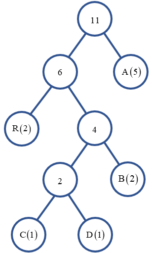
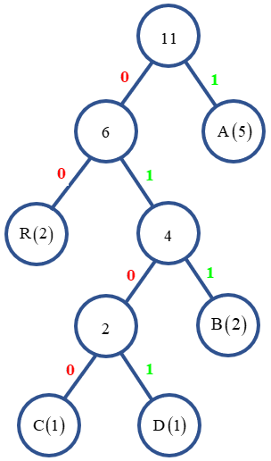

# <center><div class = "titre5">Activités de découverte sur la compression</div></center>

## <center><div class = "encadré7a">__Activité 1 : les marmottes ont le sommeil léger__</div></center>


!!! exercice5 "__Exercice 1__"
    <div class="list5">

    1.  Regarder la vidéo suivante :
    <br>
    <br>
    <center>
    <video width="480" height="285"  controls>
    <source src="videos/video1.mp4" type="video/mp4">
    </video>   
    </center>
    <br>
    2. Construire alors l’arbre pour lequel le nombre de déplacements sera le plus petit possible (avec 4 chemins et 5 marmottes <div class="decal2">`#!python [2, 3, 5, 7, 8]`).</div>

    </div>

<center>

<div class = "encadré8">Rappel des règles</div>
</center>

!!! exemple4 "__Règle 1__" 
    À partir de l’entrée on peut construire deux couloirs, et au bout de chaque couloir on peut faire un embranchement vers deux autres, mais pas plus (au risque de faire s’écrouler l’édifice).

!!! exemple2 "__Règle 2__" 
    Les marmottes vont chacune occuper une salle différente (pour ne pas se réveiller les unes les autres) et forcément une salle qui est tout au bout d’un couloir. Pour des marmottes au sommeil léger il est inenvisageable de dormir dans une salle à un embranchement, car les marmottes qui seraient au-delà de cet embranchement leur marcheraient dessus en entrant/sortant, et cela ruinerait leur hibernation.

!!! exemple3 "__Règle 3__" 
    Chaque marmotte se réveille un nombre précis de fois dans l’hiver, et s’il n’est pas grave de mettre assez loin de l’entrée une marmotte qui ne se réveille (et donc ne sort du terrier) qu’une fois dans l’hiver, c’est bien plus embêtant de mettre loin une marmotte qui va se réveiller 10 fois par exemple. Comme les pas de marmottes émettent de légères vibrations et que nos marmottes ont vraiment le sommeil léger, on va vouloir minimiser les déplacements de l’ensemble du groupe.


??? solution "__Solution optimale__"
    
    !!! danger "__Remarque importante__"
        Cette vidéo ne doit être visionnée que lorsque vous pensez avoir trouvé la solution otimale !
    <center>
    <video width="480" height="285"  controls>
    <source src="videos/video2.mp4" type="video/mp4">
    </video>   
    </center>

!!! exercice5 "__Exercice 2__"
    Appliquer l'algorithme précédent avec 7 chemins et 8 marmottes `#!python [2, 2, 2, 4, 4, 5, 5, 6]`.

??? solution "__Solution__"
    <center>
    <video width="480" height="285"  controls>
    <source src="videos/video3.mp4" type="video/mp4">
    </video>   
    </center>

## <center><div class = "encadré7b">__Activité 2 : Construction de l’arbre d’Huffman sur un mot__</div></center>

!!! exercice5 "__Exercice 3__"
    <div class="list5">

    1.  Regarder la vidéo suivante :
    <br>
    <br>
    <center>
    <video width="480" height="285"  controls>
    <source src="videos/video4.mp4" type="video/mp4">
    </video>   
    </center>
    <br>
    2. A l'aide du programme Python ci-dessous, tirer au sort deux mots à coder parmi une liste de mots (mots longs avec des <div class="decal2">répétitions de caractères) :
        ```python
        import random

        maListe = ['TROTTINETTE', 'TUMULTUEUX', 'EVENEMENTIELLE', 'DEREGLEMENTER', 'INDIVISIBILITE', 'TURLUTUTU', 'EXTRATERRESTRE', 'REFRIGERATEUR', 'MILLEFEUILLE', 'LIBELLULE']
        random.shuffle(maListe)

        print(f"Vous allez coder les mots {maListe[0]} et {maListe[1]}")

        ```
        </div>
    3. Construire alors l’arbre de Huffman et la table de codage de chacun des deux mots obtenus.
    4. Coder les deux mots avec leur table respective.
    5. Noter sur une feuille les deux mots codés et les tables de codage correspondantes puis échanger ensuite cette feuille avec <div class="decal2">celle d'un autre groupe.</div>
    6. Décoder alors les mots de l'autre groupe connaissant uniquement la table de codage.

    </div>

??? tools2 "__Aide (si nécessaire)__"
    Exemple de codage d'un mot avec l'arbre d'Huffman.  
    Soit le mot __ABRACADABRA__.  

    !!! star1 "__Etape 1__"
        On compte pour chaque lettre de l’alphabet présent dans le mot le nombre de fois qu’elle apparaît dans le mot.
        <center>
        <table>
        <tr>
        <td align="center" style="vertical-align:middle; background-color:#757575; color:white"><b>Lettre</b></td>
        <td align="center" style="vertical-align:middle"><b>A</b></td>
        <td align="center" style="vertical-align:middle"><b>B</b></td>
        <td align="center" style="vertical-align:middle"><b>C</b></th>
        <td align="center" style="vertical-align:middle"><b>D</b></th>
        <td align="center" style="vertical-align:middle"><b>R</b></th>
        </tr>
        <tr>
        <th align="center" style="vertical-align:middle"><b>Occurrence</b></th>
        <td align="center" style="vertical-align:middle"><b>5</b></td>
        <td align="center" style="vertical-align:middle"><b>2</b></td>
        <td align="center" style="vertical-align:middle"><b>1</b></td>
        <td align="center" style="vertical-align:middle"><b>1</b></td>
        <td align="center" style="vertical-align:middle"><b>2</b></td>
        </tr>
        </table>
        </center>

    !!! star2 "__Etape 2__"
        On construit l'arbre :
        

    !!! star3 "__Etape 3__"
        On note :
        <div class="couleur_puce12">

        * <span style="color:red">0</span> les branches de gauche ;
        * <span style="color:green">1</span> les branches de droite.

        </div>
        

    !!! star4 "__Etape 4__"
        On construit la table de codage :
        <center>
        <table>
        <tr>
        <td align="center" style="vertical-align:middle; background-color:#757575; color:white"><b>Lettre</b></td>
        <td align="center" style="vertical-align:middle"><b>A</b></td>
        <td align="center" style="vertical-align:middle"><b>B</b></td>
        <td align="center" style="vertical-align:middle"><b>C</b></td>
        <td align="center" style="vertical-align:middle"><b>D</b></td>
        <td align="center" style="vertical-align:middle"><b>R</b></td>
        </tr>
        <tr>
        <th align="center" style="vertical-align:middle"><b>Code</b></th>
        <td align="center" style="vertical-align:middle"><b>$~~$$~~$<span style="color:green">1</span>$~~$$~~$</b></td>
        <td align="center" style="vertical-align:middle"><b>$~~$<span style="color:red">0</span><span style="color:green">1</span><span style="color:green">1</span>$~~$</b></td>
        <td align="center" style="vertical-align:middle"><b><span style="color:red">0</span><span style="color:green">1</span><span style="color:red">0</span><span style="color:red">0</span></b></td>
        <td align="center" style="vertical-align:middle"><b><span style="color:red">0</span><span style="color:green">1</span><span style="color:red">0</span><span style="color:green">1</span></b></td>
        <td align="center" style="vertical-align:middle"><b>$~~~$<span style="color:red">0</span><span style="color:red">0</span>$~~~$</b></td>
        </tr>
        </table>
        </center>

    !!! star5 "__Etape 5__"
        On peut alors coder le mot : 
        <b><span style="color:green">1</span><span style="color:red">0</span><span style="color:green">1</span><span style="color:green">1</span><span style="color:red">0</span><span style="color:red">0</span><span style="color:green">1</span><span style="color:red">0</span><span style="color:green">1</span><span style="color:red">0</span><span style="color:red">0</span><span style="color:green">1</span><span style="color:red">0</span><span style="color:green">1</span><span style="color:red">0</span><span style="color:green">1</span><span style="color:green">1</span><span style="color:red">0</span><span style="color:green">1</span><span style="color:green">1</span><span style="color:red">0</span><span style="color:red">0</span><span style="color:green">1</span></b>
