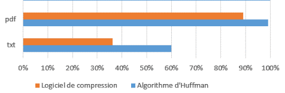

# <center><div class = "titre15">Banc d'essai de différents formats de fichiers</div></center>

### <div class="para">Préparation du programme</div>

On va passer au banc d’essai notre programme pour voir ses performances sur différents types de fichiers.  

On présentera les résultats sous la forme d’un histogramme comparant l’algorithme d’Huffman programmé et un logiciel de compression présent sur votre ordinateur.


Avant de commencer, étant donné que l’on va faire des tests sur des fichiers plus volumineux qu’auparavant, on va éviter d’afficher le texte compressé et l’arbre d’huffman dans la console.
<div class="couleur_puce16" markdown="1">

* Ajouter, si ce n’est déjà fait un `#!python #` __dans les fonctions__ devant les instructions :

</div>
<div class="couleur_puce16bis" markdown="1">

* D’affichage du type `#!python print` (sauf pour l’affichage du taux de compression).
* D’affichage de l’arbre d’Huffman.

</div>
<div class="couleur_puce16" markdown="1">

* Ajouter dans le programme principal une mesure du temps d’exécution :
<span style="display: block; margin: 0px 0px 0px 0.2em;" markdown="1">
```python
from time import *

start = time()

compresse("Fichiers_Banc_D_Essai/" + fichier + ".txt")
decompresse("Fichiers_Banc_D_Essai/" + fichier + ".huf", fichier + "_decompresse.txt")

end = time()
print(f"Durée {end - start} secs")
end = time()

```
Il faut bien entendu mettre le programme "__.py__" dans le même dossier que les fichiers à compresser.
</span>

</div>

### <div class="para">Compression d’un fichier <span style="font-family: 'Trebuchet MS' ; font-weight: bold">texte.txt</span> plus volumineux</div>

On va tester le programme avec un fichier texte (en utf-8) sur un livre :  
*The Mysterious Affair at Styles* d’Agatha Christie.

<div class="list10" markdown="1">

1. Télécharger et décompresser le fichier [<span style="font-family: 'Trebuchet MS' ; font-weight: bold">Fichiers_Banc_D_Essai.zip</span>](fichiers/Fichiers_Banc_D_Essai.zip).
2. En utilisant la fonction `#!python compresse()`, compresser le fichier <span style="font-family: 'Trebuchet MS' ; font-weight: bold">1_livre_a_christie.txt</span>.
3. Ouvrir le fichier [<span style="font-family: 'Trebuchet MS' ; font-weight: bold">comparaison_compression.xlsx</span>](fichiers/Comparaison_compression.zip) et compléter la première ligne.

</div>  
<div style="display: block; margin: 0px 0px 0px 2.5em;" markdown="1">

!!! note "__Remarque__"
    On prendra la taille du fichier "__.huf__" pour le fichier compressé du programme.

</div>
<div class="list10_4" markdown="1">

3. Compresser désormais le même fichier de départ (<span style="font-family: 'Trebuchet MS' ; font-weight: bold">1_livre_a_christie.txt</span>) avec un logiciel de compression disponible sur <span class="decal2">votre ordinateur et noter la taille du fichier obtenu.</span>

</div>

### <div class="para">Décompression d’un fichier<span style="font-family: 'Trebuchet MS' ; font-weight: bold"> texte.txt</span></div>
<div class="list10_5" markdown="1">

4. A l’aide du programme python, décompresser le fichier en utilisant dans la fonction `#!python decompresse()` les fichiers <span class="decal2"><span style="font-family: 'Trebuchet MS' ; font-weight: bold">1_livre_a_christie.huf</span> et <span style="font-family: 'Trebuchet MS' ; font-weight: bold">1_livre_a_christie.occ</span>.</span>  
<span style="display: block; margin: 10px 0px 0px 0.55em;" markdown="1">Regarder la taille du fichier décompressé. Est-ce qu’il y a une différence par rapport au fichier d’origine ?</span>

</div>

### <div class="para">Autres formats de fichier</div>
<div class="list10_6" markdown="1">

5. Remplir les différentes lignes du fichier <span style="font-family: 'Trebuchet MS' ; font-weight: bold">comparaison_compression.xlsx</span> pour voir les performances et comparer les résultats <span class="decal2">de l’algorithme d’Huffman avec un logiciel de compression.</span>  
<span style="display: block; margin: 10px 0px 0px 0.55em;" markdown="1">Calculer le taux de compression entre le fichier "__.zip__" et le fichier non compressé.</span>

</div>
<div style="display: block; margin: 0px 0px 0px 2.5em;" markdown="1">

!!! a-retenir "__Rappel__"    
    1 Mo = 1024 Ko  et  1 Ko = 1024 octets

!!! note "__Remarque__"
    Les fichiers images ont été créés pour obtenir des fichiers natifs. Des fichiers "__.bmp__" peuvent par exemple être des fichiers "__.jpg__" réenregistrés.

</div>
<div class="list10_7" markdown="1">

6. Quels sont les formats de fichier pour lesquels :

</div>
<div class="couleur_puce17" markdown="1">

* L’algorithme de Huffman est le plus performant ?
* L’algorithme de Huffman est le moins performant ?
* Il existe déjà une compression dans le format lui-même ?

</div>
