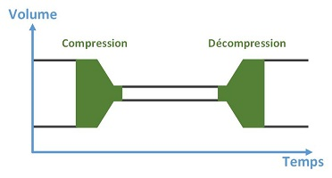
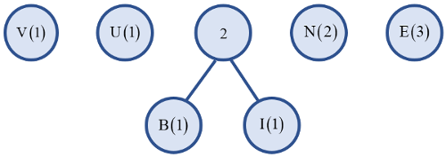
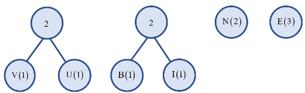
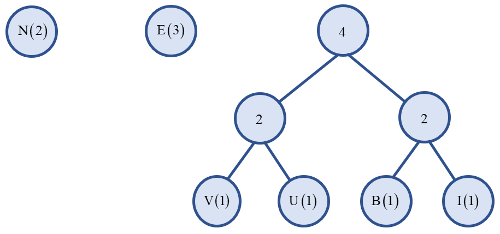
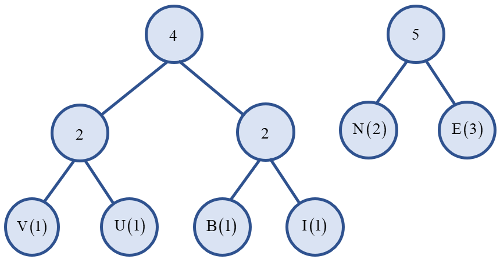
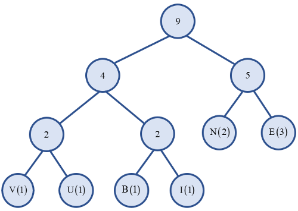
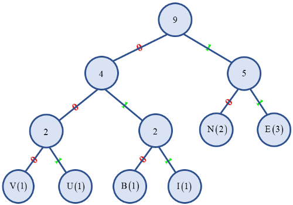

# 

La compression des données

## 
__Pourquoi compresser les données ?__

De nos jours, le volume gigantesque de données échangées sur internet, et stockées sur des serveurs ne serait possible sans la compression des données.  

En effet, une simple chanson pourrait prendre jusqu’à 150 Mo, ou 5 min de film 1Go, sans parler de l’ensemble des métadonnées, ...  

Outre le gain d'espace, la compression améliore la vitesse de transmission des données sur les réseaux. Elle permet donc de réduire les coûts matériels de stockage, mais aussi les coûts liés à la bande passante réseau.  

Elle donne lieu encore de nos jours à de nombreuses recherches en raison des enjeux économiques.

## 
__Les types de compression__

De nombreux algorithmes de compressions existent, chacun ayant sa particularité et surtout un type de données cible : images, vidéos, textes, exécutables, textes, ...  

En effet un algorithme de compression très efficace pour un fichier texte sera une catastrophe pour de la vidéo et inversement.  

Lors de la décompression, la reconstruction des données s’effectue par un algorithme inverse ou différent de celui de la compression.  

### 
__Compression symétrique / asymétrique__

??? book "__La compression symétrique__" 
    Dans ce cas, la compression et la décompression utilisent la même méthode, et nécessitent la même quantité de calculs.
    

??? book "__La compression asymétrique__" 
    Dans ce cas, la compression et la décompression ne demandent pas la même quantité de travail. Par exemple la compression en MP3 est plus lente que la décompression pour la lecture, idem pour les vidéos.

### 
__Compression avec / sans pertes__

??? book "__La compression sans perte (Lossless)__" 
    Les algorithmes de compression sans pertes permettent une reconstitution exacte de l’information après le cycle de compression / décompression. Ils s’utilisent pour les fichiers contenant du texte, les programmes informatiques (.exe), …  

    S'il est facile de citer des formats de compression connus sans pertes (__7z__, __Zip__, __Rar__, __Ace__, __Cab__, __gzip__, ...), on connaît moins le nom des algorithmes derrière ces extensions.  

    Pour __7z__ par exemple, il s'agit du <a href="https://fr.wikipedia.org/wiki/LZMA" target="_blank">LZMA</a> (pour *Lempel-Ziv-Markov chain-Algorithm*), pour __Zip__ du <a href="https://fr.wikipedia.org/wiki/LZ77_et_LZ78#LZ77" target="_blank">LZ77</a> et du <a href="https://fr.wikipedia.org/wiki/Codage_de_Huffman" target="_blank">codage Huffman</a>, pour __RAR__ du <a href="https://fr.wikipedia.org/wiki/LZ77_et_LZ78" target="_blank">Lempel-Ziv</a> et de la prédiction par reconnaissance partielle (<a href="https://fr.wikipedia.org/wiki/Pr%C3%A9diction_par_reconnaissance_partielle" target="_blank">PPM</a>).

??? book "__La compression avec perte (Lossy)__" 
    Lors de la compression, l’algorithme supprime irrémédiablement des données en essayant de conserver une qualité de lecture/visionnage optimale. On parle de compression irréversible.  

    Les données dont la qualité se limite aux perceptions humaines (images, vidéos, sons, …) peuvent utiliser la compression avec pertes (JPEG, JPEG2000, ondelettes, fractales, MP3, MPEG...).

## 
__Les critères de compression__

La compression peut se définir par différents critères tels que :  

* Le taux de compression (taille fichier compressé / taille fichier initial) qui s’exprime en pourcentage. Ou son inverse, le quotient  
(ratio) de compression = taille fichier initial / taille fichier compressé.
* La vitesse de compression/décompression.
* L’usage des ressources matérielles (mémoire, processeur).
* Rapport qualité/taux de compression (avec pertes).
* Robustesse : sensibilité de l’algorithme à des petites altérations du code compressé (erreurs de transmission).

## 
__David Albert Huffman__

Le professeur Huffman (1925 - 1999) a été un des pionniers dans le domaine de l’informatique.  

Né dans l’Ohio, Huffman a obtenu une licence en ingénierie électrique à 18 ans. Puis il a travaillé pour la Marine militaire des États-Unis chargé de la maintenance des radars. Il a obtenu ensuite un master à l'université de l'Ohio et son doctorat au MIT en 1953.  

Huffman contribua beaucoup au développement de la théorie de l'information et du codage, dont les découvertes sont à la base des systèmes de compression de fichiers informatiques dans toutes les machines de nos jours.  

Il a également apporté sa contribution dans d’autres domaines tels que les signaux pour les radars par exemple.  

Huffman a longtemps enseigné la théorie de l'information et l'analyse des signaux à l’université de Californie à Santa Cruz.

## 
__L’algorithme de compression de Huffman__

Le codage de Huffman est un codage statistique à longueur variable. David Albert Huffman l’a conçu alors qu'il était étudiant au MIT. Il publia l'algorithme en 1952 dans un article intitulé "A Method for the Construction of Minimum-Redundancy Codes".  

La compression se fait en remplaçant les caractères les plus fréquents par des codes courts et les caractères les moins fréquents par des codes longs. On observe ainsi des réductions de taille de l'ordre de 20 à 90 %.  

C'est une méthode de compression largement utilisée, souvent en complément d'autres algorithmes.

### 
__L’algorithme__

!!! clavier "__Les différentes phases de l'algorithme__"
    === "__Création d'un arbre binaire__"
        
  

        1. A chaque caractère du fichier source, on associe sa fréquence. Chaque caractère de fréquence non nulle représente un 
arbre binaire à un élément.

        2. Classer chaque arbre binaire par valeur croissante ou décroissante de fréquence.
        3. Enlever de la liste les 2 arbres binaires de plus faible fréquence. Rattacher ces 2 arbres à une nouvelle racine qui vaut la 
somme des fréquences des 2 arbres précédents.

        4. Recommencer à <b>2.</b>, jusqu'à ce qu'il ne reste plus qu'un arbre binaire unique.

        

    === "__Codage des caractères__"
        Pour connaître le code de Huffman associé à chaque caractère du fichier source, il suffit de parcourir l'arbre, en partant de la racine pour rejoindre le caractère voulu (feuille de l’arbre).  

        A chaque nœud, on ajoute "<b>0</b>" au code en cours si on part dans le fils gauche et "<b>1</b>" si on part dans le fils droit.
    === "__Ecriture du fichier compressé__"
        On réécrit le fichier source en utilisant le nouveau code binaire des caractères, puis l’on joint la table de codage des caractères. 

        En pratique c’est l’encodage de l’arbre de Huffman qui est joint avant le codage du texte compressé.

### 
__Utilisation__

L’algorithme de compression de Huffman est utilisé par exemple, en complément d’autres algorithmes (souvent utilisé en deuxième passage), dans les formats de compression aussi variés que ZIP, PNG, JPEG, MP3.

### 
__Caractéristiques__

* Algorithme simple
* Sans pertes
* Asymétrique
* Plus lent que d’autres algorithmes puisque compression en 2 temps (1ère lecture du fichier pour l’étude statistique, puis encodage et écriture du fichier compressé).

## 
__Exemple de compression__

Compression du mot "__BIENVENUE__" soit $~9~$ caractères ASCII et donc $~9×8=72~$ bits.

        <table>
        <tr>
        <th align="center" style="vertical-align:middle"><b>Symbole du fichier source</b></th>
        <td align="center" style="vertical-align:middle"><b>B</b></td>
        <td align="center" style="vertical-align:middle"><b>I</b></td>
        <td align="center" style="vertical-align:middle"><b>V</b></td>
        <td align="center" style="vertical-align:middle"><b>U</b></td>
        <td align="center" style="vertical-align:middle"><b>N</b></td>
        <td align="center" style="vertical-align:middle"><b>E</b></td>
        </tr>
        <tr>
        <th align="center" style="vertical-align:middle"><b>Fréquence d’apparition</b></th>
        <td align="center" style="vertical-align:middle"><b>1</b></td>
        <td align="center" style="vertical-align:middle"><b>1</b></b></td>
        <td align="center" style="vertical-align:middle"><b>1</b></b></td>
        <td align="center" style="vertical-align:middle"><b>1</b></b></td>
        <td align="center" style="vertical-align:middle"><b>2</b></b></td>
        <td align="center" style="vertical-align:middle"><b>3</b></b></td>
        </tr>
        </table>
        

!!! star1 "__Etape 1__"
    Création d’un arbre (à un seul élément) par symbole du texte, triés dans l’ordre croissant (ou décroissant) de leurs fréquences d’apparition.
    

!!! star2 "__Etape 2__"
    Suppression des 2 arbres de gauche, remplacés par un arbre qui les somme. Le nouvel arbre est inséré dans la liste en respectant l'ordre croissant (ou décroissant).
    

!!! star3 "__Etape 3__"
    On recommence jusqu'à ce qu'il ne reste plus qu'un seul arbre binaire.
    

!!! star4 "__Etape 4__"
    

!!! star5 "__Etape 5__"
    

!!! star6 "__Etape 6__"
    

!!! star7 "__Etape 7__"
    On note :
    

    * 0 les branches de gauche ;
    * 1 les branches de droite.

    

    Et on obtient alors l'__arbre de Huffman__ :
    

!!! star8 "__Etape 8__"
    Ecriture de la table de codage optimale des caractères. Le code associé à chaque caractère du code source est le chemin d'accès de la racine à la feuille.
    

    <table>
    <tr>
    <th align="center" style="vertical-align:middle"><b>Symbole du fichier source</b></th>
    <td align="center" style="vertical-align:middle"><b>E</b></td>
    <td align="center" style="vertical-align:middle"><b>N</b></td>
    <td align="center" style="vertical-align:middle"><b>I</b></td>
    <td align="center" style="vertical-align:middle"><b>B</b></td>
    <td align="center" style="vertical-align:middle"><b>U</b></td>
    <td align="center" style="vertical-align:middle"><b>V</b></td>
    </tr>
    <tr>
    <th align="center" style="vertical-align:middle"><b>Nouveau codage</b></th>
    <td align="center" style="vertical-align:middle"><b>$~~$11$~~$</b></td>
    <td align="center" style="vertical-align:middle"><b>$~~$10$~~$</b></td>
    <td align="center" style="vertical-align:middle"><b>$~$011$~$</b></td>
    <td align="center" style="vertical-align:middle"><b>$~$010$~$</b></td>
    <td align="center" style="vertical-align:middle"><b>$~$001$~$</b></td>
    <td align="center" style="vertical-align:middle"><b>$~$000$~$</b></td>
    </tr>
    </table>
    

!!! star9 "__Etape 9__"
    Compression (réécriture) du code source avec la table de codage optimale.  
    Le mot "__BIENVENUE__" codé devient : 
    <b>0100111110000111000111</b>

Ce qui fait, après compression, __22 bits__ au lieu de __72__ en ASCII, soit un taux de compression d'environ __30 %__.  

En pratique on incorpore en entête du fichier compressé, le codage de l’arbre de Huffman afin de retrouver l’encodage optimal des symboles. Ce surplus est négligeable même pour des fichiers de petites tailles.

