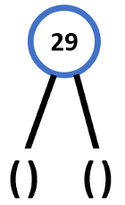
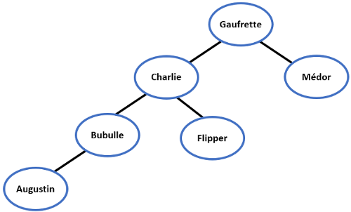
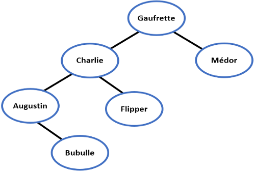

# <center><div class = "titre4">Correction des exercices du cours</div></center>

### <div class = "encadré25"> __Correction de l'exercice 2__ </div>


### <div class = "encadré25"> __Correction de l'exercice 3__ </div>
<div class="list1" markdown="1">

1. La racine de cet arbre est le noeud 2 situé tout en haut de l'arbre.
2. La hauteur de cet arbre est 3 et sa taille est 10.
3. Le noeud 7 a trois fils : les noeuds 2, 10 et 6.
4. Le noeud 11 a pour père le noeud 6.
5. Les feuilles de cet arbre sont les noeuds 2, 10, 5, 11 et 4.

</div>

### <div class = "encadré25"> __Correction de l'exercice 4__ </div>
<div class="list1" markdown="1">

1. `#!python B = arbreCons(7, arbreCons(29, arbreVide(), arbreVide()), arbreCons(13,` `#!python arbreVide(), arbreCons(88,` <span class="decal2">`arbreVide(), arbreVide())))`</span>
2. `#!python C = arbreCons(5, arbreCons(12, A, arbreVide()), B)`
3. Il s'agit du sous-arbre gauche du sous-arbre droit de `#!python C` :

4. L'instruction `#!python estVide(sousArbreDroit(sousArbreGauche(sousArbreGauche(C))))` renvoie `#!python True`.
5. L'instruction `#!python cle(sousArbreDroit(sousArbreDroit(C)))` renvoie la valeur `#!python 13`.

</div>

### <div class = "encadré25"> __Correction de l'exercice 5__ </div>
<div class="list1" markdown="1">

1. 
<span style="display:block; margin: 0px 0px 0px 0.5em;">
``` python
def estVide(self):
    return not self.valeur

```
</span>
2.  
<span style="display:block; margin: 0px 0px 0px 0.5em;">
``` python
def cle(self):
    return self.valeur

```
</span>
3.  
<span style="display:block; margin: 0px 0px 0px 0.5em;">
``` python
def sousArbreGauche(self):
    if not self.estVide():
        if self.G:
            return self.G
        return Arbre()

```
</span>
4.  
<span style="display:block; margin: 0px 0px 0px 0.5em;">
``` python
def sousArbreDroit(self):
    if not self.estVide():
        if self.D:
            return self.D
        return Arbre()

```
</span>
5.  
<span style="display:block; margin: 0px 0px 0px 0.5em;">
``` python
def estFeuille(self):
    if not self.estVide():
        gauche, droit = self.sousArbreGauche(), self.sousArbreDroit()
        return gauche.estVide() and droit.estVide()
        
    return False

```
</span>

</div>

### <div class = "encadré25"> __Correction de l'exercice 6__ </div>

``` python
def hauteur(self):
    if self.estVide():
        return -1
    
    if self.estFeuille():
        return 0

    gauche, droit = self.sousArbreGauche(), self.sousArbreDroit()
    return 1 + max(gauche.hauteur(), droit.hauteur())

```

### <div class = "encadré25"> __Correction de l'exercice 7__ </div>

``` python
def nbFeuilles(self):
    if self.estVide():
        return 0

    if self.estFeuille():
        return 1

    gauche, droit = self.sousArbreGauche(), self.sousArbreDroit()
    return gauche.nbFeuilles() + droit.nbFeuilles()

```

### <div class = "encadré25"> __Correction de l'exercice 8__ </div>

``` python
def listeParcoursInfixe(self, L=[]):
    if self.estVide():
        return
    
    gauche, droit = self.sousArbreGauche(), self.sousArbreDroit()
    gauche.listeParcoursInfixe(L)
    L.append(self.cle())
    droit.listeParcoursInfixe(L)
    return L

```

### <div class = "encadré25"> __Correction de l'exercice 9__ </div>

``` python
def parcoursPrefixe(self):
    if self.estVide():
        return

    gauche, droit = self.sousArbreGauche(), self.sousArbreDroit()
    print(self.cle(), end = " ")
    gauche.parcoursPrefixe()
    droit.parcoursPrefixe()

```

### <div class = "encadré25bis"> __Correction de l'exercice 10__ </div>

``` python
def parcoursPostfixe(self):
    if self.estVide():
        return

    gauche, droit = self.sousArbreGauche(), self.sousArbreDroit()
    gauche.parcoursPostfixe()
    droit.parcoursPostfixe()
    print(self.cle(), end = " ")

```

### <div class = "encadré25bis"> __Correction de l'exercice 11__ </div>

``` python
def parcoursLargeur(self):
    if self.estVide():
        return

    f = File()
    f.enfiler(self)

    while not f.estVide():
        n = f.defiler()
        fg, fd = n.sousArbreGauche(), n.sousArbreDroit()
        if not fg.estVide():
            f.enfiler(fg)
        if not fd.estVide():
            f.enfiler(fd)
        print(n.cle(), end = ' ') # on traite le noeud
    print('')

```

### <div class = "encadré25bis"> __Correction de l'exercice 12__ </div>
<div class="list1_2" markdown="1">

2. La ville contient $~26×26×26=17576~$ maisons.
3. On sait que la hauteur d’un arbre complet de taille $~n~$ est égale à $⌊\operatorname{log_{2}}(n)⌋$, donc ici, comme $~n=17576~$ et <span class="decal2">$⌊\operatorname{log_{2}}(17576)⌋=14$, on en déduit qu'il faut traverser au maximum $~14~$ rues pour trouver une maison quelconque.</span>

</div>

### <div class = "encadré25bis"> __Correction de l'exercice 13__ </div>
<div class="list1" markdown="1">

1.  

2. Dans ce cas, on obtient :

<span class="decal2">L'arbre binaire de recherche n'est plus le même : __l'ordre dans lequel on insère les éléments est important__.</span>
</div>

### <div class = "encadré25bis"> __Correction de l'exercice 14__ </div>

Le parcours infixe de cet arbre donne : `#!python 3, 5, 6, 8, 9, 11, 13, 88`.  

!!! book "__Propriété__"
    Un arbre binaire est un __ABR__ si seulement si la liste des valeurs des noeuds établie dans l’ordre infixe est strictement croissante.

### <div class = "encadré25bis"> __Correction de l'exercice 15__ </div>

``` python
def estABR(self):
    if self.estVide():
        return True
    
    L = self.listeParcoursInfixe([])
    return L == sorted(L)

```

### <div class = "encadré25bis"> __Correction de l'exercice 16__ </div>

``` python
def rechercherElement(self, e):
    assert self.estABR() == True, "L'arbre n'est pas un ABR"
    
    if self.estVide():
        return False
    
    if e == self.cle():
        return True
    
    gauche, droit = self.sousArbreGauche(), self.sousArbreDroit()
    
    if e < self.cle():
        return gauche.rechercherElement(e)

    return droit.rechercherElement(e)

```

### <div class = "encadré25bis"> __Correction de l'exercice 17__ </div>

``` python
def insererElement(self, e):
    assert self.estABR() == True, "L'arbre n'est pas un ABR"

    if self.estVide():
        self.valeur = e
        return

    gauche, droit = self.sousArbreGauche(), self.sousArbreDroit()
    
    if e <= self.valeur:
        if not gauche.estVide():
            gauche.insererElement(e)
        else :
            self.G = Arbre(e)
    
    else :
        if not droit.estVide():
            droit.insererElement(e)
        else :
            self.D = Arbre(e)

```