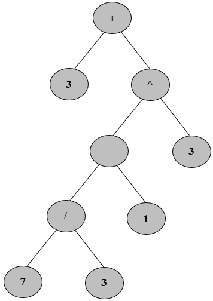

# <center><div class = "titre2"> Exercices </div></center>
  
### <div class = "encadré20"> __Exercice 1__ </div>
<div class="list8" markdown="1">

1. Ecrire une méthode `#!python estComplet()` de la classe `#!python Arbre` qui indique si un arbre binaire est complet.

</div>
<div style="display:block; margin: 0px 0px 0px 2.3em;" markdown="1">

??? plus-circle "__Code à compléter__"
	```python
	class Arbre:
		...

		def estComplet(self):
		###################
		# Votre code ici  #
		###################

	# Tests de la fonction
	
	A = Arbre(3, Arbre(2), Arbre(4))
	A.affichage()
	B = Arbre(3, Arbre(2, Arbre(5)), Arbre(4, Arbre(6)))
	B.affichage()
	C = Arbre(3, Arbre(2), Arbre(4, Arbre(5), Arbre(5)))
	C.affichage()
	
	assert A.estComplet(), "Erreur"
	assert not B.estComplet(), "Erreur"
	assert not C.estComplet(), "Erreur"
	```
</div>
<div class="list8_2" markdown="1">

2. Un arbre binaire est dit strict (ou localement complet) quand deux frères (fils d’un même père) y sont toujours soit tous les <span class="decal2">deux vides soit tous les deux non vides.</span>  
<span class="decal2">Créer la méthode `#!python estStrict()` de la classe `#!python Arbre` qui indique si un arbre est strict ou non.</span>

</div>
<div style="display:block; margin: 0px 0px 0px 2.3em;" markdown="1">

??? plus-circle "__Code à compléter__"
	```python
	class Arbre:
		...

		def estStrict(self):
		###################
		# Votre code ici  #
		###################

	# Tests de la fonction
	
	A = Arbre(3, Arbre(2), Arbre(4))
	A.affichage()
	B = Arbre(3, Arbre(2, Arbre(5)), Arbre(4, Arbre(6)))
	B.affichage()
	C = Arbre(3, Arbre(2), Arbre(4, Arbre(5), Arbre(5)))
	C.affichage()
	
	assert A.estStrict(), "Erreur"
	assert not B.estStrict(), "Erreur"
	assert C.estStrict(), "Erreur"
	```
</div>

[Correction de l'exercice](Correction.md#correction-de-lexercice-1){:target="_blank"}

### <div class = "encadré20"> __Exercice 2__ </div>

Ecrire une méthode `#!python compte(x)` de la classe `#!python Arbre` qui renvoie le nombre d'occurrences de `#!python x` dans un __ABR__ qui réalise des multi-ensembles (dans lequel un même élément peut apparaître plusieurs fois).  

On s'attachera à ne pas descendre dans les sous-arbres dans lesquels on est certain que la valeur `#!python x` ne peut apparaître.  

??? plus-circle "__Code à compléter__"
	```python
	class Arbre:
		...

		def compte(self, x):
		###################
		# Votre code ici  #
		###################

	# Tests de la fonction
	
	D = Arbre(5, Arbre(4, Arbre(3, Arbre(2))), Arbre(13, Arbre(13, Arbre(8, Arbre(5))), Arbre(21, Arbre(17, Arbre(13)),Arbre(88))))
	D.affichage()
	
	assert D.compte(13) == 3, "Erreur"
	assert D.compte(5) == 2, "Erreur"
	assert D.compte(6) == 0, "Erreur"
	```

[Correction de l'exercice](Correction.md#correction-de-lexercice-2){:target="_blank"}

### <div class = "encadré20"> __Exercice 3__ </div>

On cherche dans cet exercice à tester l'égalité de deux arbres binaires.  

Ecrire une méthode `#!python estEgal(arbre)` de la classe `#!python Arbre` qui teste l’égalité avec un arbre passé en paramètre.

??? plus-circle "__Code à compléter__"
	```python
	class Arbre:
		...

		def estEgal(self, arbre):
		###################
		# Votre code ici  #
		###################

	# Tests de la fonction
	
	D = Arbre(5, Arbre(4, Arbre(3, Arbre(2))), Arbre(13, Arbre(13, Arbre(8, Arbre(5))), Arbre(21, Arbre(17, Arbre(13)),Arbre(88))))
	D.affichage()
	E = Arbre(5, Arbre(4, Arbre(3, Arbre(2))), Arbre(13, Arbre(13, Arbre(8, Arbre(5))), Arbre(21, Arbre(17, Arbre(13)),Arbre(88))))
	E.affichage()
	
	assert D.estEgal(E), "Erreur"

	F = Arbre(5, Arbre(4, Arbre(3, Arbre(2))), Arbre(13, Arbre(13, Arbre(8, Arbre(5))), Arbre(21, Arbre(17, Arbre(13)))))
	F.affichage()
	
	assert not D.estEgal(F), "Erreur"
	
	```

[Correction de l'exercice](Correction.md#correction-de-lexercice-3){:target="_blank"}

### <div class = "encadré20"> __Exercice 4__ </div>

Ecrire une méthode récursive `#!python maxBranche()` de la classe `#!python Arbre` qui renvoie la somme maximale des valeurs des noeuds depuis la racine vers n’importe quelle feuille de l’arbre (en ne visitant qu’une seule fois chaque noeud).

??? plus-circle "__Code à compléter__"
	```python
	class Arbre:
		...

		def maxBranche(self):
		###################
		# Votre code ici  #
		###################

	# Tests de la fonction
	
	assert C.maxBranche() == 12, "Erreur"
	assert D.maxBranche() == 127, "Erreur"
	
	```

[Correction de l'exercice](Correction.md#correction-de-lexercice-4){:target="_blank"}

### <div class = "encadré20"> __Exercice 5__ </div>

On cherche dans cet exercice à évaluer une expression arithmétique représentée par un arbre binaire comme celle donnée dans l'exercice 2 du cours :



Soit un arbre binaire représentant une expression arithmétique contenant des entiers et des opérateurs `#!python +`, `#!python -`, `#!python *`, `#!python /` et `#!python **`.  

Si l’expression est bien formée (on dit aussi valide) alors l’arbre binaire est __strict__. Chaque feuille de cet arbre contient donc un __entier__ et chaque noeud interne un __opérateur__.
<div class="list8" markdown="1">

1. Ecrire récursivement la méthode `#!python estValide()` qui teste si un arbre binaire ne contenant que des entiers et des opérateurs <span class="decal2">représente bien une expression arithmétique valide.</span>

</div>
<div style="display:block; margin: 0px 0px 0px 2.5em;" markdown="1">

??? plus-circle "__Code à compléter__"
	```python
	class Arbre:
	...

		def estValide(self):
		###################
		# Votre code ici  #
		###################

	# Tests de la fonction
		
	G = Arbre('+', Arbre(3), Arbre('**', Arbre('-', Arbre('/', Arbre(7), Arbre(3)), Arbre(1)), Arbre(3)))
	G.affichage()

	assert G.estValide(), "Erreur"

	H = Arbre('+', Arbre(3), Arbre('**', Arbre(8)))
	H.affichage()

	assert not H.estValide(), "Erreur"

	I = Arbre('+', Arbre(3), Arbre('**'))
	I.affichage()

	assert not I.estValide(), "Erreur"

	```
</div>
<div class="list8_2" markdown="1">

2. Ecrire récursivement la méthode `#!python evaluation()` qui renvoie la valeur correspondant à l’expression arithmétique représentée <span class="decal2">par l’arbre qui est évalué (par exemple, sur l’arbre illustré par la figure précédente, la fonction `#!python evaluation()` doit renvoyer</span>  
	<span class="decal2">`#!python 5.370370370370371`).</span>  
<span style="display:block; margin: 10px 0px 0px 0.55em;">On suppose ici que l’arbre représente une expression valide.</span>

</div>
<div style="display:block; margin: 0px 0px 0px 2.5em;" markdown="1">

??? plus-circle "__Code à compléter__"
	```python
	class Arbre:
		...

		def evaluation(self):
		###################
		# Votre code ici  #
		###################

	# Tests de la fonction
	
	assert G.evaluation() == 5.370370370370371, "Erreur"
	
	```
	
!!! tools "__Remarque__"
	Puisque les opérateurs doivent être insérés dans l'arbre en tant que caractères, il va falloir évaluer dynamiquement le code.  
	
	On rappelle que la fonction `#!python eval()` permet cela, par exemple :
	``` python
	>>> eval("12 + 3")
	15

	>>> eval("12" + "3")
	123

	>>> eval("12" + "3*2")
	246

	>>> eval("12" + "*" + "3")
	36
	```

</div>
[Correction de l'exercice](Correction.md#correction-de-lexercice-5){:target="_blank"}
 
