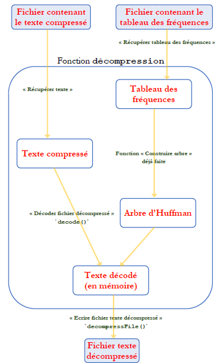

# <center><div class = "titre14">Mise en commun</div></center>
<center>
## <div class="para2">Programme final</div>
</center>
<div class="encadre">
Si chacun a respecté le cahier des charges de sa fonction, il en résultera un programme de compression fonctionnel.
</div>

### <div class="para">Rassembler les fichiers utiles</div>
<span></span>
<div class="list10" markdown="1">

1. Créer un répertoire <span style="font-family: 'Trebuchet MS' ; font-weight: bold">HuffmanComplet</span> dans votre espace personnel sur le réseau.
2. Récupérer l’ensemble des fonctions du projet réalisées par vos camarades, au même emplacement réseau que là où vous avez <span class="decal2">déposé la votre.</span>
3. Copier ces différentes fonctions dans le répertoire <span style="font-family: 'Trebuchet MS' ; font-weight: bold">HuffmanComplet</span> précédemment créé.
4. Vérifier bien que vous êtes en possession des fichiers :

</div>
<div class="couleur_puce17" markdown="1">

* binaryTree.py
* fct_sequenceToOccurrences.py
* fct_weightTree.py
* fct_insertTreeInForest.py
* fct_huffmanTree.py
* fct_treeToCoding.py
* fct_encode.py
* fct_decode.py

</div>
<div class="list10_5" markdown="1">

5. __Veillez à ce que les différents tests soient supprimés dans chacun de ces fichiers afin de ne conserver que la fonction.__

</div>

### <div class="para">Créer le programme principal</div>

Créer dans votre dossier un nouveau fichier python nommé <span style="font-family: 'Trebuchet MS' ; font-weight: bold">CompressionHuffman.py</span>, et importer dans ce fichier l’ensemble des fonctions contenues dans les fichiers cités pages précédentes. Pour cela, inspirez-vous de la commande suivante :
```python
from fct_weightTree import weightTree
```

## <div class="para3"> Niveau 1 : Compression/décompression d’une chaine de caractères <br>(sans manipuler de fichiers)</div>

!!! exercice6 "__Exercice 1__"   
    Ecrire en quelques lignes une fonction nommée `#!python compresse()` de compression avec l’algorithme de Huffman.  

    Le texte à compresser sera une chaine de caractères directement écrite dans le programme.  

    *Exemple* : `#!python texte = 'hello world !'`

??? tools "__Aide__"
    <div class="couleur_puce18">

    * Utiliser bien sûr les fonctions importées de vos camarades.
    * Relire si nécessaire les docstrings des fonctions de vos camarades, elles sont là :
    ```python
    #######  Fonction « analyser fréquences » #######

    def sequenceToOccurrences(seq):
        """
        Rôle : repère les occurrences de chaque caractère dans un texte et les renvoie sous la forme d'un dictionnaire.

        Exemple de retour : {'d': 2, 'e': 2, 'c': 1, 'i': 1}

        Parameters
        ----------
        seq : string
            une séquence de symboles, le texte à analyser

        Returns
        -------
        dict
            un dictionnaire donnant le nombre d'occurrences de chacun des symboles contenu dans seq
        """

    #######  Fonction « construire arbre » #######

    # Cette fonction fait appel à deux « sous fonctions » à détailler d'abord :
    #    - weightTree() qui détermine le poids d'un arbre.
    #    - insertTreeInForest(), qui insère un arbre dans la forêt (donnée).

    #######  Fonction « Trouver le poids d'un arbre » #######

    def weightTree(arbre):
        """
        Rôle: Donne le poids d'un arbre non vide : le poids de la racine, soit la somme des poids des feuilles.

        Parameters
        ----------
        arbre : Objet de la class Arbre importée via le module binaryTree

        Returns
        -------
        nombre entier si occurrences, float de 0 à 100 si %
        """

    #######  Fonction « insérer un arbre dans la forêt »  #######

    def insertTreeInForest(arbre, foret):
        """
        Rôle: cette fonction insère un arbre supplémentaire dans la forêt de manière à ce que l'ordre de poids décroissant des arbres soit respecté.

        Parameters
        ----------
        arbre : Objet de la class Arbre importée via le module binaryTree
        foret: Une liste d'arbres

        Returns
        -------
        Une liste d'arbres dans lequel l'arbre a été inséré.
        """

    #######  Fonction « Construire Arbre »  #######

    def huffmanTree(occ):
        """
        Rôle: cette fonction construit l'arbre de Huffman.

        Parameters
        ----------
        occ: (dict) dictionnaire d'occurrences de chaque caractère.
        Exemple occ = {'d': 2, 'e': 2, 'c': 1, 'i': 1}

        Returns
        -------
        (arbre) l'arbre binaire de codage de Huffman.
        """

    #######  Fonction « Obtenir le dictionnaire de codage »  #######

    def treeToCoding(arbre_huff, dicCodeCarac={}, codeEnConstruction=[]):
        """
        Rôle: cette fonction récursive construit le dictionnaire de codage.

        Exemple de retour : {'a': 0, 't': 10, 'r': 11}

        Parameters
        ----------
        arbre_huff : (arbre) arbre de Huffman

        Returns
        -------
        (dict) dictionnaire donnant pour chaque caractère le code de Huffman à utiliser

        """

    #######  Fonction « Coder Texte »  #######

    def encode(source, coding_table):
        """
        Rôle: Code le texte source en utilisant la table de Huffman

        Parameters
        ----------
        source: (str) texte source à encoder
        coding_table: (dict) une table de codage

        Returns
        -------
        (str) chaine qui contient une suite de '0' et de '1'

        """

    #######  Fonction « décoder fichier compressé »  #######

    def decode(encoded_source, tree):
        """
        Rôle: Décode la suite codée de 0 et 1 et obtient le texte

        Parameters
        ----------
        encoded_source: (str) la chaîne binaire à décoder
        tree: (arbre) l'arbre de Huffman du codage utilisé

        Returns
        -------
        (str) le message source décodé

        """
    ```
    * Respecter le déroulement de l’algorithme de Huffman ci-dessous :

    </div>
    

Lorsque votre programme fonctionne et transforme le texte source en une suite optimale de `#!python 0` et de `#!python 1`, passer à l'exercice 2.

!!! exercice6 "__Exercice 2__"
    Ecrire une fonction nommée `#!python tauxCompression()` qui renvoie le taux de compression (en %) obtenu.  

    Comparer pour cela les tailles des textes original et compressé.

!!! exercice6 "__Exercice 3__"
    Créer maintenant une fonction nommée `#!python decompresse()` qui ne va faire qu’exécuter la fonction `#!python decode()` importée.  

    Cette fonction `#!python decompresse()` prend comme arguments le texte compressé (chaine de `#!python 0` et de `#!python 1`) et l’arbre de Huffman.  

    Elle renvoie le texte source décompressé.

??? tools "__Aide__"
    Utiliser encore une fois les fonctions importées de vos camarades, et s'aider du diagramme ci-dessous :
    

## <div class="para3"> Niveau 2 : Compression/décompression d’un fichier</div>

Nous allons maintenant réaliser un programme de compression digne de ce nom (ou presque...). 

!!! probleme "__Objectif__"
    L’objectif est de lire le contenu d’un fichier quel qu’il soit, le compresser, et d'écrire d’une part le fichier compressé avec l’extension "__.huf__", et d'autre part la table d’occurrences dans un second fichier d’extension "__.occ__"  

!!! question "Et comment s'y prend-t-on ??"
    Vous avez remarqué que pour compresser un texte source, nous avons regardé la fréquence d’apparition des caractères. Et bien il est possible, sur ce principe, de compresser n’importe quel type de documents, même autre que du texte !  
    
    L'idée, assez simple, est de lire les octets d’un fichier quelconque à compresser, et de regarder la fréquence d’apparition des octets et non des caractères comme précédemment. Les octets qui apparaissent souvent seront recodés par une suite courte de bits, et ceux moins fréquents par une suite de bits plus longue.  

!!! triste "__Problème__"
    Un problème se profile tout de même : on ne peut écrire dans un fichier qu’un nombre entier d’octets (nombre de bits multiple de 8).  
    Et la suite de bits issue de la compression n’est pas forcément un multiple de 8.

!!! content "__Solution__"  
    Une solution consiste à compléter le dernier octet avec un <b><span style= "color: red">1</span></b> et des <b><span style="color: red">0</span></b>.  
    $~$  
    *__Exemple 1__* : chaine de bits issue de la compression : <b><span style="color:#306e9c">10101110 10110010 110</span></b>.  
    Après avoir complété le dernier octet: <b><span style="color:#306e9c">10101110 10110010 110</span><span style="color: red">10000</span></b>.  
    $~$  
    *__Exemple 2__* : si le nombre d’octets issue de la compression est entier : <b><span style="color:#306e9c">10101110 10110010</span></b>.  
    On complétera alors de la façon suivante : <b><span style="color:#306e9c">10101110 10110010</span><span style="color: red"> 10000000</span></b>.  
    $~$  
    Lors de la décompression, afin de récupérer la chaine de bits exacte issue de la compression, sans les bits ajoutés artificiellement, il "suffit" de retirer le dernier <b><span style= "color: red">1</span></b> et tous les <b><span style= "color: red">0</span></b> qui suivent.  
    $~$   
    *__Exemple 3__* : Chaine de bits issue de la lecture du fichier compressé : <b><span style="color:#306e9c">10101110 10110010 110</span><span style= "color: red"><s>10000</s></span></b>.  
    Après avoir retiré les bits de complétion du dernier octet on obtient : <b><span style="color:#306e9c">10101110 10110010 110</span></b>. 

### <div class="para">Compression</div>

Pour compresser des fichiers en binaire, quels qu’ils soient, vous aurez besoin de fonctions particulières, fournies dans le fichier [<span style="font-family: 'Trebuchet MS' ; font-weight: bold">fcts_fournies.py</span>](fichiers/fcts_fournies.zip) et d’une librairie [<span style="font-family: 'Trebuchet MS' ; font-weight: bold">binary_IO</span>](fichiers/binary_IO.zip) qui permet de travailler sur des flux d’octets en lecture et écriture de fichiers. Pour cela :  
<div class="couleur_puce16" markdown="1">

* Enregistrer sous un autre nom votre fichier précédent <span style="font-family: 'Trebuchet MS' ; font-weight: bold">compressionHuffman.py</span>, par exemple en <span class="decal5"><span style="font-family: 'Trebuchet MS' ; font-weight: bold">compressionFichiersHuffman.py</span>.</span>
* Copier les fichiers <span style="font-family: 'Trebuchet MS' ; font-weight: bold">fcts_fournies.py</span> et <span style="font-family: 'Trebuchet MS' ; font-weight: bold">binary_IO.py</span> dans votre répertoire de travail <span style="font-family: 'Trebuchet MS' ; font-weight: bold">HuffmanComplet</span>
* Insérer en début de votre programme la ligne suivante afin d’importer <span style="font-family: 'Trebuchet MS' ; font-weight: bold">fcts_fournies.py</span> : `#!python from fcts_fournies import *`

</div>
Ce fichier <span style="font-family: 'Trebuchet MS' ; font-weight: bold">fcts_fournies.py</span> contient 6 fonctions :
<div class="couleur_puce16bis" markdown="1">

* `#!python litFichierBinaire`
* `#!python ecritFichierBinaire`
* `#!python completeDernierOctet`
* `#!python uncompleteDernierOctet`
* `#!python sauveDicoOccurrences`
* `#!python lireFichierDicoOcc`

</div>

!!! exercice6 "__Exercice 4__"
    Modifier la fonction `#!python compresse()` du niveau 1 afin qu’elle prenne en argument un nom de fichier avec extension `#!python str`, et qu’elle compresse ce fichier en écrivant deux nouveaux fichiers :
    <div class="couleur_puce19">

    * Le fichier compressé d’extension "__.huf__" qui porte le même nom que le fichier source (à compresser).
    * Le fichier contenant le dictionnaire d’occurrences avec l’extension "__.occ__" qui porte également le même nom que le fichier <div class="decal5">source (à compresser).</div>

    </div>
    Tester votre programme sur le fichier [<span style="font-family: 'Trebuchet MS' ; font-weight: bold">NSI.txt</span>](fichiers/NSI.zip)

??? tools "__Aide__"
    <div class="couleur_puce18">

    * Penser à lire les docstrings des fonctions fournies dans le fichier <span style="font-family: 'Trebuchet MS' ; font-weight: bold">fcts_fournies.py</span>.
    * Pour générer le nom du fichier compressé :  
    ```python
    nomFichierCompresse = fichierSource.rsplit('.', 1)[0]+'.huf'
    ```
    * Pour générer le nom du fichier compressé contenant le dictionnaire d’occurrences :  
    ```python
    nomFichierOcc = fichierSource.rsplit('.', 1)[0]+'.occ'
    ```
    * Pour transformer la chaine de caractères composée de `0` et de `1` issue de l’encodage optimal, en une suite d’octets à <div class="decal5">écrire dans le fichier compressé :  
    ```python
    listeOctets = [int(chaineBitsCompletee[8*i : 8*(i+1)], 2) for i in range(int(len(chaineBitsCompletee)/8))]
    ```
    </div>

    </div>

!!! exercice6 "__Exercice 5__"
    Ajouter une ou deux lignes dans votre fonction `#!python compresse()` afin qu’elle affiche dans la console le taux de compression et tester sur le fichier <span style="font-family: 'Trebuchet MS' ; font-weight: bold">NSI.txt</span>.

### <div class="para">Décompression</div>

!!! exercice6 "__Exercice 6__"
    Modifier la fonction `#!python decode()` afin qu’elle remplisse une liste python, au lieu de créer une chaine de caractères.  
    Réécrire la docstring en fonction bien sûr.

!!! exercice6 "__Exercice 7__"
    Modifier la fonction `#!python decompresse()` du niveau 1 afin qu’elle décompresse un fichier d’extension "__.huf__".  
    Votre fonction doit prendre deux arguments :
    <div class="couleur_puce19">

    * Le nom du fichier à décompresser avec l’extension (ex : <span style="font-family: 'Trebuchet MS' ; font-weight: bold">NSI.huf</span>)
    * Le nom du fichier de destination (ex : <span style="font-family: 'Trebuchet MS' ; font-weight: bold">NSI_decompresse.txt</span>)

    </div>
    Tester votre programme sur le fichier <span style="font-family: 'Trebuchet MS' ; font-weight: bold">NSI.huf</span> présent normalement dans le répertoire.

??? tools "__Aide__"
    Après lecture du fichier compressé en binaire par la fonction `#!python litFichierBinaire()`, transformer la liste d’octets obtenue en une chaine de caractères (`#!python str`) constituée de `#!python 0` et de `#!python 1` avec cette ligne de commande :
    ```python
    chaineBitsCompletee = ''.join('{:08b}'.format(oct) for oct in listeOctetsSource)
    ```


