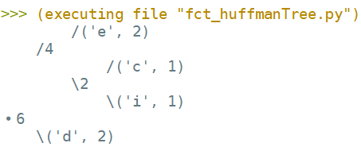

# <center><div class = "titre11">Fonction : huffmanTree()</div></center>

<div class="para">Objectif principal</div>

Réaliser une fonction qui génère l’arbre de Huffman à partir du nombre d’occurrences (ou pourcentage d’apparition) de chacun des symboles dans le texte source à compresser.

<div class="para">Rendu / Evaluation</div>

La fonction, une fois achevée, servira de brique de base au programme de compression de Huffman que l’ensemble de la classe codera. Tout le monde compte sur vous !!!  

Votre fonction doit être fonctionnelle, optimale, et son codage doit respecter les bonnes pratiques de programmation telles que CamelCase, ou <a href="https://fr.wikipedia.org/wiki/Snake_case" target="_blank">Snake_case</a>.  

A l’issu, __votre groupe passera à l’oral au tableau__ afin d’expliquer concrètement le déroulement de l’exécution de votre fonction. Le vocabulaire employé, la perspicacité, et le niveau de compréhension seront des critères d’évaluation.  

__La durée de la prestation orale est fixée à 5 min.__ 

<div class="para">Cahier des charges de la fonction</div>

Fichier à compléter :  

```python
from binaryTree import Arbre as BT
from fct_weightTree import weightTree
from fct_insertTreeInForest import insertTreeInForest

def huffmanTree(occ):
    """
    Rôle: cette fonction construit l'arbre de Huffman.

    Parameters
    ----------
    occ: (dict) dictionnaire d'occurrences de chaque caractère.
    Exemple occ = {'d': 2, 'e': 2, 'c': 1, 'i': 1}

    Returns
    -------
    (arbre) l'arbre binaire de codage de Huffman.
    """

    pass

```

<div class="para">Commandes utiles / Aide</div>

Pour générer l’arbre de Huffman, vous devez dans l’ordre :
<div class="couleur_puce16" markdown="1">

* __Trier le dictionnaire d’occurrences__ dans l’ordre décroissant des valeurs (c'est-à-dire occurrences), ce qui doit vous donner une  
<span style="display: block; margin: 0px 0px 0px 0.2em;" markdown="1">liste de tuples.  
<br>
*__Exemple__* :
    ```python
    occurrences = {'t': 3, 'a': 4, 'r': 1}
    # Ici mon instruction de tri qui va bien
    liste_tuples = [('a', 4), ('t', 3), ('r', 1)]
    ```
Pour trier un dictionnaire, on pourra utiliser le <a href="https://docs.python.org/fr/3/howto/sorting.html" target="_blank">guide suivant</a>.
</span>
* __Créer__ à partir de cette liste de tuples, __la forêt d’arbres binaires__, c’est-à-dire une liste d’arbres réduits à une feuille contenant  
<span style="display: block; margin: 0px 0px 0px 0.2em;" markdown="1">chacun comme donnée `#!python ('lettre', nbOccurrences)`. Chaque symbole avec son nombre d’occurrences doit être représenté par un arbre dans la forêt, et l’ordre des occurrences dans la liste doit être décroissant comme pour le dictionnaire.</span>
* __Fusionner les arbres de la forêt en respectant l’algorithme de Huffman__, pour cela on retire les deux arbres les « moins lourds »  
<span style="display: block; margin: 0px 0px 0px 0.2em;" markdown="1">de la forêt et on les regroupe en un seul qu'on remet dans la forêt.  
Vous avez à votre disposition la fonction `#!python insertTreeInForest(arbre, foret)` qui permet d’insérer un arbre binaire dans une liste d’arbres binaires (la forêt), en respectant l’ordre décroissant des poids des arbres dans la liste.  
Vous avez également à votre disposition la fonction `#!python weightTree(arbre)` qui renvoie le poids de la racine (somme des poids des feuilles).</span>

</div>
__A la fin il ne reste plus qu’un arbre dans la forêt, cet arbre binaire est l’arbre de Huffman. La fonction renvoie cet arbre de Huffman.__

<div class="para">Tests</div>

```python

# ----------------------------
#       TEST
# ----------------------------

occurrences = {'d': 2, 'e': 2, 'c': 1, 'i': 1}
arbreHuffman = huffmanTree(occurrences)
arbreHuffman.affichage()                         

```

Le dernier appel doit afficher en console :

