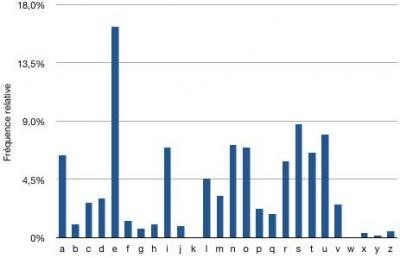

# <center><div class = "titre8">Fonction : sequenceToOccurrences()</div></center>

<div class="para">Objectif principal</div>

Réaliser une fonction qui analyse et mémorise la fréquence d’apparition des caractères/symboles dans une chaine de caractères.


<div class="para">Rendu / Evaluation</div>

La fonction, une fois achevée, servira de brique de base au programme de compression de Huffman que l’ensemble de la classe codera. Tout le monde compte sur vous !!!  

Votre fonction doit être fonctionnelle, optimale, et son codage doit respecter les bonnes pratiques de programmation telles que CamelCase, ou <a href="https://fr.wikipedia.org/wiki/Snake_case" target="_blank">Snake_case</a>.  

A l’issu, __votre groupe passera à l’oral au tableau__ afin d’expliquer concrètement le déroulement de l’exécution de votre fonction. Le vocabulaire employé, la perspicacité, et le niveau de compréhension seront des critères d’évaluation.  

__La durée de la prestation orale est fixée à 5 min.__ 

<div class="para">Cahier des charges de la fonction</div>

Fichier à compléter :  

```python
def sequenceToOccurrences(seq):
    """
    Rôle : repère les occurrences de chaque caractère dans un texte et les renvoie sous la forme d'un dictionnaire.

    Exemple de retour : {'d': 2, 'e': 2, 'c': 1, 'i': 1}

    Parameters
    ----------
    seq : string 
          une séquence de symboles, le texte à analyser
            
    Returns
    -------
    dict
        un dictionnaire donnant le nombre d'occurrences de chacun des symboles contenu dans seq
    """

    pass

```

<div class="para">Commandes utiles / Aide</div>

L’état actuel de vos connaissances est suffisant pour coder la fonction.

<div class="para">Tests</div>

```python
# ----------------------------
#       TESTS
# ----------------------------

assert type(sequenceToOccurrences('aaabc')) == type({}), "Votre fonction ne renvoie pas un dictionnaire"
assert sequenceToOccurrences('aaabc') == {'a': 3, 'b': 1, 'c': 1}, "Erreur"
assert sequenceToOccurrences('dictionnaire') == {'d': 1, 'i': 3, 'c': 1, 't': 1, 'o': 1, 'n': 2, 'a': 1, 'r': 1, 'e': 1}, "Erreur"

```
