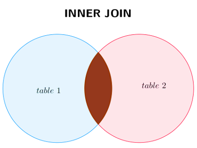

# <center><div class = "titre1_SQL">Le langage SQL</div> </center>

## <div class = "encadré1_SQL">__Le modèle physique : SGBD relationnel__</div>

### <div class = "encadré2_SQL"> __Présentation__ </div>

Un <span class="gras">S</span>ystème de <span class="gras">G</span>estion de <span class="gras">B</span>ases de <span class="gras">D</span>onnées (__SGBD__) doit répondre aux objectifs suivants :
 
??? plus-circle1 "__Indépendance physique__"
   	La façon dont les données sont définies doit être indépendante des structures de stockage utilisées. 
    
??? plus-circle1 "__Indépendance logique__"
	Un même ensemble de données peut être vu différemment par des utilisateurs différents. Toutes ces visions personnelles des données doivent être intégrées dans une vision logique.

??? plus-circle1 "__Accès aux données__"
	L'accès aux données se fait par l'intermédiaire d'un <span class="gras">L</span>angage de <span class="gras">M</span>anipulation de <span class="gras">D</span>onnées (<span class="gras">LMD</span>). Il est crucial que ce langage permette d'obtenir des réponses aux requêtes en un temps « raisonnable ». Le <span class="gras">LMD</span> doit donc être optimisé afin de minimiser l'accès disques et tout cela de façon totalement transparente pour l'utilisateur.

??? plus-circle1 "__Administration centrale des données (intégration)__"
	Toutes les données doivent être centralisées dans un résevoir unique commun à toutes les applications. En effet, des visions différentes des données (entre autres) se résolvent plus facilement si les données sont administrées de façon centralisée.

??? plus-circle1 "__Non-redondance des données__"
	Afin d'éviter les problèmes lors des mises à jour, chaque donnée ne doit être présente qu'une seule fois dans la base.

??? plus-circle1 "__Cohérence des données__"
	Les données sont soumises à un certain nombre de contraintes d'intégrité qui définissent un état cohérent de la base. Elles doivent pouvoir être exprimées simplement et vérifiées automatiquement à chaque insertion, modification ou suppression de données. Les contraintes d'intégrité sont décrites dans le <span class="gras">L</span>angage de <span class="gras">D</span>escription des <span class="gras">D</span>onnées (__LDD__).

??? plus-circle1 "__Partage des données__"
	Il s'agit de permettre à plusieurs utilisateurs d'accéder aux mêmes données au même moment de manière transparente. Si ce problème est simple à résoudre quand il s'agit uniquement d'interrogations, cela ne l'est plus quand il s'agit de modifications dans un contexte multiutilisateurs, car il faut permettre à deux utilisateurs (ou plus) de modifier la même donnée « en même temps » et assurer un résultat d'interrogation cohérent pour un utilisateur consultant une table pendant qu'un autre la modifie.

??? plus-circle1 "__Sécurité des données__"
	Les données doivent pouvoir être protégées contre les accès non autorisés. Pour cela, il faut pouvoir associer à chaque utilisateur des droits d'accès aux données.

??? plus-circle1 "__Résistance aux pannes__"
	Que se passe-t-il si une panne survient au milieu d'une modification, si certains fichiers contenant les données deviennent illisibles ? Il faut pouvoir récupérer une base de données dans un état « sain ». Ainsi, après une panne intervenant au milieu d'une modification, deux solutions sont possibles : soit récupérer les données dans l'état dans lequel elles étaient avant la modification, soit terminer l'opération interrompue.

Parmi les __SGBD__ les plus connus, on peut citer : __SQLite__, __MySQL__, __PostgreSQL__, __Oracle Database__, __Microsoft SQL Server__, __Microsoft Access__.

Dans la suite de ce chapitre, on se basera sur l'utilisation du __SGBD SQLite__ (système libre). Ce système, très répandu dans le monde, n'est pas un serveur mais un moteur de base de données embarqué dans du code. On le trouve dans Thunderbird, Firefox, les gestionnaires de bibliothèques de musiques... c'est pourquoi on retrouve certainement ce __SGBD__ dans votre smartphone et PC. Ainsi, il y aurait mille milliards de bases de données __SQLite__ actives dans le monde !!!  
__SQLite__ présente aussi l’avantage d’être présent dans la bibliothèque standard de Python. Cela signifie que vous pouvez écrire en Python une application contenant son propre __SGBD__ intégré à l’aide du module sqlite3.  
<br>
Le langage utilisé dans ce cours est le langage __SQL__ dans sa version __SQL2__.  
On notera qu’il existe quelques différences entre les dialectes __SQL__ utilisés par les différents __SGBD__. Ces différences seront indiquées le cas échéant.

### <div class = "encadré3_SQL"> __Conventions d'écriture__ </div>

On veillera à ne jamais utiliser d'espaces ou d'accents dans les noms de bases de données, de relations et d'attributs. On évitera également d'utiliser des mots réservés. Par « mots réservés », on entend un mot-clé __SQL__, donc un mot qui sert à définir quelque chose dans le langage __SQL__. On pourra trouver une liste exhaustive de ces mots réservés dans la documentation officielle du langage __SQL__.  
<br>
Une convention largement répandue veut que les commandes et mots-clés __SQL__ soient écrits complétement en majuscules. Nous respecterons cette convention; il est plus facile de relire une commande de 5 lignes lorsque l'on peut différencier au premier coup d'oeil les commandes __SQL__ des noms des relations et des attributs.

## <div class = "encadré4_SQL">__Manipulation de données__</div>

### <div class = "encadré5_SQL"> __Généralités__ </div>

Dans cette partie, nous allons nous intéresser au langage __SQL__ dans sa partie interrogation et manipulation de données (insertion, mise à jour, destruction), donc dans la partie __LMD__ de la plupart des __SGBD__. Il existe bien évidemment des manipulations bien plus avancées qui dépassent le cadre du programme de NSI.  
<br>
Pour la suite de ce chapitre, nous prendrons en exemple la petite base de données suivante constituée de 4 relations :
<center>

| NomStation        | Capacite      | Lieu 		| Region        |Tarif	       |
| :---------------: | :-----------: | :---: 	| :-----------: |:-----------: |
| Tanger		    | 350    		| Maroc 	| Afrique  	    |1200	       |
| La Bourboule	    | 250    		| Auvergne  | Europe   		|700	       |
| Victoria			| 200       	| Seychelles| Océan Indien  |1500	       |
| Courchevel	 	| 400      		| Alpes  	| Europe        |2200	       |

__Relation « Stations »__

</center>

<br>
<center>
<div class="padding2">

| NomStation        | Libelle	    | Prix 		|
| :---------------: | :-----------: | :---: 	|
| La Bourboule	    | Pêche    		| 50	 	|
| La Bourboule	    | Randonnée		| 0			|
| Tanger			| Plongée      	| 120		|
| Tanger		 	| Excursion		| 60	  	|
| Victoria    		| Plongée  		| 130		|
| Courchevel		| Ski      		| 120	  	|

__Relation « Activites »__

</div>
</center>
<br>  
<center>
<div class="padding3">

| Id    | Nom	   	| Prenom	| Ville       	|Région	       |Solde     |
| :---: | :------: 	| :---: 	| :-----------: |:-----------: |:------:  |
| 1	    | Bauer    	| Elmut 	| Berlin  	    |Europe	       |9825      |
| 2	    | Smith	 	| John      | Londres  		|Europe	       |12436     |
| 3		| Jonhson   | Britney	| New York		|Amérique      |6721      |

__Relation « Clients »__

</div>
</center>
<br>  
<center>
<div class="padding4">

| IdClient 	| Station   	| Arrivee		| NbPlaces  |
| :-------:	| :-----------: | :----------:  | :-------: |
| 1	    	| Courchevel    | 17/02/2021 	| 2		    |
| 3	    	| Tanger	    | 17/11/2020  	| 5 	    |
| 2	    	| Courchevel    | 28/01/2020	| 4		    |
| 3	    	| La Bourboule  | 20/07/2018 	| 3  	    |
| 3	    	| Victoria	    | 13/09/2017 	| 6  	    |
| 2	    	| La Bourboule  | 13/08/2021 	| 3  	    |
| 3	    	| Courchevel    | 27/02/2019 	| 5  	    |
| 1	    	| Victoria	    | 05/09/2020 	| 3  	    |

__Relation « Sejours »__

</div>
</center>
<br>
On peut télécharger cette base de données <a href="Exemple_du_cours.db" >ici</a> et l'ouvrir avec le logiciel __DB Browser for SQLite__ (voir la présentation dans le menu à gauche).
<br>

### <div class = "encadré6_SQL"> __Requêtes d'interrogation : SELECT__ </div>

L'utilisation la plus courante consiste à lire des données issues de la base de données. Cela s'effectue grâce à la commande __SELECT__, qui retourne des enregistrements dans un tableau de résultats.

#### <div class = "encadré7_SQL">__Sélections simples__</div>

Prenons l'exemple où l'on souhaite extraire de notre base de données le nom et le lieu de toutes les stations se trouvant en Europe. La requête s'effectue de la manière suivante :

```SQL
SELECT NomStation, Lieu
FROM Stations
WHERE Region = 'Europe'
```

Cette requète est constituée de 3 clauses :

=== "__SELECT__"
	On trouve ici les attributs (colonnes) que l'on souhaite extraire (afficher).

=== "__FROM__"	
	Dans cette clause, il y a toutes les tables dans lesquelles on trouve les attributs utiles à la requête.

=== "__WHERE__"	
	Il s'agit ici d'indiquer les conditions que doivent satisfaire les tuples (les lignes) de la base pour faire partie du résultat.

Le résultat obtenu est le suivant :

<center>

| NomStation        | Lieu	    |
| :---------------: | :-------: |
| La Bourboule	    | Auvergne  |
| Courchevel		| Alpes    	|

</center>

!!! tip "__Remarques__"
	<div class = "couleur_puce4">
	
	* Le résultat d'une requête est une relation (table) dont les attributs sont ceux sélectionnés dans la clause __SELECT__.
	* Pour sélectionner toutes les colonnes, on utilise le caractère « __*__ ». Par exemple :
		```SQL
		SELECT * FROM Stations
		```
	* Dans la clause __WHERE__, on spécifie une condition booléenne. On utilise alors les mots clés standards de la logique booléenne, c'est-à-dire __AND__, __OR__ et __NOT__. On peut également utiliser les opérateurs de comparaison $<$ , $<=$ (pour $\le$), $>$ , $>=$ (pour $\ge$), $=$ et $<>$ (pour $\ne$).

	</div>

#### <div class = "encadré8_SQL">La recherche « floue »</div>

Il est parfois utile de rechercher les enregistrements dans la base de données dont la valeur d'un attribut commence par telle ou telle lettre. Pour cela, on utilise l'opérateur __LIKE__ dans la clause __WHERE__. Par exemple, la requête suivante recherchera dans la base de données les clients dont le nom commence par « B » :

```SQL
SELECT Nom
FROM Clients
WHERE Nom LIKE 'B%'
```
Le résultat obtenu est le suivant :

<center>

| Nom        |
| :--------: |
| Bauer      |

</center>
<div class = "couleur_puce3">

Les modèles de recherche sont multiples :

* `LIKE '%a'` recherche toutes les valeurs de l'attribut qui se terminent par le caractère « a ».
* `LIKE 'a%'` recherche toutes les valeurs de l'attribut qui commencent par le caractère « a ».
* `LIKE '%a%'` recherche toutes les valeurs de l'attribut qui contiennent le caractère « a ».
* `LIKE 'pa%on'` recherche toutes les valeurs de l'attribut qui commencent par la chaîne « pa » et qui se termine par « on ».

</div>

!!! tip "__Remarques__"
	<div class = "couleur_puce4">

	* Le caractère « % » peut être remplacé par un nombre incalculable de caractères. Si on souhaite prendre en compte le nombre de caractères dans notre recherche, on utilise le caractère « _ ».  
	Par exemple, `LIKE 'J___'` recherche toutes les valeurs de l'attribut qui ont quatre caractères et qui commencent par « J ».
	* Dans certaines __SGBD__, le caractère « % » est remplacé par le caractère « * ».

	</div>

#### <div class = "encadré9_SQL">__Eviter les doublons__</div>

Bien que la spécification des clés permette d'éviter les doublons dans les relations stockées dans la base de données, il peut ne pas en être de même pour le résultat de la requête. Par exemple, la requête suivante donnera autant de lignes dans la relation résultat que de lignes dans la relation « Activites » : 

```SQL
SELECT Libelle
FROM Activites
```
Résultat :

<center>

| Libelle        |
| :------------: |
| Pêche		     |
| Randonnée	     |
| Plongée	     |
| Excursion	     |
| Plongée	     |
| Ski		     |

</center>
Pour éviter d'obtenir deux lignes identiques, on utilise le mot-clé __DISTINCT__.

```SQL
SELECT DISTINCT Libelle
FROM Activites
```
Résultat :

<center>

| Libelle        |
| :------------: |
| Pêche		     |
| Randonnée	     |
| Plongée	     |
| Excursion	     |
| Ski		     |

</center>

#### <div class = "encadré10_SQL">__Trier le résultat__</div>

Il est possible de trier le résultat d'une requête avec la clause __ORDER BY__ suivie de la liste des attributs suivie des mots-clés __ASC__ pour un tri par ordre ascendant ou __DESC__ pour un tri par ordre descendant. Si ces mots-clés ne sont pas présents, par défaut c'est le mot-clé __ASC__ qui est utilisé.

```SQL
SELECT *
FROM Stations
ORDER BY Region ASC, Lieu DESC
```
Le résultat obtenu est le suivant :

<center>

| NomStation        | Capacite      | Lieu 		| Region        |Tarif	       |
| :---------------: | :-----------: | :---: 	| :-----------: |:-----------: |
| Tanger		    | 350    		| Maroc 	| Afrique  	    |1200	       |
| La Bourboule	    | 250    		| Auvergne  | Europe   		|700	       |
| Courchevel	 	| 400      		| Alpes  	| Europe        |2200	       |
| Victoria			| 200       	| Seychelles| Océan Indien  |1500	       |

</center>

!!! tip "__Remarque__"
	L'ordre ascendant correspond au tri par ordre alphabétique lorsque l'attribut est de type chaîne de caractères.


Il est possible de limiter le nombre de résultats d'une requête grace à la clause __LIMIT__.  
Ainsi, si l'on ne veut que les trois premiers résultats de la précédente requête, on interroge la base de la manière suivante :

```SQL
SELECT *
FROM Stations
ORDER BY Region ASC, Lieu DESC
LIMIT 3
```

<center>

| NomStation        | Capacite      | Lieu 		| Region        |Tarif	       |
| :---------------: | :-----------: | :---: 	| :-----------: |:-----------: |
| Tanger		    | 350    		| Maroc 	| Afrique  	    |1200	       |
| La Bourboule	    | 250    		| Auvergne  | Europe   		|700	       |
| Courchevel	 	| 400      		| Alpes  	| Europe        |2200	       |

</center>

#### <div class = "encadré11_SQL">__Usages avancés__</div>

Dans le langage __SQL__, on peut interagir de manière dynamique avec la base de données comme par exemple :
<div class = "couleur_puce3">

* Appliquer des fonctions aux valeurs de chaque ligne : il s'agit principalement d'opérations mathématiques pour les attributs <div class = 'decal'>numériques (+, \*, ...) où de manipulations de chaînes de caractères (concaténation, minuscules, majuscules ...).</div>
* Renommer les attributs de la relation résultat : souvent on utilise cette fonctionnalité pour donner plus de clarté dans la <div class = 'decal'>lecture du résultat.</div>

</div>
Par exemple, la requête suivante donnera une relation plus « lisible » :

```SQL
SELECT CONCAT(Prenom,'',UPPER(Nom)) AS Individu, Ville
FROM Clients
```
<center>

| Individu	        | Ville	    |
| :---------------: | :-------: |
| Elmut BAUER	    | Berlin	|
| John SMITH		| Londres  	|
| Britney JONHSON	| New York 	|

</center>
<div class = "couleur_puce4">

!!! tip "__Remarques__"
	* La fonction __CONCAT__ permet de concaténer plusieurs attributs. Cette fonction, standardisée dans le langage __SQL__ n'est pas supportée par le moteur SQLite. Au lieu de celà, il utilise l'opérateur de concaténation `||`	pour fusionner deux chaînes de caractères en une seule. Ce qui donne dans notre exemple :
		```SQL
		SELECT Prenom || ' ' || UPPER(Nom) AS Individu, Ville
		FROM Clients
		```
	* La fonction __UPPER__, quant à elle, permet de transformer l'attribut, initialement en minuscules, en majuscules.
	* Le mot-clé __AS__ permet de renommer l'attribut. On utilise un alias permettant de faciliter la lecture du résultat.

</div>

#### <div class = "encadré12_SQL">__Requêtes sur plusieurs tables (jointures)__</div>

??? book "__Définition__"
	On appelle __jointure__ l'opération consistant à rapprocher selon une condition les tuples de deux relations d'une base de données afin de former une troisième relation qui contient l'ensemble de tous les tuples obtenus en concaténant un tuple de la première relation et un tuple de la seconde vérifiant la condition de rapprochement.

Essayons par exemple d'interroger la base de données pour donner le nom des clients avec le nom des stations où ils ont séjourné. L'information concernant le nom du client est dans la relation « Clients » tandis que le lien client/séjour se trouve dans la relation « Sejours ». On joint ainsi les lignes de nos 2 relations.

```SQL
SELECT Nom, Station 
FROM Clients
INNER JOIN Sejours ON id = idClient
```
<center>

| Nom		        | Station	    |
| :---------------: | :-----------: |
| Bauer			    | Courchevel	|
| Jonhson		    | Tanger		|
| Smith			    | Courchevel	|
| Jonhson		    | La Bourboule	|
| Jonhson		    | Victoria		|
| Smith			    | La Bourboule	|
| Jonhson		    | Courchevel	|
| Bauer		 	 	| Victoria		|

</center>
Il arrive souvent qu'un même nom d'attribut soit utilisé dans plusieurs relations. Dans ce cas, il faut préfixer le nom de l'attribut par le nom de la relation. Par exemple, essayons d'effectuer une recherche des stations avec leurs lieux et régions ainsi que leurs activités et leurs tarifs :

```SQL
SELECT Stations.NomStation, Lieu, Region, Libelle, Prix
FROM Stations
INNER JOIN Activites ON Stations.NomStation = Activites.NomStation
```
<center>

| NomStation        | Lieu    		| Region 		| Libelle       | Prix	     	|
| :---------------: | :-----------: | :---:		 	| :-----------: |:-----------: 	|
|Tanger				| Maroc			| Afrique		| Excursion		| 60 			|
|Tanger				| Maroc			| Afrique		| Plongée		| 120			|
|La Bourboule		|Auvergne		|Europe			|Pêche			|	50			|
|La Bourboule		|Auvergne		|Europe			|Randonnée		|0				|	
|Victoria			|Seychelles		|Océan Indien	|	Plongée		|130			|
|Courchevel			|Alpes			|Europe			|Ski			|120			|

</center>
Dans un souci d'alléger l'écriture des requêtes, on utilise souvent des alias raccourcis pour remplacer le nom des relations. On peut ainsi récrire la requête précédente en utilisant les alias :

```SQL
SELECT s.NomStation, Lieu, Region, Libelle, Prix
FROM Stations AS s
INNER JOIN Activites AS a ON s.NomStation = a.NomStation
```

!!! tip "__Remarque__"
	Le mot-clé __INNER__ est facultatif.

On peut également faire une jointure avec plus de 2 relations. Essayons d'interroger la base de données pour donner le nom des clients avec les noms des stations ainsi que les régions où ils ont séjourné :

```SQL
SELECT c.Nom, se.Station, s.Region
FROM ((Clients AS c 
INNER JOIN Sejours AS se ON c.Id = se.Idclient)
INNER JOIN Stations AS s ON se.Station = s.NomStation)
```

<center>

| Nom		        | Station	    |Region	   	    |
| :---------------: | :-----------: |:-----------:	|	
|Bauer 				|	Courchevel	|	Europe		|
|Jonhson			|Tanger			|	Afrique		|
|Smith				|Courchevel		|Europe			|
|Jonhson			|La Bourboule	|Europe			|
|Jonhson			|Victoria		|Océan Indien	|
|Smith				|La Bourboule	|Europe			|
|Jonhson			|Courchevel		|Europe			|
|Bauer				|Victoria		|Océan Indien	|

</center>
Cette jointure correspond à l'intersection de la théorie des ensembles.
<center>


</center>

#### <div class = "encadré13_SQL">__Les fonctions d'agrégation__</div>

Les fonctions d'agrégation dans le langage __SQL__ permettent d'effectuer des opérations statistiques sur une colonne (en général de type numérique).  
Les principales fonctions sont les suivantes :
<div class = "couleur_puce3">

* `COUNT()` pour compter le nombre d'enregistrements sur une table ou une colonne distincte.
* `MAX()` pour récupérer la valeur maximum d'une colonne sur un ensemble de lignes.
* `MIN()` pour récupérer la valeur minimum de la même manière que `MAX()`.
* `SUM()` pour calculer la somme d'un attribut sur un ensemble d'enregistrements.
* `AVG()` pour calculer la moyenne d'un attribut sur un ensemble d'enregistrements.

</div>
Essayons de savoir combien il y a de stations en Europe dans la relation « Stations » :

```SQL
SELECT COUNT(NomStation) AS Nombre
FROM Stations 
WHERE Region = 'Europe'
```
<center>

| Nombre         |
| :------------: |
| 2			     |

</center>
Essayons maintenant de savoir le tarif minimum, maximum et moyen des stations.

```SQL
SELECT MIN(Tarif) AS Mini, MAX(Tarif) AS Maxi, AVG(Tarif) AS Moy
FROM Stations
```
<center>

| Mini		        | Maxi 		    |Moy	   	    |
| :---------------: | :-----------: |:-----------:	|	
|700 				|	2200		|	1400		|

</center>
Pour connaître le nombre total de places que M. Smith a réservé pour l'ensemble des séjours, on peut exécuter la requête suivante :

```SQL
SELECT SUM(NbPlaces) AS Total
FROM Sejours
INNER JOIN Clients ON id = IdClient AND Nom = 'Smith'
```
<center>

| Total          |
| :------------: |
| 7			     |

</center>

### <div class = "encadré14_SQL"> __Requêtes de mises à jour__ </div>

####  <div class = "encadré15_SQL">__Insertion de données : INSERT INTO__</div>

L'insertion des données s'effectue à l'aide de la commande __INSERT INTO__. Cela permet d'ajouter une ou plusieurs lignes dans la relation voulue de notre base de données.  
Par exemple, nous souhaitons ajouter un client dans la relation « Clients » :

```SQL
INSERT INTO clients VALUES (4, 'Yuan', 'Tchang', 'Pékin', 'Chine', 8256)
```

Si nous souhaitons ajouter plusieurs clients à la fois, on sépare les valeurs par une virgule. On peut également pour plus de clarté aller à la ligne après le mot-clé __VALUES__ :

```SQL
INSERT INTO clients 
VALUES 
(5, 'De Oliveira', 'Manuel', 'Porto', 'Europe', 7253),
(6, 'Sako', 'Mamadou', 'Abidjan', 'Afrique', 2561)
```

!!! tip "__Remarques__"
	Il faut bien faire attention lors de cette manipulation car il n'est pas possible d'ajouter des doublons de lignes notamment à cause de la clé primaire de la relation qui est unique.

####  <div class = "encadré16_SQL">__Suppression de données : DELETE FROM__</div>

La commande __DELETE__ permet de supprimer des lignes dans une relation. En utilisant cette commande associée à la clause __WHERE__, il est possible de sélectionner les lignes qui seront supprimées.

!!! tools "__Conseils__"
	Avant d'essayer de supprimer des lignes, il est recommandé d'effectuer une sauvegarde de la base de données, ou tout du moins de la table concernée par la suppression. Ainsi, s'il y a une mauvaise manipulation, il est toujours possible de restaurer les données.

Essayons de supprimer dans notre relation « Clients » les trois individus que l'on a ajouté dans le paragraphe précédent :

```SQL
DELETE FROM Clients
WHERE Id >= 4
```

!!! tip "__Remarques__"
	Si la clause __WHERE__ n'est pas présente, cela supprimera toutes les lignes et la relation serait alors vide !

####  <div class = "encadré17_SQL">__Modification de données : UPDATE__</div>

La commande __UPDATE__ permet d'effectuer des modifications sur des lignes existantes. Très souvent, cette commande est utilisée avec la clause __WHERE__ pour spécifier sur quelles lignes doivent porter la ou les modifications. Essayons de modifier la valeur de l'attribut *Solde* de l'individu prénommé *John* dans la relation « Clients » :

```SQL
UPDATE Clients SET Solde = 11728
WHERE Prenom = 'John'
```

Nous pouvons aussi mettre à jour plusieurs attributs et appliquer des formules dans la même requête. Par exemple, essayons de modifier en majuscule les libellés et tous les prix des activités ayant subi une augmentation de 10 %.

```SQL
UPDATE Activites SET Libelle = UPPER(Libelle), Prix = Prix * 1.1
```
