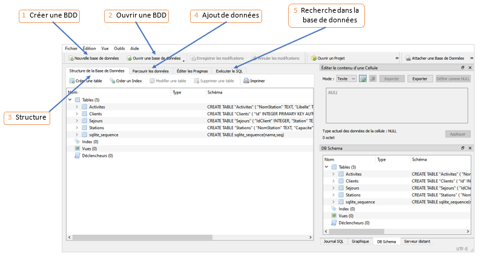
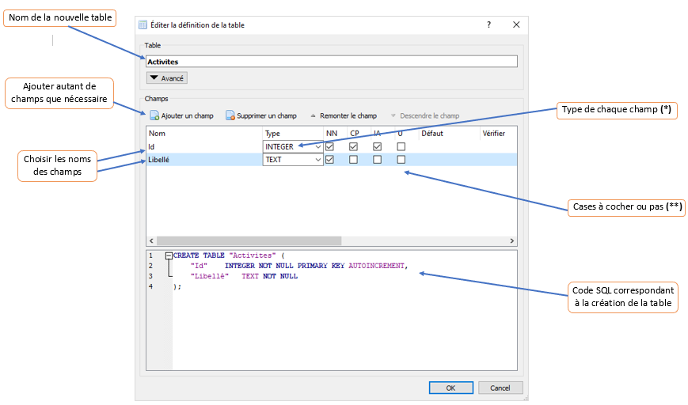
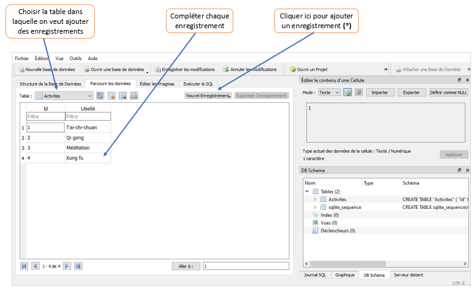
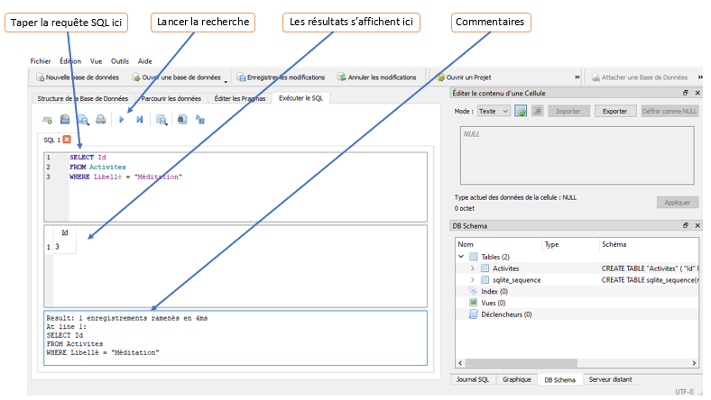

# <center><div class = "titre2_SQL"> Présentation du logiciel DB Browser for SQLite </div></center>

Ce logiciel gratuit et libre permet de créer et manipuler des bases de données sans avoir besoin d’un serveur (contrairement à __MySQL__ par exemple). Son interface est agréable et très intuitive.

### <div class = "encadré18_SQL"> __Téléchargement et installation__ </div>

Le logiciel se trouve <a href="https://sqlitebrowser.org/dl/" target="_blank">ici</a>. Sur Windows, on peut choisir :
<div class = "couleur_puce8">

* La version 64-bit qui doit être installée sur l’ordinateur (version 32-bit pour un ordinateur ancien).
* La version portable qu’on peut laisser sur une clé USB ou sur un dossier réseau, pour une exécution sans installation.
</div>

### <div class = "encadré19_SQL"> __Utilisation__ </div>

Au lancement, la fenêtre devrait ressembler à cela :
<center>


</center>
<div class="list2_1">

1. Création d’une base de données (onglet __Nouvelle base de données__)

</div>
<div class="couleur_puce9">

*  On choisit un emplacement (dossier réseau ou clé USB) et un nom de fichier avec l’extension « db » ou « sqlite » (par <div class="decal3">exemple *Essai.db*).</div>
*  On ajoute une table (voir point 3).

</div>
ou
<div class="list2_2">

2. Ouvrir une base de données existante (onglet __Ouvrir une  base de données__).  
   <div class="decal2">Il suffit d’ouvrir le fichier précédemment sauvegardé (par exemple *Exemple_du_cours.db*).</div>
3. Création de la structure de la base de données (onglet __Structure de la base de données__) :

</div>
<div class="couleur_puce9">

*  Cliquer sur __Créer une table__.
<center>


</center>

__(\*)__ Types de données : __INTEGER__ pour des entiers, __REAL__ pour des nombres quelconques, __TEXT__ pour du texte, etc.  
__(\*\*)__ Cases à cocher, suivant les cas : « *Non null* » si on ne veut pas que ce champ puisse être vide dans un enregistrement ; « *CP* » si le champ est une clé primaire ; « *IA* » (incrément automatique) si la valeur de ce champ doit être augmentée de 1 à chaque nouvel enregistrement (c’est souvent le cas
pour un champ « __id__ ») ; « *U* » si ce champ ne peut pas comporter deux fois la même valeur dans deux enregistrements différents.

*  Recommencer pour toutes les tables nécessaires à la base de données.
*  Sauvegarder régulièrement…

</div>
<div class="list2_4">

4. Ajout d’enregistrements (onglet __Parcourir les données__) : 

</div>
<center>


</center>

__(\*)__ On remarquera que la valeur d’un champ « __id__ » est automatiquement augmenté (si la case « *IA* » a été cochée à l’étape 3).  

On peut aussi ajouter un enregistrement en __SQL__ (voir ci-dessous) avec l’instruction :

```SQL
INSERT INTO Activites VALUES (5, 'Do-In')
```

ou de manière équivalente pour ce même enregistrement :

```SQL
INSERT INTO Activites VALUES (Null, 'Do-In')
```

(« __id__ » est automatiquement augmenté d’où la valeur `Null`).
Bien penser à sauvegarder.
<div class="list2_5">

5. Questionnement de la base de données (onglet __Exécuter le SQL__) :

</div>
<center>


</center>