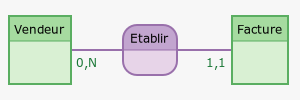
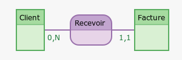
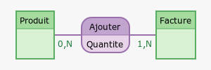
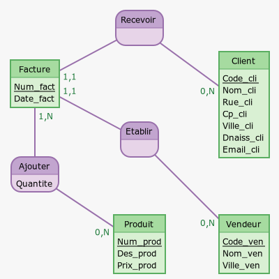
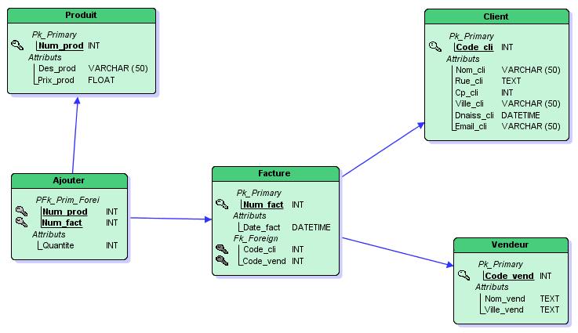

# 

 Correction de l'exercice bilan 

1. 

1. On peut identifier 4 entités :

- « Vendeur » et l'identifiant est « *Code_ven* »
- « Client » et l'identifiant est « *Code_cli* » 
- « Facture » et l'identifiant est « *Num_fact* »
- « Produit » et l'identifiant est « *Num_prod* »

2. Pour l'association « Etablir » :

!!! tools "__Précisions__"
	* Un vendeur peut ne pas être associé à une facture ou bien il peut être associé à plusieurs factures, d'où la cardinalité coté « Vendeur » de $(0,N)$.
	 * Une facture ne peut être associée qu'à un seul vendeur.

 
Pour l'association « Recevoir » :
 

!!! tip "__Remarques__"
	* Un client peut ne pas être associé à une facture ou bien il peut être associé à plusieurs factures, d'où la cardinalité coté « Client » de $(0,N)$.
	* Une facture ne peut être associée qu'à un seul client.

 
Et enfin, pour l'association « Ajouter » :
 

!!! tip "__Remarques__"
		* Un produit peut ne pas être associé à une facture ou bien il peut être associé à plusieurs factures, d'où la cardinalité coté « Produit » de $(0,N)$.
		* Une facture peut être associée au minimum à un produit mais aussi à plusieurs.

1. 

  
2. 

