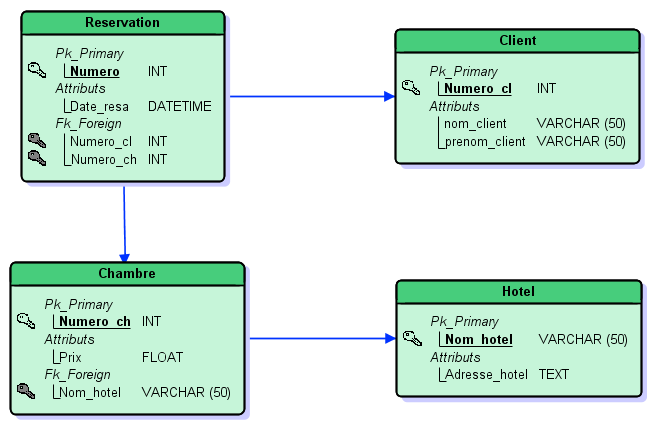
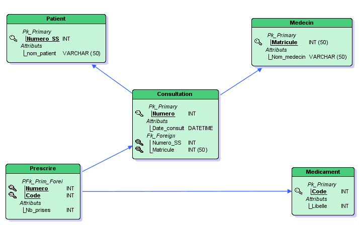

# 

 Correction des exercices 

### 
 __Correction de l'exercice 1__ 

1. Le nom du client n'est pas l'attribut identifiant l'entité « Client ».   
L'identifiant est ici l'attribut « *Numero* ». Il peut donc y avoir des clients homonymes, ces clients auront des numéros différents.
2. La cardinalité maximale de l'entité « Client » est $N$ donc un client peut réserver plusieurs fois.  
Cependant, d'après la cardinalité de l'entité « Réservation », une chambre ne peut correspondre qu'à une et une seule réservation. On en conclut qu'un client peut réserver plusieurs chambres à une date donnée s'il effectue plusieurs réservations.
3. Oui, un client peut réserver une chambre sur plusieurs jours à condition qu'il effectue plusieurs réservations.
4. Oui, pour savoir si une chambre est disponible à une date donnée, il faudra lister les réservations et s'assurer qu'il n'y en a aucune à la date donnée.
5. Oui dans ce schéma, rien ne garantit qu'une même chambre puisse être louée qu'une seule fois.

### 
 __Correction de l'exercice 2__ 

Il faut commencer par convertir toutes les entités en relations et ensuite compléter ces relations en fonction des associations.

!!! tools "__Conseils__"
	

	* On convertit les 4 entités en 4 relations en changeant les identifiants en clé primaires.
	* Ici, nous n'avons que des associations possédant au moins une cardinalité $(0,1)$ ou $(1,1)$, il suffit donc d'ajouter les clés étrangères dans les relations existantes.
	* Il faut lier ces contraintes de clés étrangères aux clés primaires dont elles sont issues. 

	

??? key "__Solution__"
	

	
	

### 
 __Correction de l'exercice 3__ 

1. Oui car la cardinalité maximale $N$ (côté entité « Patient ») existant sur l'association « Assister » exprime le fait qu'un patient peut participer à plusieurs consultations.
2. Non car une consultation est donnée par un et un seul médecin, cela est spécifié par la cardinalité $(1,1)$ côté entité « Consultation » sur l'association « Donner ».  
De même, seul un patient assiste à une consultation. Cela est également spécifié par la cardinalité $(1,1)$ côté « Consultation » sur l'association « Assister ».
3. Oui, au minimum, aucun médicament n'est prescrit par le médecin (cardinalité minimale $0$) et au maximum, plusieurs médicaments peuvent être prescrits par le médecin (cardinalité maximale $N$).
4. Oui, rien n'empêche que deux médecins prescrivent le même médicament pour deux consultations différentes. Ceci est bien exprimé par la cardinalité $(0,N)$ côté entité « Médicament » sur l'association « Prescrire ». Cela signifie qu'un médicament peut participer plusieurs fois à cette association comme il peut ne pas participer du tout (c'est le cas où un médicament n'est jamais prescrit).

### 
 __Correction de l'exercice 4__ 

La méthode est la même que celle utilisée dans l'exercice 2. La seule différence est qu'il existe dans ce schéma une association sans cardinalité $(0,1)$ ou $(1,1)$, il faudra donc créer une relation propre à cette association.

??? key "__Solution__"
	

	
	

!!! warning "Attention"  
	Il faut bien veiller à définir comme clé primaire de la relation « Prescrire » les deux clés étrangères « *Numero* » et « *Code* ».

### 
 __Correction de l'exercice 5__ 

| Relation    | Attribut  | Type       | Unicité | Domaine éventuel | Valeur nulle permise | Clé |
| :---------: | :-------: | :--------: | :-----: | :--------------: | :-----------------:  |     |
| Chambre     | Nom_hotel |    Texte   |  Non    |				    |			Non		   |  CE |
| Chambre     | Prix      |      Réel  |    Non  |		R^+^     	|		Oui			   |     |
| Réservation | Date_resa |     Date   |  Non    |				    |			Oui		   |     |
| Client      | Numero_cl    |    Entier  |    Oui  |			        |				Non	   |  CP |

!!! warning "Attention"
	

	* « *Nom_Hotel* » est une clé étrangère dans la relation « Chambre », il ne peut être nul, par contre, il peut ne pas être unique.
	* « *Prix* » doit vraisemblablement être positif.
	* « *Date_resa* » n'est pas unique et n'est pas nécessairement présent.
	* « *Numero_cl* » est bien la clé primaire de la relation « Client », cet attribut est donc unique et non nul.

	

	
### 
 __Correction de l'exercice 6__ 

On dénombre 3 anomalies :

* Il ne peut pas y avoir dans les valeurs de l'attribut « *Numero* » des valeurs identiques puisque cet attribut est la clé primaire de la relation « Consultation ».
* Le « *Numero_SS* » ne peut être absent dans la première occurrence. En effet, il fait le lien avec le patient.
* Le « *Numero_SS* » doit être de type entier, donc 'Aspirine' ne convient pas comme valeur.

!!! tip "__Remarques__"
	

	
	* « *Date_consult* » peut être absente, nous n'avons aucune contrainte sur cet attribut.
	* Nous pouvons avoir le même matricule sur des occurrences différentes. En effet, un médecin peut effectuer plusieurs consultations. La seule contrainte, c'est d'avoir un numéro différent.

	
