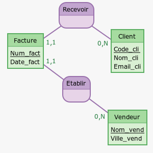

# 

 Exercice bilan 

Pendant la phase de conception, toutes les données recueillies et spécifiées sont inscrites dans ce que l'on appelle un dictionnaire de données.  
On dispose du dictionnaire de données suivant :

| Code de la donnée   | Description 		 	      | Type       |
| :-----------------: | :---------------------------: | :--------: |
| Code_ven            | Identifiant du vendeur 		  |    Entier  |
| Nom_ven   		  | Nom du vendeur        		  |    Texte   |  
| Ville_ven			  | Ville où travaille le vendeur |    Texte   |
| Code_cli    		  | Identifiant du client   	  |    Entier  |
| Nom_cli   		  | Nom du client   			  |    Texte   |
| Rue_cli    		  | Rue où habite le client  	  |    Texte   |
| Cp_cli  		      | Code postal du client   	  |    Entier  |
| Ville_cli     	  | Ville où habite le client     |    Texte   |
| Dnaiss_cli     	  | Date de naissance du client   |    Date    |
| Email_cli   	      | Adresse mail du client  	  |    Texte   |
| Num_fact   		  | Identifiant de la facture     |    Entier  |
| Date_fact 	      | Date de facturation  		  |    Date    |
| Num_prod   	      | Identifiant du produit  	  |    Entier  |
| Des_prod   	      | Désignation du produit  	  |    Texte   |
| Prix_prod   	      | Prix du produit  			  |    Réel    |
| Quantite   		  | Quantité commandée  		  |    Entier  |

1. A partir de l'analyse du dictionnaire de données précédent : 

1. Identifier les différentes entités en jeu ainsi que leurs identifiants.
2. Les 3 associations mises en jeu par ces entités seront nommées « Etablir », « Recevoir » et « Ajouter ».  

Pour chacune d'entre elles, spécifier leur cardinalité et éventuellement leurs attributs.

2. Compléter les données manquantes au modèle conceptuel Entités/Associations suivant :

??? plus-circle "Modèle à compléter :"
	

	
	

3. En déduire le modèle relationnel.

