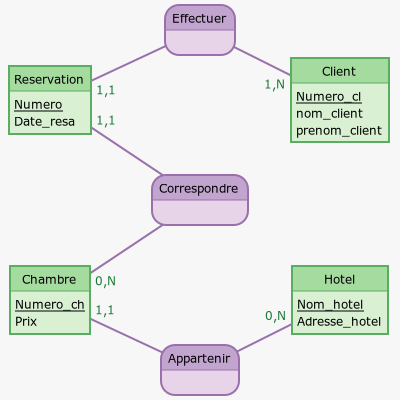
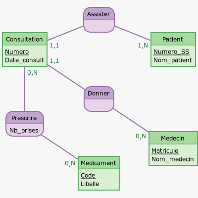

# 

 Exercices 

  
### 
__Exercice 1__

On souhaite gérer des réservations dans une compagnie d'hôtels. On considère donc le modèle Entités/Associations suivant :

A l'aide de ce modèle, répondre aux questions suivantes :

1. Peut-on avoir des clients homonymes ?
2. Un client peut-il réserver plusieurs chambres à une date donnée ?
3. Est-il possible de réserver une chambre sur plusieurs jours ?
4. Peut-on savoir si une chambre est libre à une date donnée ?
5. Peut-on réserver plusieurs fois une chambre à une date donnée ?

[Correction de l'exercice](Correction_des_exercices.md#correction-de-lexercice-1){:target="_blank"}

### 
 __Exercice 2__ 

Donner le schéma relationnel de la base de données « compagnie d'hôtels » décrite par le modèle Entités/Associations dans l'exercice précédent.

[Correction de l'exercice](Correction_des_exercices.md#correction-de-lexercice-2){:target="_blank"}

### 
 __Exercice 3__ 

On donne ci-dessous le modèle Entités/Associations représentant des visites dans un centre médical.

En utilisant ce modèle, répondre aux questions suivantes :

1. Un patient peut-il effectuer plusieurs visites ?
2. Un médecin peut-il recevoir plusieurs patients dans la même consultation ?
3. Peut-on prescrire plusieurs médicaments dans une même consultation ?
4. Deux médecins différents peuvent-ils prescrire le même médicament ?

[Correction de l'exercice](Correction_des_exercices.md#correction-de-lexercice-3){:target="_blank"}

### 
 __Exercice 4__ 

Donner le schéma relationnel de la base de données « visites médicales » décrite par le modèle Entités/Associations dans l'exercice précédent.

[Correction de l'exercice](Correction_des_exercices.md#correction-de-lexercice-4){:target="_blank"}

### 
 __Exercice 5__ 

A partir du modèle relationnel construit dans l'exercice 2, recopier et remplir le tableau ci-dessous :

| Relation    | Attribut  | Type       | Unicité | Domaine éventuel | Valeur nulle permise | Clé |
| :---------: | :-------: | :--------: | :-----: | :--------------: | :-----------------:  | :--:    |
| Chambre     | Nom_hotel |            |         |				    |					   |     |
| Chambre     | Prix      |            |         |					|					   |     |
| Réservation | Date_resa |            |         |				    |					   |     |
| Client      | Numero_cl    |            |         |			        |					   |     |

Pour la colonne « Type », on choisira parmi : __Entier__, __Réel__, __Texte__ et __Date__.  
Pour les colonnes « Unicité » et « Valeur nulle permise », on répondra par __Oui__ ou __Non__.  
Pour la colonne « Clé », on mettra __CP__ pour clé primaire et __CE__ pour clé étrangère ou on laissera vide.  
Pour la colonne « Domaine éventuel », on précisera le domaine possible.  

[Correction de l'exercice](Correction_des_exercices.md#correction-de-lexercice-5){:target="_blank"}

### 
 __Exercice 6__ 

On donne ci-dessous les occurrences de la relation « Consultation » issue du modèle relationnel construit dans l'exercice 4.  
Citer les anomalies constatées :

| Numero    | Matricule | Numero_SS       | Date_consult |
| :-------: | :-------: | :-------------: | :----------: |
| 1         | 123       |                 |  21/11/2019  |
| 2         | 123       | 182086926825812 |              |
| 2         | 526       |   'Aspirine'    |  13/02/2020  |

[Correction de l'exercice](Correction_des_exercices.md#correction-de-lexercice-6){:target="_blank"}
