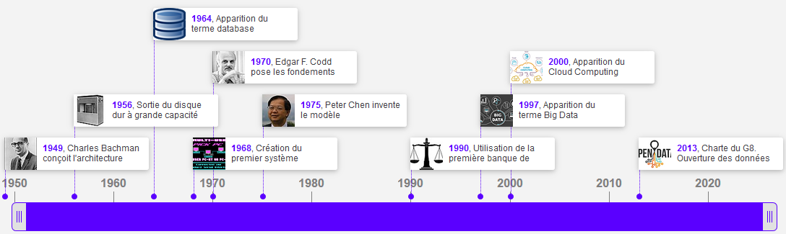
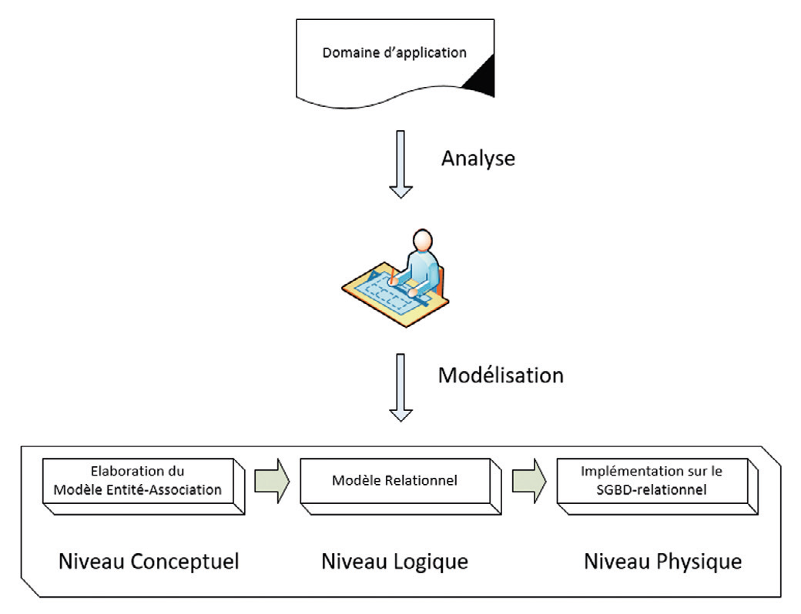
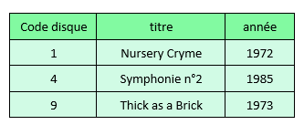
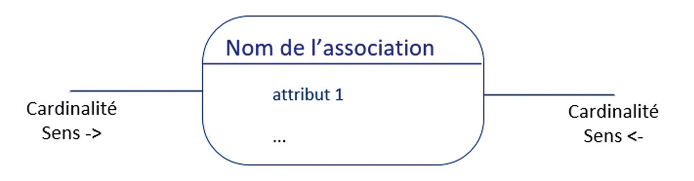
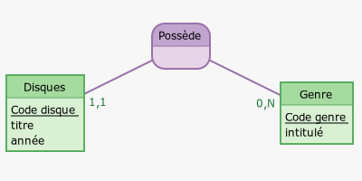
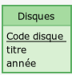
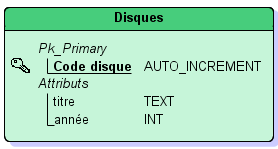
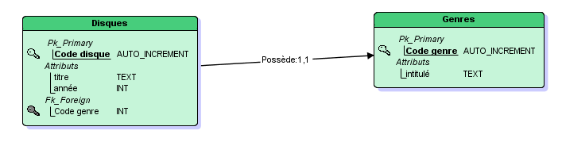
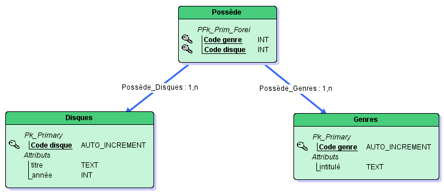

# 

Les bases de données
 

## 
__Introduction aux bases de données__

!!! book "__Définitions__"
    
    ??? plus-circle "__BDD__"
    	Une __Base De Données (BDD)__ représente un __ensemble ordonné de données__ dont l'organisation est régie par un modèle de données. 
    
	??? plus-circle "__SGBD__"
		Le __Système de Gestion de Bases de Données (SGBD)__ peut être vu comme le logiciel qui prend en charge __la structuration, le stockage, la mise à jour et la maintenance des données.__ C'est en fait l'interface entre la base de données et les multiples utilisateurs (ou leurs programmes). 

!!! castle "Historique"
	Quasiment toutes les bases de données que nous utilisons aujourd'hui sont basées sur les travaux d'__Edgar F. Codd__ (1970). C'est le point essentiel dans l'histoire des bases de données.
	 
	
	

	<a href="https://www.timetoast.com/timelines/2317528" target="_blank">Cliquer ici pour voir cette frise chronologique</a>
	

## 
__Premiers problèmes... et premières solutions__

Organiser des données, où est le problème, direz-vous ? Y a-t-il vraiment besoin de faire des études pour cela ? Il suffit d'être un peu soigneux, et il n'y a aucune raison que ça se passe mal.

Eh bien si, en fait. Les données, quand elles se présentent en (très) grandes quantités, posent des problèmes auxquels on ne s'attend pas. C'est bien pour cela qu'on a mis au point un certain nombre de règles et de méthodes qui, si elles ne peuvent dispenser personne de réfléchir, aident néanmoins à réfléchir en évitant les catastrophes les plus courantes.

Voyons les problèmes les plus évidents qui se posent lorsqu'on veut organiser des informations. Pour cela, imaginons que nous voulions informatiser les rayons de ma discothèque… – enfin, disons les dix premiers CD du rayonnage, parce que sinon, ça va être un peu longuet.

Faisons simple pour commencer : nous ne noterons, pour chaque CD, que le titre, l'année, le nom de l'artiste et le genre musical. Cela nous donne la liste suivante :

*   Nursery Cryme, Genesis, 1972, rock progressif
*   Foxtrot, Genesis, 1972, rock progressif
*   Selling England by the Pound, Genesis, 1973, rock progressif
*   Symphonie n°2, Sibelius, 1985, classique
*   Symphonie n°7, Sibelius, 1987, classique
*   Concerto pour violon, Mendelssohn, 1992, classique
*   Crime passionnel, Guidoni, 1982, chanson française
*   5th Gear, Brad Paisley, 2007, country
*   Thick as a Brick, Jethro Tull, 1973, rock progressif
*   Purpendicular, Deep Purple, 1996, rock

Il va de soi que pour représenter de telles informations, une liste c'est bien, mais qu'un tableau, ce serait beaucoup mieux.  
Les conventions étant en accord avec ce que nous suggère l'intuition, on mettra en ligne, les uns en-dessous des autres, les différents disques (autrement dit, en quelque sorte, les « individus » de notre base). Et on portera en colonne les différents renseignements dont on dispose pour chacun de ces individus. Naturellement, il est préférable – et, en réalité, obligatoire – de nommer ces colonnes : ma discothèque prendrait ainsi la forme du tableau suivant :

| Titre                           | Artiste       | Annee | Genre             |
| :---------:                     | :-----------: | :---: | :---------------: |
| Nursery Cryme                   | Genesis       | 1972  | rock progressif   |
| Foxtrot                         | Genesis       | 1972  | rock progresif    |
| Selling England by the Pound    | Genesis       | 1973  | rock progressif   |
| Symphonie n°2                   | Sibelius      | 1985  | classique         |
| Symphonie n°7                   | Sibelius      | 1987  | classique   	  |
| Concerto pour violon            | Mendelssohn   | 1992  | Classique         |
| Crime passionnel                | Guidoni       | 1982  | chanson française |
| 5th Gear                        | Brad Paisley  | 2007  | country           |
| Thick as a Brick                | Jethro Tull   | 1973  | rock progressif   |
| Purpendicular                   | Deep Purple   | 1996  | rock              |

Or, ce petit tableau, à lui seul, fait apparaître au moins deux problèmes majeurs.

* Le premier, c'est que des informations identiques s'y répètent : en l'occurrence, celles concernant les artistes, et encore plus, le 
genre. En termes savants, on parle de __redondance__ des informations. Imaginons que ma discothèque comporte plusieurs centaines de CDs, il y a fort à parier que la mention « classique » ou « rock progressif » va se retrouver répliquée des dizaines de fois. Or, tout cela, il va bien falloir le stocker quelque part sous forme de bits et d'octets, et des informations inutilement répétées, ce sont des __octets inutilement occupés__… On n'en meurt pas, direz-vous. Certes, encore que.

* Le second problème, lié au premier, est pour sa part rédhibitoire. C'est que vu la manière dont j'ai bâti mes informations, je ne 
suis pas à l'abri d'une erreur, ou même d'un simple manque d'homogénéité, dans la saisie. Par exemple, lorsque j'ai tapé le genre du CD Foxtrot, j'ai oublié les deux « s » de « progressif », ce qui est une faute de frappe assez classique. De même, le genre « classique » est orthographié tantôt avec une majuscule, tantôt sans majuscule. Tout cela est fort préjudiciable pour la suite des événements. Si je fais une recherche, par exemple, sur le genre « rock progressif » ou « classique », il manquera des CDs qui auraient dû y figurer. Cette organisation laisse donc la possibilité qu'existe une __hétérogénéité__ des données, un des pires cauchemars de l'informaticien (qui pourtant n'en manque pas).

Ces deux problèmes possèdent une solution commune, très simple mais extrêmement efficace, qui consiste à recenser __séparément__ les CDs et les genres :

| Titre                           | Artiste       | Annee |
| :---------:                     | :-----------: | :---: |
| Nursery Cryme                   | Genesis       | 1972  |
| Foxtrot                         | Genesis       | 1972  |
| Selling England by the Pound    | Genesis       | 1973  |
| Symphonie n°2                   | Sibelius      | 1985  |
| Symphonie n°7                   | Sibelius      | 1987  |
| Concerto pour violon            | Mendelssohn   | 1992  |
| Crime passionnel                | Guidoni       | 1982  |
| 5th Gear                        | Brad Paisley  | 2007  |
| Thick as a Brick                | Jethro Tull   | 1973  |
| Purpendicular                   | Deep Purple   | 1996  |

|Genre             |
|:---------------: |
|chanson française |
|classique         |
|country           |
|rock              |
|rock progressif   |

Il ne reste plus à présent qu'à préciser à quel genre appartient chaque CD. Pour ce faire, on identifie chaque genre par un code unique : 

| Code | Genre             |
| :--: | :---------------: |
| 1    |chanson française  |
| 2    |classique          |
| 3    |country            |
| 4    |rock               |
| 5    |rock progressif    |

Et on reporte ce code dans le tableau des CDs :

| Titre                           | Artiste       | Annee | Code              |
| :---------:                     | :-----------: | :---: | :---------------: |
| Nursery Cryme                   | Genesis       | 1972  | 5                 |
| Foxtrot                         | Genesis       | 1972  | 5                 |
| Selling England by the Pound    | Genesis       | 1973  | 5                 |
| Symphonie n°2                   | Sibelius      | 1985  | 2                 |
| Symphonie n°7                   | Sibelius      | 1987  | 2                 |
| Concerto pour violon            | Mendelssohn   | 1992  | 2                 |
| Crime passionnel                | Guidoni       | 1982  | 1                 |
| 5th Gear                        | Brad Paisley  | 2007  | 3                 |
| Thick as a Brick                | Jethro Tull   | 1973  | 5                 |
| Purpendicular                   | Deep Purple   | 1996  | 4                 |

Ainsi, nous venons de faire d'une pierre deux coups :

* On a __économisé de la place en mémoire__, car stocker un code mobilise beaucoup moins d'octets que stocker un intitulé.
* Surtout, on a pris __une garantie contre les informations hétérogènes__ : le code correspond toujours au même intitulé, et on ne peut plus guère imaginer se retrouver avec un même genre musical orthographié différemment.

Ce que nous venons de faire, c'est – en tout petit – le fond de la question en matière de modélisation de l'information : nous venons de créer une __relation__ entre deux tables (deux __entités__) ; voilà pourquoi on parle de __Systèmes de Bases de Données Relationnelles__. Tout ce que nous allons voir ensuite, n'est pour ainsi dire que des complications et des raffinements à partir de cette base simple.

Cela dit, jusqu'à maintenant, nous avons procédé uniquement par intuition – or, vous vous en doutez bien, il existe un certain nombre de formes pré-établies, de standards (tant de méthode que de représentation) pour venir à bout des problèmes les plus complexes. Ce sont ces formes et ces standards que nous allons aborder à présent.

??? danger "Remarque capitale"  
	Il suffit d'observer la situation à laquelle nous sommes parvenus pour constater que nous n'avons parcouru que la moitié du chemin. Nous avons certes éliminé une source de redondances en créant la table « *Genre* ». Mais nous en avons laissé une deuxième : celle liée aux artistes. Il est donc essentiel de comprendre que ce qui est présenté ici n'est que le premier pas, et que notre modélisation est irrecevable en l'état.

## 
__Conception de bases de données relationnelles__

La conception des bases de données est la tâche la plus ardue du processus de développement du système d’information. Les méthodes de conception préconisent une démarche en étapes et font appel à des modèles pour représenter les __objets__ qui composent les systèmes d’information, les __relations__ existantes entre ces objets ainsi que les __règles sous-jacentes__. La modélisation se réalise en trois étapes principales qui correspondent à trois niveaux d’abstraction différents :

=== "__Niveau conceptuel__"
	La représentation de la base de données est faite indépendamment de toute considération informatique. C'est le niveau le plus abstrait (mais qui contient déjà toutes les informations indispensables pour la construction de la base de données). On parle de __Modèle Conceptuel de Données (MCD)__.

=== "__Niveau logique__"
	Il s'agit de l'adaptation du schéma conceptuel en tableaux à deux dimensions. Ce niveau est plus proche de ce que sera la base effective qui sera réalisée sur machine. On parle ici de __Modèle Logique des Données (MLD)__.

=== "__Niveau physique__"
	Implémentation informatique sur un système de gestion de bases de données relationnelles (SGBD).

??? warning "Remarque importante"  
	Le point crucial à enregistrer dès maintenant, c'est que le __MLD__ se déduit strictement du __MCD__ d'après des règles formelles. Autrement dit, une fois le __MCD__ réalisé, il n'y a plus besoin de réfléchir une seule seconde pour produire le __MLD__ : tout se fait par automatismes. La meilleure preuve, c'est qu'il existe des logiciels qui se proposent de réaliser le __MLD__ d'un clic de souris, d'après le __MCD__. En revanche, il n'existe rien de tel pour concevoir le __MCD__ : le seul ingrédient qui entre dans sa composition est l'huile de neurones...

## 
__Le modèle Entité–Association__

###  
__Entités, attributs et identifiants__
 

Ce modèle permet de distinguer les entités qui constituent la base de données et les associations entre ces entités.

!!! book "__Définitions__"
    
    ??? plus-circle "__Entités__"
    	=== "Définition"
			On appelle __entité__ un __objet pouvant être identifié distinctement__. 
    		Chaque entité est donc unique.  

    	=== "Retour à l'exemple"
    		Pour notre discothèque, on propose très logiquement les entités « Disques » et « Genres ».
    
	??? plus-circle "__Attributs__"
		=== "Définition"
			Chaque entité est décrite par un ensemble de propriétés appelées __attributs__.

		=== "Retour à l'exemple"
    		Pour notre discothèque, l'entité « Disques » possède les attributs « *Titre* », « *Artiste* » et « *Année* » tandis que l'entité « Genres » possède l'attribut « *Intitulé* » (on évite de donner le même nom à une entité et à un de ses attributs).

	??? plus-circle "__Identifiant__"
		Un ou plusieurs attributs permettent d'identifier de manière unique l'entité, on parle alors d'__identifiant__ (ou de __clé primaire__ (*Primary Key* en anglais)).

On peut représenter une entité par le schéma suivant  :

|Nom de l'entité   		|
|:---------------: 		|
|<u>__identifiant__</u>	|
|attribut 1        		|
|attribut 2        		|
|...               		|
|...               		|

Un attribut est désigné par :

* Un nom
* Une valeur de type défini (entier, chaine de caractères, booléen...)

??? danger "Remarque capitale"  
	L'étape consistant à créer autant d'entités que nécessaire est la première de toutes, et elle est absolument fondamentale. Le critère est simple : __aucune valeur de propriété ne doit se répéter__ (sauf peut-être, à titre exceptionnel) __dans aucune table__.
	Cette règle, intangible quand il s'agit de valeurs de type texte, peut être assouplie lorsqu'il s'agit de valeurs numériques (dont les dates) : il serait en effet un peu ballot d'économiser la répétition d'un nombre... au prix de la création d'un code permettant d'accéder à ce nombre : ce serait payer de la main gauche ce qu'on économise de la main droite. Cependant, créer une entité composée uniquement de nombres peut se justifier, lorsqu'on veut restreindre les possibilités à un certain ensemble de valeurs (par exemple, les différentes motorisations disponibles pour une automobile).

En ce qui concerne l'identifiant, il est en fait assez rare de trouver spontanément un ou plusieurs attributs capables de jouer ce rôle. Même les propriétés qui semblent faire de bonnes candidates (par exemple, une plaque d'immatriculation ou un numéro de sécurité sociale) ne sont pas forcément aussi opportuns qu'elles en ont l'air, pour un certain nombre de raisons. Et il n'est pas rare qu'aucune des propriétés présentes ne puisse nous prémunir contre les doublons ; c'est le cas avec l'entité « Disques » de notre exemple : plusieurs Cds peuvent très bien avoir le même titre, et je ne parle pas de l'auteur ni de l'année. On ne peut pas davantage exclure la possibilité que deux auteurs homonymes aient sorti la même année un disque portant le même titre (ce qui nous empêche donc d'avoir confiance dans une clé primaire constituée de la combinaison des trois propriétés).

Voilà pourquoi le plus souvent, on sera amené à créer une __propriété supplémentaire__ destinée uniquement à jouer le rôle d'identifiant / clé primaire. Il s'agira presque toujours d'un code, unique pour chaque occurrence de l'entité (et voilà pourquoi un nombre de type « autoincrément » est si pratique). Ce code sera rarement visible par l'utilisateur, qui ignorera sans doute son existence : il n'en sera pas moins indispensable pour le système informatique.  
Ainsi, les deux entités de notre discothèque pourront être représentées ainsi :

|Disques  				|
|:---------------: 		|
|<u>__Code disque__</u>	|
|titre        			|
|année               	|

|Genres  				|
|:---------------: 		|
|<u>__Code genre__</u>	|
|intitulé               |

Une entité peut avoir une ou plusieurs occurrences (et parfois même aucune).  
Pour illustrer cela, voici un exemple de 3 occurrences de l'entité « Disques » :

Ces occurrences sont appelées __tuples__ ou lignes.

??? warning "__Remarque importante__"
	Vous remarquerez que l'attribut « *auteur* » a disparu des radars... En effet, comme cet attribut possède des valeurs redondantes (la discothèque contient plusieurs CDs d'un même auteur), le critère de non-redondance des données impose de sortir cet attribut de l'entité « Disques ». On aurait très bien pu créer alors une troisième entité : l'entité « Auteur » par exemple mais cela n'a pas été fait ici dans le seul but de faciliter la compréhension des notions qui vont suivre.

### 
__Associations__
    

!!! book "__Définition__"

    ??? plus-circle "__Association__"
    	Une __association__ définit un __lien sémantique (= qui a un sens) entre des entités__.
        Elle permet de traduire une partie des règles de gestion qui n'ont pas été satisfaites par la simple définition des entités.
    	Une association est a minima caractérisée par :
    	

    	* Un __nom__ : généralement on utilise un verbe définissant le lien entre les entités.
    	* Deux __cardinalités__ : elles sont présentes sur les 2 extrémités du lien. Chaque cardinalité est un couple de valeurs (mini, maxi) qui traduisent 2 règles de gestion (une par sens).

    	

!!! tip "__Remarque__"
	Une association peut aussi avoir des attributs.

On peut représenter une association par le schéma suivant :

Dans le cas de notre discothèque, puisque chaque CD __possède__ un genre (et pas n'importe lequel), les deux entités se trouvent naturellement en relation l'une avec l'autre et on peut nommer « possède » cette association.

### 
__Cardinalités__

Il s'agit maintenant de déterminer les cardinalités. Pour cela, on se pose la question suivante : à combien d'éléments de l'autre entité chaque élément peut-il être associé ? Lorsqu'on bâtit une relation entre deux entités, on doit nécessairement préciser ce point, car de lui dépendent de très importantes conséquences.

Ici, il paraît évident qu'un même genre musical peut être représenté par plusieurs disques. En sens inverse, en revanche, on peut être embêté pour décider à combien de genres peut correspondre chaque disque. On peut en effet imaginer soit que chaque disque ne puisse être rattaché qu'à un genre et un seul afin de faciliter le classement, soit qu'à chaque disque on puisse attribuer plusieurs genres à la fois, ce qui introduit davantage de complexité, mais aussi davantage de souplesse.

La décision, dans cette alternative, n'appartient pas à l'informaticien : il s'agit d'un choix d'ordre fonctionnel, qui doit être subordonné aux besoins de l'organisation pour laquelle est conçue la base de données. Il n'existe donc aucune règle qui permette de trancher a priori entre les deux possibilités... excepté que la technique doit être au service des besoins de ceux qui s'en serviront, et non l'inverse. En revanche, ce qui nous intéresse ici, ce sont les conséquences de ce choix sur notre base de données.

#### 
__Cardinalités minimum et maximum__

De là, il faut distinguer le nombre minimum et le nombre maximum de ces correspondances : pour chaque élément d'une entité, on doit donc stipuler à combien d'éléments de l'autre entité celui-ci est susceptible de correspondre, au minimum et au maximum. Ainsi, toute relation entre deux entités A et B impose de préciser quatre nombres (quatre cardinalités) : cardinalité minimum de A vers B, maximum de A vers B, minimum de B vers A, maximum de B vers A.

En reprenant l'exemple de la discothèque, cela revient à se poser les questions suivantes :

* À combien de genres au minimum correspond chaque CD ? (autrement dit : un CD peut-il ne pas avoir de genre, ou en a-t-il 
forcément au moins un ?)

* À combien de genres au maximum correspond chaque CD ? (autrement dit : un CD peut-il avoir plusieurs genres, ou est-il limité 
à un seul ?)

* À combien de CDs au minimum correspond chaque genre ? (autrement dit : ma table des genres comprend-elle uniquement 
des genres qui correspondent à mes CDs, ou peut-il y avoir des genres « orphelins » ?)

* À combien de CDs au maximum correspond chaque genre ? (autrement dit : puis-je avoir plusieurs CDs du même genre, ou est-
ce interdit ?)

Les cardinalités obéissent à un formalisme assez étroit :

#### 
__Formalisme des cardinalités : les différentes valeurs__

La cardinalité minimum ne peut prendre que les valeurs 0 ou 1. Autrement dit, soit on considère qu'un élément de la table A peut être en relation avec un (ou plusieurs) éléments de la table B (mais que ce n'est pas obligatoire), soit on considère que tout élément de la table A doit impérativement être en relation avec au moins un élément de la table B. Dans notre exemple, choisir 1 comme cardinalité minimum signifie qu'un disque doit être classé dans au moins un genre. Choisir 0 signifie qu'on estime que certains disques n'ont pas forcément de genre (le même problème se pose dans l'autre sens de la relation, pour savoir s'il peut exister ou non des genres sans disques).

La cardinalité maximum ne peut valoir que 1 ou N, autrement dit un ou plusieurs. C'est la discussion de tout à l'heure à propos des genres : autorise-t-on ou non chaque CD à être classé dans plusieurs genres à la fois ? En sens inverse, il ne fait aucun doute qu'à chaque genre, doivent pouvoir correspondre plusieurs CD.

Il n'existe donc que quatre cas de figure possibles pour les cardinalités : $(0,1)$, $(0,N)$, $(1,1)$ et $(1,N)$.

Voilà donc ce que cela donne pour notre exemple (*schéma réalisé à partir du site <a href="https://www.mocodo.net/" target="_blank">mocodo.net</a>*) :

*Schéma conceptuel des données pour la gestion d'une discothèque*
 

Cette représentation ne se lit pas n'importe comment. Pour être certain de ne pas commettre de contresens, lorsqu'on traduit le schéma ci-dessus, il vaut mieux éviter de dire « Les disques possèdent des genres », ou pire encore « La table disque possède certains genres ».  
La bonne traduction, celle qui vous évitera au maximum de commettre des erreurs, consiste à dire que « Chaque élément de la table Disques possède un et un seul genre ».  
En prenant l'affaire par l'autre bout, on peut tout aussi bien dire (même si c'est un peu laid à l'oreille) : « Chaque genre est possédé par zéro, un ou plusieurs disques ».

####  
__Raccourcis de langage__

Pour décrire les cardinalités, on va souvent user d'un raccourci de langage. Comme les cardinalités les plus décisives sur l'architecture de la base sont souvent les cardinalités maxima, on aura tendance à ne parler que d'elles.  
Ainsi, dans le cas d'une relation où l'une des deux cardinalités maximales vaut $1$ et l'autre $N$, on dira volontiers qu'on a affaire à une relation « un à plusieurs ». Lorsque les deux cardinalités maximales valent $N$, on parlera de relation « plusieurs à plusieurs ».

??? tip "__Remarque__"
	Une relation de type « un à un » (où, donc, les deux cardinalités maximum sont égales à $1$) est un cas limite. Cela signifie que nous avons créé deux entités qui en réalité n'en forment qu'une seule, puisque chaque élément de l'une corespond à un élément de l'autre, et à un seul. Ce n'est pas à proprement parler une faute, mais face à une telle situation, on a toujours intérêt à se demander ce qui justifie d'avoir créé deux entités plutôt qu'une seule.

## 
__Du MCD au MLD : première approche__

On rappelle que par rapport au __MCD__, le __MLD__ est un plan moins abstrait et plus proche de la réalité, c'est-à-dire de la base de données telle qu'elle existera sur les machines. On rappelle aussi que toute la difficulté de la modélisation réside dans l'élaboration du __MCD__. Une fois que celui-ci est conçu, le __MLD__ s'en déduit par l'application de quelques règles (on pourrait dire : d'un algorithme). Donc, le passage du __MCD__ au __MLD__ n'est qu'une question de rigueur, et plus du tout d'intelligence ou d'imagination.

### 
__Transformation d'une entité en relation__

Une première règle est que toute entité du __MCD__ est transformée en un __tableau à deux dimensions__ appelé __relation__ comme le montre la figure suivante :

!!! tip "__Remarques__"
	

	
	* __L'identifiant__ de l'entité devient la __clé primaire__ de la relation. Il est représenté sur la figure ci-dessus par une clé et la dénomination *Pk_Primary*.
	* L'ensemble des valeurs possibles d'un attribut définit un __domaine__.

	

	
On trouve également la notation textuelle : __NomRelation__(<u>identifiant</u>, attribut1, attribut2...).  
On peut par exemple noter la relation « Disques » par : __Disques__(<u>Code disque</u>, titre, année)

!!! tip "__Remarques__"
	

	
	* Le nom de la relation est en gras.
	* La clé primaire est soulignée.

	

### 
__Transformation d’une association en relation__

Selon les cardinalités maximales qui caractérisent la relation, les choses vont se passer très différemment.

#### 
Si l'une des deux cardinalités maximales vaut 1

Autrement dit, l'une des cardinalités est $(0,1)$ ou $(1,1)$, ce qui est le cas de notre exemple dont on remet ci-dessous le schéma :

*Schéma du __MCD__ lorsque l'une des deux cardinalités vaut* $(1,1)$
 

Concrètement, cela veut dire, comme dans notre exemple, que chaque CD possède un genre et un seul. Un CD ne peut pas ne pas avoir de genre ; il ne peut pas non plus en avoir plusieurs. Dans ce cas, dans le MLD, cette relation devient une relation directe entre les deux tables. L'identifiant de la table côté « plusieurs » devient une nouvelle propriété de la table du côté « un », ainsi que l'illustre cet exemple :

*Schéma du __MLD__ lorsque l'une des deux cardinalités vaut* $(1,1)$

!!! tip "__Remarques__"
	

	
	* On a ajouté un attribut « *Code genre* » dans la relation « Disques », cet attribut correspond à la clé primaire de la relation « Genres ». On dit que c’est une __clé étrangère__ (*Foreign Key*). Dans le schéma ci-dessus, elle est également représentée par une clé et la dénomination *Fk_Foreign*.
	* On lie ces deux attributs entre eux.

	

	
Dans l’écriture textuelle, on ajoute la clé étrangère avec le symbole « # » ou en soulignant l’attribut concerné par un trait en pointillé.

Par exemple la relation « Disques » devient : __Disques__(<u>Code disque</u>, #Code genre, titre, année).

#### 
__Si les deux cardinalités maximales sont N__

Autrement dit, si la relation est de type « plusieurs à plusieurs ». Voici ce que donnerait le schéma du __MCD__ dans le cas de notre discothèque :

*Schéma du __MCD__ lorsque les deux cardinalités maximales sont $N$*

Dans le __MLD__, la relation devient alors une __nouvelle table__, elle-même en relation avec les deux tables produites par les deux entités. Une telle table est dite __table de correspondance__, ou encore __table de liaison__, __table de jonction__, __table d'association__, etc. Elle ne contient pas à proprement parler de données : son rôle est d'organiser les rapports entre les éléments des tables qui, elles, les contiennent. Une table de jonction contiendra uniquement des propriétés correspondant aux clés primaires des deux entités, qu'elle associera deux à deux.

Et voici le schéma du __MLD__ :

*Schéma du __MLD__ lorsque les deux cardinalités maximales sont $N$*

!!! tip "__Remarque__"
	On a donc transformé l’association en relation par l’ajout de deux attributs correspondant respectivement aux clés primaires de chacune des entités. Dans ce cas, il y a donc __deux clés étrangères__. __Et ce couple de clés étrangères forme la clé primaire__ de la nouvelle relation.  
	Sur notre schéma, on a les 2 dénominations associées (*PFk_Prim_Forei*).

## 
__Les contraintes d'intégrité__

Le modèle relationnel impose une règle minimale qui est l'unicité des clés, comme nous allons le voir ci-dessous. Cependant, il existe plusieurs points pour respecter l'intégrité d'une base de données.

??? plus-circle "__Unicité de clé__"
    Par définition, une relation est un ensemble de tuples. Un ensemble n'ayant pas d'élément en double, il ne peut pas exister deux fois le même tuple dans une relation.  
    __Toute relation doit donc posséder une clé unique (clé primaire).__

??? plus-circle "__Contraintes référentielles__"
    Correctement construite, une base de données fait appel à des données situées dans différentes relations. Pour que les données restent utilisables et cohérentes, il ne faut pas que l'on puisse détruire des données qui dépendent les unes des autres. C'est le rôle de l'intégrité référentielle de protéger ces relations. Autrement dit, l'intégrité référentielle vérifie qu'une valeur de clé étrangère existe bien en tant que valeur de clé primaire dans une autre table. Dans notre exemple : des genres sont reliés à des disques. L'intégrité référentielle empêchera la suppression d'un genre si des disques y sont rattachés dans la base de données. En procédant ainsi, les genres seront toujours reliés à leurs disques et l'utilisateur ne pourra pas supprimer (involontairement) des données essentielles.

??? plus-circle "__Valeurs nulles__"
    Lors de l'insertion de tuples dans une relation, il arrive fréquemment qu'un attribut soit inconnu ou non applicable. Par exemple, l'année de sortie d'un disque peut être inconnue. On est alors amené à introduire dans la relation une valeur conventionnelle appelée valeur nulle.

    ??? warning "__Attention__"  
		Tout attribut dans une relation ne peut prendre une valeur nulle. En effet, l'existence d'une clé unique impose la connaissance de la clé afin de pouvour vérifier que cette valeur de clé n'existe pas déjà. La clé ne peut donc pas être nulle ! 

??? plus-circle "__Contraintes de domaine__"
    En théorie, une relation est construite à partir d'un ensemble de domaines. En pratique, les domaines gérés par les systèmes sont souvent limités aux types de base (entiers, réels, chaînes de caractères), parfois monnaie et date. Afin de spécialiser un type de données pour composer un domaine plus fin (par exemple, les années de sortie d'un disque qui peuvent être des entiers compris entre 1949 et 2100), cette notion de contrainte de domaine est souvent ajoutée aux règles d'intégrité.
