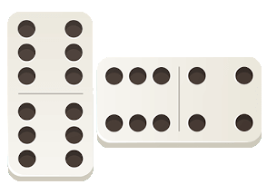
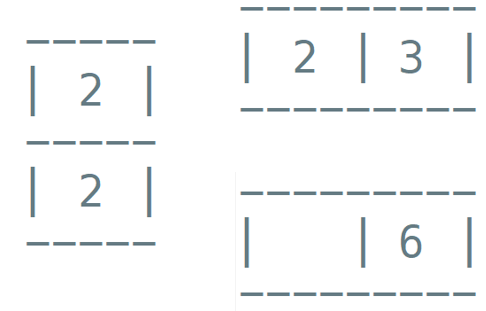

# 

Exercice
 

Le domino est un jeu très ancien constitué de 28 pièces toutes différentes. Sur chacune de ces pièces, il y a deux côtés qui sont constitués de 0 (blanc) à 6 points noirs.  
Lorsque les 2 côtés possèdent le même nombre de points, on l'appelle domino double.

1. Proposer une classe __Domino__ permettant de représenter une pièce. Les objets seront initialisés avec les valeurs des deux côtés 
(gauche et droite).  
On définira les méthodes suivantes :

* `#!python AfficherDomino(self)` qui affiche les valeurs des deux faces de manière horizontale pour un domino classique et de 
manière verticale pour un domino double comme le montre la figure suivante :

{width=40%}

* `#!python NbPoints(self)` qui compte le nombre de points sur un domino.
* `#!python EstBlanc(self)` qui teste si le domino est blanc (c'est-à-dire si au moins un des côtés est blanc).
* `#!python EstDouble(self)` qui teste si le domino est double. 

2. Proposer une classe __JeuDeDomino__ permettant de manipuler le jeu de domino complet.  

On définira les méthodes suivantes :

* `#!python CreerJeu(self)` qui crée un jeu de 28 pièces toutes différentes.
* `#!python Melanger(self)` qui mélange aléatoirement le jeu de dominos.
* `#!python Distribuer(self, nbJoueur)` qui extrait des dominos du jeu pour un joueur et retourne une liste de 6 ou 7 dominos selon 
le nombre de joueurs.

* `#!python AfficherJeu(self)` qui affiche toutes les pièces du jeu ou la pioche s'il y a eu distribution.
* `#!python AfficherJeuJoueur(self)` qui affiche les dominos qui viennent d'être distribués au joueur ainsi que le nombre de points 
dans son jeu.

