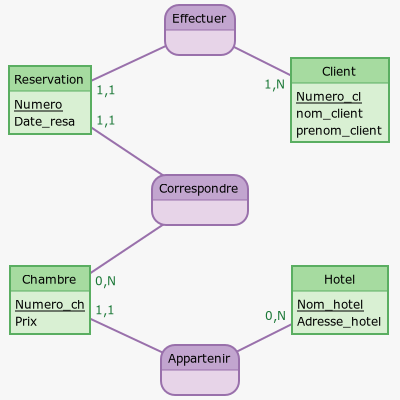
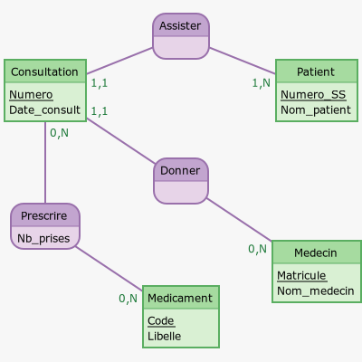

# 

 Exercices 

### 
 __Exercice 1__ 

Un fan de rock souhaite créer un site consacré à ses groupes préférés. Il doit donc tenir l'inventaire des disques, avec pour chacun d'eux le titre, l'artiste, le label et l'année.  
En ce qui concerne les groupes et les musiciens, une analyse fine montre que le problème est redoutable - on se contentera ici d'une approche simple.

On traitera successivement les deux hypothèses :

1. la discothèque ne comprend aucune compilation de différents artistes
2. la discothèque comprend des compilations

Etablir le MCD et le MLD dans ces deux cas.

[Correction de l'exercice 1 :material-cursor-default-click:](Correction_des_exercices.md#correction-de-lexercice-1){:target="_blank" .md-button}

### 
 __Exercice 2__ 

Une casse automobile souhaite gérer son stock de pièces.  
Chaque pièce est identifiée par une référence, une catégorie (carrosserie, mécanique, électricité, etc.), une date de récupération et un prix de vente.
On souhaite également pouvoir établir une correspondance entre les pièces et les véhicules pour lesquels elles conviennent, ces véhicules étant repérés par marque, modèle et année.

Etablir le MCD adéquat dans les deux hypothèses suivantes :

1. toutes les pièces d'une même référence possèdent un unique prix ;
2. chaque pièce possède un prix propre.

Etablir ensuite le MLD dans ces deux cas.

[Correction de l'exercice 2 :material-cursor-default-click:](Correction_des_exercices.md#correction-de-lexercice-2){:target="_blank" .md-button}

### 
__Exercice 3__

On souhaite gérer des réservations dans une compagnie d'hôtels. On considère donc le modèle Entités/Associations suivant :

{style="width: 45%" .image}

A l'aide de ce modèle, répondre aux questions suivantes :

1. Peut-on avoir des clients homonymes ?
2. Un client peut-il réserver plusieurs chambres à une date donnée ?
3. Est-il possible de réserver une chambre sur plusieurs jours ?
4. Peut-on savoir si une chambre est libre à une date donnée ?
5. Peut-on réserver plusieurs fois une chambre à une date donnée ?

[Correction de l'exercice 3 :material-cursor-default-click:](Correction_des_exercices.md#correction-de-lexercice-3){:target="_blank" .md-button}

### 
 __Exercice 4__ 

Donner le schéma relationnel de la base de données « compagnie d'hôtels » décrite par le modèle Entités/Associations dans l'exercice précédent.

[Correction de l'exercice 4 :material-cursor-default-click:](Correction_des_exercices.md#correction-de-lexercice-4){:target="_blank" .md-button}

### 
 __Exercice 5__ 

On donne ci-dessous le modèle Entités/Associations représentant des visites dans un centre médical.

{style="width: 50%" .image}

En utilisant ce modèle, répondre aux questions suivantes :

1. Un patient peut-il effectuer plusieurs visites ?
2. Un médecin peut-il recevoir plusieurs patients dans la même consultation ?
3. Peut-on prescrire plusieurs médicaments dans une même consultation ?
4. Deux médecins différents peuvent-ils prescrire le même médicament ?

[Correction de l'exercice 5 :material-cursor-default-click:](Correction_des_exercices.md#correction-de-lexercice-5){:target="_blank" .md-button}

### 
 __Exercice 6__ 

Donner le schéma relationnel de la base de données « visites médicales » décrite par le modèle Entités/Associations dans [l'exercice précédent](Exercices_sur_les_bases_de_données.md#exercice-5).

[Correction de l'exercice 6 :material-cursor-default-click:](Correction_des_exercices.md#correction-de-lexercice-6){:target="_blank" .md-button}

### 
 __Exercice 7__ 

A partir du modèle relationnel construit dans [l'exercice 4](Exercices_sur_les_bases_de_données.md#exercice-4), recopier et remplir le tableau ci-dessous :

| Relation    | Attribut  | Type       | Unicité | Domaine éventuel | Valeur nulle permise | Clé |
| :---------: | :-------: | :--------: | :-----: | :--------------: | :-----------------:  | :--:    |
| Chambre     | Nom_hotel |            |         |				    |					   |     |
| Chambre     | Prix      |            |         |					|					   |     |
| Réservation | Date_resa |            |         |				    |					   |     |
| Client      | Numero_cl    |            |         |			        |					   |     |

Pour la colonne « Type », on choisira parmi : __Entier__, __Réel__, __Texte__ et __Date__.  
Pour les colonnes « Unicité » et « Valeur nulle permise », on répondra par __Oui__ ou __Non__.  
Pour la colonne « Clé », on mettra __CP__ pour clé primaire et __CE__ pour clé étrangère ou on laissera vide.  
Pour la colonne « Domaine éventuel », on précisera le domaine possible.  

[Correction de l'exercice 7 :material-cursor-default-click:](Correction_des_exercices.md#correction-de-lexercice-7){:target="_blank" .md-button}

### 
 __Exercice 8__ 

On donne ci-dessous les occurrences de la relation « Consultation » issue du modèle relationnel construit dans [l'exercice 6](Exercices_sur_les_bases_de_données.md#exercice-6).  
Citer les anomalies constatées :

| Numero    | Matricule | Numero_SS       | Date_consult |
| :-------: | :-------: | :-------------: | :----------: |
| 1         | 123       |                 |  21/11/2019  |
| 2         | 123       | 182086926825812 |              |
| 2         | 526       |   'Aspirine'    |  13/02/2020  |

[Correction de l'exercice 8 :material-cursor-default-click:](Correction_des_exercices.md#correction-de-lexercice-8){:target="_blank" .md-button}

