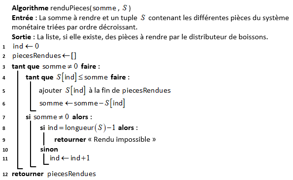

# <center><div class = "titre1">Présentation du code. Modularité. <br>Validation d'un programme</div> </center>

## <div class = "encadré2">__Présentation du code__</div>

### <div class = "encadré3"> __PEP ? Vous avez dit PEP ?__ </div>

 __PEP__ est un acronyme pour **P**ython **E**nhancement **P**roposals, Propositions d'Amélioration Python.

Les PEP sont des propositions d’amélioration du code python qui permettent une meilleure lecture, compréhension, fonctionnement etc…. Ce n’est pas obligatoire mais cela permet de rendre le code plus lisible et plus compréhensible.

__La PEP8__

La PEP8 définit un guide de style de codage. Elle consiste à rendre le texte plus lisible.

Voici les principales recommandations de ce guide :
<div class="couleur_puce17" markdown="1">

* Utiliser des indentations avec la touche ++tab++ et non la touche ++space++.
* Limiter les lignes à 79 caractères, cela évitera d’avoir à défiler la fenêtre.
* Ne pas casser une ligne avant une opération.
* Ne pas laisser de ligne vide avec une espace à l'intérieur.
* Ne pas finir une ligne par une espace.
* Finir votre code par un retour à la ligne vide.
* Faire un import par module et non un import puis tous les modules.
* Eviter de mettre trop d’espaces, une espace suffit après une virgule.
* Mettre une espace entre les caractères opérationnels (`#!python +`, `#!python -`, `#!python *`, `#!python /`, `#!python :`).
* Mettre une espace avant et après un `#!python =`.
* Ne pas séparer un caractère opérationnel et un `#!python =` (`#!python +=` et non `#!python + =`).
* Ne pas mettre une espace avant et après un `#!python =` si il sert à indiquer un argument ou paramètre.
* Mettre à jour les commentaires afin qu’ils ne soient pas en contradiction avec le code.
* Eviter les commentaires inutiles et évidents (ex : `#!python x += 1 # Incrémentation de x par 1`).

</div>
Il existe plusieurs moyens de vérifier si un code Python vérifie les recommandations de la PEP8. On peut citer :
<div class="couleur_puce17etoi" markdown="1">

* La bibliothèque <a href="https://pypi.org/project/pylint/" target="_blank">Pylint</a>
* Certains __IDE__ (**I**ntegrated **D**evelopment **E**nvironment) comme <a href="https://www.jetbrains.com/fr-fr/pycharm/" target="_blank">PyCharm</a> permettent de vérifier  directement la cohérence d'un <span style="display: inline-block; margin: 3px 0 0 0;">code Python avec la PEP8.</span>
* Le site en ligne : <a href="https://www.codewof.co.nz/style/python3/" target="_blank">{code:WOF}</a>

</div>

??? exercice "Exercice 1"
    On donne le code Python ci-dessous :
    
    ???+ plus-circle1 "Code"
        ```python
        from random import *

        def ma_fonction(n):
            if n < 2:
                return False
            fact = 2
            while fact * fact <= n:
                if n % fact == 0:
                    return False
                else:
                    fact += 1
            return True

        for loop in range(100):
            n = randint(1, 100000)
            print(n, ma_fonction(n))

        ```
    <div class = "list6_1">

    1. Etudier ce code source et décrire ce que renvoie la fonction `#!python ma_fonction(n)`.
    2. Tester si ce code vérifie les recommandations de la PEP8 à partir du site en ligne : <a href="https://www.codewof.co.nz/style/python3/" target="_blank">{code:WOF}</a>
    3. Donner le code modifié de telle sorte que les recommandations de la PEP8 soient respectées.

    </div>
    <center markdown="1">
    [Correction de l'exercice 1 :material-cursor-default-click:](Correction_des_exercices.md#correction-de-lexercice-1){:target="_blank" .md-button}
    </center>

### <div class = "encadré3"> __Nommer les arguments de la fonction lors de l'appel__ </div>

On peut préciser le nom des arguments dans l'appel de la fonction pour être plus explicite, on parle alors de `#!python keyword arguments` : "arguments nommés".

???+ plus-circle2 "Code"
    ```python
    # On définit la fonction
    def energie_cinetique(m, v):
        return 0.5 * m * v**2
    # On appelle la fonction pour un objet de 2 kg ayant une vitesse de 3 m/s
    print(energie_cinetique(m=2, v=3))
    ```

On obtient alors dans la console : `#!python 9.0`
<span style="display: block; margin: 8px 0 0 0;">L'avantage est qu'en plus d'être plus explicite, on peut alors appeler les arguments dans un ordre quelconque ce qui n'est pas le cas lorsque l'on ne nomme pas les arguments (ce type d'arguments est appelé `#!python positionnal argument` : "argument positionnel")</span>
<span style="display: block; margin: 8px 0 0 0;">Ainsi,</span>

```python
energie_cinetique(v=3, m=2)
```

donne le même résultat dans la console : `#!python 9.0`

### <div class = "encadré3"> __Créer des fonctions acceptant un nombre variable d’arguments__ </div>

Dans l'exemple précédent, que les arguments soient nommés ou pas, il est obligatoire de passer exactement 2 arguments à la fonction `#!python energie_cinetique()` pour qu'elle fonctionne.
<span style="display: block; margin: 8px 0 0 0;">Ainsi, s'il manque un argument, Python lèvera une erreur à l'appel de la fonction, que l'argument restant soit nommé ou non :

=== "L'argument n'est pas nommé"
    ```pycon
    >>> energie_cinetique(2)
    Traceback (most recent call last):
      File "<console>", line 1, in <module>
    TypeError: energie_cinetique() missing 1 required positional argument: 'v'
    ```

=== "L'argument est nommé"
    ```pycon
    >>> energie_cinetique(v=2)
    Traceback (most recent call last):
      File "<console>", line 1, in <module>
    TypeError: energie_cinetique() missing 1 required positional argument: 'm'
    ```

Dans certaines situations, nous voudrons créer des fonctions plus flexibles qui pourront accepter un nombre variable d’arguments. 
<span style="display: block; margin: 5px 0 0 0;">Cela peut être utile si on souhaite créer une fonction de calcul de somme par exemple qui devra additionner les différents arguments passés sans limite sur le nombre d’arguments et sans qu’on sache à priori combien de valeurs vont être additionnées.</span>
<span style="display: block; margin: 8px 0 0 0;">En Python, il existe deux façons différentes de créer des fonctions qui acceptent un nombre variable d’arguments. On peut :</span>
<div class="couleur_puce17" markdown="1">

* Définir des valeurs de paramètres par défaut lors de la définition d’une fonction ;
* Utiliser une syntaxe particulière permettant de passer un nombre arbitraire d’arguments.

</div>

#### <div class = "encadré4"> __Préciser des valeurs par défaut pour les paramètres d’une fonction__ </div>

On va déjà pouvoir préciser des valeurs par défaut pour nos paramètres. Comme leur nom l’indique, ces valeurs seront utilisées par défaut lors d’un appel à la fonction si aucun argument n’est passé à la place.
<span style="display: block; margin: 8px 0 0 0;">Utiliser des valeurs par défaut pour les paramètres de fonctions permet donc aux utilisateurs d’appeler cette fonction en omettant de passer les arguments relatifs aux paramètres possédant des valeurs par défaut.</span>
<span style="display: block; margin: 8px 0 0 0;">On va pouvoir définir des fonctions avec des paramètres sans valeur et des paramètres avec des valeurs par défaut. Attention cependant : vous devez bien comprendre qu’ici, si on omet de passer des valeurs lors de l’appel à la fonction, Python n’a aucun moyen de savoir quel argument est manquant. Si 1, 2, etc. arguments sont passés, ils correspondront de facto au premier, aux premier et deuxième, etc. paramètres de la définition de fonction.</span>
<span style="display: block; margin: 8px 0 0 0;">Pour cette raison, on placera toujours les paramètres sans valeur par défaut au début et ceux avec valeurs par défaut à la fin afin que le ou les arguments passés remplacent en priorité les paramètres sans valeur.</span>

```pycon
>>> def presentation(prenom, age=18, nat="Français"):
...     print("Je m'appelle", prenom, ", j'ai au moins", age, "ans et je suis probablement", nat)
...     
... 

>>> presentation("Pierre")
Je m'appelle Pierre , j'ai au moins 18 ans et je suis probablement Français

>>> presentation("Pierre", 29)
Je m'appelle Pierre , j'ai au moins 29 ans et je suis probablement Français

>>> presentation("Pierre", 29, "Belge")
Je m'appelle Pierre , j'ai au moins 29 ans et je suis probablement Belge
```

Si on souhaite s’assurer que les valeurs passées à une fonction vont bien correspondre à tel ou tel paramètre, on peut passer à nos fonctions des arguments nommés.

#### <div class = "encadré4"> __Passer un nombre arbitraire d’arguments avec <span style="font-family: 'Trebuchet MS';">\*args</span> et <span style="font-family: 'Trebuchet MS';">**kwargs</span>__ </div>

La syntaxe `#!python *args` (remplacez `#!python args` par ce que vous voulez) permet d’indiquer lors de la définition d’une fonction que notre fonction peut accepter un nombre variable d’arguments. Ces arguments sont intégrés dans un tuple. On va pouvoir préciser 0, 1 ou plusieurs paramètres classiques dans la définition de la fonction avant la partie variable.

```pycon
>>> def somme(*args):
...     s = 0
...     for n in args:
...         s += n
...     print("Somme :", s)
...     return None
...     
... 

>>> somme(1, 2)
Somme : 3

>>> somme(1, 2, 3, 4)
Somme : 10

>>> somme(30, 100, 2)
Somme : 132
```

Ici, on utilise une boucle `#!python for` pour itérer parmi les arguments : tant que des valeurs sont trouvées, elles sont ajoutées à la valeur de s. Dès qu’on arrive à court d’arguments, on print() le résultat.
<span style="display: block; margin: 8px 0 0 0;">De façon alternative, la syntaxe `#!python **kwargs` (remplacez `#!python kwargs` par ce que vous voulez) permet également d’indiquer que notre fonction peut recevoir un nombre variable d’arguments mais cette fois-ci les arguments devront être passés sous la forme d’un dictionnaire Python.</span>

```pycon
>>> def presentation(**kwargs):
...     for i, j in kwargs.items():
...         print(i, j)
...     return None
...     
... 

>>> presentation(prenom="Pierre", age=29, sport="trail")
prenom Pierre
age 29
sport trail
```

### <div class = "encadré3"> __Prototyper une fonction__ </div>

Pour expliquer le fonctionnement d'une fonction, on lui ajoute un __prototype__ juste sous la ligne de définition. En Python, les prototypes sont appelés __docstrings__. On peut y accéder dans le code source ou simplement en utilisant la fonction `#!python help()`.
<span style="display: block; margin: 8px 0 0 0;">Le prototype doit décrire __le rôle de la fonction__, __le type des paramètres__ et __le type de la valeur de retour__.</span>

???+ plus-circle2 "Code"
    ```python
    def ajout(a, b):
        """La somme de deux nombres.

        Renvoie la somme des deux nombres donnés en argument

        Parameters
        ----------
        a : int ou float
            première valeur à ajouter
        b : int ou float
            deuxième valeur à ajouter

        Returns
        -------
        int or float
            La somme des deux arguments de la fonction
        """
        return a + b
    ```

??? exercice "Exercice 2"
    Vérifier, qu'en tapant `#!python help(ajout)`, on obtient bien toutes les informations utiles pour manipuler la fonction.
    <center markdown="1">
    [Correction de l'exercice 2 :material-cursor-default-click:](Correction_des_exercices.md#correction-de-lexercice-2){:target="_blank" .md-button}
    </center>
    

??? exercice "Exercice 3"
    Ecrire le code d'une fonction Python nommée `#!python liste_diviseurs_entier(n)` qui :
    <div class = "couleur_puce25">

    * Détermine et renvoie la liste des diviseurs de l'entier `#!python n` passé en argument.
    * Respecte les recommandations de la PEP8.
    * Est documentée en utilisant les docstrings.
    
    </div>
    <center markdown="1">
    [Correction de l'exercice 3 :material-cursor-default-click:](Correction_des_exercices.md#correction-de-lexercice-3){:target="_blank" .md-button}
    </center>

### <div class = "encadré3"> __Annotations et signature__ </div>
Le type des éventuels paramètres d'une fonction et celui de son retour peut être décrit dès le début de la fonction et non dans la docstring.

#### <div class = "encadré4"> __Annotations__ </div>

Commençons par les annotations. Il se peut que vous ne les ayez jamais rencontrées, il s’agit d’une fonctionnalité relativement nouvelle du langage.
<span style="display: block; margin: 8px 0 0 0;">Les annotations sont donc des informations de types que l’on peut ajouter sur les paramètres et le retour d’une fonction.</span>

Nous avons destiné la fonction précédente à des calculs numériques, mais nous pourrions aussi pu l’appeler avec des chaînes de caractères. Les annotations vont nous permettre de préciser le type des paramètres attendus, et le type de la valeur de retour.

```python
def addition(a:int, b:int) -> int:
    return a + b

```

Leur définition est assez simple : pour annoter un paramètre, on le fait suivre d’un `#!python :` et on ajoute le type attendu. Pour annoter le retour de la fonction, on ajoute `#!python ->` puis le type derrière la liste des paramètres.
<span style="display: block; margin: 8px 0 0 0;">Attention cependant, les annotations ne sont là qu’à titre indicatif. Rien n’empêche de continuer à appeler notre fonction avec des chaînes de caractères.</span>
<span style="display: block; margin: 8px 0 0 0;">À ce titre, on notera aussi que donner des types comme annotations n’est qu’une convention. Annoter des paramètres avec des chaînes de caractères ne provoquera pas d’erreur par exemple.</span>

Nous avons défini une fonction addition opérant sur deux nombres, mais l’avons annotée comme ne pouvant recevoir que des nombres entiers (`#!python int`).
<span style="display: block; margin: 8px 0 0 0;">En effet, les annotations utilisées jusqu’ici étaient plutôt simples. Mais elles peuvent accueillir des expressions plus complexes.</span>
<span style="display: block; margin: 8px 0 0 0;">
Le module <a href="https://docs.python.org/3/library/typing.html" target="_blank">typing</a> nous présente une collection de classes pour composer des types. Ce module a été introduit dans Python 3.5, et n’est donc pas disponible dans les versions précédentes du langage.</span>
<span style="display: block; margin: 8px 0 0 0;">Dans notre fonction addition, nous voudrions en fait que les `#!python int`, `#!python float` et `#!python complex` soient admis. Nous pouvons pour cela utiliser le type `#!python Union` du module `#!python typing`. Il nous permet de définir un ensemble de types valides pour nos paramètres, et s’utilise comme suit.</span>

```python
from typing import Union

Number = Union[int, float, complex]

def addition(a:Number, b:Number) -> Number:
    return a + b
```

Nous définissons premièrement un type `#!python Number` comme l’ensemble des types `#!python int`, `#!python float` et `#!python complex` via la syntaxe `#!python Union[...]`. Puis nous utilisons notre nouveau type `#!python Number` au sein de nos annotations.

#### <div class = "encadré4"> __Signatures__ </div>

La signature est l’ensemble des paramètres (avec leurs noms, positions, valeurs par défaut et annotations), ainsi que l’annotation de retour d’une fonction. C’est-à-dire toutes les informations décrites à droite du nom de fonction lors d’une définition.

Par exemple :
```python
def function(a:int, b:int, c=None, d:int=0, g:float, h:int, i:str='foo', j:float=5.0) -> bool:
	pass
```

## <div class = "encadré2">__Modularité__</div>

Jusqu'à maintenant, nous avons toujours programmé au sein d'un seul fichier (ou script). Cependant, lorsqu'on souhaite rédiger des programmes plus longs, il est souhaitable de séparer le code dans plusieurs fichiers. Chaque fichier est appelé un __module__ et les définitions d'un module peuvent être importées dans un autre module grâce au mot-clé `#!python import`.

### <div class = "encadré3"> __Utilisation des modules__ </div>

Nous avons déjà utilisé des modules, car ceux-ci font partie intégrante de Python : c'est la cas par exemple des modules `#!python math` ou `#!python random`.
Dans cet exemple, nous allons utiliser le module `#!python statistics` qui est moins connu et qui a été ajouté à Python à partir de la version 3.4.

???+ plus-circle "Code"
    ```python
    # import du module
    import statistics
    # affiche l'aide
    help(statistics)
    ```

Supposons que l'on souhaite utiliser les fonctions `#!python mean()` : moyenne et `#!python stdev()` : écart-type. Plusieurs solutions s'offrent à nous:
<div class="list15_1" markdown="1">

1. Import du module et utilisation de son espace de noms avec une notation pointée (avec un point entre le nom du module et le <span style="display: inline-block; margin: 3px 0 0 0;">nom de la fonction).</span>

</div>
<div class="decal1" markdown="1">

!!! exemple "Exemple"

    === "Dans l'éditeur"
        ```python
        import statistics
        notes = [11, 14, 18, 5, 12, 13, 15]
        print(f"Moyenne : {statistics.mean(notes)}")
        print(f"ÉcartType : {statistics.stdev(notes)}")
        ```

    === "Affichage dans la console"
        ```pycon
        >>> (executing file "test.py")
        Moyenne : 12.571428571428571  
        ÉcartType : 4.035556254807296
        ```

On peut aussi renommer l'import avec le mot-clé `#!python as` pour rendre le code plus lisible.

!!! exemple "Exemple"

    === "Dans l'éditeur"
        ```python
        import statistics as stat
        notes = [11, 14, 18, 5, 12, 13, 15]
        print(f"Moyenne : {stat.mean(notes)}")
        print(f"ÉcartType : {stat.stdev(notes)}")
        ```
    === "Affichage dans la console"
        ```pycon
        >>> (executing file "test.py")
        Moyenne : 12.571428571428571  
        ÉcartType : 4.035556254807296
        ```

</div>
<div class = "list15_2" markdown="1">

2. On peut également n'importer que les fonctions dont on a besoin.

</div>
<div class="decal1" markdown="1">

!!! exemple "Exemple"

    === "Dans l'éditeur"
        ```python
        from statistics import mean, stdev
        notes = [11, 14, 18, 5, 12, 13, 15]
        print("Moyenne :", mean(notes))
        print("ÉcartType :", stdev(notes))
        ```
    === "Affichage dans la console"
        ```pycon
        >>> (executing file "test.py")
        Moyenne : 12.571428571428571  
        ÉcartType : 4.035556254807296
        ```

</div>
<div class = "list15_3" markdown="1">

3. Une autre méthode cependant __déconseillée__ en raison de la pollution de l'espace des noms (de variables) est l'utilisation du `#!python *` <span style="display: inline-block; margin: 3px 0 0 0;">(wildcard, *joker* en anglais).</span>

</div>
<div class="decal1" markdown="1">

!!! exemple "Exemple"

    === "Dans l'éditeur"
        ```python
        from statistics import *
        # Toutes les objets du module sont disponibles sans notation pointée
        notes = [11, 14, 18, 5, 12, 13, 15]
        print("Moyenne :", mean(notes))
        print("ÉcartType :", stdev(notes))
        ```
    === "Affichage dans la console"
        ```pycon
        >>> (executing file "test.py")
        Moyenne : 12.571428571428571  
        ÉcartType : 4.035556254807296
        ```

</div>

### <div class = "encadré3"> __Notre premier module__ </div>

Nous allons créer un premier module dans un fichier `#!python fibo.py`.

???+ plus-circle2 "Code"
    ```python
    # Module sur les nombres de Fibonacci

    def fib(n):    # affiche les nombres de Fibonacci jusqu'à n
        a, b = 0, 1
        while a < n:
            print(a, end=' ')
            a, b = b, a + b
        print()
        return None

    def fib2(n):   # renvoie la liste des nombres de Fibonacci jusqu'à n
        result = []
        a, b = 0, 1
        while a < n:
            result.append(a)
            a, b = b, a + b
        return result
    ```

Ensuite, dans un second fichier nommé `#!python test_import_module.py`, nous allons importer le module `#!python fibo`. 

!!! tip "__Remarque__"
    Les deux fichiers doivent être situés dans le même environnement de travail (autrement dit le même dossier). Il faut aussi le spécifier dans Pyzo (menu `#!python Exécuter` puis `#!python Démarrer le script` dans le fichier `#!python test_import_module.py`)  

On peut alors importer le module et utiliser les fonctions qui y sont définies :
<div class="couleur_puce17" markdown="1">

* Soit en important le module directement et en utilisant des notations pointées :

</div>
<div class="decal1" markdown="1">

???+ plus-circle "Code"
    ```python
    import fibo
    fibo.fib(1000)
    # affiche 0 1 1 2 3 5 8 13 21 34 55 89 144 233 377 610 987
    fibo.fib2(100)
    # renvoie [0, 1, 1, 2, 3, 5, 8, 13, 21, 34, 55, 89]
    ```

</div>
<div class="couleur_puce17" markdown="1">

* Soit en important spécifiquement des fonctions pour pouvoir les utiliser sans rappeler le module d'origine.

</div>
<div class="decal1" markdown="1">

???+ plus-circle "Code"
    ```python
    from fibo import fib, fib2
    fib(1000)
    # affiche 0 1 1 2 3 5 8 13 21 34 55 89 144 233 377 610 987
    fib2(100)
    # renvoie [0, 1, 1, 2, 3, 5, 8, 13, 21, 34, 55, 89]
    ```

</div>

### <div class = "encadré3"> __Documenter un module__ </div>

Pour documenter un module il suffit encore une fois de créer la `#!python docstring` au début du fichier en utilisant les chaines de caractères multi-lignes délimitées par `#!python """`. Et pour une lecture aisée on limite souvent le nombre de caractères par ligne à 80 (ou 100 suivant les projets).
<span style="display: block; margin: 8px 0 0 0;">Si on reprend l'exemple précédent, on pourrait le documenter avec une description générale au début du module ainsi qu'une liste des fonctions, et en pensant à documenter également les fonctions bien sûr.</span>
<span style="display: block; margin: 8px 0 0 0;">Les fonctions ont également été renommées pour être plus explicites:</span>
<div class="couleur_puce17" markdown="1">

* `#!python fib` : `#!python fib_print`
* `#!python fib2` : `#!python fib_to_array`

</div>

???+ plus-circle2 "Code"
    ```python
    """ Module fibo relatif à la création de nombres de Fibonacci

    Pour rappel, la suite de Fibonacci est une suite d'entiers dans laquelle chaque terme est la somme 
    des deux termes qui le précèdent.(voir: https://fr.wikipedia.org/wiki/Suite_de_Fibonacci)

    Ce module présente deux fonctions:

    - fib_print: affiche les nombres de Fibonacci
    - fib_to_array: renvoie la liste des nombres de Fibonacci

    """

    def fib_print(n):
        """Affiche les nombres de Fibonacci

        paramètres
        ---------
        n: int
            dernier rang de la suite de Fibonacci affichée
        """
        a, b = 0, 1
        while a < n:
            print(a, end=' ')
            a, b = b, a + b
        print()
        return None

    def fib_to_array(n):
        """Renvoie la liste des nombres de Fibonacci

        paramètres
        ---------
        n: int
            dernier rang de la suite de Fibonacci renvoyée dans la liste
        
        Returns
        -------
        list
            La liste des nombres de Fibonacci jusqu'au rang n
        """
        result = []
        a, b = 0, 1
        while a < n:
            result.append(a)
            a, b = b, a + b
        return result
    ```

??? exercice "Exercice 4"
    Vérifier que dans le fichier `#!python test_import_module.py`, après avoir importé le module `#!python fibo`, en tapant `#!python help(fibo)` dans la console,  on obtient bien toutes les informations utiles pour manipuler ce module.
    <center markdown="1">
    [Correction de l'exercice 4 :material-cursor-default-click:](Correction_des_exercices.md#correction-de-lexercice-4){:target="_blank" .md-button}
    </center>

### <div class = "encadré3"> __API (Application Programming Interface)__ </div>

Lorsqu'un projet grandit, il y a de plus en plus de personnes qui doivent travailler dessus et l'utiliser et il devient de plus en plus complexe à comprendre. C'est pour cela qu'une bonne documentation est indispensable, mais aussi une bonne organisation du code afin de le rendre plus facile à utiliser.
<span style="display: block; margin: 8px 0 0 0;">Il conviendra de bien organiser les divers modules et fonctions accessibles, ce qu'on appelle l'API.</span>
<span style="display: block; margin: 8px 0 0 0;">On peut prendre l'exemple de la bibliothèque open-source <a href="https://scikit-learn.org/stable/modules/classes.html" target="_blank">`#!python sklearn`</a> connue pour la qualité de son code, de son API et de sa documentation.</span>
<span style="display: block; margin: 8px 0 0 0;">Voir <a href="https://github.com/scikit-learn/scikit-learn/blob/0fb307bf3/sklearn/base.py#L152" target="_blank">ici</a> l'implémentation et la documentation d'une classe de ce module.</span>

## <div class = "encadré2">__La validation d'un programme__</div>

### <div class = "encadré3"> __Pourquoi faire des tests de validation ?__ </div>

Comme le dit le célèbre proverbe latin : "*Errare humanum est*" (l'erreur est humaine). 
<span style="display: inline-block; margin: 8px 0 0 0;">Même après de nombreuses années d'expérience en programmation, on continue de faire des erreurs. Il faut savoir que chaque bug a un coût qui peut être à minima la somme des coûts suivants :</span>
<div class="couleur_puce17" markdown="1">

* Un coût de désagrément : causé à l'utilisateur du programme (perte de temps, perte de données).
* Un coût de développement : reprise du code, compréhension du bug, correction.
* Un coût "d'image de marque" : perte de crédibilité vis-à-vis de l'utilisateur final.

</div>

Alors, on comprendra aisément qu'en détectant une erreur de programmation au stade du développement, on réalise de nombreuses économies et on préserve son image.
<span style="display: inline-block; margin: 8px 0 0 0;">Afin de vérifier la validité du code d'un programme, il existe principalement deux moments particuliers :</span>
<div class="couleur_puce17etoi" markdown="1">

* A l'écriture : en commentant proprement son code (et en réalisant une documentation digne de ce nom sur des projets de <span style="display: inline-block; margin: 3px 0 0 0;">grande envergure).</span>
* A l'exécution du code : ce moment est malheureusement trop souvent ignoré !

</div>

C'est ce deuxième point que nous allons essayer de développer. 
<span style="display: inline-block; margin: 3px 0 0 0;">L'idée est de placer dans le code des points de contrôle à tous les endroits critiques au moment où on tape le code.</span>
<span style="display: inline-block; margin: 8px 0 0 0;">Par endroits critiques, on entend par exemple :</span>
<div class="couleur_puce17tri" markdown="1">

* La gestion des listes ou des tableaux (débordement).
* Les instructions conditionnelles non exhaustives.
* Les paramètres d'entrée des fonctions.
* Les codes d'erreur retournés par d'autres fonctions issues d'autres modules ou librairies.

</div>

Si on pense à bien poser ces points de contrôle au moment où on implémente le code, on construit une sorte de test permanent. 
<span style="display: inline-block; margin: 5px 0 0 0;">Ces points de contrôle sont de deux sortes : __les assertions__ et __la gestion des erreurs__.</span>

### <div class = "encadré3"> __Les assertions__ </div>

!!! book "__Définition__"
    Une __assertion__ permet de vérifier une condition considérée comme vraie. Si cette condition est vraie, alors l'assertion sera muette. Si elle est fausse, alors une erreur sera produite. Une assertion s'introduit via le mot-clé `#!python assert` et elle est suivie de la condition à vérifier et éventuellement d'un message d'erreur.

Voici un exemple d'utilisation d'assertion en Python :

!!! exemple "Exemple"

    === "Dans l'éditeur"
        ```python
        def racine_carree_dans_R(nb):
            assert nb >= 0, "La racine carrée d'un nombre négatif n'existe pas dans R !"
            return nb ** 0.5

        print(racine_carree_dans_R(-4))
        ```
    === "Affichage dans la console"
        ```pycon
        >>> (executing file "test.py")
        AssertionError : "La racine carrée d'un nombre négatif n'existe pas dans R !"
        ```

Le mécanisme d'assertion est là pour empêcher des erreurs qui ne devraient pas se produire, en arrêtant le programme de manière prématurée. Si une telle erreur survient, c'est que le programme doit être modifié pour qu'elle n'arrive plus.  
<span style="display: block; margin: 8px 0 0 0;">Dans cet exemple, on se rend immédiatement compte qu'un appel ne respectant pas les préconditions a été fait, et qu'il faut donc le changer.</span>
<span style="display: block; margin: 8px 0 0 0;">Notre première réaction face aux assertions est de se dire : "ça ne sert à rien de tester cette condition, c'est évident qu'elle est satisfaite". Mais justement, c'est parce qu'elle est fondamentalement évidente qu'elle est une parfaite candidate à une assertion.</span>
<span style="display: block; margin: 8px 0 0 0;">Si un jour, l'assertion signale le non-respect de la condition (évidente), vous le saurez tout de suite. En revanche, si vous n'avez pas placé d'assertion, vous n'imaginerez pas une seconde que votre condition puisse ne pas être satisfaite et vous irez donc chercher l'erreur ailleurs pendant un certain temps !</span>
<span style="display: block; margin: 8px 0 0 0;">Si vous utilisez les assertions mais ne gérez pas complétement le cas d'erreur, vous n'aurez fait que la moitié du travail.</span>

!!! tip "__Remarque__"
    Ce mode de programmation qui utilise les assertions est souvent appelé **programmation défensive**. 
    <span style="display: block; margin: 5px 0 0 0;">En pratique, on va utiliser ce type de programmation pour du code sur lequel on a le contrôle total.</span>
    <span style="display: block; margin: 5px 0 0 0;"> Par exemple, lorsqu'on écrit un module, on peut programmer défensivement pour les fonctions qui ne sont destinées qu'à être appelées au sein de ce dernier.</span>

??? exercice "Exercice 5"
    Prenons le cas de la recherche du minimum d'une liste avec la fonction Python suivante :
    ```python
    def minimum_liste(lst):
        longueur = len(lst)
        mini = lst[0]
        i = 1
        while i < longueur:
            if lst[i] < mini:
                mini = lst[i]
            i += 1
        return mini
    ```
    <div class = "list6_1">

    1. Quelles sont les 2 conditions implicites au bon fonctionnement de cette fonction ?
    2. A l'aide d'une docstring et d'assertions, proposer un code plus explicite.

    </div>
    <center markdown="1">
    [Correction de l'exercice 5 :material-cursor-default-click:](Correction_des_exercices.md#correction-de-lexercice-5){:target="_blank" .md-button}
    </center>

### <div class = "encadré3"> __La gestion active des erreurs__ </div>

Une assertion "met le doigt" sur quelque chose qui ne devrait pas arriver : un problème de logique, une incohérence de structure ou de programmation. 
<span style="display: block; margin: 5px 0 0 0;">A contrario, une erreur provient d'un problème dont l'issue était prévisible, généralement dans les données.</span>
<span style="display: block; margin: 5px 0 0 0;">Lorsqu'on écrit des fonctions destinées à être utilisées par d'autres personnes, on va plutôt faire une gestion active des erreurs, notamment avec l'instruction `#!python if - else` et en prévoyant des valeurs de retour spéciales.</span>
<span style="display: block; margin: 8px 0 0 0;">Reprenons l'exemple du calcul de la racine carrée dans l'ensemble des réels vu plus haut et qui ne gère pas les erreurs de type.</span>
<span style="display: block; margin: 3px 0 0 0;">A l'aide d'une gestion active des erreurs, on peut proposer le code suivant :</span>

!!! exemple "Exemple"

    === "Dans l'éditeur"
        ```python linenums="1"
        def racine_carree_dans_R(nb):
            assert nb >= 0, "La racine carrée d'un nombre négatif n'existe pas dans R !"
            return nb ** 0.5

        def calcul_racine_est_possible(nb):
            msg_erreur = ""
            # Vérification du type de paramètre
            if isinstance(nb, int) or isinstance(nb, float):
                return True, msg_erreur
            else :
                msg_erreur = "Le paramètre doit être de type entier ou réel !"
                return False, msg_erreur

        mon_nombre = "4"
        reponse, erreur = calcul_racine_est_possible(mon_nombre)
        if reponse:
            print(racine_carree_dans_R(mon_nombre))
        else :
            print("Calcul impossible :", erreur)
        ```
    === "Affichage dans la console"
        ```pycon
        >>> (executing file "test.py")
        "Calcul impossible : le paramètre doit être de type entier ou réel !"
        ```

!!! a-retenir "__Précision__"
    Tout ce qui provient de l'intérieur du code peut être vérifié par des assertions (dans notre code, ligne 2).  
    <span style="display: inline-block; margin: 8px 0 0 0;">Tout ce qui provient de l'extérieur peut être vérifié par une gestion active des erreurs (dans notre code, ligne 8). En effet, on utilise la fonction `#!python isinstance()` externe à notre code.</span>

### <div class = "encadré3"> __Les exceptions__ </div>

Lorsqu'une instruction ou une expression est syntaxiquement correcte, elle peut provoquer une erreur lorsqu'on essaie de l'exécuter. 
<span style="display: block; margin: 3px 0 0 0;">Les erreurs détectées à l'exécution sont appelées *exceptions* et ne sont pas toujours fatales. Néanmoins, la plupart des exceptions ne sont pas gérées par un programme et entraînent des messages d'erreur comme le montre l'exemple ci-dessous :</span>

!!! exemple "Exemple"

    === "Dans l'éditeur"
        ```python
        def affichage_inverse(L):
            for x in L:
                print(x, end=" , ")
                print(1.0/x)
            return None

        lst_nombres = [0.3333, 2.5, 0, 10]
        affichage_inverse(lst_nombres)
        ```
    === "Affichage dans la console"
        ```pycon
        >>> (executing file "test.py")
        ZeroDivisionError: float division by zero
        ```

La dernière ligne du message d'erreur indique ce qui s'est passé. 
<span style="display: inline-block; margin: 3px 0 0 0;">Les exceptions peuvent être de plusieurs types, le type étant écrit dans le message.</span>
<span style="display: inline-block; margin: 8px 0 0 0;"> Dans notre exemple, le type est `#!python ZeroDivisionError` (erreur de division par zéro). Le type est suivi d'un petit message descriptif sur la cause de l'erreur. Les exceptions ne sont pas un simple mécanisme de débogage. Elles servent d'abord et avant tout à gérer les cas exceptionnels, à l'aide de l'instruction `#!python try/except` en Python.</span>

!!! exemple "Exemple"

    === "Dans l'éditeur"
        ```python
        def affichage_inverse(L):
            for x in L:
                print(x, end=" , ")
                try:
                    print(1.0/x)
                except ZeroDivisionError :
                    print("n'admet pas d'inverse")
            return None
                
        lst_nombres = [0.3333, 2.5, 0, 10]
        affichage_inverse(lst_nombres)
        ```
    === "Affichage dans la console"
        ```pycon
        >>> (executing file "test.py")
        0.3333 , 3.0003000300030003  
        2.5 , 0.4  
        0 , "n'admet pas d'inverse"  
        10 , 0.1  
        ```

!!! a-retenir "__Précision__"
    <div class="couleur_puce20">

    * Quand on "attrape" une exception, le programme ne "plante" pas. A la place de l'exception, c'est le bloc `#!python except` (au nom de l'exception) qui est appelé.
    * Bien entendu, si une exception qui ne porte pas ce nom est levée, le programme plantera.

    </div>

Une instruction `#!python try` peut avoir plusieurs clauses d'exception, de façon à définir des gestionnaires d'exception différents pour des exceptions différentes.

!!! exemple "Exemple"

    === "Dans l'éditeur"
        ```python
        def affichage_inverse(L):
            for x in L:
                print(x, end=" , ")
                try :
                    print(1.0/x)
                except ZeroDivisionError :
                    print("n'admet pas d'inverse")
                except TypeError:
                    print("calcul d'inverse impossible pour des types autres que int et float !")
            return None
                
        lst_nombres = [0.3333, 2.5, 0, 10, '6']
        affichage_inverse(lst_nombres)
        ```
    === "Affichage dans la console"
        La console affiche les résultats sans plantage :
        ```pycon
        >>> (executing file "test.py")
        0.3333 , 3.0003000300030003  
        2.5 , 0.4  
        0 , "n'admet pas d'inverse"  
        10 , 0.1  
        6 , "calcul d'inverse impossible pour des types autres que int et float !"  
        ```

On peut également provoquer soi-même des exceptions avec l'instruction `#!python raise`.  
<span style="display: inline-block; margin: 5px 0 0 0;">Prenons par exemple le cas où l'on souhaite traiter que des nombres positifs.</span>

???+ plus-circle2 "Code"
    ```python
    x = -1

    if x < 0:
        raise Exception("Désolé, pas de nombre négatif !")
    ```

!!! tip "__Remarque__"
    Dans ce cas-ci, lever une exception n'est pas forcément la meilleure solution, on aurait pu utiliser un `#!python assert`. 
    <span style="display: inline-block; margin: 3px 0 0 0;">L'important est d'être capable de savoir, grâce à l'interpréteur de commandes, quelles exceptions peuvent être levées par Python dans une situation donnée.</span>

??? exercice "Exercice 6"
    <div class = "list6_1">
        
    1. Que se passe-t-il après l'exécution suivante si le fichier `#!python "test.txt"` n'existe pas ?  
    `#!python f = open("test.txt","r")`
    2. En utilisant les exceptions, proposer une fonction "propre" en Python permettant l'ouverture en lecture d'un fichier texte donné en paramètre ne plantant pas sauvagement lorsque le fichier est introuvable.
    <span style="display: block; margin: 8px 0 0 0;">Cette fonction que l'on appelera `#!python ouverture_fichier_lecture(nom_fich)` renverra un tuple de 2 éléments :</span>
    
    </div>
    <div class = "couleur_puce25_decal">

    * `#!python f` : l'objet en mémoire désignant ledit fichier si l'ouverture a réussi et `#!python None` sinon.
    * `#!python erreur` : une chaîne indiquant la description de l'erreur si erreur il y a et une chaîne vide s'il n'y a pas d'erreur.
    
    </div>
    <center markdown="1">
    [Correction de l'exercice 6 :material-cursor-default-click:](Correction_des_exercices.md#correction-de-lexercice-6){:target="_blank" .md-button}
    </center>

## <div class = "encadré2">__Les tests__</div>

Le programme ou le logiciel "zéro défaut" n'existe pas. La présence de fautes logicielles systématiques introduites à la conception d'un dispositif programmé doit donc être considérée avec beaucoup d'attention, en particulier lorsque les conséquences de ces fautes peuvent influer sur la sécurité d'un dispositif.

### <div class = "encadré3"> __Construction des jeux de test__ </div>

On peut considérer 3 niveaux de tests :
<div class="couleur_puce17" markdown="1">

* __*Les tests unitaires*__ : le but est de tester chaque "morceau" de code : les fonctions, les méthodes... Ils permettent de s'assurer que chaque brique du programme fonctionne correctement et indépendamment des autres briques. On s'attardera principalement sur ce niveau dans cette partie.
* __*Les tests d'intégration*__ : le but est de commencer à tester de petites intéractions entre les différentes parties du programme. On peut réaliser ces tests avec les mêmes outils utilisés pour les tests unitaires. Cependant, on supposera que toutes les briques prises individuellement sont valides.
* __*Les tests complets*__ : le but est de tester le programme dans son ensemble. Si les 2 premiers niveaux sont négligés, les tests complets ne servent à rien !

</div>

### <div class = "encadré3"> __Doctest : quand la doc devient test !__ </div>

il existe des bibliothèques de tests unitaires performants en Python (et dans de nombreux autres langages d'ailleurs). Les bibliothèques Python les plus connues sont <a style="font:red;" href="https://docs.python.org/3/library/doctest.html" target="_blank">`#!python doctest`</a>, <a href="https://docs.pytest.org/en/stable/" target="_blank">`#!python pytest`</a> ou encore <a href="https://docs.python.org/fr/3/library/unittest.html" target="_blank">`#!python unittest`</a>. Nous allons étudier `#!python doctest` dans ce paragraphe.  
<span style="display: inline-block; margin: 8px 0 0 0;">Un exemple d'utilisation de `#!python doctest` :</span>

!!! exemple "Exemple"

    === "Dans l'éditeur"
        ```python
        import doctest

        def ma_fonction(a, b):
            """
            Cette fonction est une fonction de test
            Elle sert a calculer a + b
            param a : Valeur 1
            param b : Valeur 2
            return : Somme des Valeur 1 et Valeur 2
            >>> ma_fonction(1, 2)
            3
            """
            return a + b

        doctest.testmod()
        ```
    === "Affichage dans la console"
        La console n'affiche rien, signe que le test a été réussi :
        ```pycon
        >>> (executing file "test.py")

        ```

Explications :
<div class="couleur_puce17" markdown="1">

* On importe le module  `#!python doctest` au début.
* A l'intérieur de la __docstring__ on écrit les deux lignes suivantes : 

</div>
<div class = "decal1" markdown="1">

```python
>>> ma_fonction(1, 2)
3
```

La première ligne commence par les 3 chevrons `#!python >>>` de la console Python et on appelle la fonction testée avec un jeu de test : ici les valeurs `#!python 1` et `#!python 2` pour `#!python a` et `#!python b`.
<span style="display: inline-block; margin: 8px 0 0 0;">La deuxième ligne donne le résultat attendu tel qu'il serait affiché après l'éxécution de la ligne de code `#!python ma_fonction(1, 2)` dans la console Python.</span>

</div>
<div class="couleur_puce17" markdown="1">

* L'appel aux tests se fait par l'appel de la méthode `#!python testmod()` avec la ligne de code `#!python doctest.testmod()`.

</div>

!!! exemple "Exemple où le test échoue"

    === "Dans l'éditeur"
        ```python
        import doctest

        def ma_fonction(a, b):
            """
            Cette fonction est une fonction de test
            Elle sert a calculer a + b
            param a : Valeur 1
            param b : Valeur 2
            return : Somme des Valeur 1 et Valeur 2
            >>> ma_fonction(1, 2)
            3
            """
            return a - b # évidemment ici, la fonction ne renvoie plus une somme...

        doctest.testmod()
        ```
    === "Affichage dans la console"
        ```pycon
        >>> (executing file "test.py")
        **********************************************************************
        File "__main__", line 10, in __main__.ma_fonction
        Failed example:
            ma_fonction(1, 2)
        Expected:
            3
        Got:
            -1
        **********************************************************************
        1 items had failures:
           1 of   1 in __main__.ma_fonction
        ***Test Failed*** 1 failures.
        ```

Il est bien sûr recommandé de prévoir plusieurs jeux de tests pour chaque fonction de vos programmes Python.
<span style="display: inline-block; margin: 8px 0 0 0;">Il n'est plus nécessaire si on utilise cette bibliothèque de tests unitaires de "truffer" son programme d'instructions `#!python print()` pour tester les fonctions développées.</span>
<span style="display: inline-block; margin: 8px 0 0 0;">Il est même recommandé de prévoir les jeux de tests de chaque fonction d'un programme avant d'avoir écrit le corps de ces fonctions.</span>

??? exercice "Exercice 7"
    Voici écrit en pseudo-code la fonction qui permet de rendre la monnaie pour un distributeur de boissons :

    ???+ stylo "Pseudo-code"
        

        Par exemple, `#!python renduPieces(19, (500, 200, 100, 50, 20, 10, 5, 2, 1))` renvoie `#!python [10, 5, 2, 2]`.
    
    Programmer cet algorithme en Python en prenant soin de :
    <div class = "couleur_puce25">

    * Respecter les recommandations de la PEP8.
    * Documenter en utilisant les __docstrings__.
    * Proposer plusieurs tests unitaires pertinents utilisant la bibliothèque `#!python doctest`.
    </div>
    <center markdown="1">
    [Correction de l'exercice 7 :material-cursor-default-click:](Correction_des_exercices.md#correction-de-lexercice-7){:target="_blank" .md-button}
    </center>

### <div class = "encadré3"> __Le module unittest de Python__ </div>

Le module __unittest__ de la bibliothèque standard de Python inclut le mécanisme des tests unitaires. Pour chaque fonctionnalité de notre code, on réalise un test qui vérifie que la fonctionnalité fait bien ce qu'on lui demande. 
<span style="display: inline-block; margin: 8px 0 0 0;">Par exemple, on vérifie que si une certaine fonction est appelée avec certains paramètres, elle retourne telle ou telle valeur.</span>
<span style="display: inline-block; margin: 8px 0 0 0;">Pour l'instant, nous allons nous intéresser à la forme la plus simple du test unitaire.</span>
<span style="display: inline-block; margin: 8px 0 0 0;">Par exemple, nous voulons tester nos deux fonctions suivantes `#!python est_pair(x)` et `#!python est_impair(x)` :</span>

```python
def est_pair(x):
    """ Cette fonction teste si un nombre x est pair. """
    return x % 2 == 0

def est_impair(x):
    """ Cette fonction teste si un nombre x est impair. """
    return not est_pair(x)
```

Pour réaliser ces tests (afin de vérifier les résultats pour `#!python 0`, `#!python 1` et `#!python 2`), on utilise une classe qui possède des propriétés spécifiques, on dit qu'elle hérite de la classe `#!python unittest.TestCase`. On ajoute donc à notre code la suite :

```python
import unittest
class TestParite(unittest.TestCase):

    def test_est_pair(self):
        self.assertTrue(est_pair(2))
        self.assertFalse(est_pair(1))
        self.assertEqual(est_pair(0), True)

    def test_est_impair(self):
        self.assertTrue(est_impair(1))
        self.assertFalse(est_impair(2))
        self.assertEqual(est_impair(0), False)

unittest.main()
```

!!! a-retenir "__Précision__"
    Pour que les méthodes de cette classe soient bien considérées comme des tests, il faut que leur nom soit préfixé avec le mot-clé `#!python test`. Les tests sont exécutés par ordre alphabétique.

Si on exécute ce code, la console affiche :  

```pycon
>>> (executing file "test.py")
..  
----------------------------------------------------------------------  
Ran 2 tests in 0.040s

OK 
```

Le retour affiché se décompose en trois parties :
<div class="couleur_puce17" markdown="1">

* D'abord, la première ligne contient un caractère par test exécuté. Les principaux caractères sont :

</div>
<div class="couleur_puce17etoi_decal" markdown="1">

* Un point (`#!python .`) si le test est validé.
* La lettre `#!python F` si le test n'a pas obtenu le bon résultat.
* La lettre `#!python E` si le test a rencontré une erreur (si une exception a été levée pendant l'exécution de la méthode).

</div>
<div class="couleur_puce17" markdown="1">

* On trouve ensuite une ligne qui récapitule le nombre de tests exécutés.
* La dernière ligne résume le nombre de réussites ou échecs ou erreurs. Si tout va bien, cette dernière ligne devrait être tout simplement `#!python OK`.

</div>

Si nous avions fait par exemple une erreur de frappe à la ligne 3 et mis le code suivant : `#!python return x % 2 == 1`, nous aurions obtenu le bilan suivant suite à l'exécution des tests : 

```pycon
>>> (executing file "test.py")
FF
======================================================================
FAIL: test_est_impair (__main__.TestParite)
----------------------------------------------------------------------
Traceback (most recent call last):
  File "<tmp 2>", line 20, in test_est_impair
    self.assertTrue(est_impair(1))
AssertionError: False is not true

======================================================================
FAIL: test_est_pair (__main__.TestParite)
----------------------------------------------------------------------
Traceback (most recent call last):
  File "<tmp 2>", line 15, in test_est_pair
    self.assertTrue(est_pair(2))
AssertionError: False is not true

----------------------------------------------------------------------
Ran 2 tests in 0.060s

FAILED (failures=2)
```

!!! tip "__Remarque__"
    On parle d'échec (`#!python failure`) et non pas d'erreur (`#!python error`). Cela signifie que notre assertion ne s'est pas vérifiée (il suffit de regarder le traceback) mais que notre test s'est correctement exécuté.

Les méthodes d'assertion sont nombreuses, pour en avoir une liste complète, il faut consulter la documentation officielle du module __unittest__, cependant, on peut donner les plus courantes :
<center markdown="1">

| Méthodes                      | Explications                                      |
| :---------------------------: | :-----------------------------------------------: |
| `#!python assertEqual(a, b)`            |Vérifier l'égalité entre `#!python a` et `#!python b` <br>(`#!python a == b`)     |
| `#!python assertTrue(x)`               |Vérifier que `#!python x` est vrai <br>`#!python (x is True)`          |
| `#!python assertFalse(x)`              |Vérifier que `#!python x` est faux <br>`#!python (x is False)`        |
| `#!python assertNotNone(x)`            |Vérifier que `#!python x` ne vaut pas "rien" <br>`#!python (x is not None)`      |
| `#!python assertIn(a, b)`               |Vérifier que `#!python a` est présent dans `#!python b` <br>`#!python (a in b)`          |
| `#!python assertNotIn(a, b)`            |Vérifier que `#!python a` n'est pas présent dans `#!python b` <br>`#!python (a not in b)`       |
| `#!python assertIsInstance(a, b)`       |Vérifier que `#!python a` est bien de type `#!python b` <br>`#!python (isinstance(a, b))`       |
| `#!python assertNotIsInstance(a, b)`    |Vérifier que `#!python a` n'est pas de type `#!python b` <br>`#!python (not isinstance(a, b))`   |

</center>

En résumé, ce module fournit un riche ensemble d'outils pour construire et lancer des tests. 
<span style="display: inline-block; margin: 8px 0 0 0;">Les exemples que nous avons vus montrent les fonctionnalités les plus utilisées pour couvrir les besoins courants en matière de tests.</span>
<span style="display: inline-block; margin: 8px 0 0 0;">Cependant, on peut bien évidemment aller plus loin avec notamment la possibilité d'utiliser ce module en ligne de commande afin de réaliser les tests sur tout un projet, on appelle cela __la découverte automatique des tests__ : il s'agit d'une fonctionnalité qui permet de rechercher tous les tests unitaires contenus dans un package et de les exécuter. Pour cela, il faudra se baser sur la documentation officielle.</span>