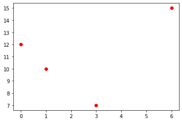
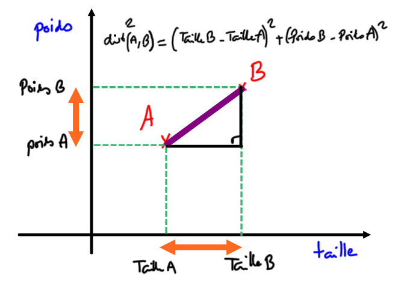

# <center><div class = "titre5">Prédiction du poste d'un joueur de rugby</div></center>

## <div class = "encadré2_TP">__Rappels sur la manipulation de fichiers CSV__</div>

Les fichiers CSV (pour Comma Separated Values) sont des fichiers-texte (ils ne contiennent aucune mise en forme) utilisés pour stocker des données, séparées par des virgules (ou des points-virgules, ou des espaces...). Il n'y a pas de norme officielle du CSV.

### <div class = "encadré3_TP">Exploitation d'un fichier CSV en Python avec le module CSV</div>

Python permet de lire et d'extraire des informations d'un fichier CSV même très volumineux, grâce à des modules dédiés, comme le bien-nommé `#!python csv`, utilisé ici.

Pour commencer, nous allons travailler à partir de l'exemple suivant : [exemple.csv](documents/exemple.csv).

#### <div class = "encadré4_TP">Première méthode</div>

Le script suivant :

```python
import csv                          
f = open('exemple.csv', "r", encoding='utf-8') # le "r" signifie "read", le fichier est ouvert en lecture seule
donnees = csv.reader(f)  # donnees est un objet (spécifique au module csv) qui contient des lignes

for ligne in donnees:               
    print(ligne)
    
f.close()    # toujours fermer le fichier !
```

donne :

```pycon
['Prénom', 'Nom', 'Email', 'SMS']
['John', 'Smith', 'john@example.com', '33123456789']
['Harry', 'Pierce', 'harry@example.com', '33111222222']
['Howard', 'Paige', 'howard@example.com', '33777888898']
```

!!! probleme "__Problèmes__"
	<div class="list16_1">

	1. Les données ne sont pas structurées : la première ligne est la ligne des «descripteurs» (ou des «champs»), alors que les lignes suivantes sont les valeurs de ces descripteurs.
	2. La variable `#!python donnees` n'est pas exploitable en l'état. Ce n'est pas une structure connue.

	</div>

#### <div class = "encadré4_TP">Améliorations</div>

Au lieu d'utiliser la fonction `#!python csv.reader()`, utilisons `#!python csv.DictReader()`. Comme son nom l'indique, elle renverra une variable contenant des dictionnaires.

Le script suivant :

```python
import csv
f = open('exemple.csv', "r", encoding='utf-8')
donnees = csv.DictReader(f)

for ligne in donnees:
    print(dict(ligne))
    
f.close()
```

donne

```pycon
{'Prénom': 'John', 'Nom': 'Smith', 'Email': 'john@example.com', 'SMS': '33123456789'}
{'Prénom': 'Harry', 'Nom': 'Pierce', 'Email': 'harry@example.com', 'SMS': '33111222222'}
{'Prénom': 'Howard', 'Nom': 'Paige', 'Email': 'howard@example.com', 'SMS': '33777888898'}
```

C'est mieux ! Les données sont maintenant des dictionnaires. Mais nous avons juste énuméré 3 dictionnaires. Comment ré-accéder au premier d'entre eux, celui de John Smith ?
<span style="display: block; margin: 5px 0 0 0;">Essayons :</span>

```pycon
>>> donnees[0]
Traceback (most recent call last):
  File "<console>", line 1, in <module>
TypeError: 'DictReader' object is not subscriptable
```

#### <div class = "encadré4_TP">Une liste de dictionnaires</div>

Nous allons donc créer une liste de dictionnaires.
<span style="display: block; margin: 10px 0 0 0;">Le script suivant :</span>
```python
import csv
f = open('exemple.csv', "r", encoding='utf-8')
donnees = csv.DictReader(f)
amis = []
for ligne in donnees:
    amis.append(dict(ligne))
    
f.close()
```

permet de faire ceci :

```pycon
>>> amis

[{'Prénom': 'John',
  'Nom': 'Smith',
  'Email': 'john@example.com',
  'SMS': '33123456789'},
{'Prénom': 'Harry',
  'Nom': 'Pierce',
  'Email': 'harry@example.com',
  'SMS': '33111222222'},
{'Prénom': 'Howard',
  'Nom': 'Paige',
  'Email': 'howard@example.com',
  'SMS': '33777888898'}]

>>> print(amis[0]['Email'])
john@example.com

>>> print(amis[2]['Nom'])
Paige
```

### <div class = "encadré3_TP">Un fichier un peu plus intéressant : les joueurs de rugby du TOP14</div>

Le fichier [`#!python top14.csv`](documents/top14.csv) contient tous les joueurs du Top14 de rugby, saison 2019-2020, avec leur date de naissance, leur poste, et leurs mensurations. 

_Ce fichier a été généré par Rémi Deniaud, de l'académie de Bordeaux._

!!! exercice {{exercice(False, prem=0)}}
	Stocker dans  une variable `#!python joueurs`  les renseignements de tous les joueurs présents dans ce fichier csv.

	<center>
	[Correction de l'exercice 1 :material-cursor-default-click:](correction_TOP14.md#correction-de-lexercice-1){:target="_blank" .md-button}
	</center>

#### <div class = "encadré4_TP">Première analyse</div>

!!! exercice {{exercice(False)}}
	Combien de joueurs sont présents dans ce fichier ?

	<center>
	[Correction de l'exercice 2 :material-cursor-default-click:](correction_TOP14.md#correction-de-lexercice-2){:target="_blank" .md-button}
	</center>

!!! exercice {{exercice(False)}}
	Quel est le prénom du joueur n°486 ?

	<center>
	[Correction de l'exercice 3 :material-cursor-default-click:](correction_TOP14.md#correction-de-lexercice-3){:target="_blank" .md-button}
	</center>

#### <div class = "encadré4_TP">Extraction de données particulières</div>

!!! exercice {{exercice(False)}}
	En 2019, où jouait Baptiste SERIN ? 

	<center>
	[Correction de l'exercice 4 :material-cursor-default-click:](correction_TOP14.md#correction-de-lexercice-4){:target="_blank" .md-button}
	</center>

!!! exercice {{exercice(False)}}
	Qui sont les joueurs de plus de 140 kg ?

	*Attention à bien convertir en entier la chaine de caractère renvoyée par la clé `#!python Poids`, à l'aide de la fonction `#!python int()`* 

	<center>
	[Correction de l'exercice 5 :material-cursor-default-click:](correction_TOP14.md#correction-de-lexercice-5){:target="_blank" .md-button}
	</center>

#### <div class = "encadré4_TP">Exploitation graphique</div>

Nous allons utiliser le module Matplotlib pour illustrer les données de notre fichier csv.

Pour tracer un nuage de points (par l'instruction `#!python plt.plot`), Matplotlib requiert :
<div class="couleur_puce18" markdown="1">

- une liste `#!python X` contenant toutes les abscisses des points à tracer.
- une liste `#!python Y` contenant toutes les ordonnées des points à tracer.

</div>

##### <div class = "encadré5_TP">Exemple</div>

```python
import matplotlib.pyplot as plt
X = [0, 1, 3, 6]
Y = [12, 10, 7, 15]
plt.plot(X, Y, 'ro')
plt.show()
```

Dans l'instruction `#!python plt.plot(X, Y, 'ro')` :
<div class="couleur_puce17" markdown="1">

- `#!python X` sont les abscisses,
- `#!python Y` sont les ordonnées,
- `#!python 'ro'` signifie :

</div>
<div class="couleur_puce17etoi_decal" markdown="1">

- qu'on veut des points (c'est le `#!python 'o'`, plus de choix [ici](https://matplotlib.org/stable/api/markers_api.html){. target="_blank"}).
- qu'on veut qu'ils soient rouges (c'est le `#!python 'r'` plus de choix [ici](https://matplotlib.org/stable/gallery/color/named_colors.html#tableau-palette){. target="_blank"}).

</div>
{: .image}

##### <div class = "encadré5_TP">Application</div>

!!! exercice {{exercice(False)}}
	Afficher sur un graphique tous les joueurs de rugby du top14, en mettant le poids en abscisse et la taille en ordonnée.

	<center>
	[Correction de l'exercice 6 :material-cursor-default-click:](correction_TOP14.md#correction-de-lexercice-6){:target="_blank" .md-button}
	</center>

!!! exercice {{exercice(False)}}
	Faire apparaître ensuite les joueurs évoluant au poste de Centre en bleu, et les 2ème lignes en vert.

	<center>
	[Correction de l'exercice 7 :material-cursor-default-click:](correction_TOP14.md#correction-de-lexercice-7){:target="_blank" .md-button}
	</center>

## <div class = "encadré2_TP">__Rappels sur le tri des données__</div>

Nous continuons d'exploiter notre fichier de joueurs de rugby du Top14. 

### <div class = "encadré3_TP">Créer une fonction filtre</div>

!!! exercice {{exercice(False, prem=0)}}
	Créer une fonction `#!python joueurs_equipe` qui renvoie une liste contenant les fiches de tous les joueurs de l'équipe `#!python equipe` passée en paramètre. 

    **Exemple d'utilisation :**

    ```pycon
	>>> joueurs_equipe('Bordeaux')
    [{'Equipe': 'Bordeaux', 'Nom': 'Jefferson POIROT', 'Poste': 'Pilier', 'Date de naissance': '01/11/1992', 'Taille': '181', 'Poids': '117'}, {'Equipe': 'Bordeaux', 'Nom': 'Lasha TABIDZE', 'Poste': 'Pilier', 'Date de naissance': '04/07/1997', 'Taille': '185', 'Poids': '117'}, {'Equipe': 'Bordeaux', 'Nom': 'Laurent DEL.....
	```

	<center>
	[Correction de l'exercice 1 :material-cursor-default-click:](correction_TOP14.md#correction-de-lexercice-1_1){:target="_blank" .md-button}
	</center>

!!! exercice {{exercice(False)}}
    Définir de la même manière une fonction `#!python joueurs_poste` qui prend une chaîne de caractères `#!python poste` et qui renvoie la liste des fiches des joueurs jouant à ce poste.

    **Exemple d'utilisation :**
    ```pycon
    >>> joueurs_poste("Talonneur")
    [{'Equipe': 'Agen', 'Nom': 'Clément MARTINEZ', 'Poste': 'Talonneur', 'Date de naissance': '14/03/1996', 'Taille': '181', 'Poids': '105'}, {'Equipe': 'Agen', 'Nom': 'Marc BARTHOMEUF', 'Poste': 'T...
    ```

	<center>
	[Correction de l'exercice 2 :material-cursor-default-click:](correction_TOP14.md#correction-de-lexercice-2_1){:target="_blank" .md-button}
	</center>

### <div class = "encadré3_TP">Utilisation d'une fonction de tri</div>

#### <div class = "encadré4_TP">Le problème</div>

Comment classer les joueurs suivant leur taille ?
La fonction `#!python sorted(liste)` est efficace sur les listes : elle renvoie une nouvelle liste triée dans l'ordre croissant.

```pycon
>>> ma_liste = [4, 2, 8, 6]

>>> ma_nouvelle_liste = sorted(ma_liste)

>>> print(ma_nouvelle_liste)
[2, 4, 6, 8]
```

Mais comment trier un dictionnaire ? 

```python
>>> test = sorted(joueurs)
Traceback (most recent call last):
  File "<console>", line 1, in <module>
TypeError: '<' not supported between instances of 'dict' and 'dict'
```

Il est normal que cette tentative échoue : un dictionnaire possède plusieurs clés différentes.
<span style="display: block; margin: 3px 0 0 0;">Ici, plusieurs clés peuvent être des critères de tri : la taille, le poids.</span>
<span style="display: block; margin: 10px 0 0 0;">Nous allons donc utiliser la même stratégie que celle vue dans [les différentes méthodes de tri](../Algos_de_tri/tri.md#la-fonction-sorted){. target="_blank"}.</span>

#### <div class = "encadré4_TP">Un exemple de tri de dictionnaire</div>

```python
Simpsons = [{"Prenom" : "Bart", "age estimé": "10"},
           {"Prenom" : "Lisa", "age estimé": "8"},
           {"Prenom" : "Maggie", "age estimé": "1"},
           {"Prenom" : "Homer", "age estimé": "38"},
           {"Prenom" : "Marge", "age estimé": "37"}]

def age(personnage):
    return int(personnage["age estimé"])

```

```pycon
>>> age(Simpsons[0])
10
```

La création de cette fonction `#!python age` va nous permettre de spécifier une clé de tri, par le paramètre `#!python key` :

!!! book2 "Tri d'un dictionnaire"

    ```python
	>>> tri_Simpsons = sorted(Simpsons, key=age)

	>>> tri_Simpsons
	    [{'Prenom': 'Maggie', 'age estimé': '1'},
	     {'Prenom': 'Lisa', 'age estimé': '8'},
	     {'Prenom': 'Bart', 'age estimé': '10'},
	     {'Prenom': 'Marge', 'age estimé': '37'},
	     {'Prenom': 'Homer', 'age estimé': '38'}]

	```

On peut aussi inverser l'ordre de tri :

!!! book1 "__Tri décroissant__"

	```python
	>>> tri_Simpsons = sorted(Simpsons, key=age, reverse=True)

	>>> tri_Simpsons
	    [{'Prenom': 'Homer', 'age estimé': '38'},
	     {'Prenom': 'Marge', 'age estimé': '37'},
	     {'Prenom': 'Bart', 'age estimé': '10'},
	     {'Prenom': 'Lisa', 'age estimé': '8'},
	     {'Prenom': 'Maggie', 'age estimé': '1'}]

	```

!!! exercice {{exercice(False)}}
	Trier les joueurs du Top14 par taille.

	<center>
	[Correction de l'exercice 3 :material-cursor-default-click:](correction_TOP14.md#correction-de-lexercice-3_1){:target="_blank" .md-button}
	</center>

!!! exercice {{exercice(False)}}
	Trier les joueurs du Top14 par poids.

	<center>
	[Correction de l'exercice 4 :material-cursor-default-click:](correction_TOP14.md#correction-de-lexercice-4_1){:target="_blank" .md-button}
	</center>      

!!! exercice {{exercice(False)}}
	Trier les joueurs de Bordeaux suivant leur Indice de Masse Corporelle ([IMC](https://fr.wikipedia.org/wiki/Indice_de_masse_corporelle){. target="_blank"})    

	<center>
	[Correction de l'exercice 5 :material-cursor-default-click:](correction_TOP14.md#correction-de-lexercice-5_1){:target="_blank" .md-button}
	</center>

### <div class = "encadré3_TP">Recherche des joueurs de profil physique similaire</div>

#### <div class = "encadré4_TP">Distance entre deux joueurs</div>

!!! exercice {{exercice(False)}}
    
    Construire une fonction `#!python distance` qui renvoie la somme des carrés des différences de tailles et de poids entre deux joueurs `#!python joueur1` et `#!python joueur2`, passés en paramètres. 

    $$d = (p_1-p_2)^2 + (t_1-t_2)^2$$

    Cette fonction nous permettra d'estimer la différence morphologique entre deux joueurs.

    **Exemple d'utilisation :**
    ```pycon
    >>> distance(joueurs[23], joueurs[31])
    244
    ```

    *Vérification :*
    ```pycon
    >>> joueurs[23]
    {'Equipe': 'Agen', 'Nom': 'Alban CONDUCHÉ', 'Poste': 'Centre', 'Date de naissance': '29/10/1996', 'Taille': '190', 'Poids': '102'}

    >>> joueurs[31]
    {'Equipe': 'Agen', 'Nom': 'JJ TAULAGI', 'Poste': 'Arrière', 'Date de naissance': '18/06/1993', 'Taille': '180', 'Poids': '90'}
    ```

    $(102-90)^2+(190-180)^2=244$

	<center>
	[Correction de l'exercice 6 :material-cursor-default-click:](correction_TOP14.md#correction-de-lexercice-6_1){:target="_blank" .md-button}
	</center>

#### <div class = "encadré4_TP">Distance des joueurs avec Baptiste Serin</div>

Retrouvons d'abord le numéro de Baptiste Serin dans notre classement de joueurs :

```pycon
>>> for k in range(len(joueurs)) :
       if joueurs[k]['Nom'] == 'Baptiste SERIN' :
           print(k)
530

>>> joueurs[530]
    {'Equipe': 'Toulon',
     'Nom': 'Baptiste SERIN',
     'Poste': 'Mêlée',
     'Date de naissance': '20/06/1994',
     'Taille': '180',
     'Poids': '79'}
```

Baptiste SERIN est donc le joueur numéro 530.

!!! exercice {{exercice(False)}}
    
    Créer une fonction `#!python distance_Serin` qui prend en paramètre un joueur et qui renvoie sa différence avec Baptiste Serin.

    **Exemple d'utilisation :**

    ```pycon
    >>> distance_Serin(joueurs[18])
    745
    ```

	<center>
	[Correction de l'exercice 7 :material-cursor-default-click:](correction_TOP14.md#correction-de-lexercice-7_1){:target="_blank" .md-button}
	</center>   

!!! exercice {{exercice(False)}}

    Classer l'ensemble des joueurs du Top14 suivant leur différence morphologique avec Baptiste Serin (du plus proche au plus éloigné).
    <span style="display: block; margin: 8px 0 0 0;">Afficher le nom des 10 premiers joueurs.</span>

	<center>
	[Correction de l'exercice 8 :material-cursor-default-click:](correction_TOP14.md#correction-de-lexercice-8){:target="_blank" .md-button}
	</center>

## <div class = "encadré2_TP">__Mise en place de l'algorithme k-NN__</div>

### <div class = "encadré3_TP">Objectif</div>

Nous souhaitons pouvoir répondre à cette question :

!!! clock1 "__Question__"
    Si on croise une personne (qu'on appelera joueur X) nous disant qu'elle veut jouer en Top14, et qu'elle nous donne son poids et sa taille, peut-on lui prédire à quel poste elle devrait jouer ?

Nous devons donc créer une fonction `#!python conseil_poste` qui prend en argument `#!python poids` et `#!python taille` , qui sont les caractéristiques du joueur X. Cette fonction prendra aussi en paramètre un nombre `#!python k` qui sera le nombre de voisins utilisés pour déterminer le poste conseillé.
<span style="display: block; margin: 10px 0 0 0;">La fonction doit renvoyer une chaîne de caractère correspondant au poste auquel on lui conseille de jouer.</span>
<span style="display: block; margin: 10px 0 0 0;">Il va falloir pour cela classer tous les joueurs du Top14 suivant leur proximité morphologique avec notre joueur X, et prendre parmi les `#!python k` premiers joueurs le poste majoritaire.</span>

### <div class = "encadré3_TP">Fonction distance morphologique</div>

Dans toute idée de classification il y a l'idée de **distance**. Il faut comprendre la distance comme une _mesure de la différence_. 

Comment mesurer la différence physique entre deux joueurs de rugby ? 

{: .image width=50%}

!!! exercice {{exercice(False, text="Fonction `#!python distance`", prem=0)}}
    Écrire une fonction `#!python distance` qui reçoit en paramètres :
    <div class="couleur_puce1">

    - `#!python poids`  : le poids du joueur X
    - `#!python taille` : la taille du joueur X
    - `#!python joueur`  : un joueur de la liste `#!python joueurs`

    </div>
    et qui renvoie la distance morphologique du joueur X avec `#!python joueur`.

    **Exemple d'utilisation :**
    ```pycon
    >>> distance(93, 190, joueurs[34])
    445
    ```

	<center>
	[Correction de l'exercice 1 :material-cursor-default-click:](correction_TOP14.md#correction-de-lexercice-1_2){:target="_blank" .md-button}
	</center>      

### <div class = "encadré3_TP">Classement des joueurs suivant leur proximité morphologique</div>

De la même manière qu'on avait classé les joueurs suivant leur IMC, on peut les classer suivant leur proximité morphologique avec le joueur X.

#### <div class = "encadré4_TP">Fonction second</div>

!!! exercice {{exercice(False, text="Fonction `#!python second`")}}
    Écrire une fonction `#!python second` qui reçoit en paramètres `#!python couple`, un couple de valeurs, et qui renvoie le deuxième élément du couple.

    **Exemple d'utilisation :**
    ```pycon
    >>> cpl = ("vendredi", 13)

    >>> second(cpl)
    13
    ```

	<center>
	[Correction de l'exercice 2 :material-cursor-default-click:](correction_TOP14.md#correction-de-lexercice-2_2){:target="_blank" .md-button}
	</center>          

#### <div class = "encadré4_TP">Classement des k plus proches joueurs</div>

!!! exercice {{exercice(False, text="__Fonction `#!python classement_k_joueurs`__")}}
    Écrire une fonction `#!python classement_k_joueurs` qui reçoit en paramètres :
    <div class="couleur_puce1">

    - `#!python poids`  : le poids du joueur X
    - `#!python taille` : la taille du joueur X
    - `#!python k` : le nombre de joueurs les plus proches que l'on veut garder

    </div>
    et qui renvoie une liste contenant les `#!python k` joueurs classés suivant leur proximité morphologique avec le joueur X.

    **Exemple d'utilisation :**
    ```pycon
    >>> classement_k_joueurs(85, 186, 3)
    [{'Equipe': 'Bordeaux', 'Nom': 'Geoffrey CROS', 'Poste': 'Arrière', 'Date de naissance': '08/03/1997', 'Taille': '185', 'Poids': '85'}, {'Equipe': 'Toulouse', 'Nom': 'Romain NTAMACK', 'Poste': 'Ouverture', 'Date de naissance': '01/05/1999', 'Taille': '186', 'Poids': '84'}, {'Equipe': 'Bayonne', 'Nom': 'Manuel ORDAS', 'Poste': 'Ouverture', 'Date de naissance': '21/02/1998', 'Taille': '186', 'Poids': '83'}]
    ```

	<center>
	[Correction de l'exercice 3 :material-cursor-default-click:](correction_TOP14.md#correction-de-lexercice-3_2){:target="_blank" .md-button}
	</center>         

### <div class = "encadré3_TP">Recherche du poste le plus représenté</div>

#### <div class = "encadré4_TP">Dictionnaire d'occurrence des postes</div>

!!! exercice {{exercice(False, text="__Fonction `#!python occurrence`__")}}
    Écrire une fonction `#!python occurrence` qui reçoit en paramètres `#!python joueurs`, une liste de joueurs et qui renvoie le dictionnaire composé différents postes de ces joueurs, et du nombre de fois où ils apparaissent dans la liste `#!python joueurs`.

    **Exemple d'utilisation :**
    ```pycon
    >>> occurrence(joueurs)
    {'Pilier': 110, 'Talonneur': 50, '2ème ligne': 74, '3ème ligne': 111, 'Mêlée': 42, 'Ouverture': 38, 'Centre': 71, 'Ailier': 64, 'Arrière': 35}
    ```

	<center>
	[Correction de l'exercice 4 :material-cursor-default-click:](correction_TOP14.md#correction-de-lexercice-4_2){:target="_blank" .md-button}
	</center>

#### <div class = "encadré4_TP">Tri d'un dictionnaire</div>

!!! exercice {{exercice(False, text="__Fonction `#!python cle_max`__")}}
    Écrire une fonction `#!python cle_max` qui reçoit en paramètre `#!python d`, un dictionnaire dont les clés sont des chaines de caractère et les valeurs sont des nombres, et qui renvoie la clé associée à la valeur maximale.

    **Exemple d'utilisation :**
    ```pycon
    >>> d = {"lundi": 13, "mardi": 9, "mercredi": 18, "jeudi": 4}

    >>> cle_max(d)
    'mercredi'
    ```

	<center>
	[Correction de l'exercice 5 :material-cursor-default-click:](correction_TOP14.md#correction-de-lexercice-5_2){:target="_blank" .md-button}
	</center>

#### <div class = "encadré4_TP">Fonction conseil_poste</div>

!!! exercice {{exercice(False, text="__Fonction `#!python conseil_poste`__")}}
    Écrire une fonction `#!python conseil_poste` qui reçoit en paramètres :
    <div class="couleur_puce1">

    - `#!python poids`  : le poids du joueur X
    - `#!python taille` : la taille du joueur X
    - `#!python k` : le nombre de joueurs les plus proches sur lequel on se base pour faire la prédiction et qui renvoie le poste le plus compatible avec la morphologie de X.

    </div>
    **Exemple d'utilisation :**
    ```pycon
    >>> conseil_poste(70, 170, 6)
    'Mêlée'
    >>> conseil_poste(120, 210, 6)
    '2ème ligne'
    ```

	<center>
	[Correction de l'exercice 6 :material-cursor-default-click:](correction_TOP14.md#correction-de-lexercice-6_2){:target="_blank" .md-button}
	</center>

Faire varier les différents paramètres pour observer leur rôle respectif.