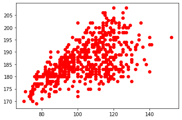
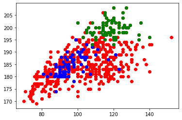

# <center><div class = "titre2">Correction des exercices</div></center>

## <div class = "encadré2_TP">__Rappels sur la manipulation de fichiers CSV__</div>

### <div class = "encadré_exo"> __Correction de l'exercice 1__ </div>

```python

import csv
f = open('top14.csv', "r", encoding='utf-8')
donnees = csv.DictReader(f)
joueurs = []
for ligne in donnees:
    joueurs.append(dict(ligne))
            
f.close()
```

### <div class = "encadré_exo"> __Correction de l'exercice 2__ </div>

```pycon
>>> len(joueurs)
595
```

### <div class = "encadré_exo"> __Correction de l'exercice 3__ </div>

```pycon
>>> joueurs[486]['Nom']
'Wenceslas LAURET'
```

### <div class = "encadré_exo"> __Correction de l'exercice 4__ </div>

La méthode la plus naturelle est de parcourir toute la liste jusqu'à trouver le bon joueur, puis d'afficher son équipe.
```pycon
>>> for joueur in joueurs:
        if joueur['Nom'] == 'Baptiste SERIN':
            print(joueur['Equipe'])
```

Une méthode plus efficace est d'utiliser une liste par compréhension incluant un test. 

```pycon
>>> club_Serin = [joueur['Equipe'] for joueur in joueurs if joueur['Nom'] == 'Baptiste SERIN']
        
>>> club_Serin
['Toulon']
```

### <div class = "encadré_exo"> __Correction de l'exercice 5__ </div>

```pycon
>>> lourds = [(joueur['Nom'], joueur['Poids']) for joueur in joueurs if int(joueur['Poids']) > 140]

>>> lourds
[('Uini ATONIO', '152'), ('Malik HAMADACHE', '141')]
```

### <div class = "encadré_exo"> __Correction de l'exercice 6__ </div>

```python
X = [int(joueur['Poids']) for joueur in joueurs]
Y = [int(joueur['Taille']) for joueur in joueurs]
plt.plot(X, Y, 'ro') 
plt.show()
```
{: .image}

### <div class = "encadré_exo"> __Correction de l'exercice 7__ </div>

```python
#tous les joueurs
X = [int(joueur['Poids']) for joueur in joueurs]
Y = [int(joueur['Taille']) for joueur in joueurs]
plt.plot(X, Y, 'ro') 

#on recolorie les Centres en bleu
X = [int(joueur['Poids']) for joueur in joueurs if joueur['Poste'] == 'Centre']
Y = [int(joueur['Taille']) for joueur in joueurs if joueur['Poste'] == 'Centre']
plt.plot(X, Y, 'bo')

#on recolorie les 2ème ligne en vert
X = [int(joueur['Poids']) for joueur in joueurs if joueur['Poste'] == '2ème ligne']
Y = [int(joueur['Taille']) for joueur in joueurs if joueur['Poste'] == '2ème ligne']
plt.plot(X, Y, 'go')

plt.show()
```

{: .image}

## <div class = "encadré2_TP">__Rappels sur le tri des données__</div>

### <div class = "encadré_exo"> __Correction de l'exercice 1__ </div>

```python
def joueurs_equipe(equipe):
    return [player for player in joueurs if player['Equipe'] == equipe]
```

### <div class = "encadré_exo"> __Correction de l'exercice 2__ </div>

```python
def joueurs_poste(poste):      
    return [player for player in joueurs if player['Poste'] == poste]
``` 

### <div class = "encadré_exo"> __Correction de l'exercice 3__ </div>

```python
def taille_joueur(joueur) :
    return int(joueur['Taille'])

joueurs_taille_croissant = sorted(joueurs, key=taille_joueur)
``` 

### <div class = "encadré_exo"> __Correction de l'exercice 4__ </div>

```python
def poids_joueur(joueur) :
    return int(joueur['Poids'])

joueurs_poids_croissant = sorted(joueurs, key=poids_joueur)
```  

### <div class = "encadré_exo"> __Correction de l'exercice 5__ </div>

```python
def IMC(joueur):
    masse = int(joueur['Poids'])
    taille_m = int(joueur['Taille']) / 100
    return masse / taille_m**2

joueurs_UBB = [joueur for joueur in joueurs if joueur['Equipe'] == 'Bordeaux']
joueurs_UBB_tri = sorted(joueurs_UBB, key=IMC)
```  

### <div class = "encadré_exo"> __Correction de l'exercice 6__ </div>

```python
def distance(joueur1, joueur2):
    p1 = int(joueur1['Poids'])
    p2 = int(joueur2['Poids'])
    t1 = int(joueur1['Taille'])
    t2 = int(joueur2['Taille'])
return (p1 - p2)**2 + (t1 - t2)**2
```

### <div class = "encadré_exo"> __Correction de l'exercice 7__ </div>

```python
def distance_Serin(joueur):
    return distance(joueurs[530], joueur)
``` 

### <div class = "encadré_exo"> __Correction de l'exercice 8__ </div>

```python
joueurs_VS_Serin = sorted(joueurs, key=distance_Serin)
for i in range(10):
    joueur = joueurs_VS_Serin[i]
    print(joueur['Nom'])
```

## <div class = "encadré2_TP">__Mise en place de l'algorithme k-NN__</div>

### <div class = "encadré_exo"> __Correction de l'exercice 1__ </div>

```python
def distance(poids, taille, joueur):
    p = int(player['Poids'])
    t = int(player['Taille'])
    return (poids - p)**2 + (taille - t)**2
```

### <div class = "encadré_exo"> __Correction de l'exercice 2__ </div>

```python
def second(cpl):
    return cpl[1]
```

### <div class = "encadré_exo"> __Correction de l'exercice 3__ </div>

```python
def classement_k_joueurs(poids, taille):
    couples = []
    for joueur in joueurs:
        couples.append((joueur, distance(poids, taille, joueur)))
    couples_tries = sorted(couples, key=second)
    joueurs_classes = [couple[0] for couple in couples_tries]
    return joueurs_classes[:k]
```  

### <div class = "encadré_exo"> __Correction de l'exercice 4__ </div>

```python
def occurrence(joueurs):
    occ = {}
    for joueur in joueurs:
        if joueur['Poste'] in occ:
            occ[joueur['Poste']] += 1
        else:
            occ[joueur['Poste']] = 1
    return occ
``` 

### <div class = "encadré_exo"> __Correction de l'exercice 5__ </div>

```python
def cle_max(d):
    maxi = 0
    for key in d:
        if d[key] > maxi:
            maxi = d[key]
            key_max = key
    return key_max
```

### <div class = "encadré_exo"> __Correction de l'exercice 6__ </div>

```python
def conseil_poste(poids, taille, k):
    joueurs_classes = classement_k_joueurs(poids, taille, k)
    dico = occurrence(joueurs_classes)
    poste_conseille = cle_max(dico)
    return poste_conseille
```