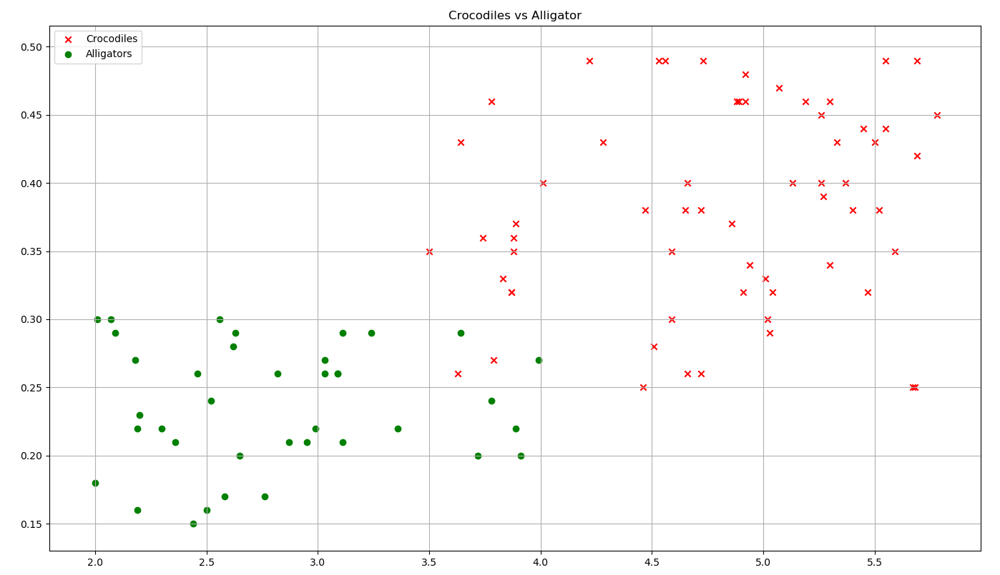
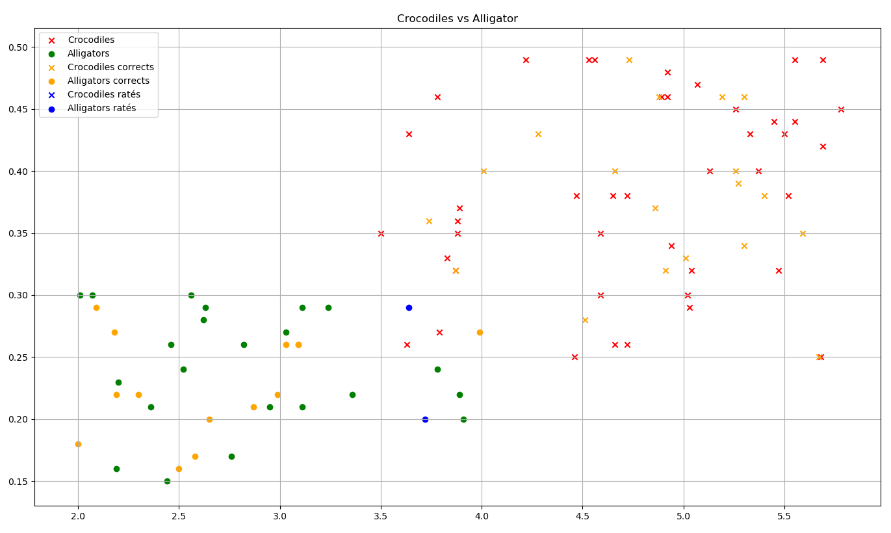

# <center><div class = "titre5">Crocodiles vs Alligators</div></center>

Ce TP complet vous présente l'implémentation de l'algorithme des $k$ plus proches voisins pour classifier des animaux.
<span style="display: block; margin: 10px 0 0 0;">On utilise seulement deux critères très simples :</span>
<div class="couleur_puce22" markdown="1">

* le longueur de l'animal
* la taille de sa gueule

</div>
L'exemple est volontairement limité à deux caractéristiques afin de pouvoir les présenter graphiquement dans un plan. Au delà de deux caractéristiques, il faut utiliser plusieurs graphiques et c'est nettement moins lisible.
<span style="display: block; margin: 10px 0 0 0;">Sur une figure, c'est simple, on voit nettement la démarcation.</span>
<span style="display: block; margin: 10px 0 0 0;">Avec les données chiffrées aussi.</span>
<span style="display: block; margin: 10px 0 0 0;">Nous devrions donc parvenir à distinguer facilement et repérer nos erreurs.</span>

## <div class = "encadré2_TP">__Données__</div>

Toutes les données utilisées ici sont fictives.
<span style="display: block; margin: 10px 0 0 0;">Voici un exemple du jeu de données sur lequel nous allons travailler :</span>

```
taille,gueule,espece
3.78,0.46,crocodile
2.18,0.27,alligator
5.04,0.32,crocodile
2.2,0.23,alligator
3.24,0.29,alligator
5.55,0.49,crocodile
5.4,0.38,crocodile
3.03,0.27,alligator
...
```

Les champs sont donc `#!python taille`, `#!python gueule` et `#!python espece`.
<span style="display: block; margin: 10px 0 0 0;">Une fois dessiné, on obtient ce graphique :</span>

{ .image width=80%}

Ainsi qu'on peut le voir, il y a un léger chevauchement des données.

## <div class = "encadré2_TP">Utiliser le programme</div>

Dans l'ordre, voici les étapes à exécuter :
<div class="list8_1" markdown="1">

1. Récupérer le fichier [crocos.zip](documents/crocos.zip) et tout extraire dans un même dossier.
2. Exécuter le fichier <span style="font-family: 'Trebuchet MS' ; font-weight: bold">generer_donnees.py</span> qui va créer le fichier <span style="font-family: 'Trebuchet MS' ; font-weight: bold">crocos.csv</span> et générer son contenu.
3. Exécuter le fichier <span style="font-family: 'Trebuchet MS' ; font-weight: bold">presenter_donnees.py</span> qui va dessiner le graphique présentant les données.
4. Exécuter le fichier <span style="font-family: 'Trebuchet MS' ; font-weight: bold">knn.py</span>.  
<span style="display: block; margin: 3px 0 0 0;">Ce script applique l'algorithme des $k$ plus proches voisins avec $k=3$ au jeu de données précédent.</span>
<span style="display: block; margin: 3px 0 0 0;">Une fois les calculs effectués, il affiche dans la console la précision (entre `#!python 0` et `#!python 1`). Espérons qu'elle soit proche de `#!python 1` !</span>
<span style="display: block; margin: 3px 0 0 0;">Ensuite il dessine les résultats.</span>
<span style="display: block; margin: 5px 0 0 0;">Vous devriez obtenir un graphique similaire à :</span>
{ .image width=85%}
On y distingue :

</div>
<div class="couleur_puce22_decal" markdown="1">

* en rouge et vert les données ayant servi à l’entraînement ;
* en orange, les données testées qui sont correctes (rond alligators, croix crocodiles) ;
* en bleu, les données testées qui ont échoué (mauvaises prédictions par kNN).

</div>
<div class="decal8" markdown="1">

Comme on pouvait s'y attendre, les reptiles mal classifiés sont ceux qui sont au centre de la figure, là où les zones "rouges" et "vertes" se rencontrent.

!!! warning "__Attention__"
    Il y a plusieurs étapes aléatoires (génération des données, séparation des jeux de tests et d'entraînement) qui font que vous pouvez parfaitement n'avoir aucun reptile mal classifié. Vous ne verriez alors aucun point bleu.

</div>
<div class="list8_5" markdown="1">

5. Recommencer la simulation pour changer vos données.

</div>
<div class="decal8" markdown="1">

!!! remarque "__Remarque__"
    Le dernier fichier <span style="font-family: 'Trebuchet MS' ; font-weight: bold">presenter_resultats.py</span> n'a pas grand intérêt. C'est un simple copier-coller pour créer rapidement la figure précédente.

</div>
## <div class = "encadré2_TP">Consignes</div>

- [ ] Lire soigneusement tout le code (sauf <span style="font-family: 'Trebuchet MS' ; font-weight: bold">presenter_resultats.py</span>)

- [ ] Compléter la documentation des fonction dont la documentation ne contient rien.  
Il y en a quatre.

- [ ] Créer un script python <span style="font-family: 'Trebuchet MS' ; font-weight: bold">classifier_nouveaux.py</span>
    <span style="display: block; margin: 5px 0 0 0;">Importer le script <span style="font-family: 'Trebuchet MS' ; font-weight: bold">knn.py</span> et créer une fonction `#!python classifier`.</span>
    <span style="display: block; margin: 5px 0 0 0;">Elle prend en paramètre un reptile sous la forme :</span>

    ~~~python
    reptile = {
      "taille": 5.2,
      "gueule": 0.7
    }
    ~~~

    Les données numériques sont libres mais doivent rester aux alentours de celles du jeu initial.
    <span style="display: block; margin: 5px 0 0 0;">Votre fonction renvoie la classe du reptile en question.</span>

- [ ] Améliorer votre fonction pour qu'elle ajoute une clé `#!python "espece"` dont la valeur est le vote obtenu.

- [ ] Copier ce qui est fait dans <span style="font-family: 'Trebuchet MS' ; font-weight: bold">generer_donnees.py</span> afin de générer des reptiles dont on connait les dimensions mais pas l'espèce.
    <span style="display: block; margin: 5px 0 0 0;">Englober ce travail dans une fonction `#!python creer_nouveaux(nombre)` dont le paramètre `#!python nombre` est... le nombre de reptiles à créer.
    <span style="display: block; margin: 5px 0 0 0;">Renvoyer une liste de nouveaux reptiles.</span>

- [ ] Présenter vos données.
    <span style="display: block; margin: 5px 0 0 0;">On doit voir la figure avec les reptiles du jeu de données et les nouveaux en bleu.
    <span style="display: block; margin: 5px 0 0 0;">Inspirez-vous de ce qui est fait dans <span style="font-family: 'Trebuchet MS' ; font-weight: bold">presenter_donnees.py</span>

