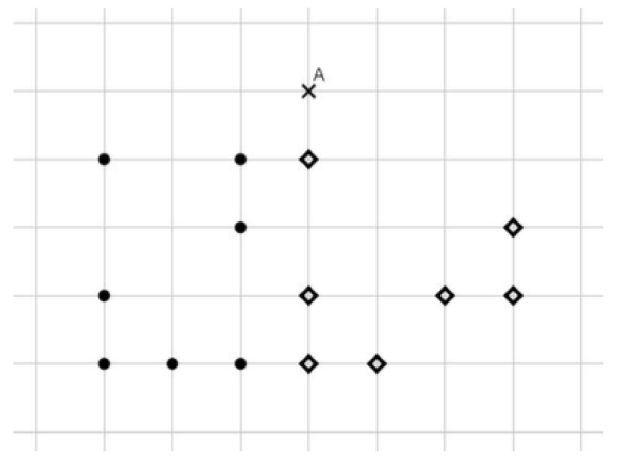
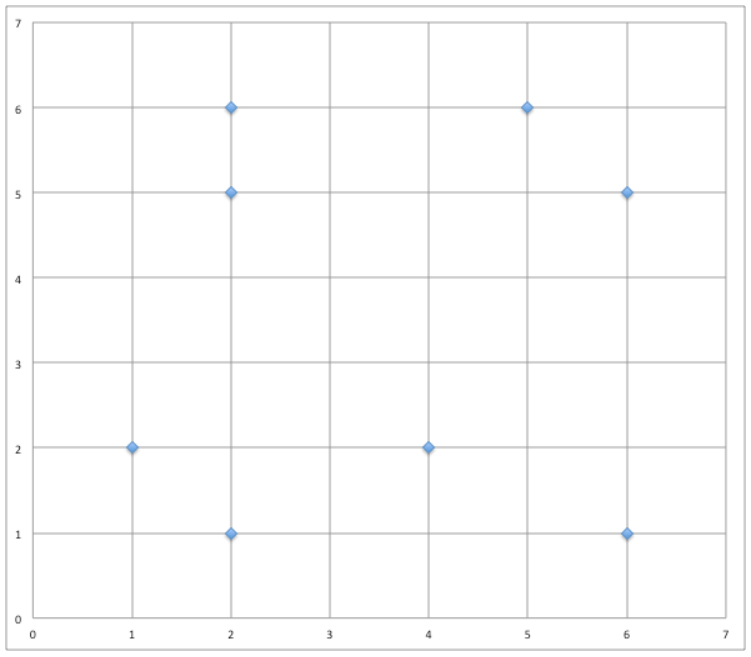

# <center><div class = "titre2">Exercices</div></center>

### <div class = "encadré_exo"> __Exercice 1__ </div>
<span style="color: #f36379; font-weight: bold; font-size: 1.2rem; text-align: center; display: block;">Trouver la classe avec les $k$ plus proches voisins</span>

Supposons que l’on ait un problème de classification qui consiste à déterminer la classe d’appartenance de nouvelles instances $\operatorname{X}_i$.
Les classes possibles sont $1$, $2$ ou $3$.
<span style="display: block; margin: 10px 0 20px 0;">Selon la base de connaissances suivante, déterminez à la main (ou à l’aide d’un tableur) la classe de l’instance $\operatorname{X}_6$, dont les valeurs des attributs numériques $\operatorname{A}_1$ à $\operatorname{A}_5$ sont respectivement $3$, $12$, $4$, $7$ et enfin $8$, à l’aide de l’algorithme $k$-NN avec $k = 1$ puis $k = 3$.</span>
<center>

| Instances     | $\operatorname{A}_1$     | $\operatorname{A}_2$     | $\operatorname{A}_3$    | $\operatorname{A}_4$     | $\operatorname{A}_5$     | Classe     |
|:-------------:|:------:|:------:|:------:|:------:|:------:|:----------:|
| $\operatorname{X}_1$      | $3$     | $5$     | $4$    | $6$     | $1$   | $1$   |
| $\operatorname{X}_2$      | $4$     | $6$     | $10$    | $3$     | $2$   | $2$   |
| $\operatorname{X}_3$      | $8$     | $3$     | $4$    | $2$     | $6$   | $3$   |
| $\operatorname{X}_4$      | $2$     | $1$     | $4$    | $3$     | $6$   | $3$   |
| $\operatorname{X}_5$      | $2$     | $5$     | $1$    | $4$     | $8$   | $2$   |

</center>
Montrer tous les calculs.

### <div class = "encadré_exo"> __Exercice 2__ </div>
<span style="color: #f36379; font-weight: bold; font-size: 1.2rem; text-align: center; display: block;">Autre exemple simple</span>

On considère les points $A(1;6)$, $B(2;6)$, $C(3;1)$, $D(4;2)$, $E(6;0)$, $F(7;5)$, $G(7;3)$ et $H(10;3)$.
<span style="display: block; margin: 10px 0 0 0;">En utilisant la distance euclidienne, quels sont les deux plus proches voisins du point $P(5;5)$ ?</span>

### <div class = "encadré_exo"> __Exercice 3__ </div>
<span style="color: #f36379; font-weight: bold; font-size: 1.2rem; text-align: center; display: block;">Un QCM</span>

Dans le quadrillage ci-dessous 14 points sont dessinés, dont 7 de la classe $\operatorname{C}_1$, avec des ronds noirs <span style="font-size: 1.5em;">•</span>
 et 7 de la classe $\operatorname{C}_2$, avec des losanges ◇.

{ .image width=50%}

<span style="display: block; margin: 30px 0 0 0;">On introduit un nouveau point $\operatorname{A}$, dont on cherche la classe à l’aide d’un algorithme des $k$ plus proches voisins pour la distance géométrique habituelle, en faisant varier la valeur de $k$ parmi $1$, $3$ et $5$.

Quelle est la bonne réponse (sous la forme d’un triplet de classes pour le triplet $(1; 3; 5)$ des valeurs de $k$) ?

!!! rocket "Réponses possibles"

	=== "__A__" 
		$(\operatorname{C}_1; \operatorname{C}_2; \operatorname{C}_3)$

	=== "B" 
		$(\operatorname{C}_2; \operatorname{C}_1; \operatorname{C}_2)$

	=== "C" 
		$(\operatorname{C}_2; \operatorname{C}_2; \operatorname{C}_2)$

	=== "D" 
		$(\operatorname{C}_2; \operatorname{C}_1; \operatorname{C}_1)$

### <div class = "encadré_exo"> __Exercice 4__ </div>
<span style="color: #f36379; font-weight: bold; font-size: 1.2rem; text-align: center; display: block;">Couleur d’un fruit</span>

On cherche à prédire la couleur d’un fruit en fonction de sa largeur $(\operatorname{L})$ et de sa hauteur $(\operatorname{H})$.
<span style="display: block; margin: 10px 0 0 0;">On dispose des données d’apprentissage suivantes :</span>

<center>

| largeur     | hauteur     | couleur     | 
|:-----------:|:-----------:|:-----------:|
|       2     | 6           | red         |
|       5     | 6           | yellow      |
|       2     | 5           | orange      |
|       6     | 5           | purple      |
|       1     | 2           | red         |
|       4     | 2           | blue        |
|       2     | 1           | violet      |
|       6     | 1           | green       |

</center>
Ces données sont placées dans un repère ($\operatorname{L}$ en abscisse, $\operatorname{H}$ en ordonnée).
<center>

{ .image width=50%}

</center>
L’objectif ici est d’étudier l’influence des voisins sur la propriété de couleur d’un fruit.

Soit $\operatorname{U}$ le nouveau fruit de largeur $\operatorname{C}=1$, et de hauteur $\operatorname{H}=4$.
<div class="list1_1" markdown="1">

1. Indiquez pour chaque point sa couleur.
2. Quelle est sa couleur si l’on considère 1 voisin ?
3. Quelle est sa couleur si l’on considère 3 voisins ?
4. Plutôt que le vote majoritaire, on voudrait considérer le vote des voisins pondérés par la distance. Chaque voisin vote selon un poids $w$ inversement proportionnel au carré de sa distance : $w=\displaystyle\frac{1}{d^2}$.

</div>
<div class="list1_a" markdown="1">

1. On prend 3 voisins, quelle est la couleur de $\operatorname{U}$ ?
2. Comparez vos résultats à ceux de la question <span style="color: #f36379; font-weight: bold;">3</span>.

</div>

### <div class = "encadré_exo"> __Exercice 5__ </div>
<span style="color: #f36379; font-weight: bold; font-size: 1.2rem; text-align: center; display: block;">Distance sur des données non numériques</span>

Arrivé dans la cantina de la planète Tatooine, Han Solo décide de donner des indications à Luke pour qu’il ne provoque pas les extraterrestres belliqueux. Il repère quelques caractéristiques et vous demande de l’aider à fournir des éléments à Luke pour ne pas créer de problèmes et donc pouvoir définir un extraterrestre belliqueux.

<center>

| Couleur     | Taille     | Poids     | Yeux par pair ?    | Belliqueux  ?   |
|:-----------:|:----------:|:---------:|:------------------:|:---------------:|
| jaune       | moyenne    | léger     | non                | non             |
| jaune       | grande     | moyen     | oui                | oui             |
| vert        | petite     | moyen     | oui                | oui             |
| jaune       | petite     | moyen     | non                | non             |
| rouge       | moyenne    | lourd     | non                | non             |
| vert        | grande     | lourd     | non                | oui             |
| vert        | moyenne    | lourd     | non                | oui             |
| jaune       | petite     | léger     | oui                | oui             |

</center>

Élaborez une distance pour pouvoir mettre en œuvre $k$-NN sur cet exemple.

### <div class = "encadré_exo"> __Exercice 6__ </div>
<span style="color: #f36379; font-weight: bold; font-size: 1.2rem; text-align: center; display: block;">Distance sur des données mixtes</span>

Après avoir mis en place un entrepôt de données pour stocker les résultats des votes à différentes élections, l’objectif est maintenant d’exploiter les différentes données de cet entrepôt.
<span style="display: block; margin: 10px 0 0 0;">Différents partis politiques font donc appel à vous pour les aider à mieux comprendre leurs électeurs.</span>
<span style="display: block; margin: 10px 0 0 0;">Un parti cherche à comprendre la composition des votants pour son candidat. Il fait donc appel à vos services pour identifier les différents profils des votants.</span>
<span style="display: block; margin: 10px 0 0 0;">On a par exemple les deux votants suivants :</span>
<div class="couleur_puce14" markdown="1">

* $\operatorname{V_1} : \{\operatorname{F}~;~43~;~\operatorname{NON}~;~55.000~;~14~\%$ 
$;~\operatorname{CONTRE}\}$
* $\operatorname{V_2} : \{\operatorname{M}~;~38~;~\operatorname{NON}~;~28.000~;~14~\%$ 
$;~\operatorname{POUR}\}$

</div>
Les attributs correspondent à :
<div class="couleur_puce14etoi" markdown="1">

* sexe : $\{\operatorname{F}~;~ \operatorname{M}\}$
* âge : $\{\operatorname{min}: 18~;~\operatorname{max}: 102~;~\operatorname{std}: 30~;~\operatorname{moy}: 50\}$
* propriétaire : $\{\operatorname{OUI}~;~ \operatorname{NON}\}$
* salaire annuel imposable : $\{\operatorname{min}: 412~;~\operatorname{max}: 350.000 ~;~\operatorname{std}: 30.000~;~\operatorname{moy}: 32.000\}$
* taux d’imposition : $\{0~\%~;~14~\%~;~30~\%~;~41~\%~;~45~\%\}$
* opinion sur le nucléaire : $\{\operatorname{POUR}~;~\operatorname{CONTRE}~;~\operatorname{NSP}\}$

</div>

!!! notes2 "__A noter__"
    $\operatorname{std}$ correspond ici à l'écart-type des valeurs considérées.
<div class="list1_1" markdown="1">

1. Définissez formellement une distance permettant de considérer tous les attributs pour mettre en œuvre $k$-NN.
2. Donnez la distance de $\operatorname{V_1}$ à $\operatorname{V_2}$ avec cette définition.

</div>

### <div class = "encadré_exo"> __Exercice 7__ </div>
<span style="color: #f36379; font-weight: bold; font-size: 1.2rem; text-align: center; display: block;">Implantation de $k$-NN</span>

On considère un jeu de données dont voici un extrait :

```python
animaux = [{'espece': 'crocodile', 'gueule': 0.27, 'taille': 4.79},
           {'espece': 'crocodile', 'gueule': 0.31, 'taille': 5.16},
           {'espece': 'crocodile', 'gueule': 0.25, 'taille': 4.11},
           {'espece': 'crocodile', 'gueule': 0.32, 'taille': 5.45},
           {'espece': 'crocodile', 'gueule': 0.47, 'taille': 5.71},
           {'espece': 'crocodile', 'gueule': 0.35, 'taille': 4.93},
           {'espece': 'alligator', 'gueule': 0.15, 'taille': 3.76},
           {'espece': 'alligator', 'gueule': 0.27, 'taille': 2.37},
           {'espece': 'alligator', 'gueule': 0.24, 'taille': 3.25},
           {'espece': 'crocodile', 'gueule': 0.35, 'taille': 3.85},
           {'espece': 'alligator', 'gueule': 0.19, 'taille': 3.96},
           {'espece': 'alligator', 'gueule': 0.28, 'taille': 3.05},
           {'espece': 'alligator', 'gueule': 0.28, 'taille': 2.07},
           {'espece': 'alligator', 'gueule': 0.23, 'taille': 3.35},
           {'espece': 'crocodile', 'gueule': 0.38, 'taille': 5.15},
           {'espece': 'alligator', 'gueule': 0.24, 'taille': 3.78},
           {'espece': 'alligator', 'gueule': 0.23, 'taille': 2.72},
           {'espece': 'crocodile', 'gueule': 0.40, 'taille': 4.11},
           {'espece': 'alligator', 'gueule': 0.30, 'taille': 3.09},
           ...
           {'espece': 'alligator', 'gueule': 0.21, 'taille': 2.36}]
```
<div class="list1_1" markdown="1">

1. Nous allons d’abord séparer le jeu de données entre *apprentissage* et *test*.
<span style="display: block; margin: 5px 0 0 0;">$66~\%$ des données seront des données d'apprentissage, $34~\%$ des données de test.</span>
<span style="display: block; margin: 5px 0 0 0;">Proposer une fonction python de signature `#!python separe_en_2_lots(animaux: list) -> tuple` qui prend en paramètre les animaux et renvoie deux listes : `#!python apprentissage` et `#!python test`, pour lesquels chaque animal est choisi aléatoirement.</span>
2. Distance euclidienne et distance de Manhattan.
<span style="display: block; margin: 5px 0 0 0;">Proposer deux fonctions pour calculer ces distances entre deux données telles que présentées plus haut.</span>
3. Ecrire une fonction qui prend en entrée une donnée de test (en supposant ignorer l’espèce) et renvoie la liste des paires `#!python (distance, espece)` pour chaque donnée du jeu d'apprentissage.
4. Écrire une fonction qui trie la liste précédente et ne conserve que les $k$ premiers éléments, selon la distance croissante. $k$ est un paramètre entier.
6. Écrire une fonction qui reçoit en paramètre une liste produite par la fonction précédente et renvoie l’espèce majoritaire.

</div>