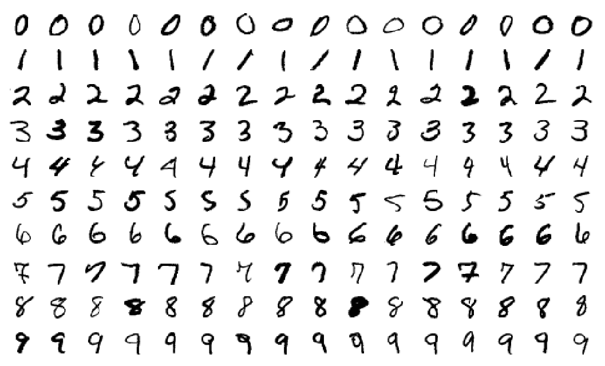
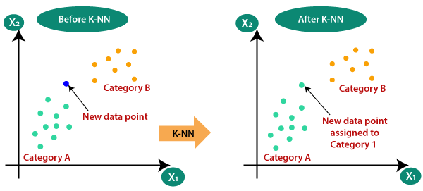
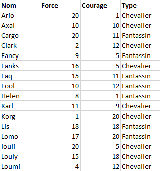
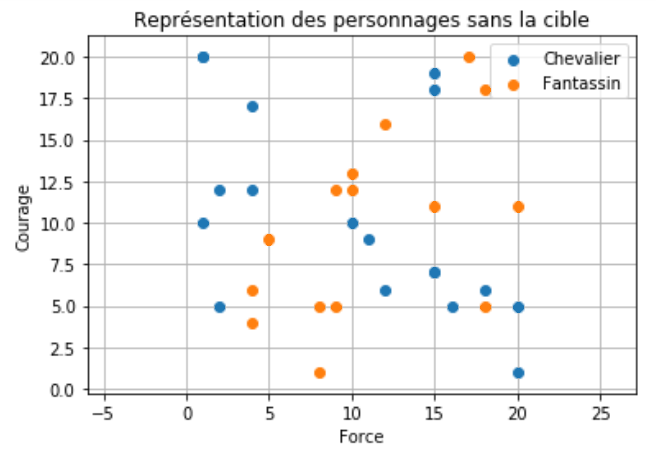
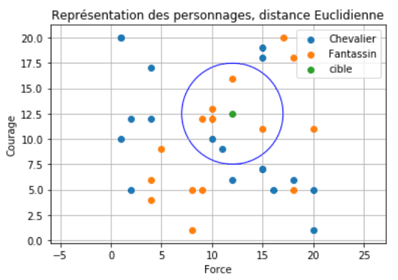
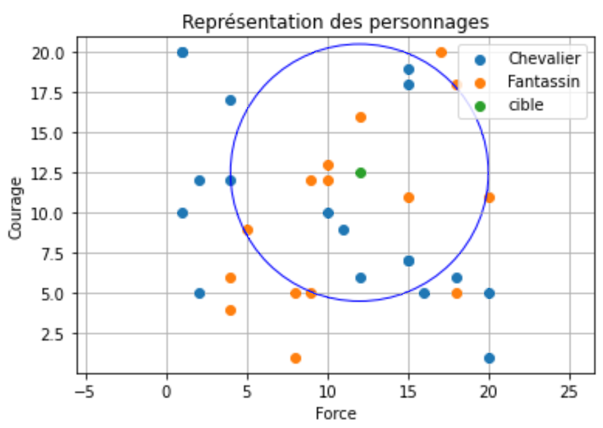

# <center><div class = "titre1">Algorithme des k plus proches voisins</div></center>

## <div class = "encadré2">__Introduction__</div>

L’algorithme des __$k$ plus proches voisins__ (en anglais : *$k$ Nearest Neighbors – __$k$-NN__*) appartient à la famille des [algorithmes d’apprentissage automatique](https://fr.wikipedia.org/wiki/Apprentissage_automatique){. target="_blank"} (*Machine Learning*) qui constituent le poumon de l'intelligence artificielle actuellement.
<span style="display: block; margin: 10px 0 0 0;">Pour simplifier, l'apprentissage automatique part souvent de données (*data*) et essaye de dire quelque chose des données qui n'ont pas encore été vues : il s'agit de généraliser, de prédire.</span>

!!! castle "__Un peu d'histoire__"
    L’idée d’apprentissage automatique ne date pas d’hier, puisque le terme de *Machine Learning* a été utilisé pour la première fois par l’informaticien américain [Arthur Samuel](https://fr.wikipedia.org/wiki/Arthur_Samuel){. target="_blank"} en 1959.
    <span style="display: block; margin: 10px 0 0 0;">Les algorithmes d’apprentissage automatique ont connu un fort regain d’intérêt au début des années 2000 notamment grâce à la grande quantité de données disponibles sur Internet (on parle de "*big data*").</span>

!!! remarque "__Remarque__"
    De nombreuses sociétés (par exemple les GAFAM) utilisent les données concernant leurs utilisateurs afin de « nourrir » des algorithmes de machine learning qui permettront à ces sociétés d’en savoir toujours plus sur chaque utilisateur et ainsi de mieux cerner ses « besoins » en termes de consommation.
    <span style="display: block; margin: 10px 0 0 0;">L’algorithme des $k$ plus proches voisins est par exemple utilisé par Amazon, Netflix, Spotify ou iTunes afin de prévoir si vous seriez ou non intéressés par un produit donné en utilisant vos données et en les comparant à celles des clients ayant acheté ce produit particulier.</span>

## <div class = "encadré2">__Algorithme k-NN__</div>

### <div class = "encadré3">__Principe__</div>

Son principe peut être résumé par cette phrase : 

> *Dis-moi qui sont tes amis et je te dirai qui tu es.*

L’algorithme des __$k$ plus proches voisins__ est un algorithme d’apprentissage supervisé : il est nécessaire d’avoir des __données labellisées__ qui servent à l’apprentissage et à la mesure de qualité des prédictions. À partir de cet ensemble de données labellisées, __il sera possible de classer (déterminer le label) d’une nouvelle donnée__.

??? tip "__Le Data Labeling__"
    Le *Data Labeling* ou étiquetage des données est une étape indispensable du *Machine Learning*. Pour entraîner une IA à partir de données, il est impératif d’étiqueter ces données au préalable. 
    <span style="display: block; margin: 10px 0 0 0;">À l’aide de divers outils, on assigne des étiquettes aux données. C’est ce qui permettra ensuite à l’ordinateur d’apprendre à reconnaître les différentes catégories, et à les distinguer.</span>
    <span style="display: block; margin: 10px 0 0 0;">La personne chargée d’étiqueter les données est appelée « human-in-the-loop  » (humain dans la boucle) : c’est le *Data Labeler*. Ses étiquettes permettent à la machine d’identifier les éléments présentés par les données.</span>

!!! example "Exemple"
    { .image width=40%}
    <center>*La base de données [MNIST](https://fr.wikipedia.org/wiki/Base_de_donn%C3%A9es_MNIST){. target="_blank"}*</center>

### <div class = "encadré3">__Classification__</div>

Le jeu de données doit :
<div class="couleur_puce17" markdown="1">

* posséder une ou plusieurs caractéristiques ;
* un label pour chaque donnée.

</div>
Dans l’exemple ci-dessous, les caractéristiques sont $\operatorname{X_1}$ et $\operatorname{X_2}$ et les labels sont $\operatorname{A}$ et $\operatorname{B}$.

{ .image width=70%}

<span style="display: block; margin: 30px 0 0 0;">On ajoute un nouveau point (en bleu) dont on ne connait pas le label.</span>
<span style="display: block; margin: 5px 0 0 0;">L’algorithme $k$-NN va lui attribuer un label, en utilisant les données précédentes.</span>
<span style="display: block; margin: 5px 0 0 0;">Le point se voit attribuer la catégorie $\operatorname{A}$.</span>

### <div class = "encadré3">__Exemple__</div>

Dans cette exemple, nous considérons un jeu de données constitué de la façon suivante :
<div class="couleur_puce17" markdown="1">

- les données sont réparties suivant deux types : le type 1 et le type 2 ;
- les données n'ont que deux caractéristiques : caractéristique 1 et caractéristique 2.

</div>
Imaginez la situation suivante dans un jeu :
<div class="couleur_puce17etoi" markdown="1">

- il existe deux types de personnages : les fantassins (type 1 : "fantassin") et les chevaliers (type 2 : "chevalier") ;
- il existe deux types de caractéristiques : la force (caractéristique 1 : nombre entre $0$ et $20$) et le courage (caractéristique 2 : nombre entre $0$ et $20$) ;
- vous disposez d'une collection de personnages dont vous connaissez les caractéristiques et le type.

</div>
Vous introduisez un nouveau personnage dont vous ne connaissez pas le type mais dont vous possédez les caractéristiques.
<span style="display: block; margin: 5px 0 0 0;">Le but de l'algorithme $k$-NN est de déterminer le type de ce nouveau personnage.</span>
<span style="display: block; margin: 10px 0 0 0;">Les données sont stockées dans un fichier csv téléchargeable : [fichier csv à télécharger](documents/personnages.csv)</span>
<span style="display: block; margin: 10px 0 0 0;">Voici un aperçu des données :</span>

{ .image width=40%}

Voici une représentation de ces données : 

{ .image width=60%}

<span style="display: block; margin: 30px 0 0 0;">Nous introduisons une nouvelle donnée (appelée cible dans notre exemple) avec ses deux caractéristiques : une force de $12$ et un courage de $12,5$.</span>
<span style="display: block; margin: 10px 0 0 0;">Dans un premier temps, il faut fixer le nombre de voisins.</span>
<span style="display: block; margin: 10px 0 0 0;">Nous allons procéder de manière empirique et tester notre algorithme avec deux valeurs de $k$ : $k = 7$ puis $k = 13$.</span>

#### <div class = "encadré4">__Situation 1 : k = 7__</div>
 
Voici une nouvelle représentation avec la cible et la recherche des 7 voisins les plus proches proches, ceux qui se trouvent dans le cercle bleu :

{ .image width=60%}

<span style="display: block; margin: 30px 0 0 0;">On remarque ici que pour $k = 7$, notre cible est entourée de 5 fantassins et de 2 chevaliers ainsi, selon l'algorithme des $k$-NN, elle serait du type __fantassin__.</span>

#### <div class = "encadré4">__Situation 2 : k = 13__</div>

Voici une nouvelle représentation avec la cible et la recherche des 13 voisins les plus proches proches, ceux qui se trouvent dans le cercle bleu :

{ .image width=60%}

<span style="display: block; margin: 30px 0 0 0;">On remarque ici que pour $k = 13$, notre cible est entourée de 6 fantassins et de 7 chevaliers ainsi, selon l'algorithme des $k$-NN, elle serait du type __chevalier__.</span>

### <div class = "encadré3">__Choix du k__</div>

Les valeurs $k = 7$ et $k = 13$ sont ici des choix arbitraires. On remarque que le choix du $k$ influe sur le résultat.
<span style="display: block; margin: 10px 0 0 0;">La valeur de $k$ doit néanmoins être choisie judicieusement : trop faible, la qualité de la prédiction diminue ; trop grande, la qualité de la prédiction diminue aussi.</span>
<span style="display: block; margin: 10px 0 0 0;">Il suffit d'imaginer qu'il existe une classe prédominante en nombre. Avec une grande valeur de $k$, cette classe remporterait la prédiction à chaque fois.</span>

### <div class = "encadré3">__L'algorithme__</div>

Pour prédire la classe d’un nouvel élément, il faut des données :
<div class="couleur_puce17" markdown="1">

* un échantillon de données ;
* un nouvel élément dont on connaît les caractéristiques et dont on veut prédire le type ;
* la valeur de $k$ : le nombre de voisins étudiés.

</div>
Une fois ces données modélisées, nous pouvons formaliser l'algorithme de la façon suivante :
<div class="list15_1" markdown="1">

1. Trouver, dans l’échantillon, les $k$ plus proches voisins de l'élément à déterminer.
2. Parmi ces proches voisins, trouver la classification majoritaire.
3. Renvoyer la classification majoritaire comme type cherché de l'élément.

</div>
Ce qui nous donne l'algorithme naïf suivant :

!!! code "Algorithme naïf"
    ```Bash
    Données :

     * une table de données de taille n ;
     * une donnée cible ;
     * un entier k plus petit que n ;
     * une règle permettant de calculer la distance entre deux données.

    Algorithme permettant d'obtenir les k plus proches voisins :

     ◍ trier les données de la table selon la distance croissante avec la donnée cible ;
     ◍ créer la liste des k premières données de la table triée ;
     ◍ renvoyer la classe majoritaire dans cette liste.

    ```

??? outil "Complexité"

    Intéressons-nous à la complexité de cet algorithme. Le résultat sera décevant !
    <span style="display: block; margin: 10px 0 0 0;">Afin de calculer les distances, un parcourt du tableau suffit : $~\mathcal{O}(n)$</span>
    <span style="display: block; margin: 10px 0 0 0;">Mais, comme on décide de converver les $k$ plus proches… on pourrait être tenté de trier et la complexité deviendrait $\mathcal{O}(n\operatorname{log_{2}}(n))$ ou pire, $\mathcal{O}(n^2)$</span>
    <span style="display: block; margin: 10px 0 0 0;">Et si on utilisait un des tris étudiés cette année ?</span>
    <span style="display: block; margin: 10px 0 0 0;">C’est une mauvaise idée, on peut parfaitement déterminer les plus proches en un seul parcours. À chaque fois qu’on rencontre une donnée plus proche, on l’insère dans la liste à sa place.</span>
    <span style="display: block; margin: 10px 0 0 0;">Ainsi la complexité devient $\mathcal{O}(k \times n)$, mais $k$ étant constant : $\mathcal{O}(n)$
    <span style="display: block; margin: 10px 0 0 0;">L’algorithme des $k$ plus proches voisins, bien implanté, est __linéaire en la taille des données__.</span>
    
### <div class = "encadré3">__ Apprentissage__</div>

Contrairement à de nombreux algorithmes plus complexes, la phase d’apprentissage est immédiate. Il suffit de découper notre jeu de données initiales (labellisées) en deux lots. Le premier servira à *apprendre*, le second à *tester*.
<span style="display: block; margin: 10px 0 0 0;">La phase de test permet de mesurer la qualité des prédictions contre des données pour lesquelles on connait déjà la classe.</span>

### <div class = "encadré3">__La distance__</div>

La notion de distance est un élément central de cet algorithme. Voici quelques distances possibles :

!!! exemple2 "Exemples"

    === "__La distance euclidienne__"
        Soit deux données $\operatorname{l_1}$ et $\operatorname{l_2}$ de coordonnées respectives $(x_1, y_1)$ et $(x_2, y_2)$ dans un repère __orthonormé__.

        <center>$\operatorname{distance}(\operatorname{l_1}, \operatorname{l_2})=\sqrt{(x_1−x_2)^2+(y_1−y_2)^2}$</center>

    === "__La distance de Manhattan__"
        Soit deux données $\operatorname{l_1}(x_1, y_1)$ et $\operatorname{l_2}(x_2, y_2)$.

        <center>$\operatorname{distance}(\operatorname{l_1}, \operatorname{l_2})=|x_1−x_2|+|y_1−y_2|$</center>

    === "__La distance de Tchebychev__"

        Soit deux données $\operatorname{l_1}(x_1, y_1)$ et $\operatorname{l_2}(x_2, y_2)$.

        <center>$\operatorname{distance}(\operatorname{l_1}, \operatorname{l_2})=max(|x_1−x_2|, |y_1−y_2|)$.
