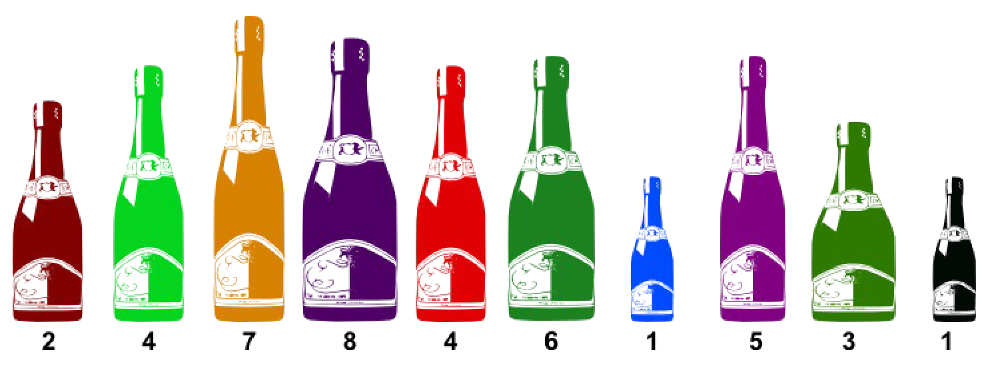
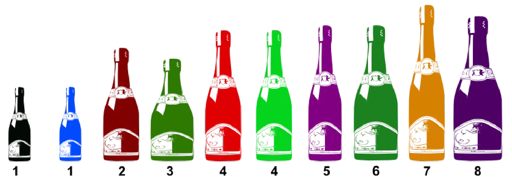
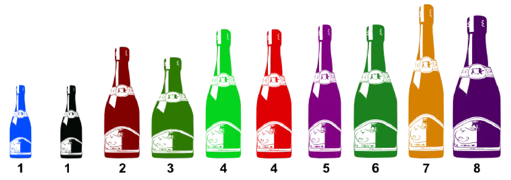
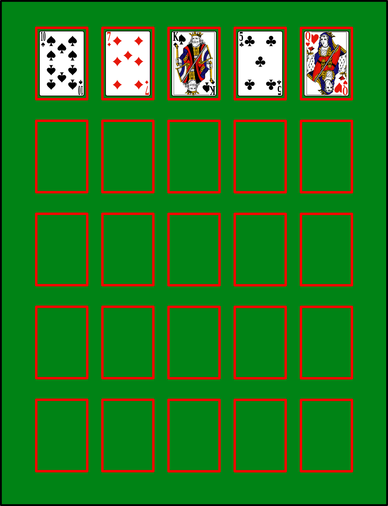
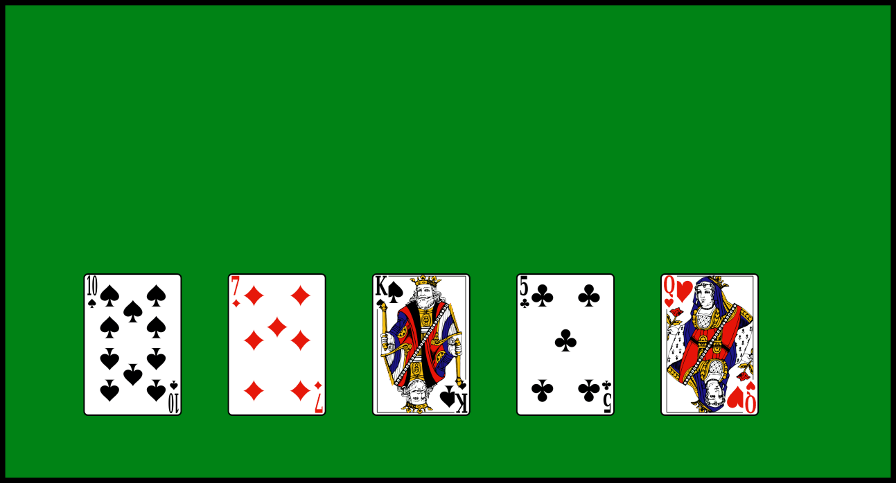
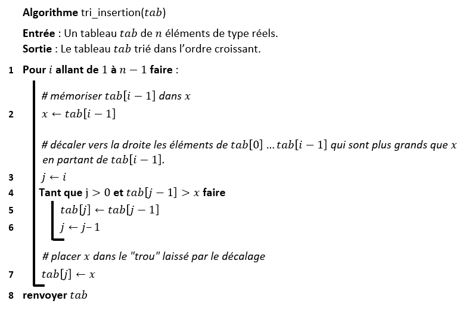
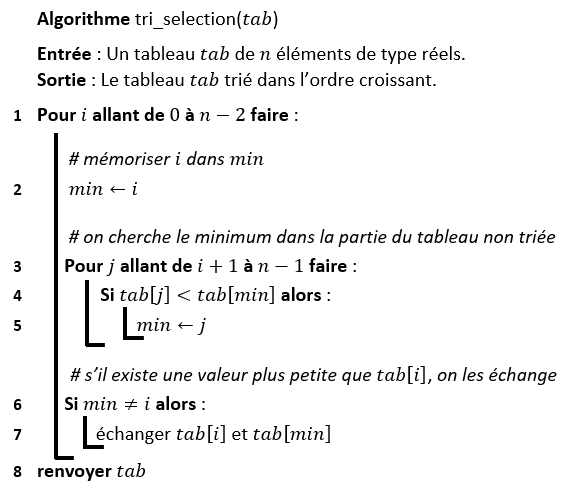
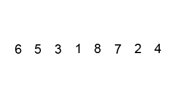
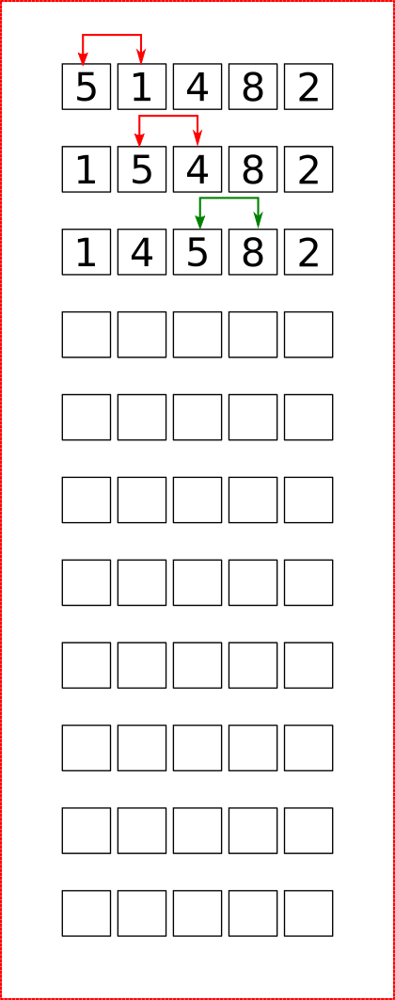

# <center><div class = "titre1">Premiers algorithmes de tri</div></center>

## <div class = "encadré2">__Introduction__</div>

??? wiki1 "Un peu d'histoire"
    <div style="display: block; margin: 0 0 0 0;">

    !!! logo inline end "$~~~~$ Betty Holberton $~~~~~$  $~~$(1917-2001) $~~~~~$ $~~~~~$Informaticienne"
        <span style="display: block; margin: 0 0 0 0;">
        {: .center .image}
        </span>

    </div>
    <div style="display: block; margin: 0px 0 0 0;">

    Betty Holberton est connue pour avoir été l’une des six programmatrices originelles de l’ENIAC, le premier ordinateur électronique.
    <span style="display: block; margin: 10px 0 0 0;">Lors de son premier jour de cours à l’université de Pennsylvanie, son professeur de maths lui demande si elle ne serait pas mieux à la maison à élever des enfants. Cela la pousse à continuer ses études en mathématiques, tout en choisissant le journalisme comme option majeure (le journalisme était l’un des seuls domaines ouverts aux femmes en 1940).</span>
    <span style="display: block; margin: 10px 0 0 0;">Pendant la Seconde Guerre Mondiale, elle est embauchée par la Moore School of Electrical Engineering en tant que calculatrice. Elle est vite choisie pour être l’une des six programmatrices de l’ENIAC, avec Kay McNulty, Marlyn Wescoff, Ruth Lichterman, Betty Jean Jennings, et Fran Bilas. Elle y développe le premier code de construction, __la première routine de tri__ et la première application logicielle.</span>
    <span style="display: block; margin: 10px 0 0 0;">Après la guerre, en 1959, elle est nommée directrice de la branche Recherche en Programmation du David Taylor Model Basin, laboratoire de mathématiques appliquées. Elle participe également à développer l’Univac (la division informatique de Remington Rand).</span>
    <span style="display: block; margin: 10px 0 0 0;">En 2001, celle qui est considérée comme la pionnière du logiciel par Donald E. Knuth meurt d’une maladie cardiaque à l’âge de 84 ans.</span>
    <span style="display: block; text-align: right;">*source : Wikipedia*</span>

    </div>

### <div class = "encadré3">__Pourquoi trier ?__</div>

<span style="display: block; margin: 10px 0 0 0;">Le __"tri"__ est l’opération consistant à ordonner un ensemble d'éléments.</span>
<span style="display: block; margin: 10px 0 0 0;">Les algorithmes de tri ont une grande importance pratique. Ils sont fondamentaux dans certains domaines, comme l'informatique de gestion où l'on tri de manière quasi-systématique des données avant de les utiliser.</span>
<span style="display: block; margin: 10px 0 0 0;">L'étude du tri est également intéressante en elle-même car il s'agit sans doute du domaine de l'algorithmique qui a été le plus étudié et qui a conduit à des résultats remarquables sur la construction d'algorithmes et l'étude de leur complexité.</span>

### <div class = "encadré3">__Stabilité des algorithmes de tri__</div>

On dit qu'un algorithme de tri est __stable__ s'il ne modifie pas l'ordre initial des clés identiques.
<span style="display: block; margin: 10px 0 0 0;">Par exemple, imaginez que vous vouliez trier la collection de bouteilles ci-dessous par ordre de volume (le volume est indiqué sous la bouteille) :</span>

{: .center .image width=80%}

<span style="display: block; margin: 35px 0 0 0;">Si vous obtenez ceci, alors votre tri n'était pas stable :</span>

{: .center .image width=80%}

<span style="display: block; margin: 35px 0 0 0;">En effet, la bouteille noire de volume 1 se trouve maintenant avant la bouteille bleue de même volume alors qu'elle devrait être après. Il en est de même pour les deux bouteilles de volume 4 qui sont inversées par rapport à l'ordre initial.</span>
<span style="display: block; margin: 10px 0 0 0;">Avec un tri stable, on aurait obtenu :</span>

{: .center .image width=80%}

<span style="display: block; margin: 35px 0 0 0;">L'intérêt d'un tri stable est qu'on peut appliquer ce tri successivement, avec des critères différents.</span>
<span style="display: block; margin: 10px 0 0 0;">Imaginez, par exemple, que dans le cadre d'une campagne de prévention, vous vouliez trier une liste de personnes en fonction de la catégorie d'âge. Vous obtenez une liste avec les personnes les plus âgées en premier. Si maintenant, vous voulez re-trier cette liste en fonction du poids, par exemple, vous aurez, si l'algorithme de tri est stable, les personnes les plus lourdes en premier et, pour les personnes de même poids, celles qui sont les plus âgées en premier. Ce qu'un algorithme non-stable ne garantirait pas.</span>

### <div class = "encadré3">__Tri en place__</div>

Un tri est dit en place s’il n’utilise qu’un nombre très limité de variables et qu’__il modifie directement la structure qu’il est en train de trier__. Ceci nécessite l’utilisation d’une structure de donnée adaptée (un tableau par exemple). Aucune copie n'est réalisée. Ce caractère peut être très important si on ne dispose pas de beaucoup de mémoire.

### <div class = "encadré3">__Trier de manière naturelle : les algorithmes naïfs__</div>

!!! exercice "Trier à la main"
    === "Enoncé"
        On donne une main de 5 cartes d'un jeu de 54 cartes.
        <span style="display: block; margin: 10px 0 0 0;">Trier les cartes par ordre croissant, sans tenir compte des couleurs.</span>
        <span style="display: block; margin: 10px 0 0 0;">Vous devrez marquer dans le tableau suivant l'ensemble des changements de positions des cartes dans votre main :</span>

        {: .center .image width=50%}

        <span style="display: block; margin: 35px 0 0 0;">Avez-vous tous utilisé la même méthode ?</span>

    === "Solution 1"
        {: .center .image width=80%}

    === "Solution 2"
        {: .center .image width=80%}


## <div class = "encadré2">__Le tri par insertion__</div>

Le tri par insertion est le tri que la majorité des joueurs de cartes occasionnels pratiquent intuitivement.
<span style="display: block; margin: 10px 0 0 0;">Il consiste à «traiter» toutes les cartes dans l’ordre découlant de la donne, le «traitement» se résumant, pour chaque carte, à l’insérer au bon endroit dans l’ensemble des cartes déjà triées.</span>

!!! clock1 "Principe"
    Le principe du tri par insertion est assez naturel. On prend les cartes une par une en commençant par la première.
    <div class="couleur_puce30etoi">

    * Au départ la première est supposée à sa place. On regarde la deuxième et on compare à la première, on échange si besoin. Les deux premières cartes sont donc rangées dans l'ordre.
    * On regarde la troisième, on compare aux précédentes en partant de la plus proche de celle-ci et on échange si l'ordre n'est pas bon. Si l'on n'échange pas cela signifie que l'on peut passer à la carte suivante. Maintenant les 3 premières cartes sont rangées.
    * On regarde la 4<sup>ème</sup> carte et on la fait ainsi descendre à la position qui lui correspond...les 4 premières cartes sont rangées.
    * On poursuit ainsi jusque la dernière carte.

    </div>
    {: .center width=50%}

!!! pseudo "pseudo-code"
    <span style="display: block; margin: 0 0 20px 0;">Pseudo-code de l'algorithme présenté :</span>
    {: .center .image width=75%}

??? remarque "Remarques"
    Le tri par insertion est un tri :
    <div class="couleur_puce31etoi">

    * __stable__ (conservant donc l'ordre d'apparition des éléments égaux);
    * __en place__ (l'algorithme n'utilise pas de tableau auxiliaire);
    * __online__, c'est-à-dire que l'algorithme peut recevoir la liste à trier élément par élément sans perdre en efficacité contrairement à un tri offline qui requiert que l'intégralité de la liste à trier soit fournie avant qu'il puisse commencer à la trier.

    </div>

!!! exercice {{exercice(False, prem=0)}}
    Implémenter en Python une fonction de signature `#!python tri_insertion(tab: list) -> list`

??? outil "Complexité"
    Calculons la complexité du tri par insertion.
    <span style="display: block; margin: 10px 0 0 0;">Dans le pire cas, on fait toutes les comparaisons, autrement dit, le tableau est initialement trié dans l'ordre décroissant.
    </span>
    <span style="display: block; margin: 10px 0 0 0;">Dans cet algorithme, on a :</span>
    <div class="couleur_puce1" markdown="1">

    * Calcul de la longueur d'une liste
    * Itération d'un entier
    * Opération arithmétique 
    * Accès à un élément de tableau
    * Affectations d'un réel
    * Comparaison de deux réels
    * Renvoi d'une valeur en fin d'algorithme

    </div>
    On compte pour chaque ligne le nombre de fois où chaque opération est effectuée :

    | Ligne | Calcul longueur| Itération | Opération <br> arithmétique | Accès <br>tableau  |Affectation <br> de réels |  Comparaison <br> de réels   |Renvoi de valeur|
    | :---: | :---------: | :-------------:| :--------:| :-------------:| :---------------:| :--------------:| :--------------:|
    | 1     | $1$           |  $n-1$              |           |              |                  |                 |               $\,\,\,\,\,\,\,\,\,\,\,\,\,\,\,\,\,\,\,\,\,\,\,\,\,\,\,\,\,\,$   |
    | 2     |             |               |   $n-1$   |       $n-1$         |        $n-1$          |                 |                 |
    | 3     |             |                |           |          |      $n-1$       |                 |                 |
    | 4     |       |                |     $\displaystyle\frac{n(n+1)}{2}-1$       |    $\displaystyle\frac{n(n+1)}{2}-1$    |                  |       $n(n+1)-2$          |                 |
    | 5     |             |                |   $\displaystyle\frac{(n-1)n}{2}$         |         $(n-1)n$        |          $\displaystyle\frac{(n-1)n}{2}$         |                |                 |
    | 6     |             |                |   $\displaystyle\frac{(n-1)n}{2}$         |                |          $\displaystyle\frac{(n-1)n}{2}$         |                |                 |
    | 7     |             |                |       |     $n-1$           |          $n-1$        |                |                 |
    | 8     |             |                |       |               |                |                |            $1$     |
    | Total |      $1$    |       $n-1$        | $\displaystyle\frac{3}{2}n^2+\displaystyle\frac{1}{2}n-2$      |   $\displaystyle\frac{3}{2}n^2+\displaystyle\frac{3}{2}n-3$      |     $n^2+2n-3$        |      $n^2+n-2$         |          $1$       |

    Ainsi, le temps d'exécution de cet algorithme au pire des cas est $5n^2+6n-9$. 
    <span style="display: block; margin: 10px 0 0 0;">La fonction de complexité du tri par insertion est un polynôme du second de degré. </span>
    <span style="display: block; margin: 10px 0 0 0;">La complexité de cet algorithme est donc __quadratique__.</span>

## <div class = "encadré2">__Le tri par sélection__</div>

!!! clock1 "Principe"
    
    Sur un tableau de $n$ éléments (numérotés de $0$ à $n−1$), le principe du tri par sélection est le suivant :
    <div class="couleur_puce30etoi">

    * Rechercher le plus petit élément du tableau, et l’échanger avec l’élément d’indice $0$.
    * Rechercher le second plus petit élément du tableau, et l’échanger avec l’élément d’indice $1$.
    * Continuer de cette façon jusqu’à ce que le tableau soit entièrement trié.   

    </div>
    {: .center width=50%}

!!! pseudo "pseudo-code"
    <span style="display: block; margin: 0 0 20px 0;">Pseudo-code de l'algorithme présenté :</span>
    {: .center .image width=60%}

??? remarque "Remarques"
    <div class="couleur_puce31">

    * Il existe une variante qui consiste à procéder de façon symétrique, en plaçant d'abord le plus grand élément à la fin, puis le second plus grand élément en avant-dernière position, etc.
    * Le tri par sélection est un tri :

    </div>
    <div class="couleur_puce31etoi_decal">

    * __instable__ par défaut (mais peut être rendu stable) ;
    * __en place__ ;
    * __offline__, puisque l'algorithme doit recevoir l'intégralité de la liste à trier avant qu'il puisse commencer à la trier.

    </div>

!!! exercice {{exercice(False)}}
    Implémenter en Python une fonction de signature `#!python tri_selection(tab: list) -> list`

??? outil "Complexité"
    Calculons la complexité du tri par sélection.
    <span style="display: block; margin: 10px 0 0 0;">Dans le pire cas, on effectue le plus d'affectations possibles, autrement dit, le tableau est initialement trié dans l'ordre décroissant.
    </span>
    <span style="display: block; margin: 10px 0 0 0;">Dans cet algorithme, on a :</span>
    <div class="couleur_puce1" markdown="1">

    * Calcul de la longueur d'une liste
    * Itération d'un entier
    * Opération arithmétique 
    * Accès à un élément de tableau
    * Affectations d'un réel
    * Comparaison de deux réels
    * Renvoi d'une valeur en fin d'algorithme

    </div>
    On compte pour chaque ligne le nombre de fois où chaque opération est effectuée :

    | Ligne | Calcul longueur| Itération | Opération <br> arithmétique | Accès <br>tableau  |Affectation <br> de réels |  Comparaison <br> de réels   |Renvoi de valeur|
    | :---: | :---------: | :-------------:| :--------:| :-------------:| :---------------:| :--------------:| :--------------:|
    | 1     | $1$           |  $n-1$              |      $1$     |              |                  |                 |      $\,\,\,\,\,\,\,\,\,\,\,\,\,\,\,\,\,\,\,\,\,\,\,\,\,\,\,\,\,\,$           |
    | 2     |             |               |     |               |        $n-1$          |                 |                 |
    | 3     |             |       $\displaystyle\frac{(n-1)n}{2}$         |           |          |             |                 |                 |
    | 4     |       |                |            |    $(n-1)n$    |                  |       $\displaystyle\frac{(n-1)n}{2}$          |                 |
    | 5     |             |                |           |              |           $\displaystyle\frac{(n-1)n}{2}$          |                |                 |
    | 6     |             |                |            |                |                   |          $n-1$       |                 |
    | 7     |             |                |       |           $4(n-1)$    |           $3(n-1)$    |                |                 |
    | 8     |             |                |       |               |                |                |            $1$     |
    | Total |      $1$    |      $\displaystyle\frac{1}{2}n^2+\displaystyle\frac{1}{2}n-1$        | $1$      |    $n^2+3n-4$      |     $\displaystyle\frac{1}{2}n^2+\displaystyle\frac{7}{2}n-4$       |      $\displaystyle\frac{1}{2}n^2+\displaystyle\frac{1}{2}n-1$      |          $1$       |

    Ainsi, le temps d'exécution de cet algorithme au pire des cas est  $\displaystyle\frac{5}{2}n^2+\displaystyle\frac{15}{2}n-7$. 
    <span style="display: block; margin: 10px 0 0 0;">La fonction de complexité du tri par sélection est un polynôme du second de degré. </span>
    <span style="display: block; margin: 10px 0 0 0;">La complexité de cet algorithme est donc __quadratique__.</span>

## <div class = "encadré2">__Un autre algorithme de tri : le tri à bulle__</div>

!!! clock1 "Principe"
    
    L'algorithme de tri à bulles consiste à trier la liste en n'autorisant qu'à intervertir deux éléments consécutifs de la liste. On peut le décrire comme ceci:
    <div class="couleur_puce30etoi">

    * Parcourir tout le tableau et comparer les éléments consécutifs.
    * Lorsque deux éléments sont dans le désordre, les inverser.
    * Une fois la fin du tableau, recommencer.
    * S'arrêter dès qu'un parcours du tableau n'a échangé aucun élément.

    </div>
    {: .center width=50%}

!!! exercice {{exercice(False, niveau=2)}}
    <span style="display: block; margin: 0 0 20px 0;">

    - [ ] Effectuer le tri à bulle du tableau `#!python [5, 1, 4, 8, 2]`.

    </span>
    {: .center width=30%}


    - [ ] Pourquoi, à votre avis, appelle-t-on ce tri un « tri à bulle » ?
    - [ ] Quelle propriété a-t-on après un parcours complet d'un tableau ?
    - [ ] Ecrire un algorithme représentant un tri à bulle.
    - [ ] Quelle est la complexité de cet algorithme ?
    - [ ] Implémenter une fonction python de signature `#!python tri_bulle(tab: list) -> list`.

## <div class = "encadré2">__Les tris fournis par Python__</div>

Il existe d’autres algorithmes de tris et certains sont (beaucoup) plus efficaces (leur coût
est de l’ordre de $n\operatorname{log_{2}}(n)$ qui est inférieur à $n^2$).
<span style="display: block; margin: 10px 0 0 0;">Python fournit notamment des fonctions permettant de trier de manière plus efficace un itérable.</span>

### <div class = "encadré3">__La méthode <span class="roboto">sort()</span>__</div>

Python trie les tableaux avec la méthode `#!python list.sort()` (tri en place, le tableau est mis à jour) :

```pycon
>>> tableau = [3, 4, 0, 2, 1]

>>> tableau.sort()

>>> tableau
[0, 1, 2, 3, 4]

```

!!! remarque "Remarque"
    Il faut toutefois que les éléments du tableau soient comparables les uns avec les autres.
    <span style="display: block; margin: 10px 0 0 0;">Par exemple, les `#!python str` et les `#!python int` sont deux types comparables, Python peut évaluer les expressions `#!python 'allo' < 'hello'` et `#!python 3 < 5`. Les tableaux `#!python ['allo', 'hello']` et `#!python [3, 5]` peuvent donc être triés.</span>
    <span style="display: block; margin: 10px 0 0 0;">Par contre, le tableau `#!python ['allo', 'hello', 3, 5]` ne peut pas être trié car `#!python 'allo'` et `#!python 3` ne sont pas comparables.</span>

### <div class = "encadré3">__La fonction <span class="roboto">sorted</span>__</div>

Il est aussi possible de trier des `#!python list` ou d'autres types de données tels que les `#!python tuple` et les `#!python dict` en utilisant la fonction `#!python sorted`.
<span style="display: block; margin: 10px 0 0 0;">Dans ce cas, Python crée un __nouveau__ tableau contenant les mêmes valeurs que l'argument et le trie.</span>
<span style="display: block; margin: 10px 0 0 0;">La fonction renvoie la __copie triée__, l'argument initial n'est __pas__ modifié.</span>

```pycon
>>> un_tuple = (3, 4, 0, 2, 1)

>>> sorted(un_tuple)
[0, 1, 2, 3, 4]

>>> un_tuple
(3, 4, 0, 2, 1)

```

!!! warning "__Attention__"
    Dans le cas ou l'argument est un dictionnaire, `#!python sorted` renvoie le tableau des clés trié dans l'ordre croissant :

    ```pycon
    >>> dictionnaire = {'Nicolas': 30, 'Élodie': 5}

    >>> sorted(dictionnaire)
    ['Nicolas', 'Élodie']
    ```
    On notera au passage que lors de la comparaison des chaînes de caractères, Python compare les codes ASCII de chaque caractère. Ceci explique que `#!python 'É'` (de code `#!python 201`) soit supérieur à `#!python 'N'` (de code `#!python 78`) !

Dans les deux cas il est possible de passer un booléen `#!python reverse` en argument. Si l'on passe `#!python reverse=True`, le tri se fera dans l'ordre décroissant. Par défaut on a `#!python reverse=False` (tri dans l'ordre croissant).

```pycon
>>> tableau = [3, 4, 0, 2, 1]

>>> tableau.sort(reverse=True)

>>> tableau
[4, 3, 2, 1, 0]
```

Si l'on fournit des données structurées à la fonction de tri (des `#!python list` ou des `#!python tuple` par exemple), le tri se fera tout d'abord sur le premier élément de chaque donnée, puis sur le deuxième etc :

```pycon
>>> tableau = [("Alphonse", 100), ("Zélie", 0), ("Alphonse", 50)]

>>> tableau.sort()

>>> tableau
[('Alphonse', 50), ('Alphonse', 100), ('Zélie', 0)]
```

Il peut arriver que l'on souhaite trier le tableau selon un critère particulier.  
C'est le cas par exemple si les données sont des couples de valeurs et que l'on souhaite effectuer le tri sur la seconde valeur de chaque couple.
<span style="display: block; margin: 10px 0 0 0;">Dans ce cas on utilise le mot-clé `#!python key` et l'on passe en argument une fonction qui renvoie la seconde valeur de chaque couple :</span>

<span style="display: block; margin: 10px 0 0 0;">Dans l'éditeur :</span>
```python
def second(couple):
    return couple[1]
```

Dans la console :

```pycon
>>> tableau = [("Alphonse", 100), ("Zélie", 0), ("Alphonse", 50)]

>>> tableau.sort(key=second)

>>> tableau
[('Zélie', 0), ('Alphonse', 50), ('Alphonse', 100)]
```

??? remarque "Remarque"
    L'algorithme de tri utilisé par Python est le *Tim Sort* créé par Tim Peters en 2002. On retrouve cet algorithme dans Java, Javascript, Swift et Rust.
    <span style="display: block; margin: 10px 0 0 0;">Cet algorithme part de l'hypothèse que, dans la majorité des cas, les données à trier comprennent des plages déjà triées.</span>
    <span style="display: block; margin: 10px 0 0 0;">On peut imaginer la situation d'un magasin qui, jour après jour, ajoute ses ventes quotidiennes à un tableau préexistant et le trie. Chaque matin, le tableau initial est trié, seules les valeurs du jour sont à trier.</span>
    <span style="display: block; margin: 10px 0 0 0;">Dans ce cadre, le *Tim Sort* profite des qualités de deux tris étudiés en NSI :</span>
    <div class="couleur_puce31">

    * le tri par insertion est très efficace dans le cas de petits tableaux presque triés mais pas dans le cas de grands tableaux ;
    * le tri fusion est très efficace dans le cas de grands tableaux mais pas pour de petits tableaux.

    </div>
    L'idée principale de ce tri est donc la suivante :
    <div class="couleur_puce31etoi">

    * parcourir le tableau et y repérer des plages déjà triées ou presque ;
    * si besoin, trier ces plages à l'aide du tri par insertion ;
    * fusionner ces plages à l'aide de l'opération de fusion du tri fusion.

    </div>
    Cet algorithme est largement plus efficace que les tris par sélection et par insertion. Trier un tableau d’un million d’éléments, par exemple, est instantané.

## <div class = "encadré2">__Résumé__</div>

!!! resume "Résumé"

    Dans ce chapitre, j'ai appris : 
    
    - [ ] que le __tri par sélection__ et le __tri par insertion__ sont deux algorithmes de tri élémentaires qui peuvent être utilisés pour trier des tableaux ;
    - [ ] que ces deux algorithmes ont un coût quadratique dans le pire cas et qu'ils restent peu efficaces dès que les tableaux contiennent plusieurs milliers d’éléments ;
    - [ ] qu'il existe de meilleurs algorithmes de tri, plus complexes, dont celui offert par Python avec les fonction `#!python .sort()` et `#!python sorted()` ;
    - [ ] qu'il est possible de trier n'importe quel itérable avec ces deux fonctions selon un critère particulier : il suffit de leur passer en paramètre une fonction clé qui définit les critères de tri souhaité.


