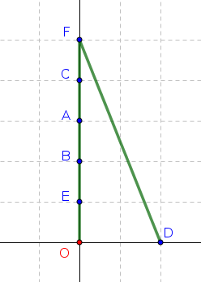
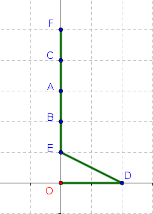

# <center><div class = "titre2">Correction des exercices</div> </center>

### <div class = "encadré_exo"> __Correction de l'exercice 3__ </div>

Voilà ce que donnerait l'algorithme glouton :
{: .center}

### <div class = "encadré_exo"> __Correction de l'exercice 4__ </div>
        
Non ! Celui ci-dessous est meilleur :
{: .center}

<span style="display: block; margin: 30px 0 0 0;">Le fait d'avoir privilégié à chaque étape le meilleur choix local nous a empêché de voir le meilleur choix global.</span>

### <div class = "encadré_exo"> __Correction de l'exercice 5__ </div>
   
```python
def rendu(somme_a_rendre):
    pieces = [200, 100, 50, 20, 10, 5, 2, 1]
    solution = []
    i =  0   # (1)
    while somme_a_rendre > 0:
        if pieces[i] <= somme_a_rendre: # (2) 
            solution.append(pieces[i])   # (3) 
            somme_a_rendre = somme_a_rendre - pieces[i] # (4)
        else:
            i += 1   # (5) 
    return solution
```

1. On part du 1er indice -> la plus grande pièce
2. Est-ce que la pièce peut être rendue ?
3. On garde la pièce dans la liste `#!python solution`
4. On met à jour la somme à rendre.
5. La pièce était trop grosse, on avance dans la liste.

### <div class = "encadré_exo"> __Correction de l'exercice 6__ </div>

```pycon
>>> rendu(63)
[50, 2, 2, 2, 2, 2, 2, 1]
```

😭 Mais ce n'est pas une solution optimale ! `#!python [20, 20, 20, 2, 1]` serait bien mieux.

### <div class = "encadré_exo"> __Correction de l'exercice 7__ </div>
    
=== "Stratégie 1"
    La statégie 1 (choix par valeur décroissante) donne le sac $\{\operatorname{F}, \operatorname{B}\}$ d'une valeur de $11800$ €.

=== "Stratégie 2"
    La stratégie 2 (choix par masse croissante) donne le sac $\{\operatorname{C}, \operatorname{D}, \operatorname{B}, \operatorname{A}\}$ d'une valeur de $10300$ €.
       
=== "Stratégie 3"
    Pour la stratégie 3 (choix par rapport $\displaystyle\frac{\operatorname{valeur}}{\operatorname{masse}}$ décroissant) il faut d'abord calculer les rapports en question pour chaque objet (donnés dans le tableau ci-dessous). 

    | objet  |  $\operatorname{A}$  |  $\operatorname{B}$  |  $\operatorname{C}$  |  $\operatorname{D}$  |  $\operatorname{E}$  |  $\operatorname{F}$  |
    |:------:|:---:|:---:|:---:|:---:|:---:|:---:|
    |  $\operatorname{masse}$ (en kg) |  $4$ |  $3$ |  $1$  |  $2$ |  $6$ |  $7$ |
    | $\operatorname{valeur}$ (en €)| $4800$ | $2700$ | $200$ | $2600$ | $7200$ | $9100$ |
    |  $\displaystyle\frac{\operatorname{valeur}}{\operatorname{masse}}$ (en €/kg) |  $1200$ | $900$ | $200$ | $1300$ | $1200$ | $1300$ |
            
    Cette stratégie donne le sac $\{\operatorname{D}, \operatorname{F}, \operatorname{C}\}$ d'une valeur de $11900$ €.