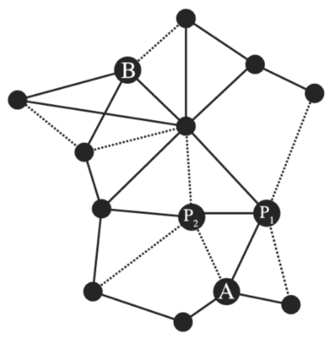
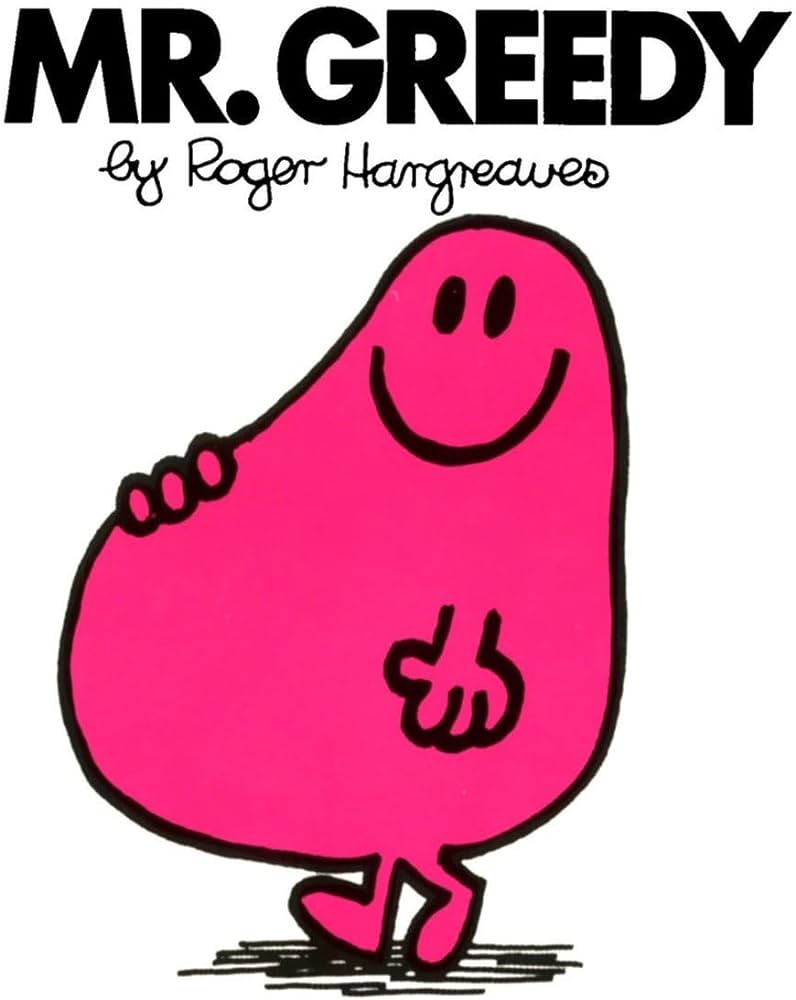
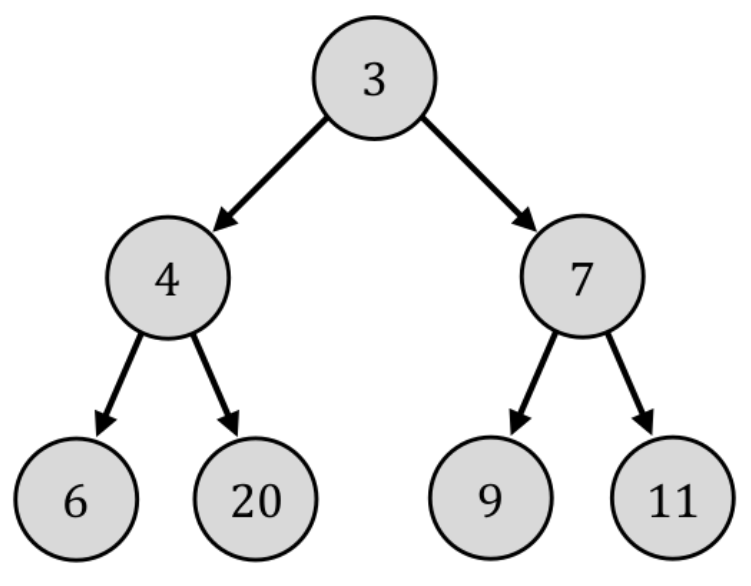
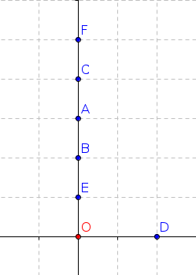
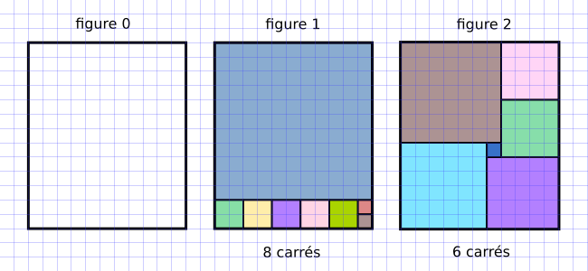
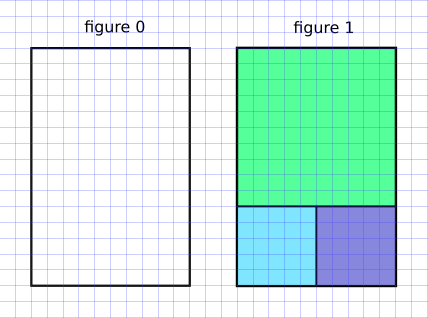
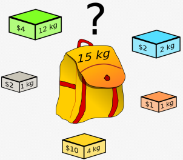

# <center><div class = "titre1">Algorithmes gloutons</div></center>

## <div class = "encadré2">__Introduction__</div>

__Optimiser__ un problème est une des problématiques courantes en informatique. Cela consiste à trouver une solution au problème en maximisant ou minimisant un certain critère.

!!! exemple1 "__Exemple__"
    Prenons un exemple basé sur la carte des grands axes routiers de France présentée ci-dessous. Les autoroutes sont représentées en traits pleins et les autres routes moins rapides en traits pointillées.

    {: .image width=30%}
    <center>*Carte des grands axes routiers de France. Source : Janny, S., et. al. (2022), Informatique tronc commun, Ellipses*</center>
    
    <span style="display: block; margin: 10px 0 0 0;">On veut trouver le « meilleur chemin » entre les points $A$ et $B$. Ce meilleur chemin dépend du critère d’optimalité : veut-on le chemin :</span>
    <div class="couleur_puce32etoi">

    * le plus court (en distance) ?
    * le plus rapide (en temps) ? 

    </div>
    Le plus court passe par le point $P_2~$, mais le plus rapide passe par le point $P_1~$(car il passe par l’autoroute).
    <span style="display: block; margin: 20px 0 0 0;"></span>

La recherche de la solution optimale n’est pas une tache facile.
<span style="display: block; margin: 10px 0 0 0;">Dans l'exemple précédent, une méthode pour trouver le chemin le plus court entre $A$ et $B$ consisterait à énumérer tous les chemins possibles pour ne garder que ceux qui partent de $A$ et arrivent en $B$. On trouve alors le chemin optimale en cherchant le plus court parmi ces derniers.</span>
<span style="display: block; margin: 10px 0 0 0;">En pratique les problèmes à optimiser sont complexes et l’énumération de toutes les combinaisons n’est pas envisageable par __contrainte de temps ou de mémoire__. Il faut donc trouver des astuces pour que cette optimisation soit réalisable concrètement.</span>
<span style="display: block; margin: 10px 0 0 0;">Les algorithmes gloutons, que nous présentons ici, représentent une possibilité dans de nombreuses situations.</span>

## <div class = "encadré2">__Les algorithmes gloutons__</div>

<div style="display: block; margin: 40px 0 40px 150px;" markdown="1">
> <span style="display: flex;"> { .greedy } <span style="display: block; margin: 40px 0 0 10px;">*On dit __greedy algorithms__ en anglais, l'adjectif "greedy" signifiant avare/glouton.*</span></span>
</div>

!!! book1 "Définition"
    Les __algorithmes gloutons__ forment une catégorie d'algorithmes permettant de donner une solution à des problèmes d'optimisation qui visent à maximiser/minimiser une quantité (__plus__ court chemin (GPS), __plus petit__ temps d'exécution, __meilleure__ organisation d'un emploi du temps, etc.)
    <span style="display: block; margin: 10px 0 0 0;">Le principe d'un algorithme glouton est le suivant :</span>
    <div class="couleur_puce33">

    * résoudre un problème étape par étape ;
    * à chaque étape, faire le choix optimal de moindre coût (de meilleur gain).

    </div>

    Le choix effectué à chaque étape n'est jamais remis en cause, ce qui fait que cette stratégie permet d'aboutir rapidement à une solution au problème de départ.
    <span style="display: block; margin: 10px 0 0 0;">C'est en ce sens que l'adjectif *greedy* (glouton/avare) caractérise ces algorithmes : ils terminent rapidement (*glouton*) sans fournir beaucoup d'efforts (*avare*).</span>

La question (presque philosophique) est : 
<span style="display: block; margin: 10px 0 0 0;">*Lorsqu'on fait à chaque étape le meilleur choix possible, est-ce que la solution finale à laquelle on arrive est la meilleure possible ?*</span>
<span style="display: block; margin: 10px 0 0 0;">Formulé autrement :</span>
<span style="display: block; margin: 10px 0 0 0;">*Est-ce que faire le meilleur choix à chaque étape nous assure le meilleur choix global ?*</span>

### <div class = "encadré3">__Exemples d'algorithmes gloutons__</div>

#### <div class = "encadré4">__Une chenille vorace__</div>

Une chenille mangeuse de pucerons se déplace sur l’arbre ci-dessous, du haut vers le bas uniquement. Les nombres sur l’arbre indiquent le nombre de pucerons présents à chaque nœud. La chenille mange tous les pucerons qu’elle rencontre le long de son chemin. Le but de la chenille est évidemment de manger un maximum de pucerons.
{ .image width=30%}
<span style="display: block; margin: 30px 0 0 0;">Le nombre maximum de pucerons qu’elle peut manger en un passage correspond à ce que l’on appelle l’__optimum global du problème__.</span>

!!! exercice {{exercice(False, prem=0)}}
    - [ ] Que vaut l’optimum global sur l’arbre ci-dessus ?

Cependant la chenille est trop gloutonne (autrement dit vorace) pour planifier son trajet et choisit systématiquement, à chaque étape, le nœud présentant le plus grand nombre de pucerons. Ce nombre est ce que l’on appelle l’__optimum local pour cette étape__.

!!! exercice {{exercice(False)}}
    - [ ] Combien de pucerons aura mangé cette chenille gloutonne en un passage sur l’arbre ci-dessus au total ? 
    - [ ] Cela correspond-t-il à l’optimum global ?

!!! remarque  "__Remarque__"
    Le comportement de notre chenille vorace correspond donc au principe d'un algorithme glouton.
    <span style="display: block; margin: 10px 0 0 0;">elle détermine une solution de son problème (qui est de manger le plus possible de pucerons) en effectuant une série de choix optimaux locaux (en choisissant systématiquement le nœud présentant le plus grand nombre de pucerons).</span>
    <span style="display: block; margin: 10px 0 0 0;">Au cours de la construction de cette solution, la chenille résout une partie du problème puis se focalise ensuite sur le sous-problème restant à résoudre. Les choix ne sont donc jamais remis en cause au cours de cette construction.</span>

!!! book2 "__Propriété__"
    Un algorithme glouton ne fournit __pas toujours__ l’optimum global du problème.

#### <div class = "encadré4">__Un plus court chemin ?__</div>

<div class="couleur_puce18" markdown="1">

* Vous partez du point $\operatorname{O}$. 
* Vous devez avoir atteint le plus rapidement possible tous les points $\operatorname{A}$, $\operatorname{B}$, $\operatorname{C}$, $\operatorname{D}$, $\operatorname{E}$, $\operatorname{F}$. 
* L'ordre de parcours des points n'est pas important.

</div>
{: .center}
<span style="display: block; margin: 20px 0 0 0;">La philosophie de l'algorithme glouton implique qu'à chaque étape, vous allez vous diriger vers le point le plus proche.</span>

!!! exercice {{exercice(False)}}
    Quel est alors le parcours final ?

    <center>
    [Correction de l'exercice 3 :material-cursor-default-click:](Correction.md#correction-de-lexercice-3){:target="_blank" .md-button}
    </center>

!!! exercice {{exercice(False)}}
    Ce chemin est-il optimal ?

    <center>
    [Correction de l'exercice 4 :material-cursor-default-click:](Correction.md#correction-de-lexercice-4){:target="_blank" .md-button}
    </center>

#### <div class = "encadré4">__Remplir un rectangle avec des carrés__</div>
*(d'après S.Tummarello et E.Buonocore)*
<span style="display: block; margin: 10px 0 0 0;">On considère un rectangle de dimension 11 sur 13 (figure 0). On veut remplir ce rectangle avec le minimum de carrés.</span>

{: .center}

Un algorithme glouton va chercher à positionner d'abord le plus grand carré possible (figure 1). 
<span style="display: block; margin: 10px 0 0 0;">C'est une stratégie efficace (8 carrés nécessaires), mais qui n'est pas optimale : la figure 2 présente un pavage avec seulement 6 carrés.</span><span style="display: block; margin: 10px 0 0 0;">Encore une fois, la solution gloutonne n'est pas la solution optimale.</span>
<span style="display: block; margin: 10px 0 0 0;">Est-ce qu'un algorithme glouton va **toujours** passer à côté de la solution optimale ?  
Non ! Il arrive *aussi* qu'il donne la solution optimale. Changeons le rectangle initial en un rectangle de 10 sur 15 :</span>

{: .center}

Dans cette situation, l'algorithme glouton nous amène à la solution optimale.

#### <div class = "encadré4">__Conclusion__</div>

Un algorithme glouton est une méthode rapide et souvent efficace, mais qui ne garantit pas l'optimalité de la solution trouvée.
<span style="display: block; margin: 10px 0 0 0;">**La succession de meilleurs choix LOCAUX va nous amener à une *bonne* solution GLOBALE, mais ne nous garantit pas d'arriver à la solution optimale.**</span>

## <div class = "encadré2">__Le problème du rendu de monnaie__</div>

Nous allons travailler avec des pièces (ou billets) de $1, 2, 5, 10, 20, 50, 100, 200$ euros.
<span style="display: block; margin: 10px 0 0 0;">L'objectif est de créer un programme renvoyant, pour une somme `#!python somme_a_rendre` entrée en paramètre, la combinaison utilisant un **minimum** de pièces ou de billets pour fabriquer la somme `#!python somme_a_rendre`.</span>
<span style="display: block; margin: 10px 0 0 0;">Par exemple, lorsque vous payez avec $20$ € un objet coûtant $11$ €, vous préférez qu'on vous rende vos $9$ € de monnaie par $9 = 5 + 2 + 2$ plutôt que par $9=2+2+2+1+1+1$</span>
<span style="display: block; margin: 10px 0 0 0;">La résolution de ce problème peut se faire de manière gloutonne : à chaque étape, vous allez essayer de rendre la plus grosse pièce (ou billet) possible.</span>

### <div class = "encadré3">__Vers l'algorithme de rendu de monnaie__</div>

On veut coder la fonction `#!python rendu` qui prend pour paramètre un entier positif `#!python somme_a_rendre` et qui renvoie la liste des pièces à donner.
<span style="display: block; margin: 10px 0 0 0;">Les pieces disponibles (en quantité illimitée) sont stockées dans une variable `#!python pieces = [200, 100, 50, 20, 10, 5, 2, 1]`.</span>

**Utilisation** :

```pycon
>>> rendu(13)
[10, 2, 1]
>>> rendu(58)
[50, 5, 2, 1]
```

!!! exercice {{exercice(False)}}
    Compléter l'un des codes à trous ci-dessous :

    ??? code "Code à trous ⭐⭐⭐⭐"
        ```python
        def rendu(somme_a_rendre):
            pieces = [200, 100, 50, 20, 10, 5, 2, 1]
            solution = []
            ...
            ...
            ...
            ...
            ...
            ...
            ...  
            return solution                   
        ``` 

    ??? code "Code à trous ⭐⭐⭐" 
        ```python
        def rendu(somme_a_rendre):
            pieces = [200, 100, 50, 20, 10, 5, 2, 1]
            solution = []
            i =  ...     
            while ... > ...:
                if ... <= ...: 
                    ....append(...)     
                    ... = ... - ... 
                else:
                    ... += ...     
            return solution                                
        ``` 

    ??? code "Code à trous ⭐⭐"
        ```python
        def rendu(somme_a_rendre):
            pieces = [200, 100, 50, 20, 10, 5, 2, 1]
            solution = []
            i =  0     
            while ... > ...:
                if pieces[i] <= ...: 
                    solution.append(...)     
                    somme_a_rendre = ... - ... 
                else:
                    ... += ...     
            return solution                              
        ``` 

    ??? code "Code à trous ⭐"
        ```python
        def rendu(somme_a_rendre):
            pieces = [200, 100, 50, 20, 10, 5, 2, 1]
            solution = []
            i =  0     
            while somme_a_rendre > ...:
                if pieces[i] <= somme_a_rendre: 
                    solution.append(...)     
                    somme_a_rendre = ... - ... 
                else:
                    i += 1     
            return solution
                               
        ```

    <center>
    [Correction de l'exercice 5 :material-cursor-default-click:](Correction.md#correction-de-lexercice-5){:target="_blank" .md-button}
    </center>

### <div class = "encadré3">__Une solution optimale ?__</div>

Imaginons qu'il n'y ait plus de pièces de $10$ et $5$ euros.

!!! exercice {{exercice(False)}}
    Faites fonctionner votre algorithme pour la somme de $63$ euros.
    <center>
    [Correction de l'exercice 6 :material-cursor-default-click:](Correction.md#correction-de-lexercice-6){:target="_blank" .md-button}
    </center>

!!! resume "**Moralité**"
    Lors d'un rendu de monnaie, l'algorithme glouton n'est optimal que _sous certaines conditions_, ce qui est un peu décevant.
    <span style="display: block; margin: 10px 0 0 0;">On peut montrer que l’algorithme glouton du rendu de monnaie renvoie une solution optimale pour le système monétaire $\{1, 2, 5, 10, 20, 50, 100, 200\}$.
    <span style="display: block; margin: 3px 0 0 0;">Pour cette raison, un tel système de monnaie est qualifié de **canonique**.</span>
    <span style="display: block; margin: 10px 0 0 0;">Il est difficile de caractériser mathématiquement si un système de monnaie est canonique ou pas.</span>

## <div class = "encadré2">__Le problème du sac à dos__</div>

<div style="display: block; margin: 40px 0 40px 150px;" markdown="1">
> <span style="display: flex;"> { .sac_a_dos } <span style="display: block; margin: 55px 0 0 10px;">*__Knapsack Problem__ en anglais, souvent abrégé KP.*</span></span>
</div>

Le problème est celui-ci : vous disposez d'un sac d'une contenance limitée (sur le dessin ci-dessus, 15kg) dans lequel vous allez mettre des objets qui ont un certain poids et une certaine valeur. 
<span style="display: block; margin: 10px 0 0 0;">**Vous souhaitez maximiser la valeur totale des objets que vous mettez dans votre sac.** </span>
<span style="display: block; margin: 10px 0 0 0;">Evidemment, la somme de leur masse ne doit pas dépasser 15 kg.</span>

Ce problème (de la catégorie des problème dits d'_analyse combinatoire_) malgré sa simplicité est **un problème majeur** d'optimisation.

??? rocket "Où en est-on de la recherche académique sur le problème du sac à dos ?"
    Actuellement :
    <div class="couleur_puce34">

    * On sait trouver LA meilleure solution, mais en explorant toutes les combinaisons une par une. Cette méthode par **force brute** est inapplicable si beaucoup d'objets sont en jeu.
    * On sait facilement trouver une _bonne_ solution, mais pas forcément la meilleure, par exemple en adoptant une stratégie gloutonne.
    * On ne sait pas trouver facilement (en temps polynomial) la meilleure solution. Si vous y arrivez, [1 Million de $](https://www.claymath.org/millennium/p-vs-np/){. target="_blank"} sont pour vous.

    </div>

### <div class = "encadré3">__La situation__</div>

On considère un sac de $10$ kg et les objets suivants :

| objet  |  $\operatorname{A}$  |  $\operatorname{B}$  |  $\operatorname{C}$  |  $\operatorname{D}$  |  $\operatorname{E}$  |  $\operatorname{F}$  |
|:------:|:---:|:---:|:---:|:---:|:---:|:---:|
|  $\operatorname{masse}$ (en kg) |  $4$ |  $3$ |  $1$  |  $2$ |  $6$ |  $7$ |
| $\operatorname{valeur}$ (en €)| $4800$ | $2700$ | $200$ | $2600$ | $7200$ | $9100$ |

Quels objets faut-il prendre ?

**⇒ Stratégies gloutonnes**

Il y a plusieurs choix possibles :
<div class="couleur_puce17" markdown="1">

* __Stratégie 1__ : prendre toujours l'objet de plus grande $\operatorname{valeur}$ n'excédant pas la capacité restante (il faut trier préalablement par valeur décroissante).
* __Stratégie 2__ : prendre toujours l'objet de plus faible $\operatorname{masse}$ (il faut trier préalablement par masse croissante).
* __Stratégie 3__ : prendre toujours l'objet de plus grand rapport $\displaystyle\frac{\operatorname{valeur}}{\operatorname{masse}}$ (qu'on appelle taux de valeur) n'excédant pas la capacité restante (il faut trier préalablement par rapport <span style="display: inline-block; margin: 15px 0 0 0;">$\displaystyle\frac{\operatorname{valeur}}{\operatorname{masse}}$ décroissant).</span>

</div>

!!! exercice {{exercice(False)}}
    Essayez d'appliquer les trois stratégies à notre exemple. Y a-t-il une stratégie meilleure qu'une autre ?

    <center>
    [Correction de l'exercice 7 :material-cursor-default-click:](Correction.md#correction-de-lexercice-7){:target="_blank" .md-button}
    </center>

On constate donc que pour cet exemple, la stratégie n°3 est la meilleure. Mais on peut faire mieux !
<span style="display: block; margin: 10px 0 0 0;">En effet, le sac $\{\operatorname{A}, \operatorname{E}\}$ fait $10$ kg et possède une valeur de $12000$ €. Il s'agit de la solution optimale de ce problème.

!!! resume "**Moralité**"
    On constate que la qualité de la solution dépend de la stratégie gloutonne utilisée. Selon les exemples, c'est l'une ou l'autre qui sera meilleure.
    <span style="display: block; margin: 10px 0 0 0;">Cependant, cette solution n'est pas forcément la solution optimale.</span>

### <div class = "encadré3">__Implémentation en Python__</div>

Dans ce paragraphe, nous allons implémenter en Python la stratégie 3. Il faut donc commencer par trier nos objets.

#### <div class = "encadré4">__Tri décroissant des objets selon leur taux de valeur__</div>

On considère la liste :
```python
objets = [["A", 4, 4800], ["B", 3, 2700], ["C", 1, 200], ["D", 2, 2600], ["E", 6, 7200], ["F", 7, 9100]]
```

En s'inspirant du paragraphe sur la [fonction Python `#!python sorted`](../Algos_de_tri/tri.md#la-fonction-sorted){. target="_blank"}, on classe ces objets suivant leur taux de valeur.

```python
objets = [["A", 4, 4800], ["B", 3, 2700], ["C", 1, 200], ["D", 2, 2600], ["E", 6, 7200], ["F", 7, 9100]]

def ratio(objet):
    # renvoie le rapport prix/poids d'un objet
    return objet[2] / objet[1]

objets_tries = sorted(objets, key=ratio, reverse=True)
```

```pycon
>>> objets_tries
[['D', 2, 2600], ['F', 7, 9100], ['A', 4, 4800], ['E', 6, 7200], ['B', 3, 2700], ['C', 1, 200]]
```

<span style="display: block; margin: 30px 0 0 0;"></span>
#### <div class = "encadré4">__Calcul de la solution par méthode gloutonne__</div>

```python
objets = [["A", 4, 4800], ["B", 3, 2700], ["C", 1, 200], ["D", 2, 2600], ["E", 6, 7200], ["F", 7, 9100]]

def ratio(objet):
    # renvoie le rapport prix/poids d'un objet
    return objet[2] / objet[1]

objets_tries = sorted(objets, key=ratio, reverse=True)

poids_max = 10
poids_sac = 0

butin = []

for objet in objets_tries:
    poids_objet = objet[1]
    if poids_objet + poids_sac <= poids_max:
        butin.append(objet[0])
        poids_sac += poids_objet

```

```pycon
>>> butin
['D', 'F', 'C']
```

On retrouve bien la combinaison établie dans le précédent exercice.

## <div class = "encadré2">__Pourquoi se contenter d'une solution non optimale ?__</div>

Comme nous venons de le voir dans les deux problèmes du rendu de monnaie et du sac à dos, la stratégie gloutonne ne donne pas forcément un résultat optimal. On peut alors se demander s'il n'est pas possible de trouver la meilleure solution, à coup sûr, pour résoudre un problème d'optimisation.
<span style="display: block; margin: 10px 0 0 0;">Une telle approche existe, il s'agit de la stratégie de force brute (ou énumérative) qui consiste à passer en revue toutes les options possibles et retenir la meilleure.</span>

!!! question "Pourquoi n'utilise-t-on pas toujours la force brute ?"

Le plus simple est de l'expliquer sur un exemple : prenons le problème du sac à dos.
<span style="display: block; margin: 10px 0 0 0;">Chaque objet est pris ou pas : il s'agit donc d'une donnée binaire.
<span style="display: block; margin: 10px 0 0 0;">Avec $3$ objets, il y a donc $2^3$ combinaisons d'objets possibles, c'est-à-dire $8$, ce qui est tout à fait acceptable.</span>
<span style="display: block; margin: 10px 0 0 0;">De manière générale, avec $n$
objets, il y aurait $2^n$ combinaisons à énumérer et tester. On obtient une complexité dite exponentielle et c'est là le problème : avec $80$ objets, on obtient $2^{80}$ combinaisons à tester, c'est-à-dire environ $10^{24}$ combinaisons, soit de l'ordre de grandeur du nombre d'étoiles dans l'Univers observable, ou de gouttes d'eau dans la mer, ou du nombre de grains de sables au Sahara...  
(référence : [https://fr.wikipedia.org/wiki/Ordres_de_grandeur_de_nombres](https://fr.wikipedia.org/wiki/Ordres_de_grandeur_de_nombres){. target="_blank"}).
<span style="display: block; margin: 10px 0 0 0;">La stratégie force brute est donc inapplicable si trop d'objets sont en jeu. Il en est de même pour les autres problèmes d'optimisation dès que le taille des données est trop importante.</span>

## <div class = "encadré2">__Résumé__</div>

!!! resume "Résumé"

    Dans ce chapitre, j'ai appris : 

    - [ ] que les algorithmes gloutons fournissent une stratégie pour résoudre des problèmes d'optimisation : à chaque étape, faire le meilleur choix (local).
    - [ ] que ces algorithmes donnent rapidement une __solution satisfaisante__ à un problème mais pas nécessairement la __solution optimale__ puisque les choix successifs ne sont jamais remis en cause.
    - [ ] que la stratégie de force brute permettrait à coup sûr d'obtenir une solution optimale mais devient inapplicable dès que la taille des données est trop importante. C'est pourquoi une solution gloutonne est parfois privilégiée.
