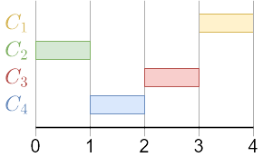
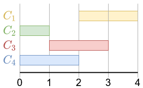
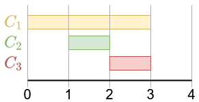
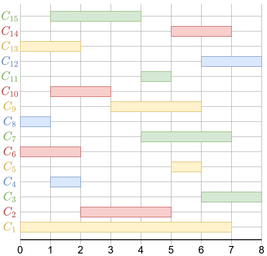

# <center><div class = "titre5">Un problème d'organisation</div></center>

## <div class = "encadré2_TP">__Problème__</div>

Des conférenciers sont invités à présenter leurs exposés dans une salle. Mais leurs disponibilités ne leur permettent d’intervenir qu’à des horaires bien définis. Le problème est de construire un planning d’occupation de la salle avec le plus grand nombre de conférenciers.
<span style="display: block; margin: 10px 0 0 0;">Désignons par $n$, entier naturel non nul, le nombre de conférenciers. Chacun d’eux, identifié par une lettre $C_i$, où $i$ est un entier compris entre $0$ et $n−1$, est associé à un intervalle temporel $[d_i, f_i[$ où $d_i$ et $f_i$ désignent respectivement l’heure de début et l’heure de fin de l’intervention.</span>
<span style="display: block; margin: 10px 0 0 0;">Afin de dégager une tactique de résolution du problème, commençons par analyser plusieurs situations.</span>

## <div class = "encadré2_TP">__Premières analyses__</div>

### <div class = "encadré3_TP">__Situation 1__</div>

Quatre conférenciers peuvent intervenir aux intervalles temporels suivants :

{ .image width=40%}

Une telle situation est simple puisque tous les conférenciers peuvent intervenir sur des créneaux horaires disjoints. Le planning est donc défini par la suite $[C_2, C_4, C_3, C_1]$ de conférenciers.
<span style="display: block; margin: 10px 0 0 0;">L’algorithme menant à ce résultat choisit les conférenciers par __ordre croissant des heures de début ou de fin__ des conférence après s’être assuré que les intervalles sont disjoints.</span>

### <div class = "encadré3_TP">__Situation 2__</div>

On considère à nouveau quatre conférenciers dont les créneaux horaires ne sont plus toujours disjoints.

<center>
$C_1 ∶ [2, 4[~~~~C_2 ∶ [0, 1[~~~~C_3 ∶ [1, 3[~~~~C_4 ∶ [0, 2[$
</center>
{ .image width=40%}

<span style="display: block; margin: 30px 0 0 0;">Ces intervalles ne sont pas compatibles : des choix doivent être faits et certains conférenciers peuvent ne pas être retenus pour construire un planning.</span> 
<span style="display: block; margin: 10px 0 0 0;">Plusieurs solutions peuvent être construites : $[C_2, C_1]$ ou $[C_2, C_3]$ ou $[C_4, C_1]$.</span>

> Mais laquelle de ces solutions retenir ?

Une idée serait de nouveau de classer par __ordre croissant les heures de début__ des intervalles compatibles. En procédant de la sorte, $C_1$ et $C_2$ sont compatibles avec $d_2 < d_1$ ; ce qui mène au planning $[C_2, C_1]$. De même, $C_2$ et $C_3$ sont compatibles avec $d_2 < d_3$ ; ce qui mène à $[C_2, C_3]$. Enfin, $C_4$ et $C_1$ sont également compatibles, avec $d_4 < d_1$ ; ce qui mène à $[C_4, C_1]$.

Une autre idée serait de construire les plannings en classant par __ordre croissant les heures de fin__ des intervalles compatibles. En procédant de la sorte, on retrouve les trois propositions de plannings précédentes.

Il semble donc que ces deux idées mènent à des résultats identiques. En outre, elles n’ont pas permis d’éliminer des solutions afin de n’en fournir qu’une seule. C’est à ce niveau que la __stratégie gloutonne__ intervient. Celle-ci va faire un premier choix de conférencier en suivant un critère à préciser. Ce choix ne sera jamais remis en question et la même stratégie sera appliquée pour trouver les conférenciers suivants.

Après avoir classé les intervalles par valeurs croissantes des heures de début, sélectionner l’intervalle de la première plus petite valeur, puis celui de la deuxième plus petite valeur compatible avec la précédente, et ainsi de suite. On observe que :

<center>$d_2 = d_4 < d_3 < d_1$</center>

et que :
<div class="couleur_puce35" markdown="1">

* $C_2$ et $C_4$ ne sont pas compatibles ;
* $C_3$ et $C_4$ ne sont pas compatibles ;
* $C_1$ et $C_3$ ne sont pas compatibles.

</div>
Deux solutions $[C_2, C_3]$ et $[C_4, C_1]$ restent, en raison de l’égalité $d_2 = d_4$ qui ne permet pas de choisir le premier conférencier.

On peut aussi classer les intervalles par valeurs croissantes des heures de fin, puis sélectionner l’intervalle de la première plus petite valeur, puis celui de la deuxième plus petite valeur compatible avec la précédente, et ainsi de suite. 

On observe à présent que : $f_2 < f_4 < f_3 < f_1$ avec les mêmes incompatibilités que précédemment.

Une seule solution est alors possible : $[C_2, C_3]$.

Cette solution était également proposée par la stratégie précédente. Il est alors légitime de se demander si ce dernier résultat relève d’une stratégie générale pertinente ou d’une situation trop particulière. La situation suivante apporte un premier élément de réponse.

### <div class = "encadré3_TP">__Situation 3__</div>

Considérons à présent trois conférenciers et appliquons les deux stratégies précédentes.

<center>
$C_1 ∶ [0, 3[~~~~C_2 ∶ [1, 2[~~~~C_3 ∶ [2, 3[$
</center>
{ .image width=40%}
<div class="couleur_puce35" markdown="1">

* En classant les heures de début, on a $d_1 < d_2 < d_3$. Seuls $C_2$ et $C_3$ sont compatibles. Mais puisque $d_1$ est la plus petite des heures, le planning proposé en suivant cette stratégie se réduit $[C_1]$ alors que $[C_2, C_3]$ est une meilleure solution puisqu’elle maximise le nombre de conférenciers.
* En classant les heures de fin, on a $f_2 < f_1 = f_3$. Cette fois-ci, le planning proposé en suivant la seconde stratégie fournit le planning $[C_2, C_3]$.
</div>

## <div class = "encadré2_TP">__Un algorithme glouton__</div>

Une solution semble émerger des observations précédentes. On peut donc proposer la stratégie suivante :
<div class="couleur_puce22" markdown="1">

* Classer les intervalles par heures de fin croissantes,
* Choisir le conférencier associé au premier intervalle,
* Choisir parmi les intervalles suivants celui du conférencier dont l’intervalle est compatible avec celui du premier conférencier,
* Recommencer ainsi avec les intervalles classés suivants jusqu’à ce qu’il n’y en ait plus à traiter.

</div>
Illustrons la mise en œuvre de cet algorithme sur la situation suivante :

{ .image width=50%}

Commençons par classer les conférenciers par heures de fin croissantes en notant $~\le~$ la relation d’ordre associée.

<center>$C_8 \le C_4 \le C_6 \le C_{13} \le C_{10} \le C_{15} \le C_2 \le C_{11} \le C_5 \le C_9 \le C_1 \le C_7 \le C_{14} \le C_3 \le C_{12}$</center>

Puis construisons petit à petit le planning :
<div class="couleur_puce22" markdown="1">

* Le premier conférencier est $C_8 → [C_8]$.
* Le conférencier suivant dont l’intervalle est compatible avec celui de $C_8$ est $C_4 → [C_8, C_4]$.
* Le conférencier suivant compatible avec $C_4$ est $C_2 →[C_8, C_4, C_2]$.
* Le conférencier suivant compatible avec $C_2$ est $C_5 →[C_8, C_4, C_2, C_5]$.
* Le conférencier suivant compatible avec $C_5$ est $C_3 →[C_8, C_4, C_2, C_5, C_3]$.

</div>
Ce qui mène au planning final suivant.

<center>$[C_8, C_4, C_2, C_5, C_3]$</center>

!!! remarque "Remarques"
	<div class="couleur_puce31">

    * Un tel algorithme est effectivement de type glouton. Chaque choix fait sélectionne l’une des meilleures possibilités et ne remet jamais en cause les choix précédents.
    * Pour conclure cette proposition d’algorithme, il conviendrait de montrer que la solution obtenue est optimale, c’est-à-dire de cardinal maximum.

    </div>

## <div class = "encadré2_TP">__Codage en Python__</div>

### <div class = "encadré3_TP">__Structure des données__</div>

Avant de proposer un code Python qui renvoie un planning sous la forme d’un tableau, il convient de s’interroger sur la manière de stocker les intervalles horaires de chaque conférencier.

Étant donnés $n$ conférenciers, une première idée consiste à placer à l’indice $i∈{0,...,n−1}$ d’un tableau `#!python tab_intervalles` l’intervalle $[d_{i+1}, f_{i+1}]$ du conférencier $i+1$ sous la forme d’un tableau.

Reprenant l’exemple de la figure, cela donnerait le tableau suivant :

```python
tab_intervalles = [[0, 7], [2, 5], [6, 8], [1, 2], [5, 6], [0, 2], [4, 7], [0, 1], [3, 6], [1, 3], [4, 5], [6, 8], [0, 2], [5, 7], [1, 4]]
```

!!! exercice {{exercice(False, prem=0)}}
	Écrire une fonction `#!python activite(nb_intervalles)` qui renvoie un tableau de `#!python nb_intervalles` intervalles, générés aléatoirement.

	On définira localement les variables suivantes :

	```python
	debut = 8      # heure de début des conférences
	fin = 17       # heure de fin des conférences
	duree_max = 3  # durée maximale des conférences
	```

Si une telle solution semble pertinente, elle présente un inconvénient lié à la phase de tri qui, en réorganisant les créneaux horaires, place à un indice $i$ du tableau trié un conférencier qui n’est plus $C_i$. 

Sur le tableau ci-dessus, le tri mène au tableau suivant :

```python
[[0, 1], [1, 2], [0, 2], [0, 2], [1, 3], [1, 4], [2, 5], [4, 5], [5, 6], [3, 6], [0, 7], [4, 7], [5, 7], [6, 8], [6, 8]]
```
 
Pour éviter cette difficulté, plusieurs solutions sont envisageables. Nous proposons de d’ajouter un champ aux tableaux des créneaux horaires sous la forme d’une chaîne de caractères qui identifie le conférencier :

```python
tab_intervalles = [[0, 7, 'C1'], [2, 5, 'C2'], [6, 8, 'C3'], [1, 2, 'C4'], [5, 6, 'C5'], [0, 2, 'C6'], [4, 7, 'C7'], [0, 1, 'C8'], [3, 6, 'C9'], [1, 3, 'C10'], [4, 5, 'C11'], [6, 8, 'C12'], [0, 2, 'C13'], [5, 7, 'C14'], [1, 4, 'C15']]
```

Le tableau trié est alors le suivant :

```python
[[0, 1, 'C8'], [1, 2, 'C4'], [0, 2, 'C6'], [0, 2, 'C13'], [1, 3, 'C10'], [1, 4, 'C15'], [2, 5, 'C2'], [4, 5, 'C11'], [5, 6, 'C5'], [3, 6, 'C9'], [0, 7, 'C1'], [4, 7, 'C7'], [5, 7, 'C14'], [6, 8, 'C3'], [6, 8, 'C12']]
```

!!! exercice {{exercice(False)}}
	Modifier la fonction `#!python activite(nb_intervalles)` de sorte que le tableau renvoyé comporte le champ *conférencier*.

### <div class = "encadré3_TP">__Tri des données__</div>

La première étape de l’algorithme consiste à trier les intervalles par valeur croissante des heures de fin.

!!! exercice {{exercice(False)}}

	- [ ] Écrire une instruction (à l'aide de la fonction `#!python sorted()`) permettant de trier le tableau obtenu par la fonction `#!python activite()`.

	- [ ] Terminer l'algorithme glouton permettant l'organisation du planning des conférenciers sous la forme d'une fonction `#!python org_intervalles(tab_intervalles)`.

	La fonction ci-dessous permet d'afficher simplement les intervalles de façon "graphique" :

	```python
	def affiche_intervalles(tab_intervalles):
	    t = ""
	    for d, f, l in tab_intervalles:
	        t += l + "\t:" + " "*d + "#"*(f-d) + "\n"
	    print(t)
	```
	
	- [ ] Vérifier la validité des solutions calculées par la fonction `#!python org_intervalles()`.

