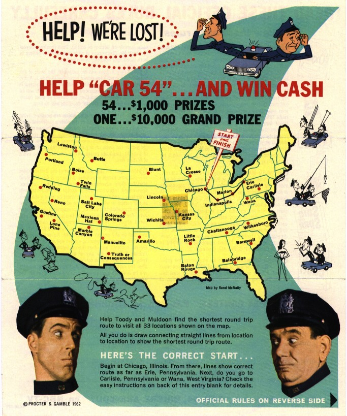
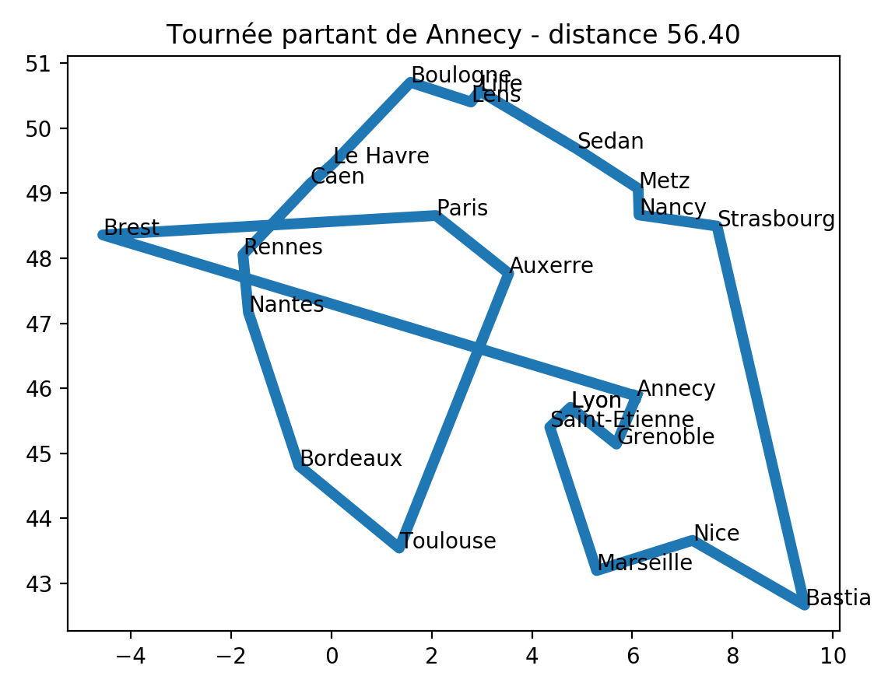

# <center><div class = "titre5">Le voyageur de commerce</div></center>

> Le problème du voyageur de commerce - _Traveling Salesman Problem_
TSP -, étudié depuis le 19e siècle, est l’un des plus connus dans le domaine de la recherche opérationnelle. [William Rowan Hamilton](https://fr.wikipedia.org/wiki/William_Rowan_Hamilton){. target="_blank"} a posé pour la première fois ce problème sous forme de jeu dès 1859.

## <div class = "encadré2_TP">__Problème__</div>

Le problème du TSP sous sa forme la plus classique est le suivant : 

!!! clock1 "__Enoncé__"
    __« Un voyageur de commerce doit visiter une et une seule fois un nombre fini de villes et revenir à son point d’origine. Trouvez l’ordre de visite des villes qui minimise la distance totale parcourue par le voyageur ».__

Ce problème d’optimisation combinatoire appartient à la classe des problèmes [NP-Complets](https://fr.wikipedia.org/wiki/Probl%C3%A8me_NP-complet){. target="_blank"}.

!!! compas "__Domaines d’application__"
    Les domaines d’application sont nombreux :
    <div class="couleur_puce1">

    * problèmes de logistique ;
    * problèmes de transport, aussi bien de marchandises que de personnes ;
    * Plus largement, toutes sortes de problèmes d’ordonnancement ;
    * Certains problèmes rencontrés dans l’industrie se modélisent sous la forme d’un problème de voyageur de commerce, comme l’optimisation de trajectoires de machines outils : comment percer plusieurs points sur une carte électronique le plus vite possible ?

    </div>

Pour un ensemble de $n$ points, il existe au total $n! = 1 \times 2 \times 3 \times ... \times n$ chemins possibles. 
<span style="display: block; margin: 10px 0 0 0;">Le point de départ ne changeant pas la longueur du chemin, on peut choisir celui-ci de façon arbitraire, on a ainsi $(n-1)!$ chemins différents.</span>
<span style="display: block; margin: 10px 0 0 0;">Enfin, chaque chemin pouvant être parcouru dans deux sens et les deux possibilités ayant la même longueur, on peut diviser ce nombre par deux.</span>
<span style="display: block; margin: 10px 0 0 0;">Par exemple, si on nomme les points, $\operatorname{A}$, $\operatorname{B}$, $\operatorname{C}$ et $\operatorname{D}$, les chemins $\operatorname{ABCD}$, $\operatorname{BCDA}$, $\operatorname{CDAB}$, $\operatorname{DABC}$, $\operatorname{ADCB}$, $\operatorname{DCBA}$, $\operatorname{CBAD}$, $\operatorname{BADC}$ ont tous la même longueur, seul le point de départ et le sens de parcours change.</span>
<span style="display: block; margin: 10px 0 0 0;">On a donc $\displaystyle\frac{(n-1)!}{2}$ chemins candidats à considérer.</span>
<span style="display: block; margin: 10px 0 0 0;">Par exemple, pour $71$ villes, le nombre de chemins candidats est supérieur à $5 \times 10 ^{80}$ qui est environ le nombre d'atomes connus dans l'univers.([Page wikipedia _Problème du voyageur de commerce_](https://fr.wikipedia.org/wiki/Problème_du_voyageur_de_commerce){. target="_blank"}).</span>

{ .image width=50%}

## <div class = "encadré2_TP">__Heuristique gloutonne__</div>

!!! wiki2 "__Heuristique__"
    En algorithmique, une heuristique est une méthode de calcul qui fournit rapidement une solution réalisable, pas nécessairement optimale ou exacte, pour un problème d'optimisation difficile. 

L'objectif de ce TP est de réaliser un algorithme glouton pour résoudre le TSP.

Pour cela vous avez à votre disposition :
<div class="couleur_puce22" markdown="1">

- Un jeu de données [exemple.txt](documents/exemple.txt){. target="_blank"} contenant les coordonnées de différentes villes à raison d'une par ligne sous la forme `nom_de_la_ville latitude longitude`. Vous pouvez bien sur l'étendre ou en générer un nouveau avec vos propres villes.
<span style="display: block; margin: 10px 0 0 0;">Par exemple :</span>
```
Annecy	6,082499981	45,8782196
Auxerre	3,537309885	 47,76720047
Bastia	9,434300423	42,66175842
```
- Un fichier [TSP_biblio.py](scripts/TSP_biblio.py){. target="_blank"} contenant un ensemble de fonctions permettant la lecture des données et la visualisation d'un tour réalisé par le voyageur (ici pour le moment dans l'ordre d'apparition).
<span style="display: block; margin: 10px 0 0 0;">Voici les principales fonctions :</span>
```python
def get_tour_fichier(f):
    """
    Lit le fichier de villes format ville, latitude, longitude
    Renvoie un tour contenant les villes dans l ordre du fichier
    : param f: nom de fichier
    : return : (list)
    """
```
```python
def distance(tour, i, j):
    """
    Distance euclidienne entre deux villes i et j
    : param tour: sequence de ville
    : param i: numero de la ville de départ
    : param j: numero de la ville d arrivee
    : return: float
    CU: i et j dans le tour
    """
```
```python
def longueur_tour(tour):
    """
    Longueur totale d une tournée de la ville de départ et retourne à la ville de départ
    : param tour: tournee de ville n villes = n segments
    : return: float distance totale
    """
```
```python
def trace(tour):
    """
    Trace la tournée realisée
    : param tour: liste de ville
    """
```

</div>

{ .image width=50%}

Afin de créer l'algorithme glouton pour résoudre le problème du TSP, nous allons réaliser certaines étapes.
<div class="list8_1" markdown="1">

1. Définir l'heuristique de choix de la solution optimale locale.
2. Réaliser un programme Python utilisant les fonctions définies pour la lecture et l'affichage permettant de mettre en œuvre l'heuristique.  
<span style="display: block; margin: 5px 0 0 0;">Pour cela vous pouvez :</span>

</div>
<div class="list8_a" markdown="1">

1. réaliser une fonction qui génère une matrice qui stocke les distances 2 à 2 entre toutes les villes afin de ne faire le calcul de distance qu'une seule fois.
2. réaliser une fonction qui renvoie l'indice de la ville la plus proche étant donnée une ville, une liste de villes sous forme d'indices, une matrice de distance.
3. réaliser l'heuristique gloutonne donnant le tour parcouru par le voyageur de commerce à partir d'une ville donnée en paramètre, la liste des villes et la matrice de distances ville à ville (on passera par un système d'indices).

</div>

## <div class = "encadré2_TP">__Consignes précises__</div>

L'objectif du TP est de programmer en Python plusieurs fonctions qui résolvent le problème du voyageur de commerce.
<div class="couleur_puce22" markdown="1">

* Vous disposez de plusieurs fonctions qui vous seront utiles dans le fichier `#!python TSP_biblio.py`. Télechargez-le.
* La liste des villes de la tournée est disponible dans le fichier `#!python exemple.txt`. Télechargez-le.
* Créez un fichier `#!python tsp.py` dans votre dossier.

</div>
Lors de l'exécution de votre fichier, deux résultats sont attendus :
<div class="list8_1" markdown="1">

1. l'affichage dans la console du parcours réalisé par le voyageur de commerce.
2. l'affichage graphique du parcours (similaire à celui présenté plus haut) de votre parcours.

</div>

## <div class = "encadré2_TP">__Étapes et conseils__</div>

Vous pouvez résoudre le problème en seulement 4 fonctions et 30 lignes de code.
Ce n'est donc pas un TP difficile.
<div class="list8_1" markdown="1">

1. Commencez par générer la matrice des distances entre les villes. Une ligne par ville, une colonne par ville, chaque cellule est la distance qui les sépare.
2. Quelle heuristique allez-vous choisir ?
3. Ensuite créez une fonction dont la signature est la suivante :
    ~~~python
    def indice_distance_min(ville, liste_ville, distances):
        '''
        Renvoie l'indice de la ville la plus proche étant
        donnée une ville, une liste de villes sous forme d'indices, une matrice de
        distances.

        :param ville: (int) indice d'une ville
        :param liste_ville: (list) liste d'indices des villes
        :param (distance):  (list of list of float) matrice des distances
        :return: (int) l'indice de la ville la plus proche parmi ceux de la liste
        '''
        pass
    ~~~
4. La dernière fonction génère le parcours depuis une ville donnée et le fichier contenant leurs position.  
Sa sortie doit correspondre à ce que la fonction `#!python trace` du module `#!python TSP_biblio.py` prend en paramètre.

</div>

