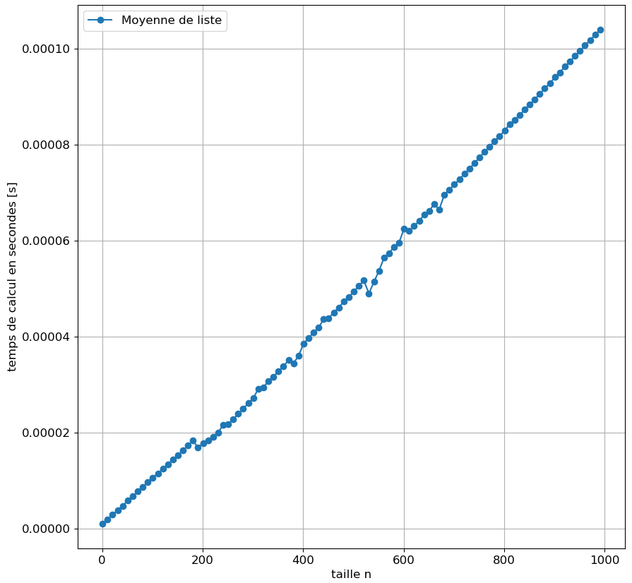
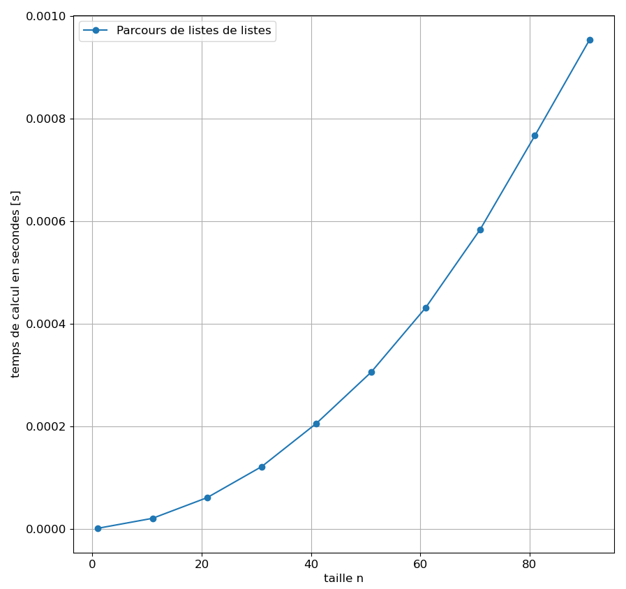
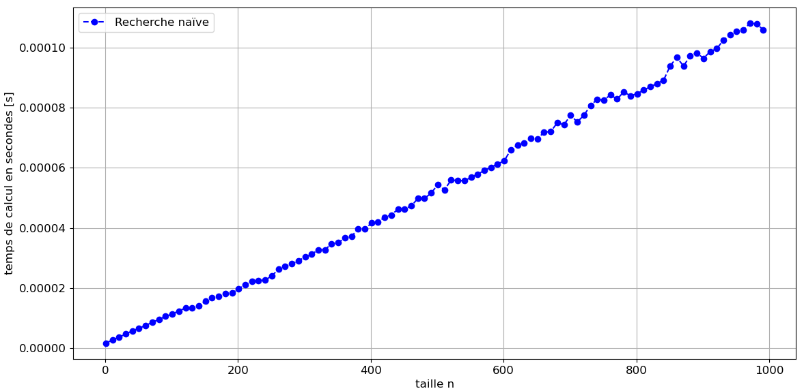
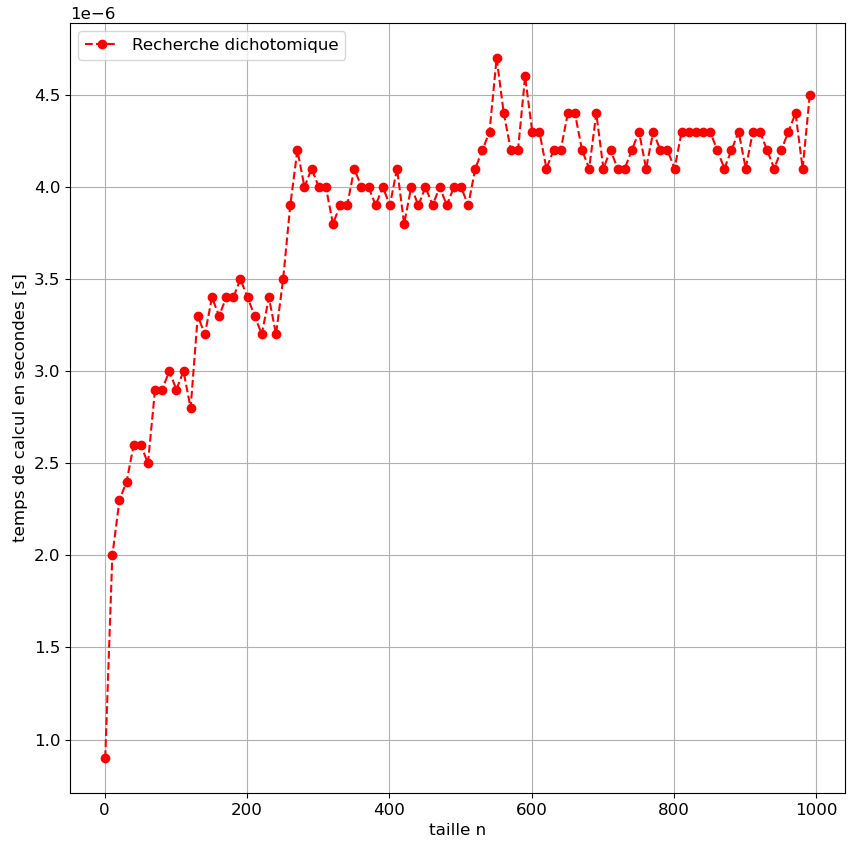
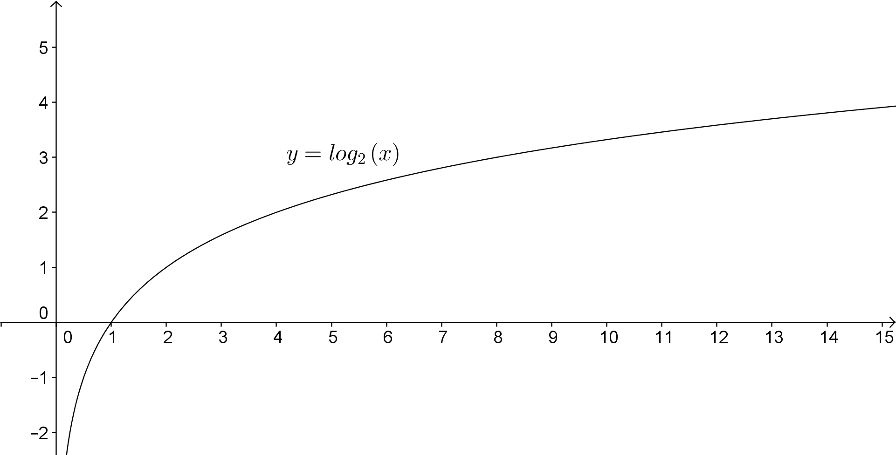
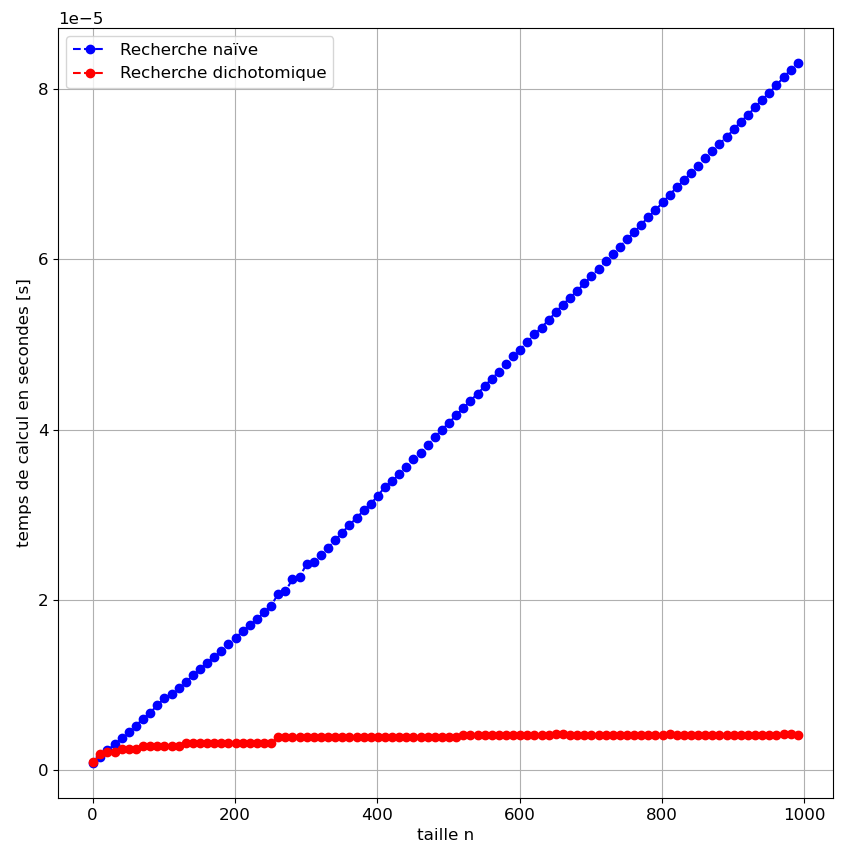

# <center><div class = "titre5">Correction des exercices du TP</div></center>

### <div class = "encadré2_TP"> __Correction de l'exercice 1__ </div>

```python
from timeit import Timer 

t = Timer('sin(1.2)', setup='from math import sin')
min(t.repeat(repeat=10000, number=1)) 

#répète sin(1.2) 10000 fois et prend le plus petit temps d'execution

```

### <div class = "encadré2_TP"> __Correction de l'exercice 2__ </div>
<div class = "list8_1" markdown="1">

1.   
    ```python
    setup = '''
    from random import randint
    L = [randint(1,100) for i in range(500)]
    '''
    # Mesure du temps
    t = timeit.Timer('max(L)',setup = setup)
    temps = min(t.repeat(repeat = 10000, number = 1))
    print(temps)
    ```
2. Lors du passage d'une liste de 50 éléments à 500 éléments, le temps a, en moyenne, été multiplié par 10.
3. L'algorithme de recherche d'un maximum dans une liste a une complexité linéaire donc en multipliant par 10 la taille des entrées, on multiplie par 10 son temps d'exécution.

</div>
### <div class = "encadré2_TP"> __Correction de l'exercice 3__ </div>

```python
def moyenne(L):
    somme = 0
    for i in range (len(L)):
        somme += L[i]
    somme /= len(L)
    return somme

# Tests de la fonction moyenne
assert moyenne([1,2,3,4]) == 2.5
assert moyenne([1,2,3,4,5,6]) == 3.5
```

### <div class = "encadré2_TP"> __Correction de l'exercice 4__ </div>

```python
from random import randint

def randlist(n):
    L = [randint(1, 100) for i in range(n)]
    return L
```

### <div class = "encadré2_TP"> __Correction de l'exercice 5__ </div>
<div class = "list8_1" markdown="1">

1. 

</div>

{.image width="65%" }

<div class = "decal1" markdown="1">
La représentation graphique de cette fonction se rapproche de la droite d'équation $~y=x$.</div>
<div class = "list8_2" markdown="1">

2. On sait que l'algorithme qui permet de déterminer la moyenne des éléments d'une liste a une complexité linéaire donc ces résultats sont cohérents.

</div>

### <div class = "encadré2_TP"> __Correction de l'exercice 6__</div>
<div class = "list8_1" markdown="1">

1.   
    ```python
    def randlistlist(n):
        L = [[randint(1, 100) for i in range(n)] for j in range(n)]
        return L

    # Test de la fonction
    t = randlistlist(10)
    assert (len(t), len(t[0])) == (10, 10)
    ```
2. 
    ```python
    def double(L):
        l_double = [[2*L[i][j] for j in range(len(L))] for i in range(len(L))]
        return l_double

    # Test de la fonction
    L = [[1, 2, 3], [4, 5, 6], [7, 8, 9]]
    assert double(L) == [[2, 4, 6], [8, 10, 12], [14, 16, 18]]
    ```
    </div>

### <div class = "encadré2_TP"> __Correction de l'exercice 7__ </div>
<div class = "list8_1" markdown="1">

1. 

</div>

{ .image width="65%" }

<div class = "decal1" markdown="1">
La représentation graphique de cette fonction a la forme d'une parabole donc elle se rapproche de la courbe d'équation $~y=x^2$.</div>
<div class = "list8_2" markdown="1">

2. On sait qu'un algorithme qui correspond au parcours d'une liste de listes a une complexité quadratique donc ces résultats sont cohérents.

</div>

### <div class = "encadré2_TP"> __Correction de l'exercice 8__ </div>
<div class = "list8_1" markdown="1">

1.   
    ```python
    def gene_liste_triee(n):
        L = [randint(1, 100) for i in range(n)]
        L.sort()
        return L
    ```
2. 
    ```python
    def recherche_naïve(L, c):
        present = False
        for i in range(len(L)):
            if c == L[i]:
                present = True
        return present

    L = [2, 3, 5, 7, 11, 13, 17, 19, 23]
    assert recherche_naïve(L, 23) == True
    assert recherche_naïve(L, 25) == False
    assert recherche_naïve(L, 0) == False
    ```
3. 
    {.image  width="75%" }

</div>

### <div class = "encadré2_TP"> __Correction de l'exercice 9__ </div>
<div class = "list8_1" markdown="1">

1.   
    ```python
    def recherche_dichotomique(L, c):
        present = False
        debut = 0
        fin = len(L) - 1
        while (present != True) and (debut <= fin):
            milieu = (debut + fin) // 2
            if L[milieu] == c:
                present = True
            elif L[milieu] < c:
                debut = milieu + 1
            else:
                fin = milieu - 1
        return present

    L = [2, 3, 5, 7, 11, 13, 17, 19, 23]
    assert recherche_dichotomique(L, 23) == True
    assert recherche_dichotomique(L, 25) == False
    assert recherche_dichotomique(L, 0) == False
    ```
2. 
    {.image width="65%" }

</div>
<div class = "decal1" markdown="1">
    
??? remarque "__Remarque__"
    il peut être intéressant de comparer la précédente représentation graphique avec celle de la fonction logarithmique binaire :
    {.image width="75%" }

</div>

### <div class = "encadré2_TP"> __Correction de l'exercice 10__ </div>
<div class = "list8_1" markdown="1">

1. 
    {.image width="65%" }

</div>
<div class = "list8_2" markdown="1">

2. Ces résultats sont cohérents avec la leçon puisque l'agorithme de dichotomie a une complexité logarithmique tandis que l'algorithme de recherche "naïf" a une complexité linéaire.

</div>