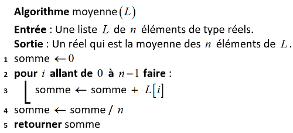
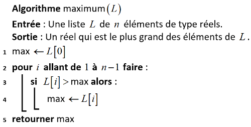

# <center><div class = "titre2">Correction des exercices du cours</div></center>

### <div class = "encadré_exo"> __Correction de l'exercice 1__ </div>
<div class = "list1_1" markdown="1">

1. 
<span style="display: block; margin: 3px 0 0 0;">
```python
def recherche(L: list, c: int or float or str) -> bool:
    present = False
    for i in range (len(L)):
        if c == L[i]:
            present = True
    return present

L = [1, 12, 45, 87]
c1 = 87
c2 = 88

assert recherche(L, c1) == True
assert recherche(L, c2) == False
```
</span>
2. 

</div>
<div class ="list1_a" markdown="1">

1. __La terminaison__ : vérifions que le nombre d'instructions à effectuer est fixe.  
La présence d'une boucle dans un algorithme peut entrainer sa non-terminaison mais ici, il s'agit d'une boucle bornée (`#!python for`) donc le nombre de passages dans celle-ci est connu. En effet, la liste `#!python L` ayant une longueur finie, la boucle sera parcourue `#!python longueur(L)` fois et donc l'algorithme se termine toujours.
2. __La correction__ : vérifions que l’algorithme fait ce pourquoi il est conçu.  
Comme on renvoie la variable `#!python present`, on vérifie que `#!python present` contient à la fin de l’exécution le résultat attendu. 

</div>
<div class = "couleur_puce14" markdown="1">

* La variable booléenne `#!python present` est à l'état `#!python False` au début de l'algorithme.  
* Elle ne passe à `#!python True` qu'à la seule condition où `#!python c == L[i]` autrement dit dans le cas où l'élément `#!python c` est présent dans la liste `#!python L`. Une fois l'élément trouvé, cette variable ne change plus d'état (on peut éventuellement lui ré-affecter la valeur `#!python True` dans le cas où l'élément se trouve plusieurs fois dans la liste). L'algorithme renvoie alors bien le fait que `#!python c` est présent dans la liste.
* Dans le cas où `#!python c` n'est pas dans la liste `#!python L`, la condition `#!python c == L[i]` n'est jamais satisfaite et la variable `#!python present` reste à l'état `#!python False`. L'algorithme renvoie alors le fait que `#!python c` n'est pas présent dans la liste.
</div>
<span style="display: block; margin: 3px 0 0 4em;">Ainsi, dans tous les cas, l’algorithme fait bien ce pourquoi il est conçu.</span>

### <div class = "encadré_exo"> __Correction de l'exercice 2__ </div>
<div class = "list1_1" markdown="1">

1. $\mathcal{O}(n^2)$ : complexité quadratique.
2. $\mathcal{O}(n^3)$ : complexité polynomiale.
3. $\mathcal{O}(n^4)$ : complexité polynomiale.
4. $\mathcal{O}(n\operatorname{log_{2}}(n))$ : complexité quasi-linéaire.
5. $\mathcal{O}(2^n)$ : complexité exponentielle.
6. $\mathcal{O}(n!)$ : complexité factorielle.
   
</div>

### <div class = "encadré_exo"> __Correction de l'exercice 3__ </div>
<div class = "list1_1" markdown="1">

1. En langage naturel :

</div>
<span style="display: block; margin: 3px 0 0 2em;">
{ .image }
</span>
<div class="decal8">En langage Python : 

```python
def moyenne(L: list) -> float:
    somme = 0
    for i in range (len(L)):
        somme = somme + L[i]
    somme = somme / len(L)
    return somme
```
</div>
<div class = "list1_2" markdown="1">

2. __La terminaison__ : la présence d'une boucle bornée ainsi que les autres instructions élémentaires assurent la terminaison de l'algorithme.
3. __La correction__ : la variable `#!python somme` est initialisée à `#!python 0`. La présence de la boucle bornée permet de cumuler les `#!python n` valeurs de la liste `#!python L` dans cette variable `#!python somme`. Une fois ces valeurs sommées, on divise le résultat par le nombre de notes, ce qui correspond bien à un calcul de moyenne. Cette valeur moyenne est stockée dans la variable `#!python somme` qui est renvoyée par l'algorithme.

</div>
<div class = "list1_4" markdown="1">

4. __Le coût__ : Dans cet algorithme, on a :

</div>
<div class="couleur_puce14" markdown="1">

* Affectation d'un réel (variable `somme`)
* Calcul de la longueur d'une liste (`len(L)`)
* Itération d'un entier (boucle `for`)
* Accès à un élément de tableau (`L[i]`)
* Opérations arithmétiques (addition et division)
* Renvoi d'une valeur en fin d'algorithme

</div>
<span style="display: block; margin: 3px 0 0 2.4em;">On compte pour chaque ligne le nombre de fois où chaque opération est effectuée :</span>   
<div class="decal8" markdown="1">

| Ligne | Affec. réel | Calcul longueur| Itération | Accès tableau  | Op. arithmétique |Renvoi de valeur|
| :---: | :---------: | :-------------:| :--------:| :-------------:| :---------------:|:---------------:|
| 1     | $1$           |                |           |                |                  |                 |
| 2     |             |   $1$            |   $n$     |                |                  |                 |
| 3     |     $n$     |                |           |     $n$        |      $n$         |                 |
| 4     |     $1$       |     $1$          |           |                |        $1$         |                 |
| 5     |             |                |           |                |                  |      $1$          |
| Total |   $n+2$     |  $2$             | $n$       |   $n$          |     $n+1$        |      $1$          |


Ainsi, le temps d'exécution de cet algorithme au pire des cas est $~4n+6$.  
<span style="display: block; margin: 3px 0 0 0;">La complexité de cet algorithme est donc __linéaire__.</span>

</div>

### <div class = "encadré_exo"> __Correction de l'exercice 4__ </div>
<div class = "list1_1" markdown="1">

1. En langage naturel :

</div>
<span style="display: block; margin: 3px 0 0 2em;">
{ .image}
</span>
<div class="decal8">En langage Python : 

```python
def maximum(L: list) -> int:
    max = L[0]
    for i in range (1, len(L)):
        if L[i] > max:
            max = L[i]
    return max
```
</div>
<div class = "list1_2" markdown="1">

2. __La terminaison__ : la présence d'une boucle bornée ainsi que les autres instructions élémentaires assurent la terminaison de l'algorithme.
3. __La correction__ : la variable `#!python max` est initialisée à `#!python L[0]`. La présence de la boucle bornée permet de comparer les `#!python n-1` valeurs restantes de la liste `#!python L` à la valeur de cette variable `#!python max`. Si une des valeurs de `#!python L` est supérieure au maximum en cours, elle devient le nouveau maximum. Une fois toutes les valeurs de `#!python L` balayées, la variable `#!python max` contient bien le maximum des éléments de `#!python L` et est alors renvoyée par l'algorithme.

</div>
<div class = "list1_4" markdown="1">

4. __Le coût__ : Dans cet algorithme, on a :

</div>
<div class="couleur_puce14" markdown="1">
    
* Affectation d'un réel (variable `max`)
* Calcul de la longueur d'une liste (`len(L)`)
* Itération d'un entier (boucle `for`)
* Accès à un élément de tableau (`L[i]`)
* Comparaison de deux réels (`L[i]>max`)
* Renvoi d'une valeur en fin d'algorithme
    
</div>
<div class="decal8" markdown="1">On compte pour chaque ligne le nombre de fois où chaque opération est effectuée :</div>  
<div class="decal8" markdown="1">

| Ligne | Affec. réel | Calcul longueur| Itération | Accès tableau  | Comp. de réels   |Renvoi  de valeur|
| :---: | :---------: | :-------------:| :--------:| :-------------:| :---------------:| :--------------:|
| 1     | $1$           |                |           |      $1$         |                  |                 |
| 2     |             |       $1$        |   $n-1$   |                |                  |                 |
| 3     |             |                |           |     $n-1$      |      $n-1$       |                 |
| 4     |     $n-1$   |                |           |      $n-1$     |                  |                 |
| 5     |             |                |           |                |                  |      $1$          |
| Total |      $n$    |       $1$        | $n-1$     |   $2n-1$       |     $n-1$        |      $1$          |


Ainsi, le temps d'exécution de cet algorithme au pire des cas est $~5n-1$.  
<span style="display: block; margin: 3px 0 0 0;">La complexité de cet algorithme est donc __linéaire__.</span>

</div>
### <div class = "encadré_exo"> __Correction de l'exercice 5__ </div>
<div class = "list1_1" markdown="1">

1. Cette fonction renvoie le maximum des éléments d'une liste.
2. __Le coût__ : dans cet algorithme, on a :

</div>
<div class="couleur_puce14" markdown="1">
    
* Affectations d'un réel
* Calcul de la longueur d'une liste
* Itération d'un entier
* Accès à un élément de tableau
* Comparaison de deux réels
* Renvoi d'une valeur en fin d'algorithme

</div>
<span style="display: block; margin: 3px 0 0 2.4em;">On compte pour chaque ligne le nombre de fois où chaque opération est effectuée :</span>  
<div class="decal8" markdown="1">

|Ligne|Affec. nombres|Calcul longueur|Itération         | Accès tableau         | Comp. de réels     |Renvoi de valeur |
|:---:|:-----------: |:------------: |:----------------:| :--------------------:| :-----------------:| :--------------:  |
|1    |$1$             |               |                  |      $1$                |                    |                 |
|2    |$1$             |    $1$         |                  |                       |                    |                 |
|3    |              |               |  $n$             |                       |                    |                 |
|4    |              |               |                  |     $n$               |        $n$         |                 | 
|5    |    $n$       |               |                  |      $n$              |                    |                 |
|7    |              |               |$\displaystyle\frac{(n-1)n}{2}$|                       |                    |                 |
|8    |              |               |                  | $\displaystyle\frac{(n-1)n}{2}$    | $\displaystyle\frac{(n-1)n}{2}$ |                 |
|9   |              |               |                  |                       |                    |                 |
|10   |              |               |                  |                       |                    |     $1$               |
|Total| $n+2$    |     $1$             |$\displaystyle\frac{n(n+1)}{2}$|$\displaystyle\frac{(n-1)n}{2}+2n+1$|$\displaystyle\frac{n(n+1)}{2}$  |      $1$              |

La condition du `#!python if` n'étant jamais satisfaite (en effet, la vérification est totalement inutile), aucune valeur n'est présente dans la ligne 9 du tableau.  
Ainsi, le temps d'exécution de cet algorithme au pire des cas est $\displaystyle\frac{3n^2+n+10}{2}$.  
<span style="display: block; margin: 3px 0 0 0;">La complexité de cet algorithme est donc __quadratique__.</span>

</div>
### <div class = "encadré_exo"> __Correction de l'exercice 6__ </div>

<center markdown="1">

| Etape                           		| q         | r     | r$~\ge~$3 ? |
|                               		| :-------: | :---: |:-------:  |
| Avant le début de la boucle           | 0		    | 22	|oui	    |
| Premier passage dans la boucle        | 1         | 19    |oui	    |
| Second passage dans la boucle   		| 2         | 16    |oui	    |
| Troisième passage dans la boucle   	| 3         | 13    |oui	    |
| Quatrième passage dans la boucle  	| 4         | 10    |oui	    |
| Cinquième passage dans la boucle      | 5         | 7     |oui	    |
| Sixième passage dans la boucle   		| 6         | 4     |oui	    |
| Septième passage dans la boucle   	| 7         | 1     |non	    |

</center>
L'algorithme renvoie alors le couple $(7;1)$.
<span style="display: block; margin: 3px 0 0 0;">Ces 2 valeurs correspondent respectivement bien au quotient et au reste de la division euclidienne de $22$ par $3$ puisque $22=7×3+1$.</span>

### <div class = "encadré_exo"> __Correction de l'exercice 7__ </div>
<div class = "list1_1" markdown="1">

1. Ici, nous allons choisir $~n-i~$ comme variant de boucle. En effet, la valeur $~n-i~$ est positive à la première itération ($i=0~$ et $~n\ge0~$ donc $~n-i\ge0$). De plus, elle décroit à chaque itération de la boucle puisqu'on incrémente la variable $~i~$ de 1. Donc au bout d’un certain nombre d’itérations, notre variant de boucle sera négatif ou nul, et cela terminera la boucle `#!python tant que` puisque la boucle se poursuit à la condition que $~i\le$$~n$.
2.  

</div>
<div class = "list1_a" markdown="1">

1. Dans les deux cas, on obtient le même résultat : $~12~$ pour `#!python factorielle(4)` et $~4!$ et $~5040~$ pour `#!python factorielle(7)` et $~7!~$.
2. Ce programme calcule la factorielle d'un entier naturel.

</div>
<div class = "list1_3" markdown="1">

3. Montrons que $~f=i!~$ est un invariant de la boucle. 

</div>
<div class = "couleur_puce14" markdown="1">

* A l'initialisation, $~f=1~$ et $~i=0$. Comme $~0!=1~$, on a bien $~f=i!$
* Il faut maintenant prouver que si notre propriété est vraie au début de l'itération $~i$, elle reste encore vraie au début de l'itération $~i+1$.  
On suppose donc qu'au début de l'itération $~i$, on a $~f=i!$  
Alors, $~i~$ devient $~i+1~$ et $~f~$ devient $~f×i~$ donc après les affectations, on obtient $f=i!×(i+1)=(i+1)!~$  
Ainsi, la propriété est encore vraie au début de l'itération $~i+1$.  
On a donc bien conservation de la propriété.

</div>
<div class = "list1_4" markdown="1">

4. Il faut ici montrer qu’une fois la boucle terminée, l’invariant de boucle fournit une propriété utile pour prouver la validité de l’algorithme.  
Ici, la boucle prend fin quand $~i~$ dépasse $~n-1$, c’est-à-dire pour $~i=n$.  
On a alors $~f=n!~$, ce qui montre que l'algorithme est correct.

</div>
### <div class = "encadré_exo"> __Correction de l'exercice 8__ </div>
<div class = "list1_1" markdown="1">

1. On considère la liste triée : `#!python L = [2, 5, 7, 11, 13, 17, 19, 23, 29]`.

</div>
<div class = "list1_a" markdown="1">

1. Recherche de l'élément `#!python 23` à l'aide de l'algorithme de dichotomie :

</div> 
<div class = "decal10" markdown="1">

| Nombre de tours de boucle	| milieu  | L[milieu] | present | debut | fin |
| :---------------------:	| :-----: | :-------: |:------: |:----: |:--: |
| 0				            |  	 -    | 	 - 	  | Faux    | 0     | 8   |
| 1				            |  	 4    | 	13 	  | Faux    | 5     | 8   |
| 2				            |  	 6    | 	19 	  | Faux    | 7     | 8   |
| 3				            |  	 7    | 	23 	  | Vrai    | 7     | 8   |

Il faut donc 3 tours de boucle pour trouver l'élément `#!python 23` à l'aide de l'algorithme de dichotomie.
</div>
<div class = "list1_b" markdown="1">

2. Lors d'une recherche séquentielle, tous les éléments de la liste sont parcourus donc il faut 9 tours de boucle pour trouver `#!python 23`. 

</div>
<div class = "decal10" markdown="1">

!!! tip "__Remarque__"
    Dans le cas un peu moins naïf où l'algorithme se termine dès que l'élément est atteint, il faudrait tout de même 8 tours pour trouver `#!python 23`.
	
</div>
<div class = "list1_c" markdown="1">

3. Reprendre les deux questions précédentes avec l'élément 8.

</div>
<div class = "couleur_puce14" markdown="1">

* A l'aide de l'algorithme de dichotomie :

</div>
<div class = "decal11" markdown="1">

| Nombre de tours de boucle	| milieu  | L[milieu] | present | debut | fin |
| :---------------------:	| :-----: | :-------: |:------: |:----: |:--: |
| 0				            |  	 -    | 	 - 	  | Faux    | 0     | 8   |
| 1				            |  	 4    | 	13 	  | Faux    | 0     | 3   |
| 2				            |  	 1    | 	 5 	  | Faux    | 2     | 3   |
| 3				            |  	 2    | 	 7 	  | Faux    | 3     | 3   |
| 4				            |  	 3    | 	11 	  | Faux    | 3     | 2   |

</div>
<div class = "decal11" markdown="1">

A l'issue du quatrième tour de boucle, la condition __debut ≤ fin__ n'est plus satisfaite.<span style="display: block; margin: 3px 0 0 0;">Il faut donc 4 tours de boucle pour trouver que l'élément `8` n'est pas dans la liste `L` à l'aide de l'algorithme de dichotomie.</span>

</div>
<div class = "couleur_puce14" markdown="1">

* Dans le cas d'une recherche séquentielle, que l'algorithme se termine dès que l'élément est atteint ou non, il faudra parcourir tous les éléments et donc effectuer 9 tours de boucle puisque l'élément n'appartient pas à la liste.

</div>
<div class = "list1_2" markdown="1">

2. 

</div>
<div class = "decal8" markdown="1">

```python
def recherche_dichotomique(L, c):
    present = False
    debut = 0
    fin = len(L) - 1
    while (present != True) and (debut <= fin):
        milieu = (debut + fin) // 2
        if L[milieu] == c:
            present = True
        elif L[milieu] < c:
            debut = milieu + 1
        else :
            fin = milieu - 1
        print (milieu, debut, fin)
    return present

print(recherche_dichotomique(L, 23))
```

</div>
<div class = "list1_3" markdown="1">

3. Nous allons choisir __fin - debut__ comme variant de boucle. En effet, cette valeur est positive à la première itération (__debut = 0__ et __fin = n - 1__, et comme on peut raisonnablement penser que la liste n'est pas vide, on a __n ≥ 1__ soit __n - 1 ≥ 0__ et ainsi __fin - debut ≥ 0__).
<span style="display: block; margin: 8px 0 0 0;">A chaque étape :</span>

</div>
<div class = "couleur_puce14" markdown="1">

* Soit __present__ prend la valeur __Vrai__ (l'élément a été trouvé) et la boucle termine.
* Soit __debut = milieu + 1__ (et __fin__ est inchangé) : __debut__ augmente strictement donc __fin - debut__ diminue strictement.
* Soit __fin = milieu - 1__ (et __debut__ est inchangé) : __fin__ diminue strictement donc __fin - debut__ diminue strictement.  
<span style="display: block; margin: 8px 0 0 0;">L'entier positif __fin - debut__ décroît strictement à chaque passage dans la boucle : c'est un variant de boucle. La boucle termine donc nécessairement.</span>

</div>
<div class = "list1_4" markdown="1">

4. Montrons tout d'abord que « __tout indice tel que L[indice] = c vérifie debut ≤ indice ≤ fin__ » est un invariant de la boucle.

</div>
<div class = "couleur_puce14" markdown="1">

* Avant d'entrer dans la boucle, on a __debut = 0__ et __fin = n - 1__. Si on se place dans le cas où __c__ est présent et que tout indice vérifie __0 ≤ indice ≤ n - 1__, la propriété est satisfaite.
* Il faut maintenant prouver que si notre propriété est vraie au début d'une certaine étape, elle reste encore vraie au début de l'étape suivante.

</div>
<div class="couleur_puce14etoi" markdown="1">

* Si __L[milieu] = c__, on sort de la boucle puisque __present__ prend la valeur __Vrai__. Dans ce cas, __debut__, __fin__ et __milieu__ n'ont pas changé de valeur : la propriété est encore vérifiée.
* Sinon, si __L[milieu] < c__, la liste étant ordonnée croissante, __c__ se trouve strictement à droite de __milieu__. Donc en posant __debut = milieu + 1__ et en ne modifiant pas la variable __fin__, la propriété est encore vraie en fin de passage dans la boucle.
* Enfin, __si L[milieu] > c__, la liste étant ordonnée croissante, __c__ se trouve strictement à gauche de __milieu__. Donc en posant __fin = milieu - 1__ et en ne modifiant pas la variable __debut__, la propriété est encore vraie en fin de passage dans la boucle.    

</div>
<div class = "decal11" markdown="1">
Dans tous les cas, en fin de passage dans la boucle, la propriété est encore vraie. 
On a donc bien conservation de la propriété.</div>
<div class = "decal1" markdown="1">

Il faut maintenant montrer qu’une fois la boucle terminée, l’invariant de boucle fournit une propriété utile pour prouver la validité de l’algorithme.</div>
<div class = "couleur_puce14" markdown="1">

* Si __c__ est élément de __L__, on ne sortira pas de la boucle par __debut > fin__. En effet, nous avons établi que lorsque __c__ est présent dans __L__, on a à chaque fin de passage dans la boucle l'indice de __c__ tel que __debut ≤ indice ≤ fin__. Si on sort par __debut > fin__, la propriété ne peut être satisfaite : contradiction. Si __c__ est présent, on sort donc nécessairement de la boucle car __present__ prend la valeur __Vrai__ et l'algorithme renvoie bien __Vrai__.
* Si __c__ n'est pas élément de __L__. Alors la condition __L[milieu] = c__ n'est jamais satisfaite, donc on sort de la boucle par __debut > fin__ et l'algorithme renvoie __Faux__.

</div>
<div class = "list1_5" markdown="1">

5. Pour étudier la complexité, nous allons nous poser la question suivante : au niveau de la boucle, combien doit-on effectuer d'itérations pour un tableau de taille $~n~$ dans le cas le plus défavorable (l'élément __c__ n'est pas dans le tableau __L__) ?
	
</div>
<div class = "decal1" markdown="1">
Sachant qu'à chaque itération de la boucle on divise le tableau en 2, cela revient donc à se demander combien de fois faut-il diviser le tableau en 2 pour obtenir, à la fin, un tableau comportant un seul entier ?
Autrement dit, combien de fois faut-il diviser $~n~$ par 2 pour obtenir 1 ?

</div>
<div class = "decal1" markdown="1">
Mathématiquement cela se traduit par l'équation $\displaystyle\frac{n}{2^\alpha}=1$ avec $~\alpha~$ le nombre de fois qu'il faut diviser $~n~$ par 2 pour obtenir 1. Il faut donc trouver $~\alpha~$ !

</div>
<div class = "decal1" markdown="1">
A ce stade il est nécessaire d'introduire une nouvelle notion mathématique :  

le "logarithme de base 2" noté $~\operatorname{log_2}$. Par définition $~\operatorname{log_2}(2^x)=x$.

Nous avons donc :

$\displaystyle\frac{n}{2^\alpha}=1$ $~\Rightarrow~$ $n=2^\alpha$  $~\Rightarrow$ $~\operatorname{log_2}(n)=\operatorname{log_2}(2^\alpha)=\alpha$, nous avons donc $~\alpha=\operatorname{log_2}(n)$.

Nous pouvons donc dire que la complexité en temps dans le pire des cas de l'algorithme de recherche dichotomique est $\mathcal{O}(\operatorname{log_{2}}(n))$ : il s'agit bien d'une complexité logarithmique.

</div>

