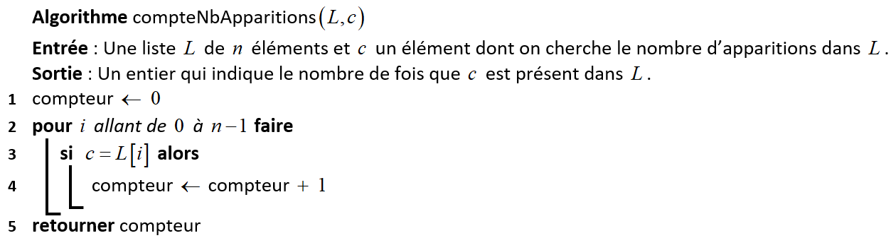
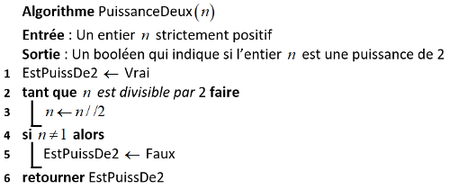

# <center><div class = "titre2">Correction des exercices</div></center>

### <div class = "encadré_exo"> __Correction de l'exercice 1__ </div>
<div class="list1_1" markdown="1">

1. En langage naturel :

</div>

{ .image width=75%}

<div class="decal8">En langage Python : 

```python
def compte(L: list, c: int or float or str) -> int:
    n = 0
    for elem in L:
        if elem == c:
            n += 1
    return n

def compte2(L: list, c: int or float or str) -> int:
    n = 0
    for elem in L:
        n += (elem == c) # Variation qui évite la boucle si
    return n

L1 = [3, 5, 7, 11, 13, 11, 11, 5]
assert compte(L1, 5) == 2
assert compte(L1, 11) == 3
assert compte(L1, 6) == 0

L2 = ['a', 'b', 'b']
assert compte(L2, 'a') == 1
```

</div>
<div class="list1_2" markdown="1">

2. __Le coût__ : dans le pire des cas, la liste `#!python L` n'est constituée que de `#!python c`, qui est l'élément à chercher.  
Dans cet algorithme, on a :

</div>
<div class="couleur_puce14" markdown="1">

* Affectation d'un réel (variable `compteur`)
* Calcul de la longueur d'une liste
* Itération d'un entier (boucle `pour`)
* Accès à un élément de tableau (`L[i]`)
* Comparaison de deux réels (`L[i] = c`)
* Opération arithmétique (addition)
* Renvoi d'une valeur en fin d'algorithme

</div>
<div class="decal8" markdown="1">On compte pour chaque ligne le nombre de fois où chaque opération est effectuée :

| Ligne | Affec. réel |Calcul longueur|Itération|Accès tableau|Comp. de réels|Op. arithmétique| Renvoi de valeur|
| :---: | :---------: | :------------:| :------:| :----------:| :-----------:|:--------------:|:----------------:|
| 1     | $1$           |               |         |             |              |                |                 |
| 2     |             |   $1$           |  $n$    |             |              |                |                 |
| 3     |             |               |         |     $n$     |      $n$     |                |                 |
| 4     |    $n$      |               |         |             |              |      $n$       |                 |
| 5     |             |               |         |             |              |                |    $1$                |
| Total |   $n+1$     |  $1$            | $n$     |   $n$       |     $n$      |      $n$       |    $1$                | 

</div>
<div class="decal8" markdown="1">Ainsi, le temps d'exécution de cet algorithme au pire des cas est $~5n+3$.  
<span style="display: block; margin: 3px 0 0 0;">La complexité de cet algorithme est donc __linéaire__.</span>
</div>
<div class="list1_3" markdown="1">

3. __La terminaison__ : Ici, nous allons choisir $~n-1-i~$ comme variant de boucle.  
En effet, la valeur $~n-1-i~$ est positive à la première itération ($~i=0~$ et $~n≥1~$ donc $~n-1-i≥0~$). De plus, elle décroit strictement à chaque itération de la boucle puisqu'on incrémente la variable $~i~$ de $~1$. Donc au bout d’un certain nombre d’itérations, notre variant de boucle sera nul, et cela terminera la boucle. Ainsi, cet algorithme se termine.

</div>

### <div class = "encadré_exo"> __Correction de l'exercice 2__ </div>
<div class="list1_1" markdown="1">

1. 
    ```python
    def est_triee(L: list) -> bool:
        bool = True
        n = len(L)
        for indice in range(n-1): # n-1 pour s'arrêter à l'avant-dernier élément de la liste
            if L[indice] > L[indice+1]:
                bool = False
                return bool
        return bool

    L1 = [3, 5, 7, 11, 13, 11, 11, 5]
    assert est_triee(L1) == False

    L2 = ['a', 'b', 'c']
    assert est_triee(L2) == True

    L3 = [3, 5, 7, 11, 13]
    assert est_triee(L3) == True
    ```
2. __Le coût__ : dans le pire des cas, tous les éléments de `#!python L` sont déjà triés sauf le dernier élément qui est inférieur à l'avant-dernier.  
Dans cet algorithme, on a :

</div>
<div class="couleur_puce14" markdown="1">

* Affectations (réel et booléen)
* Calcul de la longueur d'une liste
* Itération d'un entier (boucle `for`)
* Accès à des éléments de tableau (`L[indice]` et `L[indice+1]`)
* Comparaison de deux réels (`>`)
* Opération arithmétique (addition)
* Renvoi d'une valeur en fin d'algorithme

</div>
<div class="decal8" markdown="1">On compte pour chaque ligne le nombre de fois où chaque opération est effectuée :

| Ligne | Affec. réel |Calcul longueur|Itération|Accès tableau|Comp. de réels|Op. arithmétique| Renvoi de valeur|
| :---: | :---------: | :------------:| :------:| :----------:| :-----------:|:--------------:|:----------------:|
| 2     | 1           |               |         |             |              |                |                 |
| 3     |    1        |   1           |         |             |              |                |                 |
| 4     |             |               | $n-1$   |             |              |                |                 |
| 5     |             |               |         |$2n-2$       |$n-1$         |    $n-1$       |                 |
| 6     |     1       |               |         |             |              |                |                 |
| 7     |             |               |         |             |              |                |  1                |
| 8     |             |               |         |             |              |                |                 |
| Total |   3         |  1            | $n-1$   |   $2n-2$    |   $n-1$      |     $n-1$      |    1                | 

</div>
<div class="decal8" markdown="1">

Ainsi, le temps d'exécution de cet algorithme au pire des cas est $~5n$.  
<span style="display: block; margin: 3px 0 0 0;">La complexité de cet algorithme est donc __linéaire__.</span>
</div>
<div class="list1_3" markdown="1">

3. __La terminaison__ : Ici, nous allons choisir $~n-2-indice~$ comme variant de boucle.  
En effet, la valeur $~n-2-indice~$ est positive à la première itération ($~indice=0~$ et $~n≥2~$ (la liste doit contenir au moins 2 éléments pour qu'il y ait un intérêt à vérifier qu'elle est triée ou non) donc $~n-2-indice≥0~$). De plus, elle décroit strictement à chaque itération de la boucle puisqu'on incrémente la variable $~indice~$ de $~1$.  
Si la liste n'est pas triée, et donc que $~L[indice] > L[indice+1]~$, la fonction retourne `#!python False` et sort donc de la boucle.  
Si la liste est déjà triée, au bout d’un certain nombre d’itérations, notre variant de boucle sera nul, et cela terminera la boucle. Ainsi, cet algorithme se termine.

</div>

### <div class = "encadré_exo"> __Correction de l'exercice 3__ </div>
<div class = "list1_1" markdown="1">

1. Le coût en temps d’un algorithme naïf de recherche est :  
<div class="centrer" markdown="1"> $\,\,\,\,\,\,\,\,\,\,\,\,\,\,\,\,\,\,\,\,\,\,\,\,\,\,\,\,\,\,\,$<span style="display: inline-block; color: rgb(243, 99, 121); font-weight: bold;"> c. </span> Linéaire</div>

</div>
<div class="list1_2" markdown="1">

2. Le coût en temps d’un algorithme de recherche de maximum est :
<div class="centrer" markdown="1"> $\,\,\,\,\,\,\,\,\,\,\,\,\,\,\,\,\,\,\,\,\,\,\,\,\,\,\,\,\,\,\,$<span style="display: inline-block; color: rgb(243, 99, 121); font-weight: bold;"> c. </span> Linéaire</div>

</div>
<div class="list1_3" markdown="1">

3. Le coût en temps d’un algorithme de recherche par dichotomie est :
<div class="centrer" markdown="1"><span style="display: inline-block; color: rgb(243, 99, 121); font-weight: bold;"> b. </span> Logarithmique $\,\,\,\,\,\,\,\,\,\,\,\,\,\,\,\,\,\,\,\,\,\,\,\,\,\,\,\,\,\,\,\,\,\,\,\,\,\,\,\,\,\,\,\,\,\,\,\,\,\,\,\,\,\,\,\,$</div>

</div>
<div class="list1_4" markdown="1">

4. On mesure le temps sur un algorithme de coût linéaire qui s’exécute sur une liste de 1 000 <span style="display: block; margin: 3px 0 0 0;">éléments. Quel temps mettra-t-il sur une liste de 5 000 éléments ?</span>  

 <span style="display: block; margin: 10px 0 0 0;"><span style="display: inline-block; color: rgb(243, 99, 121); font-weight: bold;">$\,\,\,\,\,\,\,\,\,\,\,\,\,\,\,\,\,\,\,\,\,\,$c. </span> Il mettra environ 5 fois plus de temps</span>

</div>
<div class="list1_5" markdown="1">

5. On mesure le temps sur un algorithme de coût quadratique qui s’exécute sur une liste de <span style="display: block; margin: 3px 0 0 0;">1 000 éléments. Quel temps mettra-t-il sur une liste de 5 000 éléments ?</span>  

  <span style="display: block; margin: 10px 0 0 0;"><span style="display: inline-block; color: rgb(243, 99, 121); font-weight: bold;">$\,\,\,\,\,\,\,\,\,\,\,\,\,\,\,\,\,\,\,\,\,\,\,\,\,\,\,\,\,\,\,\,\,\,\,\,\,\,\,\,\,\,\,\,\,\,\,\,\,\,\,\,\,\,\,\,\,\,\,\,\,\,\,\,\,\,\,\,\,\,\,\,\,\,\,\,\,\,\,\,\,\,\,\,\,\,\,\,\,\,\,\,\,\,\,\,\,\,\,\,\,\,\,\,\,\,\,\,\,\,\,\,\,\,\,\,$ d. </span> Il mettra 25 fois plus de temps</span>

</div>
<div class="list1_6" markdown="1">

6. On mesure le temps sur un algorithme de coût constant qui s’exécute sur une liste de 1 000 <span style="display: block; margin: 3px 0 0 0;">éléments. Quel temps mettra-t-il sur une liste de 5 000 éléments ?</span>
<span style="display: block; margin: 10px 0 0 0;"><span style="display: inline-block; color: rgb(243, 99, 121); font-weight: bold;">$\,\,\,\,\,\,\,\,\,\,\,$ a. </span> Il mettra le même temps</span>

</div>
<div class="list1_7" markdown="1">

7. Classer ces coûts d’exécution en temps du plus rapide au plus lent :  
<span style="display: block; margin: 3px 0 0 0;">
<span style="display: inline-block; color: rgb(243, 99, 121);"> e. </span> Constant  
<span style="display: inline-block; color: rgb(243, 99, 121);"> b. </span> Logarithmique  
<span style="display: inline-block; color: rgb(243, 99, 121);"> a. </span> Linéaire  
<span style="display: inline-block; color: rgb(243, 99, 121);"> f. </span> Quadratique  
<span style="display: inline-block; color: rgb(243, 99, 121);"> d. </span> Polynomial  
<span style="display: inline-block; color: rgb(243, 99, 121);"> c. </span> Exponentiel</span>

</div>

### <div class = "encadré_exo"> __Correction de l'exercice 4__ </div>
<div class="list1_1" markdown="1">

1. 
    ```python
    def compte_voyelles(phrase: str) -> int:
        compte = 0
        for lettre in phrase:
            if lettre in "aeiouy":
                compte += 1
        return compte

    assert compte_voyelles("bonjour") == 3
    assert compte_voyelles("attention") == 4
    assert compte_voyelles("ressources officielles") == 9
    assert compte_voyelles("pffffffft") == 0
    ```
2. __Le coût__ : dans le pire des cas, la chaine de caractères `#!python phrase` ne compte que des `#!python "y"` (dernière voyelle de la chaine `#!python "aeiouy"`).
<span style="display: block; margin: 8px 0 0 0;">Dans cet algorithme, on a :</span>

</div>
<div class="couleur_puce14" markdown="1">

* Affectation d'entiers
* Calcul de la longueur d'une chaine de caractères
* Itération d'un entier (boucle `#!python for`)
* Accès à des éléments d'une chaine de caractères
* Comparaison de deux caractères
* Opération arithmétique (addition)
* Renvoi d'une valeur en fin d'algorithme

</div>
<div class="decal8" markdown="1">On compte pour chaque ligne le nombre de fois où chaque opération est effectuée :

| Ligne | Affec. entiers |Calcul longueur|Itération|Accès tableau|Comp. de carac|Op. arithmétique| Renvoi de valeur|
| :---: | :---------:    | :------------:| :------:| :----------:| :-----------:|:--------------:|:----------------:|
| 2     | $1$              |               |         |             |              |                |                 |
| 3     |                |   $1$           |  $n$    |             |              |                |                 |
| 4     |                |               |         |    $6n+n$   |       $6n$   |                |                 |
| 5     |    $n$         |               |         |             |              |    $n$         |                 |
| 6     |                |               |         |             |              |                |      $1$          |
| Total |   $n+1$        |  $1$            | $n$     |      $7n$   |   $6n$       |     $n$        |    $1$                | 

</div>
<div class="decal8" markdown="1">

Ainsi, le temps d'exécution de cet algorithme au pire des cas est $~16n+3$.  
<span style="display: block; margin: 3px 0 0 0;">La complexité de cet algorithme est donc __linéaire__.</span>

</div>

### <div class = "encadré_exo"> __Correction de l'exercice 5__ </div>
<div class="list1_1" markdown="1">

1. Pour `#!python mot = radar`, cet algorithme renvoie `#!python Vrai`. Cet algorithme vérifie si une chaine de caractères est un palindrome.
2. Montrons que $~d = j - i~$ est un variant de boucle.  
<span style="display: block; margin: 5px 0 0 0;">La valeur $~d~$ est positive à la première itération ($~i = 0~$ et $~j = n - 1~$ avec $~n ≥ 1~$ donc  $~d = j - i ≥ 0$). De plus, elle décroit strictement à chaque itération de la boucle puisqu'on incrémente la variable $~i~$ de $~1~$ et que l'on décrémente $~j~$ de $~1$.  
Les deux conditions pour être variant de boucle sont donc vérifiées par $~d~$ : $~j - i~$ est un variant de boucle.  
Ainsi, au bout d’un certain nombre d’itérations, notre variant de boucle sera négatif, et cela terminera la boucle. Ainsi, cet algorithme se termine.</span>
3. __Le coût__ : dans le pire des cas, pour tous les entiers `#!python i` et `#!python j`, on a `#!python mot[i] ≠ mot[j]`.
<span style="display: block; margin: 8px 0 0 0;">Dans cet algorithme, on a :</span>

</div>
<div class="couleur_puce14" markdown="1">

* Affectations (entier et booléen)
* Calcul de la longueur d'une chaine de caractères
* Accès à des éléments d'une chaine de caractères (`#!python mot[i]` et `#!python mot[j]`)
* Comparaison de deux réels (`#!python ≤`)
* Opération arithmétique (addition)
* Renvoi d'une valeur en fin d'algorithme

</div>
<div class="decal8" markdown="1">On compte pour chaque ligne le nombre de fois où chaque opération est effectuée :

| Ligne | Affectation |Calcul longueur|Accès chaine de carac.|Comp. de réels       |Op. arithmétique| Renvoi de valeur|
| :---: | :----------: | :------------:| :----------:| :------------------:|:--------------:|:---------:|
| 1     | $1$            |               |             |                     |                |                 |
| 2     |    $1$         |   $1$           |             |                     |  $1$             |                  |
| 3     |     $1$        |               |             |                     |                |                  |
| 4     |              |               |             |$E(\displaystyle\frac{n+1}{2})+1$ |                |                  |
| 5     |              |               |$2×E(\displaystyle\frac{n+1}{2})$              |       $E(\displaystyle\frac{n+1}{2})$                  |                  |                 |
| 6     |   $E(\displaystyle\frac{n+1}{2})$           |               |             |                     |                |                |
| 7     |     $E(\displaystyle\frac{n+1}{2})$        |               |             |                     |          $E(\displaystyle\frac{n+1}{2})$     |                 |
| 8     |      $E(\displaystyle\frac{n+1}{2})$       |               |             |                     |         $E(\displaystyle\frac{n+1}{2})$      |                 |
| 9     |              |               |             |                     |              |            $1$    |
| Total |   $3+3×E(\displaystyle\frac{n+1}{2})$          |  $1$            |   $2×E(\displaystyle\frac{n+1}{2})$    |   $2×E(\displaystyle\frac{n+1}{2})+1$            |      $2×E(\displaystyle\frac{n+1}{2})+1$      |    $1$            | 

</div>
<div class="decal8" markdown="1">

Ainsi, le temps d'exécution de cet algorithme au pire des cas est $~9×E(\displaystyle\frac{n+1}{2})+7$.  
<span style="display: block; margin: 3px 0 0 0;">La complexité de cet algorithme est donc __linéaire__.</span>

</div>

### <div class = "encadré_exo"> __Correction de l'exercice 6__ </div>
<div class="list1_1" markdown="1">

1. 

</div>

{ .image}

<div class="list1_2" markdown="1">

2. On considère comme variant de boucle l’exposant de 2 dans la décomposition de `#!python n` en produit de facteurs premiers.

</div>
<div class="couleur_puce14" markdown="1">

* Si `#!python n` est initialement impair, cet exposant est nul et la boucle `#!python tant que` se termine.
* Si `#!python n` est initialement pair, cet exposant est un entier non nul qui diminue de 1 à chaque itération, il finit donc par s’annuler donc `#!python n` devient impair et la boucle `#!python tant que` se termine.

</div>

### <div class = "encadré_exo"> __Correction de l'exercice 7__ </div>
<div class="list1_1" markdown="1">

1. Montrons que $~p=2^i~$ est un invariant de la boucle. 

</div>
<div class = "couleur_puce14" markdown="1">

* $p~$ vaut $~2×1 = 2^1~$ après la première itération, la propriété $~p=2^i~$ est donc vraie après la première itération.

</div>
<div class = "decal11" markdown="1">

!!! probleme "Remarque"
    On remarquera que l'initialisation s'est faite sur le premier passage dans la boucle et non avant le premier passage comme dans les exercices précédents. Cela s'explique par le fait que la variable $~i~$ n'existe pas avant l'introduction de la boucle bornée.

</div>
<div class = "couleur_puce14" markdown="1">

* Il faut maintenant prouver que si notre propriété est vraie au début de l'itération $~i$, elle reste encore vraie au début de l'itération $~i+1$.  
On suppose donc qu'au début de l'itération $~i$, on a $~p=2^i~$.  
Alors, $~p~$ devient $~2×p~$ donc après cette affectation, on obtient $~p=2×2^i=2^{i+1}~$  
Ainsi, la propriété est encore vraie au début de l'itération $~i+1$.  
On a donc bien conservation de la propriété.  
Ici, la boucle prend fin quand $~i~$ prend la valeur $~n~$ et on a alors $~p=2^n~$. Autrement dit, cet algorithme renvoie la $~n$-ième puissance de $~2$.

</div>
<div class="list1_2" markdown="1">

2. Dans cet algorithme, on a :

</div>
<div class="couleur_puce14" markdown="1">

* Affectation d'un réel
* Itération d'un entier
* Opération arithmétique
* Renvoi d'une valeur en fin d'algorithme

</div>
<div class="decal8" markdown="1">On compte pour chaque ligne le nombre de fois où chaque opération est effectuée :

| Ligne | Affec. réel |Itération|Op. arithmétique| Renvoi de valeur|
| :---: | :---------: | :------:| :-------------:| :--------------:|
| 1     | 1           |         |                |                 |
| 2     |             |   $n$   |                |                 |
| 3     |   $n$       |         |    $n$         |                 |
| 4     |             |         |                |        1        |
| Total |     $n+1$   |  $n$    | $n$            |     1           |

</div>
<div class="decal8" markdown="1">

Ainsi, le temps d'exécution de cet algorithme au pire des cas est $~3n+2$.  
<span style="display: block; margin: 3px 0 0 0;">La complexité de cet algorithme est donc __linéaire__.</span>

</div>
