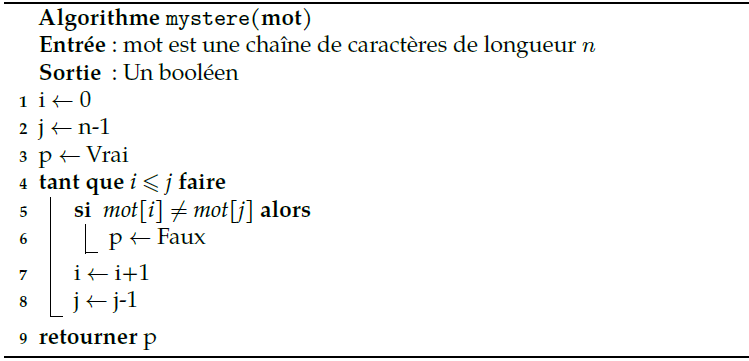
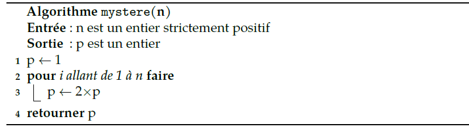

# 

 Exercices 

  
### 
 __Exercice 1__ 

1. Écrire un algorithme, en langage naturel, puis en Python, qui compte le nombre d’apparitions d’un élément `#!python c` dans une liste `#!python L` de longueur `#!python n`. Écrire aussi 3 tests.
2. Déterminer son temps d’exécution au pire des cas.
3. Justifier que cet algorithme se termine.

[Correction de l'exercice 1 :material-cursor-default-click:](Correction.md#correction-de-lexercice-1){:target="_blank" .md-button}

### 
 __Exercice 2__ 

1. Écrire un algorithme, en Python, qui vérifie qu’une liste `#!python L` est triée dans l’ordre croissant.  
L’algorithme doit renvoyer `#!python True` si la liste est triée et `#!python False` sinon. Écrire aussi 3 tests.
2. Déterminer son temps d’exécution au pire des cas.
3. Justifier que cet algorithme se termine.

[Correction de l'exercice 2 :material-cursor-default-click:](Correction.md#correction-de-lexercice-2){:target="_blank" .md-button}

### 
 __Exercice 3__ 

1. Le coût en temps d’un algorithme naïf de recherche est :  

 a.  Constant $\,\,\,\,\,\,\,\,\,\,\,\,$ b.  Logarithmique $\,\,\,\,\,\,\,\,\,\,\,\,$ c.  Linéaire $\,\,\,\,\,\,\,\,\,\,\,\,$ d.  Quadratique $\,\,\,\,\,\,\,\,\,\,\,\,$

2. Le coût en temps d’un algorithme de recherche de maximum est :

  a.  Constant $\,\,\,\,\,\,\,\,\,\,\,\,$ b.  Logarithmique $\,\,\,\,\,\,\,\,\,\,\,\,$ c.  Linéaire $\,\,\,\,\,\,\,\,\,\,\,\,$ d.  Quadratique $\,\,\,\,\,\,\,\,\,\,\,\,\,\,$

3. Le coût en temps d’un algorithme de recherche par dichotomie est :

  a.  Constant $\,\,\,\,\,\,\,\,\,\,\,\,$ b.  Logarithmique $\,\,\,\,\,\,\,\,\,\,\,\,$ c.  Linéaire $\,\,\,\,\,\,\,\,\,\,\,\,$ d.  Quadratique $\,\,\,\,\,\,\,\,\,\,\,\,$

4. On mesure le temps sur un algorithme de coût linéaire qui s’exécute sur une liste de 1 000 éléments. Quel temps mettra-t-il sur une liste de 5 000 éléments ?
$~~~~~~~~~~~~~~~~~~~~~~~~~~~~~~$ a.  Il mettra le même temps $\,\,\,\,\,\,\,\,\,\,\,\,\,\,\,\,\,\,\,\,\,\,\,\,\,\,\,\,\,\,\,\,\,\,\,$ b.  Il mettra environ 5 fois moins de temps $~~~~~~~~~~~~~~~~~~~~~~~~~~~~~~~$c.  Il mettra environ 5 fois plus de temps$\,\,\,\,\,\,\,\,$ d.  Il mettra 25 fois plus de temps$\,\,\,\,\,\,\,\,\,\,\,\,\,\,\,$

5. On mesure le temps sur un algorithme de coût quadratique qui s’exécute sur une liste de 1 000 éléments. Quel temps mettra-t-il sur une liste de 5 000 éléments ?
$~~~~~~~~~~~~~~~~~~~~~~~~~~~~~~$ a.  Il mettra le même temps $\,\,\,\,\,\,\,\,\,\,\,\,\,\,\,\,\,\,\,\,\,\,\,\,\,\,\,\,\,\,\,\,\,\,\,$ b.  Il mettra environ 5 fois moins de temps $~~~~~~~~~~~~~~~~~~~~~~~~~~~~~~~$c.  Il mettra environ 5 fois plus de temps$\,\,\,\,\,\,\,\,$ d.  Il mettra 25 fois plus de temps$\,\,\,\,\,\,\,\,\,\,\,\,\,\,\,$

6. On mesure le temps sur un algorithme de coût constant qui s’exécute sur une liste de 1 000 éléments. Quel temps mettra-t-il sur une liste de 5 000 éléments ?
$~~~~~~~~~~~~~~~~~~~~~~~~~~~~~~$ a.  Il mettra le même temps $\,\,\,\,\,\,\,\,\,\,\,\,\,\,\,\,\,\,\,\,\,\,\,\,\,\,\,\,\,\,\,\,\,\,\,$ b.  Il mettra environ 5 fois moins de temps $~~~~~~~~~~~~~~~~~~~~~~~~~~~~~~~$c.  Il mettra environ 5 fois plus de temps$\,\,\,\,\,\,\,\,$ d.  Il mettra 25 fois plus de temps$\,\,\,\,\,\,\,\,\,\,\,\,\,\,\,$

7. Classer ces coûts d’exécution en temps du plus rapide au plus lent :

$\,\,\,\,\,\,\,\,\,\,\,\,\,\,\,\,\,\,\,\,\,\,\,\,$ a.  Linéaire $\,\,\,\,\,\,\,\,\,\,\,\,\,\,\,\,\,\,\,\,\,\,\,\,\,\,\,\,\,\,\,$ b.  Logarithmique $\,\,\,\,\,\,\,\,\,\,\,\,\,\,\,\,\,\,\,\,\,\,\,\,$ c.  Exponentiel $\,\,\,\,\,\,\,\,\,\,\,\,\,\,\,\,\,\,\,\,\,\,\,$  
$\,\,\,\,\,\,\,\,\,\,\,\,\,\,\,\,\,\,\,\,\,\,\,$ d.  Polynomial $\,\,\,\,\,\,\,\,\,\,\,\,\,\,\,\,\,\,\,\,\,\,\,$  e.  Constant $\,\,\,\,\,\,\,\,\,\,\,\,\,\,\,\,\,\,\,\,\,\,\,\,\,\,\,\,\,\,\,\,\,\,\,$  f.  Quadratique $\,\,\,\,\,\,\,\,\,\,\,\,\,\,\,\,\,\,\,\,\,\,\,\,$

[Correction de l'exercice 3 :material-cursor-default-click:](Correction.md#correction-de-lexercice-3){:target="_blank" .md-button}

### 
 __Exercice 4__ 

1. Écrire un algorithme, en Python , qui compte le nombre de voyelles dans une chaîne de caractères `#!python phrase` de longueur `#!python n`.  
Écrire aussi 3 tests.
2. Déterminer son temps d’exécution au pire des cas.

[Correction de l'exercice 4 :material-cursor-default-click:](Correction.md#correction-de-lexercice-4){:target="_blank" .md-button}

### 
 __Exercice 5__ 

On considère l’algorithme suivant :

{width=75% .image}

1. Exécuter cet algorithme pour `#!python mot = radar`. Quelle est la fonction de cet algorithme ? 
2. Montrer que `#!python d = j - i` est un variant de boucle. En déduire que cet algorithme se termine.
3. Quel est le coût au pire des cas de cet algorithme ?

[Correction de l'exercice 5 :material-cursor-default-click:](Correction.md#correction-de-lexercice-5){:target="_blank" .md-button}

### 
 __Exercice 6__ 

1. Écrire un algorithme utilisant une boucle « Tant que » permettant de déterminer si un entier 
`#!python n` strictement positif est une puissance de 2.
2. Montrer que la boucle se termine en proposant un variant de boucle.

[Correction de l'exercice 6 :material-cursor-default-click:](Correction.md#correction-de-lexercice-6){:target="_blank" .md-button}

### 
 __Exercice 7__ 

On considère l’algorithme suivant :

{width=75% .image}

1. Trouver un invariant de boucle de cet l’algorithme, puis en déduire la valeur renvoyée à la fin de l’exécution. 
2. Quel est la coût au pire des cas de cet algorithme ?

[Correction de l'exercice 7 :material-cursor-default-click:](Correction.md#correction-de-lexercice-7){:target="_blank" .md-button}

