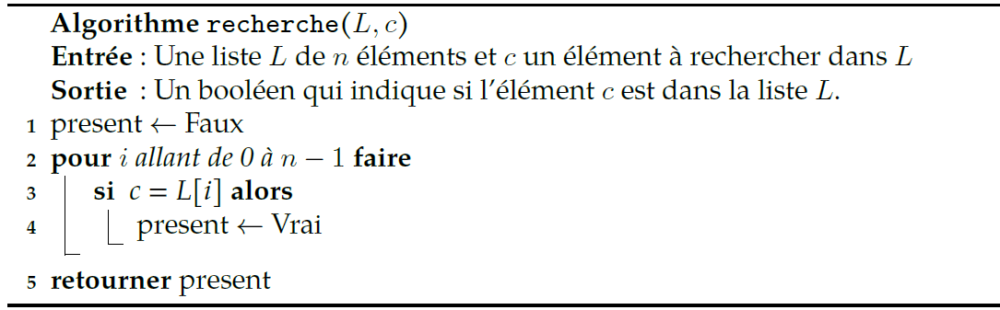
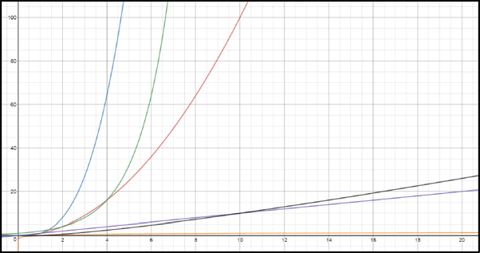
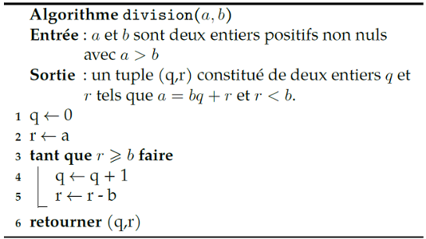
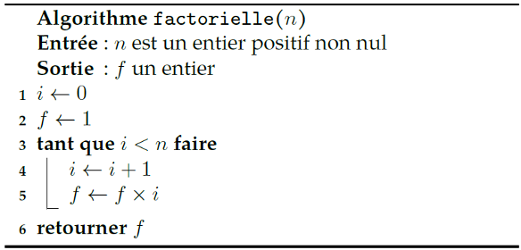
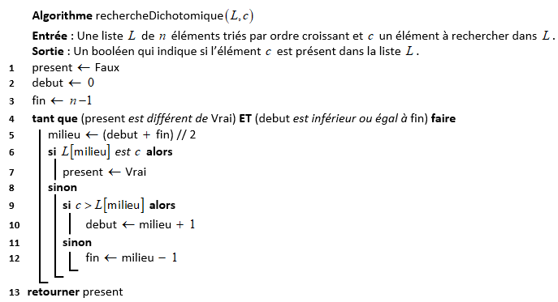

# <center><div class = "titre1">Algorithmes : complexité, terminaison et correction</div></center>

## <div class = "encadré2">__Introduction__</div>

Rappelons avant de commencer ce qu’est un algorithme. Nous dirons que c’est un ensemble de règles permettant de résoudre un problème sur des données d’entrée. Cet ensemble de règles définit avec précision __un ensemble de séquences d’opérations qui se terminent en un temps fini.__
<span style="display: block; margin: 3px 0 0 0;">Pour résoudre un problème, il existe plusieurs méthodes menant pour chacune à un algorithme différent.</span>

!!! exemple "Exemple : la multiplication de deux entiers naturels $~m~$ et $~n~$ écrits en base 10"
    Voici quelques algorithmes qui permettent cette opération :
    <div class="couleur_puce16">

    * Poser la multiplication comme vue à l’école primaire.
    * Utiliser un boulier.

    </div><div class="decal4">
    </div>
    <div class="couleur_puce16">

    * La méthode dite par "jalousies". 

    </div><div class="decal4">
    </div>
    <div class="couleur_puce16">
  
    * Tracer $~m~$ lignes et $~n~$ colonnes et compter le nombre d’intersections.
    </div>

Pour chaque algorithme, on peut se poser trois questions fondamentales que nous détaillerons dans ce chapitre :
<div class="couleur_puce11" markdown="1">

* La question du __coût__ que l’on peut subdiviser en deux sous-questions :

</div>
<div class="couleur_puce1_etoi_decal" markdown="1">

* Le coût en temps.
* Le coût en espace (mémoire pour l’ordinateur).

</div>
<div class="couleur_puce11" markdown="1">

* La question de la __terminaison__, à savoir si un algorithme se termine ou pas. On se posera cette question en particulier pour __les boucles non bornées__.
* La question de la __correction__, c’est à dire savoir si l’algorithme résout effectivement le problème de départ.

</div>
Nous travaillerons sur ces différentes questions sur des exemples "simples" qu’il faudra maîtriser.

## <div class = "encadré2">__Parcours séquentiel d'une liste__</div>

??? probleme "__Le problème__"
    On s’intéresse à la recherche d’occurrences sur des valeurs de type quelconque : nombre, booléen, chaine de caractères, liste ... dans une liste.  
    <span style="display: block; margin: 3px 0 0 0;">Nous noterons `#!python c` l’élément recherché (cible) et la liste dans laquelle nous cherchons `#!python c` sera notée `#!python L`.</span>

Voici un algorithme en langage naturel qui résout ce problème :

{width=75% .image}


??? exercice {{exercice(False, prem=0, niveau=2)}}
    <div class = "list6_1" markdown="1">

    1. Écrire une implémentation en Python de cet algorithme sous la forme d’une fonction nommée `#!python recherche` et la compléter par deux tests.
    2. Intéressons-nous maintenant aux questions évoquées en introduction.</div>

    <div class ="list6_a" markdown="1">

    1. __La terminaison__ : cet algorithme se finira-t-il en un temps fini ?
    2. __La correction__ : l’algorithme fait-il ce pourquoi il est conçu ?
    </div>
    <center markdown="1">
    [Correction de l'exercice 1 :material-cursor-default-click:](Correction des exos du cours.md#correction-de-lexercice-1){:target="_blank" .md-button}
    </center>

En ce qui concerne __le coût__, il est nécessaire de préciser comment nous allons le calculer. 
<span style="display: block; margin: 8px 0 0 0;">Tout d’abord, nous nous contenterons du coût en temps (et pas en espace mémoire).</span>
<span style="display: block; margin: 8px 0 0 0;">Une première idée est que ce temps va dépendre de la taille des données fournies en entrée. En effet, l’algorithme `#!python recherche` ne mettra pas le même temps sur une liste de 20 mots que sur l’ensemble du dictionnaire français. Le coût sera donc une fonction de la taille des données. Dans notre exemple, cela sera une fonction de $~n$ (la taille de la liste).</span>
<span style="display: block; margin: 8px 0 0 0;">
Ensuite, comme les ordinateurs n’ont pas tous la même vitesse d’exécution (fréquence du processeur, vitesse de la RAM, débit du disque dur ...) il convient d’évaluer le coût en temps d’un algorithme indépendamment de l’architecture de l’ordinateur utilisé. Nous utiliserons un modèle abstrait de machine nommé __le modèle RAM__.</span>

??? book1 "__Définition__"
    __Le modèle RAM__ (__Random Access Machine__) est un modèle abstrait d’ordinateur où chaque opération __simple__, qualifiée aussi d'opération __primitive__, (opération arithmétique, comparaison, affectation, appel de fonction, retour de fonction, accès à un tableau, instruction de contrôle `#!python if`...) ne demande qu’une seule étape de calcul. On parle alors de temps constant.

Et enfin, nous nous intéresserons exclusivement au temps d’exécution __au pire des cas__, c’est à dire au temps d’exécution maximal. Par exemple, imaginons un algorithme de recherche qui se termine dès que l’élément est atteint, le temps d’exécution au pire des cas se produira lorsque l’élément recherché sera en dernière position de la liste.  
<span style="display: block; margin: 8px 0 0 0;">Au final, voici ce que vous devez retenir :</span>

!!! book "__Définition__"
    Le temps d’exécution __au pire des cas__ sera le temps maximal que mettra un algorithme à se terminer quand il reçoit des données de taille $~n$. Chaque opération élémentaire (voir modèle RAM) demandant une seule étape de calcul.
    
    !!! tip "__Remarque__"
        Le temps d’exécution sera une fonction de la variable $~n$.

Déterminons, ensemble, le temps d’exécution au pire des cas de l’algorithme `recherche` présenté précédemment :
<div class="couleur_puce11" markdown="1">

* __Etape 1 : recenser les opérations élémentaires__. Dans cet algorithme, on a :

</div>
<div class="couleur_puce1_etoi_decal" markdown="1">

* Affectation d'un booléen (variable `#!python present`)
* Calcul de la longueur d'une liste (`#!python len(L)`)
* Itération d'un entier (boucle `#!python for`)
* Accès à un élément de tableau (`#!python L[i]`)
* Comparaison de deux réels (`#!python c == L[i]`)
* Renvoi d'une valeur en fin d'algorithme
    
</div>
<div class="couleur_puce11" markdown="1">

* __Etape 2 : compter le nombre de fois où chaque opération est effectuée, pour chaque ligne.__

</div>
<center markdown="1">

| Ligne | Affec. booléen  | Calcul longueur|Itération | Accès tableau  | Comp. de réels |Renvoi de valeur|
| :---: | :-------------: | :-------------:|:--------:| :-------------:| :-------------:| :-------------:|
| 1     | 1               |                |          |                |                |                |
| 2     |                 |  1             | $n$      |                |                |                |
| 3     |                 |                |          |     $n$        |      $n$       |                |
| 4     |     $n$         |                |          |                |                |                |
| 5     |                 |                |          |                |                |      1         |
| Total |      $n+1$      | 1              |$n$       |   $n$          |     $n$        |      1         |

</center>
Ainsi, l'algorithme de recherche d'un élément dans une liste exécute __$~4n+3~$__ opérations primitives dans le pire des cas.

## <div class = "encadré2">__Ordre de grandeur de complexité__</div>

Pour catégoriser les algorithmes, nous aurons recours à des classes de complexité. Des algorithmes appartenant à une même classe seront alors considérés comme de complexité équivalente. Cela signifiera que l’on considèrera qu’ils ont la même efficacité (cela est approximativement vrai si on regarde les temps d’exécution pour des données de grandes tailles).  
<span style="display: block; margin: 8px 0 0 0;">Le tableau suivant récapitule __les complexités de référence par ordre croissant de temps d’exécution :__</span>
<center markdown="1">

| Complexité                    | Désignation               | Exemple d'algorithme                          |
| :--------------------------:  | :-----------------------: | :------------------------------------------:  | 
| 1                             | complexité constante      | accès à une valeur d’une liste                | 
| $\operatorname{log_{2}}(n)$   | complexité logarithmique  | recherche dichotomique dans une liste triée   |
| $n$                           | complexité linéaire       | parcours d’une liste                          |
| $n\operatorname{log_{2}}(n)$  | complexité quasi-linéaire | tri fusion (le tri de python)                 |
| $n^2$                         | complexité quadratique    | parcours d’une liste de listes (tableau $n×n$)|
| $n^p$ avec $p>2$              | complexité polynomiale    | multiplication de matrices                    |
| $2^n$                         | complexité exponentielle  | problème du sac à dos (algo naïf)             |
| $n!$                          | complexité factorielle    | problème du voyageur de commerce (algo naïf)  |

</center>
Pour se fixer les idées, voici un tableau qui donne le temps approximatif d’exécution en fonction de la taille des données.  
<span style="display: block; margin: 3px 0 0 0;">Nous partirons du principe qu’une instruction élémentaire prend $~1~\mu{s}$ ($~10^{-6}~$ secondes).</span>
<span style="display: block; margin: 3px 0 0 0;">Un temps astronomique est supérieur à un milliard de milliards d’années.</span>
<center markdown="1">

| Taille $(n)$  | $\operatorname{log_{2}}(n)$ | $n$             |$n\operatorname{log_{2}}(n)$  |$n^2$| $2^n$   | $n!$    |
| :--------:    | :--------------------------: | :----------:    | :--------------------------: | :----------:  | :----------:| :----------:  |
| $10$          |  $3~\mu{s}$                  | $10~\mu{s}$     |$30~\mu{s}$   |$100~\mu{s}$  |$1000~\mu{s}$   | $10~\mu{s}$   |
| $100$         |  $7~\mu{s}$                  | $100~\mu{s}$    |$700~\mu{s}$  |$\displaystyle\frac{1}{100}s$   |$10^{14}~\textup{siècles}$   |$\operatorname{astronomique}$   |
| $1000$        |  $10~\mu{s}$                 | $1000~\mu{s}$   |$\displaystyle\frac{1}{100}s$   |$1~s$   |$\operatorname{astronomique}$   |$\operatorname{astronomique}$   |
| $10000$       |  $13~\mu{s}$                 | $\displaystyle\frac{1}{100}s$|$\displaystyle\frac{1}{7}s$   |$1,7~min$   |$\operatorname{astronomique}$   |$\operatorname{astronomique}$  |
| $100000$      |  $17~\mu{s}$                 | $\displaystyle\frac{1}{10}s$ |$2~s$   |$2,8~h$   |$\operatorname{astronomique}$   |$\operatorname{astronomique}$  |

</center>
Et voici un graphique donnant les représentations graphiques des fonctions :  
<span style="display: block; margin: 3px 0 0 0;">Du "bas vers le haut", on a les courbes des fonctions $~x \mapsto \operatorname{log_{2}}(x)$, $~x \mapsto x$, $~x \mapsto x\operatorname{log_{2}}(x)$, $~x \mapsto x^2$, $~x \mapsto 2^x$ et $~x \mapsto x^3$.</span>

La courbe de la fonction $~x \mapsto x^3~$ ne reste pas longtemps "au-dessus" de celle de la fonction $~x \mapsto 2^x$ puisque pour $~x = 10$, $~10^3=1000~$ tandis que $~2^{10}=1024~$.
<center markdown="1">



</center>

!!! a-retenir "__A retenir__"
    Multiplier la taille de données par $10$ va multiplier le temps d’exécution au pire des cas :
    <div class="couleur_puce20">

    * Par $~10~$ si l’algorithme est de complexité linéaire.
    * Par $~10^2=100~$ si l’algorithme est de complexité quadratique.
    * Par environ $~10^p~$ si l’algorithme est de complexité polynomiale.  

    Si l’algorithme est de complexité logarithmique alors il faut ajouter $~\operatorname{log_{2}}(10)~$ au temps d’exécution.  
    <span style="display: block; margin: 3px 0 0 0;">Et si l’algorithme est de complexité exponentielle, alors il faut prendre la puissance $~10~$ du temps d’exécution... Cela va très vite croître !</span>
    </div>

On a vu que la complexité ne prenait en compte qu’un ordre de grandeur du nombre d’opérations.  
<span style="display: block; margin: 3px 0 0 0;">Pour représenter cette approximation, on utilise une notation spécifique, la notation $\mathcal{O}$.</span>
La notation $\mathcal{O}$ est comme un grand sac, qui permet de ranger ensemble des nombres d’opérations différents, mais qui ont le même ordre de grandeur.  

Par exemple, des algorithmes effectuant environ $~n~$ opérations, $~2n+5~$ opérations ou $~\displaystyle\frac{n}{2}$ opérations ont tous la même complexité : on la note $~\mathcal{O}(n$$)$ (lire "grand O de $~n$").  

De même, un algorithme en $~(2n^2+3n+5)~$ opérations aura une complexité de $~\mathcal{O}(n^2$$)$ : on néglige les termes $~3n~$ et $~5~$ qui sont de plus petit degré que $~2n^2$, donc croissent moins vite.

Plus généralement, si $~f(n)~$ désigne une expression mathématique dépendant de la variable $~n~$ qui représente un nombre, $~\mathcal{O}(f(n)$$)~$ désigne la complexité des algorithmes s’exécutant en "environ" $~f(n)~$ opérations.

La signification de la notation $\mathcal{O}$ (appelée aussi "__notation de Landau__") sera vue si vous décidez de vous spécialiser dans l’algorithmique (ou que vous avez la chance d’étudier les comportements asymptotiques en analyse), il vous faudra sans doute approfondir un peu plus les fondements formels de cette notation, mais cela devrait largement suffire pour ce cours, et plus généralement pour une compréhension solide de la complexité des algorithmes (qui dépend en pratique remarquablement peu des subtilités mathématiques de la notation $\mathcal{O}$).

???+ exercice {{exercice(False)}}
    Voici quelques complexités d’algorithmes, déterminer les complexités de référence qui sont du même ordre de grandeur.
    <div class = "list6_1">

    1. $3n^2+5n-2$
    2. ${\displaystyle\frac{1}{3}}n^2+5n^3+2$
    3. ${\displaystyle\frac{1}{3}}n^2+{\displaystyle\frac{1}{2}}n^4+2$
    4. $2+3n\operatorname{log_{2}}(n)$
    5. $n\operatorname{log_{2}}(n)+2^n+7n^3$
    6. $n!+8n+9n^2$
    </div>
    <center markdown="1">
    [Correction de l'exercice 2 :material-cursor-default-click:](Correction des exos du cours.md#correction-de-lexercice-2){:target="_blank" .md-button}
    </center>
    
L’algorithme `#!python recherche` (voir __Exercice 1__) est un algorithme dont le temps d’exécution au pire des cas est de $~4n+2~$ donc sa complexité est $\mathcal{O}(n$$)$, c'est-à-dire linéaire.

## <div class = "encadré2">__Quelques exercices__</div>

???+ exercice {{exercice(False, text="Calcul de moyenne", niveau=2)}}
    On s’intéresse ici au calcul de la moyenne d’une liste de flottants.
    <div class = "list6_1">

    1. Écrire un algorithme en langage naturel et à coté l’implémentation dans le langage Python.
    2. __La terminaison__ : cet algorithme se finira-t-il en un temps fini ?
    3. __La correction__ : l’algorithme fait-il ce pourquoi il est conçu?
    4. __Le coût__ : quel est le temps d’exécution au pire des cas ? Quelle est la classe de complexité de cet algorithme?
    </div>
    <center markdown="1">
    [Correction de l'exercice 3 :material-cursor-default-click:](Correction des exos du cours.md#correction-de-lexercice-3){:target="_blank" .md-button}
    </center>


???+ exercice {{exercice(False, text="recherche d'un extremum", niveau=2)}}
    On s’intéresse ici à la recherche du plus grand élément dans une liste de flottants.
    <div class = "list6_1">

    1. Écrire un algorithme en langage naturel et à coté l’implémentation dans le langage Python.
    2. __La terminaison__ : cet algorithme se finira-t-il en un temps fini ?
    3. __La correction__ : l’algorithme fait-il ce pourquoi il est conçu?
    4. __Le coût__ : quel est le temps d’exécution au pire des cas ? Quelle est la classe de complexité de cet algorithme?
    </div>
    <center markdown="1">
    [Correction de l'exercice 4 :material-cursor-default-click:](Correction des exos du cours.md#correction-de-lexercice-4){:target="_blank" .md-button}
    </center>

???+ exercice {{exercice(False, niveau=2)}}
    Un élève un peu anxieux à réalisé ce code :
    ```python
    def mystere(L) :
        nombre = L[0]
        n = len(L)
        for i in range(n) :
            if nombre < L[i] :
                nombre = L[i]
            # Deuxième verif au cas où ...
            for j in range(i):
                if nombre < L[j]:
                    nombre = L[j]
        return nombre
    ```
     <div class = "list6_1">

    1. Que fait cette fonction ?
    2. Quel est le temps d’exécution au pire des cas ? Quelle est la classe de complexité de cet algorithme ?
    </div>
    <center markdown="1">
    [Correction de l'exercice 5 :material-cursor-default-click:](Correction des exos du cours.md#correction-de-lexercice-5){:target="_blank" .md-button}
    </center>

## <div class = "encadré2">__Variant et invariant de boucle__</div>

Pour certains algorithmes, il peut être difficile de prouver que l’algorithme se termine et qu’il fait ce qui est attendu. Des "outils" théoriques vont nous aider.  
<span style="display: block; margin: 5px 0 0 0;">Dans ce chapitre, nous allons découvrir comment démontrer qu’une boucle `#!python while` se termine avec le __variant de boucle__, puis nous allons prouver qu’un algorithme est correct avec l’__invariant de boucle__.</span>
<span style="display: block; margin: 5px 0 0 0;">Pour illustrer ce propos nous allons travailler avec un algorithme simple : celui de la division euclidienne.</span>

=== "En langage naturel"

    {: .image width=50% align=left}

=== "En Python"

    ```python
    def division(a: int, b: int) -> tuple:
    """ Entrée : a et b sont deux entiers positifs non nuls 
        Sortie : un tuple (q,r) constitué de deux entiers q et r qui sont respectivement le quotient et le reste  
        de la division euclidienne de a par b """ 
        q = 0
        r = a
        while r >= b:
            q += 1
            r = r - b
        return (q, r)
    ```

???+ exercice {{exercice(False)}}
    Écrire la trace de l’algorithme pour $\operatorname{a=22}$ et $\operatorname{b=3}$.
    <center markdown="1">
    [Correction de l'exercice 6 :material-cursor-default-click:](Correction des exos du cours.md#correction-de-lexercice-6){:target="_blank" .md-button}
    </center>

### <div class = "encadré3"> __Problème de terminaison : le variant de boucle__ </div>

Pour montrer que cet algorithme se termine, il va falloir prouver que la boucle `#!python while` ne boucle pas indéfiniment.  
Pour cela nous allons utiliser un variant de boucle.

!!! book "__Définition : variant de boucle__"
    Un __variant de boucle__ est une valeur qui doit :
    <div class="couleur_puce12">

    * __être positive ou nulle__ pour que la boucle se poursuive ;
    * __décroitre strictement__ à chaque itération de la boucle.
    </div>

Dans notre exemple, le variant de boucle est facile à trouver, c’est $~r-b$.  
<span style="display: block; margin: 3px 0 0 0;">La valeur $~r-b~$ est positive à la première itération ($~r=a~$ et $~a>b~$ donc $~r-b=a-b>0~$).</span>
<span style="display: block; margin: 3px 0 0 0;">De plus elle décroit à chaque itération de la boucle puisque l’on soustrait $~b~$ (qui est positif non nul) à $~r~$.</span>
<span style="display: block; margin: 3px 0 0 0;">Donc au bout d’un certain nombre d’itérations, notre variant de boucle sera négatif ou nul, et cela terminera la boucle `#!python while` puisque la boucle se poursuit à la condition que $~r>b$.</span>

!!! tip "__Remarque__"
    Le __variant de boucle__ permet de prouver qu’une boucle `while` se termine, mais ne permet pas de prouver que l’algorithme fait ce que l’on attend de lui. Cela sera le rôle de l’invariant de boucle.

### <div class = "encadré3"> __Problème de correction : l'invariant de boucle__ </div>

!!! book "__Définition : invariant de boucle__"
    L'__invariant de boucle__ est une formule logique qui :
    <div class="couleur_puce12">

    * est vérifiée à l’initialisation de la boucle ;
    * reste vraie à chaque itération de la boucle.
    </div>

!!! tip "__Remarque__"
    Cette méthode permet de décrire une formule logique qui sera vraie à l’issue de la boucle.  
    <span style="display: block; margin: 3px 0 0 0;">Un invariant de boucle bien choisi doit, conjointement à la condition d’arrêt de la boucle, permettre de montrer que l’algorithme fait bien ce que l’on attend de lui.</span>

Dans notre exemple `#!python division`, l’invariant de boucle est $~a=bq+r$. En effet :
<div class="couleur_puce17" markdown="1">

* A l’initialisation, $~q=0~$ et $~r=a~$, ainsi $~bq+r=b×0+a=a$.
* A chaque tour de boucle, $~q~$ devient $~q+1~$ et $~r~$ devient $~r-b$.  
<span style="display: block; margin: 3px 0 0 0;">Si au début de la boucle on a : $~a=bq+r~$, après les affectations on obtient :</span><span style="display: block; margin: 3px 0 0 0;"> $~a=b(q+1)+(r-b)=bq+b+r-b=bq+r$.</span>
<span style="display: block; margin: 3px 0 0 0;">Donc $~a=bq+r$ reste vraie à chaque itération de la boucle.</span>
</div>

Ainsi, $~a=bq+r~$ est notre invariant de boucle. 
<span style="display: block; margin: 3px 0 0 0;">A l’issue de l’algorithme, $~a=bq+r~$ et comme la boucle s’est terminée cela signifie aussi que $~r<b~$ (condition d’arrêt de la boucle `#!python while`). C’est ce que l’on souhaitait obtenir.</span>
<span style="display: block; margin: 3px 0 0 0;">Cet algorithme est donc correct.</span>

???+ exercice {{exercice(False, niveau=3)}}
    On considère l’algorithme suivant :
    {: .image width=50%}

    <div class = "list6_1">

    1. Justifier que la boucle n’est pas infinie.
    2. On note $\,n!\,$ (On dira la factorielle de «$\,n\,$») le nombre entier défini par :
    </div>

    <div class = "couleur_puce14">

    * $\,n!=n×(n-1)×(n-2)×...×3×2×1\,$ lorsque $~n>0~$.  
    * $~0!=1$.  
    </div>

    <div class = "list1_a">

    1. Calculer `#!python factorielle(4)` et $\,4!~$, puis `#!python factorielle(7)` et $\,7!~$.  
    2. Selon vous, que fait ce programme ?
    </div>

    <div class = "list6_3">

    3. Montrer que $\,f=i!\,$ est un invariant de la boucle.
    4. Prouver que cet algorithme est correct.
    </div>
    <center markdown="1">
    [Correction de l'exercice 7 :material-cursor-default-click:](Correction des exos du cours.md#correction-de-lexercice-7){:target="_blank" .md-button}
    </center>

!!! a-retenir "__A retenir__"
    Voici une méthode pour prouver la terminaison et la correction d’un algorithme ayant une boucle `#!python while` :
    <div class="couleur_puce20">

    * Définir clairement les préconditions : état des variables initiales (avant la boucle).
    * Déterminer le variant de boucle et prouver la terminaison de la boucle.
    * Définir un invariant de boucle.
    * Prouver que l’invariant est vrai au début de la boucle et à chaque itération.
    * Montrer qu’en sortie de boucle l’invariant est vrai et que combiné à la condition de sortie de boucle, il permet de prouver que l’algorithme est correct.
    </div>

## <div class = "encadré2">__Recherche par dichotomie__</div>

!!! probleme "__Le problème : rechercher un élément dans un liste triée__"
    Nous avons vu précédemment qu’un parcours séquentiel de la liste résout ce problème.  
    Avec cet algorithme, la complexité est linéaire, l’objectif est de faire mieux.

__Principe de la recherche dichotomique__ : comparer l’élément avec la valeur du milieu de la liste ; si les valeurs sont égales, la tâche est accomplie, sinon on recommence dans la moitié de la liste pertinente.  

Voici l’algorithme présenté en langage naturel :

{: .image}

???+ exercice {{exercice(False, niveau=3)}}
    <div class = "list6_1">

    1. On considère la liste triée : `#!python L = [2, 5, 7, 11, 13, 17, 19, 23, 29]`</div>

    <div class = "list6_a">

    1. Combien compte-t-on de tours de boucle si l'on effectue une recherche dichotomique de l'élément `#!python 23` ?
    2. Même question pour une recherche séquentielle.
    3. Reprendre les deux questions précédentes avec l'élément `#!python 8`. 
    </div> 

    <div class = "list6_2">

    2. Implémenter l'algorithme de recherche dichotomique en langage Python.
    3. __La terminaison__ : cet algorithme se finira-t-il en un temps fini ?
    4. __La correction__ : l’algorithme fait-il ce pourquoi il est conçu ?
    5. __Le coût__ : quel est le temps d’exécution au pire des cas ?
    <span style="display: block; margin: 3px 0 0 0;">Quelle est la classe de complexité de cet algorithme ?</span>
    
    </div>
    <center markdown="1">
    [Correction de l'exercice 8 :material-cursor-default-click:](Correction des exos du cours.md#correction-de-lexercice-8){:target="_blank" .md-button}
    </center>