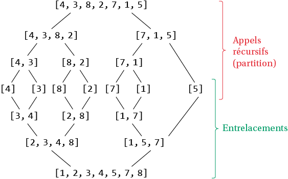

# <center><div class = "titre1">Méthode "diviser pour régner"</div></center>

> *Le commandement du grand nombre est le même pour le petit nombre, ce n'est qu'une question de division en groupes.*  
> <span style="display:block; margin: 10px 0px 0px 0px; font-weight : bold;">孙子兵法 $~~$VIe siècle avant JC</span>

<span style="color :#f30012; font-weight: bold;">Une technique souvent efficace, lorsqu’elle est possible, consiste à diviser un problème en plusieurs sous-problèmes indépendants, puis à les résoudre récursivement.</span>

## <div class = "encadré2">Principe</div>
<div class="couleur_puce13" markdown = "1">

* Le paradigme de programmation « diviser pour régner » (ou *divide and conquer*) consiste à ramener la résolution d’un problème dépendant d’un entier $~n~$ à la résolution d'un ou plusieurs sous-problèmes indépendants dont la taille des entrées passe de $~n~$ à $~\displaystyle\frac{n}{2}~$ ou une fraction de $~n$.
* Les algorithmes ainsi conçus s’écrivent de manière naturelle de façon récursive. Le procédé « diviser pour régner » est un cas particulier de la récursivité, où la taille du problème est divisée à chaque appel récursif plutôt que seulement réduite d’une unité.
* On va pouvoir mettre au point un algorithme *diviser pour régner* lorsqu'on pourra résoudre un problème en trois étapes :

</div>
<div class="decal5" markdown = "1">
<div class="list5_1" markdown = "1">

1. __Diviser__ : transformer un problème en sous-problèmes de taille plus petite (typiquement deux fois plus petite).
2. __Régner__ : ici *conquérir* serait plus approprié car ce terme donne une vision plus dynamique du phénomène. On conquiert chaque sous-problème en appelant récursivement notre méthode de division sur des sous-problèmes de plus en plus petits jusqu'à devenir résolvables en temps constant.
3. __Reconstruire__ : on combine tous les sous-problèmes résolus de proche en proche jusqu'à obtenir la solution du problème initial.

</div>
</div>

## <div class = "encadré2">Exemples</div>

### <div class = "encadré3">L’exponentiation rapide</div>
<div class="couleur_puce17etoi" markdown = "1">

* Le calcul de la puissance d’un nombre définie par $~a^0=1~$ et $~a^n=a×a^{n−1}~$ n’est pas optimal. Il peut être amélioré de la manière suivante :

</div>
<div class="decal5" markdown = "1">
<div class="couleur_puce17" markdown = "1">

* $a^0=1$
* Si $~n~$ est pair, $~a^n=(a×a)^{\frac{n}{2}}$
* Sinon $~a^n=a×(a×a)^{\frac{n−1}{2}}$

</div>
</div>

!!! exercice2 "__Exercice : Ecrire deux versions de l'exponentiation rapide__"
    <div class="list7_1">

    1. Ecrire une version récursive de cet algorithme.
    2. Ecrire une version itérative de cet algorithme.
    3. Comparer les temps d'exécution des versions précédentes ainsi que celui de la version récursive "classique". 

    </div>
    <center>
    [Correction de l'exercice :material-cursor-default-click:](Correction_des_exos_du_cours.md#Correction-de-lexercice-du-cours){:target="_blank" .md-button}
    </center>

Dans sa version récursive, la taille du problème est donc divisée par deux à chaque appel récursif. <span style="display: block; margin: 10px 0 0px 0;">Ici la complexité en temps dans le pire des cas de cet algorithme est en $~\mathcal{O}(\operatorname{log_{2}}(n))$, c'est-à-dire une complexité logarithmique.</span>

!!! note1 "__Complexité d’un algorithme récursif__"
    <div class="list20_1">

    1. __Principe général__  
    La complexité d’un algorithme récursif se fait par la résolution d’une équation de récurrence en éliminant la récurrence par substitution de proche en proche.

    </div>
    <div class="decal1">

    !!! exemple1 "__Exemple__"
        On rappelle ici la fonction qui implémente simplement et de façon récursive la puissance d'un nombre $~a~$ non nul :

        ```python linenums='1'

        def expo(a, n):
            if n == 0:
                return 1
            return a * expo(a, n-1)

        ```
    On note $~T(n)~$ le nombre d'opérations nécessaires pour évaluer cette fonction sur un problème de taille $~n$.  
    <span style="display:block; margin: 5px 0px 0px 0px;">
    On a alors $~T(0)=2~$ (il y a un test (comparaison de deux réels (<span style="color :red; font-weight: bold">ligne 2</span>)) et le renvoi de la valeur 1 (<span style="color :red; font-weight: bold">ligne 3</span>)).</span>
    <span style="display:block; margin: 8px 0px 0px 0px;">
    Et pour tout entier $~n~$ tel que $~n≥1~$ : $~T(n)=3+T(n-1)~$ (il y a un test (<span style="color :red; font-weight: bold">ligne 2</span>), un produit (<span style="color :red; font-weight: bold">ligne 4</span>), le renvoi d'une valeur (<span style="color :red; font-weight: bold">ligne 4</span>) et l'appel récursif sur un problème de taille $~n-1~$ (<span style="color :red; font-weight: bold">ligne 4</span>)).</span>
    <span style="display:block; margin: 10px 0px 0px 0px;">
    Ainsi, $~T(n)=3+T(n-1)~$ $~\Leftrightarrow~$ $~T(n)=3+(3+T(n-2))~$ soit $~T(n)=2×3+T(n-2)~$</span>
    $~~~~~~~~~~~~~~~~~~~~~~~~~~~~~~~~~~~~~~~~~~~~~~~~\Leftrightarrow~$ $~T(n)=2×3+(3+T(n-3))~$ soit $~T(n)=3×3+T(n-3)~$  
    $~~~~~~~~~~~~~~~~~~~~~~~~~~~~~~~~~~~~~~~~~~~~~~~~\Leftrightarrow~$ $~...~$  
    $~~~~~~~~~~~~~~~~~~~~~~~~~~~~~~~~~~~~~~~~~~~~~~~~\Leftrightarrow~$ $~T(n)=3×n+T(0)~$  
    $~~~~~~~~~~~~~~~~~~~~~~~~~~~~~~~~~~~~~~~~~~~~~~~~\Leftrightarrow~$ $~T(n)=3×n+2~$  
    <span style="display:block; margin: 10px 0px 0px 0px;">
    On en déduit que la complexité de cette fonction est en $~\mathcal{O}(n)$, c'est-à-dire une complexité linéaire.</span>
    <span style="display: block; margin: 10px 0px 0px 0px;">
    Voici quelques complexités classiques :</span>
    <center>

    | Relation de récurrence| Complexité  |
    | :-------------------: | :---------: |
    | $T(n)=T(n-1)+\mathcal{O}(1)$     |$~\mathcal{O}(n)$|
    | $T(n)=T(n-1)+\mathcal{O}(n)$      |$~\mathcal{O}(n^2)$|
    | $T(n)=2T(n-1)+\mathcal{O}(1)$     |$~\mathcal{O}(2^n)$|
    
    </center>

    </div>
    <div class="list20_2">

    2. __Cas d'un algorithme récursif du type "diviser pour régner"__  
    Dans le cas d'un algorithme récursif du type "diviser pour régner", le principe général de cet algorithme est de diviser un problème de taille $~n~$ en $~a≥1~$ sous-problèmes de taille $~\displaystyle\frac{n}{b}~$, avec $~b>1~$ :
    <span style="display:block; margin: 8px 0px 0px 0px;">
    <center>$T(n)=a×T(\displaystyle\frac{n}{b})+f(n)$</center></span>

    </div>
    <div class="decal1">
    <div class="couleur_puce42">

    * $T(n)~$ est le nombre d'opérations nécessaires pour évaluer une fonction récursive sur un problème de taille $~n$.
    * $a~$ est le nombre de sous-problèmes.
    * $b~$ est le facteur de réduction de la taille des sous-problèmes.
    * $f(n)~$ décrit le coût de la décomposition du problème et de la recomposition des résultats.

    </div>
    En pratique, pour déterminer la complexité d’un algorithme récursif du type "diviser pour régner", on utilise le <a href="https://fr.wikipedia.org/wiki/Master_theorem" target="_blank">Master Theorem</a> (hors-programme) qui classe l’algorithme suivant 3 cas en fonction de ce qui est le plus coûteux entre les calculs réalisés à chaque appel et ceux des appels récursifs.  
    <span style="display:block; margin: 8px 0px 0px 0px;">
    Voici quelques complexités typiques d'algorithmes récursifs du type "diviser pour régner" :</span>

    <center>

    | Relation de récurrence| Complexité  |
    | :-------------------: | :---------: |
    | $T(n)=T(\displaystyle\frac{n}{2})+\mathcal{O}(1)$     |$~\mathcal{O}(\operatorname{log_{2}}(n))$|
    | $T(n)=2T(\displaystyle\frac{n}{2})+\mathcal{O}(1)$     |$~\mathcal{O}(n)$|
    | $T(n)=2T(\displaystyle\frac{n}{2})+\mathcal{O}(n)$     |$~\mathcal{O}(n\operatorname{log_{2}}(n))$|
    
    </center>

    </div>

### <div class = "encadré3">Le tri fusion</div>

Le tri fusion permet de trier une liste `#!python lst` selon le principe « diviser pour régner ».
<div class="couleur_puce17etoi" markdown="1">

* Pour rassembler deux listes `#!python lst1` et `#!python lst2` déjà triées, on peut les __interclasser__ de manière suivante : 

</div>
<div class="decal5" markdown = "1">
<div class="couleur_puce17" markdown = "1">

* on compare les plus petits éléments de chacune d’elles ;
* on place le plus petit des deux dans une nouvelle liste `#!python lstn` ;
* on poursuit cette opération jusqu’à épuisement de l’une des deux listes ;
* on complète alors `#!python lstn` en ajoutant à la fin de celle-ci les éléments de la liste non vide.

</div>
</div>
<div class="couleur_puce17etoi" markdown="1">

* Le tri fusion est alors défini de la manière suivante :

</div>
<div class="decal5" markdown = "1">
<div class="couleur_puce17" markdown = "1">

* si la liste `#!python lst` a au plus un élément : elle est déjà triée.
* si la liste `#!python lst` a deux éléments ou plus, on partage `#!python lst` en deux sous-listes de même taille, à un élément près, puis on appelle récursivement la fonction sur chacune des sous-listes et on interclasse les sous-listes triées.

</div>
</div>

??? Exemple1 "__Exemple illustré par un schéma__"
    <center>
    
    </center>
<div class="couleur_puce17etoi" markdown="1">

* Exemple de programme en Python :
```python
def interclassement(lst1, lst2):
    lstn = []
    n1, n2 = len(lst1), len(lst2)
    i1, i2 = 0, 0 # i1 et i2 sont les indices dans lst1 et lst2
    while i1 < n1 and i2 < n2:
        if lst1[i1] < lst2[i2]:
            lstn.append(lst1[i1])
            i1 += 1
        else:
            lstn.append(lst2[i2])
            i2 += 1
    return lstn + lst1[i1:] + lst2[i2:]

def fusion(lst):
    if len(lst) <= 1:
        return lst
    m = len(lst) // 2
    return interclassement(fusion(lst[:m]), fusion(lst[m:]))

```

</div>
