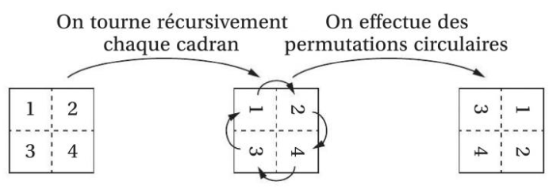
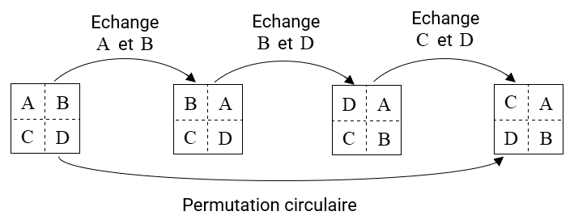

# 

Rotation d'un quart de tour d'une image

L'objectif de ce problème est d'implémenter des algorithmes permettant de faire tourner une image d'un quart de tour dans le sens des aiguilles d'une montre.
Une image est un tableau (bidimensionnel) composé de pixels. Un pixel est, dans le cadre du codage RGB, un triplet d'entiers compris entre `#!python 0` et `#!python 255` correspondant aux intensités lumineuses respectives du rouge (*red*), du vert (*green*) et du bleu (*blue*).
Par exemple, un pixel de valeur `#!python (0, 0, 0)` est noir ; un pixel de valeur `#!python (255, 255, 255)` est blanc ; un pixel de valeur `#!python (0, 255, 0)` est vert et un pixel de valeur `#!python (255, 255, 0)` est jaune.
Danc cet exercice, on exploitera une image carrée comportant 2*n* lignes et colonnes.
Nous utilisons le module PIL qui permet de gérer aisément les images.

La partie qui nous intéresse de ce module peut être importée à l'aide de :

`#!python from PIL import Image`

On ouvre alors l'image à l'aide de :

`#!python img = Image.open("nom_du_fichier")`

Les dimensions de l'image peuvent être récupérées à l'aide de :

`#!python largeur, hauteur = img.size`

La valeur du pixel d'abscisse `#!python x` et d'ordonnée `#!python y` peut être récupérée à l'aide de :

`#!python img.getpixel((x, y))`

On rappelle que la première coordonnée correspond à l'abscisse dans l'image et la seconde à l'ordonnée, l'origine du repère étant en haut à gauche de l'image, les axes allant vers la droite et vers le bas.

On peut affecter le triplet `#!python (r, g, b)` au pixel de coordonnées `#!python (x, y)` à l'aide de :

`#!python img.putpixel((x, y), (r, g, b))`

L'image peut être sauvegardée à l'aide de :

`#!python img.save("nom_du_fichier")`

Elle peut être affichée à l'aide de :

`#!python img.show()`

Enfin, une nouvelle image (noire par défaut, elle sera modifiée par la suite) peut être créée à l'aide de :

`#!python im = Image.new("RGB", (largeur, hauteur))`

## 
Partie A : Algorithme simple de rotation d'un quart de tour

1. Enregistrer l'image [horloge.png](images/horloge.png) dans votre environnement de travail.
2. Créer une nouvelle image, `#!python img_rot`, de même format, destinée à stocker l'image obtenue par rotation.
3. Pour une image `#!python img` carrée de taille *n* × *n*, l'image `#!python img_rot` obtenue par rotation d'un quart de tour dans le sens des aiguilles d'une montre a pour pixel `#!python (x, y)` celui initialement en `#!python (y, n - 1 - x)` dans `#!python img`.

Ecrire une suite d'instructions qui stocke dans la nouvelle image celle obtenue par rotation de la précédente et qui affiche le résultat. 
4. Quelle est la complexité temporelle de cet algorithme ? Et sa complexité spatiale ? (C'est-à-dire l'ordre de grandeur de la taille mémoire utilisée, en fonction de *n*.)

## 
Partie B : Rotation d'une image en espace mémoire constant

La suite de ce problème a pour objectif de réaliser un algorithme permettant d'effectuer une rotation d'un quart de tour d'une image sans utiliser d'espace mémoire supplémentaire. Cet algorithme, lent, n'est pas utilisé en pratique.

1. Ecrire une procédure `#!python echange_pix(image, x0, y0, x1, y1)` qui échange les pixels de coordonnées `#!python (x0, y0)` et `#!python (x1, y1)` de l'image passée en paramètre.

On adopte dans cet exercice une stratégie diviser pour régner. L'image est divisée en quatre quadrants. Chaque quadrants est tourné récursivement puis une permutation circulaire des quadrants est effectuée.

    

La permutation circulaire est réalisée en enchaînant plusieurs échanges de quadrants.
Le schéma suivant présente un exemple de stratégie permettant de le faire :

2. Ecrire une procédure `#!python echange_quadrant(image, x0, y0, x1, y1, n)` qui échange deux quadrants carrés de taille *n* dont le premier a pour coordonnées de départ `#!python (x0, y0)` et le second pour coordonnées de départ `#!python (x1, y1)`.
3. Ecrire une procédure récursive `#!python tourne_quadrants(image, x0, y0, n)` qui prend en argument l'image considérée, un couple de coordonnées de départ `#!python (x0, y0)`, une taille *n* ; qui applique récursivement des rotations à chaque quadrant, puis qui applique les permutations circulaires échangeant les quatre quadrants pour finaliser la rotation.
4. Ecrire une procédure effectuant la rotation de quart de tour de l'image. Enregistrer l'image et l'afficher.

[Correction de l'exercice :material-cursor-default-click:](Correction_exo_rotation.md#Rotation-dun-quart-de-tour-dune-image-:-correction){:target="_blank" .md-button}

