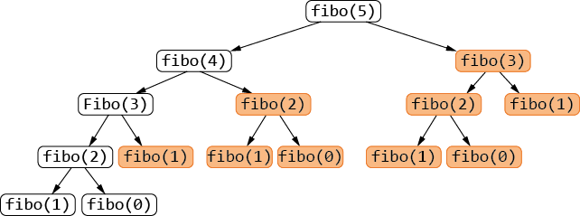
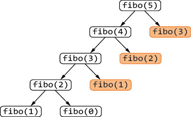

# <center><div class = "titre1">Optimisation d'une fonction récursive</div></center>

## <div class = "encadré2">Recherche dichotomique dans une liste triée</div>
<div class="couleur_puce13" markdown="1">

* Soit `#!python lst` une liste de nombres triée dans l’ordre croissant et soit `#!python x` un nombre.
<span style="display:block; margin: 5px 0px 0px 0px;">Nous pouvons adapter l’__algorithme de recherche dichotomique__ vu cette année de manière récursive : on teste si l’élément médian de `#!python lst` est égal à `#!python x`, sinon on cherche sa présence à gauche ou à droite dans `#!python lst` suivant qu’il est plus grand ou plus petit que `#!python x`.</span>
<span style="display:block; margin: 5px 0px 0px 0px;">
Cet algorithme s’arrête lorsque `#!python lst` est vide.</span>

</div>
<div class="decal1">

```python
def recherche_dic(lst, x):
    if len(lst) == 0:
        return False
    m = len(lst) // 2
    if lst[m] == x:
        return True
    elif lst[m] < x:
        return recherche_dic(lst[m+1:], x)
    else:
        return recherche_dic(lst[:m], x)

```

</div>
<div class="couleur_puce13" markdown="1">

* En apparence, cette fonction a la même complexité que la recherche dichotomique dans une liste triée écrite de manière itérative, donc en $~\mathcal{O}(\operatorname{log_{2}}(n))$. Néanmoins, le *slicing* a un coût caché qu’il faut prendre en compte. A cause de ce dernier, la complexité en temps dans le pire des cas de cet algorithme est en $~\mathcal{O}(n)$.
* L’utilisation d’une __fonction locale__ stockant les indices gauches et droits encadrant les indices où peut être trouvé l’élément aurait permis de réduire cette complexité :

</div>
<div class="decal1" markdown="1">

!!! ampoule "__fonction locale__"
    Une __fonction locale__ est une fonction définie à l’intérieur d’une fonction. Elle permet, notamment dans le cadre de la récursivité, d’ajouter des arguments à une fonction.

</div>
<div class="decal1" markdown="1">

```python
def recherche_dic2(lst, x):
    def rec(i, j, x):
        if i > j:
            return False
        m = (i +j) // 2
        if lst[m] == x:
            return True
        elif lst[m] < x:
            return rec(m + 1, j, x)
        else:
            return rec(i, m - 1, x)
    return rec(0, len(lst) - 1, x)

assert recherche_dic2([1, 2, 3, 4, 5, 7, 8], 2) == True

```
</div>
<div class="couleur_puce13" markdown="1">

* La fonction `#!python recherche_dic2` n’effectue que des opérations élémentaires à chaque appel récursif. Le fait d’utiliser comme arguments supplémentaires les indices `#!python i` et `#!python j` tels que `#!python lst[i] <= x <= lst[j]` permet d’éviter d’effectuer des opérations directement sur la liste et réduit le coût.  
Plus précisément, le coût ici est en $~\mathcal{O}(\operatorname{log_{2}}(n))$.

</div>

!!! exercice2 "__Exercice 1 : Améliorer une fonction récursive en utilisant une fonction locale__"
    On souhaite écrire une fonction qui prend en entrée une chaîne de caractères et qui renvoie la chaîne de caractères miroir, c'est-à-dire obtenue en lisant la première chaîne à l'envers. Par exemple, le miroir de `#!python "bons"` est `#!python "snob"`.
    <div class="list7_1">

    1. Ecrire une fonction itérative qui renvoie le miroir d'une chaîne de caractères.
    2. <span style="color: rgb(244, 251, 26); font-weight: bold; margin: 0px 10px 0px 0px;">a.</span> En se servant du *slicing*, écrire une fonction récursive qui retourne le miroir d'une chaîne de caractères.
    <span style="display: block; margin: 5px 0px 0px 0px;"></span>
    <span style="color: rgb(244, 251, 26); font-weight: bold; margin: 0px 10px 0px 0px;">b.</span> Quelle est la complexité de la fonction ainsi écrite ?
    3. <span style="color: rgb(244, 251, 26); font-weight: bold; margin: 0px 10px 0px 0px;">a.</span> Dans le but d'améliorer cette complexité, écrire une fonction récursive qui renvoie le miroir d'une chaîne de caractères, sans utiliser le *slicing*, mais en se servant d'une fonction locale.
    <span style="display: block; margin: 5px 0px 0px 0px;"></span>
    <span style="color: rgb(244, 251, 26); font-weight: bold; margin: 0px 10px 0px 0px;">b.</span> Quelle est la complexité de la fonction ainsi écrite ?
    4. On rappelle ici qu'un palindrome est une chaîne de caractères qui est égale à son miroir : par exemple, `#!python "anna"` et `#!python "kayak"` sont des palindromes.  
    <span style="display: block; margin: 5px 0px 0px 0px;">En utilisant les fonctions précédentes, écrire une fonction qui teste si une chaîne de caractères est un palindrome ou non.</span>

    </div>
    <center>
    [Correction de l'exercice 1 :material-cursor-default-click:](Correction_des_exos_du_cours.md#correction-de-lexercice-1){:target="_blank" .md-button}
    </center>

## <div class = "encadré2">Suite de Fibonacci et récursivité explosive</div>

### <div class = "encadré3">Fonction récursive naïve de Fibonacci</div>
On rappelle que la définition mathématique de la suite de Fibonacci est :
<center>
<span style="display:block; margin: 5px 0px 0px 0px;">
$(f_{n}):\left\{\begin{array}{lll} f_{0}=0\\f_{1}=1\\f_{n}=f_{n-1}+f_{n-2}\,\,\,\,\,\,\,\mbox{pour}\,\,\, n > 1\end{array}\right.$
</span></center>
<span style="display:block; margin: 10px 0px 0px 0px;">
Dans le chapitre <span style="font-family: 'Trebuchet MS';font-weight: bold">Récursivité</span>, nous avons vu une écriture naïve de ce calcul :
</span>

```python
def fibo_rec(n):
    if n < 2:
        return n
    return fibo_rec(n-1) + fibo_rec(n-2)

```

Si cette fonction renvoie bien le bon résultat, les valeurs un tant soit peu élevées de $~n~$ donnent des calculs longs (il suffit d'essayer de calculer `#!python fibo_rec(37)` par exemple).  
<span style="display:block; margin: 5px 0px 0px 0px;">On obtient l'__arbre des appels__ suivant en lançant `#!python fibo_rec(5)` où l'on voit que la démarche n'est pas efficace car de nombreux appels (indiqués en orange) sont __redondants__.</span>

{ .image width=85%}

<span style="display:block; margin: 15px 0px 0px 0px;">Une analyse de complexité explique ce temps de calcul. Si $~T_{n}~$ désigne le nombre d'opérations pour calculer `#!python fibo_rec(n)`, on obtient la relation de récurrence $~T_{n+2}=T_{n+1}+T_{n}+1~$. Or cette suite croît encore plus vite que la suite de Fibonacci, qui a déjà un comportement exponentiel.</span>

### <div class = "encadré3">Fonction récursive avec mémoïsation</div>

Une solution possible consiste à garder en mémoire les termes de la suite déjà calculés.
<span style="display:block; margin: 8px 0px 0px 0px;">Cette technique de <a href="https://fr.wikipedia.org/wiki/M%C3%A9mo%C3%AFsation" target="_blank">__mémoïsation__</a> (procédé où on garde en mémoire les valeurs déjà calculées) peut par exemple être traitée en créant un dictionnaire qui stocke ces valeurs, ainsi qu’une fonction locale :</span>

```python
def fibo_rec(n):
    memo_fibo = {}
    def fib(n):
        if n in memo_fibo:
            return memo_fibo[n]
        if n < 2:
            memo_fibo[n] = n
        else:
            memo_fibo[n] = fib(n-1) + fib(n-2)
        return memo_fibo[n]
    return fib(n)

```

L'arbre des appels correspondant au lancement de `#!python fibo_rec(5)` est maintenant beaucoup plus simple car tous les appels indiqués en orange ont déjà été calculés et leur valeur est immédiatement disponible.
<span style="display:block; margin: 25px 0px 0px 0px;">

{ .image width=60%}

</span>

!!! exercice2 "__Exercice 2 : Améliorer une fonction récursive en utilisant la mémoïsation__"
    On définit la suite de Tribonacci par la relation de récurrence : $~u_0=0~$, $~u_1=u_2=1~$ et, pour tout entier $~n$, $~u_{n+3}=u_{n+2}+u_{n+1}+u_{n}~$.
    <div class="list7_1">

    1. Quel est l'écueil à éviter lorsqu'on programme le calcul du $~n$-ième terme de la suite de Tribonacci de manière récursive ?
    2. Proposer une version itérative du calcul de $~u_{n}$.
    3. Proposer une version récursive <u>efficace</u> du calcul de $~u_{n}~$ qui utilise un dictionnaire stockant les valeurs déjà calculées de $~u_{n}$.

    </div>
    <center>
    [Correction de l'exercice 2 :material-cursor-default-click:](Correction_des_exos_du_cours.md#correction-de-lexercice-2){:target="_blank" .md-button}
    </center>