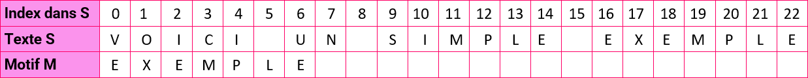
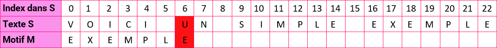
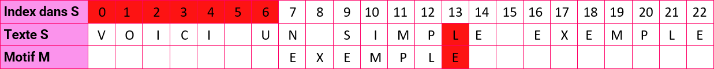
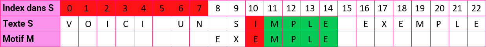
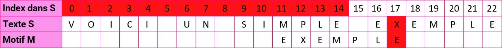
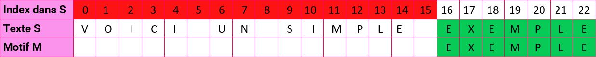
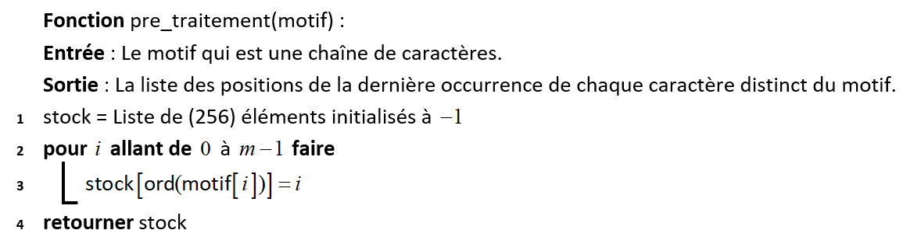
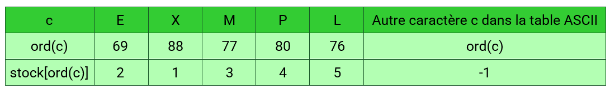
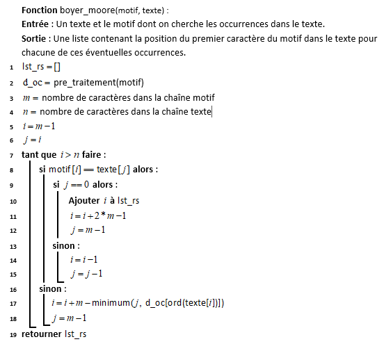

# <center><div class = "titre1" style="font-size: 1.9rem;">Recherche de motifs dans des chaînes de caractères</div></center>

Après la présentation d'une approche naïve du problème, nous introduisons les heuristiques de l'algorithme de Boyer-Moore.

## <div class = "encadré2">Le problème</div>
<div class="couleur_puce13" markdown="1">

* On part d'une séquence <span style="font-family: 'Trebuchet MS';font-weight: bold">S</span> dans laquelle on cherche un motif <span style="font-family: 'Trebuchet MS';font-weight: bold">M</span>. La longueur de <span style="font-family: 'Trebuchet MS';font-weight: bold">M</span> est souvent très petite devant celle de <span style="font-family: 'Trebuchet MS';font-weight: bold">S</span>. On souhaite trouver toutes les occurrences de <span style="font-family: 'Trebuchet MS';font-weight: bold">M</span> dans <span style="font-family: 'Trebuchet MS';font-weight: bold">S</span>.
* Ce problème correspond par exemple à la recherche qu'on peut faire dans un document bureautique ou une page web, mais aussi à la recherche d'un motif donné dans une séquence génomique. Par exemple, si on cherche le motif `#!python M = 'GACA'` dans la chaîne `#!python S = 'GCCGACTGACACCAGACATCG'`, on le trouve 2 fois (en position 7 et 14, en numérotant 0 le premier caractère d'une chaîne).
* <span style="font-family: 'Trebuchet MS';font-weight: bold">M</span> et <span style="font-family: 'Trebuchet MS';font-weight: bold">S</span> sont stockés sous forme de chaînes de caractères ou de tableaux et on considère que l'accès à un caractère par son indice se fait en $\small{\mathcal{O}(1)}$, c'est-à-dire en temps constant.

</div>

## <div class = "encadré2">Approche "naïve"</div>

### <div class = "encadré3">En utilisant les fonctions natives de Python</div>

On peut tout d'abord utiliser simplement les facilités de Python : `#!python 'fait' in 'il fait beau'` renvoie `#!python True` mais ne donne pas les positions ni le nombre d'occurrences trouvées. Il est également difficile d'en évaluer la complexité algorithmique à moins d'aller voir le détail de l'implémentation Python. 

### <div class = "encadré3">Méthode "naïve" de référence</div>

Ecrivons cette méthode naïve avec une boucle <span style="font-family: 'Trebuchet MS';font-weight: bold">for</span> et une boucle <span style="font-family: 'Trebuchet MS';font-weight: bold">while</span> :

```python
def recherche_naive(S, M):
    n = len(S)
    m = len(M)
    # A partir de l'indice n-m+1,
    # il n'y a plus de place pour M.
    for i in range(n - m + 1):
        j = 0
        while j < m and S[i + j] == M[j]:
            j += 1
            if j == m:
                print(f"{M} trouvé à la position {i}") 
    
```

L'utilisation de <span style="font-family: 'Trebuchet MS';font-weight: bold">while</span> permet de s'arrêter dès qu'un caractère ne correspond pas.


### <div class = "encadré3">Complexité algorithmique de la recherche naïve</div>
<div class="couleur_puce17" markdown="1">

* L'opération élémentaire est la comparaison entre 2 cases des chaînes <span style="font-family: 'Trebuchet MS';font-weight: bold">S</span> et <span style="font-family: 'Trebuchet MS';font-weight: bold">M</span>.
* Pour la complexité de cette recherche, le pire des cas se présente si on est amené à parcourir les deux boucles dans leur intégralité comme par exemple si <span style="font-family: 'Trebuchet MS';font-weight: bold">M</span> se répète dans <span style="font-family: 'Trebuchet MS';font-weight: bold">S</span> comme `#!python M = 'BOA'` dans `#!python S = 'BOABOABOABOABOABOABOA'`.  
Dans ce cas, la complexité est en $\small{\mathcal{O}((n-m)m)}$.  
Ce calcul peut s'avérer long pour de grandes valeurs de $\small{n}$, d'où le besoin d'une approche plus efficace.

</div>

## <div class = "encadré2">Une approche plus élaborée : l'algorithme de Boyer-Moore</div>
Cet algorithme a été développé en 1977 par Robert S. Boyer et J Strother Moore.
<span style="display:block; margin: 5px 0px 0px 0px;">L'idée est d'améliorer la recherche en utilisant certaines __heuristiques__ dont nous détaillons la première.</span>

!!! ampoule "__Mot clé__"
    Du grec ancien εὑρίσκω, heuriskô, « je trouve », une __heuristique__ en informatique est une méthode de calcul efficace (en termes de complexité algorithmique) mais pas nécessairement optimale ou exacte (parfois solution approchée).

### <div class = "encadré3">Première heuristique</div>

L'algorithme est aussi à fenêtre glissante comme dans la recherche naïve mais la comparaison du motif avec la chaîne, soit `#!python M[0:m]` avec `#!python S[i:i+m]`, se fait de droite à gauche, en commençant par la fin ! 
<span style="display:block; margin: 5px 0px 0px 0px;">La première heuristique, souvent appelée celle du "mauvais caractère", va tirer parti du parcours inversé en testant d'abord s'il y a correspondance pour le dernier caractère du motif.</span>
<span style="display:block; margin: 10px 0px 0px 0px;"></span>

!!! exemple1 "__Exemple__"
    Par exemple, si l'on cherche `#!python M = 'EXEMPLE'` dans `#!python S = 'VOICI UN SIMPLE EXEMPLE'` :
    { .image }
    <span style="display:block; margin: 20px 0px 0px 0px;">
    On teste la correspondance sur la dernière lettre du motif. Echec ici !</span>
    { .image }
    <span style="display:block; margin: 20px 0px 0px 0px;">
    Comme la lettre `#!python U` n'est pas dans <span style="font-family: 'Trebuchet MS';font-weight: bold">M</span>, on peut décaler <span style="font-family: 'Trebuchet MS';font-weight: bold">M</span> de toute sa longueur :</span>
    { .image }
    <span style="display:block; margin: 20px 0px 0px 0px;">
    Cela ne correspond pas, mais la lettre `#!python L` se trouve dans <span style="font-family: 'Trebuchet MS';font-weight: bold">M</span>, on décale alors de `#!python +1` pour aligner la dernière occurrence de `#!python L` dans <span style="font-family: 'Trebuchet MS';font-weight: bold">M</span>.</span>
    { .image }
    <span style="display:block; margin: 20px 0px 0px 0px;">
    On constate une correspondance partielle mais une erreur entre `#!python I` et `#!python E`. Comme `#!python I` n'est pas dans <span style="font-family: 'Trebuchet MS';font-weight: bold">M</span>, on peut décaler <span style="font-family: 'Trebuchet MS';font-weight: bold">M</span> afin de le positionner juste après la lettre pour laquelle il n'y a pas correspondance :
    </span>
    { .image }
    <span style="display:block; margin: 20px 0px 0px 0px;">
    `#!python L` et `#!python E` ne correspondent pas. On décale donc pour aligner la dernière occurrence de `#!python L` dans <span style="font-family: 'Trebuchet MS';font-weight: bold">M</span> :</span>
    { .image }
    <span style="display:block; margin: 20px 0px 0px 0px;">
    Bingo ! Le motif a été trouvé en 16 comparaisons alors que <span style="font-family: 'Trebuchet MS';font-weight: bold">S</span> est de longueur 22.
    </span>

<span style="display:block; margin: 10px 0px 0px 0px;">Pour que l'algorithme sache de combien de caractères il doit décaler le motif, il faut que celui-ci soit pré-traité. Cela consiste à garder dans une liste en mémoire la position de la dernière occurrence de chaque caractère distinct du motif (sauf le dernier car c'est déjà lui qu'on utilise pour comparer). Pour cela, on utilise l'alphabet ASCII qui contient 256 caractères. On peut donc proposer la fonction de prétraitement suivante :</span>
{ .image width=85%}

!!! rocket "__Rappel__"
    `#!python ord(c)` est une fonction qui renvoie le nombre entier correspondant au caractère `#!python c` dans la table ASCII.

!!! exemple1 "__Retour sur l'exemple__"
    Pour le motif de notre exemple, on a :
    { .image width=95%}

<span style="display:block; margin: 10px 0px 10px 0px;">Alors l'algorithme de Boyer-Moore donné ci-dessous renvoie la liste des positions du motif éventuellement trouvées :</span>
{ .image width=85%}

!!! exercice5 "__Exercice__"
    <div class="list12_1">

    1. Proposer une implémentation en Python d'un algorithme naïf permettant la recherche d'un motif de longueur $~m~$ dans une chaîne de caractères de longueur $~n$. On pourra prendre pour les tests :

    </div>
    <div class="decal1">
    <div class="couleur_puce1">

    * Le motif `#!python 'CGGCTG'`.
    * La chaïne :
    ``` python 
    'ATAACAGGAGTAAATAACGGCTGGAGTAATAACAGGAGTAAATAACGGCTGGAGTAATAACAGGAGTAAATAACGGCTGGAGTATAACAGGAGTAAATAACGGCTGGAGTA'`
    ```

    </div>
    </div>
    <div class="list12_2">

    2. Implémenter l'algorithme de Boyer-Moore donné ci-avant. On pourra prendre pour les tests les mêmes motifs et texte que la question précédente.
    3. Comparer, avec Python, les temps d'exécution pour la recherche du motif donné avec les deux solutions précédentes. Pour que ce test soit intéressant, il faut constituer une chaîne de texte d'1 million de caractères pris au hasard dans l'ensemble `#!python [A, T, C, G]`. On fera la même chose pour constituer un motif de 1 000 caractères.

    </div>
    <div class="decal1">

    !!! tools3 "__Rappel__"
        Pour mesurer le temps d'exécution d'un programme Python, on peut utiliser la fonction `#!python time()` du module <span style="font-family: 'Trebuchet MS';font-weight: bold">time</span> comme le montre l'exemple ci-dessous. Cette fonction renvoie le temps en seconde qu'il s'est écoulé depuis le 1<sup>er</sup> janvier 1970.
        
        ```python
        import time
        debut = time.time()
        ....
        fin = time.time()
        print("temps d'exéction' : ", fin - debut)
        ```  

    </div>
    <center>
    [Correction de l'exercice :material-cursor-default-click:](Correction_des_exos_du_cours.md#Correction-de-lexercice-du-cours){:target="_blank" .md-button}
    </center>

### <div class = "encadré3">Seconde heuristique</div>

Pour la seconde heuristique, appelée celle du "bon suffixe", un tableau `#!python suf` est utilisé dont chaque entrée `#!python suf[i]` contient le décalage du motif en cas d'erreur de correspondance en position `#!python i - 1`, si le suffixe (la fin) du motif commençant à la position `#!python i` correspond.

