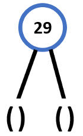
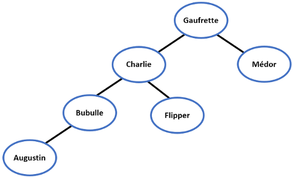
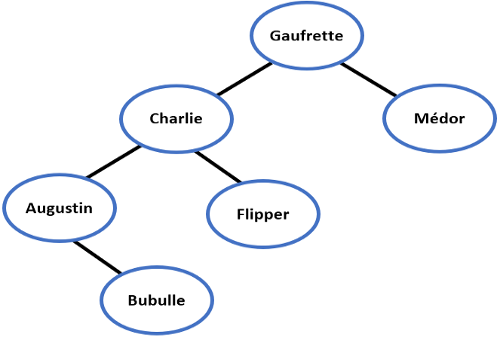

# <center><div class = "titre2">Correction des exercices du cours</div></center>

### <div class = "encadré_exo"> __Correction de l'exercice 2__ </div>

{: .image}

### <div class = "encadré_exo"> __Correction de l'exercice 3__ </div>
<div class="list1_1" markdown="1">

1. La racine de cet arbre est le noeud 2 situé tout en haut de l'arbre.
2. La hauteur de cet arbre est 3 et sa taille est 10.
3. Le noeud 7 a trois fils : les noeuds 2, 10 et 6.
4. Le noeud 11 a pour père le noeud 6.
5. Les feuilles de cet arbre sont les noeuds 2, 10, 5, 11 et 4.

</div>

### <div class = "encadré_exo"> __Correction de l'exercice 4__ </div>
<div class="list1_1" markdown="1">

1. `#!python B = arbre_cons(7, arbre_cons(29, arbre_vide(), arbre_vide()), arbre_cons(13,` `#!python arbre_vide(), arbre_cons(88, arbre_vide(), arbre_vide())))`
2. `#!python C = arbre_cons(5, arbre_cons(12, A, arbre_vide()), B)`
3. Il s'agit du sous-arbre gauche du sous-arbre droit de `#!python C` :
{: .image}
4. L'instruction `#!python est_vide(sous_arbre_droit(sous_arbre_gauche(sous_arbre_gauche(C))))` renvoie `#!python True`.
5. L'instruction `#!python cle(sous_arbre_droit(sous_arbre_droit(C)))` renvoie la valeur `#!python 13`.

</div>

### <div class = "encadré_exo"> __Correction de l'exercice 5__ </div>
<div class="list1_1" markdown="1">

1. 
``` python
def est_vide(self):
    return not self.valeur

```
2.  
``` python
def cle(self):
    return self.valeur

```
3.  
``` python
def sous_arbre_gauche(self):
    if not self.est_vide():
        if self.G:
            return self.G
        return Arbre()

```
4.  
``` python
def sous_arbre_droit(self):
    if not self.est_vide():
        if self.D:
            return self.D
        return Arbre()

```
5.  
``` python
def est_feuille(self):
    if self.est_vide():
        return False
    
    droit, gauche = self.sous_arbre_droit(), self.sous_arbre_gauche()
    return droit.est_vide() and gauche.est_vide() 

```

</div>

### <div class = "encadré_exo"> __Correction de l'exercice 6__ </div>

``` python
def hauteur(self):

    if self.est_vide():
        return -1
    
    gauche, droit = self.sous_arbre_gauche(), self.sous_arbre_droit()
    return 1 + max(gauche.hauteur(), droit.hauteur())

```

### <div class = "encadré_exo"> __Correction de l'exercice 7__ </div>

``` python
def nb_feuilles(self):
    
    if self.est_vide():
        return 0

    if self.est_feuille():
        return 1

    gauche, droit = self.sous_arbre_gauche(), self.sous_arbre_droit()
    return gauche.nb_feuilles() + droit.nb_feuilles()

```

### <div class = "encadré_exo"> __Correction de l'exercice 8__ </div>

``` python
def liste_parcours_infixe(self, L=None):
    
    if L is None:
        L = []
    
    if self.est_vide():
        return
    
    gauche, droit = self.sous_arbre_gauche(), self.sous_arbre_droit()
    gauche.liste_parcours_infixe(L)
    L.append(self.valeur)
    droit.liste_parcours_infixe(L)
    return L

```

### <div class = "encadré_exo"> __Correction de l'exercice 9__ </div>

``` python
def parcours_prefixe(self):
    
    if self.est_vide():
        return

    gauche, droit = self.sous_arbre_gauche(), self.sous_arbre_droit()
    print(self.cle(), end=" ")
    gauche.parcours_prefixe()
    droit.parcours_prefixe()

```

### <div class = "encadré_exo"> __Correction de l'exercice 10__ </div>

``` python
def parcours_postfixe(self):
    
    if self.est_vide():
        return

    gauche, droit = self.sous_arbre_gauche(), self.sous_arbre_droit()
    gauche.parcours_postfixe()
    droit.parcours_postfixe()
    print(self.cle(), end=" ")

```

### <div class = "encadré_exo"> __Correction de l'exercice 11__ </div>

``` python
def parcours_largeur(self):
        
    if not self.est_vide():
        f = File()
        f.enfiler(self)
        
        while not f.est_vide():
            tree = f.defiler()
            print(tree.cle(), end=' ')
            print('-----------------')
            
            gauche, droit = tree.sous_arbre_gauche(), tree.sous_arbre_droit()
            if not gauche.est_vide():
                f.enfiler(gauche)
            if not droit.est_vide():
                f.enfiler(droit)  

```

### <div class = "encadré_exo"> __Correction de l'exercice 12__ </div>
<div class="list1_2" markdown="1">

2. La ville contient $~26×26×26=17576~$ maisons.
3. On sait que la hauteur d’un arbre complet de taille $~n~$ est égale à $⌊\operatorname{log_{2}}(n)⌋$, donc ici, comme $~n=17576~$ et $⌊\operatorname{log_{2}}(17576)⌋=14$, on en déduit qu'il faut traverser au maximum $~14~$ rues pour trouver une maison quelconque.

</div>

### <div class = "encadré_exo"> __Correction de l'exercice 13__ </div>
<div class="list1_1" markdown="1">

1.  
{: .image}
2. Dans ce cas, on obtient :
{: .image}
L'arbre binaire de recherche n'est plus le même : __l'ordre dans lequel on insère les éléments est important__.

</div>

### <div class = "encadré_exo"> __Correction de l'exercice 14__ </div>

Le parcours infixe de cet arbre donne : `#!python 3, 5, 6, 8, 9, 11, 13, 88`.  

!!! book1 "__Propriété__"
    Un arbre binaire est un __ABR__ si seulement si la liste des valeurs des noeuds établie dans l’ordre infixe est strictement croissante.

### <div class = "encadré_exo"> __Correction de l'exercice 15__ </div>

``` python
def est_ABR(self):
    
    if self.est_vide():
        return False
    
    L = self.liste_parcours_infixe()
    return L == sorted(L)

```

### <div class = "encadré_exo"> __Correction de l'exercice 16__ </div>

``` python
def rechercher_element(self, e):
    if self.est_vide():
        return False
            
    if self.cle() == e:
        return  True
        
    gauche, droit = self.sous_arbre_gauche(), self.sous_arbre_droit()
        
    if self.cle() < e:
        return droit.rechercher_element(e)
            
    return gauche.rechercher_element(e)

```

### <div class = "encadré_exo"> __Correction de l'exercice 17__ </div>

``` python
def inserer_element(self, e):
    
    if self.est_vide():
        self.valeur = e
        return None
    
    assert self.est_ABR(), "Ce n'est pas un ABR"
        
    gauche, droit = self.sous_arbre_gauche(), self.sous_arbre_droit()
    if e <= self.cle():
        if gauche.est_vide():
            self.G = Arbre(e)
            return None
        return gauche.inserer_element(e)
    else:
        if droit.est_vide():
            self.D = Arbre(e)
            return None
        return droit.inserer_element(e)

```