# <center><div class = "titre1">Les arbres</div></center>

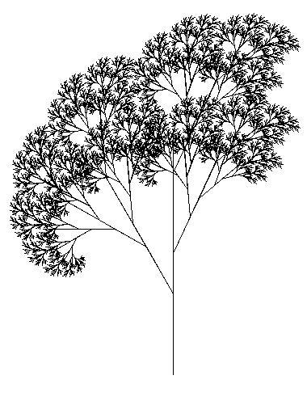{: .image}
<center>

*Arbre créé par un algorithme récursif*

</center>
## <div class = "encadré2">__Introduction__</div>

!!! probleme "__Problématique__"
    La notion de liste chaînée explorée dans un précédent chapitre est parfaite pour structurer un ensemble d'éléments destiné à être énuméré __séquentiellement__.  
    <span style="display: block; margin: 10px 0 0 0;">Comme on l'a vu avec la réalisation de piles et de files, cette structure permet également un accès simple, suivant le cas, au premier élément ou au dernier de la séquence.</span>
    <span style="display: block; margin: 10px 0 0 0;">Par contre l’accès à un élément situé à une position quelconque est plus problématique, puisqu'on doit parcourir les éléments les uns après les autres, apportant ainsi un temps d’accès proportionnel au nombre d’éléments parcourus soit une complexité moyenne en $\mathcal{O}(\small{n}$$)$.</span>

!!! notes1 "__Structures arborescentes__"
    Les __structures arborescentes__ forment une autre famille de structures chaînées, dans lesquelles le nombre de sauts à effectuer pour aller depuis le point de départ jusqu'à une position souhaitée est potentiellement bien moindre.
    <span style="display: block; margin: 10px 0 0 0;">Ces structures sont omniprésentes en informatique et nous en avons déjà observé une en classe de Première : l'arborescence des fichiers d'un ordinateurs.</span>

    {: .image}

    <span style="display: block; margin: 40px 0 0 0;">Pour accéder à un fichier par exemple, on parcourt des répertoires (en partant du répertoire racine), ce qui permet ensuite un accès rapide au fichier recherché. On imagine sans mal que si l'on devait parcourir une liste de fichiers jusqu’à obtenir le bon, le temps nécessaire à cet accès serait beaucoup plus grand, proportionnellement au nombre de fichiers de cette liste.</span>
    <span style="display: block; margin: 10px 0 0 0;">Ce principe d'un point de départ unique à partir duquel une structure chaînée se scinde à chaque étape en plusieurs branches donne l'idée générale de la structure d'*arbre* en informatique, qui est la base d'innombrables structures de données.</span>
    <span style="display: block; margin: 10px 0 0 0;">Cette structure permet en outre une organisation hiérarchique de l'information, qui la rend utile pour représenter des programmes, des formules de logique, le contenu de pages web, etc.</span>

## <div class = "encadré2">__Arbres quelconques__</div>
### <div class = "encadré3">__Définition et exemples__</div>

!!! book "__Définition__"
    Un __arbre__ est une structure hiérarchique permettant de représenter de manière symbolique des informations structurées.

??? exemple1 "__Exemple 1 : un arbre généalogique__"
    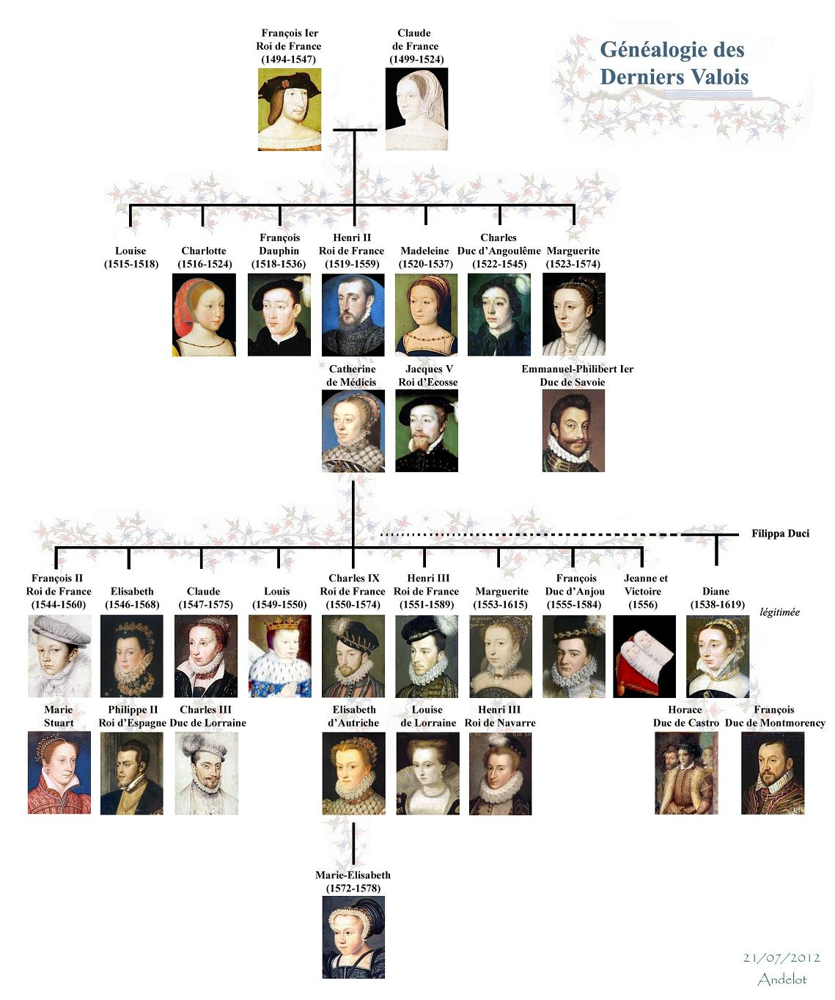{: .image width="75%" }
    <div class="gauche">*source :*<a href="http://derniersvalois.canalblog.com" target="_blank"> derniersvalois.canalblog</a></div>

??? exemple2 "__Exemple 2 : un arbre syntaxique__"
    Un __arbre syntaxique__ représente l’analyse d’une phrase à partir de règles de grammaire.
    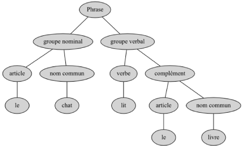{: .image}

??? exemple3 "__Exemple 3 : un arbre lexicographique__"
    Un __arbre lexicographique__, ou arbre en parties communes, ou dictionnaire, représente un ensemble de mots. Les préfixes communs à plusieurs mots apparaissent une seule fois dans l’arbre.
    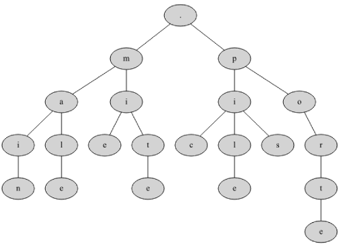{: .image}
    
    ??? exercice "Exercice 1"
        Rajouter dans cet arbre les mots : `#!python malle` et `#!python portail`.

??? exemple4 "__Exemple 4 : représentation d'une expression arithmétique__"
    On peut également représenter les expressions arithmétiques par des arbres étiquetés par des opérateurs, des constantes et des variables. 
    <span style="display: block; margin: 10px 0 0 0;">La structure de l’arbre rend compte de la priorité des opérateurs et rend inutile tout parenthésage.</span>

    Pour l’expression : $(\displaystyle\frac{y}{2}-t)(75+z)$ cela donne :
    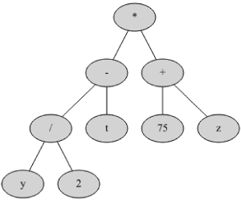{: .image}
    
    ??? exercice "Exercice 2"
        Représenter l’expression : $3+(\displaystyle\frac{7}{3}-1)^3$
        <center>
        [Correction de l'exercice 2 :material-cursor-default-click:](Correction_des_exos_du_cours.md#correction-de-lexercice-2){:target="_blank" .md-button}
        </center>

### <div class = "encadré3">__Terminologie__</div>
  
!!! star1 "__Noeud__"
    Un arbre est constitué de __noeuds__, reliés entre eux par des __arêtes__ selon une relation __pères-fils__.
    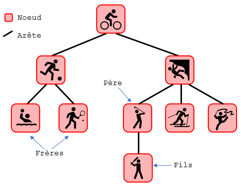{: .image}
    <span style="display: block; margin: 40px 0 0 0;">On distingue trois types de noeuds :</span>
    <div class="couleur_puce1">

    * __La racine__ de l’arbre est l’unique noeud ne possédant pas de parent.
    * __Les feuilles__ (ou *noeuds externes*), éléments ne possédant pas de fils dans l’arbre.
    * __Les noeuds internes__, éléments possédant des fils (sous-branches).
    </div>
    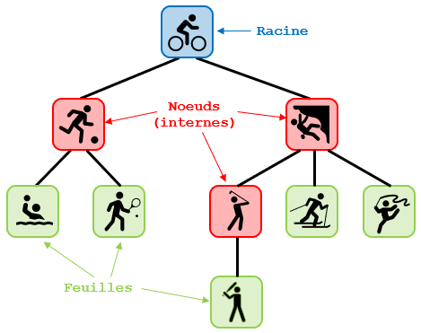{: .image}
    <span style="display: block; margin: 40px 0 0 0;">Le chemin à la racine d’un noeud est la liste des noeuds qu’il faut parcourir depuis la racine jusqu’au noeud considéré.</span>
    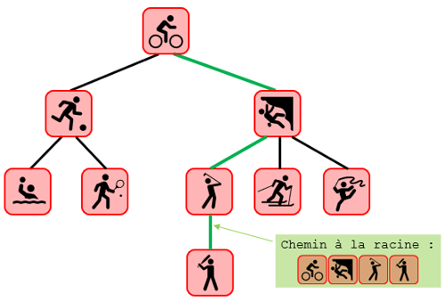{: .image}

    ??? warning "__Remarque__"
        L'analogie avec les arbres réels peut s'avérer trompeuse. Les arbres - en informatique - sont le plus souvent représentés avec la racine en haut, puis les noeuds, et les feuilles en bas.

!!! star2 "__Mesures__"
    <div class="couleur_puce23etoi">

    * La __profondeur__ d’un noeud est la distance (nombre d’arêtes) de la racine au noeud.  
    * La __hauteur__ d’un arbre est la plus grande profondeur d’une feuille de l’arbre.  
    * La __taille__ d’un arbre est son nombre de noeuds.  
    * La __longueur de cheminement__ est la somme des profondeurs de chacune des feuilles.
    
    </div>
    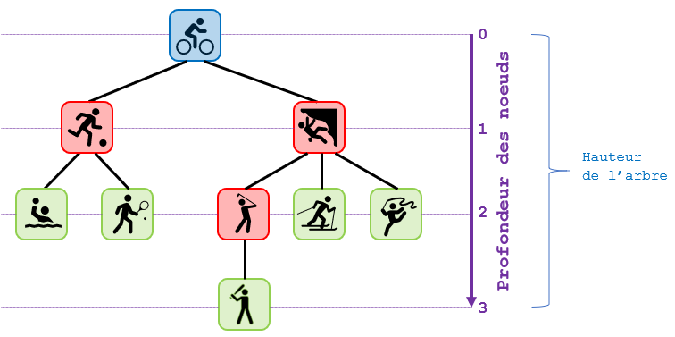{: .image}
    <span style="display: block; margin: 40px 0 0 0;">Cette structure de donnée est __récursive__ : chaque noeud est lui même noeud-racine d’un sous-arbre (également appelé __branche__).</span>
        
    ??? danger "__Remarque importante__"
        __Il n’existe pas de définition universelle pour la hauteur d’un arbre et la profondeur d’un noeud dans un arbre.  
        Dans certains cas la profondeur des noeuds est comptée à partir de 1 et/ou la hauteur est égale au nombre de profondeurs différentes…  
        Parfois également, la taille d’un arbre ne tient pas compte des feuilles !!__

    ??? exercice "Exercice 3"
        Soit l’arbre suivant :  
        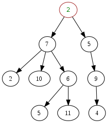{: .image width="40%" }
        <div class="list6_1">

        1. Quelle est la racine de cet arbre ?
        2. Donner la hauteur et la taille de cet arbre.
        3. Donner le(s) fils du noeud 7.
        4. Donner le père du noeud 11.
        5. Donner toutes les feuilles de cet arbre.

        </div>
        <center>
        [Correction de l'exercice 3 :material-cursor-default-click:](Correction_des_exos_du_cours.md#correction-de-lexercice-3){:target="_blank" .md-button}
        </center>

!!! star3 "__Étiquette__"
    La finalité d’un arbre est le plus souvent de structurer des données : chaque noeud peut être identifié par une __étiquette__.
    <span style="display: block; margin: 10px 0 0 0;">L’étiquette représente directement la __valeur__ du noeud ou bien une __clé__ associée à une donnée.</span>
    <span style="display: block; margin: 10px 0 0 0;">Un arbre dont tous les noeuds sont nommés est dit __étiqueté__.</span>

    ??? exemple1 "__Exemple__"
        L’arbre ci-dessous est étiqueté avec les entiers de 1 à 10 :
        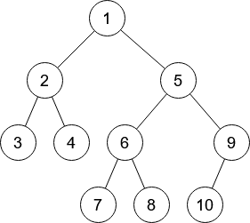{: .image}

## <div class = "encadré2">__Arbres binaires__</div>
### <div class = "encadré3">__Définition et exemples__</div>

!!! book1 "__Définition__"
    Un __arbre binaire__ est un arbre dont tous les noeuds ont au plus deux fils.

??? exemple2 "__Exemple et contre-exemple__"
    L'arbre suivant est binaire :
    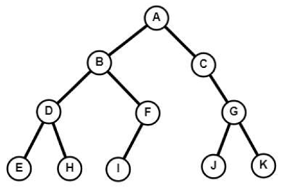{: .image}
    <span style="display: block; margin: 40px 0 0 0;">En revanche, l'arbre qui a servi d'exemple tout au long du paragraphe précédent n'en est pas un...</span>
    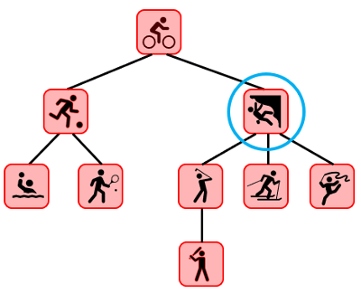{: .image}
    <span style="display: block; margin: 40px 0 0 0;">... puisqu'il contient un noeud ayant plus de deux fils.</span>
    
Les définitions vues précédemment pour des arbres quelconques restent bien évidemment valables pour les arbres binaires. Mais dans ce cas, chaque noeud possède deux sous-arbres, éventuellement vides, que l'on appelle __sous-arbre gauche__ et __sous-arbre droit__.  
<span style="display: block; margin: 10px 0 0 0;">Par exemple, dans le cas de l'arbre binaire précédent, le noeud A possède un sous-arbre gauche et un sous-arbre droit comme le montre la figure suivante :</span>
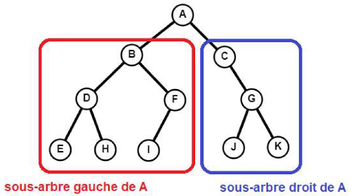{: .image}

Ainsi, et plus précisément, un arbre binaire est un ensemble fini de noeuds correspondant à l'un des deux cas suivants :
<div class="couleur_puce17" markdown="1">

* __Soit l'arbre est vide__, c'est-à-dire qu'il ne contient aucun noeud.
* __Soit l'arbre n'est pas vide__, et ses noeuds sont structurés de la façon suivante :

</div>
<div class="couleur_puce17etoi_decal" markdown="1">

* Un noeud est la racine de l'arbre.
* Les noeuds restant sont séparés en deux sous-ensembles, qui forment __récursivement__ deux sous-arbres (le __gauche__ et le __droit__).
* La racine est reliée à ses deux sous-arbres gauche et droit, et plus précisément à la racine de chacun de ses sous-arbres (lorsqu'ils ne sont pas vides).

</div>
On peut rapprocher la notion de noeud d’un arbre binaire à celle d’une cellule de liste chaînée, la racine d’un arbre non vide correspond à la tête d’une liste non vide qui contient une valeur et deux chainages menant vers les deux directions.

### <div class = "encadré3">__Cas particuliers d'arbres binaires__</div>
Il est possible d’avoir des arbres binaires de même taille mais de "formes" très différentes :

!!! book2 "__Arbre complet__"
    Un __arbre complet__ (ou __parfait__) est un arbre binaire dont tous les noeuds possèdent exactement 2 fils (sauf les feuilles qui en ont zéro !).
    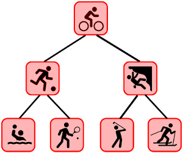{: .image}

!!! book "__Arbre filiforme__"
    Un __arbre filiforme__ est un arbre binaire dont tous les noeuds (sauf la feuille) possèdent un unique fils (on parle aussi de __peigne__).
    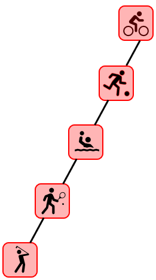{: .image}

On pourra aussi dire que l’arbre filiforme est __déséquilibré__ alors que l’arbre complet est __équilibré__.

### <div class = "encadré3">__Propriétés__</div>

!!! key2 "__Encadrement de la hauteur__"
    La hauteur d’un arbre filiforme de taille $~n~$ est égale à $~n-1$.  
    <span style="display: block; margin: 10px 0 0 0;">La hauteur d’un arbre complet de taille $~n~$ est égale à $⌊\operatorname{log_{2}}(n)⌋$ où $⌊~⌋$ est le symbole de la partie entière.</span>

??? exemple "__Exemple__"
    Si on reprend l'arbre complet précédent, $\operatorname{log_{2}}(7)\approx2,8$ : la hauteur de l’arbre complet est égale à $~2$, ce que l'on vérifie aisément.

Un arbre filiforme et un arbre complet étant deux cas extrêmes, on peut encadrer la hauteur d’un arbre binaire quelconque :

!!! book1 "__Propriété__"
    Un encadrement de la hauteur $~h~$ d’un arbre binaire quelconque de taille $~n~$ est :
    $⌊\operatorname{log_{2}}(n)⌋~$$\leq$$~h~$$\leq$$~n-1$.

De la même manière, on peut encadrer la taille d’un arbre binaire quelconque connaissant sa hauteur :

!!! book2 "__Propriété__"
    Un encadrement de la taille $~n~$ d’un arbre binaire quelconque de hauteur $~h~$ est :
    $h+1~$$\leq$$~n~$$\leq$$~2^{h+1}−1$.

??? exemple1 "__Exemple__"
    La taille d’un arbre de hauteur $~3~$ est comprise entre $~3+1=4~$ et $~2^{3+1}−1=15$.
    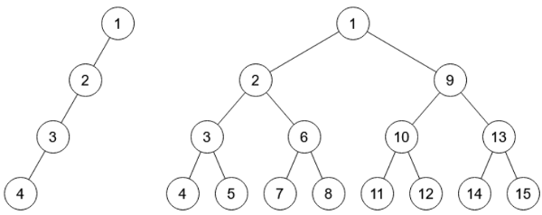{: .image}

## <div class = "encadré2">__Implémentation en Python__</div>
### <div class = "encadré3">__Type abstrait arbre binaire__</div>

De manière générale, on peut construire un arbre binaire comme un noeud composé de deux sous-arbres. L'arbre vide est représentée par la valeur `#!python None`. Ainsi, une feuille est un noeud avec les sous-arbres gauche et droit à `#!python None`. Pour annoter la structure de l'arbre avec des informations, on utilise des étiquettes pouvant être enregistrées à chaque noeud.
<span style="display: block; margin: 10px 0 0 0;">On peut ensuite parcourir un arbre par l'accès à son étiquette et à ses sous-arbres gauche et droit.</span>
<span style="display: block; margin: 10px 0 0 0;">Voici les fonctions primitives qui définissent le type abstrait arbre binaire :</span>
<center>

| Action                                                                       | Instruction         |
| :--------------------------------------------------------------------------: | :-----------------: |
| Créer un arbre vide                                                          |`#!python arbre_vide()`        |
| Tester si l'arbre `#!python A` est vide                                               |`#!python est_vide(A)`         |
| Renvoyer la clé (la valeur) de la racine de l'arbre `#!python A`                     |`#!python cle(A)`             |
| Renvoyer le sous-arbre gauche de l'arbre `#!python A` (si `#!python A` est non vide)          |`#!python sous_arbre_gauche(A)`     |
| Renvoyer le sous-arbre droit de l'arbre `#!python A` (si `#!python A` est non vide)           |`#!python sous_arbre_droit(A)`      |
| Créer un arbre binaire de clé `#!python valeur ` et de sous-arbres `#!python G` et `#!python D`         |`#!python arbre_cons(valeur, G, D)`   |

</center>

??? exemple4 "__Exemple__"
    <div class="couleur_puce24">

    * `#!python A = arbre_vide()` <span style="color:red">⇒</span> `#!python A = ()`
    * `#!python est_vide(A)` <span style="color:red">⇒</span> `#!python True`
    * Pour définir à l'aide de primitives l'arbre suivant :
    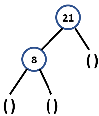{: .image}
    <div class="decal2">On écrira : `#!python A = arbre_cons(21, arbre_cons(8, arbre_vide(), arbre_vide()), arbre_vide())`</div>
    * `#!python cle(A)` <span style="color:red">⇒</span> `#!python 21`
    * `#!python est_vide(A)` <span style="color:red">⇒</span> `#!python False`
    * `#!python sous_arbre_gauche(A)` <span style="color:red">⇒</span> `#!python arbre_cons(8, arbre_vide(), arbre_vide())`
    * `#!python sous_arbre_droit(A)` <span style="color:red">⇒</span> `#!python arbre_vide()`
    
    </div>

!!! exercice "__Exercice 4__"
    <div class="list6_1">

    1. Comment s'écrit à l'aide de fonctions primitives l'arbre suivant, noté `#!python B` ? 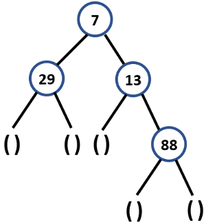{: .image}
    2. A l'aide de fonctions primitives et des arbres `#!python A` et `#!python B` créés précédemment, définir l'arbre `#!python C` suivant : 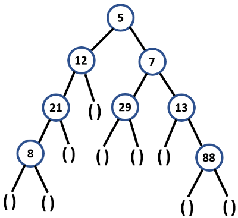{: .image}
    3. Quel arbre est renvoyé par l'instruction : `#!python sous_arbre_gauche(sous_arbre_droit(C))` ?
    4. Que renvoie l'instruction : `#!python est_vide(sous_arbre_droit(sous_arbre_gauche(sous_arbre_gauche(C))))` ?
    5. Même question avec l'instruction : `#!python cle(sous_arbre_droit(sous_arbre_droit(C)))`.

    </div>
    <center>
    [Correction de l'exercice 4 :material-cursor-default-click:](Correction_des_exos_du_cours.md#correction-de-lexercice-4){:target="_blank" .md-button}
    </center>

### <div class = "encadré3">__Implémentation__</div>

Suivant l’usage, un arbre binaire peut être représenté par :
<div class="couleur_puce17" markdown="1">

* Un __chaînage__ (similaire à une liste chaînée, mais chaque noeud a deux fils)
* Un __tableau qui stocke les noeuds, la racine à la première position, les autres noeuds ont la position qu’on veut__.
* Un __tableau où les noeuds ont une position définie à l’avance__. La racine est à la position $~1$. Le noeud à la position $~p~$ est le père des noeuds des positions $~2p~$ et $~2p+1~$.

</div>
Python ne propose pas nativement de structure de données permettant d'implémenter directement les arbres binaires. Il va donc être nécessaire de créer manuellement cette structure et pour cela, nous allons utiliser un __chaînage__.  
<span style="display: block; margin: 10px 0 0 0;">Pour programmer ce type de structure, nous allons utiliser le paradigme de la programmation orientée objet (POO).</span>
<span style="display: block; margin: 10px 0 0 0;">Un arbre vide est représenté par l’attribut `#!python valeur` à `#!python None`.  
Les attributs `#!python G` et `#!python D` sont des arbres donc tous les noeuds sont des arbres, une feuille a deux attributs `#!python G` et `#!python D` à `#!python None`.</span>

``` python
class Arbre :

    def __init__(self, valeur=None, G=None, D=None):
        self.valeur = valeur
        self.G = G
        self.D = D

    # ...

```

``` python
a1 = Arbre() # arbre vide
a2 = Arbre(88) # arbre avec un noeud (la racine)

```

Ainsi, si l'on souhaite créer en Python l'arbre `#!python C` de l'exercice 4, on peut procéder ainsi :

``` python
A = Arbre(21, Arbre(8))
B = Arbre(7, Arbre(29), Arbre(13, None, Arbre(88)))
C = Arbre(5, Arbre(12, A), B)
```

On donne la méthode d'affichage ci-dessous afin de représenter au mieux un arbre dans une console Python :

``` python
def affichage(self, niveau=0, c=132):
    if self.D:
        self.D.affichage(niveau+1, 47)
    if self.valeur :
        print(f"{' ' * 4 * niveau}{chr(c)}{self.valeur}")
    if self.G:
        self.G.affichage(niveau+1, 92)

```

Ainsi, l'utilisation de cette méthode sur l'arbre `#!python C` donne :

``` python
>>> C.affichage()
            /88
        /13
    /7
        \29
•5
    \12
        \21
            \8

```

!!! exercice "__Exercice 5 : implémentation de primitives__"
    Coder en Python les méthodes suivantes de la classe `#!python Arbre` :
    <div class="list6_1">

    1. `#!python est_vide()` qui renvoie `#!python True` si l'arbre est vide, `#!python False` sinon.
    2. `#!python cle()` qui renvoie la clé de la racine de l'arbre.
    3. `#!python sous_arbre_gauche()` qui renvoie le sous-arbre gauche de la racine de l'arbre (si `#!python A` est non vide).
    4. `#!python sous_arbre_droit()` qui renvoie le sous-arbre droit de la racine de l'arbre (si `#!python A` est non vide).
    5. `#!python est_feuille()` qui renvoie `#!python True` si l'arbre est une feuille, `#!python False` sinon.

    </div>
    <center>
    [Correction de l'exercice 5 :material-cursor-default-click:](Correction_des_exos_du_cours.md#correction-de-lexercice-5){:target="_blank" .md-button}
    </center>

### <div class = "encadré3">__Algorithmique des arbres binaires__</div>

La définition d'un arbre binaire étant récursive, il est naturel d'écrire des opérations sur les arbres binaires sous la forme de fonctions récursives.  
<span style="display: block; margin: 10px 0 0 0;">L'exemple le plus simple est celui d'une fonction `#!python taille()` qui calcule la taille d'un arbre.</span>
<span style="display: block; margin: 10px 0 0 0;">On commence par considérer le cas de base où l'arbre est vide. Dans ce cas, il convient de renvoyer `#!python 0` car il n'y a aucun noeud dans l'arbre.  
Dans le cas contraire, l'arbre contient au moins un noeud (la racine de l'arbre), auquel on va ajouter la taille des sous-arbres gauche et droit, calculée récursivement :</span>

``` python
def taille(self):
    if self.est_vide():
        return 0

    gauche, droit = self.sous_arbre_gauche(), self.sous_arbre_droit()
    return 1 + gauche.taille() + droit.taille()

```

!!! exercice "__Exercice 6 : hauteur d'un arbre__"
    Pour calculer la hauteur d’un arbre, il faut parcourir toutes ses branches et retenir la profondeur de la feuille la plus éloignée.  
    La fonction est bien entendue récursive…  
    <span style="display: block; margin: 10px 0 20px 0;">Coder en Python la méthode `#!python hauteur()` de la classe `#!python Arbre` qui calcule la hauteur d'un arbre.</span>
    <center>
    [Correction de l'exercice 6 :material-cursor-default-click:](Correction_des_exos_du_cours.md#correction-de-lexercice-6){:target="_blank" .md-button}
    </center>

!!! exercice "__Exercice 7 : nombre de feuilles d'un arbre__"
    Pour calculer le nombre de feuilles d’un arbre, il faut là encore parcourir toutes ses branches et compter les noeuds.  
    La fonction est également récursive.  
    <span style="display: block; margin: 10px 0 0 0;">Coder en Python la méthode `#!python nb_feuilles()` de la classe `#!python Arbre` qui calcule le nombre de feuilles d'un arbre.</span>
    <center>
    [Correction de l'exercice 7 :material-cursor-default-click:](Correction_des_exos_du_cours.md#correction-de-lexercice-7){:target="_blank" .md-button}
    </center>

### <div class = "encadré3">__Parcours d'un arbre binaire__</div>

Les deux fonctions `#!python taille()` et `#!python hauteur()` parcourent tous les noeuds de l'arbre. L'ordre dans lequel ce parcours est effectué n'est pas important. Dans les deux cas, peu importe si on commence le calcul par le sous-arbre gauche ou le droit.
<span style="display: block; margin: 10px 0 0 0;">Ecrivons maintenant une autre fonction qui affiche les valeurs contenues dans tous les noeuds de l'arbre. L'ordre dans lequel le parcours des noeuds est effectué devient important. On peut par exemple parcourir le sous-arbre gauche, puis afficher la valeur de la racine, puis enfin parcourir le sous-arbre droit.</span>

!!! book "__Définition__"
    Un __parcours d’arbre__ est une façon d’ordonner les noeuds d’un arbre afin de les parcourir.   
    <span style="display: block; margin: 10px 0 0 0;">Il existe différents types de parcours :</span>
    <div class="couleur_puce12">

    * __Parcours en profondeur__ :

    </div>
    <div class="couleur_puce12etoi_decal">

    * __Infixe__ (en ordre)
    * __Préfixe__ (en préordre)
    * __Postfixe__ (en postordre)

    </div>
    <div class="couleur_puce12">

    * __Parcours en largeur__

    </div>
<center>

#### <div class = "encadré4">__Parcours en profondeur__</div>

</center>

Les trois méthodes de parcours en profondeur se distinguent uniquement par l’ordre dans lequel on réalise les parcours des branches droite et gauche par rapport à la visite d’un noeud.
<span style="display: block; margin: 10px 0 0 0;">Pour illustrer chaque méthode, reprenons l'arbre d'un précédent exemple :</span>

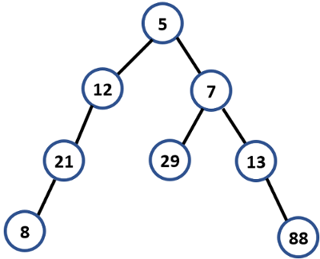{: .image}
<span style="display: block; margin: 40px 0 0 0;">Ensuite, entourons-le de la façon suivante :</span>

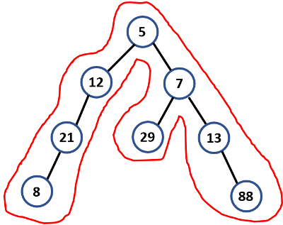{: .image}

!!! star4 "__Parcours infixe__"
    Dans un parcours infixe (*inorder traversal*), chaque noeud est visité après son enfant gauche mais avant son enfant droit.  
    <span style="display: block; margin: 10px 0 0 0;">Le parcours infixe affiche la racine après avoir traité le sous-arbre gauche. Et après traitement de la racine, on traite le sous-arbre droit (c'est donc un parcours de type __"GRD"__ : Gauche, Racine, Droite).</span>
    <span style="display: block; margin: 10px 0 0 0;">Ainsi, l’affichage des noeuds avec un parcours infixe de l’arbre précédent est : `#!python 8, 21, 12, 5, 29, 7, 13, 88`.</span>

    !!! a-retenir "__Procédé mnémotechnique__"
        Une façon relativement simple de retenir l'ordre infixe est de suivre la ligne qui entoure l'arbre, dans le sens anti-horaire, et en partant de la racine.  
        <span style="display: block; margin: 10px 0 0 0;">A chaque fois que l'on rencontre un noeud et qu'il est possible de "toucher" le __bas__ de ce noeud, on note son étiquette.</span>
        <span style="display: block; margin: 10px 0 0 0;">Dans l'exemple précédent, on part de la racine, mais il n'est pas possible de "toucher" la partie inférieure de celle-ci (à cause de l'arête entre la racine et le noeud étiqueté `#!python 12`).
        <span style="display: block; margin: 10px 0 0 0;">De même pour les deux noeuds suivants : ceux étiquetés `#!python 12` puis `#!python 21`.</span>
        <span style="display: block; margin: 10px 0 0 0;">Ainsi, le premier noeud dont il est possible "d'atteindre" le bas est celui dont l'étiquette est `#!python 8` et ainsi de suite.</span>
        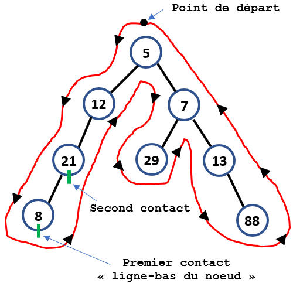{: .image}

    ??? plus-circle "Code Python"
        On donne ci-dessous le code de la méthode `#!python parcours_infixe()` qui affiche les étiquettes des noeuds d'un arbre dans un parcours infixe.

        ``` python
        def parcours_infixe(self):
            if self.est_vide():
                return
            
            gauche, droit = self.sous_arbre_gauche(), self.sous_arbre_droit()
            gauche.parcours_infixe()
            print(self.valeur, end=" ")
            droit.parcours_infixe()

        ```

    !!! exercice "__Exercice 8__"
        Coder en Python la méthode `#!python liste_parcours_infixe()` qui renvoie une liste composée des étiquettes des noeuds d'un arbre dans un parcours infixe.  
        <center>
        [Correction de l'exercice 8:material-cursor-default-click:](Correction_des_exos_du_cours.md#correction-de-lexercice-8){:target="_blank" .md-button}
        </center>

!!! star5 "__Parcours préfixe__"
    Dans un parcours __préfixe__ (*preorder traversal*), chaque noeud est visité avant que ses enfants soient visités. 
    <span style="display: block; margin: 10px 0 0 0;">Cela signifie que l'on affiche la racine de l'arbre, on parcourt tout le sous-arbre de gauche, une fois qu'il n'y a plus de sous-arbre gauche on parcourt les éléments du sous-arbre droit.</span>
    <span style="display: block; margin: 10px 0 0 0;">Ce type de parcours peut être résumé en trois lettres : __"RGD"__ (pour Racine, Gauche, Droit).</span>
    <span style="display: block; margin: 10px 0 0 0;">Ainsi, l’affichage des noeuds avec un parcours préfixe de l’arbre précédent est : `#!python 5, 12, 21, 8, 7, 29, 13, 88`.</span> 

    !!! a-retenir "__Procédé mnémotechnique__"
        Une façon relativement simple de retenir l'ordre préfixe est de suivre la ligne qui entoure l'arbre, dans le sens anti-horaire, et en partant de la racine.  
        <span style="display: block; margin: 10px 0 0 0;">A chaque fois que l'on rencontre un noeud et qu'il est possible de "toucher" la partie __gauche__ de ce noeud, on note son étiquette.</span>
        <span style="display: block; margin: 10px 0 0 0;">Dans l'exemple précédent, on part de la racine et on voit qu'il est possible de "toucher" la partie gauche de celle-ci donc on note son étiquette.</span>
        <span style="display: block; margin: 10px 0 0 0;">De la même façon, la partie gauche du noeud suivant, dont l'étiquette est `#!python 12` est atteignable et ainsi de suite.</span>
        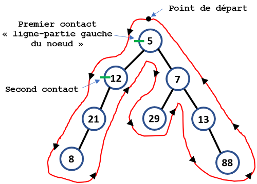{: .image}

    !!! exercice "__Exercice 9__"
        Coder en Python la méthode `#!python parcours_prefixe()` qui affiche les étiquettes des noeuds d'un arbre dans un parcours préfixe.  
        <center>
        [Correction de l'exercice 9 :material-cursor-default-click:](Correction_des_exos_du_cours.md#correction-de-lexercice-9){:target="_blank" .md-button}
        </center>

!!! star6 "__Parcours suffixe (ou postfixe)__"
    Dans un parcours __suffixe__ (ou __postfixe__ pour *postorder traversal*), chaque noeud est visité après que ses enfants soient visités. 
    <span style="display: block; margin: 10px 0 0 0;">Le parcours postfixe effectue schématiquement le parcours suivant : sous-arbre gauche, sous-arbre droit puis la racine, c'est donc un parcours __"GDR"__ (Gauche, Droite, Racine).</span>
    <span style="display: block; margin: 10px 0 0 0;">Ainsi, l’affichage des noeuds avec un parcours postfixe de l’arbre précédent est : `#!python 8, 21, 12, 29, 88, 13, 7, 5`.</span>

    !!! a-retenir "__Procédé mnémotechnique__"
        Une façon relativement simple de retenir l'ordre postfixe est de suivre la ligne qui entoure l'arbre, dans le sens anti-horaire, et en partant de la racine.  
        <span style="display: block; margin: 10px 0 0 0;">A chaque fois que l'on rencontre un noeud et qu'il est possible de "toucher" la partie __droite__ de ce noeud, on note son étiquette.</span>
        <span style="display: block; margin: 10px 0 0 0;">Dans l'exemple précédent, on part de la racine, mais il n'est pas possible de "toucher" la partie droite de celle-ci (à cause de l'arête entre la racine et le noeud étiqueté `#!python 12`).</span>
        <span style="display: block; margin: 10px 0 0 0;">De même pour les deux noeuds suivants : ceux étiquetés `#!python 12` puis `#!python 21`.</span>
        <span style="display: block; margin: 10px 0 0 0;">Ainsi, le premier noeud dont il est possible "d'atteindre" la partie droite est celui dont l'étiquette est `#!python 8` et ainsi de suite.</span>
        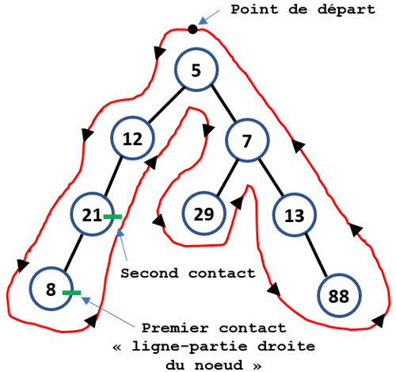{: .image}

    !!! exercice "__Exercice 10__"
        Coder en Python la méthode `#!python parcours_postfixe()` qui affiche les étiquettes des noeuds d'un arbre dans un parcours postfixe.  
        <center>
        [Correction de l'exercice 10 :material-cursor-default-click:](Correction_des_exos_du_cours.md#correction-de-lexercice-10){:target="_blank" .md-button}
        </center>
<center>

#### <div class = "encadré4">__Parcours en largeur__</div>

</center>

!!! star7 "__Parcours en largeur__"
    Dans un parcours __en largeur__ (ou __BFS__, pour *Breadth First Search*), on commence par explorer la racine de l'arbre, puis son fils gauche (s'il existe) suivi de son fils droit (s'il existe), puis le fils gauche du fils gauche etc.  
    <span style="display: block; margin: 10px 0 0 0;">Ainsi, l’affichage des noeuds avec un parcours en largeur de l’arbre précédent est : `#!python 5, 12, 7, 21, 29, 13, 8, 88`.</span>
    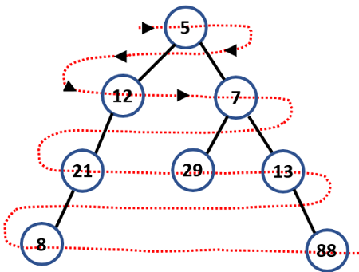{: .image}
    <span style="display: block; margin: 40px 0 0 0;">Pour implémenter ce parcours, le plus simple est d'utiliser une file afin d'y stocker les différents éléments visités.</span>
    <span style="display: block; margin: 10px 0 0 0;">Le principe de l’algorithme de parcours en largeur est le suivant :</span> 
    <div class="list9_1">

    1. Mettre l'arbre source dans la file. 
    2. Retirer l'arbre du début de la file pour le traiter (récupérer sa racine). 
    3. Mettre les sous-arbres dans la file (s'ils existent !). 
    4. Si la file n'est pas vide reprendre à l'étape <span style = "color : rgb(255, 12, 0); font-weight: bold;">2</span>.

    </div>

    !!! exercice "__Exercice 11__"
        Coder en Python la méthode `#!python parcours_largeur()` qui affiche les étiquettes des noeuds d'un arbre dans un parcours en largeur en utilisant une file.  
        <center>
        [Correction de l'exercice 11 :material-cursor-default-click:](Correction_des_exos_du_cours.md#correction-de-lexercice-11){:target="_blank" .md-button}
        </center>

## <div class = "encadré2">__Arbres binaires de recherche__</div>
### <div class = "encadré3">__Problème introductif__</div>

!!! exercice "__Exercice 12__"
    La ville Binarus a été construite selon la manière suivante :
    <div class="couleur_puce25">

    * Chaque rue mène à une seule maison identifiée par trois lettres de l’alphabet.
    * Il y a autant de maisons que de combinaisons possibles de triplets de trois lettres.
    * Devant chaque maison se trouve deux nouvelles rues, si on emprunte la rue de gauche, toutes les maisons que l’on rencontrera porteront un nom de trois lettres inférieur dans l’ordre lexicographique à la maison du départ de l’embranchement. Par contre la rue de droite mène vers des maisons dont le nom est supérieur dans l’ordre lexicographique.
    
    </div>
    On a commencé le plan de la ville Binarus où l'entrée est gardée ici par la maison "MAI":
    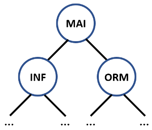{: .image}
    <div class="list6_1">

    1. Proposer une suite possible avec 7 premières maisons.
    2. Combien de maisons possède la ville Binarus ?
    3. Déterminer le nombre maximal de rues à traverser pour trouver une maison quelconque dans le cas où l'arbre est complet.

    </div>
    <center>
    [Correction de l'exercice 12 :material-cursor-default-click:](Correction_des_exos_du_cours.md#correction-de-lexercice-12){:target="_blank" .md-button}
    </center>

### <div class = "encadré3">__Définition et exemples__</div>

!!! book1 "__Définition__"
    Un __arbre binaire de recherche (ABR)__ est un arbre binaire qui est étiqueté par des valeurs totalement  ordonnables (c'est-à-dire qu'il doit exister une manière de dire si un élément est plus grand ou plus petit qu'un autre) grâce à deux règles de construction.  
    <span style="display: block; margin: 10px 0 0 0;">L’étiquette d’un noeud est :</span> 
    <div class = "list17_1">

    1. supérieure ou égale à celle de chaque noeud de son sous-arbre gauche ;
    2. inférieure ou égale à celle de chaque noeud de son sous-arbre droit.

    </div>
    Selon la mise en oeuvre de l'__ABR__, on pourra interdire ou non des clés de valeur égale.

??? exemple2 "__Exemple et contre-exemple__"
    L'arbre suivant est un arbre binaire de recherche :
    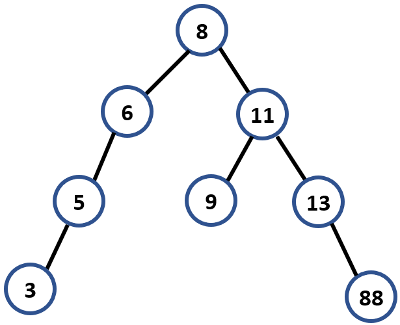{: .image}
    <span style="display: block; margin: 40px 0 0 0;">En revanche, l'arbre suivant n'en est pas un...</span>
    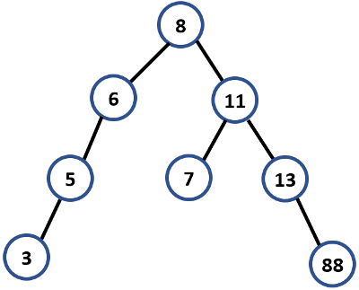{: .image}
    <span style="display: block; margin: 40px 0 0 0;">... puisque le noeud étiqueté `#!python 7` ne peut pas se trouver dans le sous-arbre droit du noeud étiqueté `#!python 8`.</span>

!!! exercice "__Exercice 13__"
    Un vétérinaire voudrait stocker les fiches médicales de ses patients, et, plutôt que d'utiliser un tableau ou une liste, on se propose d'utiliser un arbre binaire de recherche.  
    <span style="display: block; margin: 10px 0 0 0;">La fiche contiendra différentes informations sur l'animal ; on utilisera son nom comme __clé__ (c'est-à-dire comme critère pour la relation d'ordre), que l'on triera selon l'ordre alphabétique croissant.</span>
    <span style="display: block; margin: 10px 0 0 0;">Le vétérinaire reçoit sa première patiente, qui répond au nom de __Gaufrette__.  Comme sa fiche sera le premier noeud de notre arbre, elle en devient automatiquement la racine.</span>
    <span style="display: block; margin: 10px 0 0 0;">Puis le vétérinaire reçoit les animaux dans l’ordre suivant afin de les soigner : __Charlie__, __Médor__, __Flipper__, __Bubulle__ et __Augustin__.</span>
    <div class="list6_1">

    1. Construire l’arbre binaire de recherche associé à cette séquence.
    2. Imaginons que la séquence soit maintenant la suivante : {__Gaufrette__, __Charlie__, __Médor__, __Flipper__, __Augustin__, __Bubulle__}, c’est-à-dire que __Augustin__ soit arrivé au rendez-vous médical avant __Bubulle__.
    <span style="display: block; margin: 8px 0 0 0;">L’arbre binaire de recherche est-il encore le même ?</span>
    <span style="display: block; margin: 8px 0 0 0;">Quelle conclusion peut-on en tirer ?</span>

    </div>
    <center>
    [Correction de l'exercice 13 :material-cursor-default-click:](Correction_des_exos_du_cours.md#correction-de-lexercice-13){:target="_blank" .md-button}
    </center>

!!! notes1 "__Remarque__"
    Les algorithmes vus sur les arbres binaires (__taille__ et __hauteur__, de même que les __parcours infixe__, __préfixe__, __postfixe__ et __en largeur__) fonctionnent bien entendu sur les __ABR__ (qui n'en sont qu'un cas particulier). 

    !!! exercice "__Exercice 14__"
        Afficher, à la main, le parcours __infixe__ de l'__ABR__ suivant :  
        {: .image}
        Quelle propriété semble se dégager ?  
        <center>
        [Correction de l'exercice 14 :material-cursor-default-click:](Correction_des_exos_du_cours.md#correction-de-lexercice-14){:target="_blank" .md-button}
        </center>

!!! exercice "__Exercice 15__"
    Coder en Python la méthode `#!python est_ABR()` qui renvoie `#!python True` si l'arbre est un arbre binaire de recherche et `#!python False` sinon. On veillera à utiliser la méthode `#!python liste_parcours_infixe()`.
    <center>
    [Correction de l'exercice 15 :material-cursor-default-click:](Correction_des_exos_du_cours.md#correction-de-lexercice-15){:target="_blank" .md-button}
    </center>

### <div class = "encadré3">__Recherche d’une clé dans un arbre binaire de recherche__</div>

Comme l’a montré le problème introductif, la recherche d’éléments dans un __ABR__ est particulièrement efficace.
<span style="display: block; margin: 10px 0 0 0;">L’idée est donc de comparer l’élément recherché aux valeurs de noeuds successifs :</span>
<div class="couleur_puce17" markdown="1">

* Si l’élément cherché est plus grand, on continue la recherche dans le sous-arbre droit et s'il est plus petit, dans le sous-arbre gauche.
* Si on le trouve on renvoie `#!python True`, par contre si on termine dans le sous-arbre vide d’une feuille on renvoie `#!python False`.

</div>

!!! notes2 "__Remarque__"
    Plus l’__ABR__ est "équilibré" , c’est-à-dire qu'il a un nombre de noeuds équitablement répartis entre les sous-arbres droit et gauche, plus la recherche est efficace.  
    <span style="display: block; margin: 10px 0 0 0;">En effet, notre algorithme de recherche élimine la moitié des éléments à chaque étape. Cela fait écho à la recherche dichotomique dans un tableau trié, où chaque étape divise par 2 le nombre d'éléments à examiner.</span>
    <span style="display: block; margin: 10px 0 0 0;">On sait que cet algorithme est extrêmement efficace (complexité dans le pire des cas en $\mathcal{O}(\operatorname{log_{2}}(n))$), ainsi, il ne faut pas plus de 20 étapes pour chercher parmi un million de valeurs.</span>
    <span style="display: block; margin: 10px 0 0 0;">Aussi, on essaiera d’éviter la structure de "peigne", où l’on rangerait tous les éléments dans l’ordre croissant ou décroissant puique la recherche serait au contraire peu efficace (elle serait susceptible de parcourir l'arbre tout entier, dans le cas d'un recherche infructueuse).</span>

!!! exercice "__Exercice 16__"
    Coder en Python la méthode `#!python rechercher_element(e)` qui renvoie `#!python True` si l'élément `#!python e` est un élément d'un arbre binaire de recherche et `#!python False` sinon. <span style="display: block; margin: 10px 0 0 0;">On veillera à ce que l'arbre sur laquelle cette méthode s'applique est bien un __ABR__.</span>
    <center>
    [Correction de l'exercice 16 :material-cursor-default-click:](Correction_des_exos_du_cours.md#correction-de-lexercice-16){:target="_blank" .md-button}
    </center>

### <div class = "encadré3">__Insertion d’une clé dans un arbre binaire de recherche__</div>

Il est tout à fait possible d'insérer un noeud dans un arbre binaire de recherche.  
<span style="display: block; margin: 10px 0 0 0;">De la même manière que nous avons cherché un élément dans un __ABR__, nous allons nous déplacer dans l’__ABR__ afin d’ajouter un nouvel élément en respectant les contraintes liées à la définition de l’__ABR__.</span>

!!! rocket "__Principe__"
    Pour insérer un nouveau noeud `#!python x` dans un __ABR__, on parcourt l'arbre de façon similaire à l'algorithme de recherche jusqu'à trouver un noeud `#!python y` sans fils gauche et de clé supérieure (ou sans fils droit et de clé inférieure). À cet instant, on place `#!python x` en tant que fils gauche (resp. droit) de `#!python y`.

!!! exercice "__Exercice 17__"
    Coder en Python la méthode `#!python inserer_element(e)` qui insère un noeud de clé `#!python e` dans un arbre binaire de recherche.  
    <span style="display: block; margin: 10px 0 0 0;">Si l'étiquette existe déjà, on placera le noeud dans le sous-arbre gauche du noeud contenant cette étiquette.</span>
    <span style="display: block; margin: 10px 0 0 0;">On veillera à ce que l'arbre sur laquelle cette méthode s'applique est bien un __ABR__.</span>
    <center>
    [Correction de l'exercice 17 :material-cursor-default-click:](Correction_des_exos_du_cours.md#correction-de-lexercice-17){:target="_blank" .md-button}
    </center>

!!! notes1 "__Remarques__"
    <div class="list11_1">

    1. Les __ABR__ construits dans ce cours peuvent contenir plusieurs fois le même élément : on dit qu'ils réalisent des *multiensembles*. Si on veut en revanche réaliser des *ensembles*, où chaque élément apparaît exactement une fois, il ne faut pas ajouter de nouvelle occurrence de l'élément lorsqu'il se trouve déjà dans l'arbre.
    2. La complexité de la fonction `#!python inserer_element` n'est donc pas différente de celle de la fonction `#!python rechercher_element` puisqu'on prend exactement les mêmes décisions quant à la descente dans l'arbre. Aussi, dans les deux cas, la complexité dépend de la forme de l'arbre et elle est, dans le pire des cas, majorée par sa hauteur.
    3. Avec la méthode `#!python inserer_element`, nous allons pouvoir construire des __ABR__ par ajouts successifs d'éléments, en partant d'un arbre vide, comme le montre l'exemple suivant :
    ``` python
    def gen_ABR(nb_elements):
        L = [randint(1, 100) for i in range(nb_elements)]
        print(L)
        D = Arbre()
        for elt in L:
            D.inserer_element(elt)
        D.affichage()

    ```
    L'appel `#!python gen_ABR(14)` donne alors dans la console :
    ``` python
    >>> (executing file "Arbre.py")
    [16, 21, 20, 49, 15, 14, 39, 75, 38, 1, 29, 82, 17, 19]
                    /82
                /75
            /49
                \39
                    \38
                        \29
        /21
            \20
                    /19
                \17
    •16
        \15
            \14
                \1

    ```

    </div>

