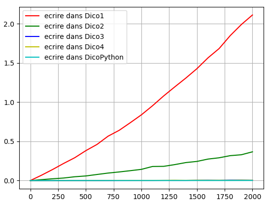
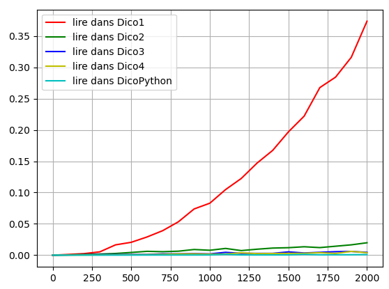
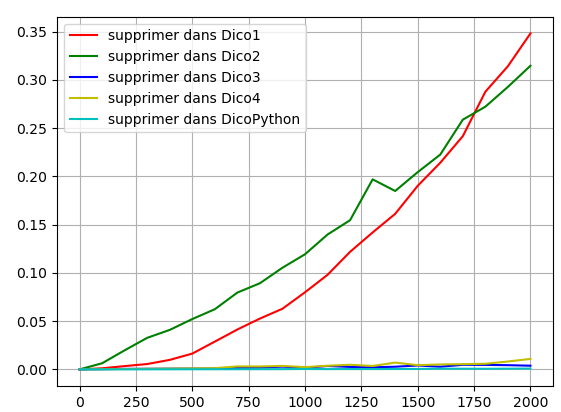

# <center><div class = "titre5">Correction des exercices du TP</div></center>

### <div class = "encadré2_TP"> __Correction de l'exercice 1__ </div>

```python
""" Implémentation n°1 d'un dictionnaire en programmation orientée objet Python.

    Ce fichier est le squelette de départ d'un code d'une classe Dico1, destinée 
    à produire des dictionnaires.

    Pour cette première implémentation, l'idée est de stocker nos données dans 
    deux listes :
        - la première contenant nos clés ;
        - la seconde contenant les valeurs correspondantes.
"""

class Dico1:
    """ Dictionnaire contenant deux listes non ordonnées """

    def __init__(self, nb_de_bits=8):
        """ Constructeur : va créer deux listes vides composées chacune de 
            (2**nb_de_bits) éléments initialisés à None."""
        self.longueur = 2 ** nb_de_bits    # nombre total d'éléments des 2 listes
        self.cles = [None] * self.longueur
        self.valeurs = [None] * self.longueur
        self.nbre_elements = 0                 # nombre d'éléments <> None des 2 listes 
        

    def est_vide(self):
        """ Parcourt la liste des clés : dès qu'une valeur différente de None 
            est trouvée c'est que la liste n'est pas vide et False est renvoyé. 
            Si à la fin de la liste aucune valeur n'a été trouvée : la liste est vide, 
            et True est renvoyé."""

        return self.nbre_elements == 0

    def affichage(self):
        """ Affiche dans la console le contenu du dictionnaire sous la forme 
            suivante :
                    DEBUT
                    cle1 : valeur1
                    cle2 : valeur2
                    (...)
                    FIN
            Les cellules vides ne s'affichent pas.
            Cette méthode ne renvoie rien."""
        
        print ("DEBUT")
        for i in range(self.longueur):    
            if self.cles[i]: 
                print(self.cles[i], " : ", self.valeurs[i])
        print("FIN")
    
    def trouver_index(self, cle):
        """ Trouve et renvoie l'index qui correspond à cle, renvoie None si la 
            clé est absente du dictionnaire"""
        
        for i in range(self.longueur):
            if self.cles[i] == cle:
                return i
        return None
    
    def ecrire(self, cle, valeur):
        """ Ajoute respectivement la clé et la valeur à la première position disponible de       
            chaque liste.
            On commence par tester si la clé existe déjà, si elle existe on remplace la 
            valeur associée dans la seconde liste des valeurs.
            Sinon on ajoute cle à la première position disponible, donc à la première
            valeur à None de la liste des clés et on fait de même pour valeur.
            Ne renvoie rien."""
        # vérifie si la clé existe 
        ind = self.trouver_index(cle)
        
        # si l'indice existe, on remplace la valeur
        if ind :
            self.valeurs[ind] = valeur
        else : 
            if not self.est_plein():
                ecrit, i = False, 0
                while not ecrit and i < self.longueur:
                    if not self.cles[i]:     
                        self.cles[i] = cle
                        self.valeurs[i] = valeur
                        self.nbre_elements += 1
                        ecrit = True
                    i += 1
            else :
                print("le dictionnaire est plein")
        
    def taille(self):
        """ Renvoie le nombre de cles non vides stockées dans le dictionnaire"""
        
        return self.nbre_elements
        
    def est_plein(self):
        """ Renvoie True si le nombre d'éléments déjà stockés est égal à la 
            longueur totale des 2 listes"""

        return self.nbre_elements == len(self.cles)
        
    def supprimer(self, cle):
        """ Supprime la valeur correspondante à cle dans la liste self.valeurs,
            Supprime cette cle de la liste self.cles. 
            Ne renvoie rien."""
        
        # vérifie si la clé existe 
        ind = self.trouver_index(cle)
        
        # si l'indice existe, on supprime la clé et la valeur associée
        if ind is not None:
            self.cles[ind] = None
            self.valeurs[ind] = None
            self.nbre_elements -= 1
            
    def contient(self, cle):
        """ Renvoie True si la clé existe, sinon renvoie False."""

        return self.trouver_index(cle)
        
    def lire(self, cle):
        """ Renvoie la valeur de la clé passée en paramètre, renvoie None si 
            la clé n'existe pas."""
        
        # vérifie si la clé existe 
        ind = self.trouver_index(cle)
        
        # on renvoie la valeur qui correspond si ind existe sinon None
        if ind is not None:
            return self.valeurs[ind]
        else :
            return None


from random import shuffle

if __name__=='__main__':
    jeu_donnees = [i for i in range(10)]
    shuffle(jeu_donnees)
    dico = Dico1(4)
    for j in jeu_donnees:
        dico.ecrire(str(j), j)

```

### <div class = "encadré2_TP"> __Correction de l'exercice 2__ </div>

```python
""" Implémentation n°2 d'un dictionnaire en programmation orientée objet Python.

    Ce fichier est le squelette de départ d'un code d'une classe Dico2, destinée
    à produire des dictionnaires.

    Pour cette seconde implémentation, l'idée est de stocker nos données dans 
    une liste de tuples (cle,valeur) : [(cle1, valeur1), (cle2, valeur2), ... ] 
    
    La liste est toujours triée par ordre croissant des clés, ce qui permettra 
    une recherche plus rapide.     
"""

class Dico2:
    """ Dictionnaire contenant une liste ordonnée de tuples (cle,valeur) """

    def __init__(self, nb_de_bits):
        """ Constructeur : va créer une liste vide composée chacune de 2**nb_de_bits 
            doublets vides (). """
        
        self.doublets = []
        self.longueur = 2 ** nb_de_bits      # nombre total d'éléments
        for i in range(self.longueur):
            self.doublets.append(())
        self.nb_elements = 0                # nombre d'éléments non vide
        

    def est_vide(self):
        """ Renvoie True si et seulement si l'objet de type Dico2 est vide,
            c'est à dire qu'il ne contient une liste de doublets vides ().
            Sinon renvoie False."""
        
        return self.doublets[-1] == ()

    def affichage(self):
        """ Affiche dans la console le contenu du dictionnaire sous la forme 
            suivante :
                    DEBUT
                    cle1 : valeur1
                    cle2 : valeur2
                    (...)
                    FIN
            Les cellules vides ne s'affichent pas.
            Cette méthode ne renvoie rien."""
        
        print('DEBUT')
        liste = []
        for doublet in self.doublets:
            if doublet != ():
                print( str(doublet[0]) + ":" + str(doublet[1])) 
        print('FIN')

    def taille(self):
        """ Renvoie le nombre de doublets stockés dans le dictionnaire."""

        compteur = 0
        for doublet in self.doublets:
            if doublet != ():
                compteur += 1
        return compteur

    def trouver_index(self, cle):
        """ Renvoie la valeur de l'index du doublet de la liste self.doublets 
            contenant cle. 
            Ne renvoie False que si la clé n'est pas dans les tuples composant la liste.    
            """
        
        # Pour une meilleure efficacité, la recherche s'effectuera par dichotomie.
        if self.est_vide():
            return False
        b = self.longueur - 1
        a = b - self.nb_elements + 1
        while a < b:
            m = (a+b)//2
            if self.doublets[m][0] == cle:
                return m
            elif self.doublets[m][0] > cle:
                b = m - 1
            else:
                a = m + 1
           
        if self.doublets[a][0] == cle:
            return a
        return False
        
    def lire(self, cle):
        """ Renvoie la valeur correspondante à la clé passée en paramètre.
            La recherche s'effectura par dichotomie.
            Renvoie None si cette clé n'existe pas."""
        
        index = self.trouver_index(cle)
        if index is not False:
            return self.doublets[index][1]
        return None
    
    def est_plein(self):
        """"Renvoie True si le dictionnaire est plein , sinon renvoie False."""
        
        return self.doublets[0] != ()

    def ecrire(self, cle, valeur):        
        """"Ajoute cle en queue de la liste self.cles,
            ajoute valeur en queue de la liste self.valeurs.
            Si la clé existe déjà, seule la (nouvelle) valeur est enregistrée 
            à la place de l'ancienne. 
            Ne renvoie rien."""
        
        # Si le dictionnaire est plein
        if self.est_plein() :
            print("Impossible d'enregistrer la valeur : le dictionnaire est plein !")
        
        else :
            i = self.trouver_index(cle)
            self.nb_elements += 1
            if i is not False:  # Si la clé existe déjà, il faut écraser l'ancienne valeur
                self.doublets[i] = (cle, valeur)
        
            # Sinon on écrit la nouvelle valeur
            else :    
                self.doublets[0] = (cle, valeur)
                self.doublets.sort()
        
    def supprimer(self,cle):
        """ Supprime le doublet contenant cle dans la liste self.doublets.
            Ne renvoie rien."""
        
        # Si la clé existe déjà, il faut la supprimer et retrier la liste
        i = self.trouver_index(cle)
        if i is not False:
            self.nb_elements -= 1
            self.doublets[i] = ()
            self.doublets.sort()
    

from random import shuffle

if __name__=='__main__':
    jeu_donnees = [i for i in range(10)]
    shuffle(jeu_donnees)
    dico = Dico2(4)
    for i in jeu_donnees:
        dico.ecrire(str(i), i)

```

### <div class = "encadré2_TP"> __Correction de l'exercice 3__ </div>

```python
""" Implémentation n°3 d'un dictionnaire en programmation orientée objet Python.
    
    Ce fichier est le squelette de départ d'un code d'une classe Dico3, destinée 
    à produire des dictionnaires.
    
    Pour cette troisième implémentation, l'idée est de stocker nos données en 
    déterminant leur position à partir d'une fonction de hachage :
        - utilisation de la méthode hash() de python ;
        - gestion des collisions par chaînage linéaire au moyen d'une liste.
"""

class Dico3:
    """ Dictionnaire contenant une table de hachage """

    def __init__(self, nb_de_bits):
        """ Constructeur : va créer une table dont les (2**nb_de_bits) éléments 
            sont initialisés à None"""
        
        self.longueur = 2 ** nb_de_bits      # nombre total d'éléments
        self.table = [None] * self.longueur
        self.collision = 0                 # compteur de collisions

    def _hachage(self, x):
        return hash(x) % self.longueur

    def est_vide(self):
        """ Renvoie True si et seulement si l'objet de type Dico3 est vide, 
            sinon renvoie False"""
        
        for e in self.table:
            if e:
                return False
        return True
    
    def affichage(self):
        """ Affiche dans la console le contenu du dictionnaire sous la forme 
            suivante :
                    DEBUT
                    indice1 - cle1 : valeur1
                    indice2 - cle2 : valeur2
                    (...)
                    FIN
            Les cellules vides ne s'affichent pas.
            Cette méthode ne renvoie rien."""
        
        ch = 'DEBUT\n'
        for index, valeurs in self.table.items():
            if valeurs:
                for (cle, valeur) in valeurs:
                    ch += f'{index} - {cle} : {valeur}\n'
        ch += 'FIN'
        print(ch)
    
    def ecrire(self, cle, valeur):
        """ Ajoute le tuple (cle, valeur) à la position index = hash(cle) dans 
            la table de hachage."""
        
        index = self._hachage(cle)
        if not self.table[index]:
            self.table[index] = [(cle, valeur)]
        else:
            trouve = False
            for pos, item in self.table[index].items():
                if cle == item[0]:
                    self.table[index][pos] = (cle, valeur)
                    trouve = True
            if not trouve:
                self.table[index].append((cle, valeur))
                self.collision += 1
        
    def taille(self):
        """ Renvoie le nombre de clés non vides stockées dans le dictionnaire."""
       
        cpt = 0
        for e in self.table:
            if e:
                cpt += len(e)
        return cpt
        
    def est_plein(self):
        """ Renvoie True si le dictionnaire est plein, sinon renvoie False."""
        
        for e in self.table:
            if not e:
                return False
        return True
        
    def supprimer(self, cle):
        """ Supprime le tuple (cle, valeur).
            Ne renvoie rien."""
        
        index = self._hachage(cle)
        if self.table[index]: # si la clé à un hash présent dans le dico
            nb_elements = len(self.table[index]) # nombre d'éléments correspondant à cet index
            index2 = 0
            while index2 < nb_elements and cle != self.table[index][index2][0]: # recherche de la position de la clé dans la table de hash correspondant à cet index
                index2 += 1
            if index2 < nb_elements: # une fois la position trouvée
                del self.table[index][index2] # on l'efface
            else: # la clé n'est pas dans le dico mais à un hash égal à une clé déjà présente
                print("cette clé n'est pas dans le dictionnaire")
        else:
            print("cette clé n'est pas dans le dictionnaire")
            
    def contient(self, cle):
        """ Renvoie True si la clé existe, sinon renvoie False."""

        index = self._hachage(cle)
        if self.table[index]:
            nb_elements = len(self.table[index])
            for index2 in range (nb_elements):
                if cle == self.table[index][index2][0]:
                    return True
        return False
        
    def lire(self, cle):
        """ Renvoie la valeur correspondante à la clé passée en paramètre.
            Renvoie None si cette clé n'existe pas."""
        
        index = self._hachage(cle)
        if self.table[index]:
            nb_elements = len(self.table[index])
            for index2 in range (nb_elements):
                if cle == self.table[index][index2][0]:
                    return self.table[index][index2][1]
        return None
    
    def nb_collisions(self):
        return self.collision


from random import shuffle

if __name__=='__main__':
    jeu_donnees = [i for i in range(10)]
    shuffle(jeu_donnees)
    dico = Dico3(4)
    for i in jeu_donnees:
        dico.ecrire(str(i), i)
        
```

### <div class = "encadré2_TP"> __Correction de l'exercice 4__ </div>
<div class = "list8_1" markdown = "1">

1. Résultats obtenus par méthodes implémentées :

</div>
<div class="couleur_puce22_decal" markdown = "1">

* Méthode d’écriture des données :

</div>
{: .image}
<div class="couleur_puce22_decal" markdown = "1">

* Méthode de lecture des données :

</div>
{: .image}
<div class="couleur_puce22_decal" markdown = "1">

* Méthode de suppression des données :

</div>
{: .image}
<div class="decal1" markdown = "1">

Classement des implémentations en fonction du temps d’exécution :
<div class="couleur_puce22etoi" markdown = "1">

* Pour la méthode `#!python ecrire` : `#!python Dico3 ≈ Dico4 ≈ DicoPython < Dico2 < Dico1`
* Pour la méthode `#!python lire` : `#!python Dico3 ≈ Dico4 ≈ DicoPython < Dico2 < Dico1`
* Pour la méthode `#!python supprimer` : `#!python Dico3 ≈ Dico4 ≈ DicoPython < Dico1 ≈ Dico2`

</div>

</div>
<div class = "list8_2" markdown = "1">

2. Les classements en fonction du temps d’exécution des différentes implémentations pour les trois méthodes `#!python ecrire`, `#!python lire` et `#!python supprimer` sont conformes à ceux établis lors de l’étude théorique des complexités temporelles.
<span style="display: block; margin: 5px 0 0 0;">Cela justifie le choix d’implémenter le type dictionnaire au moyen de table de hachage.</span>

</div>
