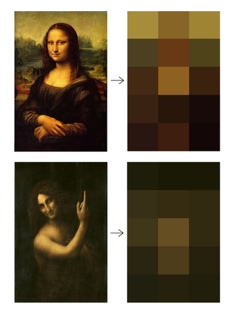
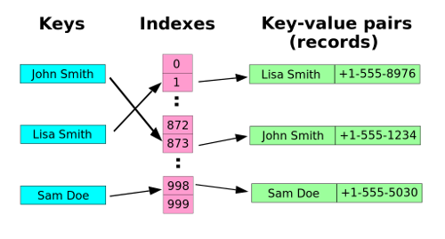

# <center><div class = "titre1">Rappels et compléments sur les dictionnaires</div></center>

## <div class = "encadré2">__Rappels de Première__</div>

### <div class = "encadré3"> __Introduction__ </div>

??? book "__Définition d'un dictionnaire__"
    Les __dictionnaires__, au même titre que les __listes__ et les __tuples__ sont des types de données construits (c'est-à-dire composés de plusieurs objets).  
    <span style="display: block; margin: 8px 0 0 0;">Mais, contrairement à ces deux derniers types, les valeurs enregistrées dans un dictionnaire ne sont pas accessibles par un indice mais par une __clé alphanumérique__.</span>
    <span style="display: block; margin: 8px 0 0 0;">L’ensemble des couples __"clé – valeur"__ sont enregistrés sous la forme `#!python clé: valeur`, l’ensemble de ces couples étant séparés par une virgule et placés entre accolades.</span>
    <span style="display: block; margin: 8px 0 0 0;">Les clés peuvent être des entiers `#!python int`, des chaînes de caractères `#!python str` et même des tuples `#!python tuple` tandis que les valeurs peuvent être de n'importe quel type.</span>

Par exemple :
```pycon
>>> d = {'clé1': 'valeur1', 'clé2': 'valeur2'}

>>> d
{'clé1': 'valeur1', 'clé2': 'valeur2'}
```

### <div class = "encadré3">__Comment créer un dictionnaire python ?__</div>

Pour initialiser un dictionnaire, on utilise l’une ou l’autre des syntaxes suivantes qui va créer une variable de type   dictionnaire `#!python dict`, vide :

```pycon
>>> a = dict()

>>> type(a)
<class 'dict'>

>>> b = {}

>>> type(b)
<class 'dict'>
```

On peut par exemple entrer des noms en clés et les numéros de téléphone en valeurs : 

```pycon
>>> a = {'Yanis': 642123456, 'Axel': 642123457, 'Milo': 642123456}

>>> a
{'Yanis': 642123456, 'Axel': 642123457, 'Milo': 642123456}
```

### <div class = "encadré3">__Comment ajouter des valeurs dans un dictionnaire python ?__</div>
   
Pour ajouter des valeurs à un dictionnaire, il faut indiquer une clé ainsi qu'une valeur sous la forme :

```python
nom_dico['clé'] = 'valeur'
```
Par exemple :
```pycon
>>> a['Eden'] = 642123458

>>> a['Lorick'] = 642123459

>>> a['Ella'] = 642123460

>>> a
{'Yanis': 642123456, 'Axel': 642123457, 'Milo': 642123456, 'Eden': 642123458, 'Lorick': 642123459, 'Ella': 642123460}
```

??? tip "__Remarque__"
    Un entier ne commence pas par `#!python 0` en python, si on veut stocker la valeur complète `#!python 0642123456`, il faudra passer les numéros en variables `#!python str`. 

La __longueur__ d’un dictionnaire est le __nombre de clés__. On l’obtient avec la fonction `#!python len(nomDico)`.
<span style="display: block; margin: 8px 0 0 0;">L’ordre dans lequel apparaissent les paires "clé – valeur" dans le dictionnaire n’a pas d’importance, car on n’accède pas aux éléments d’un dictionnaire par un index, mais par une clé, qui n’est pas nécessairement un nombre.</span>

```pycon
>>> len(a)
6
```

??? exercice "Exercice 1"
    <div class = "list6_1">

    1. Créer un dictionnaire vide nommé `#!python dico`. Ce dictionnaire comprendra en clés des mots en anglais et en valeurs une traduction possible en français.
    2. Ajouter les clés-valeurs : `#!python 'house': 'maison'`, `#!python 'bunk beds': 'lits superposés'`, `#!python 'kitchen': 'cuisine'` et `#!python 'bed room': 'pièce lit'`.
    3. Vérifier le résultat par un affichage du dictionnaire.
    4. Afficher sa longueur.

    </div>
    <center>
    [Correction de l'exercice :material-cursor-default-click:](Correction_des_exercices_du_cours.md#correction-de-lexercice-1){:target="_blank" .md-button}
    </center>

### <div class = "encadré3">__Comment récupérer une valeur dans un dictionnaire python ?__</div>

Deux façons de procéder pour récupérer une valeur dans un dictionnaire :
<div class = "couleur_puce17" markdown = "1">

* La méthode `#!python get()` : `#!python nom_dico.get('clé')`.
```pycon
>>> a.get('Ella')
642123460
```
* La méthode directe : `#!python nom_dico['clé']`.
```pycon
>>> a['Lorick']
642123459
```

</div>
Si la clé est introuvable, la méthode `#!python get()` ne renvoie rien. On peut donner une valeur à renvoyer par défaut :
```pycon
>>> a.get('Julie',"Ce nom n'existe pas dans le dictionnaire")
"Ce nom n'existe pas dans le dictionnaire"
```

??? exercice "Exercice 2"
    A partir du dictionnaire nommé `#!python dico` précédemment créé, accéder aux valeurs par les clés et tester un appel d'une clé qui n'est pas dans le dictionnaire.  
    <center>
    [Correction de l'exercice :material-cursor-default-click:](Correction_des_exercices_du_cours.md#correction-de-lexercice-2){:target="_blank" .md-button}
    </center>

### <div class = "encadré2">__Comment modifier une valeur dans un dictionnaire python ?__</div>

On peut bien sûr modifier la valeur d’une clé :
```pycon
>>> a['Lorick'] = 642123461

>>> a
{'Yanis': 642123456, 'Axel': 642123457, 'Milo': 642123456, 'Eden': 642123458, 'Lorick': 642123461, 'Ella': 642123460}
```

On pourrait par exemple dans le dictionnaire `#!python dico` précédent modifier la valeur de la clé `#!python 'bed room'` par `#!python 'chambre'`, ce qui est plus convenable.

??? exercice "Exercice 3"
    A partir du dictionnaire précédemment créé, modifier la valeur de la clé `#!python 'bed room'` par `#!python 'chambre'`.  
    <center>
    [Correction de l'exercice :material-cursor-default-click:](Correction_des_exercices_du_cours.md#correction-de-lexercice-3){:target="_blank" .md-button}
    </center>

### <div class = "encadré3">__Comment supprimer une valeur dans un dictionnaire python ?__</div>

Deux façons de procéder pour supprimer un élément dans un dictionnaire :
<div class = "couleur_puce17" markdown = "1">

* L’instruction intégrée `#!python del` : `#!python del a['clé']`.
```pycon
>>> del a['Lorick']

>>> a
{'Yanis': 642123456, 'Axel': 642123457, 'Milo': 642123456, 'Eden': 642123458, 'Ella': 642123460}
```
* La méthode `#!python pop()` : `#!python a.pop('clé')`.  
```pycon
>>> a.pop('Ella')
642123460

>>> a
{'Yanis': 642123456, 'Axel': 642123457, 'Milo': 642123456, 'Eden': 642123458}
```
</div>

La différence réside dans le fait que la méthode `#!python pop()`, en plus de supprimer la clé du dictionnaire, renvoie la valeur de cette clé.

??? exercice "Exercice 4"
    Supprimer une entrée du dictionnaire `#!python dico`.
    <center>
    [Correction de l'exercice :material-cursor-default-click:](Correction_des_exercices_du_cours.md#correction-de-lexercice-4){:target="_blank" .md-button}
    </center>

### <div class = "encadré3">__Comment parcourir les clés ou les valeurs dans un dictionnaire python ?__</div>

#### <div class = "encadré4">__Méthode <span class="roboto">key()</span>__</div>

La méthode `#!python key()` renvoie une séquence contenant les clés du dictionnaire. Si nécessaire, cette séquence peut être convertie en une liste à l’aide de la fonction intégrée `#!python list()` ou en un tuple à l’aide de la fonction intégrée `#!python tuple()`.

```pycon
>>> a.keys()
dict_keys(['Yanis', 'Axel', 'Milo', 'Eden'])

>>> list(a.keys())
['Yanis', 'Axel', 'Milo', 'Eden']

>>> tuple(a.keys())
('Yanis', 'Axel', 'Milo', 'Eden')
```

#### <div class = "encadré4">__Méthode <span class="roboto">values()</span>__</div>

La méthode `#!python values()` renvoie une séquence contenant les valeurs mémorisées dans le dictionnaire.  
<span style="display: block; margin: 5px 0 0 0;">On peut, comme pour les clés, utiliser les méthodes `#!python list()` ou `#!python tuple()` pour transformer ces séquences en listes ou en tuples.</span>

```pycon
>>> a.values()
dict_values([642123456, 642123457, 642123456, 642123458])
```

#### <div class = "encadré4">__Méthode <span class="roboto">items()</span>__</div>

La méthode `#!python items()` retourne une séquence de tuples, chaque tuple contenant deux éléments, la clé et la valeur correspondante. 
<span style="display: block; margin: 5px 0 0 0;">Par exemple :</span>
```pycon
>>> a.items()
dict_items([('Yanis', 642123456), ('Axel', 642123457), ('Milo', 642123456), ('Eden', 642123458)])
```

#### <div class = "encadré4">__Parcours par une boucle__</div>

On peut aussi parcourir le dictionnaire par une boucle en utilisant les différentes méthodes :
<div class = "couleur_puce18" markdown = "1">

* __1<sup>ère</sup> méthode__ : (*permettant de lire les clés et leurs valeurs*)
```pycon
>>> for cle in a :
...     print(f"La clé {cle} est associée à la valeur {a[cle]}")
...
...
La clé Yanis est associée à la valeur 642123456
La clé Axel est associée à la valeur 642123457
La clé Milo est associée à la valeur 642123456
La clé Eden est associée à la valeur 642123458
```
* __2<sup>nde</sup> méthode__ : (*permettant elle aussi de lire les clés et leurs valeurs*)
```pycon
>>> for cle, valeur in a.items():
...     print(f"La clé {cle} est associée à la valeur {valeur}")
...
...
La clé Yanis est associée à la valeur 642123456
La clé Axel est associée à la valeur 642123457
La clé Milo est associée à la valeur 642123456
La clé Eden est associée à la valeur 642123458
```
* __3<sup>ème</sup> méthode__ : (*permettant de ne lire que les clés du dictionnaire*)
```pycon
>>> for cle in a.keys() :
...     print(f"Les clés du dictionnaire sont {cle}")
...
...
Les clés du dictionnaire sont Yanis
Les clés du dictionnaire sont Axel
Les clés du dictionnaire sont Milo
Les clés du dictionnaire sont Eden
```
* __4<sup>ème</sup> méthode__ : (*permettant de ne lire que les valeurs du dictionnaire*)
```pycon
>>> for valeur in a.values():
...     print(f"Les valeurs du dictionnaire sont {valeur}")
...     
... 
Les valeurs du dictionnaire sont 642123456
Les valeurs du dictionnaire sont 642123457
Les valeurs du dictionnaire sont 642123456
Les valeurs du dictionnaire sont 642123458
```

</div>

??? exercice "Exercice 5"
    <div class = "list6_1">

    1. Afficher les clés et valeurs du dictionnaire `#!python dico` avec les différentes méthodes proposées.
    2. Afficher les clés du dictionnaire `#!python dico` avec une boucle.
    3. Afficher les valeurs du dictionnaire `#!python dico` avec une boucle.

    </div>
    <center>
    [Correction de l'exercice :material-cursor-default-click:](Correction_des_exercices_du_cours.md#correction-de-lexercice-5){:target="_blank" .md-button}
    </center>

### <div class = "encadré3">__Comment copier un dictionnaire : méthode <span class="roboto">copy()</span>__</div>

Supposons que l’on souhaite effectuer une copie du dictionnaire `#!python a` précédent sous le nom `#!python a2` :
```pycon
>>> a
{'Yanis': 642123456, 'Axel': 642123457, 'Milo': 642123456, 'Eden': 642123458}
   
>>> a2 = a

>>> a2
{'Yanis': 642123456, 'Axel': 642123457, 'Milo': 642123456, 'Eden': 642123458}
```

On va alors modifier le dictionnaire `#!python a2` copié :
```pycon
>>> a2['Armand'] = 642123462

>>> a2
{'Yanis': 642123456, 'Axel': 642123457, 'Milo': 642123456, 'Eden': 642123458, 'Armand': 642123462}
```

Mais on remarque que le dictionnaire `#!python a` est lui aussi modifié !
```pycon
>>> a
{'Yanis': 642123456, 'Axel': 642123457, 'Milo': 642123456, 'Eden': 642123458, 'Armand': 642123462}
```

Cela montre qu’il n’y a en fait qu’un seul objet et que `#!python a` et `#!python a2` sont en fait des références vers le même objet. Ces instructions ne créent pas une copie du dictionnaire `#!python a`, elles se contentent de créer ce que l’on appelle un alias, c’est-à-dire un autre nom pour désigner le même objet.  
Pour obtenir une vraie copie d’un dictionnaire, il faut utiliser, __comme avec les listes__, la méthode `#!python copy()` :
```pycon
>>> a3 = a.copy()

>>> a3['Mathias'] = 642123463

>>> a3
{'Yanis': 642123456, 'Axel': 642123457, 'Milo': 642123456, 'Eden': 642123458, 'Armand': 642123462, 'Mathias': 642123463}

>>> a
{'Yanis': 642123456, 'Axel': 642123457, 'Milo': 642123456, 'Eden': 642123458, 'Armand': 642123462}
```

??? exercice "Exercice 6"
    <div class = "list6_1">

    1. Copier le dictionnaire `#!python dico` dans un autre dictionnaire et modifier des valeurs.
    2. Vérifier alors les remarques du cours.

    </div>
    <center>
    [Correction de l'exercice :material-cursor-default-click:](Correction_des_exercices_du_cours.md#correction-de-lexercice-6){:target="_blank" .md-button}
    </center>

### <div class = "encadré3">__Création d’un dictionnaire par compréhension__</div>

On peut aussi construire un dictionnaire par compréhension, comme avec les listes :
```pycon
>>> comprehension = {x: x*x for x in range(10)}

>>> comprehension
{0: 0, 1: 1, 2: 4, 3: 9, 4: 16, 5: 25, 6: 36, 7: 49, 8: 64, 9: 81}
```

### <div class = "encadré3">__Concaténer deux dictionnaires : méthode <span class="roboto">update()</span>__</div>

Il est possible de concaténer deux dictionnaires avec la méthode `#!python update()` :
```pycon
>>> d = {'pommes': 1, 'oranges': 3, 'poires': 2}

>>> ud = {'poires': 4, 'raisins': 5, 'citrons': 6}

>>> d.update(ud)

>>> d
{'pommes': 1, 'oranges': 3, 'poires': 4, 'raisins': 5, 'citrons': 6}
```

### <div class = "encadré3">__Résumé des notions abordées__</div>
<div class = "couleur_puce17" markdown = "1">

* Un dictionnaire est un objet associant des clés à des valeurs.
* Pour créer un dictionnaire, on utilise la syntaxe : `#!python nom_dico = {cle1: valeur1, cle2: valeur2, … cleN: valeurN}`.
* Pour récupérer une valeur dans un dictionnaire python, on peut utiliser :

</div>
<div class = "couleur_puce17etoi_decal" markdown = "1">

* La méthode `#!python get()` : `#!python nom_dico.get('clé')`.
* La méthode directe : `#!python nom_dico['clé']`.

</div>
<div class = "couleur_puce17" markdown = "1">

* On peut ajouter ou remplacer un élément dans un dictionnaire : `#!python nom_dico[cle] = valeur`.
* On peut supprimer une clé (et sa valeur correspondante) d’un dictionnaire en utilisant :

</div>
<div class = "couleur_puce17etoi_decal" markdown = "1">

* Le mot-clé `#!python del`.
* La méthode `#!python pop()`.

</div>
<div class = "couleur_puce17" markdown = "1">

* On peut parcourir un dictionnaire grâce aux méthodes :

</div>
<div class = "couleur_puce17etoi_decal" markdown = "1">

* `#!python keys()` : parcourt les clés.
* `#!python values()` : parcourt les valeurs.
* `#!python items()` : parcourt les couples clé-valeur.

</div>
<div class = "couleur_puce17" markdown = "1">

* On peut concaténer deux dictionnaires grâce à la méthode `#!python update()` : `#!python dico1.update(dico2)`.

</div>

## <div class = "encadré2">__Implémentation d'un dictionnaire__</div>

Dans ce paragraphe, nous allons étudier la façon dont Python accède à une position (donc un indice dans une liste) à partir d'une clé.

### <div class = "encadré3">__Passage d'une clé à un indice__</div>
La transformation d'une clé en indice se fait au moyen d'une __fonction de hachage__.  

??? wiki2 "__Définition d'une fonction de hachage__"
    On nomme __fonction de hachage__, de l'anglais *hash function* (*hash* : pagaille, désordre, recouper et mélanger) par analogie avec la cuisine, une __fonction__ particulière qui, à partir d'une donnée fournie en entrée, calcule une __empreinte numérique__ servant à identifier rapidement la donnée initiale, au même titre qu'une signature pour identifier une personne.  
    <span style="display: block; margin: 8px 0 0 0;">Les fonctions de hachage sont utilisées en informatique et en cryptographie notamment pour reconnaître rapidement des fichiers ou des mots de passe.</span>
    <span style="float: right;">(*source : Wikipedia*)</span>
    <span style="display: block; margin: 40px 0 0 0;"></span>

    ??? exemple "__Exemple__"
        On considère ici une fonction de hachage consistant à convertir une image haute résolution en une empreinte très basse résolution.
        {: .image}
        L'empreinte est beaucoup plus légère en mémoire. Elle perd une grande partie de l'information mais elle reste suffisante pour distinguer rapidement deux images.

La correspondance __clé ↔ indice__ sera enregistrée dans une __table de hachage__.

??? wiki1 "__Définition d'une table de hachage__"
    Une __table de hachage__ est une structure de données qui permet une association clé–valeur, c'est-à-dire une implémentation du type abstrait dictionnaire.   
    <span style="display: block; margin: 8px 0 0 0;">Il s'agit d'un tableau ne comportant pas d'ordre (contrairement à un tableau ordinaire qui est indexé par des entiers).</span>
    <span style="display: block; margin: 3px 0 0 0;">On accède à chaque valeur du tableau par sa clé.</span>
    <span style="display: block; margin: 3px 0 0 0;">L'accès s'effectue par une fonction de hachage qui transforme la clé en une valeur de hachage (un nombre) indexant les éléments de la table, ces derniers étant appelés *alvéoles* (en anglais, *buckets* ou *slots*).</span>
    <span style="display: block; margin: 8px 0 0 0;">Comparées aux autres tableaux ordinaires, les tables de hachage sont surtout utiles lorsque le nombre de paires clé–valeur est très important.</span>
    <span style="float: right;">(*source : Wikipedia*)</span>
    <span style="display: block; margin: 40px 0 0 0;"></span>

    ??? exemple "__Exemple__"
        {: .image}
        <div></div>
        <center>

        Un annuaire représenté comme une table de hachage. 
        </center>
        La fonction de hachage transforme les clés (en bleu) en valeurs de hachage (en rose) indexant les éléments de la table (alvéoles) composés de paires clé–valeur (en vert).  

On considère, dans un premier temps, que la clé est une valeur numérique.
<span style="display: block; margin: 3px 0 0 0;">Considérons l'exemple suivant :</span>
<div class="couleur_puce17" markdown = "1">

* Les clés seront stockées dans une table de hachage de taille $~m=11~$ (les valeurs associées n'ont ici pas beaucoup d'importance, nous allons les laisser de côté).
* La fonction de hachage est la fonction $~h~$ définie par $~h(x)=x~~mod~11$.  
($~mod=~$modulo).

</div>

??? exercice "Exercice 7"
    <div class = "list6_1">

    1. Rappeler ce que fait l'opérateur modulo.
    2. Compléter la deuxième ligne du tableau suivant :
    
    </div>
    <div class="decal1">

    | Clé : $x$ | 10          |              22|      31  |              4 |              28|
    | :-------: | :---------: | :-------------:|:--------:| :-------------:| :-------------:| 
    | $h(x)$    |             |                |          |                |                |
    
    </div>
    <div class = "list6_3">

    3. Compléter la table de hachage en plaçant les clés.
    
    </div>
    <div class="decal1">

    | 0     | 1     |       2|       3  |         4 |       5|       6|       7|       8|       9|      10|
    |:----: |:----: |:------:|:--------:| :--------:| :-----:| :-----:| :-----:| :-----:| :-----:| :-----:| 
    |<br>   |       |        |          |           |        |        |        |        |        |        |
    
    </div> 
    On cherche maintenant à placer la clé $~15$.
    <div class = "list6_4">

    4. Calculer la valeur obtenue par la fonction de hachage et placer la clé dans la table. Quel est le problème ?

    </div>
    Nous venons de créer une collision. Il existe plusieurs méthodes pour traiter ce problème.
    <div class = "list6_5">

    5. Proposer une méthode pour gérer cette collision. Cette méthode permet-elle de gérer un grand nombre de collisions ?
    
    </div>
    <center>
    [Correction de l'exercice :material-cursor-default-click:](Correction_des_exercices_du_cours.md#correction-de-lexercice-7){:target="_blank" .md-button}
    </center>

### <div class = "encadré3">__Traitement des collisions par chaînage__</div>
Chaque cellule de la table de hachage est une __liste chaînée__ qui peut accueillir plusieurs éléments en cas de collision.

??? exercice "Exercice 8"
    <div class = "list6_1">

    1. Rappeler ce qu'est une liste chaînée.
    2. Avec la même fonction de hachage, ajouter les clés : $~15$, $~37$, $~59$, $~83~$ et $~88$.
    
    </div>
    <div class="decal1">

    | 0     | 1     |       2|       3  |         4 |       5|       6|       7|       8|       9|      10|
    |:----: |:----: |:------:|:--------:| :--------:| :-----:| :-----:| :-----:| :-----:| :-----:| :-----:| 
    |<br>   |       |        |          |           |        |        |        |        |        |        |
    |<br>   |       |        |          |           |        |        |        |        |        |        |
    |<br>   |       |        |          |           |        |        |        |        |        |        |
    |<br>   |       |        |          |           |        |        |        |        |        |        |

    </div>
    <div class = "list6_3">

    3. Quel défaut comporte cette méthode ? (Indice : mémoire)
    
    </div>
    <center>
    [Correction de l'exercice :material-cursor-default-click:](Correction_des_exercices_du_cours.md#correction-de-lexercice-8){:target="_blank" .md-button}
    </center>

### <div class = "encadré3">__Traitement des collisions par sondage__</div>

Lors d'une collision, l'élément est placé dans une cellule voisine libre. On doit donc "sonder" (inspecter) chaque cellule de la table de hachage jusqu'à en trouver une qui convienne.
<span style="display: block; margin: 3px 0 0 0;">Il existe plusieurs méthodes pour parcourir la table de hachage à la recherche d'une cellule vide.</span>
<span style="display: block; margin: 8px 0 0 0;">Nous allons utiliser, dans cet exemple, la méthode du double hachage. Elle consiste à utiliser une deuxième fonction afin de trouver une place libre.</span>
<div class="couleur_puce17" markdown = "1">

* La première fonction est toujours définie par $~h(x)=x~~mod~11$.
* La deuxième que nous allons utiliser est la fonction $~g~$ définie par :   
$\,\,\,\,\,\,\,\,\,\,\,\,\,\,\,\,\,\,\,\,\,\,\,\,\,\,\,\,\,\,\,\,\,\,\,\,\,\,\,\,\,\,\,\,\,\,\,\,\,\,\,\,\,\,\,\,\,\,\,\,\,\,\,\,\,~g(x)=1+x~~mod~(m-1)$.

</div>

La position est alors obtenue par la formule $~[h(x)+i×g(x)]~~mod~m$.  
<span style="display: block; margin: 3px 0 0 0;">On teste pour toutes les valeurs de $~i~$ entre $~0~$ et $~m-1~$.</span>

??? exercice "Exercice 9"
    Quelle est la formule obtenue lorsque $~i=0~$ ?  
    <center>
    [Correction de l'exercice :material-cursor-default-click:](Correction_des_exercices_du_cours.md#correction-de-lexercice-9){:target="_blank" .md-button}
    </center>

A présent, nous allons remplir la table de hachage pour les premiers termes.  
<span style="display: block; margin: 3px 0 0 0;">Nous pouvons déjà placer les premiers éléments de l'exercice 7 car il n'y avait pas de collision :</span>

| 0     | 1     |       2|       3  |         4 |       5|       6|       7|       8|       9|      10|
|:----: |:----: |:------:|:--------:| :--------:| :-----:| :-----:| :-----:| :-----:| :-----:| :-----:| 
|    22 |       |        |          |   4       |        |     28 |        |        |  31    |   10   |

La première collision se produisait pour $~x=15$, on sait donc que $~h(15)~$ (pour $~i=0$) est déjà occupée.
<div>
    
</div>
__Calcul de la nouvelle position de $~15$ :__  
<div>
    
</div>
On essaye avec $~i=1$, ce qui donne : $~[h(15)+1×g(15)]~~mod~11$.  
soit :

$[15~~mod~11+1×(1+15~~mod~10)]~~mod~11=[4+1×(1+5)]~~mod~11=10~~mod~11=10$.  
<div>
    
</div>
Il y a de nouveau collision, on essaye donc avec $~i=2~$ :  

$[15~~mod~11+2×(1+15~~mod~10)]~~mod~11=[4+2×6]~~mod~11=16~~mod~11=5$. 

On peut alors placer la clé $~15~$ dans la cellule $~5$.

??? exercice "Exercice 10"
    Placer le reste des clés.
    <div></div>
    <center>
    [Correction de l'exercice :material-cursor-default-click:](Correction_des_exercices_du_cours.md#correction-de-lexercice-10){:target="_blank" .md-button}
    </center>