# <center><div class = "titre1">Algorithmes sur les graphes</div></center>

## <div class = "encadré2">__Introduction__</div>

Un des premiers algorithmes qu’on doit savoir utiliser sur un graphe est celui de son parcours. Parcourir un graphe, c’est visiter ses différents sommets, afin de pouvoir opérer une action tour à tour sur eux.
<span style="margin :10px 0 0 0; display: block;">Les deux algorithmes fondamentaux permettant de parcourir un graphe s'appellent :</span>
<div class="couleur_puce11" markdown = "1">

* le *parcours en profondeur* d'abord ;
* le *parcours en largeur* d'abord.

</div>
Selon les actions opérées au cours d'un parcours, on peut détecter des cycles dans le graphe, trouver le chemin le plus court entre deux sommets, calculer la distance entre deux sommets, etc.
<span style="margin :10px 0 0 0; display: block;">Les algorithmes sur les graphes sont très utilisés dans la vie courante, ils permettent par exemple :</span>
<div class="couleur_puce1etoi" markdown = "1">
    
* le routage des paquets de données dans un réseau ;
* de trouver le chemin le plus court entre deux villes (utilisé par les GPS) ;
* de sortir d'un labyrinthe ;
* etc.

</div>

Dans la suite, on considérera les deux graphes $\small{G_1}$ et $\small{G_2}$ suivants :
<center>
    
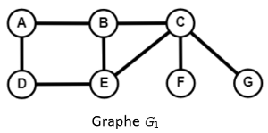
$~~~~~~~~~$
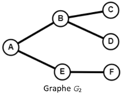
    
</center>
Ils seront représentés par listes de successeurs et implémentés par des dictionnaires.

```python
G1 = {
    "A": ["B", "D"],
    "B": ["A", "C", "E"],
    "C": ["B", "E", "F", "G"],
    "D": ["A", "E"],
    "E": ["B", "C", "D"],
    "F": ["C"],
    "G": ["C"]    
}

G2 = {
    "A": ["B", "E"],
    "B": ["A", "C", "D"],
    "C": ["B"],
    "D": ["B"],
    "E": ["A", "F"],
    "F": ["E"]
}

```

## <div class = "encadré2">__Parcours en profondeur et en largeur__</div>
### <div class = "encadré3">__Comparaison des deux algorithmes__</div>

Ces deux algorithmes ont le même but : explorer tous les sommets atteignables d'un graphe à partir d'un sommet de départ.
<span style="margin :5px 0 0 0; display: block;">L'idée est d'explorer les voisins (ou successeurs) rencontrés au fur et à mesure en marquant les sommets visités pour ne pas tourner en rond.</span>

!!! rocket "__Profondeur VS largeur__" 
    === "⬇️ $~$__Parcours en profondeur d'abord__"
        A partir d'un sommet, on explore un de ses voisins (ou successeurs), et ainsi de suite. S'il n'y a plus de voisins, on revient au sommet précédent et on passe à un autre de ses voisins.  
        <span style="margin :10px 0 0 0; display: block;">Cette façon de faire implique que chaque "branche" est explorée jusqu'au bout, avant de revenir sur nos pas, d'où le nom de parcours en *profondeur* (ou __DFS__ (pour <b>D</b>epth <b>F</b>irst <b>S</b>earch) en anglais).</span>

    === "↔️ $~$__Parcours en largeur d'abord__"
        A partir d'un sommet, on explore tous ses voisins (ou successeurs), puis on explore tous les voisins de ces voisins, et ainsi de suite.  
        <span style="margin :10px 0 0 0; display: block;">Le parcours balaie ainsi chaque "branche" au même rythme, d'où le nom de parcours en *largeur* (ou __BFS__ (pour <b>B</b>readth <b>F</b>irst <b>S</b>earch) en anglais).</span>

??? notes1 "__Remarque__"
    La seule différence entre ces deux algorithmes est donc l'ordre dans lequel les voisins sont traités. Cela permet d'écrire le même algorithme pour les deux parcours, en changeant juste la collection qui stocke les sommets à visiter : une <span style="font-family: 'Trebuchet MS' ; font-weight: bold">pile</span> pour le parcours en profondeur et une <span style="font-family: 'Trebuchet MS' ; font-weight: bold">file</span> pour le parcours en largeur.

### <div class = "encadré3">__Principe de l'algorithme de parcours en profondeur__</div>
<div class="couleur_puce17" markdown = "1">

* On choisit un sommet de départ.
* On l'empile.
* Tant que la pile n'est pas vide :

</div>
<div class="couleur_puce17etoi_decal" markdown = "1">

* On dépile son sommet.
* S'il n'a pas encore été visité, on le marque comme visité (en le plaçant dans un dictionnaire `#!python sommets_visites` par exemple) et on empile tous ses voisins non encore visités.
* Sinon on ne fait rien.

</div>
<div class="couleur_puce17" markdown = "1">

* On renvoie alors le dictionnaire obtenu.

</div>
En stockant les sommets encore à visiter dans une <span style="font-family: 'Trebuchet MS' ; font-weight: bold">pile</span>, on s'assure que ce sont les derniers sommets découverts qui vont être visités en premier (__LIFO__, *Last In First Out*).

??? Exemple1 "__Exemple__"
    On applique cet algorithme sur le graphe $\small{G_1}$ précédent à partir du sommet $\small{A}$ par exemple :

    ```python
    G1 = {
        "A": ["B", "D"],
        "B": ["A", "C", "E"],
        "C": ["B", "E", "F", "G"],
        "D": ["A", "E"],
        "E": ["B", "C", "D"],
        "F": ["C"],
        "G": ["C"]   
    }
    ```
    <div class="couleur_puce32">

    * On empile le sommet $\small{A}$ dans une pile :

    </div>
    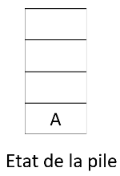{: .image}
    <div class="couleur_puce32">

    * On dépile le sommet de la pile qui est $\small{A}$.
    * $\small{A}$ n'a pas encore été visité donc on le place dans le dictionnaire `#!python visites` : `#!python visites = {'A': True}`.
    * On empile ses voisins $\small{B}$ et $\small{D}$ (qui n'ont pas encore été visités) dans la pile :

    </div>
    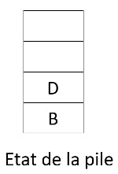{: .image}
    <div class="couleur_puce32">

    * On recommence puisque la pile n'est pas vide.
    * On dépile le sommet de la pile qui est $\small{D}$.
    * $\small{D}$ n'a pas encore été visité donc on le place dans le dictionnaire : `#!python visites = {'A': True, 'D': True}`.
    * On empile son seul voisin ($\small{E}$) qui n'a pas encore été visité (puisque $\small{A}$ l'a été) dans la pile :

    </div>
    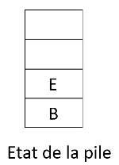{: .image}
    <div class="couleur_puce32">

    * On recommence puisque la pile n'est pas vide.
    * On dépile le sommet de la pile qui est $\small{E}$.
    * $\small{E}$ n'a pas encore été visité donc on le place dans le dictionnaire : `#!python visites = {'A': True, 'D': True, 'E': True}`.
    * On empile ses deux voisins ($\small{B}$ et $\small{C}$) qui n'ont pas encore été visités (puisque $\small{D}$ l'a été) dans la pile :

    </div>
    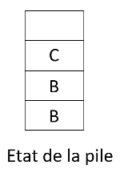{: .image}

    !!! notes2 "__Remarque__"
        Le sommet $\small{B}$ est donc empilé deux fois, en tant que voisin des sommets $\small{A}$ et $\small{E}$ mais n'est toujours pas marqué comme "visité" !
    <div class="couleur_puce32">

    * On recommence puisque la pile n'est pas vide.
    * On dépile le sommet de la pile qui est $\small{C}$.
    * $\small{C}$ n'a pas encore été visité donc on le place dans le dictionnaire : `#!python visites = {'A': True, 'D': True, 'E': True, 'C': True}`.
    * On empile ses trois voisins ($\small{B}$, $\small{F}$ et $\small{G}$) qui n'ont pas encore été visités (puisque $\small{E}$ l'a été) dans la pile :

    </div>
    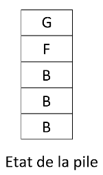{: .image}
    <div class="couleur_puce32">

    * On recommence puisque la pile n'est pas vide.
    * On dépile le sommet de la pile qui est $\small{G}$.
    * $\small{G}$ n'a pas encore été visité donc on le place dans le dictionnaire : `#!python visites = {'A': True, 'D': True, 'E': True, 'C': True, 'G': True}`.
    * $\small{G}$ n'a aucun voisin non visité.

    </div>
    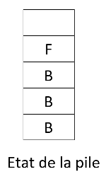{: .image}
    <div class="couleur_puce32">

    * On recommence puisque la pile n'est pas vide.
    * On dépile le sommet de la pile qui est $\small{F}$.
    * $\small{F}$ n'a pas encore été visité donc on le place dans le dictionnaire : `#!python visites = {'A': True, 'D': True, 'E': True, 'C': True, 'G': True, 'F': True}`.
    * $\small{F}$ n'a aucun voisin non visité.

    </div>
    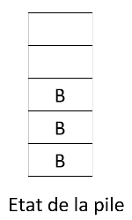{: .image}
    <div class="couleur_puce32">

    * On recommence puisque la pile n'est pas vide.
    * On dépile le sommet de la pile qui est $\small{B}$.
    * $\small{B}$ n'a pas encore été visité donc on le place dans le dictionnaire : `#!python visites = {'A': True, 'D': True, 'E': True, 'C': True, 'G': True, 'F': True, 'B': True}`.
    
    </div>
    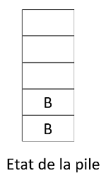{: .image}
    <div class="couleur_puce32">

    * On recommence puisque la pile n'est pas vide.
    * On dépile le sommet de la pile qui est $\small{B}$.
    * $\small{B}$ a déjà été visité.
    
    </div>
    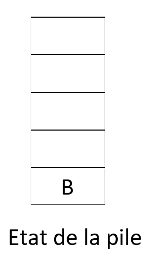{: .image}
    <div class="couleur_puce32">

    * On recommence puisque la pile n'est pas vide.
    * On dépile le sommet de la pile qui est $\small{B}$.
    * $\small{B}$ a déjà été visité.
    
    </div>
    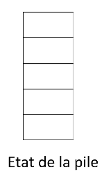{: .image}
    <div class="couleur_puce32">

    * La pile est vide !
    * Le dictionnaire retourné est donc `#!python visites = {'A': True, 'D': True, 'E': True, 'C': True, 'G': True, 'F': True, 'B': True}`.

    </div>

    !!! notes2 "__Remarque__"
        On a utilisé ici un dictionnaire pour marquer les sommets (en les ajoutant dans le dictionnaire). La valeur d'un sommet visité (ici `#!python True`) n'a pas d'importance.
        <span style="margin :5px 0 0 0; display: block;">On aurait donc pu utiliser ici une structure de données abstraite plus simple : l'ensemble (voir [Exercice 2](Exercices.md#exercice-2)).</span>
        <span style="margin :5px 0 0 0; display: block;">On verra par la suite l'intérêt d'avoir utilisé un dictionnaire plutôt qu'une autre structure.</span>

??? exercice4 "__Exercice 1__"
    Écrire pour la classe `#!python grapheNoLs` une nouvelle méthode `#!python parcours_DFS()`, qui utilise une pile.  
    <span style="margin :10px 0 0 0; display: block;">Pour tester cette méthode, on pourra utiliser la fonction suivante qui génère un graphe simple non-orienté à `#!python nb_sommets` sommets, `#!python nb_aretes` arêtes et qui est représenté par un dictionnaire :</span>

    ```python
    from random import choice

    def gen_graph_no_ls(nb_sommets, nb_aretes):
        alphabet = [chr(i+65) for i in range(nb_sommets)]
        G = grapheNoLs()
    
        for lettre in alphabet :
            G.add_sommet(lettre)
        
        s1 = choice(alphabet)
        s2 = choice(alphabet)
    
        for i in range(nb_aretes):
            while s1 == s2 or G.existe_arete(s1, s2):
                s1 = choice(alphabet)
                s2 = choice(alphabet)
            G.add_arete(s1, s2)
        return G
    ```  
    <center>
    [Correction de l'exercice 1 :material-cursor-default-click:](Correction_des_exos_algo_sur_les_graphes.md#correction-de-lexercice-1){:target="_blank" .md-button}
    </center>

### <div class = "encadré3">__Principe de l'algorithme de parcours en largeur__</div>
C'est simple, il suffit de remplacer la <span style="font-family: 'Trebuchet MS' ; font-weight: bold">pile</span> par une <span style="font-family: 'Trebuchet MS' ; font-weight: bold">file</span> !
<div class="couleur_puce17" markdown = "1">

* On choisit un sommet de départ.
* On l'enfile.
* Tant que la file n'est pas vide :

</div>
<div class="couleur_puce17etoi_decal" markdown = "1">

* On défile son premier élément.
* S'il n'a pas encore été visité, on le marque comme visité (en le plaçant dans un dictionnaire `#!python sommets_visites` par exemple) et on enfile tous ses voisins non encore visités.
* Sinon on ne fait rien.

</div>
En stockant les sommets encore à visiter dans une <span style="font-family: 'Trebuchet MS' ; font-weight: bold">file</span>, on s'assure que ce sont les premiers sommets découverts qui vont être visités en premier (__FIFO__, *First In First Out*).

??? Exemple1 "__Exemple__"
    On applique cet algorithme sur le graphe $\small{G_1}$ précédent à partir du sommet $\small{A}$ par exemple :

    ```python
    G1 = {
        "A": ["B", "D"],
        "B": ["A", "C", "E"],
        "C": ["B", "E", "F", "G"],
        "D": ["A", "E"],
        "E": ["B", "C", "D"],
        "F": ["C"],
        "G": ["C"]   
    }
    ```
    <div class="couleur_puce32">

    * On enfile le sommet $\small{A}$ dans une file :

    </div>
    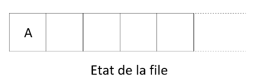{: .image}
    <div class="couleur_puce32">

    * On défile l'élément en tête de file qui est $\small{A}$.
    * $\small{A}$ n'a pas encore été visité donc on le place dans le dictionnaire `#!python visites` : `#!python visites = {'A': True}`.
    * On enfile ses voisins $\small{B}$ et $\small{D}$ (qui n'ont pas encore été visités) dans la file :

    </div>
    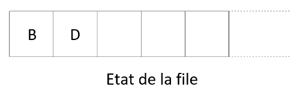{: .image}
    <div class="couleur_puce32">

    * On recommence puisque la file n'est pas vide.
    * On défile la tête de la file qui est $\small{B}$.
    * $\small{B}$ n'a pas encore été visité donc on le place dans le dictionnaire : `#!python visites = {'A': True, 'B': True}`.
    * On enfile ses deux voisins ($\small{C}$ et $\small{E}$) qui n'ont pas encore été visités (puisque $\small{A}$ l'a été) dans la file :

    </div>
    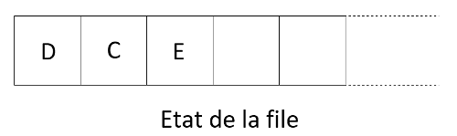{: .image}
    <div class="couleur_puce32">

    * On recommence puisque la file n'est pas vide.
    * On défile la tête de la file qui est $\small{D}$.
    * $\small{D}$ n'a pas encore été visité donc on le place dans le dictionnaire : `#!python visites = {'A': True, 'B': True, 'D': True}`.
    * On enfile son seul voisin ($\small{E}$) qui n'a pas encore été visité (puisque $\small{A}$ l'a été) dans la file :

    </div>
    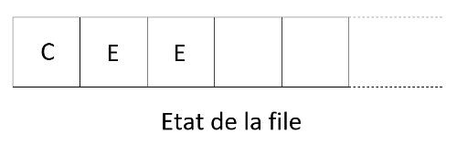{: .image}
    <div class="couleur_puce32">

    * On recommence puisque la file n'est pas vide.
    * On défile la tête de la file qui est $\small{C}$.
    * $\small{C}$ n'a pas encore été visité donc on le place dans le dictionnaire : `#!python visites = {'A': True, 'B': True, 'D': True, 'C': True}`.
    * On enfile ses trois voisins ($\small{E}$, $\small{F}$ et $\small{G}$) qui n'ont pas encore été visités (puisque $\small{B}$ l'a été) dans la file :

    </div>
    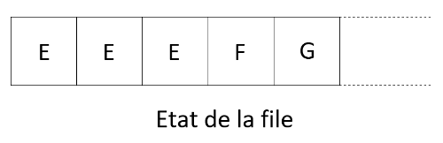{: .image}
    <div class="couleur_puce32">

    * On recommence puisque la file n'est pas vide.
    * On défile la tête de la file qui est $\small{E}$.
    * $\small{E}$ n'a pas encore été visité donc on le place dans le dictionnaire : `#!python visites = {'A': True, 'B': True, 'D': True, 'C': True, 'E': True}`.
    * $\small{E}$ n'a aucun voisin non visité.

    </div>
    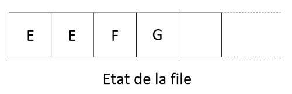{: .image}
    <div class="couleur_puce32">

    * On recommence puisque la file n'est pas vide.
    * On défile la tête de la file qui est $\small{E}$.
    * $\small{E}$ a déjà été visité.
    
    </div>
    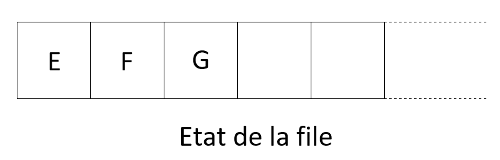{: .image}
    <div class="couleur_puce32">

    * On recommence puisque la file n'est pas vide.
    * On défile la tête de la file qui est $\small{E}$.
    * $\small{E}$ a déjà été visité.
    
    </div>
    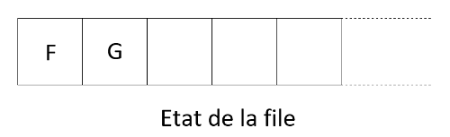{: .image}
    <div class="couleur_puce32">

    * On recommence puisque la file n'est pas vide.
    * On défile la tête de la file qui est $\small{F}$.
    * $\small{F}$ n'a pas encore été visité donc on le place dans le dictionnaire : `#!python visites = {'A': True, 'B': True, 'D': True, 'C': True, 'E': True, 'F': True}`.
    * $\small{F}$ n'a aucun voisin non visité.
    
    </div>
    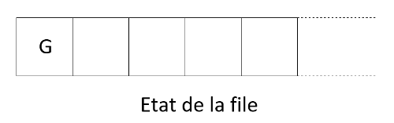{: .image}
    <div class="couleur_puce32">

    * On recommence puisque la file n'est pas vide.
    * On défile la tête de la file qui est $\small{G}$.
    * $\small{G}$ n'a pas encore été visité donc on le place dans le dictionnaire : `#!python visites = {'A': True, 'B': True, 'D': True, 'C': True, 'E': True, 'F': True, 'G': True}`.
    * $\small{G}$ n'a aucun voisin non visité.
    
    </div>
    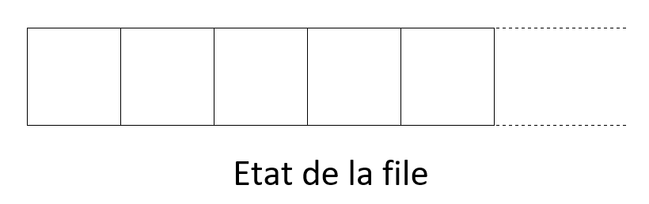{: .image width=50%}
    <div class="couleur_puce32">

    * La file est vide !
    * Le dictionnaire retourné est donc `#!python visites = {'A': True, 'B': True, 'D': True, 'C': True, 'E': True, 'F': True, 'G': True}`.

    </div>

??? exercice4 "__Exercice 2__"
    Écrire pour la classe `#!python grapheNoLs` une nouvelle méthode `#!python parcours_BFS()`, qui utilise une file.  
    
    <center>
    [Correction de l'exercice 2 :material-cursor-default-click:](Correction_des_exos_algo_sur_les_graphes.md#correction-de-lexercice-2){:target="_blank" .md-button}
    </center>

!!! warning "__Attention__"
    Quel que soit le parcours, l'ordre de parcours dépend de l'ordre dans lequel sont stockés les voisins dans les listes de voisins/successeurs car celui-ci détermine l'ordre d'ajout dans la <span style="font-family: 'Trebuchet MS' ; font-weight: bold">pile</span> ou la <span style="font-family: 'Trebuchet MS' ; font-weight: bold">file</span>. Il y a donc plusieurs réponses possibles pour un même parcours.

## <div class = "encadré2">__Repérer la présence d'un cycle/circuit dans un graphe__</div>

Rappelons les définitions d'un cycle et d'un circuit :
<div class="couleur_puce11" markdown="1">

* Dans un graphe __non-orienté__, un __cycle__ est une suite d'arêtes consécutives (chaîne) dont les deux sommets extrémités sont identiques.
* Dans un graphe __orienté__, un __circuit__ est une suite d'arcs consécutifs (chemin) dont les deux sommets extrémités sont identiques.

</div>

### <div class = "encadré3">__Principe de l'algorithme de détection de cycle__</div>

Il suffit d'adapter légèrement, au choix, l'un des deux algorithmes de parcours du graphe. Si lors du parcours on rencontre (en dépilant ou en défilant) un sommet déjà visité (marqué grâce à une liste), on a trouvé un cycle !  
<span style="margin :10px 0 0 0; display: block;">En effet, cela signifie que ce sommet a été ajouté au moins deux fois dans la pile ou dans la file, ce qui veut dire que l'on peut l'atteindre par au moins deux sommets différents. Ces deux chemins ayant pour origine le sommet de départ du parcours, on a nécessairement un cycle.</span>
<span style="margin :10px 0 0 0; display: block;">L'algorithme est alors identique à celui d'un parcours en stoppant le parcours si un cycle est trouvé.</span>
<span style="margin :10px 0 0 0; display: block;">Enfin, si le graphe non-orienté est connexe, on peut tester la présence d'un cycle à partir de n'importe quel sommet de départ. En revanche, pour un graphe non connexe (et toujours non-orienté), il faut s'assurer de parcourir tous ses sommets. On peut par exemple lancer la détection à partir de chaque sommet.</span>

??? exercice4 "__Exercice 3__"
    Écrire pour la classe `#!python grapheNoLs` la méthode `#!python is_cycle()` qui renvoie `#!python True` si le graphe présente un cycle.  

    <center>
    [Correction de l'exercice 3 :material-cursor-default-click:](Correction_des_exos_algo_sur_les_graphes.md#correction-de-lexercice-3){:target="_blank" .md-button}
    </center>

### <div class = "encadré3">__Principe de l'algorithme de détection d'un circuit__</div>

La précédente technique ne marche plus si l'on recherche la présence d'un circuit dans un graphe orienté.
<span style="margin :10px 0 0 0; display: block;">En effet, ce n'est pas parce qu'un sommet a été ajouté deux fois dans une pile ou une file qu'il y a présence d'un cycle. Il est possible que ce sommet soit atteint par deux arcs entrants comme l'exemple suivant :</span>
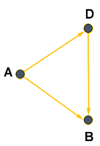{: .image}
Par contre, il est toujours possible d'adapter l'un des deux algorithmes de parcours du graphe, en comparant le sommet de départ avec les successeurs de chaque sommet découvert pendant le parcours. Si l'un des successeurs est le sommet de départ, c'est qu'il y a un circuit !
<span style="margin :5px 0 0 0; display: block;">Il suffit de faire cette vérification en partant de n'importe quel sommet du graphe.</span>

??? exercice4 "__Exercice 4__"
    Écrire pour la classe `#!python grapheOLs` la méthode `#!python is_circuit()` qui renvoie `#!python True` si le graphe présente un circuit.  

    <center>
    [Correction de l'exercice 4 :material-cursor-default-click:](Correction_des_exos_algo_sur_les_graphes.md#correction-de-lexercice-4){:target="_blank" .md-button}
    </center>

## <div class = "encadré2">__Recherche d'un chemin/d'une chaîne dans un graphe__</div>
Rappelons quelques définitions :
<div class="couleur_puce11" markdown="1">

* Dans un graphe non orienté, une chaîne est une séquence ordonnée d'arêtes telle que chaque arête a une extrémité en commun avec l'arête suivante.
* Dans un graphe orienté, un chemin désigne une séquence ordonnée d'arcs consécutifs.

</div>

!!! notes1 "__Remarque__"
    Dans la suite, on ne parlera que de chaînes ou de chemins simples, c'est-à-dire n'empruntant pas deux fois la même arête (ou le même arc).

En utilisant un parcours en profondeur ou en largeur, on peut trouver tous les sommets accessibles à partir d'un sommet de départ. Cela permet d'écrire très facilement un algorithme qui renvoie `#!python True` s'il existe un chemin pour aller d'un point $\small{A}$ à un point $\small{B}$. Il suffit de lancer l'un des deux parcours à partir du sommet $\small{A}$ et de regarder à la fin du parcours si le sommet $\small{B}$ a été atteint (s'il est dans le dictionnaire `#!python sommets_visites`).
<span style="margin :10px 0 0 0; display: block;">Cependant, cet algorithme ne permet pas d'exhiber un tel chemin. Pour cela, il faut travailler un peu plus.</span>

### <div class = "encadré3">__Principe de l'algorithme de recherche d'un chemin/d'une chaîne__</div>

Une idée est __d'utiliser différemment le dictionnaire `#!python sommets_visites`__. Celui-ci ne servira plus à marquer (à `#!python True`) les sommets visités mais associera à chaque sommet, le sommet qui permet de l'atteindre pour la première fois (le premier sommet duquel il est voisin dans le parcours).
<span style="margin :10px 0 0 0; display: block;">Autrement dit, dès qu'on visite un sommet, il faut l'associer à tous ses voisins (non encore visités) dans le dictionnaire. On initialisera à `#!python None` le sommet initial dans le dictionnaire. A la fin du parcours, il suffira de "remonter" le dictionnaire du sommet de fin au sommet de début.</span>
<span style="margin :10px 0 0 0; display: block;">Voici le principe plus en détail (en utilisant un parcours en profondeur) :</span>
<div class="couleur_puce17" markdown="1">

* On choisit le sommet de départ que l'on associe à `#!python None`.
* On l'empile.
* Tant que la pile n'est pas vide :

</div>
<div class="couleur_puce17etoi_decal" markdown="1">

* On dépile son sommet `#!python s`.
* On empile tous ses voisins non encore visités et on les associe à la valeur `#!python s` dans le dictionnaire.

</div>

La méthode `#!python parcours_chemin_DFS()` suivante, basée sur un parcours en profondeur, permet de construire ce dictionnaire :

```python
def parcours_chemin_DFS(self, debut):
    sommets_visites = {debut: None} # on associe le sommet de départ à None
    p = Pile()
    p.empiler(debut)
    while not p.est_vide():
        s = p.depiler()
        liste_voisins = [y for y in self.voisins(s) if y not in sommets_visites]
        for voisin in liste_voisins:
            p.empiler(voisin)
            sommets_visites[voisin] = s # on associe s à tous les voisins de s pas encore visités
    return sommets_visites

```

??? Exemple1 "__Exemple__"
    On peut lancer le parcours sur le graphe $\small{G_1}$ à partir du sommet $\small{A}$ :
    {: .image}

    ```pycon
    >>> parcours_chemin_DFS("A")
    {'A': None, 'B': 'A', 'D': 'A', 'E': 'D', 'C': 'E', 'F': 'C', 'G': 'C'}

    ```

    Pour trouver un chemin entre le sommet $\small{A}$ et le sommet $\small{G}$, il faut "remonter" les sommets à partir de $\small{G}$ :
    <div class="couleur_puce32">

    * On cherche $\small{G}$ : il est associé à la valeur $\small{C}$ donc on a pu atteindre $\small{G}$ à partir de $\small{C}$.
    * On cherche $\small{C}$ : atteint à partir de $\small{E}$.
    * On cherche $\small{E}$ : atteint à partir de $\small{D}$.
    * On cherche $\small{D}$ : atteint à partir de $\small{A}$.

    </div>
    On a terminé puisqu'on a fini par tomber sur $\small{A}$.  
    <span style="margin :5px 0 0 0; display: block;">Un chemin possible entre $\small{A}$ et $\small{G}$ est donc : `#!python A --> D --> E --> C --> G`.</span>

    !!! notes2 "__Remarque__"
        Nous étions sûr de remonter jusqu'à $\small{A}$ puisque $\small{G}$, se trouvant dans le dictionnaire, était nécessairement atteignable en partant de $\small{A}$. Si un sommet ne se trouve pas dans le dictionnaire, on sait alors qu'il n'existe pas de chemin vers ce sommet en partant de $\small{A}$.

La méthode `#!python chemin_DFS(debut, fin)` permet d'effectuer le travail de "remonter" en renvoyant une liste `#!python ch` contenant les sommets du chemin trouvé entre les sommets `#!python debut` et `#!python fin`. Elle ajoute les sommets à `#!python ch` au fur et à mesure de la remontée jusqu'à tomber sur celui de départ et renvoie ensuite cette liste qui a été préalablement renversée pour obtenir les sommets dans le bon ordre :

```python
def chemin_DFS(self, debut, fin):
    sommets_visites = self.parcours_chemin_DFS(debut)
    if fin not in sommets_visites:
        return None
    s = fin
    ch = [s]           # on ajoute le sommet de fin à partir duquel commence la "remontée"
    while s != debut:  # tant qu'on ne trouve pas le sommet de départ
        s = sommets_visites[s] # on remonte en passant au sommet associé
        ch.append(s)   # qu'on ajoute au chemin
    ch.reverse()       # ne pas oublier de renverser la liste pour renvoyer le chemin dans le bon ordre
    return ch

```

??? Exemple1 "__Exemple__"
    On vérifie alors le résultat du précédent exemple :
    ```pycon
    >>> chemin_DFS("A", "G")
    ['A', 'D', 'E', 'C', 'G']

    ```

!!! notes2 "__Remarque__"
    On constate que le chemin n'est pas le plus court car on peut faire mieux : `#!python A --> B --> C --> G`.  
    Peut-on trouver le chemin le plus court ? La réponse est oui !

### <div class = "encadré3">__Recherche d'un plus court chemin__</div>

En faisant la même recherche à partir d'un parcours en largeur, on obtiendrait un plus court chemin (en nombre d'arêtes/arcs).
<span style="margin :10px 0 0 0; display: block;">En effet, l'algorithme de recherche en largeur explore d'abord les sommets à une distance `#!python 1` du sommet de départ, puis ceux à distance `#!python 2` du sommet de départ, etc. Ainsi, chacun des autres sommets est atteint en passant par un nombre minimal d'arêtes (ou arcs), ce qui assure de trouver un plus court chemin (en nombre d'arêtes/arcs) vers chacun des autres sommets.</span>

```python
# on remplace la pile par une file
def parcours_chemin_BFS(self, debut):
    sommets_visites = {debut: None} # on associe le sommet de départ à None
    f = File()
    f.enfiler(debut)
    while not f.est_vide():
        s = f.defiler()
        liste_voisins = [y for y in self.voisins(s) if y not in sommets_visites]
        for voisin in liste_voisins:
            f.enfiler(voisin)
            sommets_visites[voisin] = s # on associe s à tous les voisins de s pas encore visités
    return sommets_visites

# exactement la même fonction que cheminDFS (en remplacant juste l'appel à la première ligne)
def chemin_BFS(self, debut, fin):
    sommets_visites = self.parcours_chemin_BFS(debut)
    if fin not in sommets_visites:
        return None
    s = fin
    ch = [s]
    while s != debut:
        s = sommets_visites[s]
        ch.append(s)
    ch.reverse()
    return ch

```

??? Exemple1 "__Exemple__"
    On constate sur l'exemple précédent qu'on obtient le plus court chemin :
    ```pycon
    >>> chemin_BFS("A", "G")
    ['A', 'B', 'C', 'G']

    ```

### <div class = "encadré3">__Distance entre les sommets__</div>

En modifiant le rôle du dictionnaire `#!python sommets_visites` utilisé dans la recherche de chemin du parcours en largeur, on peut très facilement trouver la distance du sommet de départ à tous les autres. On va utiliser `#!python sommets_visites` pour associer à chaque sommet la distance qui le sépare du sommet d'origine. La distance d'un sommet découvert est celle du sommet d'où l'on vient, plus 1 !
<span style="margin :10px 0 0 0; display: block;">En initialisant une distance égale à `#!python 0` pour le sommet de départ, on obtient, en changeant uniquement une ligne, les distances entre chaque sommet et le sommet de départ :</span>

```python
def parcours_distance_BFS(self, debut):
    sommets_visites = {debut: 0} # debut est à distance 0 de lui-même
    f = File()
    f.enfiler(debut)
    while not f.est_vide():
        s = f.defiler()
        liste_voisins = [y for y in self.voisins(s) if y not in sommets_visites]
        for voisin in liste_voisins:
            f.enfiler(voisin)
            sommets_visites[voisin] = sommets_visites[s] + 1 # la distance est celle de s (d'où l'on vient) + 1
    return sommets_visites
```

??? Exemple1 "__Exemple__"
    On peut vérifier les distances entre le sommet $\small{A}$ et les autres dans le graphe $\small{G_1}$.
    ```pycon
    >>> parcours_distance_BFS("A")
    {'A': 0, 'B': 1, 'D': 1, 'C': 2, 'E': 2, 'F': 3, 'G': 3}

    ```

Les notions de plus court chemin ou de distance que l'on vient de voir, correspondent au nombre d'arêtes/arcs séparant les sommets. On suppose donc que chaque arête à le même coût dans ce calcul.  Autrement dit, nos algorithmes s'appliquent sur des graphes non pondérés (ou des graphes dans lesquels toutes les arêtes ont le même poids).
<span style="margin :10px 0 0 0; display: block;">Avec des graphes pondérés, les arêtes n'ont pas toutes le même coût, ce qui redéfinit cette notion de distance. C'est le cas de la plupart des graphes rencontrés dans la vie courante. On ne peut donc plus appliquer l'algorithme de plus court chemin étudié. Il en existe heureusement d'autres : le plus connu d'entre eux est __l'algorithme de Dijskstra__ (voir [DM](DM.md){:target="_blank"}).</span>

## <div class = "encadré2">__Bilan__</div>
<div class="couleur_puce13"  markdown="1">

* Les algorithmes de parcours de graphe permettent de visiter tous les sommets d'un graphe. On a le choix entre un __parcours en profondeur d'abord__ ou un __parcours en largeur d'abord__.
* La différence entre ces deux algorithmes est l'ordre dans lequel on visite tous les sommets. On peut donc les écrire de manière similaire en changeant juste la structure de données qui stocke les sommets à visiter : une <span style="font-family: 'Trebuchet MS' ; font-weight: bold">pile</span> pour poursuivre le parcours avec les derniers sommets rencontrés (parcours en profondeur) ou une <span style="font-family: 'Trebuchet MS' ; font-weight: bold">file</span> pour poursuivre le parcours avec les premiers sommets rencontrés (parcours en largeur).
* Pour ne pas tourner en rond, il faut __marquer les sommets visités__ au cours du parcours. On a utilisé un dictionnaire pour faire ce travail.
* En modifiant le rôle et la façon d'utiliser ce dictionnaire, on peut facilement adapter les algorithmes de parcours pour __repérer la présence d'un cycle__, pour __trouver un chemin entre deux sommets__, voire __le plus court d'entre eux__.
* L'algorithme de parcours en largeur assure de trouver un plus court chemin dans un graphe non pondéré car il explore les différents sommets dans l'ordre de leur distance à celui de départ (ceux à distance 1, puis ceux à distance 2, etc.).
* __L'algorithme de Dijkstra__ (hors programme) permet de trouver le plus court chemin entre deux sommets dans un graphe pondéré : c'est celui utilisé pour router les paquets dans un réseau, pour nous guider avec un GPS, pour sortir d'un labyrinthe...

</div>