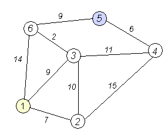
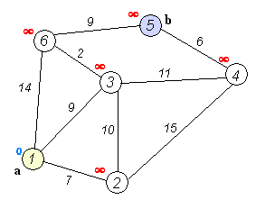
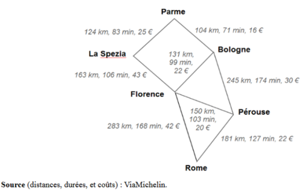

# <center><div class = "titre8">Devoir maison : l'algorithme de Dijkstra</div></center>

En théorie des graphes, __l'algorithme de Dijkstra__ (prononcé [*dɛɪkstra*]) sert à résoudre le problème du plus court chemin. Il permet, par exemple, de déterminer un plus court chemin pour se rendre d'une ville à une autre connaissant le réseau routier d'une région. Plus précisément, il calcule des plus courts chemins à partir d'une source vers tous les autres sommets dans un __graphe orienté ou non et pondéré par des réels positifs__. On peut aussi l'utiliser pour calculer un plus court chemin entre un sommet de départ et un sommet d'arrivée.
<span style="margin :10px 0 0 0; display: block;">L'algorithme porte le nom de son inventeur, l'informaticien néerlandais <a href="https://fr.wikipedia.org/wiki/Edsger_Dijkstra" target="_blank">Edsger Dijkstra</a>, et a été publié en 1959.</span>

### <div class = "encadré_DM">Principe sur un exemple</div>
A partir du graphe suivant, on cherche la longueur minimale entre les sommets `#!python 1` et `#!python 5`.

{: .image}

Le chemin `#!python 1 - 6 - 5` a un poids (ou une longueur) de $\small{23}$.
Ce n'est pas le chemin menant de `#!python 1` à `#!python 5` qui a le poids minimal. En effet, il s'agit du chemin `#!python 1 - 3 - 6 - 5` dont la longueur est de $\small{20}$. 

__Question__ : Comment déterminer à chaque fois le chemin entre deux sommets d'un graphe dont le poids est minimal ?

L'algorithme de Dijkstra permet de résoudre ce type de problème dans les graphes pondérés connexes et à pondérations positives.

!!! key1 "__Principe__"
    <div class="couleur_puce40">

    * On attribue au sommet de départ la marque `#!python 0`, et on note `#!python None` son père.
    * On attribue à tous les autres sommets du graphe la marque $+\infty$.
    * On liste tous les sommets du graphe (notons cette liste `#!python nonSelectionnes` par exemple)
    * On sélectionne le sommet de départ.
    * Tant qu'il reste des sommets non sélectionnés :

    </div>
    <div class="couleur_puce40etoi_decal">
    
    * On sélectionne parmi les sommets non sélectionnés, le sommet `#!python X` ayant la marque la plus petite (`#!python X` est supprimé de la liste des non sélectionnés).
    * On actualise la marque et le père des sommets adjacents. autrement dit, pour chaque sommet `#!python Y` adjacent à `#!python X` et non déjà sélectionné :

    </div>
    <div class="decal10">
    <div class="couleur_puce40carré">

    * On calcule `#!python p = (marque de X) + (poids de l’arête X - Y)`
    * Si `#!python p < marque de Y` alors on remplace la marque de `#!python Y` par `#!python p` et on note que le père de `#!python Y` est `#!python X`

    </div>
    </div>

!!! rocket "__Illustration__"
    Le schéma ci-dessous montre le fonctionnement de cet algorithme :
    {: .image}

### <div class = "encadré_DM">Représentation d'un graphe pondéré</div>
Pour représenter un graphe pondéré, on utilisera un dictionnaire.  
<span style="margin :5px 0 0 0; display: block;">Les clés seront les sommets du graphe et les valeurs seront des dictionnaires contenant comme clés les sommets adjacents et les poids des arêtes.</span>
<span style="margin :10px 0 0 0; display: block;">Pour notre exemple cela donne :</span>

```python
graphe = {
'1':{'2': 7, '3': 9,'6': 14},
'2':{'1': 9, '3': 10, '4': 15},
'3':{'1': 9, '2': 10, '4': 11, '6': 2},
'4':{'2': 15, '3': 11, '5': 6},
'5':{'4': 6, '6': 9},
'6':{'1': 14, '3': 2, '5': 9},
}

```

### <div class = "encadré_DM">Le code du programme</div>
Voici un code "pas très propre" qui fait le travail...

```python
from math import inf # permet d'utiliser + infini

graphe = {
'1':{'2': 7, '3': 9,'6': 14},
'2':{'1': 7, '3': 10, '4': 15},
'3':{'1': 9, '2': 10, '4': 11, '6': 2},
'4':{'2': 15, '3': 11, '5': 6},
'5':{'4': 6, '6': 9},
'6':{'1': 14, '3': 2, '5': 9},
}

depart = '1'
arrivee = '5'

# initialisation
marque = {}

for sommet in graphe:
    marque[sommet] = inf

marque[depart] = 0
non_selectionnes = [sommet for sommet in graphe]

pere = {}
pere[depart] = None

# boucle principale:
while non_selectionnes:
    marque_plus_petite = inf
    for s in non_selectionnes:
        if marque[s] < marque_plus_petite:
            marque_plus_petite = marque[s]
            sommet_plus_petit = s
    if sommet_plus_petit == arrivee:
        break
    non_selectionnes.remove(sommet_plus_petit)
    voisins_a_visiter = [sommet for sommet in graphe[sommet_plus_petit] if sommet in non_selectionnes]
    for sommet in voisins_a_visiter:
        p = marque[sommet_plus_petit] + graphe[sommet_plus_petit][sommet]
        if p < marque[sommet]:
            marque[sommet] = p
            pere[sommet] = sommet_plus_petit

# affichage de la distance   
print(f"La distance de {depart} à {arrivee} est de longueur {marque[arrivee]}.")
chemin, sommet = arrivee, arrivee
while pere[sommet] != None:
    chemin = pere[sommet] +' - '+ chemin
    sommet = pere[sommet]
print()
print("Le chemin de {depart} à {arrivee} : {chemin}.")

```

### <div class = "encadré_DM">Exercice 1</div>
<div class="list19_1" markdown="1">

1. Organiser le code autour des 3 fonctions suivantes :
```python
from math import inf

graphe = {
'1':{'2': 7, '3': 9,'6': 14},
'2':{'1': 9, '3': 10, '4': 15},
'3':{'1': 9, '2': 10, '4': 11, '6': 2},
'4':{'2': 15, '3': 11, '5': 6},
'5':{'4': 6, '6': 9},
'6':{'1': 14, '3': 2, '5': 9},
}

def mini(liste_sommets, marque):
    """
    Renvoie le sommet de liste_sommets ayant la plus petite marque.
    """
    Pass

def dijkstra(graphe, depart, arrivee):
    """
    Renvoie les dictionnaires marque et pere une fois le chemin allant de depart à arrivee de longueur minimale déterminé.
    """
    Pass

def affichage_chemin_min(graphe, depart, arrivee):
    distance, pere = dijkstra(graphe, depart, arrivee)
    print(f"La distance de {depart} à {arrivee} est de longueur {distance[arrivee]}.")
    # A compléter
    print(f"Le chemin de {depart} à {arrivee} : {chemin}.")


affichage_chemin_min(graphe, '1', '5')

```
2.  Documenter chaque fonction en utilisant les docstrings.
3.  Vérifier que ce code respecte les recommandations de la __PEP8__ à partir du site en ligne : <a href="https://www.pythonchecker.com/" target="_blank">pythonchecker</a>

</div>

### <div class = "encadré_DM">Exercice 2</div>
C'est bien connu, tous les chemins mènent à Rome, même pour un parmesan (un habitant de Parme !).
{: .image}
Modifier le programme précédent afin de déterminer dans chaque cas le chemin allant de Parme à Rome :
<div class="list19_1" markdown="1">

1. Le moins long.
2. Le plus rapide.
3. Le moins cher.

</div>

!!! notes1 "__Remarque__"
    On pourra ajouter l'argument `#!python type_parcours` aux fonctions `#!python dijkstra()` et `#!python affichageCheminMin()`.  
    <span style="margin :5px 0 0 0; display: block;">On pourra aussi lister les éléments du dictionnaire repésentant le graphe sous la forme :</span>
    ```python
    italie = {
    'Parme': {'Bologne': [104, 71, 16], 'La Spezia': [124, 83, 24]},
    ...
    }

    ```