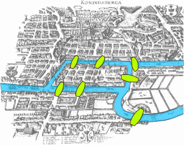
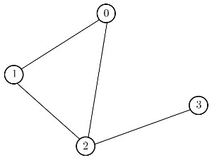
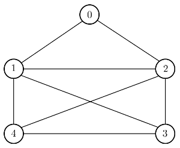
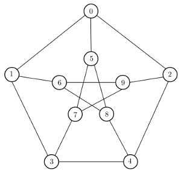
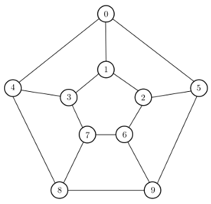
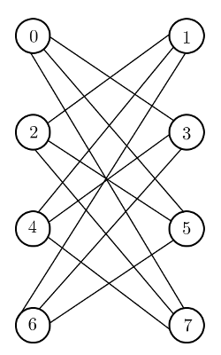

# <center><div class = "titre2"> Exercices </div></center>
  
### <div class = "encadré_exo">__Exercice 1__</div>
<div class="list1_1" markdown="1">

1. Ajouter aux deux classes `#!python grapheNoMa` et `#!python grapheNoLs` une méthode `#!python degre_sommet()` qui permet de renvoyer le degré d'un sommet.
2. Même question mais cette fois-ci avec les classes `#!python grapheOMa` et `#!python grapheOLs`.

</div>

<center>
[Correction de l'exercice 1 :material-cursor-default-click:](Correction_des_exos.md#correction-de-lexercice-1){:target="_blank" .md-button}
</center>

### <div class = "encadré_exo">__Exercice 2__</div>

Dans le cas de la représentation par liste de successeurs, nous avons utilisé un dictionnaire dans lequel les successeurs de chaque sommet étaient mémorisés dans une `#!python list` Python.  
<span style="margin :10px 0 0 0; display: block;">Par exemple :</span>
```python
g1 = {
    "A": ["B", "F", "G"],
    "B": ["A", "C", "F"],
    "C": ["B", "D", "F"],
    "D": ["C", "E"],
    "E": ["D", "E", "F"],
    "F": ["A", "B", "C", "E", "G"],
    "G": ["A", "F"]
}
```
A la place d'une liste, il est possible d'utiliser un ensemble pour mémoriser les successeurs. Le type prédéfini `#!python set` de Python implémente la structure de données abstraite "ensemble".  
<span style="margin :10px 0 0 0; display: block;">On peut voir les ensembles de Python comme des dictionnaires (on utilise aussi les accolades) dans lequel il n'y aurait que des clés (et non des paires `#!python (clé, valeur)`). Le graphe précédent deviendrait :</span>
```python
g1 = {
    "A": {"B", "F", "G"},
    "B": {"A", "C", "F"},
    "C": {"B", "D", "F"},
    "D": {"C", "E"},
    "E": {"D", "E", "F"},
    "F": {"A", "B", "C", "E", "G"},
    "G": {"A", "F"}
}
```

!!! question "__Quel intérêt ?__"
	Le type `#!python set` est implémenté, comme le type `#!python dict`, par une table de hachage qui permet un accès en temps constant aux éléments qu'il contient, ce qui n'est pas le cas d'une liste où cet accès se fait en temps linéaire. Ainsi, tester si un sommet est un successeur d'un autre est beaucoup plus rapide si les successeurs sont mémorisés dans un ensemble que dans un tableau. Pour des graphes importants avec beaucoup de successeurs, le gain de temps est important.

!!! book1 "__Documentation__"
	Le tutoriel officiel Python sur les <a href="https://docs.python.org/fr/3/tutorial/datastructures.html#sets" target="_blank">ensembles</a>.  
    <span style="margin :10px 0 0 0; display: block;">La documentation officielle sur le type <a href="https://docs.python.org/fr/3/library/stdtypes.html#set-types-set-frozenset" target="_blank">`#!python set`</a>.</span>

Pour initialiser un ensemble `#!python s` vide, il suffit d'appeler le constructeur de classe :

```python
s = set()
```

A partir de la classe `#!python grapheNoLs`, créer une classe `#!python grapheNoLsSet` qui permet de mémoriser les voisins de chaque sommet dans un ensemble à la place d'une liste.  

<center>
[Correction de l'exercice 2 :material-cursor-default-click:](Correction_des_exos.md#correction-de-lexercice-2){:target="_blank" .md-button}
</center>

### <div class = "encadré_exo">__Exercice 3__</div>
<div class="list1_1" markdown="1">

1. Proposer une implémentation en une classe `#!python grapheValueNoMa` d'un __graphe valué non orienté__ par une matrice d'adjacence.
2. Proposer une implémentation en une classe `#!python grapheValueNoLs` d'un __graphe valué non orienté__ par une liste de successeurs.

</div>

<center>
[Correction de l'exercice 3 :material-cursor-default-click:](Correction_des_exos.md#correction-de-lexercice-3){:target="_blank" .md-button}
</center>

### <div class = "encadré_exo">__Exercice 4__</div>
Le parcours en profondeur peut être réalisé par récursivité :
<div class="couleur_puce14" markdown="1">

* L’ensemble des sommets déjà visités est stocké dans une liste.
* La visite est relancée récursivement pour chaque voisin du sommet visité.

</div>
Écrire pour la classe `#!python grapheNoLs` une nouvelle méthode récursive `#!python parcours_DFS_rec()`.

<center>
[Correction de l'exercice 4 :material-cursor-default-click:](Correction_des_exos.md#correction-de-lexercice-4){:target="_blank" .md-button}
</center>

### <div class = "encadré_exo">__Exercice 5__</div>
On dispose de la classe `#!python grapheNoLs`. On considère donc que l'on travaille sur un graphe non orienté.

<span style="color : #f36379; font-size: 18px; font-weight: bold;">Partie A</span>  
On rappelle qu'un graphe est connexe lorsque toute paire de sommets est reliée par une chaîne.  
<div class="list1_1" markdown="1">

1. Expliquer pourquoi un parcours en largeur ou en profondeur suffit à déterminer si un graphe non orienté est connexe.
2. Ecrire une méthode `#!python est_connexe()` qui renvoie un booléen indiquant si un graphe non orienté est connexe ou non.

</div>
<span style="color : #f36379; font-size: 18px; font-weight: bold;">Partie B</span>  
Le problème suivant est à l'origine de la création de la théorie des graphes par Euler en 1736.
<span style="margin :10px 0 0 0; display: block;">Les habitants de la ville de __Königsberg__ (aujourd'hui Kaliningrad), dont un plan est donné ci-dessous, désiraient savoir s'il était possible lors d'une promenade de passer tous les ponts de la ville une fois et une seule :</span>

{: .image}

On appelle __chaîne eulérienne__ une chaîne qui parcourt toutes les arêtes d'un graphe une fois et une seule. On appelle __graphe eulérien__ un graphe où il existe une chaîne eulérienne.
<span style="margin :10px 0 0 0; display: block;">Le théorème d'Euler affirme : « Un graphe est eulérien si et seulement si il est connexe et possède zéro ou deux sommets de degré impair.»</span>
<div class="list1_1" markdown="1">

1. Le problème des ponts de Königsberg admet-il une solution ?
2. Ecrire une méthode `#!python est_eulerien()` qui renvoie un booléen indiquant si un graphe est eulérien.
 
</div>
<center>
[Correction de l'exercice 5 :material-cursor-default-click:](Correction_des_exos.md#correction-de-lexercice-5){:target="_blank" .md-button}
</center>

### <div class = "encadré_exo">__Exercice 6__</div>

<center><span style="color : red; font-size: 18px; font-weight: bold;border: 4px ridge red; padding:1px 2px 1px 2px;">Algorithmes de coloration de sommets</span></center>

On veut colorier chaque sommet d'un graphe de telle sorte que deux sommets voisins soient de couleurs différentes.  
Le but est de trouver le nombre minimale de couleurs (ce nombre est appelé __nombre chromatique__ du graphe).
<div class="list1_1" markdown="1">

1. Trouver les nombres chromatiques des graphes suivant :

</div>
$~~~~~~~~~$

$~~~~~~~~~~~~~~~~~~~~~~~~~~~$


$~~~~~~~~~$

$~~~~~~~~~~~~~~~~~~~~~~~~~~~$

<center>

</center>
<div class="list1_2" markdown="1">

2. Pour résoudre le problème on va associer à chaque sommet un indice 0, 1, 2 ... qui sera sa couleur sachant donc que deux sommets voisins ne peuvent avoir le même indice. A la fin il faut retourner un dictionnaire qui associe à chaque sommet son indice et le nombre de couleurs utilisées.  
<span style="margin :5px 0 0 0; display: block;">Pour ce faire, on propose deux algorithmes :</span>

</div>
<div class="couleur_puce14" markdown="1">

* Un __algorithme glouton__ (*greedy algorithm* en anglais), autrement dit un algorithme qui suit le principe de faire, étape par étape, un __choix optimum local__, dans l'espoir d'obtenir un __résultat optimum global__. Ainsi, pour résoudre le problème, on parcourt les sommets les uns après les autres et on associe l'indice le plus faible possible (il faut donc vérifier les sommets voisins pour l'attribuer).
* L'algorithme de __Welsh-Powell__ :

</div>
<div class="couleur_puce14etoi" markdown="1">

* On ordonne les sommets par ordre de degré décroissant que l'on place dans une liste `#!python L`.
* On fixe `#!python i = 0`.
* Tant qu'il reste des sommets dans `#!python L` non "colorié" :

</div>
<div class="decal13"  markdown="1">
<div class="couleur_puce14tri" markdown="1">

* Dans l'ordre pour chaque sommet de `#!python L` :

</div>
</div>
<div class="decal14"  markdown="1">
<div class="couleur_puce14carré" markdown="1">

* Si le sommet n'a pas d'indice et n'est pas voisin d'un sommet d'indice `#!python i` alors on lui donne l'indice `#!python i`.

</div>
</div>
<div class="decal13"  markdown="1">
<div class="couleur_puce14tri" markdown="1">

* On augmente `#!python i` de 1.

</div>
</div>
<div class="couleur_puce14etoi" markdown="1">

* On renvoie un dictionnaire qui, à chaque sommet, associe l'indice.

</div>
<div class="list1_a" markdown="1">

1. Dérouler à la "main" l'algorithme glouton sur les exemples ci-dessus puis l'implémenter en Python.
2. Dérouler à la "main" l'algorithme de Welsh-Powell sur les exemples ci-dessus puis l'implémenter en Python.

</div>
<center>
[Correction de l'exercice 6 :material-cursor-default-click:](Correction_des_exos.md#correction-de-lexercice-6){:target="_blank" .md-button}
</center>