# <center><div class = "titre1">Les graphes</div></center>

## <div class = "encadré2">__Introduction__</div>

Les graphes sont une structure de données très riche permettant de modéliser des situations variées de relations entre un ensemble d'entités comme :
<div class="couleur_puce11" markdown="1">

* Les ordinateurs du réseau internet :

</div>
{: .image}
<center>

*Source : Wikipedia, Mro, licence CC BY-SA 3.0*

</center>
<div class="couleur_puce11" markdown="1">

* Les personnes sur un réseau social :

</div>
{: .image width=60%}
<center>

*Source : Pixabay*

</center>
<div class="couleur_puce11" markdown="1">

* Les villes dans un réseau routier ou de distribution :

</div>
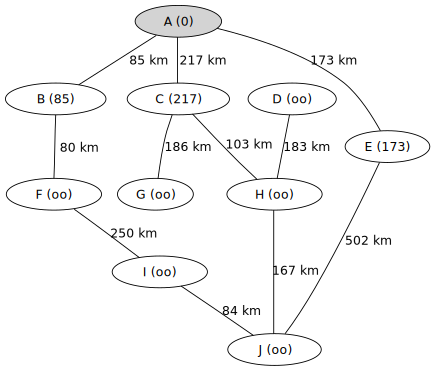{: .image}
<center>

*Source : <a href="https://fr.wikipedia.org/wiki/Algorithme_de_Dijkstra#" target="_blank">Wikipedia</a>, HB, licence CC BY-SA 3.0*

</center>
<div class="couleur_puce11" markdown="1">

* Les atomes d'une molécule :

</div>
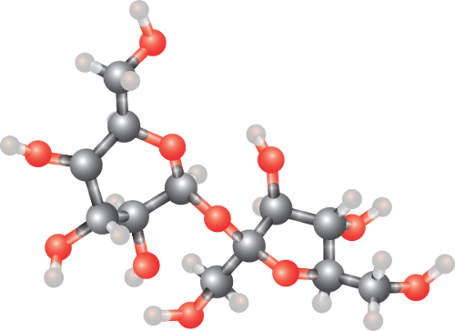{: .image}
<center>

*Source : Wikipedia, William Crochot, licence CC BY-SA 4.0*

</center>
<div class="couleur_puce11" markdown="1">

* Entre les ressources du Web (les relations sont les liens hypertextes).
* Entre deux situations dans un jeu.
* Etc.

</div>

Les relations peuvent être orientées ou non.  
<span style="display:block; margin: 8px 0px 0px 0px;">Exemple de relation orientée :</span>
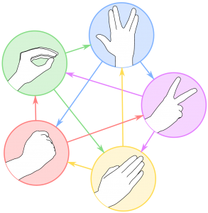{: .image}
<center>

*le jeu de Pierre-Papier-Ciseaux-Lezard-Spock pour représenter  
la supériorité des figures les unes par rapport aux autres.*

</center>
## <div class = "encadré2">__Définition et terminologie__</div>

!!! book1 "__Définition__"
    Un __graphe__ est constitué d'un ensemble de __sommets__ (*vertices* en anglais) et :
    <div class="couleur_puce33">

    * D'un ensemble d'__arcs__ reliant chacun un sommet à un autre dans le cas __orienté__.
    * D'un ensemble d'__arêtes__ (*edges* en anglais) reliant deux sommets entre eux dans le cas __non orienté__.

    </div>

Mathématiquement, un graphe $\,G\,$ est donc un couple formé de deux ensembles : 
<div class="couleur_puce11" markdown="1">

* $V=\{x_1, x_2, …, x_n\}\,$ dont les éléments sont les sommets.
* $E=\{e_1, e_2, …, e_m\}\,$ dont les éléments sont les arêtes dans le cas non orienté ou les arcs dans le cas orienté.

</div>
Une arête (ou un arc) $\,\{e_i\}\,$ est un couple de deux sommets, par exemple : $\,e_i=(x_2,x_5)\,$ symbolise le lien (arête ou arc) entre les sommets $\,\{x_2\}\,$ et $\,\{x_5\}$. On peut noter $\,G=(V,E)$.  

!!! star7 "__Ordre__"
    Le nombre de sommets d'un graphe est appelé __ordre__ du graphe. 

### <div class = "encadré3">__Terminologie des graphes non orientés__</div>

Dans le cas des __graphes non orientés__, les relations entre deux sommets se font dans les deux sens. On appelle ces relations des __arêtes__, et on a les définitions suivantes :

!!! star1 "__Sommets adjacents__"
    Deux sommets sont __adjacents__ s'ils sont reliés entre eux par une arête. On dit que l'arête est __incidente__ aux deux sommets.
    
!!! star2 "__Voisins d'un sommet__"
    Les __voisins__ d'un sommet $\,x\,$ sont tous les sommets reliés à $\,x\,$ par une arête.

!!! star3 "__Boucle__"
    Il peut exister des arêtes entre un sommet $\,x\,$ et lui-même. Elles sont appelés __boucles__. 

!!! star4 "__Degré d'un sommet__"
    Le __degré__ d'un sommet $\,x$ est le nombre d’arêtes incidentes au sommet, on le note $\,d(x)$.  
    <span style="display:block; margin: 8px 0px 0px 0px;">Dans le cas d'une boucle incidente à un sommet, celle-ci est comptée deux fois dans l'évaluation du degré de ce sommet.</span>

!!! star5 "__Chaîne__"
    <div class="couleur_puce37">

    * Une __chaîne__ est une séquence ordonnée d'arêtes telle que chaque arête a une extrémité en commun avec l'arête suivante.
    * Le nombre d’arêtes qui composent une chaîne est appelé __longueur__ de la chaîne.
    * Une chaîne est dite __élémentaire__ si elle ne comporte pas plusieurs fois le même sommet.
    * Une chaîne est dite __simple__ si elle ne comporte pas plusieurs fois la même arête.
    * On appelle __chaîne fermée__ toute chaîne dont l’origine et l’extrémité coïncident.
    * On appelle __cycle__ toute chaîne simple fermée (autrement dit, qui ne comporte pas plusieurs fois la même arête et dont les extrémités sont identiques).
    * Si en plus la chaîne est élémentaire, on parle alors de __cycle élémentaire.__

    </div>

!!! star10 "__Connexité__"
    <div class="couleur_puce38">

    * Un graphe non orienté est dit __connexe__ lorsqu'il existe une chaîne pour toute paire de sommets.

    </div>
    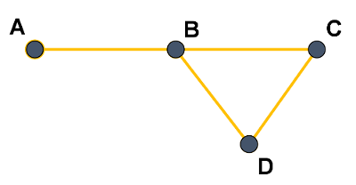{: .image}
    <center>

    *Graphe connexe*

    </center>
    <span style="display: block; margin: 50px 0 0 0;"></span>
    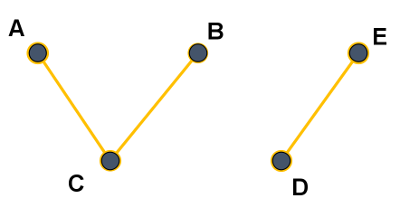{: .image}
    <center>

    *Graphe non connexe*

    </center>

    !!! notes1 "__Remarque__"
        Intuitivement, un graphe connexe comporte un seul "morceau".
    <div class="couleur_puce38">

    * Un graphe non orienté __non connexe__ se décompose en __composantes connexes__.  
    <span style="margin: 8px 0 0 0; display: block;">Dans l'exemple du graphe non connexe précédent, les 2 composantes connexes sont $\,\{A, B, C\}\,$ et $\,\{D, E\}$.</span>

    </div>
    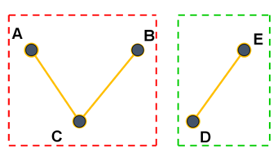{: .image}
    <div class="couleur_puce38">

    * Un graphe non orienté est dit __complet__ si chacun de ses sommets est relié directement à tous les autres.

    </div>
    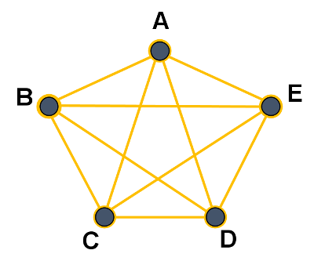{: .image}
    <center>

    *Graphe complet*

    </center>

!!! exemple1 "__Exemple__"
    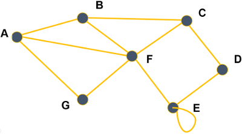{: .image width=50%}
    <div class="couleur_puce32">

    * Ce graphe non orienté est donné par :
    
    </div>
    <div class="couleur_puce32etoi_decal">

    * un ensemble de sommets : $\,\{A, B, C, D, E, F, G\}$ ;
    * un ensemble d'arêtes : $\,\{(A, B), (A, F), (A, G), (B, C), (B, F), …\}$.

    </div>
    <div class="couleur_puce32">

    * Les sommets $\,A\,$ et $\,B\,$ sont adjacents mais $\,B\,$ et $\,D\,$ ne le sont pas.
    * Les voisins du sommet $\,A\,$ sont $\,B, F$ et $G$.
    * Le degré du sommet $\,A\,$ est égal à $\,3\,$ $\,(d(A)=3)$.
    * $A, B, C, F, B\,$ est une chaîne, sa longueur est $\,4$.
    * $A, B, C, D\,$ est une chaîne simple, $A, B, F$ aussi.
    * $A, B, C, F, B, A\,$ est une chaîne fermée.
    * $A, F, G, A\,$ est un cycle.
    * Il y a une boucle $\,(E,E)$. 
    * Le degré de $\,E\,$ est égal à $\,4$.
    * Ce graphe est connexe mais non complet.

    </div>

### <div class = "encadré3">__Terminologie des graphes orientés__</div>

Dans le cas des __graphes orientés__, les arêtes ont un sens et elles sont appelées __arcs__. Par exemple, l'arête $\,a=(x, y)\,$ indique qu'il y a un arc d'origine $\,x\,$ et d'extrémité finale $\,y$. 

!!! star6 "__Successeurs et prédécesseurs d'un sommet__"
    Dans un graphe orienté, on ne parle plus de voisins d'un sommet mais de ses __successeurs__ et de ses __prédécesseurs__ : les successeurs d'un sommet $\,x\,$ sont tous les sommets $\,y\,$ tels qu'il existe un arc $\,(x, y)\,$ (de $\,x\,$ vers $\,y$) et les prédécesseurs de $\,x\,$ sont tous les sommets $\,w\,$ tels qu'il existe un arc $\,(w, x)\,$ (de $\,w\,$ vers $\,x$).

!!! star7 "__Chemin__"
    Un __chemin__ est une séquence ordonnée d'arcs consécutifs (on parlait de chaîne dans un graphe non orienté).

!!! star8 "__Circuit__"
    Dans un graphe orienté, un __circuit__ est une suite d'arcs consécutifs (chemin) dont les deux sommets extrémités sont identiques.

!!! star9 "__Degré d'un sommet__"
    Cette notion existe aussi dans le cas des graphes orientés.  
    <span style="display:block; margin: 8px 0px 0px 0px;">On distingue le degré __entrant__ d'un sommet $\,x\,$ (noté $\,d_−(x)\,$ et qui correspond au nombre de prédécesseurs de $\,x\,$) et le degré __sortant__ d'un sommet $\,x\,$ (noté $\,_+(x)\,$ et qui correspond au nombre de successeurs de $\,x$).</span>
    <span style="display:block; margin: 8px 0px 0px 0px;">Le degré d'un sommet $\,x\,$ vaut $\,d(x)=d_+(x)+d_−(x)$.</span>

!!! star1 "__Boucle__"
    Une __boucle__ est un arc entre un sommet et lui-même.

!!! star5 "__Forte connexité__"
    <div class="couleur_puce37">

    * Un graphe orienté est dit __fortement connexe__ lorsque pour toute paire de sommets distincts $\,(u,v)$, il existe un chemin de $\,u\,$ vers $\,v\,$ et un chemin de $\,v\,$ vers $\,u$.

    </div>
    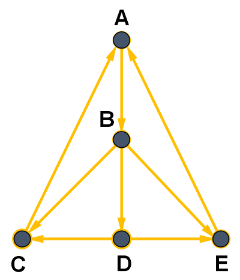{: .image width=35%}
    <center>

    *Graphe fortement connexe*

    </center>
    <span style="display: block; margin: 50px 0 0 0;"></span>
    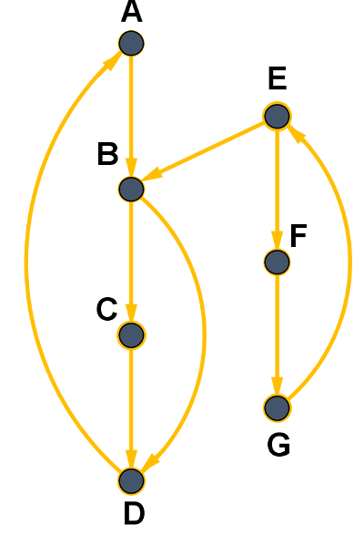{: .image width=35%}
    <center>

    *Graphe non fortement connexe*

    </center>

    !!! notes1 "__Remarque__"
        Le sommet $\,E\,$ n'est pas accessible depuis les sommets $\,A$, $\,B$, $\,C$ ou $\,D$.
    <div class="couleur_puce37">

    * Un graphe orienté __non fortement connexe__ se décompose en __composantes fortement connexes__.  
    <span style="display: block; margin: 5px 0 0 0;">Dans l'exemple du graphe non fortement connexe précédent, les composantes fortement connexes sont représentées en pointillés rouges et verts.</span>

    </div>
    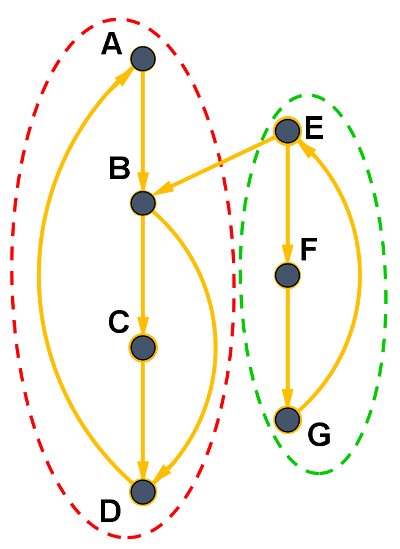{: .image width=35%}

!!! exemple5 "__Exemple__"
    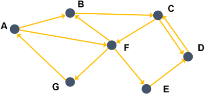{: .image width=50%}
    <div class="couleur_puce39">

    * Ce graphe orienté est donné par :
    
    </div>
    <div class="couleur_puce39etoi_decal">

    * un ensemble de sommets : $\,\{A, B, C, D, E, F, G\}$ ;
    * un ensemble d'arcs : $\,\{(A, B), (A, F), (B, C), (C, F), (C, D), …\}$.

    </div>
    <div class="couleur_puce39">

    * Les successeurs de $\,A\,$ sont les sommets $\,B\,$ et $\,F$, le seul prédécesseur de $\,A\,$ est $\,G$.
    * Le degré du sommet $\,A\,$ est égal à $\,3\,$ $\,(d(A)=d_+(A)+d_−(A)=2+1=3)$.
    * $A, B, C, D\,$ est un chemin mais $\,A, B, F\,$ n'en est pas un car il n'y a pas d'arc $\,(B,F)\,$ (de $\,B\,$ vers $\,F$).
    * $A, F, G, A\,$ est un circuit.
    * Il n'y a pas de boucle ici.
    * Ce graphe est fortement connexe.

    </div>

??? exercice4 "__Exercice 1__"
    Voici deux graphes que l'on appellera respectivement $\,G_1\,$ (celui de gauche) et $\,G_2\,$ (celui de droite) :
    <center>
    
    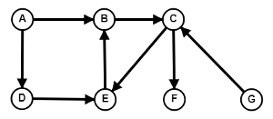
    $~~~~~~~~~$
    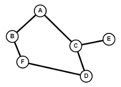
    
    </center>
    <div class="list18_1">
    
    1. Lequel est non orienté ?
    2. Pour le graphe non orienté :

    </div>
    <div class="list18_a">

    1. Donner deux sommets adjacents et deux sommets non adjacents.
    2. Donner les voisins de $\,A$.
    3. Quels sont les degrés des sommets $\,B$, $\,C\,$ et $\,E\,$ ?
    4. S'il y en a, donner un cycle de ce graphe.
    5. Donner toutes les chaînes simples entre les sommets $\,A\,$ et $\,D$.

    </div>
    <div class="list18_3">

    3. Pour le graphe orienté :

    </div>
    <div class="list18_a">

    1. Donner les successeurs et les prédécesseurs des sommets $\,A\,$ et $\,C$.
    2. S'il y en a, donner un chemin entre $G$ et $B$. Et entre $\,B\,$ et $\,D$ ?
    3. S'il y en a, donner un circuit de ce graphe.
    4. Quel est le sommet dont le degré est le plus grand ?

    </div>
    <center>
    [Correction de l'exercice 1 :material-cursor-default-click:](Correction_des_exos_du_cours.md#correction-de-lexercice-1){:target="_blank" .md-button}
    </center>


### <div class = "encadré3">__Graphes simples et multigraphes__</div>
Un graphe est __simple__ si au plus une relation relie deux sommets et s'il n'y a pas de boucle.  
<span style="display:block; margin: 10px 0px 0px 0px;">On peut imaginer des graphes avec des boucles et/ou des relations reliant les deux mêmes sommets. On appelle ces graphes des __multigraphes__.</span>
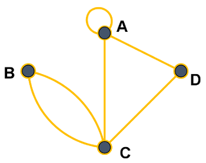{: .image width=35%}
<center>

*Multigraphe non orienté*

</center>

### <div class = "encadré3">__Graphes valués__</div>

Certains graphes (orientés ou non) sont dits __valués__ : on ajoute un __coût__ (ou __valuation__, ou __poids__) à chaque arête/arc.
<span style="display:block; margin: 10px 0px 0px 0px;">Dans le cas d'un graphe représentant un réseau routier, le coût sur chaque arête pourrait, par exemple, être la distance entre deux villes.</span>
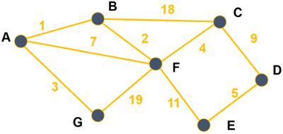{: .image width=50%}
<center>

*Graphe valué*

</center>
<span style="display:block; margin: 40px 0px 0px 0px;"></span>

## <div class = "encadré2">__Représentations d'un graphe__</div>

### <div class = "encadré3">__Représentation par matrice d'adjacence__</div>

Une __matrice__ $\,M\,$ est un tableau de nombres, qui peut être représenté en machine par un tableau de tableaux (ou une liste de listes) noté `#!python matrice`. Chaque nombre de cette matrice est repéré par son numéro de ligne $\,i\,$ et son numéro de colonne $\,j$. On note ce nombre $\,M_{i,j}\,$ et on peut y accéder par l'instruction `#!python matrice[i][j]`.  
<span style="display:block; margin: 10px 0px 0px 0px;">Un graphe à $\,n\,$ sommets peut être représentée par une __matrice d'adjacence__ de taille $\,n×n$, où la valeur du coefficient d'indice $\,i,j\,$ dépend de l'existence d'une arête ou d'un arc reliant les sommets $\,i\,$ et $\,j$.</span>

!!! exemple1 "__Exemple 1 (graphe non orienté)__"  
    Si les sommets $\,A, B, C, …\,$ du graphe :
    {: .image}
    sont respectivement numérotés $\,0, 1, 2, …\,$ alors sa matrice d'adjacence est :
    <center>

    $M=\begin{pmatrix} 0 & 1 & 0 & 0 & 0 & 1 & 1\\1 & 0 & 1 & 0 & 0 & 1 & 0\\0 & 1 & 0 & 1 & 0 & 1 & 0\\0 & 0 & 1 & 0 & 1 & 0 & 0\\ 0 & 0 & 0 & 1 & 1 & 1 & 0\\1 & 1 & 1 & 0 & 1 & 0 & 1\\1 & 0 & 0 & 0 & 0 & 1 & 0\end{pmatrix}$

    </center>
    Par exemple, le sommet $\,C\,$ correspond à la troisième ligne.
    <span style="display:block; margin: 10px 0px 0px 0px;">Celle-ci contient dans cet ordre les nombres $\,0, 1, 0, 1, 0, 1, 0\,$ donc cela signifie qu'il y a des arêtes $\,(C,B)$, $\,(C,D)\,$ et $\,(C,F)\,$ (les $\,1$) mais pas entre $\,C\,$ et les sommets $\,A, C, E\,$ et $\,G\,$ (les $\,0$).</span>
    <span style="display:block; margin: 10px 0px 0px 0px;">Cette matrice peut être mémorisée en machine par le tableau de tableaux suivant :</span>
    ```python
    matrice = [
    [0, 1, 0, 0, 0, 1, 1],
    [1, 0, 1, 0, 0, 1, 0],
    [0, 1, 0, 1, 0, 1, 0],
    [0, 0, 1, 0, 1, 0, 0],
    [0, 0, 0, 1, 1, 1, 0],
    [1, 1, 1, 0, 1, 0, 1],
    [1, 0, 0, 0, 0, 1, 0]
    ]
    ```

    !!! notes1 "__Remarque__"
        Dans le cas d'un graphe non orienté, la matrice d'adjacence est nécessairement symétrique par rapport à sa diagonale : on a $\,M_{i,j}=M_{j,i}$.

!!! exemple2 "__Exemple 2 (graphe orienté)__"
    C'est le même principe en faisant attention au sens des arcs : $\,M_{i,j}=1\,$ s'il y a un arc d'origine $\,i\,$ et d'extrémité $\,j\,$ et $\,M_{i,j}=0\,$ sinon.
    <span style="display:block; margin: 8px 0px 0px 0px;">Ainsi, le graphe :</span>
    {: .image}
    a pour matrice d'adjacence :  
    <center>

    $M=\begin{pmatrix} 0 & 1 & 0 & 0 & 0 & 1 & 0\\0 & 0 & 1 & 0 & 0 & 0 & 0\\0 & 0 & 0 & 1 & 0 & 1 & 0\\0 & 0 & 1 & 0 & 0 & 0 & 0\\ 0 & 0 & 0 & 1 & 0 & 0 & 0\\0 & 1 & 0 & 0 & 1 & 0 & 1\\1 & 0 & 0 & 0 & 0 & 0 & 0\end{pmatrix}$

    </center>
    Par exemple, le sommet $\,C\,$ correspond à la troisième ligne.
    <span style="display:block; margin: 10px 0px 0px 0px;">Celle-ci contient dans cet ordre les nombres $\,0, 0, 0, 1, 0, 1, 0\,$ donc cela signifie qu'il y a des arcs $\,(C,D)\,$ et $\,(C,F)\,$ (les $\,1$) mais pas entre $\,C\,$ et les autres sommets (les $\,0\,$).</span>

    !!! notes2 "__Remarque__"
        Comme les arcs ont un sens, la matrice d'adjacence d'un graphe orienté n'est généralement pas symétrique.

### <div class = "encadré3">__Représentation par listes des successeurs__</div>

Une autre façon de représenter un graphe est d'associer à chaque sommet la liste des sommets auxquels il est relié. Dans le cas d'un graphe orienté, on parle de __liste de successeurs__, alors que dans le cas d'un graphe non orienté on parle de __liste de voisins__.
<span style="display:block; margin: 10px 0px 0px 0px;">Une façon simple et efficace est d'utiliser un __dictionnaire__ où chaque sommet est associé à la liste de ses successeurs/voisins.</span>

!!! exemple3 "__Exemple 3 (graphe non orienté)__"
    Le graphe non orienté :
    {: .image}
    <span style="display:block; margin: 35px 0px 0px 0px;">peut être représenté par le dictionnaire suivant, où les clés sont les sommets et les valeurs sont les listes de voisins :</span>
    ```python
    dico1 = {
    "A": ["B", "F", "G"],
    "B": ["A", "C", "F"],
    "C": ["B", "D", "F"],
    "D": ["C", "E"],
    "E": ["D", "E", "F"],
    "F": ["A", "B", "C", "E", "G"],
    "G": ["A", "F"]
    }
    ```

!!! exemple4 "__Exemple 4 (graphe orienté)__"
    Le graphe orienté :
    {: .image}
    <span style="display:block; margin: 35px 0px 0px 0px;">peut être représenté par le dictionnaire suivant, où les clés sont les sommets et les valeurs sont les listes de successeurs :</span>
    ```python
    dico2 = {
    "A": ["B", "F"],
    "B": ["C"],
    "C": ["D", "F"],
    "D": ["C"],
    "E": ["D"],
    "F": ["B", "E", "G"],
    "G": ["A"]
    }
    ```

??? exercice4 "__Exercice 2__"
    On reprend les deux graphes $\,G_1\,$ et $\,G_2\,$ de l'exercice 1.
    <div class="list18_1">

    1. Donner la matrice d'adjacence de chacun de ces graphes (on prendra les indices des sommets dans l'ordre alphabétique).
    2. Donner la représentation de chacun des deux graphes sous la forme d'un dictionnaire de liste de successeurs.
    3. On considère les deux graphes $\,G_3\,$ et $\,G_4\,$ représentés ci-dessous :

    </div>
    <center>
    $G_3=\begin{pmatrix} 0 & 1 & 0 & 0 & 0 & 0\\1 & 0 & 0 & 1 & 0 & 0\\1 & 1 & 0 & 0 & 1 & 0\\0 & 0 & 1 & 0 & 0 & 0\\ 0 & 0 & 0 & 0 & 0 & 1\\0 & 0 & 1 & 0 & 0 & 1\end{pmatrix}$
    $~~~~~~~~~~~~~~~$
    $G_4=\begin{pmatrix} 0 & 3 & 0 & 1\\3 & 1 & 2 & 0\\0 & 2 & 2 & 0\\1 & 0 & 0 & 0\end{pmatrix}$
    </center>
    <span style="display:block; margin: 20px 0px 0px 0px;"></span>
    <div class="decal1">
    Dessiner ces deux graphes.

    !!! notes2 "note"
        Dans les deux cas, on notera les sommets $\,A, B, C, D...$

    </div>
    <div class="list18_4">

    4. On considère les deux graphes $\,G_5\,$ et $\,G_6\,$ représentés ci-dessous respectivement à gauche et à droite :
    </div>
    <div class="decal1">
    <div class="tableaux">
    <table>
    <thead>
    <tr>
    <th align="center" bgcolor=#b1b1b1 style="vertical-align:middle">Sommet</th>
    <th align="center" bgcolor=#b1b1b1 style="vertical-align:middle">Listes des prédécesseurs</th>
    </tr>
    </thead>
    <tbody>
    <tr>
    <td align="center">$A$</td>
    <td align="center">$(E, F)$</td>
    </tr>
    <tr>
    <td align="center">$B$</td>
    <td align="center">$\emptyset$</td>
    </tr>
    <tr>
    <td align="center">$C$</td>
    <td align="center">$(A, F)$</td>
    </tr>
    <tr>
    <td align="center">$D$</td>
    <td align="center">$(D, F)$</td>
    </tr>
    <tr>
    <td align="center">$E$</td>
    <td align="center">$\emptyset$</td>
    </tr>
    <tr>
    <td align="center">$F$</td>
    <td align="center">$(B, C)$</td>
    </tr>
    </tbody></table></div>
    $~~~~~~~~~~~~~$
    <div class="tableaux">
    <table>
    <thead>
    <tr>
    <th align="center" bgcolor=#b1b1b1 style="vertical-align:middle">Sommet</th>
    <th align="center" bgcolor=#b1b1b1 style="vertical-align:middle">Listes des voisins</th>
    </tr>
    </thead>
    <tbody>
    <tr>
    <td align="center">$A$</td>
    <td align="center">$(C, D, E)$</td>
    </tr>
    <tr>
    <td align="center">$B$</td>
    <td align="center">$(C, D, E)$</td>
    </tr>
    <tr>
    <td align="center">$C$</td>
    <td align="center">$(A, B, D)$</td>
    </tr>
    <tr>
    <td align="center">$D$</td>
    <td align="center">$(A, B, C, E)$</td>
    </tr>
    <tr>
    <td align="center">$E$</td>
    <td align="center">$(A, D, B)$</td>
    </tr>
    </tbody></table></div>
    <span style="display:block; margin: -15px 0px 0px 0px;"></span>
    Dessiner ces deux graphes.

    !!! notes2 "note"
        Dans les deux cas, on notera les sommets $\,A, B, C, D...$

    </div>
    <center>
    [Correction de l'exercice 2 :material-cursor-default-click:](Correction_des_exos_du_cours.md#correction-de-lexercice-2){:target="_blank" .md-button}
    </center>

### <div class = "encadré3">__Efficacité des représentations__</div>

La __matrice d'adjacence__ est simple à mettre en oeuvre mais nécessite un espace mémoire proportionnel à $\,n×n\,$ (où $\,n\,$ est le nombre de sommets). Ainsi, un graphe de $\,1000\,$ sommets nécessitent une matrice d'un million de nombres même si le graphe contient peu d'arêtes/arcs.  
<span style = "margin:10px 0px 0px 0px; display:block;">Pour le même graphe contenant peu d'arêtes/arcs, le __dictionnaire__ ne mémoriserait pour chaque sommet que les voisins/successeurs (les $\,1$) sans avoir à mémoriser les autres (les $\,0$). En revanche, pour un multigraphe contenant beaucoup d'arêtes/arcs, le dictionnaire occuperait plus d'espace mémoire que la matrice d'adjacence.</span>
<span style = "margin:10px 0px 0px 0px; display:block;">Cela implique en outre que l'accès aux voisins/successeurs d'un sommet est plus rapide avec le dictionnaire car il n'est pas nécessaire de parcourir toute la ligne de la matrice ($\,n\,$ valeurs) alors même que celle-ci peut ne contenir que très peu de $\,1$.</span>
<span style = "margin:10px 0px 0px 0px; display:block;">De plus, l'utilisation d'un dictionnaire permet de nommer les sommets sans ambiguité et ne les limite pas à des entiers comme c'est le cas pour la matrice d'adjacence (même si on peut associer chacun de ces entiers au sommet correspondant, ce que nous avons fait précédemment).</span>
<span style = "margin:10px 0px 0px 0px; display:block;">Enfin, au lieu d'utiliser le type liste (`#!python list` de Python ici) pour mémoriser les voisins/successeurs, on peut avantageusement utiliser le type ensemble (type prédéfini `#!python set` de Python) qui est une structure de données permettant un accès plus efficace aux éléments (l'implémentation se fait par des tables de hachage).</span>

## <div class = "encadré2">__Le type abstrait graphe__</div>

Dans un graphe __non orienté__, ajouter ou retirer un sommet peut affecter l'ensemble des arêtes et le fait d'ajouter ou de supprimer une arête peut affecter l'ensemble des sommets.
<span style = "margin:10px 0px 0px 0px; display:block;">On va donc définir les conventions suivantes :</span>
<div class="couleur_puce11" markdown="1">

* Pour ajouter une arête, il faut que ses extrémités existent.
* Si nous supprimons un sommet, on supprime également les arêtes incidentes.

</div>

!!! notes1 "__Remarque__"
    Les conventions précédentes restent valables dans le cas d'un graphe __orienté__.

Voici les fonctions primitives qui définissent le type abstrait __graphe non orienté__ :
<center>

| Action                                            | Instruction         |
| :-----------------------------------------------: | :-----------------: |
| Créer un graphe vide                              |`#!python graphe_vide()`       |
| Tester si le graphe `#!python G` est vide                  |`#!python est_vide(G)`         |
| Ajouter le sommet `#!python s` au graphe `#!python G`               |`#!python add_sommet(G, s)`    |
| Tester si le sommet `#!python s` existe  |`#!python existe_sommet(G, s)`    |
| Ajouter une arête entre les sommets `#!python s1` et `#!python s2`  |`#!python add_arete(G, s1, s2)`|
| Supprimer le sommet `#!python s`             |`#!python rem_sommet(G, s)`    |
| Tester si l'arête entre les sommets `#!python s1` et `#!python s2` existe |`#!python existe_arete(G, s1, s2)`|
| Supprimer l'arête entre les sommets `#!python s1` et `#!python s2`  |`#!python rem_arete(G, s1, s2)`|

</center>

!!! tools "__Conditions__"
    <div class="couleur_puce6">

    * `#!python add_sommet(G, s)` est défini si et seulement si `#!python existe_sommet(G, s) = Faux`.
    * `#!python rem_sommet(G, s)` est défini si et seulement si `#!python existe_sommet(G, s) = Vrai`.
    * `#!python add_arete(G, s1, s2)` est défini si et seulement si `#!python existe_sommet(G, s1) = existe_sommet(G, s2) = Vrai`.
    * `#!python rem_arete(G, s1, s2)` est défini si et seulement si `#!python existe_arete(G, s1, s2) = Vrai`.

    </div>

??? exemple4 "__Exemple__"
    Prenons la suite d'instructions suivantes :
    ```python
    G = graphe_vide()
    add_sommet(G, 1)
    add_sommet(G, 2)
    add_sommet(G, 3)
    add_sommet(G, 4)
    add_sommet(G, 5)
    add_sommet(G, 6)
    add_arete(G, 1, 2)
    add_arete(G, 2, 2)
    add_arete(G, 2, 4)
    add_arete(G, 5, 2)
    add_arete(G, 2, 5)
    add_arete(G, 4, 5)
    add_arete(G, 3, 6)
    ```
    On voit aisément qu'à la fin, le graphe `#!python G` contient 6 sommets de type `#!python int` et nous pouvons représenter ce graphe par :
    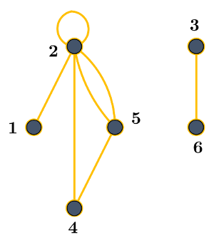{: .image}

## <div class = "encadré2">__Implémentation en Python__</div>

### <div class = "encadré3">__Implémentation avec une matrice d'adjacence__</div>

Voici la classe `#!python GrapheNoMa` qui implémente un graphe simple non orienté, s'appuyant sur une matrice d'adjacence qui n'est autre qu'une liste de listes en Python :

```python
class grapheNoMa:

    def __init__(self):
        self.matrice = []
        self.sommets = []

    def est_vide(self):
        return len(self.sommets) == 0

    def existe_sommet(self, s):
        return s in self.sommets

    def existe_arete(self, s1, s2):
        i = self.sommets.index(s1)
        j = self.sommets.index(s2)
        return self.matrice[i][j] == 1

    def affichage(self):
        print('   ', end = '')
        for elt in self.sommets:
            print(elt, end = '  ')
        print()
        for i, ligne in enumerate(self.matrice):
            print(f'{self.sommets[i]} {ligne}')
        print()

    def add_sommet(self, s):
        assert not self.existe_sommet(s),'Vous ne pouvez pas ajouter un sommet déjà existant'
        n = len(self.sommets)
        self.sommets.append(s)
        self.matrice.append([0 for i in range(n)])
        for ligne in self.matrice:
            ligne.append(0)

    def add_arete(self, s1, s2):
        assert not self.existe_arete(s1, s2),'Vous ne pouvez pas ajouter un arête déjà existante'
        i = self.sommets.index(s1)
        j = self.sommets.index(s2)
        self.matrice[i][j] = self.matrice[j][i] = 1

    def rem_sommet(self, s):
        assert self.existe_sommet(s),"Vous ne pouvez pas supprimer un sommet qui n'existe pas"
        n = self.sommets.index(s)
        self.sommets.remove(s)
        for ligne in self.matrice:
            del ligne[n]
        del self.matrice[n]

    def rem_arete(self, s1, s2):
        assert self.existe_arete(s1, s2),"Vous ne pouvez pas supprimer une arête qui n'existe pas"
        i = self.sommets.index(s1)
        j = self.sommets.index(s2)
        self.matrice[i][j] = self.matrice[j][i] = 0

```

??? exercice4 "__Exercice 3__"
    Coder la méthode `#!python voisins(s)` de la classe `#!python grapheNoMa` qui retourne la liste des voisins d'un sommet `#!python s` du graphe.  
    <center>
    [Correction de l'exercice :material-cursor-default-click:](Correction_des_exos_du_cours.md#correction-de-lexercice-3){:target="_blank" .md-button}
    </center>

??? exercice4 "__Exercice 4__"
    En vous inspirant de ce qui vient d'être fait, proposer un nouveau type abstrait __graphe orienté__ (pour lequel on donnera les opérations de base) et son implémentation par une matrice d'adjacence sous forme d'une classe `#!python grapheOMa`.  
    <center>
    [Correction de l'exercice :material-cursor-default-click:](Correction_des_exos_du_cours.md#correction-de-lexercice-4){:target="_blank" .md-button}
    </center>

!!! probleme "__Inconvénient de cette structure__"
    Comme cela a été évoqué précédemment, la dimension de la matrice est égale au carré du nombre de sommets  ($\,n×n$), ce qui peut représenter un important espace en mémoire.  
    <span style = "margin:5px 0px 0px 0px; display:block;">Pour obtenir les voisins d’un sommet, il faut utiliser une fonction dont le coût est d’ordre $\,\mathcal{O}(n$$)$.</span>

### <div class = "encadré3">__Implémentation par un dictionnaire d'adjacence__</div>

Comme nous l'avons vu, un graphe peut être représenté par une liste de successeurs. Cette représentation peut être implémentée efficacement avec un dictionnaire. Chaque sommet `#!python s` sera donc une clé du dictionnaire, et la liste des sommets adjacents à `#!python s` sera la valeur de cette clé.
<span style = "margin:10px 0px 0px 0px; display:block;">Voici la classe incomplète `#!python GrapheNoLs` qui implémente un graphe simple non orienté, s'appuyant sur une liste d'adjacence :</span>

```python
class grapheNoLs:

    def __init__(self):
        """ Initialise le graphe à vide. """
        self.graphe = {}
    
    def affichage(self):
        """Affiche le graphe sous forme de listes d'adjacences. """
        for sommet in sorted(self.graphe.keys()):
            print (sommet, " --> ",self.graphe[sommet])

    def voisins(self, s):
        assert self.existe_sommet(s), "Ce sommet n'existe pas"
        
        return self.graphe[s]

```

!!! notes1 "__Remarque__"
    L’obtention des voisins d’un sommet est cette fois-ci une opération en temps constant.

??? exercice4 "__Exercice 5__"
    Coder en Python les méthodes suivantes de la classe `#!python grapheNoLs` :
    <div class="list18_1">

    1. `#!python est_vide()` qui retourne `#!python True` si le graphe est vide, `#!python False` sinon.
    2. `#!python add_sommet(s)` qui ajoute le sommet `#!python s` au graphe.
    3. `#!python existe_sommet(s)` qui teste si le sommet `#!python s` existe.
    4. `#!python add_arete(s1, s2)` qui ajoute une arête entre les sommets `#!python s1` et `#!python s2`.
    5. `#!python existe_arete(s1, s2)` qui teste si l'arête entre les sommets `s1` et `s2` existe.
    6. `#!python rem_sommet(s)` qui supprime le sommet `#!python s`.
    7. `#!python rem_arete(s1, s2)` qui supprime l'arête entre les sommets `#!python s1` et `#!python s2`.

    </div>
    <center>
    [Correction de l'exercice :material-cursor-default-click:](Correction_des_exos_du_cours.md#correction-de-lexercice-5){:target="_blank" .md-button}
    </center>

??? exercice4 "__Exercice 6__"
    En vous inspirant de ce qui vient d'être fait, proposer un nouveau type abstrait __graphe orienté__ (pour lequel on donnera les opérations de base) et son implémentation par un dictionnaire d'adjacence sous forme d'une classe `#!python grapheOLs`.  
    
    <center>
    [Correction de l'exercice :material-cursor-default-click:](Correction_des_exos_du_cours.md#correction-de-lexercice-6){:target="_blank" .md-button}
    </center>
    
### <div class = "encadré3">__Passage d'une représentation à l'autre__</div>

Les deux implémentations sont totalement équivalentes et on peut passer de l'une à l'autre simplement en énumérant les sommets et les voisins depuis une représentation tout en construisant l'autre représentation.

??? exercice4 "__Exercice 7__"
    <div class="list18_1">

    1. Ecrire la fonction `#!python ma_to_ls(gma)` ayant pour argument un graphe non orienté représenté par une __matrice d'adjacence__ et qui renvoie ce même graphe représenté par un __dictionnaire d'adjacence__.
    2. Ecrire la fonction `#!python ls_to_ma(gls)` ayant pour argument un graphe non orienté représenté par un __dictionnaire d'adjacence__ et qui renvoie ce même graphe représenté par une __matrice d'adjacence__.

    </div>
    <center>
    [Correction de l'exercice :material-cursor-default-click:](Correction_des_exos_du_cours.md#correction-de-lexercice-7){:target="_blank" .md-button}
    </center>
