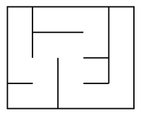
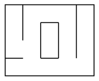
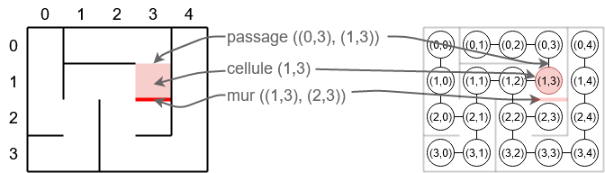
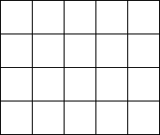
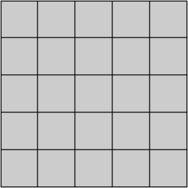
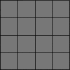
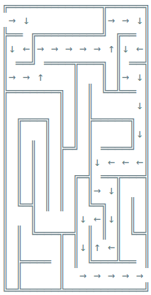
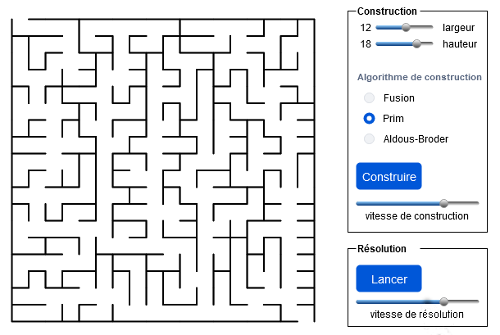

# <center><div class = "titre4">Mini-projet</div></center>

### <div class = "encadré3_mini_projet"> __Généralités__ </div>

Un __labyrinthe__ est une surface connexe. De telles surfaces peuvent avoir des topologies différentes : simple, ou comportant des anneaux ou des îlots.
<span style="margin :10px 0 0 0; display: block;">On peut distinguer deux catégories de labyrinthe :</span>
<div class="couleur_puce15" markdown="1">

* Les labyrinthes « __parfaits__ » : chaque cellule est reliée à toutes les autres et, ce, de manière __unique__.  
{: .image}

</div>
<div class="couleur_puce15" markdown="1">

* Les labyrinthes « __imparfaits__ » (tous les labyrinthes qui ne sont pas parfaits) : ils peuvent donc contenir des *boucles*, des *îlots* ou des *cellules inaccessibles*.
{: .image}

</div>
Pour la suite, nous choisissons de représenter un labyrinthe par un graphe, dont les sommets représentent des __cellules__ (<span style="font-family: 'Trebuchet MS' ; font-weight: bold">tuples</span> de coordonnées `#!python (ligne, colonne)`) et les arêtes des __passages__ entre deux cellules (l’absence d’arête équivaut alors à un __mur__).
{: .image}

Nous définissons plusieurs classes :
<div class="couleur_puce15etoi" markdown="1">

* La classe `#!python Graphe`, possédant bon nombre des méthodes précédemment implémentées, et les classes `#!python Pile` et `#!python File` qui sont utilisées pour implémenter certaines méthodes.

</div>
<div class="decal1" markdown="1">

??? plus-circle "__Classe `#!python Graphe`__"
	```python
	class Graphe:
        """ Implémentation d'un graphe à partir d'un dictionnaire d'adjacence
        """

        def __init__(self):
            self.A = {}


        def __repr__(self):
            return str(self.A)


        def est_vide(self):
            return not self.graphe


        def __len__(self):
            return len(self.A)


        def ajouter_sommet(self, x):
            """ Ajoute un sommet x
            """
            if not x in self.A:
                self.A[x] = set()


        def ajouter_arete(self, x, y):
            """ Ajoute une arête entre les sommets x et y
            """
            self.ajouter_sommet(x)
            self.ajouter_sommet(y)
            self.A[x].add(y)
            self.A[y].add(x)


        def voisins(self, x):
            """ Renvoie l'ensemble des voisins du sommet x
            """
            return self.A[x]


        def aretes(self):
            """ Renvoie la liste de toutes les arêtes du graphe
            """
            L = []
            for x, V in self.A.items():
                for v in V:
                    L.append((x, v))
            return L


        def arete(self, x, y):
            """ Renvoie True s'il existe une arête
                entre le sommet x et le sommet y
            """
            return x in self.A[y]

        ############################################################################
        # Profondeur
        ############################################################################

        def parcours_prof(self, s, vus = set()):
            """ Parcours en profondeur à partir du sommet s
                --> renvoie vus : ensemble des sommets visités
                (fonction récursive)
            """
            if not s in vus:
                vus.add(s)
                for v in self.voisins(s):
                    self.parcours_prof(v, vus)
            return vus


        def parcours_ch(self, s, pere=None, vus={}):
            """ Parcours en profondeur à partir du sommet s
                --> renvoie vus : dictionnaire des couples (visité : précédent)
            """
            if not s in vus:
                vus[s] = pere
                for v in self.voisins(s):
                    self.parcours_ch(v, s, vus)
            return vus


        def chemins(self, x, y):
            """ Parcours en profondeur à partir du sommet s
                Renvoie la liste des chemins parcourus
            """
            vus = self.parcours_ch(x)
            c = []
            if y in vus:
                s = y
                while s is not None:
                    c.append(s)
                    s = vus[s]

            return c[::-1]


        def existe_chemin(self, x, y):
            """ Renvoie True si un chemin existe entre les sommets x et y
            """
            return y in self.parcours_prof(x)


        ############################################################################
        # Largeur
        ############################################################################

        def parcours_larg(self, s):
            """ Parcours en largeur du graphe, à partir du sommet s
            """
            f = File()
            sommets_visites = {}
            f.enfiler(s)
            while not f.est_vide():
                tmp = f.defiler()
                if tmp not in sommets_visites:
                    sommets_visites[tmp] = True
                liste_voisins = [y for y in self.voisins(tmp) if y not in sommets_visites]
                for voisins in liste_voisins:
                    f.enfiler(voisins)
            return sommets_visites


        def parcours_larg_chemin(self, s):
            """ Parcours en largeur du graphe, à partir du sommet s
                Renvoie un dictionnaire {sommet: précédent}
                qui doit permettre de construire des chemins depuis A
            """
            sommets_visites = {s: None}
            f = File()
            f.enfiler(s)
            while not f.est_vide():
                s = f.defiler()
                liste_voisins = [y for y in self.voisins(s) if y not in sommets_visites]
                for voisin in liste_voisins:
                    f.enfiler(voisin)
                    sommets_visites[voisin] = s
            return sommets_visites


        def chemins_larg(self, x, y):
            """ Parcours en largeur à partir du sommet x jusqu'au sommet y
                Renvoie la liste des chemins parcourus
            """
            sommets_visites = self.parcours_larg_chemin(x)
            if y not in sommets_visites:
                return None
            s = y
            ch = [s]
            while s != x:
                s = sommets_visites[s]
                ch.append(s)
            ch.reverse()
            return ch
        	
	```

</div>
<div class="decal1" markdown="1">

??? plus-circle "__Classe `#!python Pile`__"
	```python
    class Maillon :

        def __init__(self, valeur, suivant):
            self.valeur = valeur
            self.suivant = suivant

    class Pile:
        """Implémentation des piles à l'aide des listes chaînées"""

        def __init__(self):
            self.longueur = 0
            self.sommet = None

        def empiler(self, valeur):
            self.sommet = Maillon(valeur, self.sommet)
            self.longueur += 1

        def depiler(self):
            if self.longueur > 0 :
                valeur = self.sommet.valeur
                self.sommet = self.sommet.suivant
                self.longueur -= 1
                return valeur

        def est_vide(self):
            return self.longueur == 0

        def lire_sommet(self):
            return self.sommet.valeur

        def taille(self):
            return self.longueur

        def __str__(self):
            ch = "\nEtat de la pile :\n"
            sommet = self.sommet
            while sommet != None :
                ch += '|' + str(sommet.valeur) + '|\n'
                sommet = sommet.suivant
            return ch

	```

</div>
<div class="decal1" markdown="1">

??? plus-circle "__Classe `#!python File`__"
	```python
    class Maillon:

        def __init__(self, valeur, precedent=None, suivant=None):
            self.valeur = valeur
            self.precedent = precedent
            self.suivant = suivant

    class File:
        """Implémentation des files à l'aide des listes doublement chaînées"""

        def __init__(self):
            self.longueur = 0
            self.debut = None
            self.fin = None

        def enfiler(self, valeur):
            if self.longueur == 0 :
                self.debut = self.fin = Maillon(valeur)
            else:
                self.fin = Maillon(valeur, self.fin)
                self.fin.precedent.suivant = self.fin
            self.longueur += 1

        def defiler(self):
            if self.longueur > 0:
                valeur = self.debut.valeur
                if self.longueur > 1:
                    self.debut = self.debut.suivant
                    self.debut.precedent = None
                else:
                    self.debut = self.fin = None
                self.longueur -= 1
                return valeur

        def lire_tete(self):
            return self.debut.valeur

        def est_vide(self):
            return self.longueur == 0

        def taille(self):
            return self.longueur

        def __str__(self):
            ch = "\nEtat de la file :\n"
            maillon = self.debut
            while maillon != None:
                ch += str(maillon.valeur) + '|'
                maillon = maillon.suivant
            ch += "\n"
            return ch

	```

</div>
<div class="couleur_puce15etoi" markdown="1">

* La classe `#!python Labyrinthe`, dans laquelle est notamment instancier un objet de type <span style="font-family: 'Trebuchet MS' ; font-weight: bold">graphe</span>, et qui est munie d’une méthode de représentation en mode semi-graphique (avec des caractères spéciaux).

</div>
<div class="decal1" markdown="1">

??? plus-circle "__Classe `Labyrinthe`__"
	```python
    class Labyrinthe:

        contours = [" ", "═", "║", "╚", "═", "═", "╝", "╩", "║", "╔", "║", "╠", "╗", "╦", "╣", "╬"]
        # contours = [" ", "╶", "╵", "└", "╴", "─", "┘", "┴", "╷", "┌", "│", "├", "┐", "┬", "┤", "┼"]
        # contours = [" ", "█", "█", "█", "█", "█", "█", "█", "█", "█", "█", "█", "█", "█", "█", "█"]

        def __init__(self, w = 0, h = 0):
            self.G = Graphe()
            self.w = w
            self.h = h
            self.reset()

            # Tableau de la représentation du labyrinthe en mode semi-graphique
            self.repr = [["_"]*(2 * self.w + 1) for c in range(2 * self.h + 1)]
            self.effacer_repr()

            # Coordonnées des ouvertures vers l’extérieur
            #
            self.ouvertures = []


        def reset(self):
            for l in range(self.h):
                for c in range(self.w):
                    self.G.ajouter_sommet((l, c))


        def __repr__(self):
            self.construire_repr()
            L = []
            for l in self.repr:
                L.append("".join(l))
            return "\n".join(L)


        def construire_repr(self):
            """ Construit la représentation du labyrinthe en mode semi-graphique dans le tableau à deux dimensions self.repr
            self.ouvertures : liste des ouvertures vers l'extérieur (cellules : tuple (l,c))
            """
            # Les murs
            for c in range(self.w):
                self.repr[0][2*c+1] = Labyrinthe.contours[5]
            for l in range(self.h):
                self.repr[2*l+1][0] = Labyrinthe.contours[10]
                for c in range(self.w):
                    if l+1 < self.h and self.G.arete((l, c), (l+1, c)):
                        self.repr[2*l+2][2*c+1] = Labyrinthe.contours[0]
                    else:
                        self.repr[2*l+2][2*c+1] = Labyrinthe.contours[5]

                    if c+1 < self.w and self.G.arete((l, c), (l, c+1)):
                        self.repr[2*l+1][2*c+2] = Labyrinthe.contours[0]
                    else:
                        self.repr[2*l+1][2*c+2] = Labyrinthe.contours[10]

            # Les coins
            for l in range(0, len(self.repr), 2):
                for c in range(0, len(self.repr[0]), 2):
                    code  = 1 * (c+1 < len(self.repr[0]) and self.repr[l][c+1] != " ")
                    code += 2 * (l != 0 and self.repr[l-1][c] != " ")
                    code += 4 * (c != 0 and self.repr[l][c-1] != " ")
                    code += 8 * (l+1 < len(self.repr) and self.repr[l+1][c] != " ")
                    self.repr[l][c] = Labyrinthe.contours[code]

            # Les ouvertures vers l’extérieur
            for o in self.ouvertures:
                l, c = o
                if c == 0:
                    self.repr[2*l+1][2*c] = " "
                elif c == self.w-1:
                    self.repr[2*l+1][2*c+2] = " "
                elif l == 0:
                    self.repr[2*l][2*c+1] = " "
                elif l == self.h-1:
                    self.repr[2*l+2][2*c+1] = " "


        def effacer_repr(self):
            for l in range(self.h):
                for c in range(self.w):
                    self.repr[2*l+1][2*c+1] = " "

	```

</div>

!!! exercice2 "__Exercice 1 : quelques méthodes pour `#!python Labyrinthe` ...__"
	<div class="list7_1">
	
	1. Ajouter deux méthodes `#!python voisins_cellule(s)` et `#!python murs_cellule(s)` de la classe `#!python Labyrinthe` qui renvoient respectivement la liste des __cellules voisines__ de la cellule `#!python s`, <u>accessibles ou pas</u> et la liste des __murs adjacents__ à la cellule `#!python s`, <u>ouvert (passage) ou pas</u>.
	2. Ajouter une méthode `#!python ouvrir_passage(x, y)` permettant d’ouvrir un passage entre les cellules `#!python x` et `#!python y`.
	<span style="margin :5px 0 0 0; display: block;">Cette méthode doit utiliser la méthode `#!python ajouter_arete(x, y)` de la classe `#!python Graphe` et doit vérifier que `#!python x` et `#!python y` sont bien deux cellules adjacentes.</span>

	</div>

### <div class = "encadré3_mini_projet"> __Construction d’un labyrinthe__ </div>

Il existe de très nombreux algorithmes de construction de labyrinthe…

#### <div class = "encadré4_mini_projet"> __Fusion aléatoire de chemins__ </div>
<div class="couleur_puce41" markdown="1">

* On part d’un labyrinthe dont tous les murs sont fermés.
* On associe une valeur unique (un __identifiant__) à chaque cellule.
* À chaque itération, on choisit un mur à ouvrir de manière aléatoire.
* Lorsqu’un mur est ouvert entre deux cellules adjacentes, les deux cellules sont liées entre elles et forment un « chemin ».
* À chaque fois que l’on tente d’ouvrir un passage entre deux cellules, on vérifie que ces deux cellules ont des identifiants différents.

</div>
<div class="couleur_puce41etoi_decal" markdown="1">

* Si les identifiants sont identiques, c’est que les deux cellules sont déjà reliées et appartiennent donc au même chemin.
<span style="margin: 3px 0 0 0; display:block;">On ne peut donc pas ouvrir le passage.</span>
* Si les identifiants sont différents, le passage est ouvert, et l’identifiant de la première cellule est affecté à toutes les cellules du second chemin.

</div>
{: .image}

!!! exercice2 "__Exercice 2 : Construction d'un labyrinthe par fusion de chemins__"
	Implémenter cet algorithme dans une méthode `#!python construire_fusion()`.

#### <div class = "encadré4_mini_projet"> __Algorithme de Prim__ </div>
On part d’un labyrinthe dont tous les murs sont fermés.

On crée :
<div class="couleur_puce41" markdown="1">

* Une liste de cellules « non visitées » (pleine au départ).
* Une liste de murs (initialement les murs adjacents d’une cellule choisie aléatoirement).

</div>
Tant qu’il y a des murs dans la liste :
<div class="couleur_puce41" markdown="1">

* On choisit un mur au hasard dans la liste.
* Si une seule des deux cellules que le mur divise est visitée, alors :

</div>
<div class="couleur_puce41etoi_decal" markdown="1">

* On ouvre un passage à travers ce mur.
* On marque la cellule « non visitée » comme « visitée » (on la supprime de la liste).
* On ajoute les murs voisins de la cellule à la liste des murs.

</div>
<div class="couleur_puce41" markdown="1">

* On retire le mur de la liste.

</div>

!!! exercice2 "__Exercice 3 : Construction d'un labyrinthe par l'algorithme de Prim__"
	Implémenter cet algorithme dans une méthode `#!python construire_prim()`.

#### <div class = "encadré4_mini_projet"> __Algorithme d’Aldous-Broder__ </div>
On part d’un labyrinthe dont tous les murs sont fermés.
<div class="couleur_puce41" markdown="1">

* On choisit une cellule au hasard comme « cellule courante » et on la marque comme « visitée ».
* Tant qu’il existe des cellules non visitées :

</div>
<div class="couleur_puce41etoi_decal" markdown="1">

* On choisit un voisin au hasard.
* Si le voisin choisi n’a pas encore été visité :

</div>
<div class="decal10" markdown="1">
<div class="couleur_puce41carré" markdown="1">

* On ouvre un passage entre la « cellule courante » et le voisin choisi.
* On marque le voisin choisi comme étant visité.

</div>
</div>
<div class="couleur_puce41etoi_decal" markdown="1">

* On fait du voisin choisi la « cellule courante ».

</div>
{: .image}

!!! exercice2 "__Exercice 4 : Construction d'un labyrinthe par l'algorithme d’Aldous-Broder__"
	Implémenter cet algorithme dans une méthode `#!python construire_aldous_broder()`.

#### <div class = "encadré4_mini_projet"> __Algorithme de Wilson__ </div>
On part d’un labyrinthe dont tous les murs sont fermés.
<div class="couleur_puce41" markdown="1">

* On choisit une cellule au hasard dans le labyrinthe et on la marque comme « visitée ».
* Tant qu’il existe des cellules « non visitées » :

</div>
<div class="couleur_puce41etoi_decal" markdown="1">

* On choisit au hasard une cellule non encore « visitée » qu'on définit comme « cellule courante ».
* Tant qu'on ne tombe pas sur une cellule « visitée » :

</div>
<div class="decal10" markdown="1">
<div class="couleur_puce41carré" markdown="1">

* On choisit un de ses voisins au hasard.
* On mémorise le chemin dans un dictionnaire.
* On fait du voisin choisi la « cellule courante ».

</div>
</div>
<div class="couleur_puce41etoi_decal" markdown="1">

* On ouvre alors le passage de la cellule de départ jusqu'à la dernière cellule qui a permis au programme de sortir de la précédente boucle.

</div>

{: .image width=30%}

!!! exercice2 "__Exercice 5 : Construction d'un labyrinthe par l'algorithme de Wilson__"
	Implémenter cet algorithme dans une méthode `#!python construire_wilson()`.

#### <div class = "encadré4_mini_projet"> __Algorithme de backtracking__ </div>
Il s'agit d'une version aléatoire de l'algorithme de recherche en profondeur d'abord.  
<span style="margin :5px 0 0 0; display: block;">Nous commençons à partir de n'importe quelle cellule et explorons le plus loin possible un chemin avant d'être bloqué et de revenir en arrière afin de trouver un autre chemin (d'où la notion de *backtracking*).</span>

<center>
    <video width="480" height="285"  controls>
    <source src="fichiers/Hexamaze.webm" type="video/webm">
    </video>   
</center>

On part d’un labyrinthe dont tous les murs sont fermés.
<div class="couleur_puce41" markdown="1">

* On choisit une cellule au hasard dans le labyrinthe, on la marque comme « visitée » et on l'empile dans une pile.
* Tant que la pile n'est pas vide :

</div>
<div class="couleur_puce41etoi_decal" markdown="1">

* On dépile la cellule en sommet de pile qu'on définit comme « cellule courante ».
* Si la « cellule courante » a des voisins qui n'ont pas été visités :

</div>
<div class="decal10" markdown="1">
<div class="couleur_puce41carré" markdown="1">

* On empile la « cellule courante ».
* On choisit un de ses voisins au hasard.
* On ouvre un passage entre la « cellule courante » et le voisin choisi.
* On marque le voisin choisi comme « visité » et on l'empile.

</div>
</div>

!!! exercice2 "__Exercice 6 : Construction d'un labyrinthe par l'algorithme de backtracking__"
	Implémenter cet algorithme dans une méthode `#!python construire_backtracking()`.

### <div class = "encadré3_mini_projet"> __Résolution d’un labyrinthe__ </div>
Une fois le labyrinthe créé à l'aide d'un des algorithmes de construction précédents, il va falloir le résoudre.  
<span style="margin :5px 0 0 0; display: block;">Pour cela, il faut commencer par créer deux ouvertures : une de départ et l'autre d'arrivée. Ces ouvertures peuvent être créées de manière aléatoire à chaque génération du labyrinthe.</span>
<span style="margin :5px 0 0 0; display: block;">On peut envisager une résolution automatique du labyrinthe mais on peut aussi le soumettre à un joueur et vérifier qu'il l'a bien résolu !</span>

#### <div class = "encadré4_mini_projet"> __Résolution automatique__ </div>
Puisque nos labyrinthes sont « parfaits », il n'existe qu'un seul chemin menant d'une cellule du labyrinthe (donc de l'ouverture par exemple...) à une autre.

!!! exercice2 "__Exercice 7 : Résolution automatique d'un labyrinthe__"
	Implémenter un algorithme de sortie automatique de labyrinthe dans une méthode `#!python sortir_laby()`.  
	<span style="margin :5px 0 0 0; display: block;">Afin de vérifier que la résolution est bien faite, on marquera le passage sur chaque cellule de la manière suivante :</span>
	{: .image}

#### <div class = "encadré4_mini_projet"> __Pour aller plus loin__ </div>

A présent, on peut imaginer la possibilité de soumettre nos labyrinthes à un joueur.
<span style="margin :10px 0 0 0; display: block;">Celui-ci pourrait choisir par exemple :</span>
<div class="couleur_puce41" markdown="1">

* Les dimensions du labyrinthe.
* L'algorithme de construction du labyrinthe.
* La vitesse de construction du labyrinthe.

</div>
Selon votre modèle, le joueur peut se déplacer dans le labyrinthe en utilisant des touches du claviers ou en se servant de la souris.  
<span style="margin :5px 0 0 0; display: block;">On peut aussi imaginer la résolution en un temps chronométré...</span>
<span style="margin :10px 0 0 0; display: block;">Voici un exemple d'une interface graphique possible :</span>

{: .image}

Concernant les bibliothèques d'interfaces graphiques disponibles avec Python, on peut citer :
<div class="couleur_puce41carré" markdown="1">

* <a href="https://docs.python.org/fr/3/library/tkinter.html" target="_blank">Tkinter</a>, qui permet notamment de faire apparaitre des cases à cocher et des curseurs comme dans l'image précédente (et <a href="http://s15847115.domainepardefaut.fr/python/tkinter/index.html" target="_blank">ici</a> un tuto très bien fait).
* <a href ="https://docs.python.org/fr/3/library/turtle.html" target="_blank">Turtle.</a>
* <a href ="https://he-arc.github.io/livre-python/pygame/index.html" target="_blank">Pygame</a> (et <a href="https://pub.phyks.me/sdz/sdz/interface-graphique-pygame-pour-python.html" target="_blank">ici</a> un tuto qui explique notamment comment installer Pygame).

</div>


