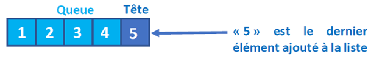
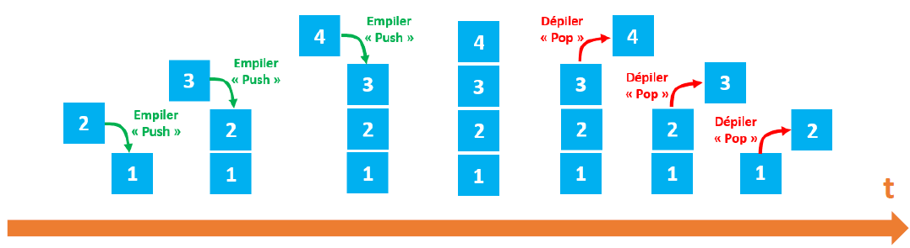
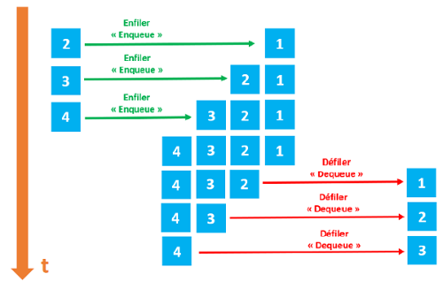
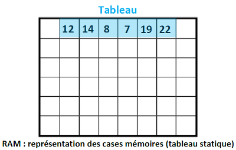
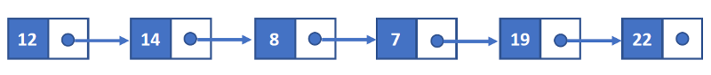
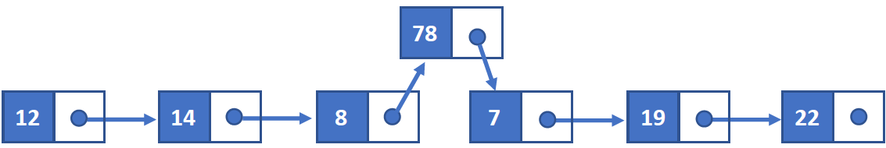
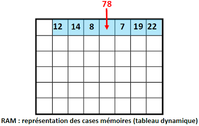
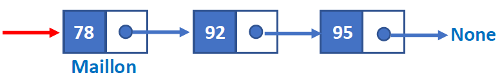
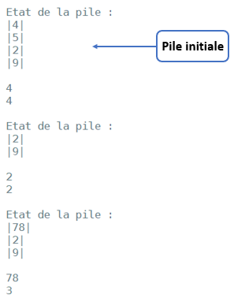
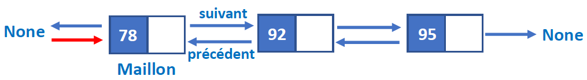

# <center><div class = "titre1">Structures de données linéaires</div></center>

## <div class = "encadré2">__Généralités__</div>

### <div class = "encadré3"> __Les structures de données abstraites__ </div>

Les algorithmes opèrent sur des données qui peuvent être de différentes natures. La première version d'un algorithme est autant que possible indépendante d'une implémentation particulière, c'est-à-dire que la représentation des données n'est pas fixée.  
<span style="display: block; margin: 8px 0 0 0;">A ce premier niveau, les données sont considérées de manière abstraite, on se donne une notation pour les décrire ainsi que l'ensemble des opérations que l'on peut appliquer et les propriétés de ces opérations.</span>
<span style="display: block; margin: 8px 0 0 0;">On parle alors de __type abstrait de données__.</span>
<span style="display: block; margin: 8px 0 0 0;">Pourquoi avoir recours à cette notion de type abstrait ? tout simplement pour définir des types de données non « primitifs », c'est-à-dire non disponibles dans les langages de programmation courants.</span>

!!! clock1 "Rappel"
    Les types de données __primitifs__ sont par exemple les __entiers__, les __flottants__, les __booléens__.

Nous étudierons 4 types de structures de données abstraites :
<div class="couleur_puce17" markdown="1">

* Les structures linéaires : les __listes__, les __piles__ et les __files__.
* Les structures à accès par clé : les __dictionnaires__.
* Les structures hiérarchiques : les __arbres__.
* Les structures relationnelles : les __graphes__.

Les 3 dernières structures seront étudiées dans des chapitres ultérieurs.

</div>

!!! tip "__Remarque__"
    Ces structures de données sont parfois « prévues » nativement dans les langages de programmation comme type de données mais ce n'est pas toujours le cas !

Une structure de données possède un ensemble de routines (procédures ou fonctions) permettant d'ajouter, d'effacer, d'accéder aux données.  
<span style="display: block; margin: 8px 0 0 0;">Cet ensemble de routine est appelé __interface__.</span>

### <div class = "encadré3"> __Les opérations élémentaires__ </div>

L'interface est généralement constituée de 4 routines élémentaires dites __CRUD__ :
<div class="couleur_puce17" markdown="1">

* **C**reate : ajout d'une donnée.
* **R**ead : lecture d'une donnée.
* **U**pdate : modification d'une donnée.
* **D**elete : suppression d'une donnée.

</div>

Derrière les opérations de lecture, de modification ou de suppression d'une donnée, se cache une autre routine tout aussi importante : la recherche d'une donnée.

!!! notes1 "Précision"
    Il faut d'abord trouver la donnée dans la structure avant de pouvoir la lire, la modifier ou la supprimer.

## <div class = "encadré2">__Structures de données linéaires : listes, piles et files__</div>

### <div class = "encadré3">__Type abstrait liste__</div>

Une liste est une structure abstraite de données permettant de regrouper des données sous une forme séquentielle.
Elle est constituée d’éléments d’un même type, chacun possédant un rang. 
<span style="display: block; margin: 5px 0 0 0;">Une liste est évolutive : on peut ajouter ou supprimer n’importe lequel de ces éléments.</span>
<span style="display: block; margin: 8px 0 0 0;">Une liste `#!python L` est composée de 2 parties :</span>
<div class="couleur_puce17" markdown="1">

* sa tête (souvent noté *car*), qui correspond au dernier élément ajouté à la liste ;
* sa queue (souvent noté *cdr*) qui correspond au reste de la liste ;

</div>
{ width="60%" .image}

Le langage de programmation <a href = "https://fr.wikipedia.org/wiki/Lisp" target="_blank">__Lisp__</a> (inventé par <a href = "https://fr.wikipedia.org/wiki/John_McCarthy" target="_blank">John McCarthy</a> en 1958) a été l’un des premiers langages de programmation à introduire cette notion de liste (Lisp signifie "list processing").  
<span style="display: block; margin: 8px 0 0 0;">Voici les opérations qui peuvent être effectuées sur une liste :</span>

<center markdown="1">

| Action                                                                       | Instruction         |
| :--------------------------------------------------------------------------: | :-----------------: |
| Créer une liste `#!python L` vide                                            |`#!python L = liste_vide()`         |
| Tester si la liste `#!python L` est vide                            |`#!python est_vide(L)`         |
| Insérer un élément `#!python x` dans la liste `#!python L` à une place `#!python p`                     |`#!python inserer_elt(x, p, L)`|
| Supprimer l'élément situé dans la liste `#!python L` à la place `#!python p`                   |`#!python supprimer_elt(L, p)` |
| Donner l'élément `#!python x` situé dans la liste `#!python L` à la place `#!python p`                  |`#!python contenu(L, p)`      |
| Compter le nombre d’éléments dans une liste `#!python L`                              |`#!python longueur(L)`        |
| Accéder à un élément `#!python x` de la liste `#!python L` en renvoyant sa place               |`#!python acces(L, x)`        |

</center>

??? exercice "Exercice 1"
    <div class = "list6_1">

    1. Voici une série d'instructions (les instructions ci-dessous s'enchaînent), expliquer ce qui se passe à chacune des étapes :<span style="display: block; margin: 8px 0 0 0;">
    ```python
    L = liste_vide()
    inserer_elt('A', 1, L)
    inserer_elt('O', 2, L)
    inserer_elt('B', 1, L)
    contenu(L, 2)
    inserer_elt('V', 3, L)
    inserer_elt('R', 2, L)
    ```
    </span>
    2. Même question avec la série d'instructions suivante :<span style="display: block; margin: 8px 0 0 0;">
    ```python
    L1 = liste_vide()
    L2 = liste_vide()
    inserer_elt(6, 1, L1)
    inserer_elt(7, 2, L1)
    inserer_elt(8, 3, L1)
    inserer_elt(9, 4, L1)
    inserer_elt(contenu(L1, 1), 1, L2)
    inserer_elt(contenu(L1, 2), 1, L2)
    inserer_elt(contenu(L1, 3), 1, L2)
    inserer_elt(contenu(L1, 4), 1, L2)
    supprimer_elt(L1, 2)
    contenu(L1, 2)
    supprimer_elt(L1, 2)
    longueur(L1)
    acces(L1, contenu(L1, 2))
    ```
    </span>
    
    </div>
    <center>
    [Correction de l'exercice 1 :material-cursor-default-click:](Correction_des_exos_du_cours.md#correction-de-lexercice-1){:target="_blank" .md-button}
    </center>

!!! tip "__Remarque__"
    Les types abstraits de données __pile__ et __file__, comme nous allons le voir ci-après, sont des listes possédant des restrictions au niveau de l’ajout ou de la suppression de leurs éléments. En effet ces actions ne pourront être réalisées que selon certaines modalités aux extrémités de ces deux types de structures abstraites de données.

### <div class = "encadré3"> __Type abstrait pile__ </div>

Les __piles__ (__stacks__ en anglais) sont fondées sur le principe du « __dernier arrivé, premier sorti__ » : elles sont dites de type __LIFO (Last In, First Out)__. C’est le principe même de la pile d’assiettes : c’est la dernière assiette posée sur la pile d’assiettes sales qui sera la première lavée.
{ .image}

L’insertion d’un élément dans la pile est appelée « __Empiler__ » et la suppression d’un élément de la pile est appelée « __Dépiler__ ». 
<span style="display: block; margin: 2px 0 0 0;">Dans la pile, nous gardons toujours trace du dernier élément présent dans la liste avec un pointeur appelé *top*.</span>
<span style="display: block; margin: 8px 0 0 0;">De nombreuses applications s’appuient sur l’utilisation d’une pile. En voici quelques-unes :</span>
<div class = "couleur_puce17" markdown="1">

* Dans un navigateur web, une pile sert à mémoriser les pages web visitées ; l’adresse de chaque nouvelle page visitée est empilée et l’utilisateur dépile l’adresse de la page précédente en cliquant sur le bouton « Afficher la page précédente ».
* L’évaluation des expressions mathématiques en notation post-fixée (ou polonaise inverse) utilise une pile.
* La fonction « Annuler la frappe » (Undo en anglais) d’un traitement de texte mémorise les modification apportées au texte dans une pile.
* La récursivité (une fonction qui fait appel à elle-même) utilise également une pile.
* Etc …

</div>

!!! tip "__Remarque__"
    En informatique, un __dépassement de pile__ ou __débordement de pile__ (en anglais, __*stack overflow*__) est un bug causé par un processus qui, lors de l'écriture dans une pile, écrit à l'extérieur de l'espace alloué à la pile, écrasant ainsi des informations nécessaires au processus.  

### <div class = "encadré3"> __Type abstrait file__ </div>

Les __files__ (__queue__ en anglais) sont fondées sur le principe du « __premier arrivé, premier sorti__ » : elles sont dites de type __FIFO (First In, First Out)__. C’est le principe de la file d’attente devant un guichet.

{ width="60%" .image}
<br>
L’insertion d’un élément dans une file s’appelle une opération de mise en file « __Enfiler__ » et la suppression d’un élément s’appelle une opération de retrait de la file « __Défiler__ ».  
<span style="display: block; margin: 8px 0 0 0;">Dans la file, nous maintenons toujours deux pointeurs, l’un pointant sur l’élément qui a été inséré en premier et qui est toujours présent dans la liste avec le pointeur en avant et l’autre pointant sur l’élément inséré en dernier avec le pointeur arrière.</span>

En général, on utilise une file pour mémoriser temporairement des transactions qui doivent attendre pour être traitées. Voici quelques exemples d’applications :
<div class = "couleur_puce17" markdown="1">

* Les serveurs d’impression, qui doivent traiter des requêtes dans l’ordre dans lequel elles arrivent, et les insère dans une file d’attente (ou une queue).
* Les requêtes entre machines sur un réseau.
* Certains moteurs multi-tâches, dans un système d’exploitation, qui doivent accorder du temps machine à chaque tâche, sans en privilégier une plus qu’une autre. 
* Un algorithme de parcours en largeur utilise une file pour mémoriser les noeuds visités (voir chapitre ultérieur).
* On utilise des files pour créer toutes sortes de mémoires tampons (buffers en anglais).
* Etc…

</div>

### <div class = "encadré3"> __Pile vs file : synthèse__ </div>

<center markdown="1">
<span style="display: block; margin: 35px 0 0 0;">

| Pile                                                                              | File      |
| :-------------------------------------------------------------------------------: | :---------------: |
| Les objets sont insérés et supprimés à 1 __seule__ extrémité                     |Les objets sont insérés et retirés aux 2 extrémités |  
| Un seul pointeur est utilisé : il pointe vers le __haut__ de la pile                  |Deux pointeurs différents sont utilisés pour les extrémités : la __tête__ et la __fin__     |
| Le dernier objet inséré est le premier à sortir                                   |L’objet inséré en premier est le premier qui sera supprimé     |
| Les piles suivent l’ordre Last In First Out (__LIFO__)                            |Les files suivent l’ordre First In First Out (__FIFO__)     |
| Les opérations sur les piles s'appellent <br>« __Empiler__ » et « __Dépiler__ »   |Les opérations sur les files s'appellent <br>« __Enfiler__ » et « __Défiler__ »     |
| Les piles sont visualisées sous forme de collections __verticales__                  |Les files sont visualisées sous forme de <br>collections __horizontales__     |

</span>
</center>

??? exercice "Exercice 2"
    <div class = "list6_1">

    1. Expliquer la différence fondamentale entre une pile et une file.
    2. Que désignent les acronymes FIFO et LIFO ?
    3. Donner quelques exemples d’application des piles et des files.
    4. En quoi diffèrent les listes des piles et des files ?

    </div>
    <center>
    [Correction de l'exercice 2 :material-cursor-default-click:](Correction_des_exos_du_cours.md#correction-de-lexercice-2){:target="_blank" .md-button}
    </center>

## <div class = "encadré2">__Représentation réelle des données__</div>

Les listes, les piles et les files sont donc des types mathématiques abstraits de représentation des données. Pour implémenter ces types abstraits de données d’une manière concrète dans la mémoire RAM d’une machine la plupart des langages de programmation utilisent 2 grandes familles de structures :
<div class="couleur_puce11" markdown="1">

* Les tableaux.
* Les listes chaînées.

</div>

### <div class = "encadré3"> __Les tableaux__ </div>

Un tableau est une suite contiguë de cases mémoires (les adresses des cases mémoires se suivent). Le système réserve (alloue) une plage d'adresses mémoires afin d’y stocker la valeur des éléments d’une pile ou d’une file par exemple.
{ .image}
<span style="display: block; margin: 15px 0 0 0;">
La taille d'un tableau est fixe : une fois que l'on a défini le nombre d'éléments que le tableau peut accueillir, il n'est pas possible de modifier sa taille. Si l'on veut insérer une nouvelle donnée, on doit créer un nouveau tableau plus grand et déplacer les éléments du premier tableau vers le second tout en ajoutant la donnée au bon endroit !</span>
<span style="display: block; margin: 8px 0 0 0;">Le langage __C__ par exemple, qui est un langage très populaire et très utilisé, utilise les tableaux comme implémentation des listes.</span>

### <div class = "encadré3"> __Les listes chaînées__ </div>

Dans une liste chaînée, à chaque élément de la liste on associe 2 cases mémoires : la première case contient l'élément et la deuxième contient l'adresse mémoire de l'élément suivant.

{ .image}

Avec ce type de structure, il est aisé d'insérer un nouvel élément :

{ .image}

### <div class = "encadré3"> __Tableau VS Liste chaînée : lequel choisir ?__ </div>

Le coût des opérations courantes peut être différent d'une structure à l'autre : la liste est une structure à laquelle il est très facile d'ajouter ou d'enlever des éléments (par filtrage, par exemple, dans le cas où l'on ne veut sélectionner qu'une partie des données), alors que le tableau est très efficace quand le nombre d'éléments ne change pas et qu'on veut un accès arbitraire (c'est-à-dire indépendant des autres éléments de la liste).
<span style="display: block; margin: 8px 0 0 0;">Selon les situations, nous aurons besoin d'utiliser plutôt l'un ou plutôt l'autre. En règle générale, il est bon d'utiliser une liste quand nous n'avons aucune idée du nombre exact d'éléments que nous allons manipuler (par exemple, si l'on fait des filtrages, ou que l'on prévoit de rajouter régulièrement des éléments).</span>
<span style="display: block; margin: 3px 0 0 0;">En contrepartie, nous n'avons pas d'accès arbitraire : nous pouvons toujours enregistrer certains éléments de la liste dans des variables à part si nous en avons besoin très souvent, mais nous ne pouvons pas aller chercher certains éléments spécifiques en milieu de liste directement : la seule méthode d'accès est le parcours de tous les éléments (ou du moins, de tous les éléments du début de la liste jusqu'à l'élément cherché).</span>
<span style="display: block; margin: 8px 0 0 0;">Il peut être difficile au début de savoir quelle structure de données choisir dans un cas précis. Même si nous avons fait un choix, il faut rester attentif aux opérations que nous faisons. Si par exemple nous nous retrouvons à demander souvent la taille d'une liste, ou à l'inverse à essayer de concaténer fréquemment des tableaux, il est peut-être temps de changer d'avis.</span>
<span style="display: block; margin: 8px 0 0 0;">Certains langages offrent des facilités pour manipuler les tableaux, et non pour les listes (qu'il faut construire à la main, par exemple en __C__) : si nous n'avons pas de bibliothèque pour nous faciliter la tâche, il vaut mieux privilégier la structure qui est facile à utiliser (dans de nombreux cas, il est possible d'imiter ce que l'on ferait naturellement avec une liste en utilisant maladroitement un tableau).</span>
<span style="display: block; margin: 15px 0 20px 0;">Voici, résumé dans un tableau, la complexité de certaines opérations courantes concernant une liste suivant son implémentation :</span>
<center markdown="1">

| Opération                | Tableau             | Liste chaînée      |
| :----------------------: | :-----------------: | :----------------: |
| accès arbitraire         |$\mathcal{O}(1)$     |$\mathcal{O}(n)$    |
| ajout                    |$\mathcal{O}(n)$     |$\mathcal{O}(1)$    |
| taille                   |$\mathcal{O}(1)$     |$\mathcal{O}(n)$    |
| concaténation            |$\mathcal{O}(n+m)$   |$\mathcal{O}(n)$    |
| filtrage                 |$\mathcal{O}(n+n)$   |$\mathcal{O}(n)$    |

</center>

!!! warning "Remarque importante"
    Dans certains langages de programmation, et notamment __Python__, on trouve une version "évoluée" des tableaux : les tableaux dynamiques.
    <span style="display: block; margin: 5px 0 0 0;">Les tableaux dynamiques ont une taille qui peut varier. Il est donc relativement simple d'insérer des éléments dans le tableau.</span>
    <span style="display: block; margin: 5px 0 0 0;"> Ce type de tableau permet d'implémenter facilement le type abstrait __liste__ (de même pour les __piles__ et les __files__).</span>
    { .image}
<span style="display: block; margin: 30px 0 0 0;"></span>

??? exercice "Exercice 3"
    <div class = "list6_1">

    1. A quoi servent les tableaux et les listes chaînées ?
    2. Quelle est la différence entre un tableau statique et un tableau dynamique ?
    3. Quel est le principal avantage d’une liste chaînée ?
 
    </div>
    <center>
    [Correction de l'exercice 3 :material-cursor-default-click:](Correction_des_exos_du_cours.md#correction-de-lexercice-3){:target="_blank" .md-button}
    </center>

## <div class = "encadré2">__Pile : implémentation en Python__</div>

### <div class = "encadré3"> __Opérations autorisées__ </div>

Une pile est une structure de données abstraite sur laquelle on va pouvoir réaliser un nombre restreint d’opérations autorisées. Si l'on reprend l'idée "donnée = assiette", une pile est semblable à une pile d'assiettes et l'on précise les opérations permises : 
<div class = "couleur_puce17" markdown="1">

* On peut empiler une assiette (ajouter une assiette en haut de pile).
* On peut dépiler une assiette (enlever l'assiette en haut de pile).
* On peut savoir si la pile est vide ou non.
* On peut connaitre quelle assiette est au sommet.
* On peut connaître le nombre d’assiettes dans la pile. 

</div>

!!! clock2 "Rappel"
    En programmation orientée objet (POO), on instancie un objet `#!python ma_pile` vide appartenant à la classe `#!python Pile` de la manière suivante : `#!python ma_pile = Pile()`.  
    <span style="display: block; margin: 8px 0 0 0;">Une fois l’objet instancié on peut lui appliquer les méthodes de la classe à laquelle il appartient de la manière suivante : `#!python ma_pile.methode_classe()`.</span>

Voici résumé sous la forme d’un tableau les opérations que l'on peut réaliser sur un __objet__ de type __Pile__ :

<center markdown="1">

| Action sur la pile                                    | Méthode de la classe `Pile`   |
| :---------------------------------------------------: | :------------------------:    |
| Créer une pile `#!python P` vide                      |`#!python P = Pile()`          |
| La pile `#!python P` est-elle vide ?                  |`#!python P.est_vide()`          |
| Empiler un nouvel élément sur la pile `#!python P`    |`#!python P.empiler(élément)`    |
| Dépiler un élément de la pile `#!python P`            |`#!python P.depiler()`           |
| Lire la valeur au sommet de la pile `#!python P`      |`#!python P.lire_sommet()`        |
| Renvoyer le nombre d’éléments présents dans la pile `#!python P`   |`#!python P.taille()`            |

</center>
??? exercice "Exercice 4"
    <div class = "list6_1">

    1. Indiquer quelles seront les instructions dans l’ordre chronologique permettant de créer la pile `#!python 12`, `#!python 14`, `#!python 8`, `#!python 7`, `#!python 19` et `#!python 22`, le sommet de la pile étant `#!python 22`.
    2. Quelle instruction affichera le sommet de la pile ?
    3. Quelle instruction donnera le nombre d’éléments de la pile ?
    4. On souhaite insérer l’élément `#!python 20` entre les éléments `#!python 8` et `#!python 7` en conservant tous les autres éléments de la pile : comment doit-on procéder ?
    5. Quelle instruction supprimera l’élément correspondant au sommet de la pile ?
    6. Comment supprimer tous les éléments qui restent dans la pile et comment vérifier qu’à la fin la pile est vide ?

    </div>
    <center>
    [Correction de l'exercice 4 :material-cursor-default-click:](Correction_des_exos_du_cours.md#correction-de-lexercice-4){:target="_blank" .md-button}
    </center>

!!! tip "__Remarque__"
    On ne peut pas dans une pile, comme dans une liste, prendre une assiette à n'importe quel rang dans la pile (on risquerait de tout faire tomber et de casser toutes les assiettes), ni ajouter une assiette n'importe où dans la pile.

### <div class = "encadré3"> __Implémentation d’une pile en Python avec un tableau dynamique__ </div>

Pour implémenter une pile en python, on peut utiliser le type `#!python list` de Python. Et pour interdire d'autres opérations que celles signalées dans le tableau ci-dessus, on peut définir une __classe__ `#!python Pile` dont les méthodes correspondront aux opérations autorisées.

```python
class Pile:
    """Implémentation des piles à l'aide des listes Python"""

    def __init__(self):
        self.liste = []

    def empiler(self, valeur):
        self.liste.append(valeur)

    def depiler(self):
        if self.liste:
            return self.liste.pop()

    def est_vide(self):
        return self.liste == []

    def taille(self):
        return len(self.liste)

    def lire_sommet(self):
        return self.liste[-1]

    def __str__(self):
        ch = ''
        for elt in self.liste:
            ch = '|' + str(elt) + '|\n' + ch
        ch = "\nEtat de la pile :\n" + ch
        return ch

p = Pile()
p.empiler(9)
p.empiler(2)
p.empiler(5)
p.empiler(4)
print(p)

p.depiler()
print(p)

p.empiler(7)
print(p)

print(p.lire_sommet())
print(p.taille())
```

??? exercice "Exercice 5"
    <div class = "list6_1">

    1. Quel est le constructeur de la classe `#!python Pile` ?
    2. Quelles sont les méthodes de la classe `#!python Pile` ? Quelles sont les méthodes spéciales ?
    3. Tester le programme afin d’effectuer quelques opérations sur des piles.

    </div>
    <center>
    [Correction de l'exercice 5 :material-cursor-default-click:](Correction_des_exos_du_cours.md#correction-de-lexercice-5){:target="_blank" .md-button}
    </center>

### <div class = "encadré3"> __Implémentation d’une pile en Python avec une liste chaînée__ </div>

Chaque « boîte » ou « maillon » contient une donnée, la flèche à droite de la boîte est le lien sur la donnée suivante (A noter que le dernier maillon ne pointe sur rien ― on utilisera `#!python None` en Python). 
<span style="display: block; margin: 5px 0 0 0;">En python, une fois l'objet de type `#!python Pile` instancié et stocké dans une variable nommée `#!python p` par exemple, la première flèche à gauche (en rouge) peut être associée à cette variable.</span>
<span style="display: block; margin: 5px 0 0 0;">la variable `#!python p` de type `#!python Pile` "pointe" sur le premier maillon (celui qui correspond au sommet de la pile) et permet de le récupérer avec la syntaxe `#!python p.lire_sommet()`.</span>
{ .image}
<span style="display: block; margin: 20px 0 0 0;">Le programme suivant permet d’implémenter une pile en utilisant une liste chaînée. Le programme repose sur une classe `#!python Maillon` et une classe `#!python Pile`.</span>

```python
class Maillon :

    def __init__(self, valeur, suivant=None):
        self.valeur = valeur
        self.suivant = suivant

class Pile:
    """Implémentation des piles à l'aide des listes chaînées"""

    def __init__(self):
        self.longueur = 0 # Nombre d'éléments dans la pile
        self.sommet = None

    def empiler(self, valeur):
        self.sommet = Maillon(valeur, self.sommet)
        self.longueur += 1

    def depiler(self):
        if self.longueur > 0:
            valeur = self.sommet.valeur
            self.sommet = self.sommet.suivant
            self.longueur -= 1
            return valeur

    def est_vide(self):
        return self.longueur == 0

    def lire_sommet(self):
        return self.sommet.valeur

    def taille(self):
        return self.longueur

    def __str__(self):
        ch = "\nEtat de la pile :\n"
        sommet = self.sommet
        while sommet != None:
            ch += '|' + str(sommet.valeur) + '|\n'
            sommet = sommet.suivant
        return ch
```

??? exercice "Exercice 6"

    En utilisant les 2 classes précédentes, créer un programme permettant de créer la pile initiale sur laquelle on réalisera les actions affichées ci-dessous :

    { .image}
    <center>
    [Correction de l'exercice 6 :material-cursor-default-click:](Correction_des_exos_du_cours.md#correction-de-lexercice-6){:target="_blank" .md-button}
    </center>

### <div class = "encadré3"> __La notation polonaise inversée__ </div>

Lorsque l’on écrit usuellement des expressions algébriques, les parenthèses sont indispensables.  
<span style="display: block; margin: 3px 0 0 0;">Elles permettent par exemple de distinguer les expressions $~1 + 2 × 3~$ et $~(1 + 2) × 3$.</span>
<span style="display: block; margin: 3px 0 0 0;">Avec la notation préfixée (appelée aussi notation polonaise, en référence au mathématicien polonais, <a href="https://fr.wikipedia.org/wiki/Jan_%C5%81ukasiewicz" target="_blank">Jan Łukasiewic</a>), les parenthèses ne sont plus nécessaires :</span>
<div class = "couleur_puce17" markdown="1">

* $1 + 2 × 3~$ sera noté $~+ 1 × 2 3$ 
* $(1 + 2) × 3~$ sera noté $~× + 1 2 3$ 

</div>
Dérivée de la notation polonaise utilisée pour la première fois en 1924 par le mathématicien polonais Jan Łukasiewicz, la NPI (Notation Polonaise Inversée) a été inventée par le philosophe et informaticien australien <a href="https://en.wikipedia.org/wiki/Charles_Leonard_Hamblin" target="_blank">Charles Leonard Hamblin</a> au milieu des années 1950, pour permettre les calculs sans faire référence à une quelconque adresse mémoire.
<span style="display: block; margin: 3px 0 0 0;">À la fin des années 1960, elle a été diffusée dans le public comme interface utilisateur avec les calculatrices de bureau de Hewlett-Packard (HP-9100), puis avec la calculatrice scientifique HP-35 en 1972.</span>

#### <div class = "encadré4"> __Principe__ </div>

Il est possible de stocker une expression en notation polonaise inversée dans une liste.
<span style="display: block; margin: 3px 0 0 0;">Ainsi, l'expression $~+ × - /~10~2~4~3~6~$ est stockée dans la liste `#!python ['+', '*', '-', '/', 10, 2, 4, 3, 6]`.</span>

Pour évaluer cette expression, on utilisera une pile. On parcourt la liste de la fin vers le début : 
<div class = "couleur_puce18" markdown="1">

* Si l'élément est un nombre, on l'empile. 
* Si l'élément est un opérateur, on dépile ses deux opérandes et on calcule, puis on empile le résultat de ce calcul.

</div>
Le résultat de l'expression est l'unique élément restant dans la pile.

??? exercice "Exercice 7"
    <div class = "list6_1">

    1. Soit l’opération arithmétique : $~3 × (2 + 4)$. Comment sera-t-elle codée en notation polonaise inversée ?
    2. Représenter sous la forme d’une pile l’exécution du calcul précédent.
    3. En utilisant le principe de pile, évaluer l’expression $~+ × - / 10 2 4 3 6~$ exprimée en notation polonaise inversée. On représentera sous la forme d’un schéma l’évolution de la pile permettant de réaliser le calcul.
    4. Vérifier avec le programme ci-dessous le résultat obtenu à la question précédente.
    ```python
    class Maillon :

        def __init__(self, valeur, suivant=None):
            self.valeur = valeur
            self.suivant = suivant

    class Pile:
        """Implémentation des piles à l'aide des listes chaînées"""

        def __init__(self):
            self.longueur = 0 # Nombre d'éléments dans la pile
            self.sommet = None

        def empiler(self, valeur):
            self.sommet = Maillon(valeur, self.sommet)
            self.longueur += 1

        def depiler(self):
            if self.longueur > 0:
                valeur = self.sommet.valeur
                self.sommet = self.sommet.suivant
                self.longueur -= 1
                return valeur

        def est_vide(self):
            return self.longueur == 0

        def lire_sommet(self):
            return self.sommet.valeur

        def taille(self):
            return self.longueur

        def __str__(self):
            ch = "\nEtat de la pile :\n"
            sommet = self.sommet
            while sommet != None:
                ch += '|' + str(sommet.valeur) + '|\n'
                sommet = sommet.suivant
            return ch

    def prefixe(expression):
        pile = Pile()
        for c in reversed(expression):
            if isinstance(c, int):
                pile.empiler(c)
                print(pile)
            else :
                a = pile.depiler()
                b = pile.depiler()
                pile.empiler(eval(str(a) + c + str(b)))
                print(pile)
        return pile.depiler()
        
    r = prefixe(['+', '*', '-', '/', 10, 2, 4, 3, 6])
    ```

    </div>
    <center>
    [Correction de l'exercice 7 :material-cursor-default-click:](Correction_des_exos_du_cours.md#correction-de-lexercice-7){:target="_blank" .md-button}
    </center>

## <div class = "encadré2">__File : implémentation en Python__</div>

### <div class = "encadré3"> __Opérations autorisées__ </div>

Une file est une structure de données abstraite sur laquelle on va pouvoir réaliser un nombre restreint d’opérations autorisées.
<span style="display: block; margin: 3px 0 0 0;">Si l'on reprend l'idée de la file d'attente, les opérations permises sont les suivantes :</span>
<div class = "couleur_puce17" markdown="1">

* On peut enfiler un élément (une personne arrive en queue de file).
* On peut défiler un élément (la personne en début de file sort de la file).
* On peut savoir si la file est vide ou non.
* On peut afficher la longueur de la file (nombre de personnes la composant).

</div>

Voici résumé sous la forme d’un tableau les opérations que l'on peut réaliser sur un __objet__ de type __File__ :

<center markdown="1">

| Action sur la file                                    | Méthode de la classe `#!python File`   |
| :---------------------------------------------------: | :---------------------------: |
| Créer une file `#!python F` vide                      |`#!python F = File()`          |
| La file `#!python F` est-elle vide ?                               |`#!python F.est_vide()`                    |
| Enfiler un nouvel élément dans la file `#!python F`              |`#!python F.enfiler(élément)`             |
| Défiler un élément de la file `#!python F`                        |`#!python F.defiler()`                    |
| Lire la valeur en tête de file  `#!python F`                      |`#!python F.lire_tete()`                   |
| Afficher le nombre d’éléments présents dans la file `#!python F`  |`#!python F.taille()`                     |

</center>
??? exercice "Exercice 8"
    <div class = "list6_1">

    1. Indiquer quelles seront les instructions dans l’ordre chronologique permettant de créer la file `#!python 12`, `#!python 14`, `#!python 8`, `#!python 7`, `#!python 19` et `#!python 22`, l’élément de tête de la file étant `#!python 22`.
    2. Si on applique les instructions suivantes à la file précédente, indiquer la composition de la file après l’exécution de celles-ci.
        ```python
        defiler() 
        defiler() 
        enfiler(78) 
        ``` 

    </div>
    <center>
    [Correction de l'exercice 8 :material-cursor-default-click:](Correction_des_exos_du_cours.md#correction-de-lexercice-8){:target="_blank" .md-button}
    </center>

### <div class = "encadré3"> __Implémentation d’une file en Python avec un tableau dynamique__ </div>

Pour implémenter une file en python, on peut utiliser le type `#!python list` de Python. Et pour interdire d'autres opérations que celles signalées dans le tableau ci-dessus, on peut définir une __classe__ `#!python File` dont les méthodes correspondront aux opérations autorisées.

```python
class File:
    """Implémentation des files à l'aide des listes Python"""

    def __init__(self):
        self.liste = []

    def enfiler(self, valeur):
        self.liste.append(valeur)

    def defiler(self):
        if self.liste:
            return self.liste.pop(0)

    def lire_tete(self):
        return self.liste[0]

    def est_vide(self):
        return self.liste == []

    def taille(self):
        return len(self.liste)

    def __str__(self):
        ch = "\nEtat de la file :\n\n"
        for elt in self.liste:
            ch +=  str(elt) + '|'
        ch += "\n"
        return ch

f = File()
f.enfiler(75)
f.enfiler(78)
f.enfiler(92)
f.enfiler(93)
f.enfiler(95)

print(f)
print("La file est-elle vide ?", f.est_vide())
print(f.taille())

f.defiler()
f.defiler()

print(f)
print(f.taille())

f.enfiler(75)
f.enfiler(78)
print(f)
```

??? exercice "Exercice 9"

    Identifier la tête et la queue de la file au moment du premier affichage de la file.
    <span style="display: block; margin: 3px 0 0 0;">Le programme a-t-il le comportement attendu ?</span>
    <div></div>
    <center>
    [Correction de l'exercice 9 :material-cursor-default-click:](Correction_des_exos_du_cours.md#correction-de-lexercice-9){:target="_blank" .md-button}
    </center>

### <div class = "encadré3"> __Implémentation d’une file en Python avec une liste doublement chaînée__ </div>

La structure de liste doublement chaînée est bien adaptée pour une implémentation de file.
<span style="display: block; margin: 3px 0 0 0;">Chaque « boîte » ou « maillon » contient une donnée, la flèche à droite de la boîte est le lien sur la donnée suivante, la flèche à gauche le lien sur la donnée précédente.</span>
<span style="display: block; margin: 3px 0 0 0;">Le dernier maillon a un suivant "vide", le premier maillon a un prédécesseur "vide" (on utilisera `#!python None` en python).</span>
<span style="display: block; margin: 3px 0 0 0;">La flèche en rouge à gauche peut être associée dans le code python ci-dessous à la variable `#!python f` (la variable `#!python f` de type `#!python File` "pointe" sur le premier maillon et permet de le récupérer avec la syntaxe `#!python f.debut`).</span>
{ width="75%" .image}

Le programme ci-après permet d’implémenter une file en utilisant une liste doublement chaînée. Le programme repose sur une classe `Maillon` et une classe `File`.

```python
class Maillon :

    def __init__(self, valeur, precedent=None, suivant=None):
        self.valeur = valeur
        self.precedent = precedent
        self.suivant = suivant

class File:
    """Implémentation des files à l'aide des listes doublement chaînées"""

    def __init__(self):
        self.longueur = 0 # Nombre d'éléments dans la file
        self.debut = None
        self.fin = None

    def enfiler(self, valeur):
        if self.longueur == 0:
            self.debut = self.fin = Maillon(valeur)
        else:
            self.fin = Maillon(valeur, self.fin)
            self.fin.precedent.suivant = self.fin
        self.longueur += 1

    def defiler(self):
        if self.longueur > 0:
            valeur = self.debut.valeur
            if self.longueur > 1:
                self.debut = self.debut.suivant
                self.debut.precedent = None
            else:
                self.debut = self.fin = None
            self.longueur -= 1
            return valeur

    def lire_tete(self):
        return self.debut.valeur

    def est_vide(self):
        return self.longueur == 0

    def taille(self):
        return self.longueur

    def __str__(self):
        ch = "\nEtat de la file :\n"
        maillon = self.debut
        while maillon != None:
            ch += str(maillon.valeur) + '|'
            maillon = maillon.suivant
        ch += "\n"
        return ch
```

??? exercice "Exercice 10"

    Vérifier que le programme précédent redonne bien les mêmes résultats que ceux du paragraphe [__Implémentation d’une file en Python avec un tableau dynamique__](SDL.md#implementation-dune-file-en-python-avec-un-tableau-dynamique)  
    <div></div>
    <center>
    [Correction de l'exercice 10 :material-cursor-default-click:](Correction_des_exos_du_cours.md#correction-de-lexercice-10){:target="_blank" .md-button}
    </center>