# <center><div class = "titre2"> Correction des exercices</div></center>

### <div class = "encadré_exo"> __Correction de l'exercice 1__ </div>
<div class = "list1_2" markdown="1">

2. 

</div>
<div class="decal2" markdown="1">
<div class="couleur_puce19" markdown="1">

* Pour le modèle __FIFO__ :

</div>
</div>
<center markdown="1">

<table>
<thead>
<tr>
<th align="center" style="vertical-align:middle" class="style">Processus</th>
<th align="center" style="vertical-align:middle">P1</th>
<th align="center" style="vertical-align:middle">P2</th>
<th align="center" style="vertical-align:middle">P3</th>
<th align="center" style="vertical-align:middle">P4</th>
<th align="center" style="vertical-align:middle">P5</th>
</tr>
</thead>
<tbody>
<tr>
<td align="center" style="vertical-align:middle" class="style">Durée en quantum</td>
<td align="center" style="vertical-align:middle"><math><mo>3</mo></math></td>
<td align="center" style="vertical-align:middle"><math><mo>6</mo></math></td>
<td align="center" style="vertical-align:middle"><math><mo>4</mo></math></td>
<td align="center" style="vertical-align:middle"><math><mo>2</mo></math></td>
<td align="center" style="vertical-align:middle"><math><mo>1</mo></math></td>
</tr>
<tr>
<td align="center" style="vertical-align:middle" class="style">Date d'arrivée</td>
<td align="center" style="vertical-align:middle"><math><mo>0</mo></math></td>
<td align="center" style="vertical-align:middle"><math><mo>1</mo></math></td>
<td align="center" style="vertical-align:middle"><math><mo>4</mo></math></td>
<td align="center" style="vertical-align:middle"><math><mo>6</mo></math></td>
<td align="center" style="vertical-align:middle"><math><mo>7</mo></math></td>
</tr>
<tr>
<td align="center" style="vertical-align:middle" class="style">Temps de terminaison</td>
<td align="center" style="vertical-align:middle"><math><mo>3</mo></math></td>
<td align="center" style="vertical-align:middle"><math><mo>9</mo></math></td>
<td align="center" style="vertical-align:middle"><math><mo>13</mo></math></td>
<td align="center" style="vertical-align:middle"><math><mo>15</mo></math></td>
<td align="center" style="vertical-align:middle"><math><mo>16</mo></math></td>
</tr>
<tr>
<td align="center" style="vertical-align:middle" class="style">Temps d'exécution</td>
<td align="center" style="vertical-align:middle"><math><mo>3</mo></math></td>
<td align="center" style="vertical-align:middle"><math><mo>8</mo></math></td>
<td align="center" style="vertical-align:middle"><math><mo>9</mo></math></td>
<td align="center" style="vertical-align:middle"><math><mo>9</mo></math></td>
<td align="center" style="vertical-align:middle"><math><mo>9</mo></math></td>
</tr>
<tr>
<td align="center" style="vertical-align:middle" class="style">Temps d'attente</td>
<td align="center" style="vertical-align:middle"><math><mo>0</mo></math></td>
<td align="center" style="vertical-align:middle"><math><mo>2</mo></math></td>
<td align="center" style="vertical-align:middle"><math><mo>5</mo></math></td>
<td align="center" style="vertical-align:middle"><math><mo>7</mo></math></td>
<td align="center" style="vertical-align:middle"><math><mo>8</mo></math></td>
</tr>
</tbody></table>

</center>
<span style="display: block; margin: 8px 0 0 2.9em;">Le temps moyen d'exécution est alors : $\displaystyle\frac{3~+~8~+~9~+~9~+~9}{5}=\displaystyle\frac{38}{5}~$ soit $~7,6$.</span>
<span style="display: block; margin: 20px 0 0 2.9em;">Et le temps moyen d'attente est : $\displaystyle\frac{0~+~2~+~5~+~7~+~8}{5}=\displaystyle\frac{22}{5}~$ soit $~4,4$.</span>
<div class="decal2" markdown="1">
<div class="couleur_puce19" markdown="1">

* Pour le modèle __RR__ :

</div>
</div>
<center markdown="1">
<table>
<thead>
<tr>
<th align="center" style="vertical-align:middle" class="style">Processus</th>
<th align="center" style="vertical-align:middle">P1</th>
<th align="center" style="vertical-align:middle">P2</th>
<th align="center" style="vertical-align:middle">P3</th>
<th align="center" style="vertical-align:middle">P4</th>
<th align="center" style="vertical-align:middle">P5</th>
</tr>
</thead>
<tbody>
<tr>
<td align="center" style="vertical-align:middle" class="style">Durée en quantum</td>
<td align="center" style="vertical-align:middle"><math><mo>3</mo></math></td>
<td align="center" style="vertical-align:middle"><math><mo>6</mo></math></td>
<td align="center" style="vertical-align:middle"><math><mo>4</mo></math></td>
<td align="center" style="vertical-align:middle"><math><mo>2</mo></math></td>
<td align="center" style="vertical-align:middle"><math><mo>1</mo></math></td>
</tr>
<tr>
<td align="center" style="vertical-align:middle" class="style">Date d'arrivée</td>
<td align="center" style="vertical-align:middle"><math><mo>0</mo></math></td>
<td align="center" style="vertical-align:middle"><math><mo>1</mo></math></td>
<td align="center" style="vertical-align:middle"><math><mo>4</mo></math></td>
<td align="center" style="vertical-align:middle"><math><mo>6</mo></math></td>
<td align="center" style="vertical-align:middle"><math><mo>7</mo></math></td>
</tr>
<tr>
<td align="center" style="vertical-align:middle" class="style">Temps de terminaison</td>
<td align="center" style="vertical-align:middle"><math><mo>5</mo></math></td>
<td align="center" style="vertical-align:middle"><math><mo>16</mo></math></td>
<td align="center" style="vertical-align:middle"><math><mo>15</mo></math></td>
<td align="center" style="vertical-align:middle"><math><mo>12</mo></math></td>
<td align="center" style="vertical-align:middle"><math><mo>10</mo></math></td>
</tr>
<tr>
<td align="center" style="vertical-align:middle" class="style">Temps d'exécution</td>
<td align="center" style="vertical-align:middle"><math><mo>5</mo></math></td>
<td align="center" style="vertical-align:middle"><math><mo>15</mo></math></td>
<td align="center" style="vertical-align:middle"><math><mo>11</mo></math></td>
<td align="center" style="vertical-align:middle"><math><mo>6</mo></math></td>
<td align="center" style="vertical-align:middle"><math><mo>3</mo></math></td>
</tr>
<tr>
<td align="center" style="vertical-align:middle" class="style">Temps d'attente</td>
<td align="center" style="vertical-align:middle"><math><mo>2</mo></math></td>
<td align="center" style="vertical-align:middle"><math><mo>9</mo></math></td>
<td align="center" style="vertical-align:middle"><math><mo>7</mo></math></td>
<td align="center" style="vertical-align:middle"><math><mo>4</mo></math></td>
<td align="center" style="vertical-align:middle"><math><mo>2</mo></math></td>
</tr>
</tbody></table>

</center>
<span style="display: block; margin: 8px 0 0 2.9em;">Le temps moyen d'exécution est alors : $\displaystyle\frac{5~+~15~+~11~+~6~+~3}{5}=\displaystyle\frac{40}{5}~$ soit $~8$.</span>
<span style="display: block; margin: 20px 0 0 2.9em;">Et le temps moyen d'attente est : $\displaystyle\frac{2~+~9~+~7~+~4~+~2}{5}=\displaystyle\frac{24}{5}~$ soit $~4,8$.</span>
<div class="decal2" markdown="1">
<div class="couleur_puce19" markdown="1">

* Pour le modèle __SRT__ :

</div>
</div>
<center markdown="1">

<table>
<thead>
<tr>
<th align="center" style="vertical-align:middle" class="style">Processus</th>
<th align="center" style="vertical-align:middle">P1</th>
<th align="center" style="vertical-align:middle">P2</th>
<th align="center" style="vertical-align:middle">P3</th>
<th align="center" style="vertical-align:middle">P4</th>
<th align="center" style="vertical-align:middle">P5</th>
</tr>
</thead>
<tbody>
<tr>
<td align="center" style="vertical-align:middle" class="style">Durée en quantum</td>
<td align="center" style="vertical-align:middle"><math><mo>3</mo></math></td>
<td align="center" style="vertical-align:middle"><math><mo>6</mo></math></td>
<td align="center" style="vertical-align:middle"><math><mo>4</mo></math></td>
<td align="center" style="vertical-align:middle"><math><mo>2</mo></math></td>
<td align="center" style="vertical-align:middle"><math><mo>1</mo></math></td>
</tr>
<tr>
<td align="center" style="vertical-align:middle" class="style">Date d'arrivée</td>
<td align="center" style="vertical-align:middle"><math><mo>0</mo></math></td>
<td align="center" style="vertical-align:middle"><math><mo>1</mo></math></td>
<td align="center" style="vertical-align:middle"><math><mo>4</mo></math></td>
<td align="center" style="vertical-align:middle"><math><mo>6</mo></math></td>
<td align="center" style="vertical-align:middle"><math><mo>7</mo></math></td>
</tr>
<tr>
<td align="center" style="vertical-align:middle" class="style">Temps de terminaison</td>
<td align="center" style="vertical-align:middle"><math><mo>3</mo></math></td>
<td align="center" style="vertical-align:middle"><math><mo>16</mo></math></td>
<td align="center" style="vertical-align:middle"><math><mo>8</mo></math></td>
<td align="center" style="vertical-align:middle"><math><mo>11</mo></math></td>
<td align="center" style="vertical-align:middle"><math><mo>9</mo></math></td>
</tr>
<tr>
<td align="center" style="vertical-align:middle" class="style">Temps d'exécution</td>
<td align="center" style="vertical-align:middle"><math><mo>3</mo></math></td>
<td align="center" style="vertical-align:middle"><math><mo>15</mo></math></td>
<td align="center" style="vertical-align:middle"><math><mo>4</mo></math></td>
<td align="center" style="vertical-align:middle"><math><mo>5</mo></math></td>
<td align="center" style="vertical-align:middle"><math><mo>2</mo></math></td>
</tr>
<tr>
<td align="center" style="vertical-align:middle" class="style">Temps d'attente</td>
<td align="center" style="vertical-align:middle"><math><mo>0</mo></math></td>
<td align="center" style="vertical-align:middle"><math><mo>9</mo></math></td>
<td align="center" style="vertical-align:middle"><math><mo>0</mo></math></td>
<td align="center" style="vertical-align:middle"><math><mo>3</mo></math></td>
<td align="center" style="vertical-align:middle"><math><mo>1</mo></math></td>
</tr>
</tbody></table>

</center>
<span style="display: block; margin: 8px 0 0 2.9em;">Le temps moyen d'exécution est alors : $\displaystyle\frac{3~+~15~+~4~+~5~+~2}{5}=\displaystyle\frac{29}{5}~$ soit $~5,8$.</span>
<span style="display: block; margin: 20px 0 0 2.9em;">Et le temps moyen d'attente est : $\displaystyle\frac{0~+~9~+~0~+~3~+~1}{5}=\displaystyle\frac{13}{5}~$ soit $~2,6$.</span>
<div class = "list1_3" markdown="1">

3. Ici, c'est clairement le modèle __SRT__ qui est préférable tant au niveau du temps moyen d'exécution que du temps moyen d'attente.

</div>

### <div class = "encadré_exo"> __Correction de l'exercice 2__ </div>
<div class = "list1_1" markdown="1">

1. Si les processus sont exécutés de façon séquentielle : __P1__ suivi de __P2__ suivi de __P3__, il n'y pas d'interblocage.
2. On atteint une situation d'interblocage lorsque les instructions sont exécutées dans l'ordre suivant :

</div> 
<div class="list1_a" markdown="1">

1. __P1__ demande __R1__
2. __P2__ demande __R2__
3. __P3__ demande __R3__
4. __P1__ demande __R2__
5. __P2__ demande __R3__
6. __P3__ demande __R1__

</div>
<div class = "decal3" markdown="1">Ce que montre la figure suivante :
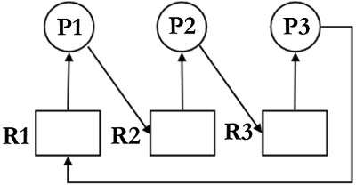{: .image}
<span style="display: block; margin: 30px 0 0 0;">Dans ce cas, on dit que l'exécution des processus est gérée par un ordonnanceur <b>du type circulaire</b>.</span></div>

### <div class = "encadré_exo"> __Correction de l'exercice 3__ </div>

On identifie quatre processus, les quatre voitures __V<sub>1</sub>__, __V<sub>2</sub>__, __V<sub>3</sub>__, et __V<sub>4</sub>__ (__V<sub>1</sub>__ en haut, puis numérotées dans le sens anti-horaire).  
Les quatre ressources sont les quatre portions de routes se trouvant devant chaque voiture (__R<sub>1</sub>__ à __R<sub>4</sub>__).
<span style="display: block; margin: 5px 0 0 0;">Les quatre conditions de Coffman sont bien satisfaites :</span>
<div class="couleur_puce19" markdown="1">

* __Exclusion mutuelle__ : Les ressources sont en accès exclusif (deux voitures ne peuvent pas se retrouver sur la même portion de route en même temps).
* __Possession et attente__ : Chaque voiture détient une portion de route et attend celle qui est devant elle.
* __Sans préemption__ : On a fait l'hypothèse qu'une voiture ne peux pas forcer le passage et pousser la voiture qui est devant elle.
* __Attente circulaire__ : __V<sub>1</sub>__ attend __R<sub>2</sub>__ occupée par __V<sub>2</sub>__, qui attend __R<sub>3</sub>__ occupée par __V<sub>3</sub>__, qui attend __R<sub>4</sub>__ occupée par __V<sub>4</sub>__, qui attend __R<sub>1</sub>__ occupée par __V<sub>1</sub>__.

</div>

### <div class = "encadré_exo"> __Correction de l'exercice 4__ </div>

Les états possibles d'un processus sont : prêt, élu, terminé et bloqué.
<div class="list1_1" markdown="1">

1. Expliquer à quoi correspond l'état élu.

</div>
<div class="decal3" markdown="1">

??? solution "Solution"
    Un processus élu est un processus en cours d'exécution.

</div>
<div class="list1_2" markdown="1">

2. Proposer un schéma illustrant les passages entre les différents états.

</div>
<div class="decal3" markdown="1">

??? solution "Solution"
    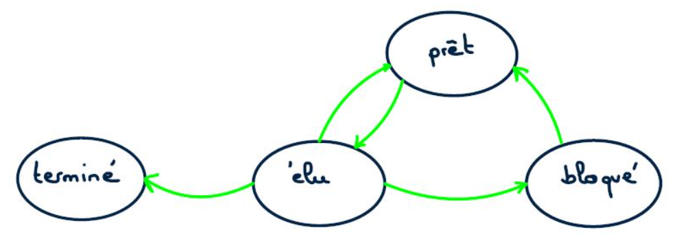{ .image width=80%}

</div>
<div class="list1_3" markdown="1">

3. On suppose que quatre processus C1, C2, C3 et C4 sont créés sur un ordinateur, et qu'aucun autre processus n'est lancé sur celui-ci, ni préalablement ni pendant l'exécution des quatre processus. L'ordonnanceur, pour exécuter les différents processus prêts, les place dans une structure de données de type file. Un processus prêt est enfilé et un processus élu est défilé.
<span style="display: block; margin: 8px 0 0 0;">Parmi les propositions suivantes, recopier celle qui décrit le fonctionnement des entrées/sorties dans une file :</span>

</div>
<div class="decal15" markdown="1">
<div class="couleur_puce14etoi" markdown="1">

* Premier entré, dernier sorti
* Premier entré, premier sorti
* Dernier entré, premier sorti

</div>
</div>
<div class="decal3" markdown="1">

??? solution "Solution"
    Premier entré, premier sorti

</div>
<div class="list1_4" markdown="1">

4. On suppose que les quatre processus arrivent dans la file et y sont placés dans l'ordre C1, C2, C3 et C4 . Les temps d'exécution totaux de C1, C2, C3 et C4 sont respectivement 100 ms, 190 ms, 80 ms et 60 ms.

</div>
<div class="decal15" markdown="1">
<div class="couleur_puce14etoi" markdown="1">

* Après 40 ms d'exécution, le processus C1 demande une opération d'écriture disque, opération qui dure 200 ms. Pendant cette opération d'écriture, le processus C1 passe à l'état bloqué.
* Après 20 ms d'exécution, le processus C3 demande une opération d'écriture disque, opération qui dure 10 ms. Pendant cette opération d'écriture, le processus C3 passe à l'état bloqué.

</div>
</div>
<div class="decal3" markdown="1">

Faire une frise chronologique et y indiquer les états de tous les processus.

</div>
<div class="decal3" markdown="1">

??? solution "Solution"
    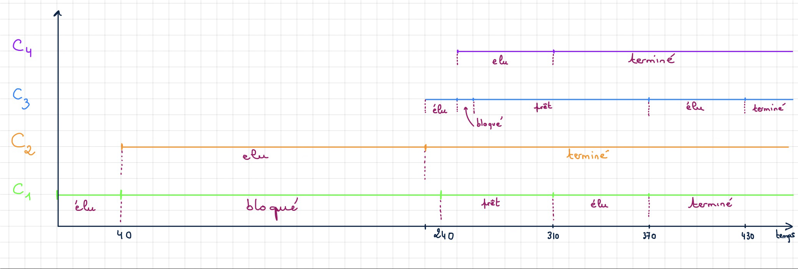{ .image width=90%}

</div>
<div class="list1_5" markdown="1">

5. Ci-dessous deux programmes en pseudo-code sont présentés.
<span style="display: block; margin: 5px 0 0 0;">Verrouiller un fichier signifie que le programme demande un accès exclusif au fichier et l'obtient si le fichier est disponible.</span>

</div>
<div class="decal3" markdown="1">
<center markdown="1">

| Programme 1               | Programme 2                | 
| :-----------------------: | :------------------------: | 
|   Verrouiller fichier_1    |   Verrouiller fichier_2        | 
|   Calculs sur fichier_1    |  Verrouiller fichier_1      | 
|  Verrouiller fichier_2     |   Calculs sur fichier_1         | 
|  Calculs sur fichier_1  | Calculs sur fichier_2 |
|Calculs sur fichier_2  | Déverrouiller fichier_1|
|Calculs sur fichier_1   |Déverrouiller fichier_2 |
|Déverrouiller fichier_2  |   
|Déverrouiller fichier_1   |  

</center>
En supposant que les processus correspondant à ces programmes s'exécutent simultanément (exécution concurrente), expliquer le problème qui peut être rencontré.

</div>
<div class="decal3" markdown="1">

??? solution "Solution"
    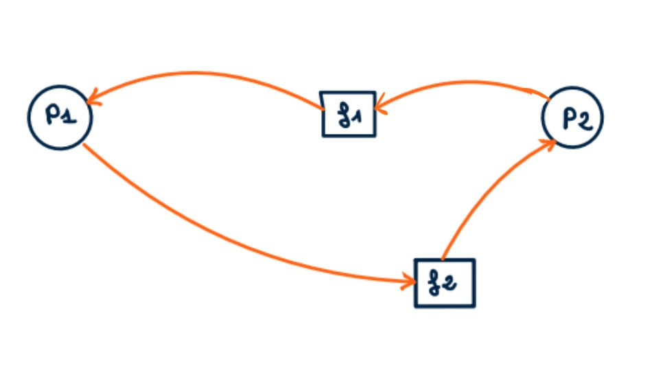{ .image width=70%}
    <div class="couleur_puce44">  
        
    * P1 demande et obtient le fichier_1. Il verrouille le fichier_1.
    * P2 demande et obtient le fichier_2 . Il verrouille le fichier_2.
    * P1 demande le fichier_2 mais ne peut pas l'obtenir car il est verrouillé par P2.
    <span style="display: block; margin: 3px 0 0 0;">⇒ P1 passe à l'état bloqué.</span>
    * P2 demande le fichier_1 mais ne peut pas l'obtenir car il est verrouillé par P1.
    <span style="display: block; margin: 3px 0 0 0;">⇒ P2 passe à l'état bloqué.</span>
    <span style="display: block; margin: 10px 0 0 -2.6em;">On a donc interblocage.</span>
    
    </div>

</div>
<div class="list1_6" markdown="1">

6. Proposer une modification du programme 2 permettant d'éviter ce problème.

</div>
<div class="decal3" markdown="1">

??? solution "Solution"
    
    Il suffit d'intervertir les deux premières lignes du Programme 2.
    <span style="display: block; margin: 8px 0 0 0;">Les deux programmes doivent alors commencer simultanément par Verrouiller fichier 1, ce qui n’est pas possible (exclusion mutuelle).</span>
    <span style="display: block; margin: 5px 0 0 0;">Nous avons donc deux possibilités :</span>
    <div class="couleur_puce44">

    * Si c’est le Programme 1 qui commence, P2 sera bloqué jusqu’à la fin de P1, après « dévérouillage de fichier1 ». Ils se feront donc l’un après l’autre, pas de problème.
    * Si c’est P2 qui commence, P1 est bloqué jusqu’à ce que P2 dévérouille f1. Il peut faire ses calculs sur f1, puis il est bloqué jusqu’à ce que P2 dévérouille f2. P2 a terminé, et P1 peut terminer.

    </div>

</div>
### <div class = "encadré_exo"> __Correction de l'exercice 5__ </div>  

Un système est composé de 4 périphériques, numérotés de 0 à 3, et d'une mémoire, reliés entre eux par un bus auquel est également connecté un dispositif ordonnanceur. À l'aide d'un signal spécifique envoyé sur le bus, l'ordonnanceur sollicite à tour de rôle les périphériques pour qu'ils indiquent le type d'opération (lecture ou écriture) qu'ils souhaitent effectuer, et l'adresse mémoire concernée.
<span style="display: block; margin: 8px 0 0 0;">Un tour a lieu quand les 4 périphériques ont été sollicités. __Au début d'un nouveau tour, on considère que toutes les adresses sont disponibles en lecture et écriture.__</span>
<div class="decal15" markdown="1">
<div class="couleur_puce14etoi" markdown="1">

* Si un périphérique demande l'écriture à une adresse mémoire à laquelle on n'a pas encore accédé pendant le tour, l'ordonnanceur répond <span class="code">"OK"</span> et l'écriture a lieu. Si on a déjà demandé la lecture ou l'écriture à cette adresse, l'ordonnanceur répond <span class="code">"ATT"</span> et l'opération n'a pas lieu.
* Si un périphérique demande la lecture à une adresse à laquelle on n'a pas encore accédé en écriture pendant le tour, l'ordonnanceur répond <span class="code">"OK"</span> et la lecture a lieu. Plusieurs lectures peuvent avoir donc lieu pendant le même tour à la même adresse.
* Si un périphérique demande la lecture à une adresse à laquelle on a déjà accédé en écriture, l'ordonnanceur répond <span class="code">"ATT"</span> et la lecture n'a pas lieu.
<span style="display: block; margin: 5px 0 0 0;">Ainsi, pendant un tour, une adresse peut être utilisée soit une seule fois en écriture, soit autant de fois qu'on veut en lecture, soit pas utilisée.</span>
* Si un périphérique ne peut pas effectuer une opération à une adresse, il demande la même opération à la même adresse au tour suivant.

</div>
</div>
<div class="list1_1" markdown="1">

1. Le tableau donné en annexe 1 indique, sur chaque ligne, le périphérique sélectionné, l'adresse à laquelle il souhaite accéder et l'opération à effectuer sur cette adresse. 
<span style="display: block; margin: 5px 0 0 0;">Compléter dans la dernière colonne de cette annexe, à rendre avec la copie, la réponse donnée par l'ordonnanceur pour chaque opération.</span>

</div>
<div class="decal3" markdown="1">

??? abstract "Annexe 1"
    <center markdown="1">

    | N° périphérique   |  Adresse   |  Opération  | Réponse de l'ordonnanceur|
    | :-----------: | :--------------: |  :-----------: | :-------------: | 
    |0 |  <span class="code">10</span> | écriture   | <span class="code">"OK"</span>|
    |1  | <span class="code">11</span>  |lecture |    <span class="code">"OK"</span>|
    |2  | <span class="code">10</span>  |lecture   |  <span class="code">"ATT"</span>|
    |3  | <span class="code">10</span>  |écriture |   <span class="code">"ATT"</span>|
    |0  | <span class="code">12</span> | lecture     ||
    |1  | <span class="code">10</span> | lecture     ||
    |2  | <span class="code">10</span> | lecture     ||
    |3  | <span class="code">10</span> |écriture||

    </center>

</div>
<div class="decal3" markdown="1">

??? solution "Solution"
    <center markdown="1">

    | N° périphérique   |  Adresse   |  Opération  | Réponse de l'ordonnanceur|
    | :-----------: | :--------------: |  :-----------: | :-------------: | 
    |0 |  <span class="code">10</span> | écriture   | <span class="code">"OK"</span>|
    |1  | <span class="code">11</span>  |lecture |    <span class="code">"OK"</span>|
    |2  | <span class="code">10</span>  |lecture   |  <span class="code">"ATT"</span>|
    |3  | <span class="code">10</span>  |écriture |   <span class="code">"ATT"</span>|
    |0  | <span class="code">12</span> | lecture     |<span class="code">"OK"</span>|
    |1  | <span class="code">10</span> | lecture     |<span class="code">"OK"</span>|
    |2  | <span class="code">10</span> | lecture     |<span class="code">"OK"</span>|
    |3  | <span class="code">10</span> |écriture|<span class="code">"ATT"</span>|

    </center>

</div>
On suppose dans toute la suite que :
<div class="decal3" markdown="1">
<div class="couleur_puce19" markdown="1">

* le périphérique 0 écrit systématiquement à l'adresse <span class="code">10</span> ;
* le périphérique 1 lit systématiquement à l'adresse <span class="code">10</span> ;
* le périphérique 2 écrit alternativement aux adresses <span class="code">11</span> et <span class="code">12</span> ;
* le périphérique 3 lit alternativement aux adresses <span class="code">11</span> et <span class="code">12</span>.

</div>
</div>
Pour les périphériques 2 et 3, le changement d'adresse n'est effectif que lorsque l'opération est réalisée.
<div class="list1_2" markdown="1">

2. On suppose que les périphériques sont sélectionnés à chaque tour dans l'ordre 0 ; 1 ; 2 ; 3. 
<span style="display: block; margin: 5px 0 0 0;">Expliquer ce qu'il se passe pour le périphérique 1.</span>

</div>
<div class="decal3" markdown="1">

??? solution "Solution"
    <div class="couleur_puce44">

    * À chaque début de tour, le périphérique 0 demande à écrire à l'adresse <span class="code">10</span> ; c'est accepté.
    * Juste après, le périphérique 1 demande à lire à l'adresse <span class="code">10</span> ; c'est refusé.
    <span style="display: block; margin: 10px 0 0 -2.6em;">Le périphérique 1 ne pourra jamais lire l'adresse <span class="code">10</span>.</span>

    </div>

</div>
Les périphériques sont sollicités de la manière suivante lors de quatre tours successifs :
<div class="decal3" markdown="1">
<div class="couleur_puce19" markdown="1">

* au premier tour, ils sont sollicités dans l'ordre 0 ; 1 ; 2 ; 3 ;
* au deuxième tour, dans l'ordre 1 ; 2 ; 3 ; 0 ;
* au troisième tour, 2 ; 3 ; 0 ; 1 ;
* puis 3 ; 0 ; 1 ; 2 au dernier tour.
* Et on recommence...

</div>
</div>
<div class="list1_3_a" markdown="1">

1. Préciser pour chacun de ces tours si le périphérique 0 peut écrire et si le périphérique 1 peut lire.

</div>
<div class="decal12" markdown="1">

??? solution "Solution"
    <div class="couleur_puce44">

    * __Tour 1__ : 0 ; 1 ; 2 ; 3
        <span style="display: block; margin: 5px 0 0 0;"><span style="color: rgb(255, 212, 107); margin: 0 15px 0 10px;">■</span> 0 peut écrire, puis</span>
        <span style="display: block; margin: 5px 0 0 0;"><span style="color: rgb(255, 212, 107); margin: 0 15px 0 10px;">■</span>1 ne peut pas lire</span>
    * __Tour 2__ : 1 ; 2 ; 3 ; 0
        <span style="display: block; margin: 5px 0 0 0;"><span style="color: rgb(255, 212, 107); margin: 0 15px 0 10px;">■</span>1 peut lire, puis</span>
        <span style="display: block; margin: 5px 0 0 0;"><span style="color: rgb(255, 212, 107); margin: 0 15px 0 10px;">■</span>0 ne peut pas écrire</span>
    * __Tour 3__ : 2 ; 3 ; 0 ; 1
        <span style="display: block; margin: 5px 0 0 0;"><span style="color: rgb(255, 212, 107); margin: 0 15px 0 10px;">■</span>0 peut écrire, puis</span>
        <span style="display: block; margin: 5px 0 0 0;"><span style="color: rgb(255, 212, 107); margin: 0 15px 0 10px;">■</span>1 ne peut pas lire</span>
    * __Tour 4__ : 3 ; 0 ; 1 ; 2
        <span style="display: block; margin: 5px 0 0 0;"><span style="color: rgb(255, 212, 107); margin: 0 15px 0 10px;">■</span>0 peut écrire, puis</span>
        <span style="display: block; margin: 5px 0 0 0;"><span style="color: rgb(255, 212, 107); margin: 0 15px 0 10px;">■</span>1 ne peut pas lire</span>

    </div>

</div>
<div class="list1_3_b" markdown="1">
2. En déduire la proportion des valeurs écrites par le périphérique 0 qui sont effectivement lues par le périphérique 1.

</div>
<div class="decal12" markdown="1">

??? solution "Solution"
    <div class="couleur_puce44">

    * Au tour 1, la valeur écrite par le périphérique 0 sera lue par le périphérique 1 au tour suivant.
    * Au tour 2, rien n'est écrit par le périphérique 0.
    * Au tour 3, la valeur écrite par le périphérique 0 __ne sera jamais__ lue par le périphérique 1 ; en effet, une autre écriture intervient avant la prochaine lecture.
    * Au tour 4, la valeur écrite par le périphérique 0 __ne sera jamais__ lue par le périphérique 1 ; en effet, une autre écriture intervient avant la prochaine lecture.
    <span style="display: block; margin: 10px 0 0 -2.6em;">Ainsi, une seule valeur sur trois sera effectivement lue. La proportion est $\displaystyle\frac{1}{3}$.</span>

    </div>

</div>
On change la méthode d'ordonnancement : on détermine l'ordre des périphériques au cours d'un tour à l'aide de deux listes d'attente <span class="code">ATT_L</span> et <span class="code">ATT_E</span> établies au tour précédent.
<span style="display: block; margin: 8px 0 0 0;">Au cours d'un tour, on place dans la liste <span class="code">ATT_L</span> toutes les opérations de lecture mises en attente, et dans la liste d'attente <span class="code">ATT_E</span> toutes les opérations d'écriture mises en attente.</span>
<span style="display: block; margin: 8px 0 0 0;">Au début du tour suivant, on établit l'ordre d'interrogation des périphériques en procédant ainsi :</span>
<div class="decal3" markdown="1">
<div class="couleur_puce19" markdown="1">

* on interroge ceux présents dans la liste <span class="code">ATT_L</span>, par ordre croissant d'adresse ;
* on interroge ensuite ceux présents dans la liste <span class="code">ATT_E</span>, par ordre croissant d'adresse ;
* puis on interroge les périphériques restants, par ordre croissant d'adresse.

</div>
</div>
<div class="list1_4" markdown="1">

4. Compléter et rendre avec la copie le tableau fourni en annexe 2, en utilisant l'ordonnancement décrit ci-dessus, sur 3 tours.

</div>

??? abstract "Annexe 2"
    <center markdown="1">

    |<span style="font-size: 0.8rem;">Tour</span>    |<span style="font-size: 0.8rem;">N° périphérique</span>   |  <span style="font-size: 0.8rem;">Adresse</span>  |   <span style="font-size: 0.8rem;">Opération</span>|   <span style="font-size: 0.8rem;">Réponse ordonnanceur</span> |   <span style="font-size: 0.8rem;"><span class="code1">ATT_L</span></span>  | <span style="font-size: 0.8rem;"><span class="code1">ATT_E</span></span>|
    | :-------: | :----------: | :---------: | :--------: |  :-------: | :-------: | :-------: | 
    |1  | 0   |<span class="code">10</span>  |écriture  |  <span class="code">"OK"</span>   | vide    |vide|
    |1  | 1  | <span class="code">10</span>  |lecture    | <span class="code">"ATT"</span>  | <span class="code">(1, 10)</span>   |  vide|
    |1 |  2  | <span class="code">11</span>  |écriture  |        |  ||
    |1  | 3  | <span class="code">11</span> | lecture   |        |  ||
    |2  | 1 |  <span class="code">10</span> | lecture   |    |  |    vide|
    |2  |   |     |          |   |||
    |2 |    |    |            |  |||
    |2  |   |    |            |  |||
    |3  | 0 |  <span class="code">10</span> | écriture   |   |  vide  |  vide|
    |3  | 1  | <span class="code">10</span> | lecture    |  |     | vide|
    |3  | 2  | <span class="code">11</span> | écriture  |  <span class="code">"OK"</span> | <span class="code">(1, 10)</span>  |   vide|
    |3  | 3  | <span class="code">12</span> | lecture   |     |  |   |

    </center>

??? solution "Solution"
    <center markdown="1">

    |<span style="font-size: 0.8rem;">Tour</span>    |<span style="font-size: 0.8rem;">N° périphérique</span>   |  <span style="font-size: 0.8rem;">Adresse</span>  |   <span style="font-size: 0.8rem;">Opération</span>|   <span style="font-size: 0.8rem;">Réponse ordonnanceur</span> |   <span style="font-size: 0.8rem;"><span class="code1">ATT_L</span></span>  | <span style="font-size: 0.8rem;"><span class="code1">ATT_E</span></span>|
    | :-------: | :----------: | :---------: | :--------: |  :-------: | :-------: | :-------: | 
    |1  | 0   |<span class="code">10</span>  |écriture  |  <span class="code">"OK"</span>   | vide    |vide|
    |1  | 1  | <span class="code">10</span>  |lecture    | <span class="code">"ATT"</span>  | <span class="code">(1, 10)</span>   |  vide|
    |1 |  2  | <span class="code">11</span>  |écriture  |   <span class="code">"OK"</span>      | <span class="code">(1, 10)</span> | vide|
    |1  | 3  | <span class="code">11</span> | lecture   |   <span class="code">"ATT"</span>     | <span class="code">(1, 10)</span><br> <span class="code">(3, 11)</span> | vide|
    |2  | 1 |  <span class="code">10</span> | lecture   | <span class="code">"OK"</span>   | <span class="code">(3, 11)</span> |    vide|
    |2  |  3 |   <span class="code">11</span>  |     lecture     |  <span class="code">"OK"</span> |vide|vide|
    |2 |  0  |  <span class="code">10</span>  |  écriture          | <span class="code">"ATT"</span>  |vide|<span class="code">(0, 10)</span>|
    |2  | 2  | <span class="code">12</span>   |     écriture       | <span class="code">"OK"</span> |vide|<span class="code">(0, 10)</span>|
    |3  | 0 |  <span class="code">10</span> | écriture   | <span class="code">"OK"</span>  |  vide  |  vide|
    |3  | 1  | <span class="code">10</span> | lecture    |<span class="code">"ATT"</span>  |  <span class="code">(1, 10)</span>   | vide|
    |3  | 2  | <span class="code">11</span> | écriture  |  <span class="code">"OK"</span> | <span class="code">(1, 10)</span>  |   vide|
    |3  | 3  | <span class="code">12</span> | lecture   |   <span class="code">"OK"</span>   |  <span class="code">(1, 10)</span>|vide   |

    </center>

Les colonnes __e0__ et __e1__ du tableau suivant recensent les deux chiffres de l'écriture binaire de l'entier __n__ de la première colonne.
<center markdown="1">

|nombre n   | écriture binaire de n sur deux bits  |   e1 | e0|
| :-------: | :----------: | :---------: | :--------: |
|0 |  00 | 0|   0|
|1 |  01 | 0  | 1|
|2 |  10|  1  | 0|
|3  | 11|  1  | 1|

</center>
L'ordonnanceur attribue à deux signaux sur le bus de données les valeurs de __e0__ et __e1__ associées au numéro du circuit qu'il veut sélectionner. On souhaite construire à l'aide des portes ET, OU et NON un circuit pour chaque périphérique.
<span style="display: block; margin: 5px 0 0 0;">Chacun des quatre circuits à construire prend en entrée deux signaux __e0__ et __e1__, le signal de sortie __s__ valant 1 uniquement lorsque les niveaux de __e0__ et __e1__ correspondent aux bits de l'écriture en binaire du numéro du périphérique correspondant.</span>

Par exemple, le circuit ci-dessous réalise la sélection du périphérique 3. En effet, le signal __s__ vaut 1 si et seulement si __e0__ et __e1__ valent tous les deux 1.

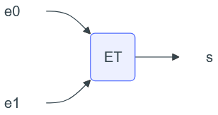{ .image }
<div class="list1_5_a" markdown="1">

1. Recopier sur la copie et indiquer dans le circuit ci-dessous les entrées __e0__ et __e1__ de façon que ce circuit sélectionne le périphérique 1.
<span style="display: block; margin: 5px 0 0 0;">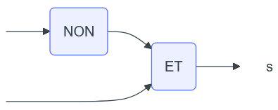{ .image }</span>

</div>
<div class="decal12" markdown="1">

??? solution "Solution"
    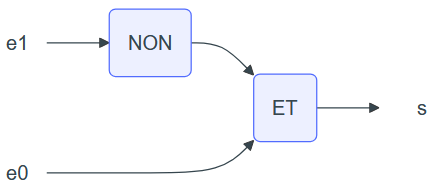{ .image }

</div>
<div class="list1_5_b" markdown="1">

2. Dessiner un circuit constitué d'une porte ET et d'une porte NON, qui sélectionne le périphérique 2.

</div>
<div class="decal12" markdown="1">

??? solution "Solution"
    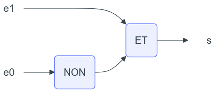{ .image }

</div>
<div class="list1_5_c" markdown="1">

3. Dessiner un circuit permettant de sélectionner le périphérique 0.

</div>
<div class="decal12" markdown="1">

??? solution "Solution"
    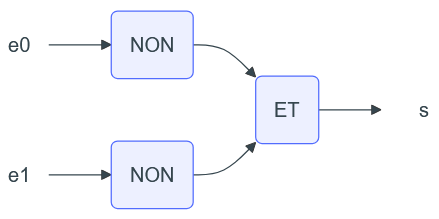{ .image }

</div>

### <div class = "encadré_exo"> __Correction de l'exercice 6__ </div>

Nous étudions quatre processus A, B, C et D qui utilisent des ressources suivantes :
<div class="couleur_puce19" markdown="1">

* un fichier commun aux processus ;
* le clavier de l’ordinateur ;
* le processeur graphique (GPU) ;
* le port 25000 de la connexion Internet.

</div>
Voici le détail de ce que fait chaque processus :
<center markdown="1">

|A  | B |  C|   D|
| :-------: | :----------: | :---------: | :--------: |
|acquérir le GPU   |  acquérir le clavier   |  acquérir le port |  acquérir le fichier|
|faire des calculs  | acquérir le fichier |    faire des calculs |  faire des calculs|
|libérer le GPU | libérer le clavier | libérer le port   |  acquérir le clavier|
  | | libérer le fichier |    |   libérer le clavier|
  |   |  |   |  libérer le fichier|

</center>
On a le chronogramme suivant : 

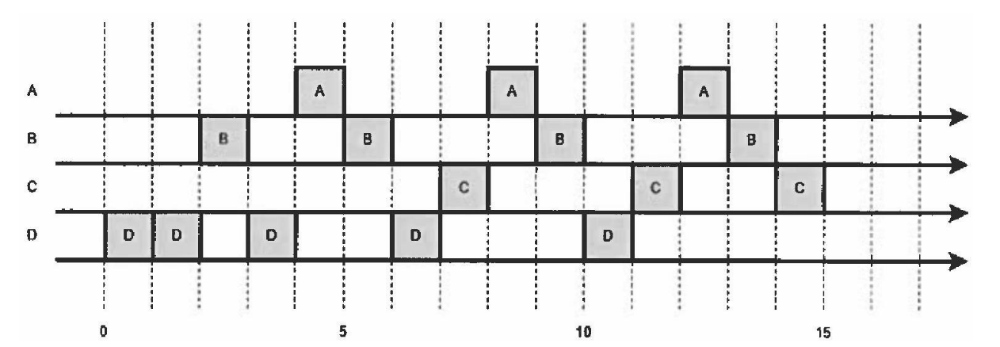{ .image width=80%}

Montrer que l’ordre d’exécution donné aboutit à une situation d’interblocage.

??? solution "Solution"
    <div class="couleur_puce44">

    * Le processus D demande et obtient la ressource fichier qui était libre.
    * Le processus B demande et obtient la ressource clavier qui était libre.
    * Le processus B demande la ressource fichier qui n'est pas disponible car détenue par le processus D. Il passe à l'état bloqué.
    * Le processus D demande la ressource clavier qui n'est pas disponible car détenue par le processus B. Il passe à l'état bloqué.

    </div>
    Les deux procesus B et D sont bloqués, on est en situation d'interblocage.
    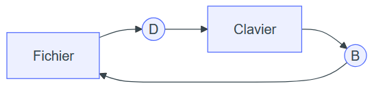{ .image }

### <div class = "encadré_exo"> __Correction de l'exercice 7__ </div>
<div class = "list1_1" markdown="1">

1.  
```python
import threading

verrouLED = {}
for elt in ['A', 'B', 'C']:
    verrouLED[elt] = threading.Lock()

def acquerirLED(nom):
    verrouLED[nom].acquire()

def rendreLED(nom):
    verrouLED[nom].release()

def prog(n, LEDPrim, LEDSec):
    while True :
        acquerirLED(LEDPrim)
        print(f'Acquisition de {LEDPrim} par le programme {n}')
        acquerirLED(LEDSec)
        print(f'Acquisition de {LEDSec} par le programme {n}')
        print(f'Configuration de {LEDPrim}, de {LEDSec} et envoi du signal')
        rendreLED(LEDSec)
        rendreLED(LEDPrim)

p1 = threading.Thread(target = prog, args = [1, 'A', 'B'])
p2 = threading.Thread(target = prog, args = [2, 'B', 'C'])
p3 = threading.Thread(target = prog, args = [3, 'C', 'A'])

p1.start()
p2.start()
p3.start()

```
2. Voici un affichage possible, montrant que le programme bloque :
```pycon
>>> (executing file "Correction_ex_4.py")
Acquisition de A par le programme 1
Acquisition de B par le programme 1
Configuration de A, de B et envoi du signal
Acquisition de A par le programme 1
Acquisition de B par le programme 1
Configuration de A, de B et envoi du signal
Acquisition de A par le programme 1
Acquisition de B par le programme 1
Configuration de A, de B et envoi du signal
Acquisition de A par le programme 1
Acquisition de B par le programme 1
Configuration de A, de B et envoi du signal
Acquisition de A par le programme 1
Acquisition de B par le programme 1
Configuration de A, de B et envoi du signal
Acquisition de A par le programme 1
Acquisition de B par le programme 1
Configuration de A, de B et envoi du signal
Acquisition de A par le programme 1
Acquisition de B par le programme 1
Configuration de A, de B et envoi du signal
Acquisition de A par le programme 1
Acquisition de B par le programme 1
Configuration de A, de B et envoi du signal
Acquisition de A par le programme 1
Acquisition de B par le programme 1
Configuration de A, de B et envoi du signal
Acquisition de A par le programme 1
Acquisition de B par le programme 1
Configuration de A, de B et envoi du signal
Acquisition de A par le programme 1
Acquisition de B par le programme 1
Configuration de A, de B et envoi du signal
Acquisition de A par le programme 1
Acquisition de B par le programme 2
Acquisition de C par le programme 2
Configuration de B, de C et envoi du signal
Acquisition de B par le programme 2

>>> 
```

</div>