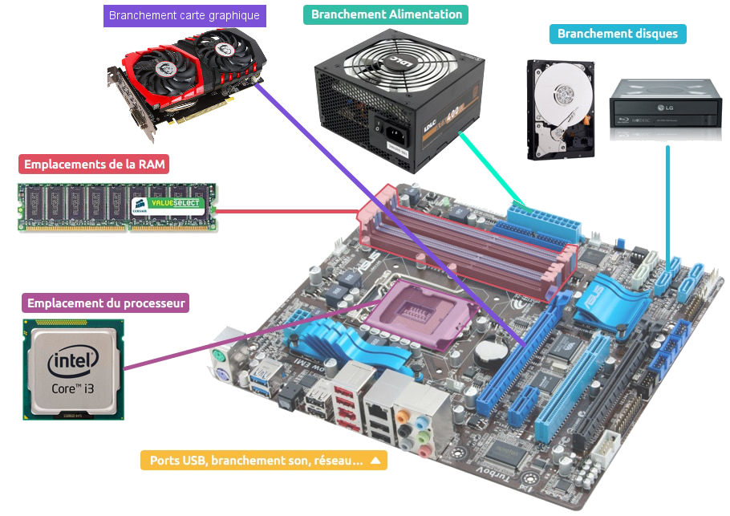
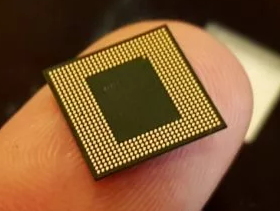
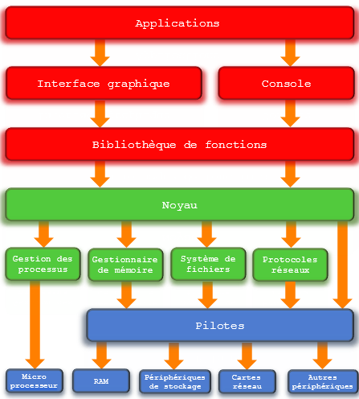
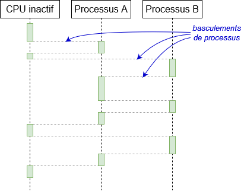
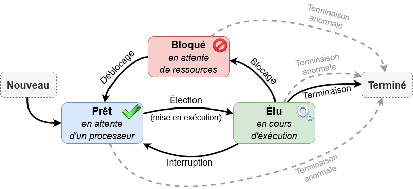
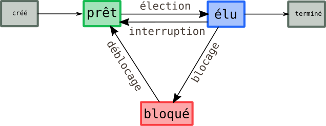
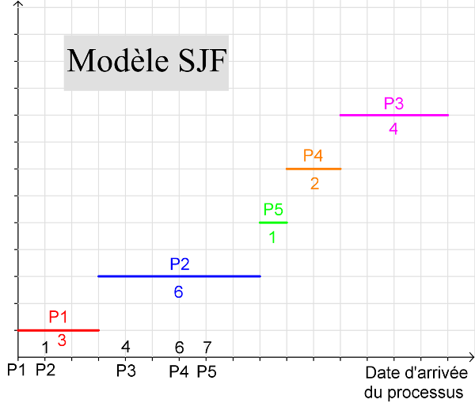
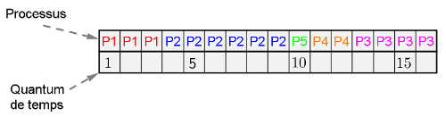
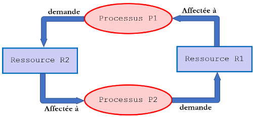
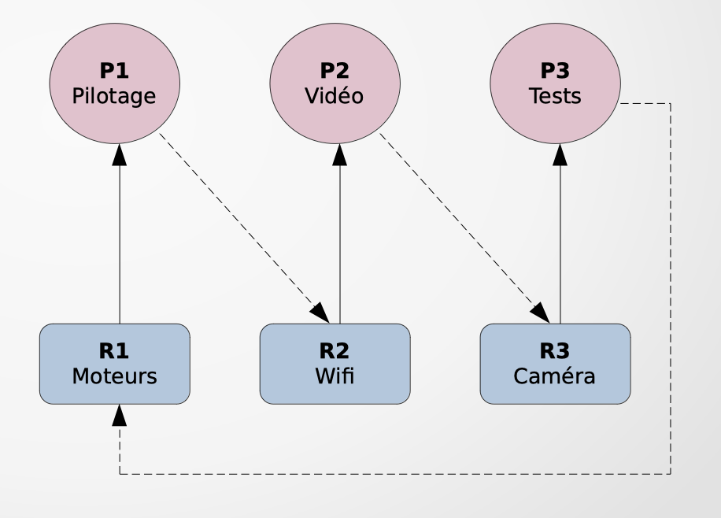

# <center><div class = "titre1">Architectures matérielles & Systèmes d'exploitation</div></center>

## <div class = "encadré2">__Un peu d'histoire__</div>
Du premier processeur, ouvrant la voie à l'informatique, aux récents microprocesseurs et aux systèmes d'exploitation mobiles, l'histoire a été rapide. Elle est retracée ci-dessous en quelques dates clés :
<span style="display: block; margin: 20px 0 0 0;"></span>

<span style="display: block; margin: 20px 0 0 0;"></span>
<center markdown="1">
<a href="https://www.timetoast.com/timelines/2431196" target="_blank">Cliquer ici pour voir cette frise chronologique</a>
</center>

## <div class = "encadré2"> __Système sur puce__ </div>

### <div class = "encadré3">De l’ordinateur au smartphone / tablette</div>

Au sein d’__un ordinateur "classique"__ tel qu’un PC de bureau, les choses sont assez simples.  
<div class = "couleur_puce17etoi" markdown = "1">

* __Le processeur (ou CPU – Central Processing Unit)__ se charge de réaliser les calculs les plus répandus, ceux qui permettent par exemple de faire tourner le système d’exploitation ou un navigateur web.
<span style="display: block; margin: 8px 0 0 0;">Aujourd'hui, on parle plutôt de microprocesseur car sa taille miniaturisée lui permet d'être intégré à n'importe quel élément numérique actuel.</span>

</div>
<div class="decal1" markdown="1">

??? notes1 "__Pour aller plus loin__"
    Au niveau technique, le microprocesseur est un __circuit electronique__ intégré qui effectue des __opérations__. Sa taille est de plus en plus réduite.  
    <span style="display: block; margin: 8px 0 0 0;">Les opérations qu'est capable d'effectuer un microprocesseur sont son __jeu d'instructions__.</span>
    <span style="display: block; margin: 8px 0 0 0;">La __vitesse__ d'un microprocesseur est définie par son __horloge__ : l'horloge fournit le rythme des tâches élémentaires effectuées, en __Hz__ (nombres de pulsations par seconde).</span>

    !!! a-retenir "Concept"
        La rapidité à effectuer des instructions par un microprocesseur s'exprime en __MIPS__ (<span class="gras">M</span>illions d'<span class="gras">I</span>nstructions <span class="gras">P</span>ar <span class="gras">S</span>econde).

    Historiquement, deux familles de microprocesseurs sont disponibles sur le marché, mais basées sur des fonctionnements opposés :
    
    === "Les processeurs __RISC__"
        Les processeurs __RISC__ (*<b>R</b>educed <b>I</b>nstruction <b>S</b>et <b>C</b>omputer*) proposent un nombre restreint d'instructions, qu'il est possible d'effectuer efficacement et très rapidement.
    === "Les processeurs __CISC__" 
        Les processeurs __CISC__ (*<b>C</b>omplex <b>I</b>nstruction <b>S</b>et <b>C</b>omputer*) disposent d'un nombre d'instructions plus important et plus élaborés, mais sont donc moins rapides pour effectuer ces instructions.

    Le choix du processeur selon le besoin a donc une importance, mais notons que les dernières évolutions en termes de rapidité permettent de créer des __RISC__ très puissants dont l'utilisation peut être comparée à celle des __CISC__, rendant la spécificité de chaque famille moins évidente.

</div>
<div class = "couleur_puce17etoi" markdown = "1">

* __La mémoire vive (RAM – Random Access Memory)__ permet d’enregistrer temporairement les données traitées par le processeur.  

</div>
<div class="decal1" markdown="1">

??? notes1 "__Pour aller plus loin__"
    Lorsque l'on parle de mémoire, généralement on parle de mémoire RAM.  
    Cependant, les ordinateurs ont d'autres types de mémoires qui ne sont généralement pas connus.  
    === "__Mémoire cache du processeur__"
        Le processeur d'un ordinateur possède une mémoire cache d'une certaine quantité selon le type de processeur.
        <span style="display: block; margin: 8px 0 0 0;">Plus le processeur est puissant, plus le cache est important.</span>
        <span style="display: block; margin: 8px 0 0 0;">Le cache sert à stocker des informations redondantes afin d'éviter au processeur de devoir chercher ces dernières dans la mémoire RAM. En effet, la mémoire cache du processeur est beaucoup plus rapide à transmettre les informations que la mémoire RAM qui se "trouve plus loin" dans l'ordinateur.</span>

    === "__Mémoire morte ou ROM__"  
        La mémoire morte ou en anglais __ROM (Read Only Memory)__ est une mémoire en lecture seule, on ne peut donc pas écrire dans celle-ci.
        <span style="display: block; margin: 8px 0 0 0;">C'est donc une mémoire prévue pour être lues plusieurs fois et non modifiées.</span>
        <span style="display: block; margin: 8px 0 0 0;">Dans un ordinateur, on trouve de la mémoire morte dans le __BIOS__ de l'ordinateur où sont stockées des informations nécessaires au démarrage de l'ordinateur (instructions de démarrage, etc).</span>
        <span style="display: block; margin: 8px 0 0 0;">Il existe plusieurs types de mémoire morte dont UVPROM, les PROM, les EPROM et les EEPROM.  
        Certaines peuvent être re-programmables comme EPROM et EEPRO.</span>

    === "__Mémoire flash__"  
        La mémoire flash a grosso-modo les mêmes caractéristiques que la mémoire RAM à la différence qu'une coupure électrique ne fait pas perdre les données. 
        <span style="display: block; margin: 8px 0 0 0;">On trouve plusieurs utilisation de cette mémoire flash comme les cartes mémoires ou les disques SD qui sont des disques électroniques et qui remplacent les disques HDD qui eux, sont des disques mécaniques.</span>

</div>
!!! a-retenir "__Principe de base__"
    En utilisant les deux éléments précédents, un principe de base permet l'activité numérique : tout programme est une suite d'opérations simples qui ont toutes la même forme :
    <div class="list22_1">

    1. __Une instruction élémentaire à effectuer est chargée de la mémoire sur le processeur__.
    2. __Les opérandes (données sur lesquelles va être fait le calcul) sont chargées de la mémoire sur le processeur__.
    3. __Le calcul de l'opération élémentaire est effectué__.
    4. __Le résultat de l'opération est stocké en mémoire__. 
    </div>
    {: .image}

On trouve aussi __la carte graphique (ou GPU – Graphics Processing Unit)__ qui se charge d’afficher une image, qu’elle soit en 2D ou bien en 3D comme dans les jeux. __La carte-mère__ relie entre eux tous les composants, le CPU, le GPU, mais également la RAM et d’autres cartes additionnelles et petites puces.

{: .image}
<center markdown="1">

*Composants d'une carte mère*
</center>

Mais depuis le début de l’__ère des smartphones__, on assiste à l’émergence de __systèmes tout-en-un__. Ainsi, presque tout le contenu d’un ordinateur se retrouve finalement dans une seule puce sur le smartphone : __le System on a Chip (SoC)__, ou __système sur une puce__ en français.
<span style="display: block; margin: 8px 0 0 0;">C'est un circuit intégré essentiel au fonctionnement des objets connectés et des smartphones.</span>

### <div class = "encadré3">Les SoCs</div>

??? video2 "Vidéo"
    Cette vidéo en anglais vous décrit la conception d'un SoC (Pensez à activer les sous-titre dans le menu paramètre si vous en avez besoin).

    

!!! book "__Définition__"
    Un "__système sur une puce__", souvent désigné dans la littérature scientifique par le terme anglais "*system on a chip*" (d'où son abréviation __SoC__), est un système complet embarqué sur une seule puce ("circuit intégré").  
    <div></div>
    {: .image}  
    <div></div>
    Un __SoC__ comprend à la fois :
    <div class="couleur_puce12">

    * Le processeur central à un ou plusieurs coeurs de calcul. 
    * Un processeur graphique.
    * La mémoire vive.
    * La mémoire statique (Rom, Flash, EPROM).
    * Les puces de communications (Bluetooth, WiFi, 2G/3G/4G, LoRa…).
    * Les capteurs nécessaires au fonctionnement d’un smartphone ou d’un objet connecté.
    * ...

    </div>
    En clair, le système sur une puce comprend tous les éléments essentiels d’un ordinateur comprimé dans une forme réduite. Son faible encombrement, son caractère complet et sa faible consommation d’énergie en font un circuit intégré idéal pour les applications mobiles, notamment l’<a href="https://fr.wikipedia.org/wiki/Internet_des_objets" target="_blank">IoT</a>. 

#### <div class = "encadré4">Composition d'un SoC</div>
{: .image}
<center markdown="1">

*Architecture simplifiée du SoC Kirin-970 - Huawei*
</center>
<div class="couleur_puce18carré" markdown="1">

* __Le processeur (CPU)__  
<span style="display: block; margin: 8px 0 0 0;">Le __processeur__ ou « <span class="gras">C</span>entral <span class="gras">P</span>rocessing <span class="gras">U</span>nit » (__CPU__) est le coeur du __SoC__. Son fonctionnement est identique à celui d’un ordinateur. On y retrouve donc plusieurs __coeurs__ cadencés à différentes __fréquences__ effectuant des __threads__ et stockant des informations en __cache__.</span>

</div>
<div class="decal3" markdown="1">
<div class="couleur_puce18" markdown="1">

* __Les coeurs__  
<span style="display: block; margin: 8px 0 0 0;">Un processeur compte généralement plusieurs coeurs, on parle couramment dans la littérature technique de dual-core, quad-core ou d’octo-core parfois (c'est le cas de l'exemple ci-dessus). Ainsi, ces processeurs se composent respectivement de deux, quatre ou huit coeurs. Ceux-ci permettent de lancer en parallèle plusieurs applications de manière simultanée (multitâche) et permettent l’utilisation d’applications lourdes comme des jeux.</span>

</div>
{: .image}
<center markdown="1">

*En jaune, les huit coeurs CPU*
</center>
<div class="couleur_puce18" markdown="1">

* __La fréquence__  
<span style="display: block; margin: 8px 0 0 0;">La fréquence d’un processeur est le nombre de cycles de calculs qu’il peut effectuer chaque seconde. Elle va donc naturellement déterminer la durée d’exécution d’une tâche : plus la fréquence du processeur est élevée, plus l’exécution d’une tâche est rapide. Mesurée en gigahertz (GHz), celle-ci est souvent différente entre chaque coeurs.</span>
* __Les threads__  
<span style="display: block; margin: 8px 0 0 0;">Les coeurs réalisent ce qu’on appelle un thread, littéralement un __fil d’exécution__, une tâche qui doit être réalisée par le processeur.</span>
* __Le cache__  
<span style="display: block; margin: 8px 0 0 0;">C’est une petite mémoire rapide intégrée au processeur. En effet, celle-ci va permettre de __stocker les informations récurrentes__ au plus près du processeur pour éviter d’avoir à aller les chercher sans arrêt dans la RAM.</span>

</div>
</div>
<div class="couleur_puce18carré" markdown="1">

* __La puce graphique (GPU)__  
<span style="margin-left: 0.1em; display:block;">__La puce graphique__ ou « <span class="gras">G</span>raphics <span class="gras">P</span>rocessing <span class="gras">U</span>nit » (__GPU__) est un élément crucial pour les gamers, car c’est lui qui est en charge de calculer les images afin de pouvoir les afficher à l’écran. Celle-ci prend ainsi en charge les images en 2D et en 3D que ce soit une page web, une vidéo ou encore une partie endiablée de votre jeu favori. Une carte graphique doit donc réaliser un nombre élevé de tâches, puisqu’elle doit par exemple calculer la __couleur à afficher__ sur chaque pixel de l’écran de votre smartphone.  
Par exemple dans le cas d’une image Full HD (1920×1080), le __GPU__ affiche 2 073 600 pixels différents ou 8 294 400 pixels pour de l’Ultra HD (3840×2160). Rappelons également que ce calcul est fait selon la __fréquence de rafraichissement__ de l’écran. Celle-ci peut par exemple varier entre 60 et 120 fois par secondes c’est-à-dire entre 60 Hz et 120 Hz.</span>
* __La puce neuronale (NPU)__  
<span style="margin-left: 0.1em; display:block;">__La puce neuronale__ ou « <span class="gras">N</span>euronal <span class="gras">P</span>rocessing <span class="gras">U</span>nit » (__NPU__) est une puce en charge de l'<span class="gras">intelligence artificielle</span> des smartphones. Les calculs de l’intelligence artificielle ont longtemps été faits par le biais de serveurs dans le cloud (distant). Néanmoins, depuis quelques années pour des raisons de __rapidité__ et de __respect de la vie privée__, les calculs se font désormais directement sur les smartphones. C’est utile par exemple dans « Google Translate » pour reconnaître des caractères, pour optimiser les photos ou encore l’autonomie.</span>
* __Le modem (Interface)__  
<span style="margin-left: 0.1em; display:block;">Les smartphones embarquent également dans le __SoC__ une unité réseau assurant la prise en charge des différents protocoles de communication. Cette unité est la partie la plus compliquée à développer et à implémenter sur un __SoC__. Néanmoins, il s’agit d’un élément crucial afin d’assurer le nomadisme d’un smartphone en itinérance. Le modem intégré au __SoC__ gère non seulement le __Wifi__, le __Bluetooth__, le __NFC__ ou bien encore les __technologies mobiles__. C’est-à-dire la __4G__, ou plus récemment la __5G__ mais également de plus vieux réseaux tels que la __3G__.</span> 
* __Le processeur de signal numérique (DSP)__ 
<span style="margin-left: 0.1em; display:block;">__Le processeur de signal numérique__ ou « <span class="gras">D</span>igital <span class="gras">S</span>ignal <span class="gras">P</span>rocessor » (__DSP__) est en charge de __traiter les signaux numériques__. Ainsi, il va permettre le filtrage, la compression ou encore l’extraction de différents signaux tels que la musique ou encore une vidéo.</span> 
* __Le processeur de signal d’images (ISP)__  
<span style="margin-left: 0.1em; display:block;">__Le processeur d’image__ ou « <span class="gras">I</span>mage <span class="gras">S</span>ignal <span class="gras">P</span>rocessor » (__ISP__) est une puce prenant en charge la __création d’images numériques__. En effet de par leurs tailles minuscules, les __capteurs photo__ des smartphones ne sont pas de très bonne qualité d’un point de vue de l’optique pure. La qualité qu’il est actuellement possible d’obtenir va être intimement liée à cette puce qui va compenser logiquement certaines limitations optiques (zoom numérique …).</span> 
* __Le processeur de sécurité (SPU)__  
<span style="margin-left: 0.1em; display:block;">__Le processeur de sécurité__ ou « <span class="gras">S</span>ecure <span class="gras">P</span>rocessing <span class="gras">U</span>nit » (__SPU__) est le « __bouclier__ » du smartphone. Son alimentation électrique est indépendante afin de ne pas pouvoir être éteint en cas d’attaque sur celui-ci. Le SPU est d’une importance capitale. En effet celui-ci va stocker les données __biométriques__, __bancaires__, la __carte SIM__ ou encore les __titres de transport__. C’est lui qui contient les clés de chiffrement des données de l’utilisateur.</span>
* __La mémoire LPDDR__  
<span style="margin-left: 0.1em; display:block;">__La mémoire LPDDR__ ou « <span class="gras">L</span>ow <span class="gras">P</span>ower <span class="gras">D</span>ouble <span class="gras">D</span>ata <span class="gras">R</span>ate », littéralement : « Vitesse de données double à faible consommation », est un type de mémoire, reprenant la technologie DDR SDRAM, en l'adaptant aux périphériques mobiles (smartphone, ordinateur portable…), via des technologies d'économie d'énergie.</span>
* __La mémoire flash__  
<span style="margin-left: 0.1em; display:block;">l'__UFS__ ou « <span class="gras">U</span>niversal <span class="gras">F</span>lash <span class="gras">S</span>torage » est une spécification de mémoire flash pour les appareils photos numériques, les téléphones mobiles et autres appareils numériques. Elle a pour objectif d'améliorer la vitesse de transfert et la fiabilité du stockage en mémoire flash tout en éliminant la diversité des connecteurs.
</span>

</div>

#### <div class = "encadré4">Les avantages d’un SoC par rapport à un système classique</div>

Outre leur taille miniaturisée bien adaptée aux terminaux nomades (smartphones et tablettes), les SoC offrent d'autres avantages par rapport aux systèmes "classiques" rencontrés dans les ordinateurs : 
<div class="couleur_puce18etoi" markdown="1">

* les SoC sont conçus pour consommer beaucoup moins d'énergie qu'un système classique à puissance équivalente de calculs.
* Cette consommation réduite d’énergie permet dans la plupart des cas de s'affranchir de la présence d’un système de refroidissement actif comme les ventilateurs ou de type « watercooling ». Un système équipé de SoC est donc silencieux car il chauffe relativement peu.
* Etant donné les distances très faibles entre, par exemple, le CPU et la mémoire, les données circulent beaucoup plus vites, ce qui permet d'améliorer grandement les performances ; en effet, dans les systèmes "classiques" les BUS chargés d’acheminer les données sont souvent des "goulots d'étranglement" en termes de performances à cause de la vitesse limitée de circulation des données.

</div>
Pour arriver à de bonnes performances en ménageant la consommation d’un processeur, il est possible de jouer sur __plusieurs facteurs__ : __la fréquence__ du processeur, __le type de coeur__ au sein du processeur, ainsi que le __procédé de gravure__.  
<center markdown="1">
<div class="encadré4_soc" markdown="1">
La fréquence
</div>

</center>
La __fréquence de fonctionnement__ est un facteur important dans la consommation d’un processeur, mais trop la baisser a de sérieuses conséquences sur ses performances. On trouve actuellement des puces dotées d’une fréquence de fonctionnement comprise entre 1,3 et 3 GHz environ.
<br>  
<center markdown="1">
<div class="encadré4_soc">
Les coeurs
</div>
</center>

Le __type de coeurs__ au sein du processeur a également son rôle à jouer. Ainsi par exemple un coeur __Cortex-A53 consomme beaucoup moins qu’un coeur Cortex-A72__, mais ne fournit absolument pas le même niveau de performance. Si le premier est spécialement conçu pour consommer extrêmement peu d’énergie, le second est plus porté vers la performance, mais consomme beaucoup plus. C’est pour cette raison que les Cortex-A53 sont souvent utilisés par quatre ou huit, tandis que le Cortex-A72 est plus souvent utilisé par deux ou quatre coeurs. __On trouve alors souvent des configurations hybrides__ faisant appel à des coeurs haute performance pour les tâches lourdes (telles que jeux 3D) en combinaison avec des coeurs très basse consommation (pour relever des mails par exemple).
<center markdown="1">
<div class="encadré4_soc">
La gravure
</div>
</center>

Enfin de __nouveaux procédés de gravure__ sont également un facteur crucial dans le domaine des SoC pour offrir de bonnes performances avec une faible consommation. Il permet d’obtenir une amélioration des performances (en augmentant le nombre de transistors) tout en limitant l’augmentation de la taille de la puce ainsi que sa consommation électrique.  
<span style="display: block; margin: 8px 0 0 0;">
Les nouveaux procédés de gravure des semi-conducteurs CMOS telle que la __lithographie extrême ultraviolette__, ont permis de réduire significativement la taille des composants électroniques constituants les __SoC__. Ainsi, on dispose aujourd’hui de la même puissance dans un smartphone que celle embarquée dans un ordinateur il y a quelques années de cela. Ceci s’est cependant fait au prix d’une complexité technologique croissante. L’actuelle génération de __SoC__ est gravée en __3 nm__ (1 nm = 10<sup>-9</sup> m) depuis 2023. La prochaine génération gravée en 2 nm devait voir le jour en 2026.    
Pour les derniers modèles de smartphones, la principale difficulté technologique a été d’intégrer aux SoC les modems 5G qui sont complexes à fabriquer.</span>
<span style="display: block; margin: 8px 0 0 0;">La finesse de gravure des puces utilisées par l'industrie technologique est une donnée importante souvent associée (à tort) à de meilleures performances. En réduisant la taille des transistors, on peut tout simplement en mettre plus sur une même surface. Les puces ainsi produites peuvent effectuer plus de calculs sans consommer d'énergie supplémentaire. En réalité, chaque constructeur emploie des procédés qui diffèrent et ce n'est pas nécessairement la taille qui compte.</span>
<span style="display: block; margin: 8px 0 0 0;">En effet, pour une même finesse de gravure, la densité de transistors intégrés à une puce peut largement varier. Par exemple, la densité des processeurs Intel gravés en 10 nm est d'environ 106 MT/mm² (106 millions de transistors par mm²), alors que celle des processeurs TSMC gravés en 7 nm est de 97 MT/mm² seulement. La densité de transistors prime donc sur leur finesse comme le montre le comparatif suivant :</span>

{ .image}

??? video1 "Bonus"
    En bonus, une vidéo très intéressante sur la société *Taiwan Semiconductor Manufacturing Co* (*TSMC*), leader mondial des semi-conducteurs :
    <center markdown="1">
    <span style="display: block; margin: 20px 0 20px 0;">
    
    </span>
    </center>

#### <div class = "encadré4">Quelques familles de SoC utilisées dans les smartphones</div>

Nous avons vu précédemment que la liste de toutes les instructions qu'un processeur peut exécuter s'appelle __son jeu d'instructions__. Celui-ci définit les instructions supportées, ainsi que la manière dont elles sont encodées en mémoire.

Suivant les fabricants et les besoins, il existe plusieurs architectures, c'est-à-dire plusieurs jeux d'instructions. Deux d’entre elles prennent place dans la grande majorité des produits électroniques conçus ces vingt dernières années.
<center markdown="1">
<div class="encadré4_soc">
L’architecture X86
</div>
</center>

Voici l’architecture la plus répandue dans le monde. Conçue par __Intel__, elle est utilisée commercialement depuis 1978. Cette architecture a permis de développer les processeurs des ordinateurs, des serveurs ou encore de certaines tablettes. Cependant, l’architecture __X86__ est beaucoup moins utilisée pour développer les modèles d’un système sur puce IoT. 
<center markdown="1">
<div class="encadré4_soc">
L’architecture ARM
</div>
</center>

Conçu par la société du même nom, l’architecture __ARM__ a été développée en interne à la fin des années 1980. C’est en 1987 qu’elle est la première fois utilisée dans la gamme d’ordinateurs 32 Bits Archimede. L’architecture __ARM__ ne dépend pas d’un seul fabricant. Le modèle économique de l’entreprise repose sur la vente de licences à d’autres fabricants. Les SoC d’ARM se retrouvent ainsi dans la plupart des smartphones et des objets connectés.

Au sein de la génération actuelle de smartphones, on trouve une grande variété de SoC en fonction des différents constructeurs :
<center markdown="1">

<table>
<tr>
<td width=100px align="center" style="vertical-align:middle; background-color:#8CACA8;"><b>Nom du SoC</b></td>
<td width=160px align="center" style="vertical-align:middle"><b>SAMSUNG<br> Exynos 2400</b></td>
<td align="center" style="vertical-align:middle;"><b>APPLE<br>A17 Pro</b></td>
<td width=180px align="center" style="vertical-align:middle;"><b>QUALCOMM<br>Snapdragon 8 Gen 3</b></td>
<td width=155px align="center" style="vertical-align:middle;"><b>HISILICON<br>Kirin 9010</b></td>
<td width=170px align="center" style="vertical-align:middle;"><b>MEDIATEK<br> Dimensity 9400</b></td>
</tr>
<tr>
<td align="center" style="vertical-align:middle; background-color:#8CACA8;"><b>Gravure</b></td>
<td align="center" style="vertical-align:middle">4 nm</td>
<td align="center" style="vertical-align:middle">3 nm</td>
<td align="center" style="vertical-align:middle">4 nm</td>
<td align="center" style="vertical-align:middle">5 nm</td>
<td align="center" style="vertical-align:middle">3 nm</td>
</tr>
<tr>
<td align="center" style="vertical-align:middle; background-color:#8CACA8;"><b>Jeu d'instructions<br>du CPU</b></td>
<td align="center" style="vertical-align:middle">ARM v9-A</td>
<td align="center" style="vertical-align:middle">ARM v9-A</td>
<td align="center" style="vertical-align:middle">ARM v9-A</td>
<td align="center" style="vertical-align:middle">ARM v8.2-A</td>
<td align="center" style="vertical-align:middle">ARM v9.2-A</td>
</tr>
<tr>
<td align="center" style="vertical-align:middle; background-color:#8CACA8;"><b>CPU</b></td>
<td align="center" style="vertical-align:middle">10 coeurs<br>64 bits</td>
<td align="center" style="vertical-align:middle">6 coeurs<br>64 bits</td>
<td align="center" style="vertical-align:middle">8 coeurs<br>64 bits</td>
<td align="center" style="vertical-align:middle">8 coeurs<br>64 bits</td>
<td align="center" style="vertical-align:middle">8 coeurs<br>64 bits</td>
</tr>
<tr>
<td align="center" style="vertical-align:middle; background-color:#8CACA8;"><b>GPU</b></td>
<td align="center" style="vertical-align:middle">Samsung Xclipse 940<br>
(12 cœurs)</td>
<td align="center" style="vertical-align:middle">Apple GPU Pro<br>(6 cœurs)</td>
<td align="center" style="vertical-align:middle">Adreno 750<br>(8 cœurs)</td>
<td align="center" style="vertical-align:middle">Maleoon 910<br> (4 cœurs)</td>
<td align="center" style="vertical-align:middle">Immortalis-G925<br>(12 cœurs)</td>
</tr>
<tr>
<td align="center" style="vertical-align:middle; background-color:#8CACA8;"><b>Modem</b></td>
<td align="center" style="vertical-align:middle">Snapdragon X75 5G</td>
<td align="center" style="vertical-align:middle">Snapdragon X70 5G</td>
<td align="center" style="vertical-align:middle">Snapdragon X75 5G</td>
<td align="center" style="vertical-align:middle">Balong 5000 5G</td>
<td align="center" style="vertical-align:middle">Mediatek 5G</td>
</tr>
<tr>
<td align="center" style="vertical-align:middle; background-color:#8CACA8;"><b>Modèle(s) smartphone(s)</b></td>
<td align="center" style="vertical-align:middle">Samsung Galaxy S24</td>
<td align="center" style="vertical-align:middle">Apple iPhone 12</td>
<td align="center" style="vertical-align:middle">Xiaomi 14,<br>Oppo Find X7,<br> Honor Magic 6,<br> OnePlus 12,<br> Nubia Z60</td>
<td align="center" style="vertical-align:middle">Huawei P70,<br> Huawei Mate XT</td>
<td align="center" style="vertical-align:middle">Oppo Find X8,<br> Vivo X200 Pro</td>
</tr></table>

</center>
## <div class = "encadré2"> __Les systèmes d'exploitation__ </div>

### <div class = "encadré3">Le fonctionnement général</div>

Le système d'exploitation est un ensemble de programmes qui va permettre d'utiliser les éléments physiques d'un ordinateur pour exécuter les applications nécessaires à l'utilisateur.  
<span style="display: block; margin: 8px 0 0 0;">L'élement fondamental du système d'exploitation est le __noyau__, c'est lui qui permet et gère l'accès aux ressources matérielles.</span>
<span style="display: block; margin: 8px 0 0 0;">Ses principales fonctions sont :</span>
<div class="couleur_puce17" markdown="1">

* Le dialogue avec les périphériques (microprocesseur, mémoire, disques, carte graphique, carte réseau, clavier, souris...)
* L'exécution par le microprocesseur des programmes souhaités par les utilisateurs et l'ordonnancement de ces tâches.
* La gestion des accès aux ressources, pour permettre d'une part à tous les utilisateurs de travailler simultanément, et d'autre part de ne permettre l'utilisation d'une ressource qu'aux utilisateurs autorisés.

</div>
Au-dessus du noyau, de très nombreux programmes sont en charge de toutes les fonctions qui sont offertes aux programmes utilisateurs pour permettre une utilisation complète et optimale de la machine physique (gestionnaire de fichiers, lecture de sons, gestion de l'énergie, gestions des communications réseau, gestion des performances...).  
<span style="display: block; margin: 8px 0 0 0;">Les systèmes d'exploitation actuels proposent aussi de nombreux outils de niveau supérieur, qui apportent du confort de travail à l'utilisateur, jusqu'à lui éviter l'installation de programmes à part entière (navigateur Internet, outils de traitement d'image, logiciel de messagerie, traitement de texte, outils de diagnostic...).</span>

### <div class = "encadré3">Les différents éléments</div>

Le schéma suivant illustre l'architecture globale d'un système d'exploitation :

{: .image}
<span style="display: block; margin: 40px 0 0 0;">Au niveau utilisateur, nous trouvons les __applications__, exécutées via l'<b>interface graphique</b> ou directement en __mode commandes__. Les applications peuvent utiliser des __bibliothèques de fonctions__.</span>
<span style="display: block; margin: 8px 0 0 0;">Ces applications s'appuient sur le __noyau__, élément central du système d'exploitation, qui génére des appels système pour accéder à une ressource.</span>
<span style="display: block; margin: 8px 0 0 0;">Selon la nature de la ressource nécessaire, des gestionnaires spécifiques sont sollicités : le __gestionnaire de processus__ pour l'exécution d'un programme par le microprocesseur, le __gestionnaire de mémoire__ pour l'accès à une donnée en mémoire, le __système de fichiers__ pour la gestion des périphériques de stockage de masse (disque dur, DVD...), les __protocoles réseaux__ pour les outils de gestion des différents réseaux disponibles.</span>
<span style="display: block; margin: 8px 0 0 0;">Chaque __ressource physique__ est gérée par un __pilote__, seule entité logicielle capable du dialogue avec le périphérique.</span>
<span style="display: block; margin: 8px 0 0 0;">Pour de nombreux périphériques, un gestionnaire spécifique n'est pas nécessaire : le noyau peut solliciter directement le pilote concerné.</span>

## <div class = "encadré2"> __Les processus__ </div>

### <div class = "encadré3">Introduction</div>

Dans les années 1970 les ordinateurs personnels n'étaient pas capables d'exécuter plusieurs tâches à la fois : on lançait un programme et on y restait jusqu'à ce que celui-ci plante ou se termine. 
<span style="display: block; margin: 8px 0 0 0;">Les systèmes d'exploitation récents (Windows, Linux ou Mac OS X par exemple) permettent d'exécuter plusieurs tâches simultanément - ou en tous cas, donner l'impression que celles-ci s'exécutent en même temps.</span>
<span style="display: block; margin: 8px 0 0 0;">A un instant donné, il n'y a donc pas un mais plusieurs programmes qui sont en cours d'exécution sur un ordinateur : on les nomme __processus__.</span>  

!!! a-retenir "A retenir"
    Une des tâches du système d'exploitation est d'allouer à chacun des processus les ressources dont il a besoin en termes de mémoire, entrées-sorties ou temps processeur, et de s'assurer que les processus ne se gênent pas les uns les autres.

Nous avons tous été confrontés à la problématique de la gestion des processus dans un système d'exploitation, en tant qu'utilisateur :
<div class="couleur_puce17" markdown="1">

* Quand nous cliquons sur l'icône d'un programme, nous provoquons la naissance d'un ou plusieurs processus liés au programme que nous lançons.
* Quand un programme ne répond plus, il nous arrive de lancer le gestionnaire de taches pour tuer le processus en défaut.

</div>

!!! book "__Définition__"
    Un __processus__ est un __programme en cours d'exécution sur un ordinateur__. Il est caractérisé par :
    <div class="couleur_puce12">

    * Un __ensemble d'instructions à exécuter__ - souvent stockées dans un fichier sur lequel on clique pour lancer un programme (par exemple *firefox.exe*).
    * Un __espace mémoire__ dédié à ce processus pour lui permettre de travailler sur des données qui lui sont propres : si vous lancez deux instances de firefox, chacune travaillera indépendamment de l'autre avec ses propres données.
    * Des __ressources matérielles__ : processeur, entrées-sorties (accès à internet en utilisant la connexion Wifi).
    </div>

!!! a-retenir "Vocabulaire"
    <div class="couleur_puce20">

    * __Exécutable__
    <span style="display: block; margin: 2px 0 0 0;">Fichier binaire contenant des instructions en langage machine directement exécutables par le processeur de la machine.</span>
    * __Thread__ ou (__tâche__)
    <span style="display: block; margin: 2px 0 0 0;">__Exécution d’une suite d’instructions démarrée par un processus__. Deux processus sont l’exécution de deux programmes différents (traitement de texte et navigateur web, par exemple). Deux threads sont l’exécution concurrente de deux suites d’instructions d’un même processus (téléchargement d’une page web et affichage d’une page web).</span>
    * __Exécution concurrente__
    <span style="display: block; margin: 2px 0 0 0;">Deux processus ou threads s’exécutent de manière concurrente s’ils se partagent l’accès à un processeur. Ils ne s’exécutent donc pas au même moment.</span>
    * __Exécution parallèle__
    <span style="display: block; margin: 2px 0 0 0;">Deux processus ou threads s’exécutent en parallèle s’ils s’exécutent au même instant. Plusieurs processeurs dans l’ordinateur sont donc nécessaires à une exécution parallèle.</span>

    </div>

!!! warning "__Attention__"
    __Les processus sont isolés par le système d’exploitation, ils ne partagent pas la même zone de la mémoire alors que les threads issus d’un même processus peuvent accéder aux variables globales du programme et occupent le même espace mémoire.__

Il ne faut donc pas confondre le fichier contenant un programme (portent souvent l'extension *.exe* sous windows) et le ou les processus qu'ils engendrent quand ils sont exécutés : un programme est juste un fichier contenant une suite d'instructions alors que les processus sont des instances de ce programme ainsi que les ressources nécessaires à leur exécution (plusieurs fenêtres de firefox ouvertes en même temps).
<span style="display: block; margin: 8px 0 0 0;">__ Ainsi, dans une même machine, il peut y avoir plusieurs instances d’exécution d’un même programme !__</span>

??? exercice {{exercice(False, prem=0)}}
    Sur les systèmes d'exploitation Windows, on peut aisément obtenir la liste des processus chargés en mémoire à l'aide du __Gestionnaire des tâches__ (++ctrl+alt+delete++).

    Plusieurs onglets apparaissent. Celui permettant d'obtenir le plus de détails est :
    <div class="couleur_puce25">

    * Windows 7 : onglet *Processus*
    * Windows 10 : onglet *Détails*

    </div>

    __Ouvrir__ le gestionnaire des tâches de votre ordinateur (Windows) et __citer__ plusieurs processus d'un même programme simultanément chargés.

### <div class = "encadré3">Contexte d’exécution</div>

Lorsque plusieurs processus sont lancés, le (cœur d’un) processeur doit basculer de l’un à l’autre (ce basculement rapide est appelé __multiprogrammation__).
<span style="display: block; margin: 8px 0 0 0;">Ce basculement étant imprévisible, la vitesse de traitement d’un processus donné :</span>
<div class="couleur_puce17" markdown="1">

* n’est pas uniforme  : elle pourra être plus rapide au début de l’exécution qu’à la fin, ou l’inverse !
* n’est pas reproductible : si le même processus s’exécute une nouvelle fois, sa durée d’exécution sera différente.

</div>

 {: .image}

Le __contexte d’exécution__ (*execution context*) d’un processus est l’ensemble des éléments liés à son exécution :
<div class="couleur_puce17" markdown="1">

* PID (Chaque processus possède un code unique appelé __identifiant de processus__ (__PID__ – *Process IDentifier*)
* État du processus
* Valeurs des registres du processeur
* Mémoire : Plage d’adresses de la mémoire allouée par le processus
* Ressources :

</div>
<div class="decal1" markdown="1">
<div class="couleur_puce17etoi" markdown="1">

* fichiers ouverts
* connexions réseau en cours d’utilisation

</div>
</div>
Cet ensemble de données constitue le __bloc de données contextuelles__ ou __bloc de contrôle du processus__ (__PCB__ – *Process Control Block*).
<span style="display: block; margin: 8px 0 0 0;">Il est sauvegardé à chaque changement de contexte (*context switching*) : opération de remplacement d’un contexte d’exécution par un autre.</span>

### <div class = "encadré3">Les différents états d'un processus</div>

Un processus peut être vu comme quelque chose qui prend un certain temps, donc qui a un début et (parfois) une fin. Un processus peut se trouver dans différents états :  
<div class="couleur_puce17" markdown="1">

* __Nouveau__ : le processus est en cours de création, l’exécutable est en mémoire et le PCB initialisé.
* __Prêt__ (*ready* ou *runnable*) ou __en attente__ (*waiting*) : le processus attend d’être affecté à un processeur.
* __Élu__ (*running*) : le processus a accès au processeur pour exécuter ses instructions.
* __Bloqué__ (*sleeping*) ou __endormi__ (*sleeping*) : pendant son exécution (état __élu__), le processus réclame une ressource qui n'est pas immédiatement disponible. Son exécution s'interrompt. Lorsque la ressource sera disponible, le processus repassera par l'état __prêt__ et attendra à nouveau son tour.
* __Terminé__ (*terminated*) : le processus est terminé (soit normalement, soit suite à une anomalie). Il doit être déchargé de la mémoire par l’OS, et les ressources qu’il utilisait libérées.

</div>

{: .image}

Ou de manière simplifiée :

{: .image}
<span style="display: block; margin: 40px 0 0 0;">Selon les systèmes d’exploitation, il peut se produire d’autres états possibles pour des processus :</span>
<div class="couleur_puce17" markdown="1">

* __Zombie__ : Une fois arrêté, le processus informe son parent afin que ce dernier l'élimine de la table des processus. Cet état est donc temporaire mais il peut durer si le parent meure avant de pouvoir effectuer cette tâche. Dans ce cas, le processus fils reste à l'état zombie...
* ...

</div>

### <div class = "encadré3">Passage d'un état à un autre</div>

Lorsque le processus __bloqué__ finit par obtenir la ressource attendue, celui-ci peut potentiellement reprendre son exécution. Cependant, bien que les systèmes d'exploitation permettent de gérer plusieurs processus "en même temps", il n’en demeure pas moins qu’un seul processus peut se trouver dans un état __élu__ (le microprocesseur ne peut "s'occuper" que d'un seul processus à la fois).  
<span style="display: block; margin: 8px 0 0 0;">Quand un processus passe d'un état __élu__ à un état __bloqué__, un autre processus peut alors "prendre sa place" et passer dans l'état __élu__. Le processus qui vient de recevoir la ressource attendue ne va donc pas forcément pouvoir reprendre son exécution tout de suite, car pendant qu'il était dans à état __bloqué__, un autre processus a "pris sa place".</span>
<span style="display: block; margin: 8px 0 0 0;">Un processus qui quitte l'état __bloqué__ ne repasse pas forcément à l'état __élu__, il peut, en attendant que "la place se libère" passer dans l'état __prêt__ ( "j'ai obtenu ce que j'attendais, je suis prêt à reprendre mon exécution dès que la "place sera libérée"").</span>
<span style="display: block; margin: 8px 0 0 0;">Un processus qui utilise une ressource doit la "libérer" une fois qu'il a fini de l'utiliser afin de la rendre disponible pour les autres processus. Pour libérer une ressource, un processus doit obligatoirement être dans un état __élu__.</span>
<span style="display: block; margin: 8px 0 0 0;">Le passage de l'état __prêt__ vers l'état __élu__ constitue l'opération "d'élection". Le passage de l'état __élu__ vers l'état __bloqué__ est l'opération de "blocage". Un processus est toujours créé dans l'état __prêt__. Pour se terminer, un processus doit obligatoirement se trouver dans l'état __élu__.</span>

!!! a-retenir "A retenir"
    __Il est fondamental de bien comprendre que le "chef d'orchestre" qui attribue aux processus leur état <u>élu</u>, <u>bloqué</u> ou <u>prêt</u> est le système d'exploitation. On dit que le système d’exploitation gère <u>l'ordonnancement</u> des processus (un processus sera prioritaire sur un autre...).__

### <div class = "encadré3">Quelques précisions sur l'état élu</div>

Lorsqu'un processus est dans l'état __élu__, il va trouver à sa disposition un grand nombre de ressources, comme la RAM, les disques durs, les supports amovibles (clés USB,..), les fichiers....
mais il ne peut utiliser une ressource qu’en suivant la séquence des trois étapes suivante :
<span style="display: block; margin: 8px 0 0 0;"><span class="font1">Requête</span> – <span class="font2">Utilisation</span> – <span class="font3">Libération</span></span>
<center markdown="1">
<div class="encadré3_AM_a">
Requête
</div>
</center>
<div class="color1" markdown="1">
Le processus fait une demande pour utiliser la ressource. Si cette demande ne peut pas être satisfaite immédiatement, parce que la ressource n’est pas disponible, le processus demandeur se met en état attente jusqu’à ce que la ressource devienne libre.</div>
<center markdown="1">
<div class="encadré3_AM_b">
Utilisation
</div>
</center>
<div class="color2" markdown="1">
Le processus peut exploiter la ressource.
</div>
<center markdown="1">
<div class="encadré3_AM_c">
Libération
</div>
</center>
<div class="color3" markdown="1">
Le processus libère la ressource qui devient disponible pour les autres processus éventuellement en attente.
</div>

### <div class = "encadré3">Destruction d'un processus</div>
Lors de la destruction, le processus libère les ressources allouées.  
<span style="display: block; margin: 8px 0 0 0;">Il y a quatre causes possibles de la destruction d’un processus :</span>
<div class="couleur_puce17" markdown="1">

* __Arrêt normal__ : cet arrêt est volontaire et intervient lorsque le processus termine sa tâche.
* __Arrêt pour erreur__ : cet arrêt est volontaire, il fait suite à une erreur pour une instruction illégale.
* __Arrêt pour erreur fatale__ : cet arrêt est involontaire et intervient généralement lorsque les paramètres de l’exécution du processus sont mauvais.
* __Arrêt volontaire__ par un autre processus.

</div>

## <div class = "encadré2"> __Processus et ordonnancement__ </div>

Lorsqu'une unité de calcul est libre, c'est le système d'exploitation qui va déterminer un nouveau processus à affecter à l'unité de calcul, cela s'appelle __l'ordonnancement__.  

!!! notes1 "__Remarques__"
    Il y a plusieurs types d’ordonnancement en fonction de la possibilité d’interrompre une tâche :
    <div class="couleur_puce43">

    * __Ordonnancement collaboratif__ (ou __non préemptif__) : les tâches ne sont pas interruptibles, autrement dit, un processus en exécution continue jusqu’à ce qu’il se termine ou se bloque.
    * __Ordonnancement préemptif__ : le système peut interrompre une tâche à tout moment.
    </div>

    L’<b>ordonnancement</b> __collaboratif__ est plus __simple__ car les tâches rendent la main dès qu’elles sont finies. Par contre, le système est plus instable : si une tâche non interruptible entre dans une boucle infinie...  

    L’<b>ordonnancement préemptif</b> quant à lui est plus __fiable__, une erreur dans un programme ne compromet pas le système et ce dernier n’est pas bloqué par certaines tâches trop longues. Par contre cela peut poser des difficultés pour les tâches critiques (driver, écritures ...).

    Par exemple :
    <div class="couleur_puce43etoi">

    * MsDos et Windows 3.1 utilisaient un ordonnancement collaboratif.
    * Windows 95 et Windows 98 utilisaient un mode collaboratif pour certaines tâches.
    * Windows NT, XP et les suivants, MacOs, Unix, Linux... utilisent le préemptif.
    </div>

Pour organiser un ordonnancement, il existe plusieurs algorithmes d'ordonnancement : 
<div class="couleur_puce13" markdown="1">

* Parmi les ordonnancements collaboratifs :

</div>
<div class="decal3" markdown="1">
<div class="couleur_puce11" markdown="1">

* Le modèle __FIFO (First In First Out)__ : on affecte les processus dans l'ordre de leur apparition dans la file d'attente.
* Le modèle __SJF (Shortest Job First)__ : on affecte en premier le « plus court processus » de la file d'attente à l'unité de calcul.

</div>
</div>
<div class="couleur_puce13" markdown="1">

* Parmi les ordonnancements préemptifs :

</div>
<div class="decal3" markdown="1">
<div class="couleur_puce11" markdown="1">

* Le modèle __Round Robin__ (ou méthode du __tourniquet__) : on effectue un bloc de chaque processus présents dans la file d'attente à tour de rôle, pendant un quantum de temps (c'est-à-dire un temps d'allocation du processeur au processus) d'en général 20 à 30 ms. Si le processus n'est pas terminé, il repart en fin de liste d'attente.
* Le modèle __SRT (Shortest Remaining Time)__ : il s'agit de la version préemptive de l’algorithme __SJF__. Un processus arrive dans la file de processus, l’ordonnanceur compare la valeur espérée pour ce processus avec la valeur du processus actuellement en exécution. Si le temps du nouveau processus est plus petit, il rentre en exécution immédiatement.

</div>
</div>
Il existe d'autres algorithmes d'ordonnancement, comme par exemple le modèle __Priorité__, où chaque processus dispose d’une valeur de priorité et on choisit le processus de plus forte priorité à chaque fois (nous ne détaillerons pas cet algorithme).

Afin de savoir si un algorithme est préférable pour un ensemble de processus, nous devons connaître quelques définitions.

??? book "__Représentation de l'ordonnancement__"
    __Réaliser l'ordonnancement d'une succession de processus  consiste à compléter le tableau suivant :__
    <center markdown="1">

    <table>
    <thead>
    <tr>
    <th align="center" style="vertical-align:middle" class="style">Processus</th>
    <th align="center" style="vertical-align:middle">P1</th>
    <th align="center" style="vertical-align:middle">P2</th>
    <th align="center" style="vertical-align:middle">P3</th>
    <th align="center" style="vertical-align:middle">...</th>
    </tr>
    </thead>
    <tbody>
    <tr>
    <td align="center" style="vertical-align:middle" class="style">Durée en quantum</td>
    <td align="center" style="vertical-align:middle">...</td>
    <td align="center" style="vertical-align:middle">...</td>
    <td align="center" style="vertical-align:middle">...</td>
    <td align="center" style="vertical-align:middle">...</td>
    </tr>
    <tr>
    <td align="center" style="vertical-align:middle" class="style">Date d'arrivée</td>
    <td align="center" style="vertical-align:middle">...</td>
    <td align="center" style="vertical-align:middle">...</td>
    <td align="center" style="vertical-align:middle">...</td>
    <td align="center" style="vertical-align:middle">...</td>
    </tr>
    <tr>
    <td align="center" style="vertical-align:middle" class="style">Temps de terminaison</td>
    <td align="center" style="vertical-align:middle">...</td>
    <td align="center" style="vertical-align:middle">...</td>
    <td align="center" style="vertical-align:middle">...</td>
    <td align="center" style="vertical-align:middle">...</td>
    </tr>
    <tr>
    <td align="center" style="vertical-align:middle" class="style">Temps d'exécution</td>
    <td align="center" style="vertical-align:middle">...</td>
    <td align="center" style="vertical-align:middle">...</td>
    <td align="center" style="vertical-align:middle">...</td>
    <td align="center" style="vertical-align:middle">...</td>
    </tr>
    <tr>
    <td align="center" style="vertical-align:middle" class="style">Temps d'attente</td>
    <td align="center" style="vertical-align:middle">...</td>
    <td align="center" style="vertical-align:middle">...</td>
    <td align="center" style="vertical-align:middle">...</td>
    <td align="center" style="vertical-align:middle">...</td>
    </tr>
    </tbody></table>

    </center>
    Pour comparer les différents algorithmes, on détermine aussi __le temps moyen d'attente__ et __le temps moyen d'exécution__.

Pour illustrer les définitions qui suivent, nous allons traiter sur un exemple, un ordonnancement avec le modèle __SJF__ :
<center markdown="1">

<table>
<thead>
<tr>
<th align="center" style="vertical-align:middle" class="style">Processus</th>
<th align="center" style="vertical-align:middle">P1</th>
<th align="center" style="vertical-align:middle">P2</th>
<th align="center" style="vertical-align:middle">P3</th>
<th align="center" style="vertical-align:middle">P4</th>
<th align="center" style="vertical-align:middle">P5</th>
</tr>
</thead>
<tbody>
<tr>
<td align="center" style="vertical-align:middle" class="style">Durée en quantum</td>
<td align="center" style="vertical-align:middle"><math><mo>3</mo></math></td>
<td align="center" style="vertical-align:middle"><math><mo>6</mo></math></td>
<td align="center" style="vertical-align:middle"><math><mo>4</mo></math></td>
<td align="center" style="vertical-align:middle"><math><mo>2</mo></math></td>
<td align="center" style="vertical-align:middle"><math><mo>1</mo></math></td>
</tr>
<tr>
<td align="center" style="vertical-align:middle" class="style">Date d'arrivée</td>
<td align="center" style="vertical-align:middle"><math><mo>0</mo></math></td>
<td align="center" style="vertical-align:middle"><math><mo>1</mo></math></td>
<td align="center" style="vertical-align:middle"><math><mo>4</mo></math></td>
<td align="center" style="vertical-align:middle"><math><mo>6</mo></math></td>
<td align="center" style="vertical-align:middle"><math><mo>7</mo></math></td>
</tr>
<tr>
<td align="center" style="vertical-align:middle" class="style">Temps de terminaison</td>
<td align="center" style="vertical-align:middle"></td>
<td align="center" style="vertical-align:middle"></td>
<td align="center" style="vertical-align:middle"></td>
<td align="center" style="vertical-align:middle"></td>
<td align="center" style="vertical-align:middle"></td>
</tr>
<tr>
<td align="center" style="vertical-align:middle" class="style">Temps d'exécution</td>
<td align="center" style="vertical-align:middle"></td>
<td align="center" style="vertical-align:middle"></td>
<td align="center" style="vertical-align:middle"></td>
<td align="center" style="vertical-align:middle"></td>
<td align="center" style="vertical-align:middle"></td>
</tr>
<tr>
<td align="center" style="vertical-align:middle" class="style">Temps d'attente</td>
<td align="center" style="vertical-align:middle"></td>
<td align="center" style="vertical-align:middle"></td>
<td align="center" style="vertical-align:middle"></td>
<td align="center" style="vertical-align:middle"></td>
<td align="center" style="vertical-align:middle"></td>
</tr>
</tbody></table>

</center>
Le schéma d'ordonnancement de ces processus sur le modèle __SJF__ est le suivant :

{: .image width=60%}

On peut représenter ce schéma de la façon suivante :

{: .image width=60%}
<br>  

??? book1 "__Temps d'arrivée__"
    Le __temps d'arrivée__ d'un processus, ou __temps de soumission__, correspond au moment où le processus arrive dans la file d'attente.

En reprenant l'exemple précédent, le temps d'arrivée du processus __P5__ est <math><mo>7</mo></math> et celui de __P4__ est <math><mo>6</mo></math>.

??? book2 "__Durée du processus__"
    La __durée du processus__ P, ou __durée d'exécution__ sur le coeur, correspond à la durée en quantum nécessaire à l'execution du processus.

Ainsi, la durée du processus __P5__ est <math><mo>1</mo></math>. Celui de __P4__ est <math><mo>2</mo></math>.

??? book1 "__Temps de terminaison__"
    Le __temps de terminaison__ d'un processus P est la durée écoulée entre le temps <math><mo>0</mo></math> et le temps où le processus est terminée.

Avec l'exemple précédent, on obtient :
<center markdown="1">

<table>
<thead>
<tr>
<th align="center" style="vertical-align:middle" class="style">Processus</th>
<th align="center" style="vertical-align:middle">P1</th>
<th align="center" style="vertical-align:middle">P2</th>
<th align="center" style="vertical-align:middle">P3</th>
<th align="center" style="vertical-align:middle">P4</th>
<th align="center" style="vertical-align:middle">P5</th>
</tr>
</thead>
<tbody>
<tr>
<td align="center" style="vertical-align:middle" class="style">Durée en quantum</td>
<td align="center" style="vertical-align:middle"><math><mo>3</mo></math></td>
<td align="center" style="vertical-align:middle"><math><mo>6</mo></math></td>
<td align="center" style="vertical-align:middle"><math><mo>4</mo></math></td>
<td align="center" style="vertical-align:middle"><math><mo>2</mo></math></td>
<td align="center" style="vertical-align:middle"><math><mo>1</mo></math></td>
</tr>
<tr>
<td align="center" style="vertical-align:middle" class="style">Date d'arrivée</td>
<td align="center" style="vertical-align:middle"><math><mo>0</mo></math></td>
<td align="center" style="vertical-align:middle"><math><mo>1</mo></math></td>
<td align="center" style="vertical-align:middle"><math><mo>4</mo></math></td>
<td align="center" style="vertical-align:middle"><math><mo>6</mo></math></td>
<td align="center" style="vertical-align:middle"><math><mo>7</mo></math></td>
</tr>
<tr>
<td align="center" style="vertical-align:middle" class="style">Temps de terminaison</td>
<td align="center" style="vertical-align:middle"><math><mo>3</mo></math></td>
<td align="center" style="vertical-align:middle"><math><mo>9</mo></math></td>
<td align="center" style="vertical-align:middle"><math><mo>16</mo></math></td>
<td align="center" style="vertical-align:middle"><math><mo>12</mo></math></td>
<td align="center" style="vertical-align:middle"><math><mo>10</mo></math></td>
</tr>
<tr>
<td align="center" style="vertical-align:middle" class="style">Temps d'exécution</td>
<td align="center" style="vertical-align:middle"></td>
<td align="center" style="vertical-align:middle"></td>
<td align="center" style="vertical-align:middle"></td>
<td align="center" style="vertical-align:middle"></td>
<td align="center" style="vertical-align:middle"></td>
</tr>
<tr>
<td align="center" style="vertical-align:middle" class="style">Temps d'attente</td>
<td align="center" style="vertical-align:middle"></td>
<td align="center" style="vertical-align:middle"></td>
<td align="center" style="vertical-align:middle"></td>
<td align="center" style="vertical-align:middle"></td>
<td align="center" style="vertical-align:middle"></td>
</tr>
</tbody></table>

</center>

??? book2 "__Temps d'exécution__"
    Le __temps d'exécution__ du processus P, ou __temps de séjour__, correspond à la différence entre le temps de terminaison de P et son temps d'arrivée.

Complétons alors le tableau de l'exemple précédent :
<center markdown="1">

<table>
<thead>
<tr>
<th align="center" style="vertical-align:middle" class="style">Processus</th>
<th align="center" style="vertical-align:middle">P1</th>
<th align="center" style="vertical-align:middle">P2</th>
<th align="center" style="vertical-align:middle">P3</th>
<th align="center" style="vertical-align:middle">P4</th>
<th align="center" style="vertical-align:middle">P5</th>
</tr>
</thead>
<tbody>
<tr>
<td align="center" style="vertical-align:middle" class="style">Durée en quantum</td>
<td align="center" style="vertical-align:middle"><math><mo>3</mo></math></td>
<td align="center" style="vertical-align:middle"><math><mo>6</mo></math></td>
<td align="center" style="vertical-align:middle"><math><mo>4</mo></math></td>
<td align="center" style="vertical-align:middle"><math><mo>2</mo></math></td>
<td align="center" style="vertical-align:middle"><math><mo>1</mo></math></td>
</tr>
<tr>
<td align="center" style="vertical-align:middle" class="style">Date d'arrivée</td>
<td align="center" style="vertical-align:middle"><math><mo>0</mo></math></td>
<td align="center" style="vertical-align:middle"><math><mo>1</mo></math></td>
<td align="center" style="vertical-align:middle"><math><mo>4</mo></math></td>
<td align="center" style="vertical-align:middle"><math><mo>6</mo></math></td>
<td align="center" style="vertical-align:middle"><math><mo>7</mo></math></td>
</tr>
<tr>
<td align="center" style="vertical-align:middle" class="style">Temps de terminaison</td>
<td align="center" style="vertical-align:middle"><math><mo>3</mo></math></td>
<td align="center" style="vertical-align:middle"><math><mo>9</mo></math></td>
<td align="center" style="vertical-align:middle"><math><mo>16</mo></math></td>
<td align="center" style="vertical-align:middle"><math><mo>12</mo></math></td>
<td align="center" style="vertical-align:middle"><math><mo>10</mo></math></td>
</tr>
<tr>
<td align="center" style="vertical-align:middle" class="style">Temps d'exécution</td>
<td align="center" style="vertical-align:middle"><math><mo>3</mo></math></td>
<td align="center" style="vertical-align:middle"><math><mo>8</mo></math></td>
<td align="center" style="vertical-align:middle"><math><mo>12</mo></math></td>
<td align="center" style="vertical-align:middle"><math><mo>6</mo></math></td>
<td align="center" style="vertical-align:middle"><math><mo>3</mo></math></td>
</tr>
<tr>
<td align="center" style="vertical-align:middle" class="style">Temps d'attente</td>
<td align="center" style="vertical-align:middle"></td>
<td align="center" style="vertical-align:middle"></td>
<td align="center" style="vertical-align:middle"></td>
<td align="center" style="vertical-align:middle"></td>
<td align="center" style="vertical-align:middle"></td>
</tr>
</tbody></table>

</center>
Le temps moyen d'exécution est alors : $\displaystyle\frac{3~+~8~+~12~+~6~+~3}{5}=\displaystyle\frac{32}{5}~$ soit $~6,4$.

??? book1 "__Temps d'attente__"
    Le __temps d'attente__ d'un processus P, ou __durée d'attente__, correspond à la différence entre le temps d'exécution et la durée du processus.

Ce qui nous donne :
<center markdown="1">

<table>
<thead>
<tr>
<th align="center" style="vertical-align:middle" class="style">Processus</th>
<th align="center" style="vertical-align:middle">P1</th>
<th align="center" style="vertical-align:middle">P2</th>
<th align="center" style="vertical-align:middle">P3</th>
<th align="center" style="vertical-align:middle">P4</th>
<th align="center" style="vertical-align:middle">P5</th>
</tr>
</thead>
<tbody>
<tr>
<td align="center" style="vertical-align:middle" class="style">Durée en quantum</td>
<td align="center" style="vertical-align:middle"><math><mo>3</mo></math></td>
<td align="center" style="vertical-align:middle"><math><mo>6</mo></math></td>
<td align="center" style="vertical-align:middle"><math><mo>4</mo></math></td>
<td align="center" style="vertical-align:middle"><math><mo>2</mo></math></td>
<td align="center" style="vertical-align:middle"><math><mo>1</mo></math></td>
</tr>
<tr>
<td align="center" style="vertical-align:middle" class="style">Date d'arrivée</td>
<td align="center" style="vertical-align:middle"><math><mo>0</mo></math></td>
<td align="center" style="vertical-align:middle"><math><mo>1</mo></math></td>
<td align="center" style="vertical-align:middle"><math><mo>4</mo></math></td>
<td align="center" style="vertical-align:middle"><math><mo>6</mo></math></td>
<td align="center" style="vertical-align:middle"><math><mo>7</mo></math></td>
</tr>
<tr>
<td align="center" style="vertical-align:middle" class="style">Temps de terminaison</td>
<td align="center" style="vertical-align:middle"><math><mo>3</mo></math></td>
<td align="center" style="vertical-align:middle"><math><mo>9</mo></math></td>
<td align="center" style="vertical-align:middle"><math><mo>16</mo></math></td>
<td align="center" style="vertical-align:middle"><math><mo>12</mo></math></td>
<td align="center" style="vertical-align:middle"><math><mo>10</mo></math></td>
</tr>
<tr>
<td align="center" style="vertical-align:middle" class="style">Temps d'exécution</td>
<td align="center" style="vertical-align:middle"><math><mo>3</mo></math></td>
<td align="center" style="vertical-align:middle"><math><mo>8</mo></math></td>
<td align="center" style="vertical-align:middle"><math><mo>12</mo></math></td>
<td align="center" style="vertical-align:middle"><math><mo>6</mo></math></td>
<td align="center" style="vertical-align:middle"><math><mo>3</mo></math></td>
</tr>
<tr>
<td align="center" style="vertical-align:middle" class="style">Temps d'attente</td>
<td align="center" style="vertical-align:middle"><math>
<mo>3</mo><mo>-</mo><mo>3</mo><mi>=</mi><mo>0</mo></math></td>
<td align="center" style="vertical-align:middle"><math>
<mo>8</mo><mo>-</mo><mo>6</mo><mi>=</mi><mo>2</mo></math></td></td>
<td align="center" style="vertical-align:middle"><math>
<mo>12</mo><mo>-</mo><mo>4</mo><mi>=</mi><mo>8</mo></math></td></td>
<td align="center" style="vertical-align:middle"><math>
<mo>6</mo><mo>-</mo><mo>2</mo><mi>=</mi><mo>4</mo></math></td></td>
<td align="center" style="vertical-align:middle"><math>
<mo>3</mo><mo>-</mo><mo>1</mo><mi>=</mi><mo>2</mo></math></td></td>
</tr>
</tbody></table>

</center>
Le temps moyen d'attente est alors : $\displaystyle\frac{0~+~2~+~8~+~4~+~2}{5}=\displaystyle\frac{16}{5}~$ soit $~3,2$.

!!! notes1 "__Remarque__"
    Actuellement, la plupart des systèmes d’exploitation utilise une évolution du modèle __Priorité__, reposant sur les principes suivants :
    <div class="couleur_puce43">

    * Chaque processus possède une priorité de base.
    * Cette priorité augmente quand le processus est inactif et diminue quand il est actif (le taux de changement dépend de la priorité de base).
    * Le système choisit parmi les processus de plus forte priorité.
    </div>

## <div class = "encadré2"> __Notion d'interblocage__ </div>

### <div class = "encadré3">Définition</div>

!!! exemple "__Exemple__"
    Soient deux ressources __R1__ et __R2__ qui sont toutes les deux à un seul point d’accès, c’est-à-dire que seul un processus à la fois a le droit d’utiliser la ressource.  
    Soient également deux processus __P1__ et __P2__ qui utilisent tous les deux les ressources __R1__ et __R2__ pour effectuer un traitement.  
    Les processus __P1__ et __P2__ sont programmés tels que __P1__ demande d'abord à s'allouer __R1__ puis __R2__ avant de commencer son traitement tandis que le processus __P2__ demande d'abord à s'allouer la ressource __R2__ puis la ressource __R1__ avant de commencer son traitement.  
    <span style="display: block; margin: 8px 0 0 0;">Les deux processus sont prêts à s'exécuter.</span>
    <span style="display: block; margin: 8px 0 0 0;">L'ordonnanceur choisit d'abord d’exécuter __P1__. __P1__ demande à prendre la ressource __R1__ et comme les ressources sont initialement libres, __P1__ obtient la ressource __R1__.</span>
    <span style="display: block; margin: 8px 0 0 0;">Puis l’ordonnanceur commute et choisit maintenant d'exécuter le processus __P2__. __P2__ demande à s'allouer la ressource __R2__ et puisque la ressource __R2__ est libre, __P2__ obtient la ressource __R2__.</span>
    <span style="display: block; margin: 8px 0 0 0;">Maintenant __P2__ continue son exécution et demande à accéder à la ressource __R1__. __P2__ est bloqué puisque __R1__ a été allouée au processus __P1__. Puisque __P2__ est bloqué, l' ordonnanceur reprend l'exécution de __P1__ qui demande pour sa part maintenant à accéder à la ressource __R2__. Comme __R2__ a été allouée au processus __P2__, __P1__ est à son tour bloqué.</span>
    <span style="display: block; margin: 8px 0 0 0;">Les deux processus __P1__ et __P2__ sont mutuellement bloqués : en effet le processus __P1__ attend le processus __P2__ pour disposer de la ressource __R2__ tandis que le processus __P2__ attend le processus __P1__ pour disposer de la ressource __R1__. Comme aucun des deux processus ne peut poursuivre son exécution et donc rendre les ressources qu'il possède, le blocage est permanent : on dit que les processus __P1__ et __P2__ sont en __situation d'interblocage__ (ou __d'étreinte fatale__).</span>

    {: .image}

!!! book "__Définition__"
    Un ensemble de processus est dit en __situation d’interblocage__ lorsque l'ensemble de ces processus attend chacun une ressource déjà possédée par un autre processus de l'ensemble.  
    Dans une telle situation aucun processus ne peut poursuivre son exécution.  
    L'attente des processus est __infinie__. 

!!! notes1 "__Remarques__"
    <div class="list11_1">

    1. Lorsqu'un processus attend indéfiniment une ressource on dit qu'il est dans une situation de __famine__.
    2. Quatre conditions sont nécessaires à l'interblocage (appelées *__conditions de Coffman__*) :

    </div>
    <div class="decal3">
    <div class="couleur_puce43">

    * __Exclusion mutuelle__ : Les ressources ne sont pas partageables, un seul processus à la fois peut utiliser la ressource.
    * __Possession et attente__ : Les processus qui détiennent des ressources peuvent en demander d’autres.
    * __Sans préemption__ : Les ressources ne sont pas préemptibles c'est-à-dire que les libérations sont faites volontairement par les processus. On ne peut pas forcer un processus à rendre une ressource.
    * __Attente circulaire__ : il doit y avoir un cycle d'au moins deux processus, chacun attendant une ressource détenue par un autre processus.

    </div>
    </div>

### <div class = "encadré3">Traitement des interblocages</div>

Il y a 4 méthodes de traitement des situations d'interblocage : les politiques de guérison, les politiques de prévention ou d'évitements et la politique de "l'autruche". 
<div class="couleur_puce17" markdown="1">

* __Jouer la politique de "l'autruche"__ : on peut faire l'autruche et ignorer les possibilités d'interblocages. Cette stratégie est celle de la plupart des systèmes d'exploitation courants car le prix à payer pour les éviter est élevé. Simplement la machine est redémarrée lorsque trop de processus sont en interblocage.
* __Les détecter et y remédier__ : on tente de traiter les interblocages, en détectant les processus interbloqués et en les éliminant.
* __Les éviter__ : en allouant dynamiquement les ressources avec précaution. Le système d'exploitation peut suspendre le processus qui demande une allocation de ressource s'il constate que cette allocation peut conduire à un interblocage. Il lui attribuera la ressource lorsqu'il n'y aura plus de risque.
* __Les prévenir__ : en empêchant l'apparition de l'une des quatre conditions de leur existence.

</div>

### <div class = "encadré3">L'interblocage dans la mission Mars Pathfinder</div>

{ .image }

#### <div class = "encadré4">La situation</div>

En 1997, la mission Mars Pathfinder rencontre un problème alors que le robot est déjà sur Mars. Après un certain temps, des données sont systématiquement perdues. Les ingénieurs découvrent alors un bug lié à la synchronisation de plusieurs tâches. Les éléments incriminés étaient les suivants :
<div class="couleur_puce18" markdown="1">

* une mémoire partagée, qui était protégée par un mutex (un mutex est un système de verrou du noyau) ;
* une gestion de bus sur la mémoire partagée, qui avait une priorité haute ;
* une écriture en mémoire partagée (récupération de données), qui avait la priorité la plus basse ;
* une troisième routine de communication, avec une priorité moyenne, qui ne touchait pas à la mémoire partagée.

</div>
Il arrivait parfois que l'écriture (priorité faible) s'approprie le mutex. La gestion du bus (priorité haute) attendait ce mutex. La commutation de tâches laissait alors la routine de communication (priorité moyenne) s'exécuter. Or pendant ce temps, le mutex restait bloqué puisque les ressources étaient allouées à la routine de priorité basse. La gestion de bus ne pouvait donc plus s'exécuter et après un certain temps d'attente (une protection insérée par les ingénieurs via un système dit de chien de garde), le système effectuait un redémarrage. Un tel problème est connu sous le nom d'inversion de priorité.
<span style="display: block; margin: 8px 0 0 0;">Le problème n'était pas critique et le code fut corrigé à distance. Toutefois dans d'autres situations, les conséquences auraient pu être catastrophiques. On a ensuite constaté le fait que le problème était déjà survenu lors des essais sans avoir été corrigé.</span>

#### <div class = "encadré4">Simulation de l'interblocage</div>

Nous allons nous même simuler un interblocage dans une situation qui serait assez similaire à celle de la liaison martienne.
<span style="display: block; margin: 8px 0 0 0;">On va considérer un robot qui a trois ressources :</span>
<div class="couleur_puce18" markdown="1">

* des moteurs qui lui permettent de se déplacer ;
* une liaison wifi qui lui permet de communiquer ;
* une caméra qui filme son environnement.

</div>
Ce robot a trois processus que l'on notera P1, P2 et P3 :
<div class="couleur_puce18etoi" markdown="1">

* P1 est le pilotage manuel qui reçoit les ordres par le wifi et opère les moteurs ;
* P2 envoie le flux vidéo via la liaison wifi ;
* P3 est le processus qui fait un autotest matériel, hors liaison wifi.

</div>
Le robot effectue les 3 taches en parallèle. Cela peut se résumer dans le tableau suivant :
<center markdown="1">

| P1 : pilotage manuel      | P2 : envoi de flux vidéo   | P3 : auto-test        |
| :-----------------------: | :------------------------: | :-------------------: |
|   Demande R1 (moteurs)    |   Demande R2 (wifi)        | Demande R3 (camera)   |
|   Demande R2 (wifi)       |   Demande R3 (camera)      | Demande R1 (moteurs)  |
|   Libère R1 (moteurs)     |   Libère R2 (wifi)         | Libère R3 (caméra)    |
|   Libère R2(wifi)         |   Libère R3 (caméra)       | Libère R1 (moteurs)   |

</center>

Cette séquence d'instruction peut se dérouler parfaitement bien, mais on peut arriver à une situation d'interblocage par un cycle.
<div class="couleur_puce18carré" markdown="1">

* P1 demande la ressource R1, disponible, et la bloque ;
* P2 demande la ressource R2, disponible, et la bloque ;
* P3 demande la ressouce R3, disponible et la bloque ;
* étape suivante, P1 demande R2 mais doit attendre que P2 la libère ;
* P2 demande R3, qui est bloquée par P3 ;
* Et P3 demande R1 qui est bloqué par P1.

</div>

La boucle est bouclée. On arrive à une situation correspondant à la figure ci-dessous, ou chaque processus a bloqué la ressource associée par un trait plein et attend la ressource à laquelle il est relié par des pointillés. On est bloqué dans une boucle infernale.

{ .image width=60% }

!!! a-retenir "__A retenir__"
    Les systèmes d'exploitation multitâches sont la norme. Ils permettent d'exécuter de façon __concurrente__ plusieurs programmes.  
    <span style="display: block; margin: 8px 0 0 0;">L'exécution d'un programme s'appelle un __processus__.</span>
    <span style="display: block; margin: 8px 0 0 0;">C'est le système d'exploitation, et en particulier __l'ordonnanceur__, qui détermine quel processus s'exécute à un instant donné. Le fait pour un processus d'être interrompu s'appelle une __commutation de contexte__.</span>
    <span style="display: block; margin: 8px 0 0 0;">Plusieurs processus s'exécutant de façon concurrente peuvent __s'interbloquer__ s'ils attendent de pouvoir accéder à un même ensemble de ressources __en accès exclusif__.</span>
    <span style="display: block; margin: 8px 0 0 0;">Les __*threads*__ ou __processus légers__ sont des "sous-processus" s'exécutant de manière concurrente.</span>

??? bonus "Pour aller plus loin : Programmation concurrente en Python (optionnel)"

    Afin d'illustrer les problématiques d'interblocage dans un cadre plus contrôlé que dans un système d'exploitation, nous donnons dans cet exercice une introduction à la programmation *multithread* en Python.  
    <span style="display: block; margin: 8px 0 0 0;">Un *thread* est un "sous-processus" démarré par un processus et s'exécutant de manière concurrente avec le reste du programme.</span>
    <span style="display: block; margin: 8px 0 0 0;">Le module __threading__ de la bibliothèque standard Python permet de démarrer des *threads*. Nous illustrons son utilisation au moyen du programme suivant :</span>

    ```python
    import threading
    import time

    def hello(n):
        for i in range (5):
            print(f"je suis le thread {n} et ma valeur est {i}")
            time.sleep(0.000000001) # simule un traitement nécessitant des calculs
        print(f"----- Fin du Thread {n}")

    for n in range (4):
        t = threading.Thread(target=hello, args=[n])
        t.start()

    ```

    Ce programme définit une fonction `#!python hello` prenant en argument un entier représentant l'identifiant du *thread* dans lequel on se trouve.  
    <span style="display: block; margin: 8px 0 0 0;">Cette fonction effectue ensuite une boucle pour `#!python i` allant de `#!python 0` à `#!python 4` et écrit à chaque tour de boucle la valeur de `#!python n` et de `#!python i`. La fonction imprime ensuite un message indiquant qu'elle a terminé la boucle puis se termine.</span>
    <span style="display: block; margin: 8px 0 0 0;">Le programme principal effectue une boucle et appelle quatre fois (pour `#!python n` entre `#!python 0` et `#!python 3`) l'expression `#!python threading.Thread(target=hello, args=[n])`.</span>
    <span style="display: block; margin: 8px 0 0 0;">Cette dernière crée un objet de type `#!python Thread`. L'argument nommé `#!python target` doit être une fonction et l'argument `#!python args` un tableau des arguments qui seront passés à la fonction. La variable `#!python t` contient l'objet `#!python Thread` créé. La méthode `#!python .start()` lance l'exécution de la fonction en tâche de fond. Cette méthode rend directement la main et le programme principal continue de s'exécuter de façon concurrente au *thread* démarré.</span>
    <span style="display: block; margin: 8px 0 0 0;">Le programme ci-dessus, une fois exécuté, comporte alors cinq *threads* : ceux démarrés par `#!python .start()` et le *thread* principal. Voici un affichage possible pour ce programme :</span>

    ```pycon
    je suis le thread 0 et ma valeur est 0
    je suis le thread 1 et ma valeur est 0
    je suis le thread 2 et ma valeur est 0
    je suis le thread 1 et ma valeur est 1
    je suis le thread 0 et ma valeur est 1
    je suis le thread 3 et ma valeur est 0
    je suis le thread 2 et ma valeur est 1
    je suis le thread 3 et ma valeur est 1
    je suis le thread 0 et ma valeur est 2
    je suis le thread 1 et ma valeur est 2
    je suis le thread 1 et ma valeur est 3
    je suis le thread 0 et ma valeur est 3
    je suis le thread 3 et ma valeur est 2
    je suis le thread 2 et ma valeur est 2
    je suis le thread 2 et ma valeur est 3
    je suis le thread 3 et ma valeur est 3
    je suis le thread 0 et ma valeur est 4
    je suis le thread 1 et ma valeur est 4
    ----- Fin du Thread 1
    ----- Fin du Thread 0
    je suis le thread 3 et ma valeur est 4
    je suis le thread 2 et ma valeur est 4
    ----- Fin du Thread 2
    ----- Fin du Thread 3

    ```

    Comme pour les processus, les *threads* alternent leur exécution au gré des changements de contexte. L'ordre dans lequel sont démarrés les *threads* ne donne aucune indication sur l'ordre dans lequel ils peuvent se terminer (dans l'exemple ci-dessus, le *thread* 0, démarré en premier se termine après le *thread* 1).  
    <span style="display: block; margin: 8px 0 0 0;">Les *threads* peuvent servir à illustrer les problèmes de concurrence et d'interblocage.</span>
    <span style="display: block; margin: 8px 0 0 0;">Considérons le programme suivant :</span>

    ```python
    import threading
    import random
    compteur = 0

    def incrc():
        global compteur
        for i in range (100000):
            v = compteur
            a = random.randint(1, 5)
            compteur = v + 1

    th = []
    for n in range(4):
        t = threading.Thread(target=incrc, args=[])
        t.start()
        th.append(t)

    for t in th:
        t.join()
    print (f"valeur finale : {compteur}")

    ```

    !!! notes1 "__Remarque__"
        Pour un rappel et des compléments sur la notion de variables locale et globale, cliquez  <a href="Portee_des_variables.html" target="_blank">ici </a>

    Le programme précédent définit une variable globale `#!python compteur`. La fonction `#!python incrc` est similaire à la fonction `#!python hello` du programme précédent. Elle ne prend pas d'argument mais exécute 100 000 itérations d'une boucle qui incrémente la variable globale `#!python compteur`.
    <span style="display: block; margin: 8px 0 0 0;">Le programme principal déclare un tableau vide `#!python th`. Il démarre ensuite quatre *threads* et stocke les objets correspondants dans le tableau `#!python th`, après les avoir démarrés.</span>
    <span style="display: block; margin: 8px 0 0 0;">Ensuite, pour chacun des objets `#!python Thread` stockés, la méthode `#!python .join()` est appelée. Cette dernière permet d'attendre que le *thread* auquel on l'applique soit terminé. Si le *thread* est déjà terminé, la méthode se termine immédiatement.</span>
    <span style="display: block; margin: 8px 0 0 0;">Enfin, le programme imprime la valeur finale contenue dans le compteur.</span>
    <span style="display: block; margin: 8px 0 0 0;">Comme on a démarré quatre *threads*, et que chacun incrémente la valeur 100 000 fois, on s'attend à ce que l'affichage final soit 400 000. Cependant, si on exécute le programme plusieurs fois, on peut constater qu'il n'affiche pas toujours le nombre attendu :</span>

    ```pycon
    >>> (executing file "Thread2.py")
    valeur finale : 396123
    ```

    Que se passe-t-il ? 
    <span style="display: block; margin: 8px 0 0 0;">Considérons les quatre *threads* *t*<SUB>0</SUB> à *t*<SUB>3</SUB>.</span>
    <span style="display: block; margin: 8px 0 0 0;">Supposons que *t*<SUB>0</SUB> soit en exécution et que la valeur de `#!python compteur` soit `#!python 42`.</span>
    <span style="display: block; margin: 8px 0 0 0;">Si *t*<SUB>0</SUB> est interrompu juste après avoir exécuté `#!python v = compteur`, alors sa variable locale `#!python v` contient la valeur `#!python 42`.</span>
    <span style="display: block; margin: 8px 0 0 0;">La commutation de contexte donne la main à *t*<SUB>1</SUB>, qui exécute `#!python v = compteur` suivi de `#!python compteur = v + 1` avant d'être lui-même interrompu.</span>
    <span style="display: block; margin: 8px 0 0 0;">La valeur de `#!python compteur` continue d'augmenter lors des commutations de contexte suivantes avec t<SUB>2</SUB> et t<SUB>3</SUB> jusqu'à avoir `#!python compteur` valant `#!python 50` par exemple.</span>
    <span style="display: block; margin: 8px 0 0 0;">Lorsque *t*<SUB>0</SUB> reprend enfin la main, il continue là où il s'était arrêté et exécute donc `#!python compteur = v + 1`, où la valeur de `#!python v` est `#!python 42` ! Le *thread* *t*<SUB>0</SUB> va donc écraser la valeur `#!python 50` avec la valeur `#!python 43`.</span>
    <span style="display: block; margin: 8px 0 0 0;">Pour corriger ce problème, il nous faut donc garantir __l'accès exclusif__ à la variable `#!python compteur` entre sa lecture et son écriture.</span>
    <span style="display: block; margin: 8px 0 0 0;">On peut pour cela utiliser un __verrou__. Un verrou est un objet que l'on peut essayer d'acquérir.</span>
    <div class="couleur_puce1" markdown="1">

    * Si on est le premier à faire cette demande, on acquiert le verrou. On peut le rendre à tout moment.
    * Si en revanche quelqu'un d'autre tient le verrou, alors on est bloqué jusqu'à ce qu'il soit libéré.

    </div>
    Des verrous munis de ces deux opérations sont disponibles dans le module __threading__ avec le constructeur `#!python Lock`. Une fois l'objet verrou construit, on peut tenter de l'acquérir avec la méthode `#!python .acquire()` et on peut le rendre avec la méthode `#!python .release()`.
    <span style="display: block; margin: 8px 0 0 0;">Une manière de corriger le programme précédent est la suivante :</span>

    ```python
    import threading
    import random
    compteur = 0
    verrou = threading.Lock()

    def incrc():
        global compteur
        for i in range (100000):
            verrou.acquire()
            v = compteur
            a = random.randint(1, 5)
            compteur = v + 1
            verrou.release()

    th = []
    for n in range(4):
        t = threading.Thread(target=incrc, args=[])
        t.start()
        th.append(t)

    for t in th:
        t.join()
    print (f"valeur finale : {compteur}")

    ```

    Avant toute tentative de lecture, on essaye d'acquérir le verrou. 
    <span style="display: block; margin: 8px 0 0 0;">Une fois ce dernier acquis, le *thread* courant a la garantie qu'il est le seul à exécuter son code, jusqu'à l'instruction `#!python verrou.release()`.</span>
    <span style="display: block; margin: 8px 0 0 0;">Une telle portion de code protégée par un verrou s'appelle une *section critique*.</span>

    !!! warning "Attention" 
        Cela ne signifie pas que le *thread* ne peut pas être interrompu entre les lignes `#!python v = compteur` et `#!python compteur = v + 1` mais cela signifie seulement que les autres *threads*, s'ils reprennent la main, ne sont pas eux-mêmes en section critique (ils sont forcément ailleurs dans leur code, probablement bloqués sur l'instruction `#!python verrou.acquire()`). 
        <span style="display: block; margin: 8px 0 0 0;">Aussi, il est important que tous les *threads* manipulent le même verrou. C'est pour cela qu'il a été défini dans une variable globale accessible depuis tous les *threads*.</span>

    L'utilisation de plusieurs verrous rend les interblocages possibles. Il conviendra d'être très prudent lorsque l'on manipule deux verrous à la fois. On illustre ce problème avec le programme suivant :

    ```python
    import threading
    import time

    verrou1 = threading.Lock()
    verrou2 = threading.Lock()

    def f1():
        verrou1.acquire()
        print("Section critique 1.1")
        time.sleep(0.000000001)
        verrou2.acquire()
        print("Section critique 1.2")
        verrou2.release()
        verrou1.release()

    def f2():
        verrou2.acquire()
        print("Section critique 2.1")
        verrou1.acquire()
        print("Section critique 2.2")
        verrou1.release()
        verrou2.release()

    mes_threads = []
    t1 = threading.Thread(target=f1, args=[])
    t2 = threading.Thread(target=f2, args=[])
    mes_threads.append(t1)
    mes_threads.append(t2)
    t1.start()
    t2.start()

    ```

    Ce dernier déclare deux verrous, utilisés de façon symétrique par deux fonctions `#!python f1` et `#!python f2`.
    <span style="display: block; margin: 8px 0 0 0;">La fonction `#!python f1` essaye d'acquérir d'abord `#!python verrou1` puis `#!python verrou2`, alors que `#!python f2` essaye de les acquérir dans l'ordre inverse. Si on exécute ce programme, il a de grandes chances de se retrouver bloqué :</span>

    ```pycon
    >>> (executing file "Thread3.py")
    Section critique 1.1
    Section critique 2.1

    ```

    ```pycon
    >>> mes_threads
    [<Thread(Thread-5, started 10104)>, <Thread(Thread-6, started 2396)>]

    ```

    On constate que les threads sont actifs mais que l'affichage des messages `#!python "Section critique 1.2"` et `#!python "Section critique 2.2"` ne se fait pas. Nous sommes en situation d'interblocage !
    <span style="display: block; margin: 8px 0 0 0;">Il n'y a pas d'autre choix que de tuer le processus Python et les threads afférents.</span>
    <span style="display: block; margin: 8px 0 0 0;">Expliquons ce qui vient de se passer :</span>
    <div class="couleur_puce1" markdown="1">

    * Le *thread* `#!python t1` a la main. Il s'exécute jusqu'à son premier affichage (avant la tentative d'acquisition de `#!python verrou2`).
    * Le *thread* `#!python t2` prend la main. Il s'exécute, acquiert `#!python verrou2` qui est toujours libre, puis bloque sur l'acquisition de `#!python verrou1`.
    * Le *thread* `#!python t1` reprend la main, il bloque alors sur l'acquisition de `#!python verrou2` (tenu par `#!python t2`).

    </div>

    Chaque *thread* détient un verrou et attend l'autre. Ils sont bien en interblocage.  
    <span style="display: block; margin: 8px 0 0 0;">Cependant, le problème ne se manifeste que si les exécutions se font dans cet ordre. 
    Si la commutation de contexte intervient après que `#!python f1` a acquis `#!python verrou2`, alors `#!python t1` peut se terminer sans bloquer.</span>
    <span style="display: block; margin: 8px 0 0 0;">Dans des programmes complexes, les situations d'interblocage sont particulièrement difficiles à tester et à corriger. En effet, à cause du non déterminisme de l'ordonnancement des *threads* et des processus, il se peut que le programme se comporte bien lors des phases de test et ne se bloque que lorsqu'il est exécuté en conditions réelles.</span>


    

    


