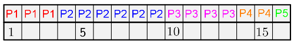
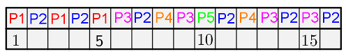
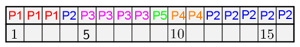

# <center><div class = "titre2"> Exercices </div></center>

### <div class = "encadré_exo"> __Exercice 1__ </div>
On rappelle ici la liste des processus (ainsi que leur date d'arrivée) de l'exemple du cours :
<center markdown = "1">

<table>
<thead>
<tr>
<th align="center" style="vertical-align:middle" class="style">Processus</th>
<th align="center" style="vertical-align:middle">P1</th>
<th align="center" style="vertical-align:middle">P2</th>
<th align="center" style="vertical-align:middle">P3</th>
<th align="center" style="vertical-align:middle">P4</th>
<th align="center" style="vertical-align:middle">P5</th>
</tr>
</thead>
<tbody>
<tr>
<td align="center" style="vertical-align:middle" class="style">Durée en quantum</td>
<td align="center" style="vertical-align:middle"><math><mo>3</mo></math></td>
<td align="center" style="vertical-align:middle"><math><mo>6</mo></math></td>
<td align="center" style="vertical-align:middle"><math><mo>4</mo></math></td>
<td align="center" style="vertical-align:middle"><math><mo>2</mo></math></td>
<td align="center" style="vertical-align:middle"><math><mo>1</mo></math></td>
</tr>
<tr>
<td align="center" style="vertical-align:middle" class="style">Date d'arrivée</td>
<td align="center" style="vertical-align:middle"><math><mo>0</mo></math></td>
<td align="center" style="vertical-align:middle"><math><mo>1</mo></math></td>
<td align="center" style="vertical-align:middle"><math><mo>4</mo></math></td>
<td align="center" style="vertical-align:middle"><math><mo>6</mo></math></td>
<td align="center" style="vertical-align:middle"><math><mo>7</mo></math></td>
</tr>
</tbody></table>

</center>

On donne ci-dessous les schémas d'ordonnancement pour les modèles __FIFO__, __Round Robin (RR)__ et __SRT__ :

Modèle __FIFO__ : $~~~~~~~~$

Modèle __RR__ : $~~~~~~~~~~$

Modèle __SRT__ : $~~~~~~~~$
<br>  
<div class="list1_1" markdown="1">

1. Vérifier que ces 3 schémas correspondent bien aux différents modèles.
2. Pour chaque modèle, déterminer le temps moyen d'exécution et le temps moyen d'attente.
3. Quel est celui qui est préférable pour traiter ces processus ?
</div>
<center markdown = "1">
[Correction de l'exercice 1 :material-cursor-default-click:](Correction.md#correction-de-lexercice-1){:target="_blank" .md-button}
</center>

### <div class = "encadré_exo"> __Exercice 2__ </div>
On considère 3 processus __P1__, __P2__ et __P3__ et 3 ressources __R1__, __R2__ et __R3__ tels que :
<div class="decal3" markdown="1">
<div class="couleur_puce19" markdown="1">

* __P1__ : demande __R1__, demande __R2__, libère __R1__, libère __R2__.
* __P2__ : demande __R2__, demande __R3__, libère __R2__, libère __R3__.
* __P3__ : demande __R3__, demande __R1__, libère __R3__, libère __R1__.

</div>
</div>
<div class="list1_1" markdown="1">

1. Si les processus sont exécutés l’un après l’autre, d’abord __P1__ puis __P2__ et enfin __P3__, y-a-t-il interblocage ?
2. Décrire une exécution des 3 processus qui conduit à une situation d’interblocage.

</div>
<center markdown = "1">
[Correction de l'exercice 2 :material-cursor-default-click:](Correction.md#correction-de-lexercice-2){:target="_blank" .md-button}
</center>

### <div class = "encadré_exo"> __Exercice 3__ </div>

On considère la situation suivante dans laquelle 4 voitures sont bloquées à une intersection :

{: .image}

Montrer qu'il s'agit d'un interblocage, c'est-à-dire que les quatre conditions de Coffman sont réunies.
<span style="display: block; margin: 5px 0 0 0;">On indiquera précisément quelles sont les ressources et les processus dans cette situation.</span>
<span style="display: block; margin: 5px 0 0 0;">On fera également l'hypothèse que les conducteurs sont raisonnables, c'est-à-dire qu'ils ne veulent pas provoquer d'accident !</span>

<center markdown = "1">
[Correction de l'exercice 3 :material-cursor-default-click:](Correction.md#correction-de-lexercice-3){:target="_blank" .md-button}
</center>

### <div class = "encadré_exo"> __Exercice 4__ </div> 
<center>*D'après 2021, Métropole, Candidats Libres, J2, Ex. 2*</center>

Les états possibles d'un processus sont : prêt, élu, terminé et bloqué.
<div class="list1_1" markdown="1">

1. Expliquer à quoi correspond l'état élu.
2. Proposer un schéma illustrant les passages entre les différents états.  
3. On suppose que quatre processus C1, C2, C3 et C4 sont créés sur un ordinateur, et qu'aucun autre processus n'est lancé sur celui-ci, ni préalablement ni pendant l'exécution des quatre processus. L'ordonnanceur, pour exécuter les différents processus prêts, les place dans une structure de données de type file. Un processus prêt est enfilé et un processus élu est défilé.
<span style="display: block; margin: 8px 0 0 0;">Parmi les propositions suivantes, recopier celle qui décrit le fonctionnement des entrées/sorties dans une file :</span>

</div>
<div class="decal15" markdown="1">
<div class="couleur_puce14etoi" markdown="1">

* Premier entré, dernier sorti
* Premier entré, premier sorti
* Dernier entré, premier sorti

</div>
</div>
<div class="list1_4" markdown="1">

4. On suppose que les quatre processus arrivent dans la file et y sont placés dans l'ordre C1, C2, C3 et C4 . Les temps d'exécution totaux de C1, C2, C3 et C4 sont respectivement 100 ms, 190 ms, 80 ms et 60 ms.

</div>
<div class="decal15" markdown="1">
<div class="couleur_puce14etoi" markdown="1">

* Après 40 ms d'exécution, le processus C1 demande une opération d'écriture disque, opération qui dure 200 ms. Pendant cette opération d'écriture, le processus C1 passe à l'état bloqué.
* Après 20 ms d'exécution, le processus C3 demande une opération d'écriture disque, opération qui dure 10 ms. Pendant cette opération d'écriture, le processus C3 passe à l'état bloqué.

</div>
</div>
<div class="decal3" markdown="1">

Faire une frise chronologique et y indiquer les états de tous les processus.

</div>
<div class="list1_5" markdown="1">

5. Ci-dessous deux programmes en pseudo-code sont présentés.
<span style="display: block; margin: 5px 0 0 0;">Verrouiller un fichier signifie que le programme demande un accès exclusif au fichier et l'obtient si le fichier est disponible.</span>

</div>
<div class="decal3" markdown="1">
<center markdown="1">

| Programme 1               | Programme 2                | 
| :-----------------------: | :------------------------: | 
|   Verrouiller fichier_1    |   Verrouiller fichier_2        | 
|   Calculs sur fichier_1    |  Verrouiller fichier_1      | 
|  Verrouiller fichier_2     |   Calculs sur fichier_1         | 
|  Calculs sur fichier_1  | Calculs sur fichier_2 |
|Calculs sur fichier_2  | Déverrouiller fichier_1|
|Calculs sur fichier_1   |Déverrouiller fichier_2 |
|Déverrouiller fichier_2  |   
|Déverrouiller fichier_1   |  

</center>
En supposant que les processus correspondant à ces programmes s'exécutent simultanément (exécution concurrente), expliquer le problème qui peut être rencontré.

</div>
<div class="list1_6" markdown="1">

6. Proposer une modification du programme 2 permettant d'éviter ce problème.

</div>
<center markdown = "1">
[Correction de l'exercice 4 :material-cursor-default-click:](Correction.md#correction-de-lexercice-4){:target="_blank" .md-button}
</center>

### <div class = "encadré_exo"> __Exercice 5__ </div> 
<center markdown = "1">*D'après 2022, Polynésie, J1, Ex. 2, modifié*</center>   

Un système est composé de 4 périphériques, numérotés de 0 à 3, et d'une mémoire, reliés entre eux par un bus auquel est également connecté un dispositif ordonnanceur. À l'aide d'un signal spécifique envoyé sur le bus, l'ordonnanceur sollicite à tour de rôle les périphériques pour qu'ils indiquent le type d'opération (lecture ou écriture) qu'ils souhaitent effectuer, et l'adresse mémoire concernée.
<span style="display: block; margin: 8px 0 0 0;">Un tour a lieu quand les 4 périphériques ont été sollicités. __Au début d'un nouveau tour, on considère que toutes les adresses sont disponibles en lecture et écriture.__</span>
<div class="decal15" markdown="1">
<div class="couleur_puce14etoi" markdown="1">

* Si un périphérique demande l'écriture à une adresse mémoire à laquelle on n'a pas encore accédé pendant le tour, l'ordonnanceur répond <span class="code">"OK"</span> et l'écriture a lieu. Si on a déjà demandé la lecture ou l'écriture à cette adresse, l'ordonnanceur répond <span class="code">"ATT"</span> et l'opération n'a pas lieu.
* Si un périphérique demande la lecture à une adresse à laquelle on n'a pas encore accédé en écriture pendant le tour, l'ordonnanceur répond <span class="code">"OK"</span> et la lecture a lieu. Plusieurs lectures peuvent avoir donc lieu pendant le même tour à la même adresse.
* Si un périphérique demande la lecture à une adresse à laquelle on a déjà accédé en écriture, l'ordonnanceur répond <span class="code">"ATT"</span> et la lecture n'a pas lieu.
<span style="display: block; margin: 5px 0 0 0;">Ainsi, pendant un tour, une adresse peut être utilisée soit une seule fois en écriture, soit autant de fois qu'on veut en lecture, soit pas utilisée.</span>
* Si un périphérique ne peut pas effectuer une opération à une adresse, il demande la même opération à la même adresse au tour suivant.

</div>
</div>
<div class="list1_1" markdown="1">

1. Le tableau donné en annexe 1 indique, sur chaque ligne, le périphérique sélectionné, l'adresse à laquelle il souhaite accéder et l'opération à effectuer sur cette adresse. 
<span style="display: block; margin: 5px 0 0 0;">Compléter dans la dernière colonne de cette annexe, à rendre avec la copie, la réponse donnée par l'ordonnanceur pour chaque opération.</span>

</div>
<div class="decal3" markdown="1">

??? abstract "Annexe 1"
    <center markdown="1">

    | N° périphérique   |  Adresse   |  Opération  | Réponse de l'ordonnanceur|
    | :-----------: | :--------------: |  :-----------: | :-------------: | 
    |0 |  <span class="code">10</span> | écriture   | <span class="code">"OK"</span>|
    |1  | <span class="code">11</span>  |lecture |    <span class="code">"OK"</span>|
    |2  | <span class="code">10</span>  |lecture   |  <span class="code">"ATT"</span>|
    |3  | <span class="code">10</span>  |écriture |   <span class="code">"ATT"</span>|
    |0  | <span class="code">12</span> | lecture     ||
    |1  | <span class="code">10</span> | lecture     ||
    |2  | <span class="code">10</span> | lecture     ||
    |3  | <span class="code">10</span> |écriture||

    </center>

</div>
On suppose dans toute la suite que :
<div class="decal3" markdown="1">
<div class="couleur_puce19" markdown="1">

* le périphérique 0 écrit systématiquement à l'adresse <span class="code">10</span> ;
* le périphérique 1 lit systématiquement à l'adresse <span class="code">10</span> ;
* le périphérique 2 écrit alternativement aux adresses <span class="code">11</span> et <span class="code">12</span> ;
* le périphérique 3 lit alternativement aux adresses <span class="code">11</span> et <span class="code">12</span>.

</div>
</div>
Pour les périphériques 2 et 3, le changement d'adresse n'est effectif que lorsque l'opération est réalisée.
<div class="list1_2" markdown="1">

2. On suppose que les périphériques sont sélectionnés à chaque tour dans l'ordre 0 ; 1 ; 2 ; 3. 
<span style="display: block; margin: 5px 0 0 0;">Expliquer ce qu'il se passe pour le périphérique 1.</span>

</div>
Les périphériques sont sollicités de la manière suivante lors de quatre tours successifs :
<div class="decal3" markdown="1">
<div class="couleur_puce19" markdown="1">

* au premier tour, ils sont sollicités dans l'ordre 0 ; 1 ; 2 ; 3 ;
* au deuxième tour, dans l'ordre 1 ; 2 ; 3 ; 0 ;
* au troisième tour, 2 ; 3 ; 0 ; 1 ;
* puis 3 ; 0 ; 1 ; 2 au dernier tour.
* Et on recommence...

</div>
</div>
<div class="list1_3_a" markdown="1">

1. Préciser pour chacun de ces tours si le périphérique 0 peut écrire et si le périphérique 1 peut lire.
2. En déduire la proportion des valeurs écrites par le périphérique 0 qui sont effectivement lues par le périphérique 1.

</div>
On change la méthode d'ordonnancement : on détermine l'ordre des périphériques au cours d'un tour à l'aide de deux listes d'attente <span class="code">ATT_L</span> et <span class="code">ATT_E</span> établies au tour précédent.
<span style="display: block; margin: 8px 0 0 0;">Au cours d'un tour, on place dans la liste <span class="code">ATT_L</span> toutes les opérations de lecture mises en attente, et dans la liste d'attente <span class="code">ATT_E</span> toutes les opérations d'écriture mises en attente.</span>
<span style="display: block; margin: 8px 0 0 0;">Au début du tour suivant, on établit l'ordre d'interrogation des périphériques en procédant ainsi :</span>
<div class="decal3" markdown="1">
<div class="couleur_puce19" markdown="1">

* on interroge ceux présents dans la liste <span class="code">ATT_L</span>, par ordre croissant d'adresse ;
* on interroge ensuite ceux présents dans la liste <span class="code">ATT_E</span>, par ordre croissant d'adresse ;
* puis on interroge les périphériques restants, par ordre croissant d'adresse.

</div>
</div>
<div class="list1_4" markdown="1">

4. Compléter et rendre avec la copie le tableau fourni en annexe 2, en utilisant l'ordonnancement décrit ci-dessus, sur 3 tours.

</div>

??? abstract "Annexe 2"
    <center markdown="1">

    |<span style="font-size: 0.8rem;">Tour</span>    |<span style="font-size: 0.8rem;">N° périphérique</span>   |  <span style="font-size: 0.8rem;">Adresse</span>  |   <span style="font-size: 0.8rem;">Opération</span>|   <span style="font-size: 0.8rem;">Réponse ordonnanceur</span> |   <span style="font-size: 0.8rem;"><span class="code1">ATT_L</span></span>  | <span style="font-size: 0.8rem;"><span class="code1">ATT_E</span></span>|
    | :-------: | :----------: | :---------: | :--------: |  :-------: | :-------: | :-------: | 
    |1  | 0   |<span class="code">10</span>  |écriture  |  <span class="code">"OK"</span>   | vide    |vide|
    |1  | 1  | <span class="code">10</span>  |lecture    | <span class="code">"ATT"</span>  | <span class="code">(1, 10)</span>   |  vide|
    |1 |  2  | <span class="code">11</span>  |écriture  |        |  ||
    |1  | 3  | <span class="code">11</span> | lecture   |        |  ||
    |2  | 1 |  <span class="code">10</span> | lecture   |    |  |    vide|
    |2  |   |     |          |   |||
    |2 |    |    |            |  |||
    |2  |   |    |            |  |||
    |3  | 0 |  <span class="code">10</span> | écriture   |   |  vide  |  vide|
    |3  | 1  | <span class="code">10</span> | lecture    |  |     | vide|
    |3  | 2  | <span class="code">11</span> | écriture  |  <span class="code">"OK"</span> | <span class="code">(1, 10)</span>  |   vide|
    |3  | 3  | <span class="code">12</span> | lecture   |     |  |   |

    </center>

Les colonnes __e0__ et __e1__ du tableau suivant recensent les deux chiffres de l'écriture binaire de l'entier __n__ de la première colonne.
<center markdown="1">

|nombre n   | écriture binaire de n sur deux bits  |   e1 | e0|
| :-------: | :----------: | :---------: | :--------: |
|0 |  00 | 0|   0|
|1 |  01 | 0  | 1|
|2 |  10|  1  | 0|
|3  | 11|  1  | 1|

</center>
L'ordonnanceur attribue à deux signaux sur le bus de données les valeurs de __e0__ et __e1__ associées au numéro du circuit qu'il veut sélectionner. On souhaite construire à l'aide des portes ET, OU et NON un circuit pour chaque périphérique.
<span style="display: block; margin: 5px 0 0 0;">Chacun des quatre circuits à construire prend en entrée deux signaux __e0__ et __e1__, le signal de sortie __s__ valant 1 uniquement lorsque les niveaux de __e0__ et __e1__ correspondent aux bits de l'écriture en binaire du numéro du périphérique correspondant.</span>

Par exemple, le circuit ci-dessous réalise la sélection du périphérique 3. En effet, le signal __s__ vaut 1 si et seulement si __e0__ et __e1__ valent tous les deux 1.

{ .image }
<div class="list1_5_a" markdown="1">

1. Recopier sur la copie et indiquer dans le circuit ci-dessous les entrées __e0__ et __e1__ de façon que ce circuit sélectionne le périphérique 1.
<span style="display: block; margin: 5px 0 0 0;">{ .image }</span>
2. Dessiner un circuit constitué d'une porte ET et d'une porte NON, qui sélectionne le périphérique 2.
3. Dessiner un circuit permettant de sélectionner le périphérique 0.

</div>
<center markdown="1">
[Correction de l'exercice 5 :material-cursor-default-click:](Correction.md#correction-de-lexercice-5){:target="_blank" .md-button}
</center>

### <div class = "encadré_exo"> __Exercice 6__ </div>
<center markdown="1">*D'après 2024, Amérique du Nord, J1, Ex. 1*</center>

Nous étudions quatre processus A, B, C et D qui utilisent des ressources suivantes :
<div class="couleur_puce19" markdown="1">

* un fichier commun aux processus ;
* le clavier de l’ordinateur ;
* le processeur graphique (GPU) ;
* le port 25000 de la connexion Internet.

</div>
Voici le détail de ce que fait chaque processus :
<center markdown="1">

|A  | B |  C|   D|
| :-------: | :----------: | :---------: | :--------: |
|acquérir le GPU   |  acquérir le clavier   |  acquérir le port |  acquérir le fichier|
|faire des calculs  | acquérir le fichier |    faire des calculs |  faire des calculs|
|libérer le GPU | libérer le clavier | libérer le port   |  acquérir le clavier|
  | | libérer le fichier |    |   libérer le clavier|
  |   |  |   |  libérer le fichier|

</center>
On a le chronogramme suivant : 

{ .image width=80%}

Montrer que l’ordre d’exécution donné aboutit à une situation d’interblocage.

<center markdown="1">
[Correction de l'exercice 6 :material-cursor-default-click:](Correction.md#correction-de-lexercice-6){:target="_blank" .md-button}
</center>

### <div class = "encadré_exo"> __Exercice 7__ </div>
Considérons un petit système embarqué : un petit ordinateur relié à trois LED *A*, *B* et *C*.  
Une LED peut être éteinte ou allumée et on peut configurer sa couleur.  
On dispose de trois programmes qui affichent des signaux lumineux en faisant clignoter les LED.  
Chaque programme possède une LED primaire et une LED secondaire. 
<div class="couleur_puce14etoi" markdown="1">

* Le programme P<sub>1</sub> affiche ses signaux sur *A* (primaire) et *B* (secondaire) en vert. 
* Le programme P<sub>2</sub> affiche ses signaux sur *B* (primaire) et *C* (secondaire) en orange. 
* Enfin, le programme P<sub>3</sub> affiche ses signaux sur *C* (primaire) et *A* (secondaire) en rouge. 

</div>
Comme les LED ne supportent pas d'être configurées dans deux couleurs en même temps, le système propose deux primitives `acquerirLED(nom)` et `rendreLED(nom)` qui permettent respectivement d'acquérir et de relâcher une LED.  
<span style="display: block; margin: 8px 0 0 0;">Si une LED est déjà acquise, alors `acquerirLED()` bloque.</span>
<span style="display: block; margin: 8px 0 0 0;">On suppose que chacun des trois programmes P<sub>1</sub>, P<sub>2</sub> et P<sub>3</sub> effectue les actions suivantes en boucle :</span>
<div class="decal2" markdown="1">
<div class="list1_a" markdown="1">

1. acquérir sa LED primaire
2. acquérir sa LED secondaire
3. configurer les couleurs
4. émettre des signaux
5. rendre la LED secondaire
6. rendre le LED primaire
7. recommencer en <span style="color: #f36379; font-weight: bold">a.</span>

</div>
</div>
<div class="list1_1" markdown="1">

1. Ecrire un programme Python simulant le code de cet exercice.
2. Constater qu'en exécutant suffisamment de fois le programme, il se bloque.  

</div>

??? notes2 "__Indication__"
    Afin de laisser plus de chance au système de changer de contexte, on pourra mettre des affichages juste après l'acquisition d'un verrou. En effet, l'écriture dans la console passe le *thread* courant en attente, le temps que les écritures soient effectuées, ce qui laisse une opportunité à l'ordonnanceur de choisir un autre *thread* ou un autre processus.

??? tools1 "Aide : un canevas à compléter"
    On peut utiliser un dictionnaire indicé par les noms des LED pour y stocker les verrous correspondants.  
    Vous pouvez compléter le programme préparatoire ci-dessous :

    ```python
    
    ##-----Importation des Modules-----##
    import threading
    
    verrouLED = {}
    for elt in ['A', 'B', 'C']:
        verrouLED[elt] = threading.Lock()

    def acquerirLED(nom):
        pass

    def rendreLED(nom):
        pass

    def prog(n, LEDPrim, LEDSec):
        pass

    p1 = threading.Thread(target = prog, args = [1, 'A', 'B'])
    p2 = threading.Thread(target = prog, args = [2, 'B', 'C'])
    p3 = threading.Thread(target = prog, args = [3, 'C', 'A'])

    p1.start()
    p2.start()
    p3.start()
    ```

<center markdown="1">
[Correction de l'exercice 7 :material-cursor-default-click:](Correction.md#correction-de-lexercice-7){:target="_blank" .md-button}
</center>